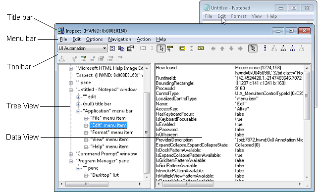

Pruebas de accesibilidad
===============================================================================

\[ Actualizado para aplicaciones para UWP en Windows 10. Para leer más artículos sobre Windows 8.x, consulta el [archivo](http://go.microsoft.com/fwlink/p/?linkid=619132) \]

Procedimientos de prueba que te permitirán asegurarte de que se puede acceder a tu aplicación para Plataforma universal de Windows (UWP).

Ejecutar herramientas de prueba de accesibilidad
-----------------------------------------------------------------------------------------------------------------------------------

El Kit de desarrollo de software (SDK) de Windows incluye varias herramientas de prueba de accesibilidad, como [**AccScope**](https://msdn.microsoft.com/library/windows/desktop/Dn433239), [**Inspect**](https://msdn.microsoft.com/library/windows/desktop/Dd318521) y [**UI Accessibility Checker**](https://msdn.microsoft.com/library/windows/desktop/Hh920985). Estas herramientas pueden ayudarte a comprobar la accesibilidad de tu aplicación. Asegúrate de comprobar todos los escenarios de aplicación y los elementos de la interfaz de usuario.

Puedes iniciar las herramientas de prueba de accesibilidad desde un símbolo del sistema de Microsoft Visual Studio o desde la carpeta de herramientas de Windows SDK (el subdirectorio "bin" donde se ha instalado Windows SDK en la máquina de desarrollo).

### **AccScope**

La herramienta [**AccScope**](https://msdn.microsoft.com/library/windows/desktop/Dn433239) permite que los desarrolladores y los evaluadores evalúan la accesibilidad de su aplicación durante la fase de desarrollo y diseño de la aplicación, posiblemente en fases prototipo anteriores, en lugar de hacerlo en las fases de prueba más avanzadas del ciclo de desarrollo de la aplicación. Está diseñada especialmente para probar los escenarios de accesibilidad de la característica Narrador con la aplicación.

### **Inspect**

[**Inspect**](https://msdn.microsoft.com/library/windows/desktop/Dd318521) te permite seleccionar cualquier elemento de la interfaz de usuario y ver sus datos de accesibilidad. Puedes ver los modelos de control y las propiedades de Automatización de la interfaz de usuario de Microsoft y probar la estructura de navegación de los elementos de automatización en el árbol de automatización de la interfaz de usuario. Usa **Inspect** mientras desarrollas la interfaz de usuario para comprobar cómo los atributos de accesibilidad se exponen en la automatización de la interfaz de usuario. En algunos casos, los atributos provienen de la compatibilidad para la automatización de la interfaz de usuario que ya viene implementada en los controles XAML predeterminados. En otros casos, los atributos provienen de valores específicos que definiste en el marcado XAML, como propiedades adjuntas [**AutomationProperties**](https://msdn.microsoft.com/library/windows/apps/BR209081).

En la siguiente imagen se muestra la herramienta [**Inspect**](https://msdn.microsoft.com/library/windows/desktop/Dd318521) consultando las propiedades de Automatización de la interfaz de usuario del elemento de menú **Editar** del Bloc de notas.

### **UI Accessibility Checker**

**UI Accessibility Checker (AccChecker)** te ayuda a detectar problemas de accesibilidad en tiempo de ejecución. Cuando la interfaz de usuario esté completa y en funcionamiento, usa **AccChecker** para probar diferentes escenarios, comprobar si la información de accesibilidad en tiempo de ejecución es correcta y detectar problemas en tiempo de ejecución. Puedes ejecutar **AccChecker** en el modo de línea de comandos o de interfaz de usuario. Para ejecutar la herramienta en modo de interfaz de usuario, abre el directorio de **AccChecker** en el directorio "bin" de Windows SDK, ejecuta acccheckui.exe y haz clic en el menú **Ayuda**.

### **UI Automation Verify**

**UI Automation Verify (UIA Verify)** es un marco de prueba y comprobación automatizado para implementaciones de automatización de la interfaz de usuario. **UIA Verify** puede integrarse en el código de prueba y realizar pruebas automatizadas periódicas o comprobaciones puntuales de los escenarios de automatización de la interfaz de usuario. Para ejecutar **UIA Verify**, ejecuta VisualUIAVerifyNative.exe desde el subdirectorio UIAVerify.

### **Accessible Event Watcher**

[**Accessible Event Watcher (AccEvent)**](https://msdn.microsoft.com/library/windows/desktop/Dd317979) prueba si los elementos de la interfaz de usuario de una aplicación generan eventos adecuados de automatización de la interfaz de usuario y Microsoft Active Accessibility cuando se hacen cambios en la interfaz de usuario. Se pueden producir cambios en la interfaz de usuario cuando cambia el foco, cuando se invoca o se selecciona un elemento de la interfaz de usuario o cambia uno de sus estados o propiedades.

**Nota**: La mayoría de las herramientas de prueba de accesibilidad mencionadas en la documentación se ejecutan en un equipo, no en un teléfono. Puedes ejecutar algunas herramientas mientras desarrollas y usas un emulador, aunque la mayoría de estas herramientas no pueden exponer el árbol de automatización de la interfaz de usuario en el emulador.

 

Probar la accesibilidad de teclado
-----------------------------------------------------------------------------------------------------------------------

La mejor manera de probar tu accesibilidad de teclado es desconectar el mouse o usar el teclado en pantalla si estás usando un dispositivo de tableta. Prueba la navegación de accesibilidad de teclado usando la tecla TAB. Debes poder recorrer todos los elementos interactivos de la interfaz de usuario usando la tecla TAB. Para los elementos compuestos de la interfaz de usuario, comprueba si puedes navegar por las diferentes partes de los elementos usando las teclas de dirección. Por ejemplo, deberías poder navegar por listas de elementos con las teclas de dirección. Finalmente, asegúrate de que puedas invocar a todos los elementos interactivos de la interfaz de usuario con el teclado una vez que esos elementos tengan el foco, normalmente usando la tecla Entrar o Barra espaciadora.

Comprobar la relación de contraste del texto visible
-----------------------------------------------------------------------------------------------------------------------------------------------------------------

Usa herramientas de contraste de color para comprobar que la relación de contraste del texto visible sea aceptable. Algunas excepciones son los elementos de interfaz de usuario inactivos y los logotipos o el texto decorativo que no transmiten ninguna información y pueden reordenarse sin cambiar el significado. Consulta el tema sobre [requisitos de texto accesible](accessible-text-requirements.md) para obtener más información sobre excepciones y relación de contraste. Consulta las [técnicas de WCAG 2.0 G18 (sección sobre recursos)](http://www.w3.org/TR/WCAG20-TECHS/G18.html#G18-resources) para ver las herramientas que pueden probar las relaciones de contraste.

**Nota**: Algunas de las herramientas indicadas en el tema sobre las técnicas de WCAG 2.0 G18 no se pueden usar de manera interactiva con una aplicación de la Tienda Windows. Es posible que debas escribir manualmente en la herramienta los valores de color de primer plano y fondo, realizar capturas de pantalla de la interfaz de usuario de la aplicación y luego ejecutar la herramienta de relación de contraste sobre la imagen de la captura de pantalla, o ejecutar la herramienta a la vez que abres los archivos de mapa de bits en un programa de edición de imágenes en lugar de hacerlo al cargar la imagen en la aplicación.

 

Comprobar la aplicación en contraste alto
--------------------------------------------------------------------------------------------------------------------------------------

Usa tu aplicación mientras esté activo un tema de contraste alto para comprobar que todos los elementos de la interfaz de usuario se muestren correctamente. Todo el texto debe poder leerse y todas las imágenes deben verse con claridad. Ajusta las plantillas de control o los recursos XAML del diccionario de temas para corregir cualquier problema en los temas que provenga de los controles. En los casos en que los problemas de contraste alto destacados no provengan de temas o controles (por ejemplo, archivos de imagen), proporciona versiones diferentes para usar cuando esté activo un tema de contraste alto.

Comprobar la aplicación con configuración de pantalla
-----------------------------------------------------------------------------------------------------------------------------------------------------------------------------------------------

Usa las opciones de pantalla del sistema para ajustar el valor de puntos por pulgada (ppp) de la pantalla y asegúrate de que la interfaz de usuario de la aplicación se escala correctamente cuando cambie el valor de ppp. (Algunos usuarios cambian los valores de ppp como una opción de accesibilidad. Esta opción está disponible en **Accesibilidad** y en las propiedades de pantalla). Si encuentras algún problema, sigue las [Directrices sobre la experiencia del usuario para diseño y escalado](https://msdn.microsoft.com/library/windows/apps/Dn611863) y proporciona recursos adicionales para diferentes factores de escala.

Comprobar los escenarios de aplicaciones principales mediante el uso de Narrador
-----------------------------------------------------------------------------------------------------------------------------------------------------------------------

Si quieres usar Narrador para probar la experiencia de lectura en pantalla de la aplicación, haz lo siguiente:

**Utiliza estos pasos para probar cómo funciona la aplicación utilizando el Narrador con un mouse y un teclado:**

1.  Inicia el Narrador presionando la tecla del logotipo de Windows y Entrar.
2.  Navega por la aplicación con el teclado utilizando la tecla Tab, las teclas de dirección y la combinación de tecla Bloq Mayús + teclas de dirección.
3.  Conforme estás navegando por la aplicación, escucha cómo lee Narrador los elementos de la interfaz de usuario y comprueba lo siguiente:
    -   En cada control, asegúrate de que el Narrador lee todo el contenido visible. Comprueba también que el Narrador lee el nombre de cada control, los estados aplicables (comprobado, seleccionado, etc.) y los tipos de control (botón, casilla, elemento de lista, etc.).
    -   Si el elemento es interactivo, comprueba que puedes usar el Narrador para invocar su acción presionando las teclas Bloq Mayús + Barra espaciadora.
    -   En cada tabla, asegúrate de que Narrador lea correctamente el nombre de la tabla, su descripción (si está disponible) y los encabezados de fila y columna.

4.  Presiona Bloq Mayús + Entrar para buscar la aplicación y comprobar que todos los controles aparecen en la lista de búsqueda y que los nombres de los controles están localizados y se pueden leer.
5.  Apaga el monitor e intenta lograr los escenarios utilizando solamente el teclado y el Narrador. Para obtener la lista completa de los comandos y accesos directos del Narrador, presiona Bloq Mayús + F1.

**Usa estos pasos para probar la aplicación con el modo táctil de Narrador:**

**Nota**: Narrador inicia automáticamente el modo táctil en los dispositivos que admiten más de cuatro contactos. Narrador no admite escenarios de varios monitores o digitalizadores multitáctiles en la pantalla principal.

 

1.  Familiarízate con la interfaz de usuario y analiza el diseño.

    -   **Navega por la interfaz de usuario mediante gestos de deslizar rápidamente con un solo dedo.** Usa los deslizamientos rápidos hacia la derecha o hacia la izquierda para moverte entre los elementos y hacia arriba o hacia abajo para cambiar la categoría de los elementos por los que navegas. Las categorías incluyen todos los elementos, los vínculos, las tablas, los encabezados, etc. La navegación con gestos de deslizar rápidamente con un solo dedo es similar a navegar con Bloq Mayús + flecha.
    -   **Usa gestos de tabulación para desplazarte por los elementos activables.** Un deslizamiento con tres dedos hacia la derecha o hacia la izquierda es lo mismo que navegar con TAB y Mayús + TAB en un teclado.
    -   **Investiga espacialmente la interfaz de usuario con un solo dedo.** Arrastra un dedo hacia arriba y abajo o hacia la derecha y la izquierda, para que Narrador lea los elementos bajo el dedo. Puedes usar el mouse como alternativa puesto que usa la misma lógica de posicionamiento que se utiliza al arrastrar un dedo.
    -   **Lee toda la ventana y todo su contenido deslizando tres dedos hacia arriba**. Esto equivale a usar Bloq Mayús + W.

    Si hay partes importantes de la interfaz de usuario a las que no puedes acceder, es posible que tengas un problema de accesibilidad.

2.  Interactúa con un control para probar sus acciones principales y secundarias, así como su comportamiento de desplazamiento.

    Entre las acciones principales se incluyen cosas como activar un botón, colocar un símbolo de intercalación de texto y establecer el foco al control. Entre las acciones secundarias se incluyen algunas como seleccionar un elemento de la lista o expandir un botón que ofrece varias opciones.

    -   Para probar una acción principal: pulsa dos veces o presiona con un dedo y pulsa con el otro.
    -   Para probar una acción secundaria: pulsa tres veces o presiona con un dedo y pulsa dos veces con el otro.
    -   Para probar el comportamiento de desplazamiento: pasa dos dedos para realizar desplazamientos en la dirección que desees.

    Algunos controles proporcionan acciones adicionales. Para mostrar la lista completa, realiza una pulsación con cuatro dedos.

    Si un control responde al mouse o al teclado, pero no responde a una interacción táctil principal o secundaria, es posible que el control necesite implementar patrones de control de [Automatización de la interfaz de usuario](https://msdn.microsoft.com/library/windows/desktop/Ee684009).

También debes considerar la posibilidad de usar la herramienta [**AccScope**](https://msdn.microsoft.com/library/windows/desktop/Dn433239) para probar los escenarios de accesibilidad de Narrador con tu aplicación. El tema sobre la herramienta [**AccScope**](https://msdn.microsoft.com/library/windows/desktop/Dn433239) describe cómo configurar **AccScope** para probar los escenarios de Narrador.

Examinar la representación de la automatización de la interfaz de usuario para tu aplicación
-----------------------------------------------------------------------------------------------------------------------------------------------------------------------------------------------------------------------------------------------------------------------------

Algunas de las herramientas de prueba de Automatización de la interfaz de usuario antes mencionadas permiten ver la aplicación sin tener en cuenta deliberadamente su aspecto, sino que la representa como una estructura de elementos de Automatización de la interfaz de usuario. Así es como los clientes de Automatización de la interfaz de usuario, en especial las tecnologías de asistencia, interactuarán con tu aplicación en escenarios de accesibilidad.

La herramienta [**AccScope**](https://msdn.microsoft.com/library/windows/desktop/Dn433239) proporciona un punto de vista interesante sobre la aplicación porque permite ver los elementos de Automatización de la interfaz de usuario como una representación visual o como una lista. Si usas la visualización, puedes examinar con detalle las partes de forma que puedas relacionarlas con el aspecto visual de la interfaz de usuario de la aplicación. Incluso puedes probar la accesibilidad de los primeros prototipos de la interfaz de usuario antes de asignar toda la lógica a la interfaz de usuario, para asegurarte de que tanto la interacción visual como la navegación en escenarios de accesibilidad para la aplicación estén equilibradas.

Un aspecto que puedes probar es si en la vista de elementos de Automatización de la interfaz de usuario aparecen elementos que no quieres que aparezcan allí. Si encuentras elementos que quieres omitir de la vista o, por el contrario, si faltan elementos, puedes usar la propiedad adjunta XAML [**AutomationProperties.AccessibilityView**](https://msdn.microsoft.com/library/windows/apps/BR209081_accessibilityview) para ajustar cómo aparecerán los controles XAML en las vistas de accesibilidad. Después de revisar las vistas de accesibilidad básicas, es un buen momento para volver a comprobar las secuencias de tabulación o la navegación espacial habilitadas por las teclas de dirección para asegurarte de que los usuarios llegan a todos los elementos interactivos y que se exponen en la vista control.

Temas relacionados
-----------------------------------------------

* [Accesibilidad](accessibility.md)
* [Procedimientos que deben evitarse](practices-to-avoid.md)
* [Automatización de la interfaz de usuario](https://msdn.microsoft.com/library/windows/desktop/Ee684009)
* [Accesibilidad en Windows](http://go.microsoft.com/fwlink/p/?LinkId=320802)
 

 

<!--HONumber=Mar16_HO3-->

