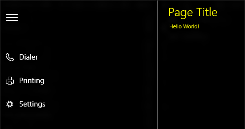

# Temas de contraste alto  

Describe los pasos necesarios para asegurarte que una aplicación para la Plataforma universal de Windows (UWP) pueda usarse cuando un tema de contraste alto esté activo.

De manera predeterminada, una aplicación para UWP admite temas de contraste alto. Si un usuario elige que el sistema use un tema de contraste alto en la configuración del sistema o en las herramientas de accesibilidad, el marco usa automáticamente la configuración de colores y estilos que producen un diseño y una representación de contraste alto para los controles y los componentes de la interfaz de usuario.

Esta compatibilidad predeterminada se basa en el uso de temas y plantillas predeterminados. Estos temas y plantillas hacen referencia a colores del sistema como definiciones de recursos, y los orígenes de los recursos se modifican automáticamente cuando el sistema usa un modo de contraste alto. Sin embargo, si usas estilos, temas y plantillas personalizados para el control, ten cuidado de no deshabilitar la compatibilidad integrada para contraste alto. Si usas uno de los diseñadores XAML para Microsoft Visual Studio para la aplicación de estilos, el diseñador generará un tema de contraste alto independiente junto con el tema principal siempre que definas una plantilla que sea significativamente diferente a la predeterminada. Los diccionarios de temas independientes se incluyen en la colección [**ThemeDictionaries**](https://msdn.microsoft.com/library/windows/apps/windows.ui.xaml.resourcedictionary.themedictionaries.aspx), una propiedad dedicada de un elemento [**ResourceDictionary**](https://msdn.microsoft.com/library/windows/apps/BR208794).

Para más información sobre temas y plantillas de control, consulta [Inicio rápido: plantillas de control](https://msdn.microsoft.com/library/windows/apps/xaml/Hh465374). Resulta muy revelador consultar controles específicos en los temas y diccionarios de recursos XAML y ver cómo se construyen estos temas y cómo hacen referencia a recursos que son similares, aunque diferentes para cada posible valor de contraste alto.

## Diccionarios de temas

Si es necesario cambiar un color respecto a su valor predeterminado del sistema o se necesita agregar imágenes como elemento decorativo, como una imagen de fondo, crea una colección de **ThemeDictionaries** para la aplicación.

* Comienza con la creación de las asociaciones adecuadas, si aún no existen. En App.xaml, crea una colección de **ThemeDictionaries**:

``` xaml
 <Application.Resources>
    <ResourceDictionary>
        <ResourceDictionary.ThemeDictionaries>
            <!-- Default is a fallback if a more precise theme isn't called out below -->
            <ResourceDictionary x:Key="Default">

            </ResourceDictionary>
            <!-- HighContrast is used in any high contrast theme -->
            <ResourceDictionary x:Key="HighContrast">

            </ResourceDictionary>
        </ResourceDictionary.ThemeDictionaries>
    </ResourceDictionary>
</Application.Resources
```

* 
            **HighContrast** no es el único nombre de clave disponible. También están **HighContrastBlack**, **HighContrastWhite** y **HighContrastCustom**. En la mayoría de los casos, solo necesitarás **HighContrast**.
* En **Default**, crea el tipo de [**Brush**](http://msdn.microsoft.com/library/windows/apps/xaml/windows.ui.xaml.media.brush.aspx) que necesites, normalmente un **SolidColorBrush**. Dale un nombre de **x: Key** que resulte específico para su uso:<br/>
    `<SolidColorBrush x:Key="BrandedPageBackground" />`
* Asígnale el **Color** que desees:<br/>
    `<SolidColorBrush x:Key="BrandedPageBackground" Color="Red" />`
* Copia ese **Brush** en **HighContrast**:

``` xaml
<Application.Resources>
    <ResourceDictionary>
        <ResourceDictionary.ThemeDictionaries>
            <!-- Default is a fallback if a more precise theme isn't called out below -->
            <ResourceDictionary x:Key="Default">
                <SolidColorBrush x:Key="BrandedPageBackground" Color="Red" />
            </ResourceDictionary>
            <!-- HighContrast is used in any high contrast theme -->
            <ResourceDictionary x:Key="HighContrast">
                <SolidColorBrush x:Key="BrandedPageBackground" Color="Red" />
            </ResourceDictionary>
        </ResourceDictionary.ThemeDictionaries>
    </ResourceDictionary>
</Application.Resources>
```

* Determina de qué color debería ser el **Brush** y modifícalo en **HighContrast**.

Determinar un color para contraste alto requiere un poco de aprendizaje. Las asociaciones que has creado anteriormente son fáciles de actualizar.

## Colores de contraste alto

Los usuarios pueden cambiar a contraste alto mediante la página de configuración. De manera predeterminada, hay 4 temas de contraste alto. Una vez que el usuario selecciona una opción, la página muestra una vista previa del probable aspecto de las aplicaciones.

<br/>
_Configuración de contraste alto_

 Puedes hacer clic en todos los cuadrados de la vista previa para cambiar su valor. Asimismo, cada cuadrado se asigna directamente a un recurso del sistema.

<br/>
_Recursos de contraste alto_

Si das a los nombres indicados anteriormente el prefijo _SystemColor_ y el sufijo _Color_, por ejemplo, **SystemColorWindowTextColor**, estos se actualizarán dinámicamente para que coincidan con lo que haya especificado el usuario. Esto evita tener que seleccionar un color específico para contraste alto. En su lugar, elige un recurso del sistema que se corresponda con la finalidad del color. En el ejemplo anterior, hemos denominado al color de fondo de nuestra página **SolidColorBrushBrandedPageBackground**. Dado que se utilizará para un fondo, podemos asignarlo al **SystemColorWindowColor** en contraste alto:

``` xaml
<Application.Resources>
    <ResourceDictionary>
        <ResourceDictionary.ThemeDictionaries>
            <!-- Default is a fallback if a more precise theme isn't called out below -->
            <ResourceDictionary x:Key="Default">
                <SolidColorBrush x:Key="BrandedPageBackground" Color="Red" />
            </ResourceDictionary>
            <!-- HighContrast is used in any high contrast theme -->
            <ResourceDictionary x:Key="HighContrast">
                <SolidColorBrush x:Key="BrandedPageBackground" Color="{ThemeResource SystemColorWindowColor}" />
            </ResourceDictionary>
        </ResourceDictionary.ThemeDictionaries>
    </ResourceDictionary>
</Application.Resources>
```

Si se respete la paleta de 8 colores de contraste alto, no es necesario crear más **ResourceDictionaries** de contraste alto. Esta paleta limitada suelen presentar retos difíciles a la hora de representar estados visuales complejos. Con frecuencia, agregar un borde únicamente a un área en contraste alto puede ayudar a aclarar una situación.

### Qué hacer y qué no hacer

* Prueba en modo de contraste alto desde el principio y con frecuencia.
* Usa los colores con nombre para su finalidad prevista.
* Pon primitivos como **Color**, **Brush** y **Thickness** dentro de los **ThemeDictionaries**. Evita colocar en ellos recursos más complejos, como elementos **Style**. El siguiente ejemplo funciona bien:

``` xaml
<Application.Resources>
    <ResourceDictionary>
        <ResourceDictionary.ThemeDictionaries>
            <!-- Default is a fallback if a more precise theme isn't called out below -->
            <ResourceDictionary x:Key="Default">
                <SolidColorBrush x:Key="BrandedPageBackground" Color="Red" />
            </ResourceDictionary>
            <!-- HighContrast is used in any high contrast theme -->
            <ResourceDictionary x:Key="HighContrast">
                <SolidColorBrush x:Key="BrandedPageBackground" Color="{ThemeResource SystemColorWindowColor}" />
            </ResourceDictionary>
        </ResourceDictionary.ThemeDictionaries>

        <Style x:Key="MyButtonStyle" TargetType="Button">
            <Setter Property="Foreground" Value="{ThemeResource BrandedPageBackground}" />
        </Style>
    </ResourceDictionary>
</Application.Resources>

...

<Button Style="{StaticResource MyButtonStyle}" />
```

* Usa colores de primer plano de contraste alto para los elementos de la interfaz de usuario en primer plano.
* Usa colores de contraste alto con su par de colores definido. Por ejemplo, usa siempre **BUTTONTEXT** con **BUTTONFACE**, especialmente en una situación de primer y segundo plano.
* Usa el par de colores de contraste alto recomendado para un elemento determinado de la interfaz de usuario con el fin de garantizar que se cumpla la relación de contraste necesaria de 14:1.
* No separes los pares de colores de contraste alto ni mezcles y combines arbitrariamente colores de contraste alto. Esto suele crear una interfaz de usuario invisible para al menos uno de los temas de contraste alto preinstalados.
* No coloques ningún objeto **Brush** que crees fuera de una colección de **ThemeDictionaries**.
* Nunca uses **StaticResource** para hacer referencia a un recurso en una colección de **ThemeDictionaries**. Esto parecerá funcionar hasta que el usuario cambie los temas mientras la aplicación esté en ejecución. En su lugar, usa **ThemeResource**.
* No uses valores de color codificados.
* No uses un color solo porque te guste.

Consulta [Recursos de temas XAML](https://msdn.microsoft.com/windows/uwp/controls-and-patterns/xaml-theme-resources) para obtener más información.

## Cuándo usar bordes
En el modo de contraste alto, agrega bordes a un elemento de la interfaz de usuario cuando sea necesario mantener una forma con límites reconocibles en dicho elemento. Usa bordes para diferenciar entre las áreas de contenido de navegación, acciones y contenido.

<br/>
_Un panel de navegación separado del resto de la página_

Si un elemento de la interfaz de usuario _no_ tienen borde o fondo de manera predeterminada, no agregues un borde ni un fondo para el estado predeterminado en el modo de contraste alto.

Si un elemento de la interfaz de usuario _sí_ tienen un borde de forma predeterminada, conserva dicho borde en el modo de contraste alto.

Los colores superpuestos o adyacentes deben distinguirse unos de otros, pero no es obligatorio que cumplan con la relación de contraste de color de 14:1. Sin embargo, el procedimiento recomendado es una relación de contraste de 3:1 para estos tipos de situaciones.

Si se usan colores de fondo de contraste alto para diferenciar elementos de la interfaz de usuario superpuestos, el único método garantizado para asegurar el contraste entre dichos elementos es introducir bordes.

## Detectar si un tema de contraste alto está habilitado  
Usa miembros de la clase [**AccessibilitySettings**](https://msdn.microsoft.com/library/windows/apps/BR242237) para detectar la configuración actual de los temas de contraste alto. La propiedad [**HighContrast**](https://msdn.microsoft.com/library/windows/apps/windows.ui.viewmanagement.accessibilitysettings.highcontrast) determina si un tema de contraste alto está seleccionado actualmente. Si el valor **HighContrast** está establecido en **true**, el siguiente paso es comprobar el valor de la propiedad [**HighContrastScheme**](https://msdn.microsoft.com/library/windows/apps/windows.ui.viewmanagement.accessibilitysettings.highcontrastscheme) para obtener el nombre del tema de contraste alto que se usa. Los temas "Blanco en contraste alto" y "Negro en contraste alto" normalmente son valores de **HighContrastScheme** a los que el código debería responder. Las claves de [**ResourceDictionary**](https://msdn.microsoft.com/library/windows/apps/BR208794) definidas mediante XAML no pueden tener espacios, por lo que las claves para estos temas en un diccionario de recursos normalmente son "HighContrastWhite" y "HighContrastBlack", respectivamente. También deberías tener una lógica de reserva para un tema de contraste alto predeterminado en caso de que el valor sea alguna otra cadena. 
            En el [ejemplo de contraste alto XAML](http://go.microsoft.com/fwlink/p/?linkid=254993) se muestra esta lógica.

> [!NOTE]
> Asegúrate de llamar al constructor [**AccessibilitySettings**](https://msdn.microsoft.com/library/windows/apps/BR242237) desde un ámbito cuando la aplicación esté inicializada y ya esté mostrando contenido.

Las aplicaciones pueden cambiar para usar valores de recursos de contraste alto mientras la aplicación se encuentra en ejecución. Esto funciona siempre que los recursos se soliciten con la [extensión de marcado {ThemeResource}](https://msdn.microsoft.com/library/windows/apps/Mt185591) en el código XAML del estilo o la plantilla. Todos los temas predeterminados (generic.xaml) usan esta técnica de extensión de marcado {ThemeResource}, por lo que obtendrás este comportamiento si usas los temas de control predeterminados. Los controles personalizados o los estilos de controles personalizados pueden hacerlo si también usaste esta técnica de recurso de extensión de marcado {ThemeResource} en tus plantillas y estilos personalizados.

## Temas relacionados  
* [Accesibilidad](accessibility.md)
* [Ejemplo de configuración y contraste de la interfaz de usuario](http://go.microsoft.com/fwlink/p/?linkid=231539)
* [Ejemplo de accesibilidad XAML](http://go.microsoft.com/fwlink/p/?linkid=238570)
* [Ejemplo de contraste alto XAML](http://go.microsoft.com/fwlink/p/?linkid=254993)
* [**AccessibilitySettings**](https://msdn.microsoft.com/library/windows/apps/BR242237)


<!--HONumber=Jul16_HO1-->


