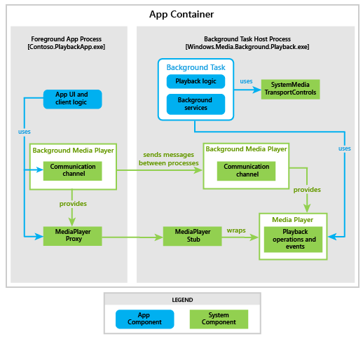

# Reproducción de contenido multimedia heredado en segundo plano

En este artículo se describe el modelo heredado de dos procesos para agregar compatibilidad con audio en segundo plano a tu aplicación para UWP. A partir de Windows 10, versión 1607, se ofrece un modelo de proceso único para audio en segundo plano mucho más fácil de implementar. Para obtener más información sobre las recomendaciones actuales sobre el audio en segundo plano, consulta [Reproducir elementos multimedia en segundo plano](background-audio.md). Este artículo está pensado para proporcionar compatibilidad para las aplicaciones desarrolladas con el modelo de dos procesos heredado.

> [!NOTE]
> A partir de Windows, versión 1703, **BackgroundMediaPlayer** está en desuso y puede no estar disponible en versiones futuras de Windows.

## Arquitectura del audio en segundo plano

Una aplicación que reproduce audio en segundo plano está formada por dos procesos. El primero es la aplicación principal, que contiene la interfaz de usuario de la aplicación y la lógica del cliente, y está en funcionamiento en primer plano. El segundo es la tarea de reproducción en segundo plano, que implementa [**IBackgroundTask**](https://msdn.microsoft.com/library/windows/apps/br224794) como todas las tareas en segundo plano de la aplicación para UWP. La tarea en segundo plano contiene los servicios de segundo plano y lógica de reproducción de audio. La tarea en segundo plano se comunica con el sistema a través de los controles de transporte de medios del sistema.

El siguiente diagrama sirve como descripción general de cómo se diseña el sistema.

## MediaPlayer

El espacio de nombres [**Windows.Media.Playback**](https://msdn.microsoft.com/library/windows/apps/dn640562) contiene las API que se usan para reproducir audio en segundo plano. Hay una sola instancia de [**MediaPlayer**](https://msdn.microsoft.com/library/windows/apps/dn652535) por aplicación a través de la que se está reproduciendo. La aplicación de audio en segundo plano realiza llamadas a métodos y establece propiedades en la clase **MediaPlayer** para definir la pista actual, iniciar la reproducción, detenerla, avanzar rápidamente, rebobinar, etc. Siempre se puede acceder a la instancia del objeto de reproductor multimedia mediante la propiedad [**BackgroundMediaPlayer.Current**](https://msdn.microsoft.com/library/windows/apps/dn652528).

## Proxy y código auxiliar de MediaPlayer

Cuando se accede a **BackgroundMediaPlayer.Current** desde el proceso en segundo plano de la aplicación, se activa la instancia **MediaPlayer** en el host de la tarea en segundo plano y se puede manipular directamente.

Cuando se accede a **BackgroundMediaPlayer.Current** desde la aplicación en primer plano, la instancia **MediaPlayer** que se devuelve es realmente un proxy que se comunica con un código auxiliar en el proceso en segundo plano. Este código auxiliar se comunica con la instancia **MediaPlayer** real, que también está hospedada en el proceso en segundo plano.

El proceso en primer plano y segundo plano pueden tener acceso a la mayoría de las propiedades de la instancia **MediaPlayer**, con la excepción de [**MediaPlayer.Source**](https://msdn.microsoft.com/library/windows/apps/dn987010) y [**MediaPlayer.SystemMediaTransportControls**](https://msdn.microsoft.com/library/windows/apps/dn926635), que solo pueden acceder desde el proceso en segundo plano. La aplicación en primer plano y el proceso en segundo plano pueden recibir notificaciones de eventos específicos de multimedia como [**MediaOpened**](https://msdn.microsoft.com/library/windows/apps/dn652609), [**MediaEnded**](https://msdn.microsoft.com/library/windows/apps/dn652603) y [**MediaFailed**](https://msdn.microsoft.com/library/windows/apps/dn652606).

## Listas de reproducción

Un escenario común para aplicaciones de audio en segundo plano es reproducir varios elementos de forma consecutiva. Esto se consigue más fácilmente en el proceso en segundo plano mediante el uso de un objeto [**MediaPlaybackList**](https://msdn.microsoft.com/library/windows/apps/dn930955), que se puede establecer como un origen de **MediaPlayer** asignándolo a la propiedad [**MediaPlayer.Source**](https://msdn.microsoft.com/library/windows/apps/dn987010).

No es posible acceder a **MediaPlaybackList** del proceso en primer plano que se estableció en el proceso en segundo plano.

## Controles de transporte de contenido multimedia del sistema

Un usuario puede controlar la reproducción de audio sin usar directamente la interfaz de usuario a través de dispositivos Bluetooth, SmartGlass y los controles de transporte de medios del sistema. La tarea en segundo plano usa la clase [**SystemMediaTransportControls**](https://msdn.microsoft.com/library/windows/apps/dn278677) para suscribirse a estos eventos de sistema iniciado por el usuario.

Para obtener una instancia **SystemMediaTransportControls** desde dentro del proceso en segundo plano, usa la propiedad [**MediaPlayer.SystemMediaTransportControls**](https://msdn.microsoft.com/library/windows/apps/dn926635). Las aplicaciones en primer plano obtienen una instancia de la clase llamando a [**SystemMediaTransportControls.GetForCurrentView**](https://msdn.microsoft.com/library/windows/apps/dn278708), pero la instancia devuelta es una instancia de solo en primer plano que no está relacionada con la tarea en segundo plano.

## Enviar mensajes de una tarea a otra

En alguna ocasión te interesará que los dos procesos de una aplicación de audio en segundo plano se comuniquen. Por ejemplo, si quieres que la tarea en segundo plano notifique a la tarea en primer plano que se empieza a reproducir una pista nueva y, además, quieres enviar el título de la nueva canción a la tarea en primer plano para que lo muestre en pantalla.

Un mecanismo de comunicación sencillo genera eventos tanto en el proceso en primer plano como en el proceso en segundo plano. Los métodos [**SendMessageToForeground**](https://msdn.microsoft.com/library/windows/apps/dn652533) y [**SendMessageToBackground**](https://msdn.microsoft.com/library/windows/apps/dn652532), cada uno por separado, invocan eventos en el proceso correspondiente. Se pueden recibir mensajes mediante la suscripción a los eventos [**MessageReceivedFromBackground**](https://msdn.microsoft.com/library/windows/apps/dn652530) y [**MessageReceivedFromForeground**](https://msdn.microsoft.com/library/windows/apps/dn652531).

Los datos se pueden pasar como un argumento a los métodos de mensaje enviado que, a continuación, se pasan a los controladores de eventos de mensajes recibidos. Pasa los datos mediante la clase [**ValueSet**](https://msdn.microsoft.com/library/windows/apps/dn636131). Esta clase es un diccionario que contiene una cadena como clave y otros tipos de valor como valores. Puedes pasar tipos de valor sencillos como integradores, cadenas y booleanos.

## Ciclo de vida de tarea en segundo plano

La duración de una tarea en segundo plano está estrechamente ligada al estado de reproducción actual de la aplicación. Por ejemplo, cuando el usuario pone en pausa la reproducción de audio, el sistema puede finalizar o cancelar tu aplicación, según las circunstancias. Después de un período de tiempo sin reproducción de audio, el sistema puede cerrar automáticamente la tarea en segundo plano.

El método [**IBackgroundTask.Run**](https://msdn.microsoft.com/library/windows/apps/br224811) se llama la primera vez que la aplicación accede a [**BackgroundMediaPlayer.Current**](https://msdn.microsoft.com/library/windows/apps/dn652528) en el código de la aplicación en primer plano o al registrar un controlador para el evento [**MessageReceivedFromBackground**](https://msdn.microsoft.com/library/windows/apps/dn652530), lo que ocurra primero. Se recomienda que registres el controlador de mensajes recibidos antes de llamar a **BackgroundMediaPlayer.Current** por primera vez para que la aplicación en primer plano no pierda ningún mensaje enviado desde el proceso en segundo plano.

Para mantener activa la tarea en segundo plano, tu aplicación tendrá que obtener [**BackgroundTaskDeferral**](https://msdn.microsoft.com/library/windows/apps/hh700499) desde dentro del método **Run** y llamar a [**BackgroundTaskDeferral.Complete**](https://msdn.microsoft.com/library/windows/apps/hh700504) cuando la instancia de tarea reciba los eventos [**Canceled**](https://msdn.microsoft.com/library/windows/apps/br224798) o [**Completed**](https://msdn.microsoft.com/library/windows/apps/br224788). No repitas o esperes en el método **Run**, ya que consumiría recursos y podría provocar que se finalizara la tarea en segundo plano.

Tu tarea en segundo plano recibe el evento **Completed** cuando se completa el método **Run** y no se solicita aplazamiento. En algunos casos, cuando tu aplicación obtiene el evento **Canceled**, también puede ir seguido del evento **Completed**. La tarea puede recibir un evento **Canceled** durante la ejecución de **Run**, por lo tanto, asegúrate de administrar esta posible simultaneidad.

Situaciones en las que la tarea en segundo plano se puede cancelar:

-   Se inicia una nueva aplicación con capacidades de reproducción de audio en sistemas que aplican la subdirectiva de exclusividad. Consulta la sección [Directivas del sistema para la duración de la tarea de audio de fondo](#system-policies-for-background-audio-task-lifetime) que aparece a continuación.

-   También se ha iniciado una tarea en segundo plano pero aún no hay música en reproducción y, después, la aplicación en primer plano se suspende.

-   Otras interrupciones multimedia, como llamadas telefónicas entrantes o llamadas VoIP.

Situaciones en las que se puede finalizar la tarea en segundo plano sin previo aviso:

-   Se recibe una llamada de VoIP y no hay suficiente memoria disponible en el sistema para mantener activa la tarea en segundo plano.

-   Se infringe una directiva de recursos.

-   La cancelación o finalización de la tarea no se realiza correctamente.

## Directivas del sistema para la duración de la tarea de audio de fondo

Las siguientes directivas ayudan a determinar cómo el sistema administra la duración de las tareas de audio en segundo plano.

### Exclusividad

Si se habilita, esta subdirectiva limita el número de tareas de audio en segundo plano para que sea 1 en cualquier momento. Se habilita en móvil y otros SKU no de escritorio.

### Tiempo de espera de inactividad

Debido a restricciones de recursos, el sistema puede finalizar la tarea en segundo plano después de un período de inactividad.

Una tarea en segundo plano se considera "inactiva" si se cumplen las condiciones siguientes:

-   La aplicación en primer plano no está visible (se suspende o finaliza).

-   El reproductor multimedia de segundo plano no está en el estado de reproducción.

Si se cumplen estas condiciones, la directiva del sistema multimedia en segundo plano inicia un temporizador. Si ninguna de estas condiciones ha cambiado cuando expira el temporizador, la directiva del sistema multimedia en segundo plano termina la tarea en segundo plano.

### Duración compartida

Si se habilita, esta subdirectiva obliga a la tarea en segundo plano a que sea dependiente de la duración de la tarea en primer plano. Si la tarea en primer plano se cierra, ya sea por el usuario o el sistema, también se cerrará la tarea en segundo plano.

Sin embargo, ten en cuenta que esto no significa que el primer plano depende del segundo plano. Si la tarea en segundo plano se cierra, esto no obliga a que la tarea en primer plano se cierre.

La siguiente tabla enumera qué políticas se aplican en los diferentes tipos de dispositivos.

| Subpolítica             | Escritorio  | Móvil   | Otra    |
|------------------------|----------|----------|----------|
| **Exclusividad**        | Deshabilitada | Habilitada  | Habilitada  |
| **Tiempo de espera de inactividad** | Deshabilitada | Habilitada  | Deshabilitada |
| **Duración compartida**    | Habilitada  | Deshabilitada | Deshabilitada |

 

 

