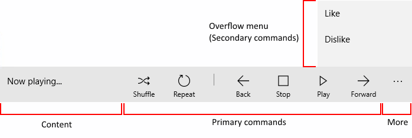
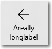
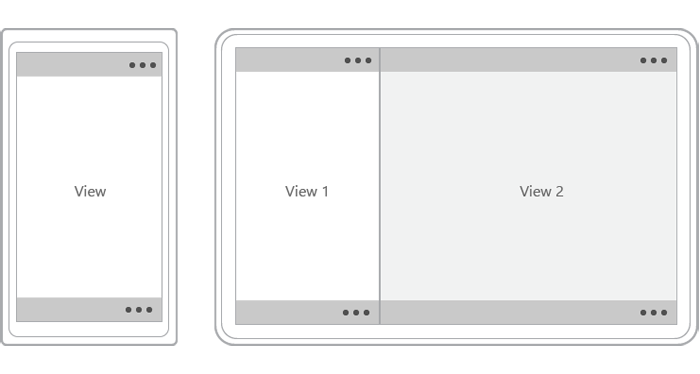
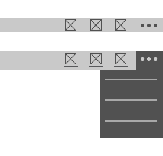

# Barras de la aplicación y barras de comandos

Las barras de comandos (también conocidas como "barras de la aplicación") proporcionan a los usuarios acceso fácil a las tareas más comunes de tu aplicación y se pueden usar para mostrar comandos u opciones que son específicos del contexto del usuario, como la selección de fotos o el modo de dibujo. También se pueden usar para ir de una página o de una sección de la aplicación a otra. Las barras de comandos se pueden usar con cualquier patrón de navegación.


<span class="sidebar_heading" style="font-weight: bold;">API importantes</span>

-   [**CommandBar **](https://msdn.microsoft.com/library/windows/apps/windows.ui.xaml.controls.commandbar.aspx)
-   [**AppBarButton**](https://msdn.microsoft.com/library/windows/apps/windows.ui.xaml.controls.appbarbutton.aspx)
-   [**AppBarToggleButton**](https://msdn.microsoft.com/library/windows/apps/windows.ui.xaml.controls.appbartogglebutton.aspx)
-   [**AppBarSeparator**](https://msdn.microsoft.com/library/windows/apps/windows.ui.xaml.controls.appbarseparator.aspx)

## ¿Es este el control adecuado?

El control CommandBar es un control de propósito general, flexible y ligero que puede mostrar contenido complejo, como imágenes o bloques de texto, así como comandos simples, como por ejemplo, controles [AppBarButton](https://msdn.microsoft.com/library/windows/apps/windows.ui.xaml.controls.appbarbutton.aspx), [AppBarToggleButton](https://msdn.microsoft.com/library/windows/apps/windows.ui.xaml.controls.appbartogglebutton.aspx) y [AppBarSeparator](https://msdn.microsoft.com/library/windows/apps/windows.ui.xaml.controls.appbarseparator.aspx).

XAML proporciona tanto el control AppBar y como el control CommandBar. El control AppBar solo se debería usar cuando se actualiza una aplicación universal para Windows 8 que usa dicho control y se necesita minimizar los cambios. Para nuevas aplicaciones de Windows 10, es recomendable usar el control CommandBar en su lugar. Para este documento, se supone que usas el control CommandBar.

## Ejemplos
Una barra de comandos expandida en la aplicación Fotos de Microsoft.


Una barra de comandos en el Calendario de Outlook en Windows Phone.


## Anatomía

De manera predeterminada, en la barra de comandos se muestra una fila de botones de icono y un botón "ver más" opcional, que se representa mediante puntos suspensivos \[•••\]. Esta es la barra de comandos creada mediante el código de ejemplo que se muestra más adelante. Se muestra en su estado cerrado y compacto.


La barra de comandos también se puede mostrar en un estado cerrado y mínimo, con este aspecto. Para obtener más información, consulta la sección [Estados abiertos y cerrados](#open-and-closed-states).


Esta es la misma barra de comandos, en su estado abierto. Las etiquetas identifican las partes principales del control.



La barra de comandos se divide en 4 áreas principales:
- El botón "ver más" \[•••\] se muestra en la parte derecha de la barra. Presionar el botón "ver más" \[•••\] tiene dos resultados: revela las etiquetas de los botones de comando principales y abre el menú de desbordamiento si hay comandos secundarios presentes. 
- El área de contenido se alinea a la izquierda de la barra. Se muestra si la propiedad `Content` está completada.
- El área de comandos principales se alinea a la derecha de la barra, junto al botón "ver más" \[•••\]. Se muestra si la propiedad `PrimaryCommands` está completada.  
- El menú de desbordamiento solo se muestra cuando la barra de comandos está abierta y la propiedad `SecondaryCommands` está completada. 

El diseño se invierte cuando la propiedad [FlowDirection]() es **RightToLeft**.

## Crear una barra de comandos
En este ejemplo, se crea la barra de comandos mostrada anteriormente.

```xaml
<CommandBar>
    <AppBarToggleButton Icon="Shuffle" Label="Shuffle" Click="AppBarButton_Click" />
    <AppBarToggleButton Icon="RepeatAll" Label="Repeat" Click="AppBarButton_Click"/>
    <AppBarSeparator/>
    <AppBarButton Icon="Back" Label="Back" Click="AppBarButton_Click"/>
    <AppBarButton Icon="Stop" Label="Stop" Click="AppBarButton_Click"/>
    <AppBarButton Icon="Play" Label="Play" Click="AppBarButton_Click"/>
    <AppBarButton Icon="Forward" Label="Forward" Click="AppBarButton_Click"/>

    <CommandBar.SecondaryCommands>
        <AppBarButton Icon="Like" Label="Like" Click="AppBarButton_Click"/>
        <AppBarButton Icon="Dislike" Label="Dislike" Click="AppBarButton_Click"/>
    </CommandBar.SecondaryCommands>

    <CommandBar.Content>
        <TextBlock Text="Now playing..." Margin="12,14"/>
    </CommandBar.Content>
</CommandBar>
```

## Comandos y contenido
El control CommandBar tiene 3 propiedades que puedes usar para agregar comandos y contenido: [**PrimaryCommands**](https://msdn.microsoft.com/library/windows/apps/xaml/windows.ui.xaml.controls.commandbar.primarycommands.aspx), [**SecondaryCommands**](https://msdn.microsoft.com/library/windows/apps/xaml/windows.ui.xaml.controls.commandbar.secondarycommands.aspx) y [**Content**](https://msdn.microsoft.com/library/windows/apps/xaml/windows.ui.xaml.controls.contentcontrol.content.aspx).


### Acciones principales y desbordamiento

De forma predeterminada, los elementos que agregas a la barra de comandos se agregan a la colección **PrimaryCommands**. Estos comandos se muestran a la izquierda del botón "ver más" \[•••\], en lo que llamamos el espacio de acción. Coloca los comandos más importantes, los que quieres que permanezcan visibles en la barra, en el espacio de acción. En las pantallas más pequeñas (320 epx de ancho), caben 4 elementos como máximo en el espacio de acción de la barra de comandos.

También puedes agregar comandos a la colección **SecondaryCommands** y estos elementos se muestran en el área de desbordamiento. Coloca los comandos menos importantes en el área de desbordamiento.

El área de desbordamiento predeterminada tiene un estilo distinto del de la barra. Puedes ajustar el estilo al establecer la propiedad [**CommandBarOverflowPresenterStyle**](https://msdn.microsoft.com/library/windows/apps/xaml/windows.ui.xaml.controls.commandbar.commandbaroverflowpresenterstyle.aspx) en un [estilo](https://msdn.microsoft.com/library/windows/apps/xaml/windows.ui.xaml.style.aspx) destinado al objeto [**CommandBarOverflowPresenter**](https://msdn.microsoft.com/library/windows/apps/xaml/windows.ui.xaml.controls.commandbaroverflowpresenter.aspx).

Puedes mover los comandos mediante programación entre los objetos PrimaryCommands y SecondaryCommands, según sea necesario. 

### Botones de la barra de la aplicación

Las propiedades PrimaryCommands y SecondaryCommands solo se pueden rellenar con elementos de comando [**AppBarButton**](https://msdn.microsoft.com/library/windows/apps/xaml/windows.ui.xaml.controls.appbarbutton.aspx), [**AppBarToggleButton**](https://msdn.microsoft.com/library/windows/apps/xaml/windows.ui.xaml.controls.appbartogglebutton.aspx) y [**AppBarSeparator**](https://msdn.microsoft.com/library/windows/apps/xaml/windows.ui.xaml.controls.appbarseparator.aspx). Estos controles están optimizados para usarse en una barra de comandos y su aspecto cambia en función de si el control se usa en el espacio de acción o el área de desbordamiento.

Los controles de botón de la barra de la aplicación se caracterizan por un icono y una etiqueta asociada. Tienen dos tamaños; normal y compacto. De manera predeterminada, la etiqueta de texto se muestra. Cuando la propiedad [**IsCompact**](https://msdn.microsoft.com/library/windows/apps/xaml/windows.ui.xaml.controls.appbarbutton.iscompact.aspx) se establece en **true**, la etiqueta de texto se oculta. Cuando se usa en un control CommandBar, la barra de comandos sobrescribe la propiedad IsCompact del botón automáticamente cuando se abre y se cierra la barra de comandos.


Al colocar un botón de barra de la aplicación en el menú de desbordamiento (SecondaryCommands), se muestra como solo texto. Este es el mismo botón de alternancia de la barra de la aplicación que se muestra en el espacio de acción como un comando principal (superior) y en el área de desbordamiento como un comando secundario (inferior).


- *Si un comando aparece de manera coherente entre las páginas, es mejor mantener ese comando en una ubicación coherente.*
- *Se recomienda colocar los comandos Aceptar y Sí a la izquierda de los comandos Rechazar, No y Cancelar. La coherencia le da confianza al usuario para moverse por el sistema y le ayuda a transferir su conocimiento sobre la navegación de una aplicación a otra.*

### Etiquetas de los botones

Te recomendamos que las etiquetas de los botones de la barra de la aplicación sean breves, preferiblemente de una sola palabra. Las etiquetas más largas situadas debajo del icono del botón de la barra de la aplicación se ajustarán en varias líneas, lo que aumentará el alto total de la barra de comandos abierta. Puedes incluir un carácter de guion suave (0x00AD) en el texto de una etiqueta para sugerir en el límite de carácter dónde se debe producir un salto de palabra. En XAML, esto se expresa esta mediante una secuencia de escape, tal como se muestra abajo:

```xaml
<AppBarButton Icon="Back" Label="Areally&#x00AD;longlabel"/>
```

Cuando la etiqueta se ajusta en la ubicación sugerida, tiene este aspecto.



### Otro contenido

Puedes agregar cualquier elemento XAML al área de contenido al establecer la propiedad **Content**. Si quieres agregar más de un elemento, tendrías que colocarlos en un contenedor de panel y hacer que el panel sea un elemento secundario único de la propiedad Content.

Cuando hay comandos principales y contenido, los comandos principales tienen prioridad y pueden provocar el recorte del contenido. 

Cuando la propiedad [**ClosedDisplayMode**](https://msdn.microsoft.com/library/windows/apps/xaml/windows.ui.xaml.controls.appbar.closeddisplaymode.aspx) es **Compact**, el contenido se puede recortar si es mayor que el tamaño compacto de la barra de comandos. Debes controlar los eventos [**Opening**](https://msdn.microsoft.com/library/windows/apps/xaml/windows.ui.xaml.controls.appbar.opening.aspx) y [**Closed**](https://msdn.microsoft.com/library/windows/apps/xaml/windows.ui.xaml.controls.appbar.closed.aspx) para mostrar u ocultar partes de la interfaz de usuario en el área de contenido de modo que no se recorten. Para obtener más información, consulta la sección [Estados abiertos y cerrados](#open-and-closed-states).


## Estados abiertos y cerrados

La barra de comandos se puede abrir o cerrar. Un usuario puede alternar entre ambos estados al presionar el botón "ver más" \[•••\]. Puedes cambiar entre ellos mediante programación al establecer la propiedad [**IsOpen**](https://msdn.microsoft.com/library/windows/apps/xaml/windows.ui.xaml.controls.appbar.isopen.aspx). Cuando está abierta, se muestran los botones de comando principales con etiquetas de texto y el menú de desbordamiento se abre si hay comandos secundarios presentes, tal como se mostró anteriormente.

Puedes usar los eventos [**Opening**](https://msdn.microsoft.com/library/windows/apps/xaml/windows.ui.xaml.controls.appbar.opening.aspx), [**Opened**](https://msdn.microsoft.com/library/windows/apps/xaml/windows.ui.xaml.controls.appbar.opened.aspx), [**Closing**](https://msdn.microsoft.com/library/windows/apps/xaml/windows.ui.xaml.controls.appbar.closing.aspx) y [**Closed**](https://msdn.microsoft.com/library/windows/apps/xaml/windows.ui.xaml.controls.appbar.closed.aspx) para responder a la apertura o cierre de la barra de comandos.  
- Los eventos Opened y Closed se producen antes del inicio de la animación de transición.
- Los eventos Opened y Closed se producen una vez finalizada la transición.

En este ejemplo, los eventos Opening y Closing se usan para cambiar la opacidad de la barra de comandos. Cuando se cierra la barra de comandos, se hace de forma semitransparente para que el fondo de la aplicación se muestre. Cuando se abre la barra de comandos, la barra de comandos se hace opaca para que el usuario pueda centrarse en los comandos.

```xaml
<CommandBar Opening="CommandBar_Opening"
            Closing="CommandBar_Closing">
    <AppBarButton Icon="Accept" Label="Accept"/>
    <AppBarButton Icon="Edit" Label="Edit"/>
    <AppBarButton Icon="Save" Label="Save"/>
    <AppBarButton Icon="Cancel" Label="Cancel"/>
</CommandBar>
```

```csharp
private void CommandBar_Opening(object sender, object e)
{
    CommandBar cb = sender as CommandBar;
    if (cb != null) cb.Background.Opacity = 1.0;
}

private void CommandBar_Closing(object sender, object e)
{
    CommandBar cb = sender as CommandBar;
    if (cb != null) cb.Background.Opacity = 0.5;
}

```

### ClosedDisplayMode

Puedes controlar cómo se muestra la barra de comandos en su estado cerrado al establecer la propiedad [**ClosedDisplayMode** ](https://msdn.microsoft.com/library/windows/apps/xaml/windows.ui.xaml.controls.appbar.closeddisplaymode.aspx). Hay tres modos de visualización de estado cerrado entre los que puedes elegir:
- **Compacta**: el modo predeterminado. Se muestra el contenido, los iconos de comando principales sin etiquetas y el botón "ver más" \[•••].
- **Mínima**: se muestra solo una barra delgada que actúa como el botón "ver más" \[•••]. El usuario puede presionar en cualquier parte de la barra para abrirla.
- **Oculta**: cuando se cierra, la barra de comandos no se muestra. Esto puede ser de utilidad para mostrar comandos contextuales con una barra de comandos alineada. En este caso, tienes que abrir la barra de comandos mediante programación estableciendo la propiedad **IsOpen** o cambiando la propiedad ClosedDisplayMode a **Mínima** o **Compacta**.

Aquí, se usa una barra de comandos para contener comandos de formato simples para un objeto [RichEditBox](https://msdn.microsoft.com/library/windows/apps/xaml/windows.ui.xaml.controls.richeditbox.aspx). Cuando el cuadro de edición no tiene el foco, los comandos de formato pueden resultar una distracción, por lo que se ocultan. Cuando se usa el cuadro de edición, la propiedad ClosedDisplayMode de la barra de comandos cambia a Compacta de modo que se muestren los comandos de formato.

```xaml
<StackPanel Width="300"
            GotFocus="EditStackPanel_GotFocus"
            LostFocus="EditStackPanel_LostFocus">
    <CommandBar x:Name="FormattingCommandBar" ClosedDisplayMode="Hidden">
        <AppBarButton Icon="Bold" Label="Bold" ToolTipService.ToolTip="Bold"/>
        <AppBarButton Icon="Italic" Label="Italic" ToolTipService.ToolTip="Italic"/>
        <AppBarButton Icon="Underline" Label="Underline" ToolTipService.ToolTip="Underline"/>
    </CommandBar>
    <RichEditBox Height="200"/>
</StackPanel>
```

```csharp
private void EditStackPanel_GotFocus(object sender, RoutedEventArgs e)
{
    FormattingCommandBar.ClosedDisplayMode = AppBarClosedDisplayMode.Compact;
}

private void EditStackPanel_LostFocus(object sender, RoutedEventArgs e)
{
    FormattingCommandBar.ClosedDisplayMode = AppBarClosedDisplayMode.Hidden;
}
```

>**Nota**&nbsp;&nbsp;La implementación de los comandos de edición está fuera del ámbito de este ejemplo. Para más información, consulta el artículo sobre la propiedad [RichEditBox](rich-edit-box.md).

Aunque los modos Mínima y Oculta son de utilidad en algunas situaciones, ten en cuenta que ocultar todas las acciones podría confundir a los usuarios.

Cambiar la propiedad ClosedDisplayMode para proporcionar más o menos información de una sugerencia al usuario afecta al diseño de los elementos adyacentes. Por el contrario, cuando el objeto CommandBar cambia entre cerrado y abierto, no afecta al diseño de otros elementos.

### IsSticky

Después de abrir la barra de comandos, si el usuario interactúa con la aplicación en cualquier lugar fuera del control, de manera predeterminada, se cierra el menú desbordamiento y se ocultan las etiquetas. El cierre de esta forma se llama *cierre del elemento por cambio de foco*. Puedes controlar cómo se cierra la barra al establecer la propiedad [**IsSticky**](https://msdn.microsoft.com/library/windows/apps/xaml/windows.ui.xaml.controls.appbar.issticky.aspx). Cuando la barra es de visualización permanente (`IsSticky="true"`), no se cierra mediante un gesto de cierre del elemento por cambio de foco. La barra permanece abierta hasta que el usuario presiona el botón "ver más" \[•••\] o, si está presente, selecciona un elemento en el menú de desbordamiento.

## Lo que se debe y no se debe hacer

### Colocación

Las barras de comandos se pueden colocar en la parte superior de la ventana de la aplicación, en la parte inferior de la ventana de la aplicación y de manera alineada.


-   Para dispositivos portátiles pequeños, te recomendamos ubicar las barras de comandos en la parte inferior de la pantalla para conseguir una mayor disponibilidad.
-   Para dispositivos con pantallas más grandes, si vas a colocar una sola barra de comandos, te recomendamos colocarla cerca de la parte superior de la ventana.
Usa la API [**DiagonalSizeInInches**](https://msdn.microsoft.com/en-us/library/windows/apps/windows.graphics.display.displayinformation.diagonalsizeininches.aspx) para determinar el tamaño físico de la pantalla.

Las barras de comandos pueden colocarse en las siguientes regiones de la pantalla en pantallas de vista única (ejemplo de la izquierda) y en las pantallas de varias vistas (ejemplo de la derecha). Las barras de comandos alineadas pueden colocarse en cualquier lugar del espacio de acción.



>**Dispositivos táctiles**: si la barra de comandos debe permanecer visible para un usuario cuando aparece el teclado táctil o el panel de entrada de software (SIP), puedes asignarla a la propiedad `BottomAppBar` de una página y pasará a estar visible cuando el SIP esté presente. De lo contrario, debes colocar la barra de comandos de manera alineada y en una posición relativa al contenido de tu aplicación.

### Acciones

Da prioridad a las acciones que van en la barra de comandos en función de su visibilidad.

-   Coloca los comandos más importantes, los que quieres que permanezcan visibles en la barra, en las primeras ranuras del espacio de acción. En las pantallas más pequeñas (320 epx de ancho), caben entre 2 y 4 elementos en el espacio de acción de la barra de comandos, en función de otras interfaces de usuario en pantalla.
-   Coloca los comandos menos importantes más adelante en el espacio de acción de la barra o dentro de las primeras ranuras del área de desbordamiento. Estos comandos estarán visibles cuando la barra tenga suficiente superficie de pantalla, pero se incluirán en el menú desplegable del área de desbordamiento cuando no haya suficiente espacio.
-   Coloca los comandos menos importantes dentro del área de desbordamiento. Estos comandos siempre aparecerán en el menú desplegable.

Si un comando aparece de manera coherente entre las páginas, es mejor mantener ese comando en una ubicación coherente. Se recomienda colocar los comandos Aceptar y Sí a la izquierda de los comandos Rechazar, No y Cancelar. La coherencia le da confianza al usuario para moverse por el sistema y le ayuda a transferir su conocimiento sobre la navegación de una aplicación a otra.

Aunque se pueden colocar todas las acciones en el menú de desbordamiento de modo que solo el botón "ver más" \[•••\] sea visible en la barra de comandos, ten en cuenta que ocultar todas las acciones podría confundir a los usuarios.

### Controles flotantes de la barra de comandos

Considera la posibilidad de realizar agrupaciones lógicas de los comandos, como colocar Responder, Responder a todos y Reenviar en un menú Responder. Aunque generalmente un botón de la barra de la aplicación activa un solo comando, se lo puede usar para mostrar un [**MenuFlyout**](https://msdn.microsoft.com/en-us/library/windows/apps/windows.ui.xaml.controls.menuflyout.aspx) o un [**Control flotante**](https://msdn.microsoft.com/en-us/library/windows/apps/windows.ui.xaml.controls.flyout.aspx) con contenido personalizado.


### Menú de desbordamiento



-   El menú de desbordamiento se representa con el botón "ver más" \[•••\], el punto de entrada visible del menú. Se encuentra en el extremo derecho de la barra de herramientas, junto a las acciones principales.
-   El área de desbordamiento se asigna para acciones que se usan con menos frecuencia.
-   Las acciones se colocan entre el espacio de acción principal y el menú de desbordamiento por puntos de interrupción. También puedes designar acciones para estar siempre en el espacio de acción principal independientemente del tamaño de la ventana de la pantalla o la aplicación.
-   Las acciones de uso poco frecuente pueden permanecer en el menú de desbordamiento incluso cuando la barra de la aplicación se expanda en pantallas más grandes.

## Capacidad de adaptación

-   El mismo número de acciones en la barra de la aplicación debe estar visible tanto en la orientación vertical como en la horizontal, lo que reduce la dificultad de aprendizaje del usuario. El número de acciones disponibles debe determinarse por el ancho del dispositivo en la orientación vertical.
-   En pantallas pequeñas que probablemente se usen con una sola mano, las barras de la aplicación se deben colocar cerca de la parte inferior de la pantalla.
-   En las pantallas más grandes, la colocación de las barras de la aplicación cerca de la parte superior de la ventana hace que sean más notorias y fáciles de detectar.
-   Al tener como destino puntos de interrupción, puedes mover las acciones dentro y fuera del menú a medida que el tamaño de la ventana cambia.
-   Al orientar la pantalla en diagonal, puedes modificar la posición de la barra de la aplicación en función del tamaño de pantalla del dispositivo.

## Artículos relacionados

**Para diseñadores**
[Conceptos básicos de diseño de los comandos para las aplicaciones para UWP](https://msdn.microsoft.com/library/windows/apps/dn958433)

**Para desarrolladores (XAML)**
[**CommandBar**](https://msdn.microsoft.com/library/windows/apps/dn279427)


<!--HONumber=Mar16_HO5-->


