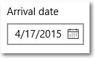

# Selector de fecha del calendario

El selector de fecha del calendario es un control desplegable que está optimizado para seleccionar una fecha determinada desde una vista de calendario en la que la información contextual es importante, por ejemplo, el día de la semana o lo que se haya completado del calendario. Puedes modificar el calendario para que proporcione contexto adicional o limite las fechas disponibles.

<span class="sidebar_heading" style="font-weight: bold;">API importantes</span>

-   [**Clase TimePicker**](https://msdn.microsoft.com/library/windows/apps/xaml/windows.ui.xaml.controls.timepicker.aspx)
-   [**Propiedad Time**](https://msdn.microsoft.com/library/windows/apps/xaml/windows.ui.xaml.controls.timepicker.time.aspx)

## ¿Es este el control adecuado?
Usa un **selector de fecha del calendario** para permitir al usuario seleccionar una fecha determinada desde una vista de calendario contextual. Úsalo para, por ejemplo, elegir la fecha de una cita o de una salida.

Para permitir que el usuario seleccione una fecha conocida, como una fecha de nacimiento, donde el contexto del calendario no es importante, considera la posibilidad de usar un [**selector de fecha**](date-picker.md).

Para obtener más información sobre cómo elegir el control adecuado, consulta el artículo [Controles de fecha y hora](date-and-time.md).

## Ejemplos

El punto de entrada muestra texto del marcador de posición si no se ha establecido una fecha; de lo contrario, muestra la fecha elegida. Cuando el usuario selecciona el punto de entrada, se expande una vista de calendario para que el usuario realice una selección de fecha. La vista de calendario se superpone a otra interfaz de usuario; no hace que la otra interfaz desaparezca.


## Crear un selector de fecha

```xaml
<CalendarDatePicker x:Name="arrivalCalendarDatePicker" Header="Arrival date"/>
```

```csharp
CalendarDatePicker arrivalCalendarDatePicker = new CalendarDatePicker();
arrivalCalendarDatePicker.Header = "Arrival date";
```

El selector de fecha del calendario resultante tiene este aspecto:



El selector de fecha del calendario tiene un componente [**CalendarView**](https://msdn.microsoft.com/library/windows/apps/xaml/windows.ui.xaml.controls.calendarview.aspx) interno para seleccionar una fecha. Existe un subconjunto de propiedades CalendarView como [**IsTodayHighlighted**](https://msdn.microsoft.com/library/windows/apps/xaml/windows.ui.xaml.controls.calendardatepicker.istodayhighlighted.aspx) y [**FirstDayOfWeek**](https://msdn.microsoft.com/library/windows/apps/xaml/windows.ui.xaml.controls.calendardatepicker.firstdayofweek.aspx) en CalendarDatePicker y se envían al componente CalendarView interno para que puedas modificarlo. 

Sin embargo, no puedes cambiar el [**SelectionMode**](https://msdn.microsoft.com/library/windows/apps/xaml/windows.ui.xaml.controls.calendarview.selectionmode.aspx) del componente CalendarView interno para permitir la selección múltiple. Para permitir al usuario elegir varias fechas o si necesitas un calendario para estar siempre visible, considera la posibilidad de usar una vista de calendario en lugar de un selector de fecha del calendario. Consulta el artículo [Vista de calendario](calendar-view.md) para obtener más información sobre cómo puedes modificar la presentación de calendario.

### Seleccionar fechas

Usa el la propiedad [**Date**](https://msdn.microsoft.com/library/windows/apps/xaml/windows.ui.xaml.controls.calendardatepicker.date.aspx) propiedad para obtener o establecer la fecha seleccionada. De manera predeterminada, la propiedad Date es **null**. Cuando un usuario selecciona una fecha en la vista de calendario, esta propiedad se actualiza. Un usuario puede borrar la fecha haciendo clic en la fecha seleccionada en la vista de calendario para anular la selección. 

Puedes establecer la fecha en el código de la siguiente forma.

```csharp
myCalendarDatePicker.Date = new DateTime(1977, 1, 5);
```

Al configurar la fecha en el código, el valor está restringido por las propiedades [**MinDate**](https://msdn.microsoft.com/library/windows/apps/xaml/windows.ui.xaml.controls.calendardatepicker.mindate.aspx) y [**MaxDate**](https://msdn.microsoft.com/library/windows/apps/xaml/windows.ui.xaml.controls.calendardatepicker.maxdate.aspx).
- Si **Date** es menor que **MinDate**, el valor se establece en **MinDate**.
- Si **Date** es mayor que **MaxDate**, el valor se establece en **MaxDate**.

Puedes controlar el evento [**DateChanged**](https://msdn.microsoft.com/library/windows/apps/xaml/windows.ui.xaml.controls.calendardatepicker.datechanged.aspx) para obtener una notificación cuando el valor Date haya cambiado.

> **Nota**
            &nbsp;&nbsp;Para obtener información importante acerca de los valores de fecha, consulta [Valores de DateTime y Calendar](date-and-time.md#datetime-and-calendar-values) en el artículo Controles de fecha y hora.

### Establecer un encabezado y un texto de marcador de posición

Puedes agregar un [**Encabezado**](https://msdn.microsoft.com/library/windows/apps/xaml/windows.ui.xaml.controls.calendardatepicker.header.aspx) (o etiqueta) y un [**PlaceholderText**](https://msdn.microsoft.com/library/windows/apps/xaml/windows.ui.xaml.controls.calendardatepicker.placeholdertext.aspx) (o marca de agua) para dar al usuario una indicación de para qué se usa el selector de fecha del calendario. Para personalizar el aspecto del encabezado, puedes establecer la propiedad [**HeaderTemplate**](https://msdn.microsoft.com/library/windows/apps/xaml/windows.ui.xaml.controls.calendardatepicker.headertemplate.aspx) en lugar de Header.

El texto de marcador de posición predeterminado es "seleccionar una fecha". Puedes quitar esto estableciendo la propiedad PlaceholderText en una cadena vacía, o bien puedes proporcionar texto personalizado como se muestra aquí.

```xaml
<CalendarDatePicker x:Name="arrivalCalendarDatePicker" Header="Arrival date" PlaceholderText="Choose your arrival date"/>
```


## Artículos relacionados

- [Controles de fecha y hora](date-and-time.md)
- [Vista de calendario](calendar-view.md)
- [Selector de fecha](date-picker.md)
- [Selector de hora](time-picker.md)


<!--HONumber=May16_HO2-->


