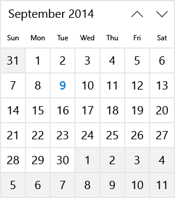

# Vista de calendario

Una vista de calendario permite al usuario ver e interactuar con un calendario por el que se puede navegar por mes, año o década. Un usuario puede seleccionar una fecha determinada o un intervalo de fechas. No tiene una superficie de selector y el calendario está siempre visible. 

<span class="sidebar_heading" style="font-weight: bold;">API importantes</span>

- [**Clase CalendarView**](https://msdn.microsoft.com/library/windows/apps/xaml/windows.ui.xaml.controls.calendarview.aspx)
- [**Propiedad Date**](https://msdn.microsoft.com/library/windows/apps/xaml/windows.ui.xaml.controls.calendardatepicker.date.aspx)

## ¿Es este el control adecuado?
Usa una vista de calendario para permitir al usuario seleccionar una fecha determinada o un intervalo de fechas a partir de un calendario siempre visible.

Si necesitas permitir al usuario seleccionar varias fechas al mismo tiempo, debes usar una vista de calendario. Si es necesario permitir que un usuario elija solo una fecha determinada y no necesita que haya un calendario siempre visible, considera usar un control [selector de fecha del calendario](calendar-date-picker.md) o [selector de fecha](date-picker.md).

Para obtener más información sobre cómo elegir el control adecuado, consulta el artículo [Controles de fecha y hora](date-and-time.md).

## Ejemplos

La vista del calendario se compone de 3 vistas separadas: la vista de mes, la vista de año y la vista de década. De manera predeterminada, se inicia con la vista de mes abierta. Puedes especificar una vista de inicio estableciendo la propiedad [**DisplayMode**](https://msdn.microsoft.com/library/windows/apps/xaml/windows.ui.xaml.controls.calendarview.displaymode.aspx).


Los usuarios hacen clic en el encabezado de la vista de mes para abrir la vista de año, y hacen clic en el encabezado de la vista de año para abrir la vista de década. Los usuarios seleccionan un año en la vista de década para volver a la vista de año y seleccionan un mes en la vista de año para volver a la vista de mes. Las dos flechas al lado del encabezado navegan hacia delante o hacia atrás por mes, año o década. 

## Crear una vista de calendario

En este ejemplo se muestra cómo crear una vista de calendario sencilla.

```xaml
<CalendarView/>
```

La vista de calendario resultante tiene este aspecto:



### Seleccionar fechas

De manera predeterminada, la propiedad [**SelectionMode**](https://msdn.microsoft.com/library/windows/apps/xaml/windows.ui.xaml.controls.calendarview.selectionmode.aspx) se establece en **Single**. Esto permite al usuario seleccionar una fecha determinada en el calendario. Establece SelectionMode en **None** para deshabilitar la selección de fecha. 

Establece SelectionMode en **Multiple** para permitir al usuario seleccionar varias fechas. Puedes seleccionar varias fechas mediante programación agregando objetos [DateTime](https://msdn.microsoft.com/library/windows/apps/xaml/system.datetime.aspx)/[DateTimeOffset](https://msdn.microsoft.com/library/windows/apps/xaml/system.datetimeoffset.aspx) a la colección [**SelectedDates**](https://msdn.microsoft.com/library/windows/apps/xaml/windows.ui.xaml.controls.calendarview.selecteddates.aspx), como se muestra aquí:

```csharp
calendarView1.SelectedDates.Add(DateTimeOffset.Now);
calendarView1.SelectedDates.Add(new DateTime(1977, 1, 5));
```

Un usuario puede anular la selección de una determinada fecha haciendo clic o pulsándola en la cuadrícula del calendario.

Puedes controlar el evento [**SelectedDatesChanged**](https://msdn.microsoft.com/library/windows/apps/xaml/windows.ui.xaml.controls.calendarview.selecteddateschanged.aspx) para que se notifique cuando la colección [**SelectedDates**](https://msdn.microsoft.com/library/windows/apps/xaml/windows.ui.xaml.controls.calendarview.selecteddates.aspx) haya cambiado.

> **Nota**
            &nbsp;&nbsp;Para obtener información importante acerca de los valores de fecha, consulta [Valores de DateTime y Calendar](date-and-time.md#datetime-and-calendar-values) en el artículo Controles de fecha y hora.

### Personalizar la apariencia de la vista de calendario

La vista del calendario se compone de elementos XAML definidos en ControlTemplate y de elementos visuales representados directamente por el control. 
- Los elementos XAML que se definen en la plantilla de control incluyen el borde dentro del que se encuentran el control, el encabezado, los botones Anterior y Siguiente y los elementos DayOfWeek. Puedes aplicar un estilo y crear una nueva plantilla para estos elementos como cualquier control de XAML. 
- La cuadrícula del calendario está compuesta por objetos [**CalendarViewDayItem**](https://msdn.microsoft.com/library/windows/apps/xaml/windows.ui.xaml.controls.calendarviewdayitem.aspx). No puedes aplicar un estilo o crear una nueva plantilla para estos elementos, pero se proporcionan diversas propiedades para que puedas personalizar su apariencia.

Este diagrama muestra los elementos que componen la vista de mes del calendario. Para obtener más información, consulta los comentarios sobre la clase [**CalendarViewDayItem**](https://msdn.microsoft.com/library/windows/apps/xaml/windows.ui.xaml.controls.calendarviewdayitem.aspx).


Esta tabla enumera las propiedades que puedes cambiar para modificar la apariencia de los elementos del calendario.

Elemento | Propiedades
--------|-----------
DayOfWeek | [DayOfWeekFormat](https://msdn.microsoft.com/library/windows/apps/xaml/windows.ui.xaml.controls.calendarview.dayofweekformat.aspx)  
CalendarItem | [CalendarItemBackground](https://msdn.microsoft.com/library/windows/apps/xaml/windows.ui.xaml.controls.calendarview.calendaritembackground.aspx), [CalendarItemBorderBrush](https://msdn.microsoft.com/library/windows/apps/xaml/windows.ui.xaml.controls.calendarview.calendaritemborderbrush.aspx), [CalendarItemBorderThickness](https://msdn.microsoft.com/library/windows/apps/xaml/windows.ui.xaml.controls.calendarview.calendaritemborderthickness.aspx), [CalendarItemForeground](https://msdn.microsoft.com/library/windows/apps/xaml/windows.ui.xaml.controls.calendarview.calendaritemforeground.aspx)  
DayItem | [DayItemFontFamily](https://msdn.microsoft.com/library/windows/apps/xaml/windows.ui.xaml.controls.calendarview.dayitemfontfamily.aspx), [DayItemFontSize](https://msdn.microsoft.com/library/windows/apps/xaml/windows.ui.xaml.controls.calendarview.dayitemfontsize.aspx), [DayItemFontStyle](https://msdn.microsoft.com/library/windows/apps/xaml/windows.ui.xaml.controls.calendarview.dayitemfontstyle.aspx), [DayItemFontWeight](https://msdn.microsoft.com/library/windows/apps/xaml/windows.ui.xaml.controls.calendarview.dayitemfontweight.aspx), [HorizontalDayItemAlignment](https://msdn.microsoft.com/library/windows/apps/xaml/windows.ui.xaml.controls.calendarview.horizontaldayitemalignment.aspx), [VerticalDayItemAlignment](https://msdn.microsoft.com/library/windows/apps/xaml/windows.ui.xaml.controls.calendarview.verticaldayitemalignment.aspx), [CalendarViewDayItemStyle](https://msdn.microsoft.com/library/windows/apps/xaml/windows.ui.xaml.controls.calendarview.calendarviewdayitemstyle.aspx)  
MonthYearItem (en las vistas año y década, equivalente a DayItem) | [MonthYearItemFontFamily](https://msdn.microsoft.com/library/windows/apps/xaml/windows.ui.xaml.controls.calendarview.monthyearitemfontfamily.aspx), [MonthYearItemFontSize](https://msdn.microsoft.com/library/windows/apps/xaml/windows.ui.xaml.controls.calendarview.monthyearitemfontsize.aspx), [MonthYearItemFontStyle](https://msdn.microsoft.com/library/windows/apps/xaml/windows.ui.xaml.controls.calendarview.monthyearitemfontstyle.aspx), [MonthYearItemFontWeight](https://msdn.microsoft.com/library/windows/apps/xaml/windows.ui.xaml.controls.calendarview.monthyearitemfontweight.aspx)  
FirstOfMonthLabel | [FirstOfMonthLabelFontFamily](https://msdn.microsoft.com/library/windows/apps/xaml/windows.ui.xaml.controls.calendarview.firstofmonthlabelfontfamily.aspx), [FirstOfMonthLabelFontSize](https://msdn.microsoft.com/library/windows/apps/xaml/windows.ui.xaml.controls.calendarview.firstofmonthlabelfontsize.aspx), [FirstOfMonthLabelFontStyle](https://msdn.microsoft.com/library/windows/apps/xaml/windows.ui.xaml.controls.calendarview.firstofmonthlabelfontstyle.aspx), [FirstOfMonthLabelFontWeight](https://msdn.microsoft.com/library/windows/apps/xaml/windows.ui.xaml.controls.calendarview.firstofmonthlabelfontweight.aspx), [HorizontalFirstOfMonthLabelAlignment](https://msdn.microsoft.com/library/windows/apps/xaml/windows.ui.xaml.controls.calendarview.horizontalfirstofmonthlabelalignment.aspx), [VerticalFirstOfMonthLabelAlignment](https://msdn.microsoft.com/library/windows/apps/xaml/windows.ui.xaml.controls.calendarview.verticalfirstofmonthlabelalignment.aspx), [IsGroupLabelVisible](https://msdn.microsoft.com/library/windows/apps/xaml/windows.ui.xaml.controls.calendarview.isgrouplabelvisible.aspx)  
FirstofYearDecadeLabel (en las vistas año y década, equivalente a FirstOfMonthLabel) | [FirstOfYearDecadeLabelFontFamily](https://msdn.microsoft.com/library/windows/apps/xaml/windows.ui.xaml.controls.calendarview.firstofyeardecadelabelfontfamily.aspx), [FirstOfYearDecadeLabelFontSize](https://msdn.microsoft.com/library/windows/apps/xaml/windows.ui.xaml.controls.calendarview.firstofyeardecadelabelfontsize.aspx), [FirstOfYearDecadeLabelFontStyle](https://msdn.microsoft.com/library/windows/apps/xaml/windows.ui.xaml.controls.calendarview.firstofyeardecadelabelfontstyle.aspx), [FirstOfYearDecadeLabelFontWeight](https://msdn.microsoft.com/library/windows/apps/xaml/windows.ui.xaml.controls.calendarview.firstofyeardecadelabelfontweight.aspx)  
Bordes de Estado visual | [FocusBorderBrush](https://msdn.microsoft.com/library/windows/apps/xaml/windows.ui.xaml.controls.calendarview.focusborderbrush.aspx), [HoverBorderBrush](https://msdn.microsoft.com/library/windows/apps/xaml/windows.ui.xaml.controls.calendarview.hoverborderbrush.aspx), [PressedBorderBrush](https://msdn.microsoft.com/library/windows/apps/xaml/windows.ui.xaml.controls.calendarview.pressedborderbrush.aspx), [SelectedBorderBrush](https://msdn.microsoft.com/library/windows/apps/xaml/windows.ui.xaml.controls.calendarview.selectedborderbrush.aspx), [SelectedForeground](https://msdn.microsoft.com/library/windows/apps/xaml/windows.ui.xaml.controls.calendarview.selectedforeground.aspx), [SelectedHoverBorderBrush](https://msdn.microsoft.com/library/windows/apps/xaml/windows.ui.xaml.controls.calendarview.selectedhoverborderbrush.aspx), [SelectedPressedBorderBrush](https://msdn.microsoft.com/library/windows/apps/xaml/windows.ui.xaml.controls.calendarview.selectedpressedborderbrush.aspx)  
OutofScope | [IsOutOfScopeEnabled](https://msdn.microsoft.com/library/windows/apps/xaml/windows.ui.xaml.controls.calendarview.isoutofscopeenabled.aspx), [OutOfScopeBackground](https://msdn.microsoft.com/library/windows/apps/xaml/windows.ui.xaml.controls.calendarview.outofscopebackground.aspx), [OutOfScopeForeground](https://msdn.microsoft.com/library/windows/apps/xaml/windows.ui.xaml.controls.calendarview.outofscopeforeground.aspx)  
Today | [IsTodayHighlighted](https://msdn.microsoft.com/library/windows/apps/xaml/windows.ui.xaml.controls.calendarview.istodayhighlighted.aspx), [TodayFontWeight](https://msdn.microsoft.com/library/windows/apps/xaml/windows.ui.xaml.controls.calendarview.todayfontweight.aspx), [TodayForeground](https://msdn.microsoft.com/library/windows/apps/xaml/windows.ui.xaml.controls.calendarview.todayforeground.aspx)  

 De manera predeterminada, la vista de mes muestra 6 semanas a la vez. Puedes cambiar el número de semanas mostradas estableciendo la propiedad [**NumberOfWeeksInView**](https://msdn.microsoft.com/library/windows/apps/xaml/windows.ui.xaml.controls.calendarview.numberofweeksinview.aspx). El número mínimo de semanas para mostrar es 2; el máximo es 8.

De manera predeterminada, las vistas de año y década se muestran en una cuadrícula de 4 x 4. Para cambiar el número de filas o columnas, llama a [**SetYearDecadeDisplayDimensions**](https://msdn.microsoft.com/library/windows/apps/xaml/windows.ui.xaml.controls.calendarview.setyeardecadedisplaydimensions.aspx) con el número de filas y columnas deseado. Esto cambiará la cuadrícula para las vistas de año y década.

Aquí, las vistas de año y década están establecidas para mostrarse en una cuadrícula de 3x4.

```csharp
calendarView1.SetYearDecadeDisplayDimensions(3, 4);
```

De manera predeterminada, la fecha mínima que se muestra en la vista del calendario es 100 años antes de la fecha actual y la fecha máxima que se muestra es 100 años más allá de la fecha actual. Puedes cambiar las fechas mínimas y máximas que muestra el calendario estableciendo las propiedades [**MinDate**](https://msdn.microsoft.com/library/windows/apps/xaml/windows.ui.xaml.controls.calendarview.mindate.aspx) y [**MaxDate**](https://msdn.microsoft.com/library/windows/apps/xaml/windows.ui.xaml.controls.calendarview.maxdate.aspx).

```csharp
calendarView1.MinDate = new DateTime(2000, 1, 1);
calendarView1.MaxDate = new DateTime(2099, 12, 31);
```

### Actualizar elementos de calendario por día

Cada día en el calendario se representa mediante un objeto [**CalendarViewDayItem**](https://msdn.microsoft.com/library/windows/apps/xaml/windows.ui.xaml.controls.calendarviewdayitem.aspx). Para obtener acceso a un elemento de día individual y usar sus propiedades y métodos, administra el evento [**CalendarViewDayItemChanging**](https://msdn.microsoft.com/library/windows/apps/xaml/windows.ui.xaml.controls.calendarview.calendarviewdayitemchanging.aspx) y usa la propiedad del elemento de los argumentos del evento para acceder a CalendarViewDayItem.

Puedes hacer que un día no se pueda seleccionar en la vista de calendario estableciendo su propiedad [**CalendarViewDayItem.IsBlackout**](https://msdn.microsoft.com/library/windows/apps/xaml/windows.ui.xaml.controls.calendarviewdayitem.isblackout.aspx) en **true**. 

Puedes mostrar información contextual sobre la densidad de eventos en un día llamando al método [**CalendarViewDayItem.SetDensityColors**](https://msdn.microsoft.com/library/windows/apps/xaml/dn890067.aspx). Puedes mostrar de 0 a 10 barras de la densidad para cada día y establecer el color de cada barra. 

Estos son algunos elementos de día en un calendario. Los días 1 y 2 están suprimidos. Los días 2, 3 y 4 tienen varias barras de densidad establecidas.


### Representación por fases

Una vista de calendario puede contener un gran número de objetos CalendarViewDayItem. Para mantener la interfaz de usuario con capacidad de respuesta y habilitar la navegación fluida mediante el calendario, la vista de calendario admite la representación por fases. Esto permite dividir el procesamiento de un elemento de día en fases. Si un día se mueve fuera de la vista antes de que se completen todas las fases, no se dedica más tiempo a intentar procesar y representar ese elemento.

Este ejemplo muestra fases de representación de una vista de calendario para la programación de citas. 
- En la fase 0, se procesa el elemento de día predeterminado. 
- En la fase 1, no se pueden reservar las fechas no disponibles. Esto incluye fechas pasadas, domingos y fechas que ya están reservadas en su totalidad. 
- En la fase 2, comprueba cada cita reservada para el día. Muestras una barra de densidad de color verde para cada cita confirmada y una barra de densidad azul para cada cita provisional. 

La clase `Bookings` de este ejemplo procede de una aplicación de reserva de citas ficticia y no se muestra.

```xaml
<CalendarView CalendarViewDayItemChanging="CalendarView_CalendarViewDayItemChanging"/>
```

```csharp
private void CalendarView_CalendarViewDayItemChanging(CalendarView sender, 
                                   CalendarViewDayItemChangingEventArgs args)
{
    // Render basic day items.
    if (args.Phase == 0)
    {
        // Register callback for next phase.
        args.RegisterUpdateCallback(CalendarView_CalendarViewDayItemChanging);
    }
    // Set blackout dates.
    else if (args.Phase == 1)
    {   
        // Blackout dates in the past, Sundays, and dates that are fully booked.
        if (args.Item.Date < DateTimeOffset.Now ||
            args.Item.Date.DayOfWeek == DayOfWeek.Sunday ||
            Bookings.HasOpenings(args.Item.Date) == false)
        {
            args.Item.IsBlackout = true;
        }
        // Register callback for next phase.
        args.RegisterUpdateCallback(CalendarView_CalendarViewDayItemChanging);
    }
    // Set density bars.
    else if (args.Phase == 2)
    {
        // Avoid unnecessary processing.
        // You don't need to set bars on past dates or Sundays.
        if (args.Item.Date > DateTimeOffset.Now &&
            args.Item.Date.DayOfWeek != DayOfWeek.Sunday)
        {
            // Get bookings for the date being rendered.
            var currentBookings = Bookings.GetBookings(args.Item.Date);

            List<Color> densityColors = new List<Color>();
            // Set a density bar color for each of the days bookings.
            // It's assumed that there can't be more than 10 bookings in a day. Otherwise,
            // further processing is needed to fit within the max of 10 density bars.
            foreach (booking in currentBookings)
            {
                if (booking.IsConfirmed == true)
                {
                    densityColors.Add(Colors.Green);
                }
                else
                {
                    densityColors.Add(Colors.Blue);
                }
            }
            args.Item.SetDensityColors(densityColors);
        }
    }
}
```

## Artículos relacionados

- [Controles de fecha y hora](date-and-time.md)
- [Selector de fecha del calendario](calendar-date-picker.md)
- [Selector de fecha](date-picker.md)
- [Selector de hora](time-picker.md)


<!--HONumber=May16_HO2-->


