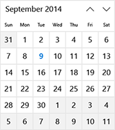
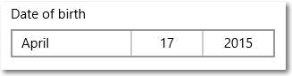

# Calendario, controles de fecha y hora

<link rel="stylesheet" href="https://az835927.vo.msecnd.net/sites/uwp/Resources/css/custom.css"> 

Los controles de fecha y hora ofrecen maneras estándar y localizadas para que el usuario pueda ver y establecer los valores de fecha y hora en la aplicación. Este artículo ofrece directrices de diseño y ayuda a elegir el control correcto.

> **API importantes**: [Clase CalendarView](https://msdn.microsoft.com/library/windows/apps/xaml/windows.ui.xaml.controls.calendarview.aspx), [Clase CalendarDatePicker](https://msdn.microsoft.com/library/windows/apps/xaml/windows.ui.xaml.controls.calendardatepicker.aspx), [Clase DatePicker](https://msdn.microsoft.com/library/windows/apps/xaml/windows.ui.xaml.controls.datepicker.aspx), [Clase TimePicker](https://msdn.microsoft.com/library/windows/apps/xaml/windows.ui.xaml.controls.timepicker.aspx)

## ¿Qué control fecha u hora debería usar?

Hay cuatro controles de fecha y hora para elegir; el control que uses dependerá de la situación. Usa esta información para seleccionar el control adecuado para tu aplicación.

&nbsp;|&nbsp;|&nbsp;                                                                                                                      
--------------------|-------|-------------------------------------------------------------------------------------------------------------------------------
Vista de calendario       ||Se usa para seleccionar una fecha determinada o un intervalo de fechas de un calendario siempre visible.                   
Selector de fecha del calendario||Se usa para seleccionar una fecha determinada de un calendario contextual. 
Selector de fecha         ||Se usa para seleccionar una sola fecha conocida cuando la información contextual no es importante.
Selector de hora         ||Se usa para seleccionar un único valor de hora.                                        

<!-- This table seems redundant, not sure it's needed.-->

### Vista de calendario

**CalendarView** permite al usuario ver e interactuar con un calendario por el que se puede navegar por mes, año o década. Un usuario puede seleccionar una fecha determinada o un intervalo de fechas. No tiene una superficie de selector y el calendario está siempre visible.

La vista del calendario se compone de 3 vistas separadas: la vista de mes, la vista de año y la vista de década. De manera predeterminada, se abre en la vista de mes, pero se puede especificar cualquier vista como la inicial.

- Si es necesario que un usuario pueda seleccionar varias fechas, debes usar una **CalendarView**.
- Si es necesario permitir que un usuario elija solo una fecha determinada y no necesita que haya un calendario siempre visible, considera usar un control **CalendarDatePicker** o **DatePicker**.

### Selector de fecha del calendario

**CalendarDatePicker** es un control desplegable que está optimizado para seleccionar una fecha determinada de una vista de calendario en la que la información contextual es importante, por ejemplo, el día de la semana o lo que se ha completado del calendario. Puedes modificar el calendario para que proporcione contexto adicional o limite las fechas disponibles.

El punto de entrada muestra texto del marcador de posición si no se ha establecido una fecha; de lo contrario, muestra la fecha elegida. Cuando el usuario selecciona el punto de entrada, se expande una vista de calendario para que el usuario realice una selección de fecha. La vista de calendario se superpone a otra interfaz de usuario; no hace que la otra interfaz desaparezca.

- Usa un selector de fecha del calendario para cosas como la elección de una cita o la fecha de salida. 

### Selector de fecha

El control **DatePicker** ofrece una forma estandarizada de elegir una fecha específica. 

El punto de entrada muestra la fecha elegida y, cuando el usuario lo selecciona, se expande una superficie del selector en sentido vertical desde el medio para que el usuario realice una selección. El selector de fecha se superpone a otra interfaz de usuario; no la hace desaparecer.

- Usa un selector de fecha para permitir que el usuario seleccione una fecha conocida, como una fecha de nacimiento, donde el contexto del calendario no es importante.

### Selector de hora

El **TimePicker** se usa para seleccionar un único valor para cosas como citas o una hora de salida. Es una visualización estática que establece el usuario o se establece en el código, pero no se actualiza para mostrar la hora actual. 

El punto de entrada muestra la hora elegida y, cuando el usuario lo selecciona, se expande una superficie del selector en sentido vertical desde el medio para que el usuario realice una selección. El selector de hora se superpone a otra interfaz de usuario; no hace que la otra interfaz desaparezca.

- Usa un selector de hora para permitir que el usuario seleccione un único valor de hora.

## Crea un control de fecha u hora

Consulte los siguientes artículos para obtener información y ejemplos específicos de cada control de fecha y hora.

- [Vista de calendario](calendar-view.md)
- [Selector de fecha del calendario](calendar-date-picker.md)
- [Selector de fecha](date-picker.md)
- [Selector de hora](time-picker.md)

### Globalización

Los controles de fecha XAML admiten todos los sistemas de calendario compatibles con Windows. Estos calendarios se especifican en la clase [Windows.Globalization.CalendarIdentifiers](https://msdn.microsoft.com/library/windows/apps/xaml/windows.globalization.calendaridentifiers.aspx). Cada control usa el calendario correcto para el idioma predeterminado de tu aplicación o puedes establecer la propiedad **CalendarIdentifier** para usar un sistema de calendario específico.

El control de selector de hora admite cada uno de los sistemas de reloj especificados en la clase [Windows.Globalization.ClockIdentifiers](https://msdn.microsoft.com/library/windows/apps/xaml/windows.globalization.clockidentifiers.aspx). Puedes establecer la propiedad [ClockIdentifier](https://msdn.microsoft.com/library/windows/apps/xaml/windows.ui.xaml.controls.timepicker.clockidentifier.aspx) para usar un reloj de 12 horas o un reloj de 24 horas. El tipo de la propiedad es String, pero debes usar valores que correspondan a las propiedades de cadena estática de la clase ClockIdentifiers. Estos son: TwelveHour (la cadena "12HourClock") y TwentyFourHour (la cadena "24HourClock"). El valor predeterminado es "12HourClock".

### Valores de DateTime y Calendar

Los objetos de fecha usados en los controles de fecha y hora XAML tienen una representación diferente según el lenguaje de programación. 
- C# y Visual Basic usan la estructura [System.DateTimeOffset](https://msdn.microsoft.com/library/windows/apps/xaml/system.datetimeoffset.aspx) que forma parte de .NET. 
- C++/CX usa la estructura [Windows::Foundation::DateTime](https://msdn.microsoft.com/library/windows/apps/xaml/br205770.aspx). 

Un concepto relacionado es la clase Calendar, que influye en la interpretación de fechas en contexto. Todas las aplicaciones de Windows Runtime pueden usar la clase [Windows.Globalization.Calendar](https://msdn.microsoft.com/library/windows/apps/xaml/windows.globalization.calendar.aspx). Las aplicaciones de C# y Visual Basic pueden usar también la clase [System.Globalization.Calendar](https://msdn.microsoft.com/library/windows/apps/xaml/system.globalization.calendar.aspx), que tiene una funcionalidad muy similar. (Las aplicaciones de Windows Runtime pueden usar la clase base Calendar de .NET, pero no las implementaciones específicas; por ejemplo, GregorianCalendar.)

.NET admite también un tipo denominado [DateTime](https://msdn.microsoft.com/library/windows/apps/xaml/system.datetime.aspx), que implícitamente se puede convertir a una estructura [DateTimeOffset](https://msdn.microsoft.com/library/windows/apps/xaml/system.datetimeoffset.aspx). Por lo tanto, es posible que veas un tipo de "DateTime" que se usa en el código .NET que se usa para establecer valores que son realmente DateTimeOffset. Para obtener más información sobre la diferencia entre DateTime y DateTimeOffset, consulta las observaciones de la clase [DateTimeOffset](https://msdn.microsoft.com/library/windows/apps/xaml/system.datetimeoffset.aspx).

> **Nota**&nbsp;&nbsp;No se pueden establecer propiedades que toman objetos de fecha como una cadena de atributos XAML, porque el analizador de XAML de Windows Runtime no tiene una lógica de conversión para convertir cadenas en fechas como objetos DateTime o DateTimeOffset. En general, estableces estos valores en el código. Otra técnica posible es definir una fecha que está disponible como un objeto de datos o en el contexto de datos, luego establece la propiedad como un atributo XAML que haga referencia a una expresión [\Extensión de marcado {Binding}](../xaml-platform/binding-markup-extension.md) que pueda obtener acceso a la fecha como datos.

## Obtener el código de ejemplo
* [Muestra de conceptos básicos de una interfaz de usuario de XAML](https://github.com/Microsoft/Windows-universal-samples/blob/master/Samples/XamlUIBasics)

## Temas relacionados

**Para desarrolladores (XAML)**
- [Clase CalendarView](https://msdn.microsoft.com/library/windows/apps/dn890052)
- [Clase CalendarDatePicker](https://msdn.microsoft.com/library/windows/apps/dn950083)
- [Clase DatePicker](https://msdn.microsoft.com/library/windows/apps/dn298584)
- [Clase TimePicker](https://msdn.microsoft.com/library/windows/apps/dn299280)
