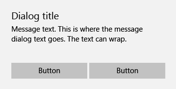

# Menús, cuadros de diálogo, controles flotantes y elementos emergentes

<link rel="stylesheet" href="https://az835927.vo.msecnd.net/sites/uwp/Resources/css/custom.css"> 

Los menús, cuadros de diálogo, controles flotantes y elementos emergentes mostrarán los elementos de interfaz de usuario transitorios que aparecen cuando el usuario los solicita o cuando sucede algo que requiere una notificación o aprobación.

<div class="important-apis" >
<b>API importantes</b><br/>
<ul>
<li><a href="https://msdn.microsoft.com/library/windows/apps/dn299030">Clase MenuFlyout</a></li>
<li><a href="https://msdn.microsoft.com/library/windows/apps/dn279496">Clase Flyout</a></li>
<li><a href="https://msdn.microsoft.com/library/windows/apps/windows.ui.xaml.controls.contentdialog.aspx">Clase ContentDialog</a></li>
</ul>

</div>
</div>


Un menú contextual proporciona al usuario acciones instantáneas. Se puede rellenar con comandos de texto. Para cerrar los menús contextuales por cambio de foco, puedes tocar o hacer clic en algún lugar fuera del menú.

Los cuadros de diálogo son superposiciones modales en la interfaz de usuario que proporcionan información contextual sobre la aplicación. Los cuadros de diálogo bloquean las interacciones con la ventana de la aplicación hasta que se descarten de forma explícita. A menudo solicitan algún tipo de acción por parte del usuario.

Un control flotante es un elemento emergente contextual ligero que muestra la interfaz de usuario relacionada con lo que está haciendo el usuario. Incluye lógica de colocación y tamaño, y se puede usar para revelar un control oculto, mostrar más detalles sobre un elemento o pedirle al usuario que confirme una acción. Los controles flotantes se pueden cerrar por cambio de foco tocando o haciendo clic en algún lugar fuera del elemento emergente.


## ¿Es este el control adecuado?

Los menús contextuales se puede usar para:

-   Acciones contextuales.
-   Comandos para un objeto sobre el que se debe actuar, pero que no se puede seleccionar.

Los cuadros de diálogo se pueden usar para:

- Expresar información importante que el usuario debe leer y confirmar antes de continuar.
- Solicitar una acción clara del usuario o comunicar un mensaje importante que el usuario debe confirmar. Algunos ejemplos son los siguientes:
  - Los casos en que se puede ver comprometida la seguridad del usuario
  - Los casos en que el usuario está a punto de modificar un activo valioso de manera permanente
  - Los casos en que el usuario está a punto de eliminar un activo valioso
  - Para confirmar una compra desde la aplicación
- Mensajes de error que se aplican al contexto general de la aplicación, como un error de conectividad.
- Preguntas cuando la aplicación deba hacer al usuario una pregunta de bloqueo, por ejemplo, cuando la aplicación no puede elegir en nombre del usuario. Una pregunta de bloqueo no se puede ignorar ni posponer, y debe ofrecer al usuario opciones bien definidas.

Los controles flotantes se puede usar para:

-   interfaces de usuario contextuales y transitorias;
-   advertencias y confirmaciones, incluidas las que están relacionadas con acciones potencialmente destructivas;
-   mostrar más información, como detalles o descripciones más largas de un elemento de la página.


## Ejemplos

Este es un típico menú contextual de un solo panel con una lista breve de comandos sencillos. Se puede desplazar si es necesario. Usa separadores según sea necesario para agrupar comandos similares.


Un menú contextual en cascada se puede usar para una colección más completa de comandos. Cuenta con niveles de control flotante múltiples y se puede desplazar. Usa separadores según sea necesario para agrupar comandos similares.


Este es un ejemplo de un cuadro de diálogo de confirmación con solo botón y en pantalla completa. Con este tipo de cuadro de diálogo, se proporciona al usuario una gran cantidad de información que esperaba leer antes de presionar el botón para continuar.


Este es un ejemplo de un cuadro de diálogo de dos botones que se presenta al usuario la opción A/B. Por lo general, la cantidad de información que se presenta en este cuadro de diálogo es breve.



## Cierre del elemento modal frente a cierre del elemento por cambio de foco

Los cuadros de diálogo son modales, lo que significa que bloquean toda interacción con la aplicación hasta que el usuario seleccione un botón de cuadro de diálogo. Para reforzar visualmente su comportamiento modal, los cuadros de diálogo dibujan una capa de superposición que oculta parcialmente la interfaz de usuario de la aplicación temporalmente inaccesible.

**Nota** Cuando Cancelar es una de las opciones disponibles del cuadro de diálogo, las aplicaciones pueden elegir permitir que los usuarios descarten el cuadro de diálogo presionando la tecla Escape. Este comportamiento no está integrado en el control, pero es una combinación de teclas implementada normalmente.

Los controles flotantes y menús contextuales son controles de cierre del elemento por cambio de foco, lo que significa que los usuarios pueden elegir entre una variedad de acciones para descartar rápidamente interfaces de usuario transitorias. Estas interacciones están destinadas a ser ligeras y de no bloqueo. Algunas de las acciones de cierre del elemento por cambio de foco son
- Hacer clic o pulsar fuera de la interfaz de usuario transitoria
- Presionar la tecla Escape
- Presionar el botón Atrás
- Cambiar el tamaño de la ventana de la aplicación
- Cambiar la orientación del dispositivo


## Instrucciones de uso de cuadros de diálogo

-   Identifica claramente el problema o el objetivo del usuario en la primera línea del texto del cuadro de diálogo.
-   El título del cuadro de diálogo es la instrucción principal y es opcional.
    -   Usa un título corto para explicar lo que se necesita hacer con el cuadro de diálogo. Los títulos largos no se ajustan y se truncan.
    -   Puedes omitir el título si vas a usar el cuadro de diálogo para transmitir un mensaje sencillo, un error o una pregunta. Deja que el texto del contenido transmita esta información esencial.
    -   Asegúrate de que el título esté relacionado directamente con las opciones de botón.
-   El contenido del cuadro de diálogo contiene el texto descriptivo y es obligatorio.
    -   Presenta el mensaje, el error o la pregunta de bloqueo de la manera más sencilla posible.
    -   Si se usa un cuadro de diálogo, usa el área de contenido para proporcionar más detalles o definir terminología. No repitas el título con otras palabras ligeramente distintas.
-   Al menos debe aparecer un botón de cuadro de diálogo.
    -   Los botones son el único mecanismo para que los usuarios descarten el cuadro de diálogo.
    -   Usa botones con texto que identifique respuestas específicas a la instrucción principal o el contenido. Un ejemplo sería: "¿Quieres permitir que nombreDeAplicación acceda a tu ubicación?", seguido de los botones "Permitir" y "Bloquear". Cuando las respuestas son específicas, se comprenden con mayor rapidez y la toma de decisiones resulta eficaz.
-   Los cuadros de diálogo de error muestran el mensaje de error en el cuadro de diálogo, junto con la información pertinente. El único botón que se usa en un cuadro de diálogo de error debe ser "Cerrar" o una acción similar.
-   No uses cuadros de diálogo en el caso de los errores que son contextuales para un lugar específico de la página, como los errores de validación (en los campos de contraseña, por ejemplo); usa el lienzo de la aplicación para mostrar errores en línea.

## Control flotante

Un control flotante es un contenedor abierto que puede mostrar interfaz de usuario arbitraria como su contenido.  Los controles flotantes no tienen elementos visuales propios, son simplemente un control de contenido. Los controles flotantes tienen un margen y se agregan barras de desplazamiento opcionales alrededor de su contenido. Para diseñar un control flotante, modifica su propiedad [FlyoutPresenterStyle](https://msdn.microsoft.com/library/windows/apps/windows.ui.xaml.controls.flyout.flyoutpresenterstyle.aspx).

El siguiente código muestra un párrafo de texto ajustado y hace que el bloque de texto sea accesible para un lector de pantalla.

````xaml
<Flyout>
  <Flyout.FlyoutPresenterStyle>
    <Style TargetType="FlyoutPresenter">
      <Setter Property="ScrollViewer.HorizontalScrollMode" Value="Disabled"/>
      <Setter Property="ScrollViewer.HorizontalScrollBarVisibility" Value="Disabled"/>
      <Setter Property="IsTabStop" Value="True"/>
      <Setter Property="TabNavigation" Value="Cycle"/>
    </Style>
  </Flyout.FlyoutPresenterStyle>
  <TextBlock Style="{StaticResource BodyTextBlockStyle}" Text="Lorem ipsum dolor sit amet, consectetur adipiscing elit, sed do eiusmod tempor incididunt ut labore et dolore magna aliqua. Ut enim ad minim veniam, quis nostrud exercitation ullamco laboris nisi ut aliquip ex ea commodo consequat."/>
</Flyout>
````

### Invocación y ubicación

Los controles flotantes y menús contextuales se adjuntan a controles específicos. Cuando son visibles, deben anclarse al objeto de invocación y se debe especificar su posición relativa preferida con relación al objeto: arriba, izquierda, abajo o derecha. El control flotante también tiene un modo de colocación completa que intenta ampliar el control flotante y centrarlo dentro de la ventana de la aplicación.

La [clase Button](https://msdn.microsoft.com/library/windows/apps/windows.ui.xaml.controls.button.aspx) incluye una propiedad [**Flyout**](https://msdn.microsoft.com/library/windows/apps/windows.ui.xaml.controls.button.flyout.aspx), que te permite especificar la interfaz de usuario transitoria que se abrirá cuando el usuario haga clic o pulse en el botón.

````xaml
<Button Content="Click me">
  <Button.Flyout>
     <Flyout>
        <TextBlock Text="Yay!"/>
     </Flyout>
  </Button.Flyout>
</Button>
````


## Artículos relacionados

**Para desarrolladores**
- [**Clase MenuFlyout**](https://msdn.microsoft.com/library/windows/apps/dn299030)
- [**Clase Flyout**](https://msdn.microsoft.com/library/windows/apps/dn279496)
- [**Clase ContentDialog**](https://msdn.microsoft.com/library/windows/apps/windows.ui.xaml.controls.contentdialog.aspx)


<!--HONumber=Aug16_HO3-->


