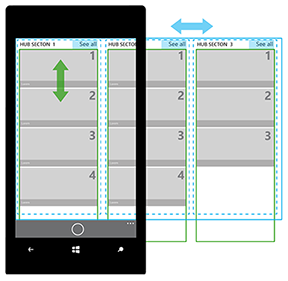
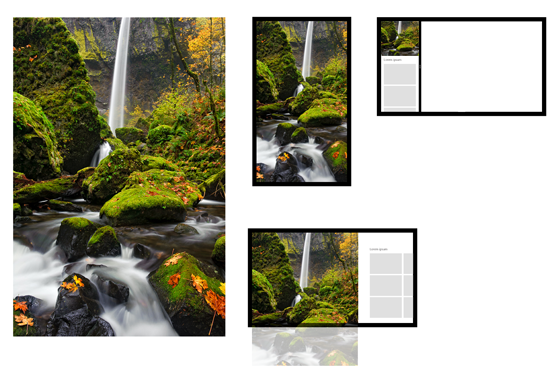
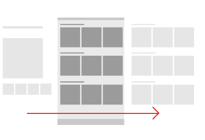

# Patrón o control de navegación centralizada

Un control de navegación centralizada permite organizar el contenido de la aplicación en secciones o categorías distintas, aunque relacionadas. Las secciones de un control de navegación centralizada están pensadas para que se recorran en un orden preferido y pueden servir como punto de partida para experiencias más detalladas.

El contenido en un control de navegación centralizada se puede mostrar en una vista panorámica sólida que permite a los usuarios obtener una vista rápida de lo que es nuevo, lo que está disponible y lo que es relevante. Las navegaciones centralizadas suelen tener un encabezado de página, mientras que varias secciones de contenido obtienen cada una un encabezado de sección.

El control de navegación centralizada tiene varias funciones que hacen que funcione bien para crear un patrón de navegación de contenido.

-   **Navegación visual**

    Un control de navegación centralizada permite que el contenido se muestre en una matriz diversa, breve y fácil de examinar.

-   **Categorización**

    Cada sección de navegación centralizada permite organizar el contenido en un orden lógico.

-   **Tipos de contenido mixto**

    Con los tipos de contenido mixto, son comunes los tamaños y las relaciones de activos variables. Un control de navegación centralizada permite que cada tipo de contenido se ordene de forma exclusiva y clara en cada sección del control de navegación centralizada.

-   **Anchos de página y de contenido variables**

    Dado que es un modelo panorámico, el control de navegación centralizada permite variabilidad en sus anchos de sección. Esto es ideal para el contenido de distintas profundidades y permite dar formato igual de bien a una cantidad de elementos de pequeña a grande.

-   **Arquitectura flexible**

    Si prefieres mantener la arquitectura de la aplicación superficial, puedes tener todo el contenido del canal en un resumen de sección del control de navegación centralizada.

API importantes

-   [**Clase Hub (XAML)**](https://msdn.microsoft.com/library/windows/apps/dn251843)
-   [**Clase HubSection (XAML)**](https://msdn.microsoft.com/library/windows/apps/dn251845)
-   [**Objeto Hub (HTML)**](https://msdn.microsoft.com/library/windows/apps/dn255137)

## ¿Es este el control adecuado?

El control de navegación centralizada funciona bien para mostrar grandes cantidades de contenido organizado en una jerarquía. Los concentradores dan prioridad a la exploración y detección de contenido nuevo, lo que los hace útiles para mostrar elementos en una tienda o una colección de elementos multimedia.

La navegación centralizada es solo uno de varios elementos de navegación que puedes usar. Para más información sobre patrones de navegación y otros elementos de navegación, consulta el artículo [Conceptos básicos del diseño de navegación para aplicaciones para la Plataforma universal de Windows (UWP)](https://msdn.microsoft.com/library/windows/apps/dn958438).

## Arquitectura de navegación centralizada

El control de navegación centralizada tiene un patrón de navegación jerárquico que admite aplicaciones con una arquitectura de información relacional. Un control de navegación centralizada consta de distintas categorías de contenido, cada una de las cuales se asigna a las páginas de sección de la aplicación. Las páginas de sección se pueden mostrar de la manera que mejor represente el escenario y el contenido que incluye la sección.

## Diseños y desplazamiento y movimiento panorámico

Hay varias maneras de diseñar y navegar por el contenido en un control de navegación centralizada; simplemente asegúrate de que las listas de contenido de un control de navegación centralizada siempre se desplazan de forma lateral en una dirección perpendicular a la dirección en la que se desplaza el control.

**Movimiento panorámico horizontal**

**Movimiento panorámico vertical**

**Movimiento panorámico horizontal con lista/cuadrícula de desplazamiento vertical**

**Movimiento panorámico vertical con lista/cuadrícula de desplazamiento horizontal**

## Ejemplos

El control de navegación centralizada proporciona flexibilidad de diseño. Esto te permite diseñar aplicaciones que ofrecen una amplia variedad de experiencias atractivas y visualmente enriquecidas. Puedes usar una imagen o sección de contenido principal para el primer grupo; una imagen grande de la imagen principal se puede recortar vertical y horizontalmente sin perder el centro de interés. El siguiente ejemplo muestra de qué manera se puede recortar una imagen principal usada como prototipo, para obtener un ancho horizontal, vertical o estrecho.

En los dispositivos móviles, las secciones de navegación centralizada están visibles de una en una.

## Recomendaciones

-   Para que los usuarios sepan que hay más contenido en una sección del control de navegación centralizada, te recomendamos que recortes el contenido para que se vea parte de él.
-   En función de las necesidades de la aplicación, puedes añadir varias secciones de navegación centralizada al control de navegación centralizada, donde cada una de ellas ofrecerá su propio propósito funcional. Por ejemplo, una sección podría contener una serie de vínculos y controles, mientras que otra sección podría ser un repositorio de imágenes en miniatura. Un usuario puede desplazarse entre estas secciones usando la compatibilidad con gestos integrada en el control de navegación centralizada.
-   La mejor forma de acomodar distintos tamaños de ventana es que el contenido se redistribuya de manera dinámica.
-   Si tienes muchas secciones del control de navegación centralizada, considera la posibilidad de agregar zoom semántico. Esto también facilita la búsqueda de secciones cuando la aplicación cambia de tamaño a un ancho estrecho.
-   Te recomendamos que no tengas un elemento en una sección del control de navegación centralizada que lleve a otro control; en su lugar, puedes usar encabezados interactivos para navegar a otra sección o página del control de navegación centralizada.
-   El control de navegación centralizada es un punto de partida y está pensado para que se personalice y se ajuste a las necesidades de la aplicación. Puedes cambiar los siguientes aspectos de un control de navegación centralizada:
    -   Número de secciones
    -   Tipo de contenido en cada sección
    -   Ubicación y orden de secciones
    -   Tamaño de secciones
    -   Espaciado entre secciones
    -   Espaciado entre una sección y la parte superior o inferior del concentrador
    -   Tamaño y estilo de texto en encabezados y contenido
    -   Color de fondo, secciones, encabezados de secciones y contenido de secciones

\[Este artículo contiene información específica de las aplicaciones para UWP y Windows 10. Para obtener instrucciones sobre Windows 8.1, descarga el [PDF sobre las directrices para Windows 8.1](https://go.microsoft.com/fwlink/p/?linkid=258743)\].

## Artículos relacionados
-----------------------------------------------

**Para diseñadores**
- [Conceptos básicos de navegación](https://msdn.microsoft.com/library/windows/apps/dn958438)

**Para desarrolladores (XAML)**
- [Navegación jerárquica, de principio a fin](https://msdn.microsoft.com/library/windows/apps/xaml/dn440585)
- [**Clase Hub del espacio de nombres Windows.UI.Xaml.Controls**](https://msdn.microsoft.com/library/windows/apps/dn251843)
- [Ejemplo del control Hub XAML](http://go.microsoft.com/fwlink/p/?LinkID=310072)
- [Usar un control de navegación centralizada](https://msdn.microsoft.com/library/windows/apps/xaml/dn308518)

<!--HONumber=Mar16_HO1-->

