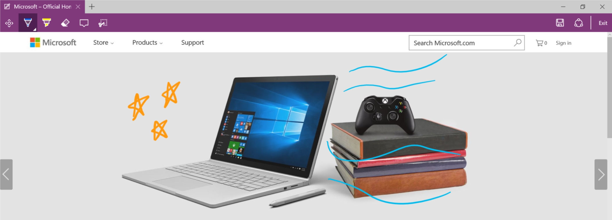
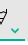
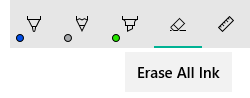

# Controles de entrada manuscrita

<link rel="stylesheet" href="https://az835927.vo.msecnd.net/sites/uwp/Resources/css/custom.css">

Hay dos controles diferentes que facilitan la entrada manuscrita en aplicaciones para la Plataforma universal de Windows (UWP): [**InkCanvas**](https://msdn.microsoft.com/en-us/library/windows/apps/windows.ui.xaml.controls.inkcanvas.aspx) e [**InkToolbar**](https://msdn.microsoft.com/en-us/library/windows/apps/windows.ui.xaml.controls.inktoolbar.aspx).

El control InkCanvas representa la entrada manuscrita como un trazo de lápiz (con la configuración predeterminada de color y espesor) o un trazo de borrado. Este control es una superposición transparente que no incluye ninguna interfaz de usuario integrada para cambiar las propiedades de trazo de lápiz predeterminadas.

>**Nota**&nbsp;&nbsp;El control InkCanvas se puede configurar para admitir funcionalidades similares para la entrada del mouse y táctil.

Dado que el control InkCanvas no ofrece soporte para cambiar la configuración de trazo de lápiz predeterminada, se puede emparejar con un control InkToolbar. El control InkToolbar contiene una colección personalizable y extensible de botones que activan características relacionadas con las entradas de lápiz en un control InkCanvas asociado.

De manera predeterminada, el control InkToolbar incluye botones para dibujar, borrar, resaltar y mostrar una regla. Dependiendo de la característica, en un control flotante se proporcionan otros comandos y opciones de configuración, como los destinados a definir el color y el grosor del trazo o a borrar todas las entradas de lápiz.

>**Nota**&nbsp;&nbsp;El control InkToolbar admite la entrada manuscrita y del mouse, y se puede configurar para que reconozca la entrada táctil.


<div class="important-apis" >
<b>API importantes</b><br/>
<ul>
<li><a href="https://msdn.microsoft.com/en-us/library/windows/apps/windows.ui.xaml.controls.inkcanvas.aspx"><strong>Clase InkCanvas</strong></a></li>
<li><a href="https://msdn.microsoft.com/en-us/library/windows/apps/windows.ui.xaml.controls.inktoolbar.aspx"><strong>Clase InkToolbar</strong></a></li>
<li><a href="https://msdn.microsoft.com/en-us/library/windows/apps/windows.ui.input.inking.inkpresenter.aspx"><strong>Clase InkPresenter</strong></a></li>
<li><a href="https://msdn.microsoft.com/library/windows/apps/br208524"><strong>Windows.UI.Input.Inking</strong></a></li>
</ul>

</div>
</div>


## ¿Es este el control adecuado?

Usa el control InkCanvas cuando necesites habilitar las funciones de entrada manuscrita básicas en tu aplicación sin proporcionar ninguna configuración de entrada de lápiz al usuario.

De manera predeterminada, los trazos se representan como entrada de lápiz al usar la punta del lápiz (un bolígrafo negro con un grosor de 2 píxeles) y como un borrador al usar el extremo borrador. Si no hay ningún extremo borrador, el control InkCanvas puede configurarse para procesar la entrada de la punta del lápiz como trazos de borrado.

Empareja el control InkCanvas con un control InkToolbar para proporcionar una interfaz de usuario para activar las características de entrada de lápiz y establecer propiedades de entrada de lápiz básicas, como el tamaño y el color del trazo o la forma de la punta del lápiz.

>**Nota**&nbsp;&nbsp;Para obtener más opciones para personalizar el trazo de lápiz que se representa en un control InkCanvas, usa el objeto subyacente [**InkPresenter**](https://msdn.microsoft.com/en-us/library/windows/apps/windows.ui.input.inking.inkpresenter.aspx).

## Ejemplos

**Microsoft Edge**

El explorador Edge usa los controles InkCanvas e InkToolbar para las **notas web**.  


**Área de trabajo de Windows Ink**

Los controles InkCanvas e InkToolbar también se usan para las opciones **Bloc de bocetos** y **Anotación en captura de pantalla** en el **Área de trabajo de Windows Ink**.  


## Crear un control InkCanvas y un control InkToolbar

Para agregar un control InkCanvas a tu aplicación se requiere una sola línea de marcado:

```xaml
<InkCanvas x:Name=“myInkCanvas”/>
```

>**Nota**&nbsp;&nbsp;Para la personalización detallada del control InkCanvas mediante InkPresenter, consulta el artículo ["Interacciones de pluma y lápiz en aplicaciones para UWP"](http://windowsstyleguide/input-and-devices/pen-and-stylus-interactions/).

El control InkToolbar debe usarse junto con un control InkCanvas. La incorporación de un control InkToolbar (con todas las herramientas integradas) en la aplicación requiere una línea de marcado adicional:

 ```xaml
<InkToolbar TargetInkCanvas=“{x:Bind myInkCanvas}”/>
 ```

Esta línea muestra el control InkToolbar siguiente:


### Botones integrados

El control InkToolbar incluye los siguientes botones integrados:

**Lápices**

- Bolígrafo: dibuja un trazo opaco sólido con una punta de lápiz redonda. El tamaño del trazo depende de la presión del lápiz que se detecte.
- Lápiz: dibuja un trazo de borde suave, semitransparente y con textura (útil para efectos de sombreado superpuestos) con una punta de lápiz redonda. El color del trazo (oscuridad) depende de la presión del lápiz que se detecte.
- Marcador de resaltado: dibuja un trazo semitransparente con una punta de lápiz rectangular.

Puedes personalizar los atributos de paleta de colores y tamaño (mínimo, máximo y predeterminado) en el control flotante de cada lápiz.

**Herramienta**

- Borrador: elimina cualquier trazo de lápiz que se toque. Ten en cuenta que se eliminará todo el trazo de lápiz, no solo la parte que se encuentre debajo del trazo de borrador.

**Alternancia**

- Regla: muestra u oculta la regla. Al dibujar cerca del borde de la regla, el trazo de lápiz se ajusta a la regla.  
 

Aunque esta es la configuración predeterminada, tienes control total sobre los botones integrados que se incluyen en el control InkToolbar para tu aplicación.

### Botones personalizados

El control InkToolbar consta de dos grupos de tipos de botones:

1. Un grupo de botones de "herramienta" que contiene los botones para dibujar, borrar y resaltar integrados. Las herramientas y los lápices personalizados se agregan aquí.
> **Nota**&nbsp;&nbsp;La selección de características es mutuamente exclusiva.

2. Un grupo de botones de "alternancia" que contiene el botón de regla integrado. Las alternancias personalizadas se agregan aquí.
> **Nota**&nbsp;&nbsp;Las características no son mutuamente exclusivas y se pueden usar simultáneamente con otras herramientas activas.

Dependiendo de la aplicación y de la funcionalidad de entrada manuscrita necesaria, puedes agregar cualquiera de los siguientes botones (enlazados a sus características de entrada de lápiz personalizada) al control InkToolbar:

- Lápiz personalizado: lápiz para el cual la aplicación host define las propiedades de punta de lápiz y paleta de colores del trazo, como la forma, la rotación y el tamaño.
- Herramienta personalizada: herramienta que no es un lápiz definida por la aplicación host.
- Alternancia personalizada: establece el estado de una característica definida por la aplicación en activado o desactivado. Cuando se activa, la característica funciona junto con la herramienta activa.

> **Nota**&nbsp;&nbsp;No puedes cambiar el orden de visualización de los botones integrados. El orden de visualización predeterminado es: bolígrafo, lápiz, marcador de resaltado, borrador y regla. Los lápices personalizados se agregan al último lápiz predeterminado, los botones de la herramienta personalizada se agregan entre el último botón del lápiz y el botón de borrador, y los botones de alternancia personalizada se agregan detrás del botón de regla. (Los botones personalizados se agregan en el orden en que se especifican).

Si bien el control InkToolbar puede ser un elemento de nivel superior, por lo general se expone a través de un comando o botón "Entrada manuscrita". Se recomienda usar el glifo EE56 de la fuente Segoe MDL2 Assets como un icono de nivel superior.

## Interacción del control InkToolbar

Todos los botones de lápiz y herramienta integrados incluyen un menú de control flotante donde se pueden establecer las propiedades de entrada de lápiz, así como la forma y el tamaño de la punta del lápiz. Un "glifo de extensión"  se muestra en el botón para indicar la existencia del control flotante.

El control flotante se muestra cuando se selecciona de nuevo el botón de una herramienta activa. Cuando se cambia el color o el tamaño, el control flotante se descarta automáticamente y se puede reanudar la entrada manuscrita. Las herramientas y los lápices personalizados pueden usar el control flotante predeterminado o especificar un control flotante personalizado.

El borrador también tiene un control flotante que proporciona el comando **Borrar todas las entradas de lápiz**.  


 Para obtener información sobre la personalización y la extensibilidad, echa un vistazo a la [muestra de SimpleInk](https://github.com/Microsoft/Windows-universal-samples/tree/master/Samples/SimpleInk).

## Qué hacer y qué no hacer

- El control InkCanvas, y la entrada manuscrita en general, funcionan mejor con un lápiz activo. Sin embargo, se recomienda admitir la entrada manuscrita con la entrada del mouse y táctil (incluido el lápiz pasivo) si tu aplicación lo requiere.
- Usa un control InkToolbar con el control InkCanvas para proporcionar la configuración y las características de entrada manuscrita básicas. Ambos controles InkCanvas e InkToolbar pueden personalizarse mediante programación.
- El control InkToolbar, y la entrada manuscrita en general, funcionan mejor con un lápiz activo. Sin embargo, la entrada manuscrita con el mouse y táctil puede admitirse si tu aplicación lo requiere.
- Si se admite la entrada manuscrita con la entrada táctil, se recomienda usar el icono de ED5F de la fuente Segoe MLD2 Assets para el botón de alternancia, con una información sobre herramientas "Escritura táctil".
- Si se proporciona selección de trazo, se recomienda usar el icono de EF20 de la fuente Segoe MLD2 Assets para el botón de herramienta, con una información sobre herramientas "Herramienta de selección".
- Si se usa más de un control InkCanvas, se recomienda usar un solo control InkToolbar para controlar la entrada manuscrita en lienzos.
- Para obtener un rendimiento óptimo, se recomienda modificar el control flotante predeterminado, en lugar de crear uno personalizado para las herramientas predeterminadas y personalizadas.

## Obtener las muestras

La [muestra de SimpleInk](https://github.com/Microsoft/Windows-universal-samples/tree/master/Samples/SimpleInk) demuestra los 8 escenarios en torno a las capacidades de personalización y extensibilidad de los controles InkCanvas e InkToolbar. Cada escenario proporciona pautas básicas sobre las situaciones de entrada manuscrita e implementaciones de controles comunes.

Para ver una muestra de entrada manuscrita más avanzada, consulta la [muestra de ComplexInk](https://github.com/Microsoft/Windows-universal-samples/tree/master/Samples/ComplexInk).

## Artículos relacionados

- [Interacciones de pluma y lápiz en aplicaciones para UWP](http://windowsstyleguide/input-and-devices/pen-and-stylus-interactions/)
- [Reconocer trazos de lápiz](http://windowsstyleguide/input-and-devices/convert-ink-to-text/)
- [Almacenar y recuperar trazos de lápiz](http://windowsstyleguide/input-and-devices/save-and-load-ink/)


<!--HONumber=Nov16_HO1-->


