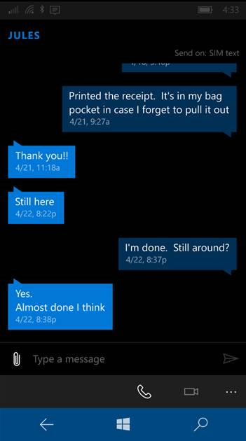

# Listas invertidas

<link rel="stylesheet" href="https://az835927.vo.msecnd.net/sites/uwp/Resources/css/custom.css"> 

Puedes usar una vista de lista para presentar una conversación en una experiencia de chat con elementos que sean visualmente distintos para representar al remitente y al receptor.  El uso de colores diferentes y la alineación horizontal para separar los mensajes del remitente y el receptor ayuda al usuario a orientarse rápidamente en una conversación.
 
Por lo general, deberás presentar la lista de manera que parezca que crece de abajo arriba en lugar de hacerlo de arriba abajo.  Cuando llega un nuevo mensaje y se agrega al final, los mensajes anteriores se deslizan hacia arriba para dejar espacio, de modo que el usuario centre su atención en este último mensaje.  Sin embargo, si un usuario se desplaza hacia arriba para ver respuestas anteriores, la llegada de un nuevo mensaje no causará ningún cambio visual que afecte a su atención.



<div class="important-apis" >
<b>API importantes</b><br/>
<ul>
<li><a href="https://msdn.microsoft.com/library/windows/apps/windows.ui.xaml.controls.listview.aspx"><strong>Clase ListView</strong></a></li>
<li><a href="https://msdn.microsoft.com/library/windows/apps/windows.ui.xaml.controls.itemsstackpanel.aspx"><strong>Clase ItemsStackPanel</strong></a></li>
<li><a href="https://msdn.microsoft.com/library/windows/apps/windows.ui.xaml.controls.itemsstackpanel.itemsupdatingscrollmode.aspx"><strong>Propiedad ItemsUpdatingScrollMode</strong></a></li>
</ul>

</div>
</div>


## Crear una lista invertida

Para crear una lista invertida, usa una vista de lista con una clase [**ItemsStackPanel**](https://msdn.microsoft.com/library/windows/apps/windows.ui.xaml.controls.itemsstackpanel.aspx) como panel de elementos. En la clase ItemsStackPanel, establece [**ItemsUpdatingScrollMode**](https://msdn.microsoft.com/library/windows/apps/windows.ui.xaml.controls.itemsstackpanel.itemsupdatingscrollmode.aspx) en [**KeepLastItemInView**](https://msdn.microsoft.com/library/windows/apps/windows.ui.xaml.controls.itemsupdatingscrollmode.aspx).

> **Importante**&nbsp;&nbsp;El valor de enumeración **KeepLastItemInView** está disponible a partir de Windows 10, versión 1607. Si la aplicación se ejecuta en versiones anteriores de Windows 10, no puedes usar este valor.

En este ejemplo se muestra cómo alinear los elementos de la vista de lista en la parte inferior y se indica que, al producirse un cambio en los elementos, el último elemento debe permanecer en la vista.
 
 **XAML**
 ```xaml
<ListView>
    <ListView.ItemsPanel>
        <ItemsPanelTemplate>
            <ItemsStackPanel VerticalAlignment="Bottom"
                             ItemsUpdatingScrollMode="KeepLastItemInView"/>
        </ItemsPanelTemplate>
    </ListView.ItemsPanel>
</ListView>
```

## Recomendaciones

- Alinea los mensajes del remitente o el receptor en lados opuestos para mostrar claramente el flujo de la conversación a los usuarios.
- Haz que los mensajes existentes desaparezcan de la vista para mostrar el último mensaje si el usuario ya está al final de la conversación en espera del siguiente mensaje.
- No muevas elementos de modo que perturbes la atención de los usuarios si no están leyendo el final de la conversación.


<!--HONumber=Aug16_HO3-->


