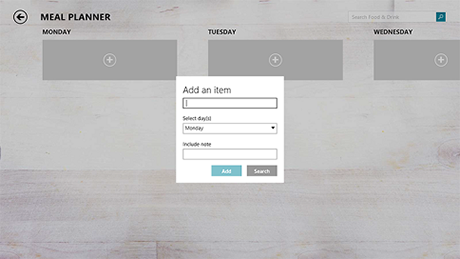

# Etiquetas

\[ Actualizado para aplicaciones para UWP en Windows 10. Para leer más artículos sobre Windows 8.x, consulta el [archivo](http://go.microsoft.com/fwlink/p/?linkid=619132) \]

Una etiqueta es el nombre o título de un control o un grupo de controles relacionados.

**API importantes**

-   Propiedad Header
-   [**Clase TextBlock**](https://msdn.microsoft.com/library/windows/apps/br209652)

En XAML, muchos controles tienen una propiedad Header integrada que sirve para mostrar la etiqueta. En los controles sin propiedad Header o para etiquetar grupos de controles, puedes usar un [**TextBlock**](https://msdn.microsoft.com/library/windows/apps/br209652) en su lugar.

## Ejemplo

## Recomendaciones

-   Usa una etiqueta para indicar al usuario lo que debe escribir en un control adyacente. También puedes etiquetar un grupo de controles relacionados o mostrar un texto de instrucciones junto a un grupo de controles relacionados.
-   Al etiquetar controles, escribe una etiqueta que sea un sustantivo o una frase nominal breve, no una oración completa, y sin tono de instrucción. Evita los dos puntos u otro signo de puntuación.
-   Cuando haya un texto de instrucciones en una etiqueta, la cadena de texto puede ser más larga y también puedes usar signos de puntuación.

## Temas relacionados

* [Controles de texto](text-controls.md)

**Para desarrolladores**
* [**Propiedad TextBox.Header**](https://msdn.microsoft.com/library/windows/apps/dn252861)
* [**Propiedad PasswordBox.Header**](https://msdn.microsoft.com/library/windows/apps/dn299051)
* [**Propiedad ToggleSwitch.Header**](https://msdn.microsoft.com/library/windows/apps/br209713)
* [**Propiedad DatePicker.Header**](https://msdn.microsoft.com/library/windows/apps/dn279460)
* [**Propiedad TimePicker.Header**](https://msdn.microsoft.com/library/windows/apps/dn299286)
* [**Propiedad Slider.Header**](https://msdn.microsoft.com/library/windows/apps/dn252829)
* [**Propiedad ComboBox.Header**](https://msdn.microsoft.com/library/windows/apps/dn279416)
* [**Propiedad RichEditBox.Header**](https://msdn.microsoft.com/library/windows/apps/dn252726)
* [**Clase TextBlock**](https://msdn.microsoft.com/library/windows/apps/br209652)

 

 

<!--HONumber=Mar16_HO1-->

