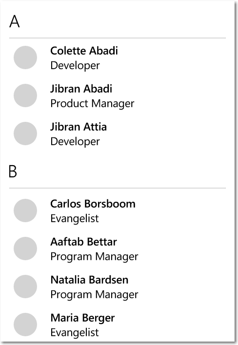
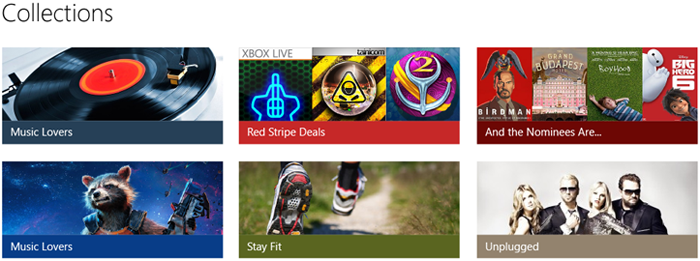

# Listas

<link rel="stylesheet" href="https://az835927.vo.msecnd.net/sites/uwp/Resources/css/custom.css"> 

Mostrar listas y habilitar la interacción con el contenido basado en la colección. Los cuatro patrones de lista tratados en este artículo son:

-   Vistas de lista, que se usan principalmente para mostrar colecciones de contenido con mucho texto
-   Vistas de cuadrícula, que se usan principalmente para mostrar colecciones de contenido con muchas imágenes
-   Listas desplegables, que permiten que los usuarios elijan un elemento desde una lista ampliable
-   Cuadros de lista, que permiten que los usuarios elijan uno o varios elementos desde un cuadro que se puede desplazar

Se proporcionan directrices de diseño, características y ejemplos para cada patrón de lista. Al final del artículo, se encuentran vínculos a temas relacionados y API.

<b>API importantes</b> 
<ul>
<li><a href="https://msdn.microsoft.com/library/windows/apps/br242878"><strong>Clase ListView</strong></a></li>
<li><a href="https://msdn.microsoft.com/library/windows/apps/br242705"><strong>Clase GridView</strong></a></li>
<li><a href="https://msdn.microsoft.com/library/windows/apps/br209348"><strong>Clase ComboBox</strong></a></li>
</ul>

## Vistas de lista

Las vistas de lista te permiten clasificar elementos y asignar encabezados de grupo, arrastrar y colocar elementos, mantener el contenido y reordenar los elementos.

### ¿Es este el control adecuado?

Usa una vista de lista para:

-   Mostrar una colección de contenido que está compuesta principalmente por texto.
-   Navegar por una colección única o por categorías de contenido.
-   Crear el panel maestro en la [vista maestro y detalles](master-details.md). Maestro y detalles es el patrón que se suele usar en aplicaciones de correo electrónico, en las que un panel (el maestro) tiene una lista de elementos seleccionables, mientras que el otro panel tiene una vista detallada del elemento seleccionado.

### Ejemplos

Esta es una vista de lista simple que muestra los datos agrupados en un teléfono.

### Recomendaciones

-   Los elementos de una lista deben tener el mismo comportamiento.
-   Si tu lista está dividida en grupos, puedes usar el [zoom semántico](semantic-zoom.md), que facilita a los usuarios la navegación por los contenidos agrupados.

### Artículos de vista de lista
<table>
<colgroup>
<col width="50%" />
<col width="50%" />
</colgroup>
<thead>
<tr class="header">
<th align="left">Tema</th>
<th align="left">Descripción</th>
</tr>
</thead>
<tbody>
<tr class="odd">
<td align="left">
[Vista de lista y vista de cuadrícula](listview-and-gridview.md)
</td>
<td align="left">
Aprende los conceptos básicos del uso de una vista de lista o una vista de cuadrícula en tu aplicación.
</td>
</tr>
<tr class="even">
<td align="left">
[Plantillas de elemento de la vista de lista](listview-item-templates.md)
</td>
<td align="left">
Los elementos que se muestran en una lista o cuadrícula pueden tener un papel importante en el aspecto general de la aplicación. Modifica las plantillas de control y las plantillas de datos para definir la apariencia de los elementos y mejorar el aspecto de tu aplicación.
</td>
</tr>
<tr class="odd">
<td align="left">
[Listas invertidas](inverted-lists.md)
</td>
<td align="left">
Las listas invertidas tienen nuevos elementos agregados en la parte inferior, al igual que en una aplicación de chat. Sigue estas instrucciones para usar una lista invertida en tu aplicación.
</td>
</tr>
<tr class="even">
<td align="left">
[Extraer para actualizar](pull-to-refresh.md)
</td>
<td align="left">
El patrón extraer para actualizar permite al usuario desplegar una lista de datos con la entrada táctil para recuperar más datos. Usa estas instrucciones para implementar el patrón extraer para actualizar en tu vista de lista.
</td>
</tr>
<tr class="odd">
<td align="left">
[Interfaz de usuario anidada](nested-ui.md)
</td>
<td align="left">
La interfaz de usuario anidada es una interfaz de usuario (IU) que expone los controles accionables incluidos en un contenedor sobre el que un usuario puede actuar. Por ejemplo, es posible que tengas un elemento de la vista de lista que contenga un botón y que el usuario pueda seleccionar el elemento de lista o presionar el botón anidado en este. Sigue estos procedimientos recomendados para proporcionar la mejor experiencia de interfaz de usuario anidada a los usuarios.
</td>
</tr>
</tbody>
</table>

## Vistas de cuadrícula

Las vistas de cuadrícula son adecuadas para organizar y explorar las colecciones de contenido basado en imágenes. Un diseño de la vista de cuadrícula se desplaza verticalmente y se extiende en panorámica horizontal. Los elementos se disponen en un orden de lectura de izquierda a derecha y de arriba abajo.

### ¿Es este el control adecuado?

Usa una vista de lista para:

-   Mostrar una colección de contenido que está compuesta principalmente por imágenes.
-   Mostrar las bibliotecas de contenido.
-   Dar formato a las dos vistas de contenido asociadas con el [zoom semántico](semantic-zoom.md).

### Ejemplos

Este ejemplo muestra un diseño de la vista de cuadrícula típico, en este caso para la exploración de aplicaciones. Los metadatos para los elementos de la vista de cuadrícula están normalmente restringidos a unas pocas líneas de texto y una clasificación de elemento.

Una vista de cuadrícula es una solución ideal para una biblioteca de contenido, que a menudo se usa para presentar elementos multimedia, como imágenes y vídeos. En una biblioteca de contenido, los usuarios esperan poder presionar un elemento para invocar una acción.

### Recomendaciones

-   Los elementos dentro de una lista deben tener el mismo comportamiento.
-   Si tu lista está dividida en grupos, puedes usar el [zoom semántico](semantic-zoom.md), que facilita a los usuarios la navegación por los contenidos agrupados.

### Artículos de la vista de cuadrícula
<table>
<colgroup>
<col width="50%" />
<col width="50%" />
</colgroup>
<thead>
<tr class="header">
<th align="left">Tema</th>
<th align="left">Descripción</th>
</tr>
</thead>
<tbody>
<tr class="odd">
<td align="left">
[Vista de lista y vista de cuadrícula](listview-and-gridview.md)
</td>
<td align="left">
Aprende los conceptos básicos del uso de una vista de lista o una vista de cuadrícula en tu aplicación.
</td>
</tr>
<tr class="even">
<td align="left">
[Plantillas de elemento de la vista de lista](listview-item-templates.md)
</td>
<td align="left">
Los elementos que se muestran en una lista o cuadrícula pueden tener un papel importante en el aspecto general de la aplicación. Modifica las plantillas de control y las plantillas de datos para definir la apariencia de los elementos y mejorar el aspecto de tu aplicación.
</td>
</tr>
<tr class="odd">
<td align="left">
[Interfaz de usuario anidada](nested-ui.md)
</td>
<td align="left">
La interfaz de usuario anidada es una interfaz de usuario (IU) que expone los controles accionables incluidos en un contenedor sobre el que un usuario puede actuar. Por ejemplo, es posible que tengas un elemento de la vista de lista que contenga un botón y que el usuario pueda seleccionar el elemento de lista o presionar el botón anidado en este. Sigue estos procedimientos recomendados para proporcionar la mejor experiencia de interfaz de usuario anidada a los usuarios.
</td>
</tr>
</tbody>
</table>

## Listas desplegables

Las listas desplegables, también conocidas como cuadros combinados, se inician en un estado compacto y se expanden para mostrar una lista de elementos seleccionables. Los elementos seleccionados siempre son visibles y los elementos no visibles pueden aparecer en la vista cuando el usuario presione el cuadro combinado para expandirlo.

### ¿Es este el control adecuado?

-   Usa una lista desplegable para que los usuarios puedan seleccionar un único valor en un conjunto de elementos que pueden representarse correctamente con una línea de texto.
-   Usa una vista de lista o cuadrícula en lugar de un cuadro combinado para mostrar elementos que contengan varias líneas de texto o imágenes.
-   Cuando haya menos de cinco elementos, considera el uso de [botones de radio](radio-button.md) (si solo se puede seleccionar un elemento) o [casillas](checkbox.md) (si se pueden seleccionar varios elementos).
-   Usa un cuadro combinado cuando los elementos de selección sean de importancia secundaria en el flujo de tu aplicación. Si la opción predeterminada es la recomendada para la mayoría de los usuarios en la mayoría de situaciones, mostrar todos los elementos usando una vista de lista podría atraer más atención de la necesaria sobre las opciones. Usar un cuadro combinado te permite ahorrar espacio y minimizar la distracción.

### Ejemplos

Un cuadro combinado en su estado compacto puede mostrar un encabezado.

Aunque los cuadros combinados se expanden para admitir mayores longitudes de cadena, evita cadenas que sean demasiado largas y difíciles de leer.

Si la colección en un cuadro combinado es lo suficientemente larga, aparecerá una barra de desplazamiento para albergarla. Agrupa los elementos de la lista de forma lógica.

### Recomendaciones

-   El texto de los elementos del cuadro combinado no debe ocupar más de una línea.
-   Ordena los elementos de un cuadro combinado en el orden más lógico. Agrupa opciones relacionadas y coloca las opciones más comunes en la parte superior. Ubica los nombres en orden alfabético, los números en orden numérico y las fechas en orden cronológico.

### Búsqueda de texto

Los cuadros combinados admiten automáticamente la búsqueda dentro de sus colecciones. A medida que los usuarios escriben caracteres en un teclado físico mientras se centran en un cuadro combinado abierto o cerrado, los candidatos que coincidan con la cadena del usuario se incluyen en la vista. Esta funcionalidad es especialmente útil cuando se navega en una lista larga. Por ejemplo, cuando se interactúa con una lista desplegable que contiene una lista de estados, los usuarios pueden presionar la tecla "w" para mostrar "Washington" para la selección rápida. 

## Cuadros de lista

Un cuadro de lista permite al usuario seleccionar uno o varios elementos de una colección. Son similares a las listas desplegables, salvo por que los cuadros de lista estén siempre abiertos y no dispongan de estado compacto (no expandido). Si no hay espacio para mostrar todos los elementos de un cuadro de lista, es posible desplazarse por ellos.

### ¿Es este el control adecuado?

-   Un cuadro de lista puede ser útil cuando los elementos de la lista son lo suficientemente importantes como para mostrarse en un lugar destacado y cuando hay suficiente espacio en la pantalla para mostrar la lista completa.
-   Un cuadro de lista debe atraer la atención del usuario hacia el conjunto de alternativas de una elección importante. Por el contrario, una lista desplegable inicialmente capta la atención del usuario hacia el elemento seleccionado.
-   Evita usar un cuadro de lista si:
    -   Existe un número muy pequeño de elementos de la lista. Si el cuadro de lista siempre tiene las mismas 2 opciones y solo se puede elegir una, es mejor usar [botones de radio](radio-button.md). Considera también la posibilidad de usar los botones de radio cuando hay 3 o 4 elementos estáticos en la lista.
    -   El cuadro de lista siempre tiene las mismas 2 opciones de las que solo se puede seleccionar una y, además, una supone la imposibilidad de la otra (por ejemplo, “on” y “off”). Usa una única casilla o un conmutador de alternancia.
    -   El número de elementos es muy elevado. Para listas largas, es mejor usar vistas de cuadrícula y de lista. Para listas muy largas de datos agrupados, se recomienda usar zoom semántico.
    -   Los elementos son valores numéricos contiguos. Si ese es el caso, considera la posibilidad de usar un [control deslizante](slider.md).
    -   Los elementos de la selección tienen una importancia secundaria en el flujo de la aplicación o la opción predeterminada es la recomendada para la mayoría de usuarios y situaciones. Usa una lista desplegable.

### Recomendaciones

-   El intervalo ideal de elementos en un cuadro de lista es de 3 a 9.
-   El cuadro de lista funciona mejor si sus elementos pueden variar dinámicamente.
-   Si puedes, establece el tamaño del cuadro de lista de modo que no haya que desplazarse para ver todos los elementos.
-   Comprueba que la finalidad del cuadro de lista sea evidente y que los elementos seleccionados se distingan con claridad.
-   Reserva los efectos visuales y las animaciones para la información táctil y para los elementos con estado “seleccionado”.
-   El texto de los elementos del cuadro de lista no debe ocupar más de una línea. Si los elementos son visuales, puedes personalizar el tamaño. Si un elemento contiene varias líneas de texto o imágenes, es preferible usar una vista de cuadrícula o de lista.
-   Utiliza la fuente predeterminada, salvo que se indique lo contrario en las directrices de tu marca.
-   No uses un cuadro de lista para los comandos ni para mostrar u ocultar dinámicamente otros controles.

## Modo de selección

El modo de selección permite a los usuarios seleccionar uno o varios elementos y actuar sobre ellos. Se puede invocar a través de un menú contextual, mediante el uso de CTRL+clic o MAYÚS+clic en un elemento, o pasando sobre un elemento en una vista de galería. Cuando el modo de selección está activado, aparecen casillas junto a cada elemento de lista y pueden aparecer acciones en la parte superior o inferior de la pantalla.

Existen tres modos de selección diferentes:

-   Único: el usuario puede seleccionar un solo elemento a la vez.
-   Múltiple: el usuario puede seleccionar varios elementos sin usar un modificador.
-   Extendido: el usuario puede seleccionar varios elementos con un modificador, por ejemplo, manteniendo presionada la tecla MAYÚS.

Al tocar en cualquier parte de un elemento, este se selecciona. Tocar sobre la acción de la barra de comandos afecta a todos los elementos seleccionados. Si no se selecciona ningún elemento, las acciones de la barra de comandos deberían estar desactivadas, excepto "Seleccionar todo".

El modo de selección no tiene un modelo de cierre del elemento por cambio de foco; al presionar fuera del marco en el que el modo de selección está activo, no se cancelará el modo. De este modo, se evita la desactivación fortuita del modo. Al hacer clic en el botón Atrás se descarta el modo de selección múltiple.

Se muestra una confirmación visual al seleccionar una acción. Considera la posibilidad de mostrar un cuadro de diálogo de confirmación para determinadas acciones, especialmente las destructivas, como la eliminación.

El modo de selección se limita a la página en la que está activo y no puede afectar a los elementos fuera de esa página.

El punto de entrada para el modo de selección debe estar yuxtapuesto en relación con el contenido sobre el que incide.

Para obtener recomendaciones sobre la barra de comandos, consulta [Directrices para barras de comandos](app-bars.md).

## Lista de comprobación Globalización y localización

<table>
<tr>
<th>Ajuste</th><td>Permitir dos líneas para la etiqueta de la lista.</td>
</tr>
<tr>
<th>Expansión horizontal</th><td>Asegúrate de que los campos pueden acomodar la expansión de texto y de que son desplazables.</td>
</tr>
<tr>
<th>Espaciado vertical</th><td>Usar caracteres no latinos para el espaciado vertical para garantizar que los scripts no latinos se muestren correctamente.</td>
</tr>
</table>

## Artículos relacionados

- [Hub](hub.md)
- [Panel de maestro y detalles](master-details.md)
- [Panel de navegación](nav-pane.md)
- [Zoom semántico](semantic-zoom.md)
- [Arrastrar y colocar](https://msdn.microsoft.com/windows/uwp/app-to-app/drag-and-drop)

**Para desarrolladores**
- [**Clase ListView**](https://msdn.microsoft.com/library/windows/apps/br242878)
- [**Clase GridView**](https://msdn.microsoft.com/library/windows/apps/br242705)
- [**Clase ComboBox**](https://msdn.microsoft.com/library/windows/apps/br209348)
- [**Clase ListBox**](https://msdn.microsoft.com/library/windows/apps/br242868)

<!--HONumber=Aug16_HO3-->

