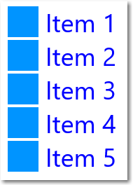
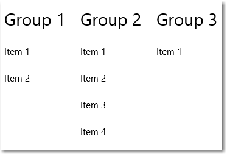

# ListView y GridView

La mayoría de las aplicaciones manipulan y muestran conjuntos de datos, como una galería de imágenes o un conjunto de mensajes de correo electrónico. El marco de trabajo de la interfaz de usuario de XAML proporciona los controles ListView y GridView que hacen más fácil mostrar y manipular datos en la aplicación.  

ListView y GridView derivan ambos de la clase ListViewBase, por lo que tienen la misma funcionalidad, pero muestran los datos de manera diferente. En este artículo, cuando hablamos de ListView, la información corresponde a ambos controles, ListView y GridView, a menos que se indique lo contrario. Podemos hacer mención a clases como ListView o ListViewItem, pero el prefijo "List" se puede sustituir por "Grid" para el equivalente de cuadrícula correspondiente (GridView o GridViewItem). 

<span class="sidebar_heading" style="font-weight: bold;">API importantes</span>

-   [**Clase ListView**](https://msdn.microsoft.com/library/windows/apps/windows.ui.xaml.controls.listview.aspx)
-   [**Clase GridView**](https://msdn.microsoft.com/library/windows/apps/windows.ui.xaml.controls.gridview.aspx)
-   [**Propiedad ItemsSource**](https://msdn.microsoft.com/library/windows/apps/windows.ui.xaml.controls.itemscontrol.itemssource.aspx)
-   [**Propiedad ItemTemplate**](https://msdn.microsoft.com/library/windows/apps/windows.ui.xaml.controls.itemscontrol.itemtemplate.aspx)

## ¿Es este el control adecuado?

ListView muestra los datos apilados verticalmente en una sola columna. Se suele usar para mostrar una lista ordenada de elementos, como una lista de mensajes de correo electrónico o resultados de búsqueda. También resulta útil en escenarios de [maestro y detalles](master-details.md), donde los elementos de la lista contienen poca información y los detalles del elemento seleccionado se muestran por separado. 


GridView presenta una colección de elementos en filas y columnas por las que podemos desplazarnos verticalmente. Se datos se apilan horizontalmente hasta que rellenan las columnas y luego se continúa con la fila siguiente. Suele usarse cuando se necesita mostrar una visualización enriquecida de cada elemento que ocupa más espacio, por ejemplo, una galería de fotos. 


Para ver una comparación y orientación más detalladas sobre qué control usar, consulta [Listas](lists.md).

## Crear una vista de lista

La vista de lista forma parte de [ItemsControl](https://msdn.microsoft.com/library/windows/apps/windows.ui.xaml.controls.itemscontrol.aspx), de modo que puede contener una colección de elementos de cualquier tipo. Debe tener elementos su colección [**Items**](https://msdn.microsoft.com/library/windows/apps/windows.ui.xaml.controls.itemscontrol.items.aspx) antes de poder mostrar algo en la pantalla. Para rellenar la vista, puedes agregar elementos directamente a la colección [**Items**](https://msdn.microsoft.com/library/windows/apps/windows.ui.xaml.controls.itemscontrol.items.aspx) o establecer la propiedad [**ItemsSource**](https://msdn.microsoft.com/library/windows/apps/windows.ui.xaml.controls.itemscontrol.itemssource.aspx) en un origen de datos. 

**Importante**
            &nbsp;&nbsp;Puedes usar Items o ItemsSource para rellenar la lista, pero no ambos al mismo tiempo. Si estableces la propiedad ItemsSource y agregas un elemento en XAML, el elemento agregado se omite. Si estableces la propiedad ItemsSource y decides agregar un elemento a la colección Items en código, se inicia una excepción.

> **Nota**
            &nbsp;&nbsp;Para que resulte más sencillo, en muchos de los ejemplos de este artículo la colección **Items** se rellena directamente. Sin embargo, es más habitual que los elementos en una lista provengan de un origen dinámico, como una lista de libros de una base de datos en línea. Usa la propiedad **ItemsSource** para tales fines. 

### Agregar elementos a la colección Items

Puedes agregar elementos a la colección [**Items**](https://msdn.microsoft.com/library/windows/apps/windows.ui.xaml.controls.itemscontrol.items.aspx) mediante lenguaje XAML o código. Normalmente, los elementos se agregan de esta forma si tienes un pequeño número de elementos que no cambian y que se definen fácilmente en XAML, o si generas los elementos en el código en tiempo de ejecución. 

Esta es una vista de lista con elementos definidos en XAML. Cuando defines los elementos en XAML, se agregan automáticamente a la colección Items.

**XAML**
```xaml
<ListView x:Name="listView1"> 
   <x:String>Item 1</x:String> 
   <x:String>Item 2</x:String> 
   <x:String>Item 3</x:String> 
   <x:String>Item 4</x:String> 
   <x:String>Item 5</x:String> 
</ListView>  
```

Esta es la vista de lista creada en el código. La lista resultante es la misma que se creó anteriormente en XAML.

**C#**
```csharp
// Create a new ListView and add content. 
ListView listView1 = new ListView(); 
listView1.Items.Add("Item 1"); 
listView1.Items.Add("Item 2"); 
listView1.Items.Add("Item 3"); 
listView1.Items.Add("Item 4"); 
listView1.Items.Add("Item 5");
 
// Add the ListView to a parent container in the visual tree. 
stackPanel1.Children.Add(listView1); 
```

ListView será similar a lo siguiente.


### Establecer el origen de los elementos

Por lo general, se usa una vista de lista para mostrar los datos de un origen, como una base de datos o Internet. Para rellenar una vista de lista desde un origen de datos, debes establecer la propiedad [**ItemsSource**](https://msdn.microsoft.com/library/windows/apps/xaml/windows.ui.xaml.controls.itemscontrol.itemssource.aspx) en una colección de elementos de datos.

Aquí, la propiedad ItemsSource de la vista de lista está establecida en el código, directamente en una instancia de una colección.

**C#**
```csharp 
// Instead of hard coded items, the data could be pulled 
// asynchronously from a database or the internet.
ObservableCollection<string> listItems = new ObservableCollection<string>();
listItems.Add("Item 1");
listItems.Add("Item 2");
listItems.Add("Item 3");
listItems.Add("Item 4");
listItems.Add("Item 5");

// Create a new list view, add content, 
ListView itemListView = new ListView();
itemListView.ItemsSource = listItems;

// Add the list view to a parent container in the visual tree.
stackPanel1.Children.Add(itemListView);
```

También puedes enlazar la propiedad ItemsSource a una colección en XAML. Para obtener más información, consulta el tema [Enlace de datos con XAML](../data-binding/data-binding-quickstart.md).

Aquí, ItemsSource está enlazado a una propiedad pública denominada `Items`, que expone la colección de datos privados de Page.

**XAML**
```xaml
<ListView x:Name="itemListView" ItemsSource="{x:Bind Items}"/>
```

**C#**
```csharp
private ObservableCollection<string> _items = new ObservableCollection<string>();

public ObservableCollection<string> Items
{
    get { return this._items; }
}

protected override void OnNavigatedTo(NavigationEventArgs e)
{
    base.OnNavigatedTo(e);

    // Instead of hard coded items, the data could be pulled 
    // asynchronously from a database or the internet.
    Items.Add("Item 1");
    Items.Add("Item 2");
    Items.Add("Item 3");
    Items.Add("Item 4");
    Items.Add("Item 5");
}
```

Si necesitas mostrar datos agrupados en la vista de lista, debes enlazar a una clase [**CollectionViewSource**](https://msdn.microsoft.com/library/windows/apps/xaml/windows.ui.xaml.data.collectionviewsource.aspx). CollectionViewSource actúa como proxy para la clase de colección en XAML y habilitar la compatibilidad con la agrupación. Para obtener más información, consulta [**CollectionViewSource**](https://msdn.microsoft.com/library/windows/apps/xaml/windows.ui.xaml.data.collectionviewsource.aspx).

## Plantilla de datos

La plantilla de datos de un elemento define cómo se visualizan los datos. De manera predeterminada, un elemento de datos se muestra en la vista de lista como una representación de cadena del objeto de datos al que está enlazado. Para mostrar la representación de cadena de una propiedad determinada del elemento de datos, establece [**DisplayMemberPath**](https://msdn.microsoft.com/library/windows/apps/xaml/windows.ui.xaml.controls.itemscontrol.displaymemberpath.aspx) en dicha propiedad.

No obstante, seguramente quieras mostrar una presentación más enriquecida de los datos. Para especificar con exactitud cómo se mostrarán los elementos en la vista de lista, debes crear una clase [**DataTemplate**](https://msdn.microsoft.com/library/windows/apps/xaml/windows.ui.xaml.datatemplate.aspx). El lenguaje XAML de la clase DataTemplate define el diseño y la apariencia de los controles usados para mostrar un elemento individual. Los controles del diseño se pueden enlazar a las propiedades de un objeto de datos o pueden tener contenido estático definido en línea. A continuación, asigna la clase DataTemplate a la propiedad [**ItemTemplate**](https://msdn.microsoft.com/library/windows/apps/xaml/windows.ui.xaml.controls.itemscontrol.itemtemplate.aspx) del control de lista.

En este ejemplo, el elemento de datos es una cadena simple. Puedes usan una clase DataTemplate para agregar una imagen a la izquierda de la cadena y mostrar la cadena en azul.  

> **Nota**
            &nbsp;&nbsp;Cuando usas la [extensión de marcado x:Bind](https://msdn.microsoft.com/windows/uwp/xaml-platform/x-bind-markup-extension) en una clase DataTemplate, debes especificar el DataType (`x:DataType`) en la DataTemplate. Para establecer `x:DataType="System:String"`, como en este ejemplo, se debe agregar la `xmlns:System="using:System"`[declaración de espacio de nombres XAML](https://msdn.microsoft.com/windows/uwp/xaml-platform/xaml-overview#xaml-namespaces) a Page.

**XAML**
```XAML
<ListView x:Name="listView1">
    <ListView.ItemTemplate>
        <DataTemplate x:DataType="System:String">
            <Grid>
                <Grid.ColumnDefinitions>
                    <ColumnDefinition Width="54"/>
                    <ColumnDefinition/>
                </Grid.ColumnDefinitions>
                <Image Source="Assets/placeholder.png" Width="44" Height="44" 
                       HorizontalAlignment="Left"/>
                <TextBlock Text="{x:Bind}" Foreground="Blue" 
                           FontSize="36" Grid.Column="1"/>
            </Grid> 
        </DataTemplate>
    </ListView.ItemTemplate>
    <x:String>Item 1</x:String>
    <x:String>Item 2</x:String>
    <x:String>Item 3</x:String>
    <x:String>Item 4</x:String>
    <x:String>Item 5</x:String>
</ListView>
```

Este es el aspecto de los elementos de datos cuando se muestran con esta plantilla de datos.



Las plantillas de datos son la forma principal de definir la apariencia de la vista de lista. También pueden tener un impacto significativo en el rendimiento si la lista muestra una gran cantidad de elementos. En este artículo, usamos datos de cadena simple para la mayoría de los ejemplos y no se especifica una plantilla de datos. Para obtener más información y ejemplos de cómo usar DataTemplate y contenedores de elementos para definir la apariencia de los elementos en la lista o cuadrícula, consulta *Modificar la apariencia de los elementos de lista*. 

## Cambiar el diseño de elementos

Al agregar elementos a una vista de lista o vista de cuadrícula, el control ajusta automáticamente cada elemento en un contenedor de elementos y luego dispone todos los contenedores de elementos. Cómo se disponen estos contenedores de elementos depende de la propiedad [**ItemsPanel**](https://msdn.microsoft.com/library/windows/apps/windows.ui.xaml.controls.itemscontrol.itemspanel.aspx) del control.  
- De manera predeterminada, **ListView** usa una clase [**ItemsStackPanel**](https://msdn.microsoft.com/library/windows/apps/windows.ui.xaml.controls.itemsstackpanel.aspx), lo cual genera una lista vertical, como esta.


- **GridView** usa una clase [**ItemsWrapGrid**](https://msdn.microsoft.com/library/windows/apps/windows.ui.xaml.controls.itemswrapgrid.aspx), que agrega los elementos horizontalmente y ajusta y se desplaza verticalmente, como a continuación.


Para modificar el diseño de elementos, puedes ajustar las propiedades en el panel de elementos o puedes reemplazar el panel predeterminado por otro panel.

> Nota&nbsp;&nbsp;Ten cuidado de no deshabilitar la virtualización si cambias la propiedad ItemsPanel. Tanto **ItemsStackPanel** como **ItemsWrapGrid** admiten la virtualización, por lo que son seguras. Si usas otro panel, es posible que deshabilites la virtualización y ralentices el rendimiento de la vista de lista. Para obtener más información, consulta los artículos sobre la vista de lista en [Performance](https://msdn.microsoft.com/windows/uwp/debug-test-perf/performance-and-xaml-ui) (Rendimiento). 

En este ejemplo se muestra cómo hacer que un **ListView** disponga sus contenedores de elementos en una lista horizontal cambiando la propiedad [**Orientation**](https://msdn.microsoft.com/library/windows/apps/windows.ui.xaml.controls.itemsstackpanel.orientation.aspx) de la clase **ItemsStackPanel**.
Dado que la vista de lista se desplaza verticalmente de manera predeterminada, también debes ajustar algunas propiedades de la clase [**ScrollViewer**](https://msdn.microsoft.com/library/windows/apps/windows.ui.xaml.controls.scrollviewer.aspx) de la vista de lista interna para que se desplace horizontalmente.
- [ScrollViewer.HorizontalScrollMode](https://msdn.microsoft.com/library/windows/apps/windows.ui.xaml.controls.scrollviewer.horizontalscrollmode.aspx) en **Enabled** o **Auto**
- [ScrollViewer.HorizontalScrollBarVisibility](https://msdn.microsoft.com/library/windows/apps/windows.ui.xaml.controls.scrollviewer.horizontalscrollbarvisibility.aspx) en **Auto** 
- [ScrollViewer.VerticalScrollMode](https://msdn.microsoft.com/library/windows/apps/windows.ui.xaml.controls.scrollviewer.verticalscrollmode.aspx) en **Disabled** 
- [ScrollViewer.VerticalScrollBarVisibility](https://msdn.microsoft.com/library/windows/apps/windows.ui.xaml.controls.scrollviewer.verticalscrollbarvisibility.aspx) en **Hidden** 

> **Nota**
            &nbsp;&nbsp;En estos ejemplos se muestran con el ancho de la vista de lista sin ninguna restricción, por lo que no se muestran las barras de desplazamiento horizontal. Si ejecutas este código, puedes establecer `Width="180"` en el control ListView para que muestre las barras de desplazamiento.

**XAML**
```xaml
<ListView Height="60" 
          ScrollViewer.HorizontalScrollMode="Enabled" 
          ScrollViewer.HorizontalScrollBarVisibility="Auto"
          ScrollViewer.VerticalScrollMode="Disabled"
          ScrollViewer.VerticalScrollBarVisibility="Hidden">
    <ListView.ItemsPanel>
        <ItemsPanelTemplate>
            <ItemsStackPanel Orientation="Horizontal"/>
        </ItemsPanelTemplate>
    </ListView.ItemsPanel>
    <x:String>Item 1</x:String>
    <x:String>Item 2</x:String>
    <x:String>Item 3</x:String>
    <x:String>Item 4</x:String>
    <x:String>Item 5</x:String>
</ListView>
```

La lista resultante tiene este aspecto.


 En el siguiente ejemplo, el control **ListView** dispone los elementos en una lista de ajuste vertical, con una clase **ItemsWrapGrid** en lugar de una clase **ItemsStackPanel**. 
 
> **Nota**
            &nbsp;&nbsp;El alto de la vista de lista debe restringirse para forzar el control a que encapsule los contenedores.

**XAML**
```xaml
<ListView Height="100"
          ScrollViewer.HorizontalScrollMode="Enabled" 
          ScrollViewer.HorizontalScrollBarVisibility="Auto"
          ScrollViewer.VerticalScrollMode="Disabled"
          ScrollViewer.VerticalScrollBarVisibility="Hidden">
    <ListView.ItemsPanel>
        <ItemsPanelTemplate>
            <ItemsWrapGrid/>
        </ItemsPanelTemplate>
    </ListView.ItemsPanel>
    <x:String>Item 1</x:String>
    <x:String>Item 2</x:String>
    <x:String>Item 3</x:String>
    <x:String>Item 4</x:String>
    <x:String>Item 5</x:String>
</ListView>
```

La lista resultante tiene este aspecto.


Si muestras datos agrupados en la vista de lista, la propiedad ItemsPanel determina cómo se disponen los grupos de elementos, no cómo se disponen los elementos individuales. Por ejemplo, si la clase ItemsStackPanel horizontal que se mostró anteriormente se usa para mostrar datos agrupados, los grupos se organizan de forma horizontal, pero los elementos de cada grupo aún se apilan verticalmente, como se muestra aquí.



## Selección e interacción de elementos

Puedes elegir entre varias maneras para permitir que el usuario interactúe con una vista de lista. De manera predeterminada, un usuario puede seleccionar un único elemento. Puedes cambiar la propiedad [**SelectionMode**](https://msdn.microsoft.com/library/windows/apps/windows.ui.xaml.controls.listviewbase.selectionmode.aspx) para habilitar la selección múltiple o para deshabilitar la selección. Puedes establecer la propiedad [**IsItemClickEnabled**](https://msdn.microsoft.com/library/windows/apps/windows.ui.xaml.controls.listviewbase.isitemclickenabled.aspx) para que un usuario haga clic en un elemento para invocar una acción (por ejemplo, un botón) en lugar de seleccionar el elemento.

> **Nota**
            &nbsp;&nbsp;Tanto ListView como GridView usan la enumeración [**ListViewSelectionMode**](https://msdn.microsoft.com/library/windows/apps/windows.ui.xaml.controls.listviewselectionmode.aspx) en sus propiedades SelectionMode. IsItemClickEnabled es **False** de manera predeterminada, por lo que deberás establecerla únicamente para permitir el modo de clic.

En esta tabla se muestran las maneras en que un usuario puede interactuar con una vista de lista, y cómo se puedes responder a la interacción.

Para habilitar esta interacción: | Usa esta configuración: | Controla este evento: | Usa esta propiedad para obtener el elemento seleccionado:
----------------------------|---------------------|--------------------|--------------------------------------------
Sin interacción | [SelectionMode](https://msdn.microsoft.com/library/windows/apps/windows.ui.xaml.controls.listviewbase.selectionmode.aspx)
             = 
            **None**, [IsItemClickEnabled](https://msdn.microsoft.com/library/windows/apps/windows.ui.xaml.controls.listviewbase.isitemclickenabled.aspx) = **False** | No disponible | No disponible 
Selección única | SelectionMode = **Single**, IsItemClickEnabled = **False** | [SelectionChanged](https://msdn.microsoft.com/library/windows/apps/windows.ui.xaml.controls.primitives.selector.selectionchanged.aspx) | [SelectedItem](https://msdn.microsoft.com/library/windows/apps/windows.ui.xaml.controls.primitives.selector.selecteditem.aspx), [SelectedIndex](https://msdn.microsoft.com/library/windows/apps/windows.ui.xaml.controls.primitives.selector.selectedindex.aspx)  
Selección múltiple | SelectionMode = **Multiple**, IsItemClickEnabled = **False** | [SelectionChanged](https://msdn.microsoft.com/library/windows/apps/windows.ui.xaml.controls.primitives.selector.selectionchanged.aspx) | [SelectedItems](https://msdn.microsoft.com/library/windows/apps/windows.ui.xaml.controls.listviewbase.selecteditems.aspx)  
Selección extendida | SelectionMode = **Extended**, IsItemClickEnabled = **False** | [SelectionChanged](https://msdn.microsoft.com/library/windows/apps/windows.ui.xaml.controls.primitives.selector.selectionchanged.aspx) | [SelectedItems](https://msdn.microsoft.com/library/windows/apps/windows.ui.xaml.controls.listviewbase.selecteditems.aspx)  
Hacer clic | SelectionMode = **None**, IsItemClickEnabled = **True** | [ItemClick](https://msdn.microsoft.com/library/windows/apps/windows.ui.xaml.controls.listviewbase.itemclick.aspx) | No disponible 

> **Nota**
            &nbsp;&nbsp;A partir de Windows 10, puedes habilitar IsItemClickEnabled para generar un evento ItemClick mientras SelectionMode también está establecido en Single, Multiple o Extended. Si haces esto, primero se genera el evento ItemClick y luego se genera el evento SelectionChanged. En algunos casos, como si navegaras a otra página en el controlador de eventos ItemClick, no se genera el evento SelectionChanged y no se selecciona el elemento.

Puedes establecer estas propiedades en XAML o en el código, como se muestra aquí.

**XAML**
```xaml
<ListView x:Name="myListView" SelectionMode="Multiple"/>

<GridView x:Name="myGridView" SelectionMode="None" IsItemClickEnabled="True"/> 
```

**C#**
```csharp
myListView.SelectionMode = ListViewSelectionMode.Multiple; 

myGridView.SelectionMode = ListViewSelectionMode.None;
myGridView.IsItemClickEnabled = true;
```

### Solo lectura

Puedes establecer la propiedad SelectionMode en **ListViewSelectionMode.None** para deshabilitar la selección de elementos. Esto coloca el control en modo de solo lectura, para que se use para mostrar los datos, pero no para interactuar con ellos. El control en sí no está deshabilitado, solo está deshabilitada la selección de elementos.

### Selección única

En esta tabla se describen las interacciones del teclado, el mouse y de las funciones táctiles cuando SelectionMode es **Single**.

Tecla modificadora | Interacción
-------------|------------
Ninguna | <li>Un usuario puede seleccionar un solo elemento con la barra espaciadora, un clic del mouse o una entrada táctil.</li>
Ctrl | <li>Un usuario puede anular la selección un solo elemento con la barra espaciadora, un clic del mouse o una entrada táctil.</li><li>Con las teclas de dirección, un usuario puede mover el foco independientemente de la selección.</li>

Cuando SelectionMode es **Single**, puedes obtener el elemento de datos seleccionado desde la propiedad [**SelectedItem**](https://msdn.microsoft.com/library/windows/apps/windows.ui.xaml.controls.primitives.selector.selecteditem.aspx). Puedes obtener el índice de la colección del elemento seleccionado con la propiedad [**SelectedIndex**](https://msdn.microsoft.com/library/windows/apps/windows.ui.xaml.controls.primitives.selector.selectedindex.aspx). Si no se selecciona ningún elemento, SelectedItem es **null** y SelectedIndex es -1. 
 
Si intentas establecer un elemento que no está en la colección **Items** como la propiedad **SelectedItem**, la operación se ignora y SelectedItem es**null**. Sin embargo, si intentas establecer la propiedad **SelectedIndex** en un índice que está fuera del intervalo de **Items** en la lista, se produce una excepción **System.ArgumentException**. 

### Selección múltiple

En esta tabla se describen las interacciones del teclado, el mouse y de las funciones táctiles cuando SelectionMode es **Multiple**.

Tecla modificadora | Interacción
-------------|------------
Ninguna | <li>Un usuario puede seleccionar varios elementos con la barra espaciadora, un clic del mouse o una entrada táctil para alternar la selección del elemento especificado.</li><li>Con las teclas de dirección, un usuario puede mover el foco independientemente de la selección.</li>
Mayús | <li>Un usuario puede seleccionar varios elementos contiguos haciendo clic o pulsando el primer elemento de la selección y luego el último elemento de la selección.</li><li>Con las teclas de dirección, un usuario puede crear una selección contigua empezando por el elemento seleccionado mientras se mantiene presionada la tecla Mayús.</li>

### Selección extendida

En esta tabla se describen las interacciones del teclado, el mouse y de las funciones táctiles cuando SelectionMode es **Extended**.

Tecla modificadora | Interacción
-------------|------------
Ninguna | <li>El comportamiento es el mismo que la selección **Single**.</li>
Ctrl | <li>Un usuario puede seleccionar varios elementos con la barra espaciadora, un clic del mouse o una entrada táctil para alternar la selección del elemento especificado.</li><li>Con las teclas de dirección, un usuario puede mover el foco independientemente de la selección.</li>
Mayús | <li>Un usuario puede seleccionar varios elementos contiguos haciendo clic o pulsando el primer elemento de la selección y luego el último elemento de la selección.</li><li>Con las teclas de dirección, un usuario puede crear una selección contigua empezando por el elemento seleccionado mientras se mantiene presionada la tecla Mayús.</li>

Cuando SelectionMode es **Multiple** o **Extended**, puedes obtener los elementos de datos seleccionados desde la propiedad [**SelectedItems**](https://msdn.microsoft.com/library/windows/apps/windows.ui.xaml.controls.listviewbase.selecteditems.aspx). 

Las propiedades **SelectedIndex**, **SelectedItem** y **SelectedItems** están sincronizadas. Por ejemplo, si estableces SelectedIndex en -1, SelectedItem se establece en **null** y SelectedItems está vacía; si estableces SelectedItem en **null**, SelectedIndex se establece en -1 y SelectedItems está vacía.

En el modo de selección múltiple, **SelectedItem** contiene el elemento que se selecciona en primer lugar, y **SelectedIndex** contiene el índice del elemento que se seleccionó primero. 

### Responder a los cambios de selección

Para responder a cambios de selección en una vista de lista, controla el evento [**SelectionChanged**](https://msdn.microsoft.com/library/windows/apps/windows.ui.xaml.controls.primitives.selector.selectionchanged.aspx). En el código del controlador de eventos, puedes obtener la lista de elementos seleccionados a partir de la propiedad [**SelectionChangedEventArgs.AddedItems**](https://msdn.microsoft.com/library/windows/apps/windows.ui.xaml.controls.selectionchangedeventargs.addeditems.aspx). Puedes obtener los elementos cuya selección se anuló a partir de la propiedad [**SelectionChangedEventArgs.RemovedItems**](https://msdn.microsoft.com/library/windows/apps/windows.ui.xaml.controls.selectionchangedeventargs.removeditems.aspx). Las colecciones AddedItems y RemovedItems contienen al menos 1 artículo, a menos que el usuario mantenga presionada la tecla Mayús para seleccionar un intervalo de elementos.

En este ejemplo se muestra cómo controlar el evento **SelectionChanged** y acceder a las distintas colecciones de elementos.

**XAML**
```xaml
<StackPanel HorizontalAlignment="Right">
    <ListView x:Name="listView1" SelectionMode="Multiple" 
              SelectionChanged="ListView1_SelectionChanged">
        <x:String>Item 1</x:String>
        <x:String>Item 2</x:String>
        <x:String>Item 3</x:String>
        <x:String>Item 4</x:String>
        <x:String>Item 5</x:String>
    </ListView>
    <TextBlock x:Name="selectedItem"/>
    <TextBlock x:Name="selectedIndex"/>
    <TextBlock x:Name="selectedItemCount"/>
    <TextBlock x:Name="addedItems"/>
    <TextBlock x:Name="removedItems"/>
</StackPanel> 
```

**C#**
```csharp
private void ListView1_SelectionChanged(object sender, SelectionChangedEventArgs e)
{
    if (listView1.SelectedItem != null)
    {
        selectedItem.Text = 
            "Selected item: " + listView1.SelectedItem.ToString();
    }
    else
    {
        selectedItem.Text = 
            "Selected item: null";
    }
    selectedIndex.Text = 
        "Selected index: " + listView1.SelectedIndex.ToString();
    selectedItemCount.Text = 
        "Items selected: " + listView1.SelectedItems.Count.ToString();
    addedItems.Text = 
        "Added: " + e.AddedItems.Count.ToString();
    removedItems.Text = 
        "Removed: " + e.RemovedItems.Count.ToString();
}
```

### Modo de clic

Puedes cambiar una vista de lista para que un usuario haga clic en elementos, como botones, en lugar de seleccionarlos. Por ejemplo, resulta útil si tu aplicación navega a una página nueva cuando el usuario hace clic en un elemento de una lista o cuadrícula. 
Para habilitar este comportamiento:
- Establece **SelectionMode** en **None**.
- Establece **IsItemClickEnabled** en **true**.
- Controla el evento **ItemClick** para que haga algo cuando el usuario haga clic en un elemento.

Aquí tienes una vista de lista con elementos en los que se puede hacer clic. El código en el controlador de eventos ItemClick navega a una página nueva.

**XAML**
```xaml
<ListView SelectionMode="None"
          IsItemClickEnabled="True" 
          ItemClick="ListView1_ItemClick">
    <x:String>Page 1</x:String>
    <x:String>Page 2</x:String>
    <x:String>Page 3</x:String>
    <x:String>Page 4</x:String>
    <x:String>Page 5</x:String>
</ListView>
```

**C#**
```csharp
private void ListView1_ItemClick(object sender, ItemClickEventArgs e)
{
    switch (e.ClickedItem.ToString())
    {
        case "Page 1":
            this.Frame.Navigate(typeof(Page1));
            break;

        case "Page 2":
            this.Frame.Navigate(typeof(Page2));
            break;

        case "Page 3":
            this.Frame.Navigate(typeof(Page3));
            break;

        case "Page 4":
            this.Frame.Navigate(typeof(Page4));
            break;

        case "Page 5":
            this.Frame.Navigate(typeof(Page5));
            break;

        default:
            break;
    }
}
```

### Seleccionar un intervalo de elementos mediante programación

A veces, es necesario manipular la selección de un elemento de la vista de lista mediante programación. Por ejemplo, es posible que tengas un botón **Seleccionar todo** para permitir al usuario seleccionar todos los elementos en una lista. En este caso, normalmente no resulta muy eficaz agregar y quitar elementos de la colección SelectedItems uno por uno. Cada cambio en un elemento produce un evento SelectionChanged, y cuando trabajas con los elementos directamente en lugar de trabajar con los valores de índice, el elemento se desvirtualiza.

Los métodos [**SelectAll**](https://msdn.microsoft.com/library/windows/apps/windows.ui.xaml.controls.listviewbase.selectall.aspx), [**SelectRange**](https://msdn.microsoft.com/library/windows/apps/windows.ui.xaml.controls.listviewbase.selectrange.aspx) y [**DeselectRange**](https://msdn.microsoft.com/library/windows/apps/windows.ui.xaml.controls.listviewbase.deselectrange.aspx) proporcionan una manera más eficaz de modificar la selección que usar la propiedad SelectedItems. Estos métodos seleccionan o anulan la selección mediante los intervalos de índices de elementos. Los elementos que están virtualizados permanecen virtualizados, porque solo se usa el índice. Se seleccionan todos los elementos en el intervalo especificado (o se anula la selección) independientemente de su estado de selección original. El evento SelectionChanged se produce solo una vez para cada llamada a estos métodos.

> **Importante**
            &nbsp;&nbsp;Debes llamar a estos métodos solo cuando la propiedad SelectionMode se establece en Multiple o Extended. Si llamas a SelectRange cuando SelectionMode es Single o None, se produce una excepción.

Cuando seleccionas elementos usando intervalos de índices, usa la propiedad [**SelectedRanges**](https://msdn.microsoft.com/library/windows/apps/windows.ui.xaml.controls.listviewbase.selectedranges.aspx) para obtener todos los intervalos seleccionados en la lista.

Si ItemsSource implementa [**IItemsRangeInfo**](https://msdn.microsoft.com/library/windows/apps/windows.ui.xaml.data.iitemsrangeinfo.aspx) y usas estos métodos para modificar la selección, las propiedades **AddedItems** y **RemovedItems** no se establecen en la propiedad SelectionChangedEventArgs. Establecer estas propiedades requiere la desvirtualización del objeto del elemento. En su lugar, usa la propiedad **SelectedRanges** para obtener estos elementos.

Para seleccionar todos los elementos en una colección, puedes llamar al método SelectAll. Sin embargo, no hay ningún método correspondiente para anular la selección de todos los elementos. Para anular la selección de todos los elementos, puedes llamar a DeselectRange y pasar una clase [**ItemIndexRange**](https://msdn.microsoft.com/library/windows/apps/windows.ui.xaml.data.itemindexrange.aspx) con un valor [**FirstIndex**](https://msdn.microsoft.com/library/windows/apps/windows.ui.xaml.data.itemindexrange.firstindex.aspx) de 0 y un valor de [**Length**](https://msdn.microsoft.com/library/windows/apps/windows.ui.xaml.data.itemindexrange.length.aspx) igual al número de elementos de la colección. 

**XAML**
```xaml
<StackPanel Width="160">
    <Button Content="Select all" Click="SelectAllButton_Click"/>
    <Button Content="Deselect all" Click="DeselectAllButton_Click"/>
    <ListView x:Name="listView1" SelectionMode="Multiple">
        <x:String>Item 1</x:String>
        <x:String>Item 2</x:String>
        <x:String>Item 3</x:String>
        <x:String>Item 4</x:String>
        <x:String>Item 5</x:String>
    </ListView>
</StackPanel>
```

**C#**
```csharp
private void SelectAllButton_Click(object sender, RoutedEventArgs e)
{
    if (listView1.SelectionMode == ListViewSelectionMode.Multiple ||
        listView1.SelectionMode == ListViewSelectionMode.Extended)
    {
        listView1.SelectAll();
    }
}

private void DeselectAllButton_Click(object sender, RoutedEventArgs e)
{
    if (listView1.SelectionMode == ListViewSelectionMode.Multiple ||
        listView1.SelectionMode == ListViewSelectionMode.Extended)
    {
        listView1.DeselectRange(new ItemIndexRange(0, (uint)listView1.Items.Count));
    }
}
```


## Artículos relacionados

- [Listas](lists.md)


<!--HONumber=May16_HO2-->


