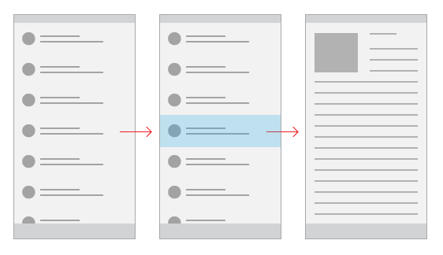

# Patrón de maestro y detalles

El patrón de maestro y detalles tiene un panel maestro (normalmente con una [vista de lista](lists.md)) y un panel de detalles para el contenido. Cuando se selecciona un elemento en la lista maestra, se actualiza el panel de detalles. Este patrón se usa con frecuencia para libretas de direcciones y de correos electrónicos.

## ¿Es este el patrón adecuado?

El patrón de maestro y detalles funciona bien si quieres:

-   Crear una aplicación de correo electrónico, una libreta de direcciones o cualquier aplicación que se base en un diseño de detalles de lista.
-   Buscar y dar prioridad a una gran colección de contenido.
-   Permitir la rápida adición y eliminación de elementos de una lista mientras se trabaja cambiando entre contextos continuamente.

## Elegir el estilo adecuado

Al implementar el patrón de maestro y detalles, te recomendamos que uses el estilo apilado o el estilo en paralelo, según la cantidad de espacio disponible en pantalla.

| Ancho de ventana disponible | Estilo recomendado |
|------------------------|-------------------|
| 320 epx - 719 epx        | Apilado           |
| 720 epx o más ancho       | En paralelo      |

 
## Estilo apilado

En el estilo apilado, solo hay un panel visible a la vez: el maestro o los detalles.

El usuario comienza en el patrón de panel y "explora en profundidad" hasta el panel de detalles, seleccionando un elemento en la lista maestra. Para el usuario, parece que las vistas de maestro y detalles existen en dos páginas independientes.

### Crear un patrón de maestro y detalles apilado

Una forma de crear el patrón de maestro y detalles apilado es usar páginas independientes para la vista maestra y de detalles. Coloca la vista de lista que proporciona la lista maestra en una página y el elemento de contenido del panel de detalles en una página separada.

En el panel maestro, un control de [vista de lista](lists.md) funciona bien para presentar listas que pueden contener imágenes y texto.

En el panel de detalles, usa el elemento de contenido que sea más apropiado. Si tienes muchos campos independientes, considera la posibilidad de usar un diseño de cuadrícula para organizar los elementos en un formulario.

## Estilo en paralelo

En el estilo en paralelo, los paneles de maestro y de detalles están visibles al mismo tiempo.

La lista del panel de maestro usa una selección visual para indicar el elemento seleccionado actual. Al seleccionar un elemento nuevo en la lista de maestro, se actualiza el panel de detalles.

### Crear un patrón de maestro y detalles en paralelo

En el panel maestro, un control de [vista de lista](lists.md) funciona bien para presentar listas que pueden contener imágenes y texto.

En el panel de detalles, usa el elemento de contenido que sea más apropiado. Si tienes muchos campos independientes, considera la posibilidad de usar un diseño de cuadrícula para organizar los elementos en un formulario.

## Ejemplos

Este diseño de una aplicación que realiza un seguimiento de la bolsa usa un patrón de maestro y detalles. En este ejemplo de la aplicación tal como aparecería en el teléfono, la lista o el panel de maestro está a la izquierda, con el panel de detalles a la derecha.

Este diseño de una aplicación que realiza un seguimiento de la bolsa usa un patrón de maestro y detalles. En este ejemplo de la aplicación tal como aparecería en el escritorio, el panel o la lista de maestro y el panel de detalles están visibles y a pantalla completa. El panel de maestro incluye un cuadro de búsqueda en la parte superior y una barra de comandos en la parte inferior.

## Artículos relacionados

- [Listas](lists.md)
- [Buscar](search.md)
- [Barras de la aplicación y de comandos](app-bars.md)
- [**Clase ListView (XAML)**](https://msdn.microsoft.com/library/windows/apps/br242878)

<!--HONumber=Jun16_HO4-->

