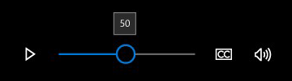

# Reproductor multimedia

El reproductor multimedia se usa para ver y escuchar vídeo, audio e imágenes. La reproducción multimedia puede efectuarse incorporada (incrustada en una página o con un grupo de otros controles) o en una vista de pantalla completa específica. Puedes modificar el conjunto de botones del reproductor, cambiar el fondo de la barra de control y organizar los diseños como consideres más oportuno. Ten en cuenta que los usuarios esperan un conjunto de controles básicos (Reproducir/pausar, Saltar atrás, Saltar adelante).


<span class="sidebar_heading" style="font-weight: bold;">API importantes</span>

-   [**Clase MediaElement**](https://msdn.microsoft.com/library/windows/apps/br242926)
-   [**Clase MediaTransportControls**](https://msdn.microsoft.com/library/windows/apps/windows.ui.xaml.controls.mediatransportcontrols)

## ¿Es este el control adecuado?

Usa un reproductor multimedia cuando desees reproducir audio o vídeo en tu aplicación. Para mostrar una colección de imágenes, usa [Invertir vista](flipview.md).

## Ejemplos

Un elemento multimedia en la aplicación Introducción de Windows 10.


## Crear un reproductor multimedia
Agrega elementos multimedia a tu aplicación creando un objeto [**MediaElement**](https://msdn.microsoft.com/library/windows/apps/br242926) en XAML y establece el [**Source**](https://msdn.microsoft.com/library/windows/apps/br227419) en un identificador uniforme de recursos (URI) que apunte a un archivo de audio o de vídeo.

Este lenguaje XAML crea un [**MediaElement**](https://msdn.microsoft.com/library/windows/apps/br242926) y establece la propiedad [**Source**](https://msdn.microsoft.com/library/windows/apps/br227419) como el URI de un archivo de vídeo local para la aplicación. El **MediaElement** comienza a reproducirse cuando se carga la página. Para evitar que los recursos multimedia comiencen a reproducirse inmediatamente, puedes establecer la propiedad [**AutoPlay**](https://msdn.microsoft.com/library/windows/apps/br227360) como **false**.

```xaml
<MediaElement x:Name="mediaSimple" 
              Source="Videos/video1.mp4" 
              Width="400" AutoPlay="False"/>
```

Este lenguaje XAML crea un [**MediaElement**](https://msdn.microsoft.com/library/windows/apps/br242926) con los controles de transporte integrados habilitados y la propiedad [**AutoPlay**](https://msdn.microsoft.com/library/windows/apps/br227360) establecida como **false**.


```csharp
<MediaElement x:Name="mediaPlayer" 
              Source="Videos/video1.mp4" 
              Width="400" 
              AutoPlay="False"
              AreTransportControlsEnabled="True"/>
```

### Controles de transporte multimedia
MediaElement tiene controles de transporte integrados para reproducir, detener, pausar, cambiar el volumen, silenciar, realizar búsquedas o comprobar el progreso y elegir una pista de audio. Para habilitar estos controles, establece [**AreTransportControlsEnabled**](https://msdn.microsoft.com/library/windows/apps/dn298977) en **true**. Para deshabilitarlos, establece **AreTransportControlsEnabled** en **false**. Los controles de transporte se representan mediante la clase [**MediaTransportControls**](https://msdn.microsoft.com/library/windows/apps/dn831962). Puedes usar los controles de transporte tal como están o personalizarlos de diversas maneras. Para obtener más información, consulta la referencia de clase [**MediaTransportControls**](https://msdn.microsoft.com/library/windows/apps/dn831962) y [Crear controles de transporte personalizados](custom-transport-controls.md).

Los controles de transporte permiten al usuario controlar la mayoría de los aspectos del [**MediaElement**](https://msdn.microsoft.com/library/windows/apps/br242926), pero el **MediaElement** también proporciona varias propiedades y métodos que puedes usar para controlar la reproducción de vídeo y audio. Para obtener más información, consulta la sección [Controlar MediaElement mediante programación](#control_mediaelement_programmatically) más adelante en este artículo.

Los controles de transporte admiten diseños de fila única y doble. El primer ejemplo mostrado aquí es un diseño de fila única, con el botón de reproducir/pausa situado a la izquierda de la escala de tiempo multimedia. Este diseño es recomendable para pantallas compactas. 



Se recomienda el diseño de controles de fila doble (a continuación) en la mayoría de los escenarios de uso, especialmente en las pantallas grandes. Este diseño proporciona más espacio para los controles y facilita el uso de la escala de tiempo para el usuario.


**Controles de transporte multimedia del sistema**

También puedes integrar [**MediaElement**](https://msdn.microsoft.com/library/windows/apps/br242926) con los controles de transporte multimedia del sistema. Los controles de transporte del sistema son los controles que aparecen cuando se presionan teclas multimedia de hardware, como los botones multimedia de los teclados. Si el usuario presiona la tecla de pausa en un teclado y tu aplicación admite [**SystemMediaTransportControls**](https://msdn.microsoft.com/library/windows/apps/dn278677), tu aplicación recibe una notificación y realiza la acción apropiada. Para obtener más información, consulta [controles de transporte multimedia del sistema](https://msdn.microsoft.com/library/windows/apps/mt228338).

### Establecer el origen del contenido multimedia
Para reproducir archivos de la red o archivos insertados en la aplicación, debes establecer la propiedad [**Source**](https://msdn.microsoft.com/library/windows/apps/br227419) en la ruta de acceso del archivo.

**Sugerencia**  Para abrir archivos desde Internet, tienes que declarar la capacidad **Internet (Client)** en el manifiesto de la aplicación (Package.appxmanifest). Para obtener más información sobre las funcionalidades de declaración, consulta [Declaraciones de funcionalidad de las aplicaciones](https://msdn.microsoft.com/library/windows/apps/mt270968).

 

En este código se intenta establecer la propiedad [**Source**](https://msdn.microsoft.com/library/windows/apps/br227419) del objeto [**MediaElement**](https://msdn.microsoft.com/library/windows/apps/br242926) definido en XAML en la ruta de acceso de un archivo especificado en un objeto [**TextBox**](https://msdn.microsoft.com/library/windows/apps/br209683).

```xaml
<TextBox x:Name="txtFilePath" Width="400" 
         FontSize="20"
         KeyUp="TxtFilePath_KeyUp"
         Header="File path"
         PlaceholderText="Enter file path"/>
```

```csharp
private void TxtFilePath_KeyUp(object sender, KeyRoutedEventArgs e)
{
    if (e.Key == Windows.System.VirtualKey.Enter)
    {
        TextBox tbPath = sender as TextBox;

        if (tbPath != null)
        {
            LoadMediaFromString(tbPath.Text);
        }
    }
}

private void LoadMediaFromString(string path)
{
    try
    {
        Uri pathUri = new Uri(path);
        mediaPlayer.Source = pathUri;
    }
    catch (Exception ex)
    {
        if (ex is FormatException)
        {
            // handle exception. 
            // For example: Log error or notify user problem with file
        }
    }
}
```

Para establecer el origen multimedia en un archivo multimedia insertado en la aplicación, crea un [**Uri**](https://msdn.microsoft.com/library/windows/apps/br226017) con la ruta de acceso con el prefijo **ms-appx:///** y establece el [**Source**](https://msdn.microsoft.com/library/windows/apps/br227419) en él. Por ejemplo, para un archivo llamado **video1.mp4** que se encuentra en una subcarpeta **Vídeos**, la ruta de acceso tendría este aspecto: **ms-appx:///Videos/video1.mp4**

Este código establece la propiedad [**origen**](https://msdn.microsoft.com/library/windows/apps/br227419) de la clase [**MediaElement**](https://msdn.microsoft.com/library/windows/apps/br242926) previamente definida en XAML como **ms-appx:///Videos/video1.mp4**.

```csharp
private void LoadEmbeddedAppFile()
{
    try
    {
        Uri pathUri = new Uri("ms-appx:///Videos/video1.mp4");
        mediaPlayer.Source = pathUri;
    }
    catch (Exception ex)
    {
        if (ex is FormatException)
        {
            // handle exception. 
            // For example: Log error or notify user problem with file
        }
    }
}
```

### Abrir archivos multimedia locales
Para abrir archivos del sistema local o de Microsoft OneDrive, puedes usar el control [**FileOpenPicker**](https://msdn.microsoft.com/library/windows/apps/br207847) para obtener el archivo y [**SetSource**](https://msdn.microsoft.com/library/windows/apps/br244338) para establecer el origen del contenido multimedia o bien puedes acceder a las carpetas de contenido multimedia del usuario mediante programación.

Si la aplicación necesita acceso a las carpetas **Música** o **Vídeo** sin interacción con el usuario, por ejemplo al enumerar todos los archivos de música o vídeo en la colección del usuario y mostrarlos en la aplicación, entonces debes declarar las funcionalidades **Biblioteca de música** y **Biblioteca de vídeos** . Para obtener más información, consulta [Archivos y carpetas en las bibliotecas de música, imágenes y vídeos](https://msdn.microsoft.com/library/windows/apps/mt188703).

El control [**FileOpenPicker**](https://msdn.microsoft.com/library/windows/apps/br207847) no requiere funcionalidades especiales para acceder a archivos en el sistema de archivos local, por ejemplo en las carpetas **Música** o **Vídeo** del usuario, porque el usuario tiene control total sobre el archivo al cual se accede. Desde una perspectiva de seguridad y privacidad, es mejor minimizar la cantidad de funcionalidades que usa la aplicación.

**Para abrir contenido multimedia local con FileOpenPicker**

1.  Llama a [**FileOpenPicker**](https://msdn.microsoft.com/library/windows/apps/br207847) para que el usuario pueda seleccionar un archivo multimedia.

    Usa la clase [**FileOpenPicker**](https://msdn.microsoft.com/library/windows/apps/br207847) para seleccionar un archivo multimedia. Establece el [**FileTypeFilter**](https://msdn.microsoft.com/library/windows/apps/br207850) para especificar qué tipos de archivos muestra el **FileOpenPicker**. Llama a [**PickSingleFileAsync**](https://msdn.microsoft.com/library/windows/apps/jj635275) para iniciar el selector de archivos y obtener el archivo.

2.  Llama a [**SetSource**](https://msdn.microsoft.com/library/windows/apps/br244338) para establecer el archivo multimedia seleccionado en el [**MediaElement.Source**](https://msdn.microsoft.com/library/windows/apps/br227419).

    Para establecer el [**Source**](https://msdn.microsoft.com/library/windows/apps/br227419) del [**MediaElement**](https://msdn.microsoft.com/library/windows/apps/br242926) en el [**StorageFile**](https://msdn.microsoft.com/library/windows/apps/br227171) devuelto de [**FileOpenPicker**](https://msdn.microsoft.com/library/windows/apps/br207847), necesitas abrir una secuencia. Llama al método [**OpenAsync**](https://msdn.microsoft.com/library/windows/apps/dn889851) de **StorageFile**, que devuelve una secuencia que puedes pasar al método [**MediaElement.SetSource**](https://msdn.microsoft.com/library/windows/apps/br244338). Después, debes llamar a [**Play**](https://msdn.microsoft.com/library/windows/apps/br227402) en **MediaElement** para iniciar el archivo multimedia.

En este ejemplo se muestra cómo usar el [**FileOpenPicker**](https://msdn.microsoft.com/library/windows/apps/br207847) para elegir un archivo y establecerlo como el [**Source**](https://msdn.microsoft.com/library/windows/apps/br227419) de un [**MediaElement**](https://msdn.microsoft.com/library/windows/apps/br242926).

```xaml
<MediaElement x:Name="mediaPlayer"/>
...
<Button Content="Choose file" Click="Button_Click"/>
```

```csharp
private async void Button_Click(object sender, RoutedEventArgs e)
{
    await SetLocalMedia();
}

async private System.Threading.Tasks.Task SetLocalMedia()
{
    var openPicker = new Windows.Storage.Pickers.FileOpenPicker();

    openPicker.FileTypeFilter.Add(".wmv");
    openPicker.FileTypeFilter.Add(".mp4");
    openPicker.FileTypeFilter.Add(".wma");
    openPicker.FileTypeFilter.Add(".mp3");

    var file = await openPicker.PickSingleFileAsync();
    
    // mediaPlayer is a MediaElement defined in XAML
    if (file != null)
    {
        var stream = await file.OpenAsync(Windows.Storage.FileAccessMode.Read);
        mediaPlayer.SetSource(stream, file.ContentType);

        mediaPlayer.Play();
    }
}
```

### Establecer el origen de póster
Puedes usar la propiedad [**PosterSource**](https://msdn.microsoft.com/library/windows/apps/br227409) para proporcionar el [**MediaElement**](https://msdn.microsoft.com/library/windows/apps/br242926) con una representación visual antes de cargar el contenido multimedia. Un **PosterSource** es una imagen, como una captura de pantalla o el póster de una película que se muestra en lugar del contenido multimedia. El **PosterSource** se muestra en las siguientes situaciones:

-   Cuando no hay un origen válido establecido. Por ejemplo, [**Source**](https://msdn.microsoft.com/library/windows/apps/br227419) no está establecido, **Source** se estableció en **Null** o el origen no es válido (como en el caso en el que se desencadena un evento [**MediaFailed**](https://msdn.microsoft.com/library/windows/apps/br227393)).
-   Mientras se carga el contenido multimedia. Por ejemplo, se estableció un origen válido, pero aún no se desencadenó el evento [**MediaOpened**](https://msdn.microsoft.com/library/windows/apps/br227394).
-   Cuando se hace streaming del contenido multimedia a otro dispositivo.
-   Cuando el contenido multimedia es solo audio.

Este es un [**MediaElement**](https://msdn.microsoft.com/library/windows/apps/br242926) con su [**Source**](https://msdn.microsoft.com/library/windows/apps/br227419) establecido en una pista de álbum y su [**PosterSource**](https://msdn.microsoft.com/library/windows/apps/br227409) establecido en una imagen de portada de álbum.

```xaml
<MediaElement Source="Media/Track1.mp4" PosterSource="Media/AlbumCover.png"/> 
```

### Mantener activa la pantalla del dispositivo
Por lo general, los dispositivos oscurecen la pantalla (y terminan apagándola) para ahorrar batería cuando el usuario se ausenta, pero las aplicaciones de vídeo necesitan mantenerla activada para que el usuario pueda ver el vídeo. Para evitar que la pantalla se desactive cuando no se detecta ninguna acción del usuario (por ejemplo, cuando una aplicación reproduce un vídeo a pantalla completa), puedes llamar a [**DisplayRequest.RequestActive**](https://msdn.microsoft.com/library/windows/apps/br241818). La clase [**DisplayRequest**](https://msdn.microsoft.com/library/windows/apps/br241816) te permite indicarle a Windows que mantenga activada la pantalla para que el usuario pueda ver el vídeo.

Para ahorrar energía y duración de la batería, debes llamar a [**DisplayRequest.RequestRelease**](https://msdn.microsoft.com/library/windows/apps/br241819) para liberar la solicitud de pantalla cuando ya no sea necesaria. Windows desactiva automáticamente la pantalla activa de la aplicación cuando la aplicación se quita de la pantalla y vuelve a activarla cuando la aplicación vuelve a estar en primer plano.

Estas son algunas situaciones en las que debes liberar la solicitud de pantalla:

-   La reproducción de vídeo se pone en pausa, por ejemplo, por una acción del usuario, por almacenamiento en búfer o por un ajuste a causa de ancho de banda limitado.
-   La reproducción se detiene. Por ejemplo, se terminó de reproducir el vídeo o finalizó la presentación.
-   Error de reproducción. Por ejemplo, problemas de conectividad de red o un archivo dañado.

**Mantener la pantalla activa**

1.  Crea una variable [**DisplayRequest**](https://msdn.microsoft.com/library/windows/apps/br241816) global. Inicialízala como nula.
```csharp
// Create this variable at a global scope. Set it to null.
private DisplayRequest appDisplayRequest = null;
```

2.  Llama a [**RequestActive**](https://msdn.microsoft.com/library/windows/apps/br241818) para notificar a Windows que la aplicación requiere que la pantalla permanezca activada.

3.  Llama a [**RequestRelease**](https://msdn.microsoft.com/library/windows/apps/br241819) para liberar la solicitud de pantalla siempre que la reproducción de vídeo se detenga, ponga en pausa o se interrumpa por un error de reproducción. Cuando la aplicación ya no tiene ninguna solicitud de pantalla activa, Windows ahorra batería oscureciendo la pantalla (y terminará apagándola) cuando el dispositivo no esté en uso.

    Aquí, se usa el evento [**CurrentStateChanged**](https://msdn.microsoft.com/library/windows/apps/br227375) para detectar estas situaciones. Luego, usa la propiedad [**IsAudioOnly**](https://msdn.microsoft.com/library/windows/apps/hh965334) para determinar si se reproduce un archivo de audio o vídeo y mantener la pantalla activa solo si el vídeo se está reproduciendo.
    ```xaml
<MediaElement Source="Media/video1.mp4"
              CurrentStateChanged="MediaElement_CurrentStateChanged"/>
    ```
 
    ```csharp
private void MediaElement_CurrentStateChanged(object sender, RoutedEventArgs e)
{
    MediaElement mediaElement = sender as MediaElement;
    if (mediaElement != null && mediaElement.IsAudioOnly == false)
    {
        if (mediaElement.CurrentState == Windows.UI.Xaml.Media.MediaElementState.Playing)
        {                
            if (appDisplayRequest == null)
            {
                // This call creates an instance of the DisplayRequest object. 
                appDisplayRequest = new DisplayRequest();
                appDisplayRequest.RequestActive();
            }
        }
        else // CurrentState is Buffering, Closed, Opening, Paused, or Stopped. 
        {
            if (appDisplayRequest != null)
            {
                // Deactivate the display request and set the var to null.
                appDisplayRequest.RequestRelease();
                appDisplayRequest = null;
            }
        }            
    }
} 
    ```

### Controlar el reproductor multimedia mediante programación
[
              **MediaElement**
            ](https://msdn.microsoft.com/library/windows/apps/br242926) proporciona varias propiedades, métodos y eventos para controlar la reproducción de audio y vídeo. Para obtener una lista completa de las propiedades, los métodos y los eventos, consulta la página de referencia de [**MediaElement**](https://msdn.microsoft.com/library/windows/apps/br242926).
    

### Seleccionar pistas de audio en diferentes idiomas

Usa la propiedad [**AudioStreamIndex**](https://msdn.microsoft.com/library/windows/apps/br227358) y el método [**GetAudioStreamLanguage**](https://msdn.microsoft.com/library/windows/apps/br227384) para cambiar el audio a una pista de idioma distinto en un vídeo. Los vídeos también pueden contener varias pistas de audio en el mismo idioma, como los comentarios del director en las películas. En este ejemplo se muestra específicamente cómo cambiar entre idiomas distintos, pero puedes modificar este código para cambiar entre las pistas de audio.

**Seleccionar pistas de audio en diferentes idiomas**

1.  Obtén las pistas de audio.

    Para buscar una pista en un idioma específico, empieza recorriendo todas las pistas de audio del vídeo. Usa [**AudioStreamCount**](https://msdn.microsoft.com/library/windows/apps/br227356) como el valor máximo de un bucle **for**.

2.  Obtén el idioma de la pista de audio.

    Usa el método [**GetAudioStreamLanguage**](https://msdn.microsoft.com/library/windows/apps/br227384) para obtener el idioma de la pista. El idioma de la pista se identifica con un [código de idioma](http://msdn.microsoft.com/library/ms533052(vs.85).aspx), como **"en"** para inglés o **"ja"** para japonés.

3.  Establece la pista de audio activa.

    Cuando encuentres la pista con el idioma deseado, establece [**AudioStreamIndex**](https://msdn.microsoft.com/library/windows/apps/br227358) en el índice de la pista. Al establecer **AudioStreamIndex** en **null** se selecciona la pista de audio predeterminada que se define mediante el contenido.

Con el siguiente código se intenta establecer la pista de audio en el idioma especificado. Recorre las distintas pistas de audio en un objeto [**MediaElement**](https://msdn.microsoft.com/library/windows/apps/br242926) y usa [**GetAudioStreamLanguage**](https://msdn.microsoft.com/library/windows/apps/br227384) para obtener el idioma de cada pista. Si existe la pista de idioma deseado, el [**AudioStreamIndex**](https://msdn.microsoft.com/library/windows/apps/br227358) se establece en el índice de esa pista.

```csharp
/// <summary>
/// Attemps to set the audio track of a video to a specific language
/// </summary>
/// <param name="lcid">The id of the language. For example, "en" or "ja"</param>
/// <returns>true if the track was set; otherwise, false.</returns>
private bool SetAudioLanguage(string lcid, MediaElement media)
{
    bool wasLanguageSet = false;

    for (int index = 0; index < media.AudioStreamCount; index++)
    {
        if (media.GetAudioStreamLanguage(index) == lcid)
        {
            media.AudioStreamIndex = index;
            wasLanguageSet = true;
        }
    }

    return wasLanguageSet;
}
```

### Habilitar la representación de vídeo a pantalla completa

Establece la propiedad [**IsFullWindow**](https://msdn.microsoft.com/library/windows/apps/dn298980) para habilitar y deshabilitar la representación a pantalla completa. Al establecer la representación a pantalla completa mediante programación en la aplicación, debes usar siempre **IsFullWindow** en lugar de hacerlo manualmente. **IsFullWindow** garantiza que se llevarán a cabo las optimizaciones en el nivel del sistema que mejoran el rendimiento y la duración de la batería. Si la representación a pantalla completa no se configura correctamente, es posible que estas optimizaciones no se habiliten.

Con el siguiente código se crea un [**AppBarButton**](https://msdn.microsoft.com/library/windows/apps/dn279244) que alterna la representación a pantalla completa.

```xaml
<AppBarButton Icon="FullScreen" 
              Label="Full Window"
              Click="FullWindow_Click"/>>
```

```csharp
private void FullWindow_Click(object sender, object e)
{
    mediaPlayer.IsFullWindow = !media.IsFullWindow;
}
```

### Cambiar el tamaño del vídeo y ampliarlo

Usa la propiedad [**Stretch**](https://msdn.microsoft.com/library/windows/apps/br227422) para cambiar la forma en que el contenido de vídeo rellena el contenedor en el que se encuentra. Esto amplía el vídeo y cambia su tamaño según el valor de [**Stretch**](https://msdn.microsoft.com/library/windows/apps/br242968). Los estados de **Stretch** son similares a la configuración de tamaño de imagen en muchos televisores. Puedes enlazarlo con un botón y dejar que el usuario elija qué configuración prefiere.

-   [
              **None**
            ](https://msdn.microsoft.com/library/windows/apps/br242968) muestra la resolución nativa del contenido en su tamaño original.
-   [
              **Uniform**
            ](https://msdn.microsoft.com/library/windows/apps/br242968) rellena la mayor cantidad de espacio posible, a la vez que conserva la relación de aspecto y el contenido de la imagen. Esto puede hacer que aparezcan barras negras horizontales o verticales en los bordes del vídeo. Esto es similar a los modos de pantalla panorámica.
-   [
              **UniformToFill**
            ](https://msdn.microsoft.com/library/windows/apps/br242968) rellena todo el espacio, pero conserva la relación de aspecto. Esto puede hacer que se recorte parte de la imagen. Esto es similar a los modos de pantalla completa.
-   [
              **Fill**
            ](https://msdn.microsoft.com/library/windows/apps/br242968) rellena todo el espacio, pero no conserva la relación de aspecto. La imagen no se recorta, pero se podría estirar. Esto es similar a los modos con ajuste.

 Aquí, un [**AppBarButton**](https://msdn.microsoft.com/library/windows/apps/dn279244) se usa para recorrer las opciones [**Stretch**](https://msdn.microsoft.com/library/windows/apps/br242968). Una instrucción **switch** comprueba el estado actual de la propiedad [**Stretch**](https://msdn.microsoft.com/library/windows/apps/br227422) y la establece en el siguiente valor en la enumeración **Stretch**. Esto permite que el usuario recorra los distintos estados de imagen ampliada.

```xaml
<AppBarButton Icon="Switch" 
              Label="Resize Video"
              Click="PictureSize_Click" />
```

```csharp
private void PictureSize_Click(object sender, RoutedEventArgs e)
{
    switch (mediaPlayer.Stretch)
    {
        case Stretch.Fill:
            mediaPlayer.Stretch = Stretch.None;
            break;
        case Stretch.None:
            mediaPlayer.Stretch = Stretch.Uniform;
            break;
        case Stretch.Uniform:
            mediaPlayer.Stretch = Stretch.UniformToFill;
            break;
        case Stretch.UniformToFill:
            mediaPlayer.Stretch = Stretch.Fill;
            break;
        default:
            break;
    }
}
```

### Habilitar la reproducción de latencia baja

Establece la propiedad [**RealTimePlayback**](https://msdn.microsoft.com/library/windows/apps/br227414) en **true** en un [**MediaElement**](https://msdn.microsoft.com/library/windows/apps/br242926) para permitir que el elemento multimedia reduzca la latencia inicial de la reproducción. Esto es fundamental para las aplicaciones de comunicaciones bidireccionales y se puede aplicar a algunos escenarios de juegos. Ten en cuenta que este modo consume más recursos y es menos eficiente desde el punto de vista de energía.

En este ejemplo se crea un [**MediaElement**](https://msdn.microsoft.com/library/windows/apps/br242926) y [**RealTimePlayback**](https://msdn.microsoft.com/library/windows/apps/br227414) se establece en **true**.

```xaml
<MediaElement x:Name="mediaPlayer" RealTimePlayback="True"/>
```

```csharp
MediaElement mediaPlayer = new MediaElement();
mediaPlayer.RealTimePlayback = true;
```
    
## Recomendaciones 

El reproductor multimedia se suministra con un tema oscuro y uno claro, pero opta por el tema oscuro en la mayoría de situaciones. El fondo oscuro proporciona un mejor contraste, en particular para condiciones de poca luz y limita la interferencia de la barra de control en la experiencia de visualización.

Fomenta una experiencia de visualización dedicada promocionando el modo de pantalla completa sobre el modo insertado. La experiencia de visualización en pantalla completa es óptima, y las opciones están restringidas en el modo insertado.

Si dispones de espacio en la pantalla, usa el diseño de dos filas. Proporciona más espacio para los controles que el diseño de una fila compacto.

Agrega las opciones personalizadas que necesites al reproductor multimedia para proporcionar la mejor experiencia para tu aplicación, pero ten en cuenta lo siguiente:

-   Limita la personalización de los controles predeterminados, que se han optimizado para la experiencia de reproducción de multimedia.
-   En los teléfonos y en otros dispositivos móviles, el cromo del dispositivo permanece en negro, pero en los equipos portátiles y en los equipos de escritorio, el cromo del dispositivo hereda el color del tema del usuario.
-   No intentes sobrecargar la barra de control con demasiadas opciones.
-   No reduzcas la escala de tiempo multimedia por debajo de su tamaño mínimo predeterminado, lo cual limita gravemente su efectividad.

## Artículos relacionados

- [Conceptos básicos de diseño de los comandos para las aplicaciones para UWP](https://msdn.microsoft.com/library/windows/apps/dn958433)
- [Conceptos básicos del diseño de contenido para las aplicaciones para UWP](https://msdn.microsoft.com/library/windows/apps/dn958434)


<!--HONumber=Jun16_HO4-->


