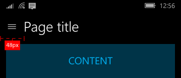

# Paneles de navegación

Un panel de navegación (o "nav pane" abreviado en inglés), es un patrón que admite muchos elementos de navegación de nivel superior a la vez que se conserva el espacio de la pantalla. El panel de navegación se usa ampliamente en aplicaciones móviles, pero también funciona bien en pantallas más grandes. Cuando se usa como una superposición, el panel permanece contraído y fuera de la vista hasta que el usuario presiona el botón, lo que es útil para pantallas más pequeñas. Cuando se usa en su modo acoplado, el panel permanece abierto, lo que te permite aprovechar mejor la pantalla, si hay suficiente espacio en la misma.

**API importantes**

* [**Clase SplitView**](https://msdn.microsoft.com/library/windows/apps/dn864360)

## ¿Es este el patrón adecuado?

El panel de navegación es adecuado para:

-   Aplicaciones con muchos elementos de navegación de nivel superior que son de tipo similar. Por ejemplo, una aplicación de deportes con categorías como "fútbol", "béisbol", "baloncesto", "baloncesto", "fútbol americano", etc.
-   Proporcionar una experiencia de navegación coherente entre aplicaciones. El panel de navegación debe incluir solo los elementos de navegación, no las acciones.
-   Un número de medio a alto (5-10 +) de categorías de navegación de nivel superior.
-   Conservar el espacio en pantalla (como una superposición).
-   Elementos de navegación a los que se accede con poca frecuencia. (como una superposición).

## Creación de un panel de navegación

El patrón del panel de navegación está formado por un panel de categorías de navegación, un área de contenido y un botón opcional para abrir o cerrar el panel. La forma más sencilla de crear un panel de navegación es con un [control de vista dividida](split-view.md), que viene con un panel vacío y un área de contenido que siempre está visible.

Para probar código que implementa este patrón, descarga la [solución de navegación XAML](https://github.com/Microsoft/Windows-universal-samples/tree/master/Samples/XamlNavigation) de GitHub.

### Panel

Los encabezados de las categorías de navegación van en el panel. Los puntos de entrada a la configuración de la aplicación y la administración de cuentas, si procede, también se incluyen en el panel. Los encabezados de navegación suelen ser una lista de elementos entre los que el usuario puede elegir.

### Área de contenido

El área de contenido es donde se muestra información de la ubicación de navegación seleccionada. Puede contener elementos individuales o navegación de niveles inferiores.

### Botón

Cuando se incluye, el botón permite a los usuarios abrir y cerrar el panel. El botón permanece visible en una posición fija y no se mueve con el panel. Se recomienda colocar el botón en la esquina superior izquierda de la aplicación. El botón del panel de navegación se visualiza como tres líneas horizontales apiladas y normalmente se conoce como el botón "hamburguesa".

El botón suele estar asociado a una cadena de texto. En el nivel superior de la aplicación, se puede mostrar el título de la aplicación junto al botón. En los niveles inferiores de la aplicación, la cadena de texto puede ser el título de la página en la que se encuentra el usuario.

## Variaciones del panel de navegación

El panel de navegación tiene tres modos: superposición, compacto y en línea. La superposición se contrae y se expande según sea necesario. Cuando está compacto, el panel siempre se muestra como una franja estrecha que se puede expandir. El panel en línea permanece abierto de forma predeterminada.

### Superposición

-   La superposición puede usarse en cualquier tamaño de pantalla y en orientación vertical u horizontal. En su estado predeterminado (contraído), la superposición no ocupa ningún estado real, solo se muestra el botón.
-   Ofrece una navegación a petición que ahorra superficie en pantalla. Ideal para aplicaciones en teléfonos y tabléfonos.
-   El panel está oculto de forma predeterminada, solo con el botón visible.
-   Al presionar el botón del panel de navegación, se abre y se cierra la superposición.
-   El estado expandido es transitorio y se descarta cuando se realiza una selección, cuando se usa el botón Atrás, o cuando el usuario pulsa fuera del panel.
-   La superposición se dibuja encima del contenido y no redistribuye el contenido.

### Compacto

-   El modo compacto puede especificarse como `CompactOverlay`, que superpone contenido cuando está abierto, o `CompactInline`, que quita el contenido fuera de su espacio. Recomendamos usar CompactOverlay.
-   Los paneles compactos proporcionan una indicación de la ubicación seleccionada, mientras usan una pequeña cantidad de espacio de pantalla.
-   Este modo se ajusta mejor para pantallas medianas, como tabletas.
-   De manera predeterminada, el panel se cierra solo con los iconos de navegación y el botón visibles.
-   Al pulsar el botón del panel de navegación, se abre y se cierra el panel, que se comporta como superposición o en línea según el modo de pantalla especificado.
-   La selección debe mostrarse en los iconos de lista para resaltar en qué lugar del árbol de navegación se encuentra el usuario.

### En línea

-   El panel de navegación permanece abierto. Este modo es más adecuado para pantallas más grandes.
-   Admite los escenarios de arrastrar y colocar hacia y desde el panel.
-   El botón del panel de navegación no es necesario para este estado. Si se usa el botón, el área de contenido se mueve fuera y se redistribuye el contenido dentro de esa área.
-   La selección debe mostrarse en los elementos de lista para resaltar en qué lugar del árbol de navegación se encuentra el usuario.

## Capacidad de adaptación

Para maximizar la facilidad de uso en una variedad de dispositivos, te recomendamos usar [puntos de interrupción](../layout/screen-sizes-and-breakpoints-for-responsive-design.md) y ajustar el modo del panel de navegación según el ancho de la ventana de la aplicación.
-   Ventana pequeña
   -   Menor o igual que 640 píxeles de ancho.
   -   El panel de navegación debe estar en modo de superposición, cerrado de manera predeterminada.
-   Ventana mediana
   -   Mayor que 640 píxeles y menor o igual que 1007 píxeles de ancho.
   -   El panel de navegación debe estar en modo de franja, cerrado de manera predeterminada.
-   Ventana grande
   -   Mayor que 1007 píxeles de ancho.
   -   El panel de navegación debe estar en modo acoplado, abierto de manera predeterminada.

## Adaptación

Para optimizar la [experiencia de 10 pies](http://go.microsoft.com/fwlink/?LinkId=760736) de tu aplicación, considera la posibilidad de modificar la apariencia visual de los elementos de navegación para personalizar el panel de navegación. Según el contexto de la interacción, puede ser más importante llamar la atención del usuario hacia el elemento de navegación seleccionado o hacia el elemento de navegación enfocado. Para una experiencia de 10 pies, donde el controlador para juegos es el dispositivo de entrada más común, es particularmente importante asegurar que el usuario puede realizar de manera sencilla un seguimiento de la ubicación del elemento enfocado actualmente en pantalla.

## Temas relacionados

* [Control de vista en dos paneles](split-view.md)
* [Panel de maestro y detalles](master-details.md)
* [Conceptos básicos de navegación](https://msdn.microsoft.com/library/windows/apps/dn958438)
 

 
