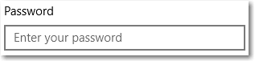
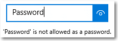
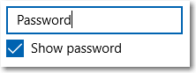

# <a name="password-box"></a>Cuadro de contraseña

<link rel="stylesheet" href="https://az835927.vo.msecnd.net/sites/uwp/Resources/css/custom.css"> 

Un cuadro de contraseña es un cuadro de entrada de texto que oculta los caracteres escritos para asegurar la privacidad. Un cuadro de contraseña parece un cuadro de texto, salvo en que representa caracteres de marcador de posición en vez del texto que se ha escrito. Puedes configurar el carácter de marcador de posición.

De manera predeterminada, el cuadro de contraseña proporciona un método para que el usuario pueda ver su contraseña si mantiene presionado el botón Mostrar. Puedes deshabilitar el botón Mostrar, o proporcionar un mecanismo alternativo para mostrar la contraseña como, por ejemplo, una casilla.

<div class="important-apis" >
<b>API importantes</b><br/>
<ul>
<li>[**Clase PasswordBox**](https://msdn.microsoft.com/library/windows/apps/xaml/windows.ui.xaml.controls.passwordbox.aspx)</li>
<li>[**Propiedad Password**](https://msdn.microsoft.com/library/windows/apps/xaml/windows.ui.xaml.controls.passwordbox.password.aspx)</li>
<li>[**Propiedad PasswordChar**](https://msdn.microsoft.com/library/windows/apps/xaml/windows.ui.xaml.controls.passwordbox.passwordchar.aspx)</li>
<li>[**Propiedad PasswordRevealMode**](https://msdn.microsoft.com/library/windows/apps/xaml/windows.ui.xaml.controls.passwordbox.passwordrevealmode.aspx)</li>
<li>[**Evento PasswordChanged**](https://msdn.microsoft.com/library/windows/apps/xaml/windows.ui.xaml.controls.passwordbox.passwordchanged.aspx)</li>
</ul>
</div>

## <a name="is-this-the-right-control"></a>¿Es este el control adecuado?

Usa un control **PasswordBox** para recopilar la contraseña u otros datos privados, como el número de la Seguridad social.

Para obtener más información sobre cómo elegir el control de texto correcto, consulta el artículo [Controles de texto](text-controls.md).

## <a name="examples"></a>Ejemplos

El cuadro de contraseña tiene varios estados, incluidos estos tan importantes.

Un cuadro de contraseña en reposo puede mostrar un texto de sugerencia para que el usuario conozca su propósito:



Cuando el usuario escribe en un cuadro de contraseña, el comportamiento predeterminado es mostrar viñetas que oculten el texto que se escribe:


Si se presiona el botón "Mostrar" de la derecha, se puede ver el texto de la contraseña que se está escribiendo:


## <a name="create-a-password-box"></a>Crear un cuadro de contraseña.

Usa la propiedad [Password](https://msdn.microsoft.com/library/windows/apps/xaml/windows.ui.xaml.controls.passwordbox.password.aspx) para obtener o establecer el contenido de la clase PasswordBox. Puedes hacerlo en el controlador del evento [PasswordChanged](https://msdn.microsoft.com/library/windows/apps/xaml/windows.ui.xaml.controls.passwordbox.passwordchanged.aspx) y así realizar la validación mientras el usuario escribe la contraseña. Igualmente, también puedes usar otro evento, como un botón de clase [Click](https://msdn.microsoft.com/library/windows/apps/xaml/windows.ui.xaml.controls.primitives.buttonbase.click.aspx), para realizar la validación después de que el usuario termine de escribir.

Este es el lenguaje XAML de un control de cuadro de contraseña que muestra el aspecto predeterminado de PasswordBox. Cuando el usuario escribe una contraseña, debes comprobar si es el valor literal, "Password". Si lo es, entonces le muestras un mensaje al usuario.

```xaml
<StackPanel>  
  <PasswordBox x:Name="passwordBox" Width="200" MaxLength="16"
             PasswordChanged="passwordBox_PasswordChanged"/>

  <TextBlock x:Name="statusText" Margin="10" HorizontalAlignment="Center" />
</StackPanel>   
```

```csharp
private void passwordBox_PasswordChanged(object sender, RoutedEventArgs e)
{
    if (passwordBox.Password == "Password")
    {
        statusText.Text = "'Password' is not allowed as a password.";
    }
    else
    {
        statusText.Text = string.Empty;
    }
}
```
Esto es lo que se obtiene cuando se ejecuta este código y el usuario escribe "Password" (Contraseña).



### <a name="password-character"></a>Carácter de contraseña

Para cambiar el carácter que se usa para enmascarar la contraseña, puedes establecer la propiedad [PasswordChar](https://msdn.microsoft.com/library/windows/apps/xaml/windows.ui.xaml.controls.passwordbox.passwordchar.aspx). Aquí, la viñeta predeterminada se reemplaza por un asterisco.

```xaml
<PasswordBox x:Name="passwordBox" Width="200" PasswordChar="*"/>
```

El resultado tiene el siguiente aspecto.


### <a name="headers-and-placeholder-text"></a>Encabezados y texto del marcador de posición

Puedes usar las propiedades [Header](https://msdn.microsoft.com/library/windows/apps/xaml/windows.ui.xaml.controls.passwordbox.header.aspx) y [PlaceholderText](https://msdn.microsoft.com/library/windows/apps/xaml/windows.ui.xaml.controls.passwordbox.placeholdertext.aspx) para proporcionar el contexto de PasswordBox. Esto es especialmente útil si tienes varios cuadros, como sucede en un formulario para cambiar una contraseña.

```xaml
<PasswordBox x:Name="passwordBox" Width="200" Header="Password" PlaceholderText="Enter your password"/>
```


### <a name="maximum-length"></a>Longitud máxima

Puedes especificar el número máximo de caracteres que el usuario puede escribir mediante la propiedad [MaxLength](https://msdn.microsoft.com/library/windows/apps/xaml/windows.ui.xaml.controls.passwordbox.maxlength.aspx). No hay ninguna propiedad para especificar una longitud mínima, pero puedes comprobar la longitud de la contraseña y realizar cualquier otra validación en el código de la aplicación.

## <a name="password-reveal-mode"></a>Modo de revelación de contraseña

La clase PasswordBox tiene un botón integrado que el usuario puede presionar para visualizar el texto de la contraseña. Esto es lo que se obtiene una vez el usuario decide presionar el botón. Cuando lo suelta, la contraseña vuelve a ocultarse automáticamente.


### <a name="peek-mode"></a>Modo de información

De manera predeterminada, se muestra el botón Mostrar (o botón "ojear"). El usuario debe presionar continuamente el botón para ver la contraseña, de modo que se mantiene un alto nivel de seguridad.

El valor de la propiedad [PasswordRevealMode](https://msdn.microsoft.com/library/windows/apps/xaml/windows.ui.xaml.controls.passwordbox.passwordrevealmode.aspx) no es el único factor que determina si un botón para mostrar la contraseña debe ser visible para el usuario. Otros factores aclaran si el control debe mostrarse sobre un ancho mínimo, si PasswordBox debe tener el foco y si el campo de entrada de texto debe contener al menos un carácter. El botón para mostrar la contraseña solo se muestra cuando PasswordBox recibe el foco por primera vez y se escribe un carácter. Si PasswordBox pierde el foco y luego lo recupera, no se vuelve a visualizar el botón Mostrar, a menos que la contraseña se borre y se vuelva a escribir.

> **Precaución**&nbsp;&nbsp;En versiones anteriores a Windows 10, el botón para mostrar la contraseña no aparecía de forma predeterminada. Si la seguridad de la aplicación requiere que la contraseña esté siempre oculta, asegúrate de establecer el valor de PasswordRevealMode en Oculta.

### <a name="hidden-and-visible-modes"></a>Modos Oculta y Visible

Otros valores de enumeración de la propiedad [PasswordRevealMode](https://msdn.microsoft.com/library/windows/apps/xaml/windows.ui.xaml.controls.passwordrevealmode.aspx), como **Oculta** y **Visible**, ocultan el botón para mostrar la contraseña y te permiten decidir mediante programación si la contraseña debe permanecer oculta.

Para ocultar siempre la contraseña, debes establecer la propiedad PasswordRevealMode en Oculta. A menos que necesites que la contraseña siempre esté oculta, puedes proporcionar una interfaz de usuario personalizada para permitir que el usuario cambie la propiedad PasswordRevealMode entre las opciones Oculta y Visible.

En versiones anteriores de Windows Phone, PasswordBox usaba una casilla para activar o desactivar la ocultación de la contraseña. Puedes crear una interfaz de usuario similar para tu aplicación, tal como se muestra en el siguiente ejemplo. Asimismo, también puedes usar otros controles, como [ToggleButton](https://msdn.microsoft.com/library/windows/apps/xaml/windows.ui.xaml.controls.primitives.togglebutton.aspx), para permitir al usuario cambiar de modo.

Este ejemplo muestra cómo usar una clase [CheckBox](https://msdn.microsoft.com/library/windows/apps/xaml/windows.ui.xaml.controls.checkbox.aspx) para permitir al usuario cambiar el modo de mostrar la contraseña en una clase PasswordBox.

```xaml
<StackPanel Width="200">
    <PasswordBox Name="passwordBox1"
                 PasswordRevealMode="Hidden"/>
    <CheckBox Name="revealModeCheckBox" Content="Show password"
              IsChecked="False"
              Checked="CheckBox_Changed" Unchecked="CheckBox_Changed"/>
</StackPanel>
```

```csharp
private void CheckBox_Changed(object sender, RoutedEventArgs e)
{
    if (revealModeCheckBox.IsChecked == true)
    {
        passwordBox1.PasswordRevealMode = PasswordRevealMode.Visible;
    }
    else
    {
        passwordBox1.PasswordRevealMode = PasswordRevealMode.Hidden;
    }
}
```

Esta clase PasswordBox tiene el aspecto siguiente.



## <a name="choose-the-right-keyboard-for-your-text-control"></a>Elegir el teclado adecuado para el control de texto

Para que los usuarios escriban datos con facilidad mediante el teclado táctil o con el panel de entrada suave (SIP), puedes establecer el ámbito de entrada del control de texto para que coincida con el tipo de datos que se espera que el usuario escriba. PasswordBox solo es compatible con los valores de ámbito de entrada **Password** y **NumericPin**. Se pasará por alto cualquier otro valor.

Para obtener más información sobre cómo usar los ámbitos de entrada, consulta [Usar el ámbito de entrada para cambiar el teclado táctil](https://msdn.microsoft.com/library/windows/apps/mt280229).

## <a name="recommendations"></a>Recomendaciones

-   Usa una etiqueta o un texto de marcador de posición si el propósito del cuadro de contraseña no está claro. Una etiqueta es visible, sin importar si el cuadro de entrada de texto tiene algún valor escrito o no. En cuanto al texto de marcador de posición, este se muestra dentro del cuadro de entrada y desaparece una vez que se ha escrito un valor.
-   Dota al cuadro de contraseña de un ancho apropiado para los valores que se pueden escribir. La longitud de las palabras varía según el lenguaje, así que tenlo en cuenta si quieres que tu aplicación sea internacional.
-   No pongas otro control justo al lado de un cuadro de entrada de contraseñas. El cuadro de contraseña tiene un botón Mostrar para que el usuario pueda comprobar las contraseñas escritas. Si sitúas al lado otro control, podrías provocar que las contraseñas se muestren de forma accidental al intentar interactuar con él. Para evitar que esto suceda, deja un poco de espacio entre el cuadro de entrada de contraseña y el otro control, o pon el otro control en la siguiente línea.
-   También puedes tener en cuenta la posibilidad de presentar dos cuadros de contraseña para la creación de cuentas: uno para la nueva contraseña y otro para confirmarla.
-   Muestra un cuadro de contraseña único para los inicios de sesión.
-   Cuando se usa un cuadro de contraseña para escribir un PIN, tienes la posibilidad de proporcionar una respuesta instantánea tan pronto como se escriba el último número, en lugar de tener que usar un botón de confirmación.


## <a name="related-articles"></a>Artículos relacionados

[Controles de texto](text-controls.md)

- [Directrices sobre revisión ortográfica](spell-checking-and-prediction.md)
- [Adición de búsqueda](https://msdn.microsoft.com/library/windows/apps/hh465231)
- [Directrices para la entrada de texto](text-controls.md)
- [**Clase TextBox**](https://msdn.microsoft.com/library/windows/apps/br209683)
- [**Clase Windows.UI.Xaml.Controls PasswordBox**](https://msdn.microsoft.com/library/windows/apps/br227519)
- [Propiedad String.Length](https://msdn.microsoft.com/library/system.string.length(v=vs.110).aspx)
