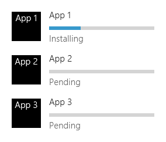
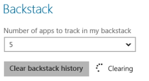
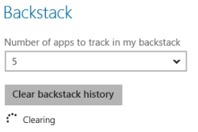
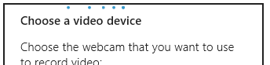
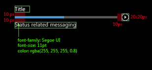
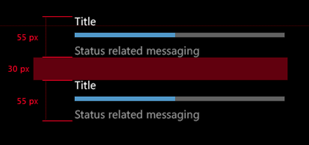
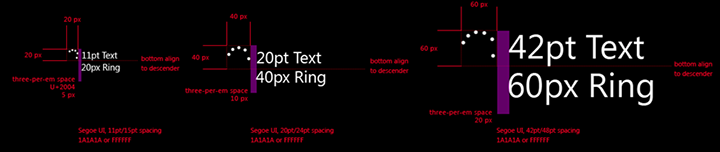

# Controles de progreso

Un control de progreso proporciona información al usuario sobre el hecho de que se está llevando a cabo una operación de ejecución larga. Una barra de progreso *determinado* muestra el porcentaje de finalización de una operación. Una barra de progreso *indeterminado* o un anillo de progreso muestra que hay una operación en curso.

Un control de progreso es de solo lectura, no es interactivo.

<span class="sidebar_heading" style="font-weight: bold;">API importantes</span>

-   [**Clase ProgressBar**](https://msdn.microsoft.com/library/windows/apps/xaml/windows.ui.xaml.controls.progressbar.aspx)
-   [**Propiedad IsIndeterminate**](https://msdn.microsoft.com/library/windows/apps/xaml/windows.ui.xaml.controls.progressbar.isindeterminate.aspx)
-   [**Clase ProgressRing**](https://msdn.microsoft.com/library/windows/apps/xaml/windows.ui.xaml.controls.progressring.aspx)
-   [**Propiedad IsActive**](https://msdn.microsoft.com/library/windows/apps/xaml/windows.ui.xaml.controls.progressring.isactive.aspx)


Aplicación de Windows: barra de progreso indeterminado, círculo de progreso y barra de progreso determinado


Aplicación de Windows Phone: indicador de progreso de barra de estado y barras de progreso

## Ejemplos

En este ejemplo se muestra un control de círculo de progreso en una pantalla de presentación.


Una barra de progreso también es un buen indicador del estado o la posición. Una barra de progreso utilizada para una pista musical corresponde a la escala de tiempo de la canción: el valor de la barra es la posición de la canción; el estado de pausa indica que la reproducción se encuentra pausada.


## ¿Es este el control adecuado?

No es siempre necesario mostrar un control de progreso. A veces, el progreso de una tarea es lo bastante obvio por sí solo o la tarea se completa tan rápidamente que mostrar un control de progreso sería una distracción. Te ofrecemos algunos puntos que deberías considerar al determinar si quieres mostrar un control de progreso.

-   **¿La operación tarda más de dos segundos en completarse?**

    En caso afirmativo, debes mostrar un control de progreso en cuanto se inicie la operación. Si una operación tarda más de dos segundos en completarse la mayor parte de las veces, pero otras se completa en menos de dos segundos, espera 500 ms antes de mostrar el control para evitar el parpadeo.

-   **¿Está la operación esperando a que el usuario complete una tarea?**

    En ese caso, no uses una barra de progreso. Las barras de progreso se usan para el progreso del equipo, no el del usuario.

-   **¿Necesita el usuario saber que está ocurriendo algo?**

    Por ejemplo, si la aplicación está descargando algo en segundo plano y el usuario no inició la descarga, no tiene por qué saber sobre ella.

-   **¿Es la operación una actividad en segundo plano que no bloquea la actividad del usuario y tiene poco interés (aunque lo tenga en parte) para el usuario?**

    Usa texto y puntos suspensivos cuando tu aplicación esté realizando tareas que no tienen que estar visibles constantemente, pero cuando todavía necesitas mostrar el estado.

    

    Usa los puntos suspensivos para indicar que la tarea está en curso. Si hay varias tareas o elementos, puedes indicar cuántas tareas quedan pendientes. Cuando se completen todas las tareas, descarta el indicador.

-   **¿Puedes usar el contenido de la operación para visualizar el progreso?**

    En ese caso, no muestres un control de progreso. Por ejemplo, cuando muestres elementos /src/assets que se hayan cargados desde el disco, estos aparecen en pantalla de uno en uno a medida que se cargan. Mostrar un control de progreso no proporcionaría ninguna ventaja; solo sería un estorbo en la interfaz de usuario.

-   **¿Puedes determinar, de forma relativa, qué parte del trabajo total se ha completado mientras la operación está en curso?**

    De ser así, utiliza una barra de progreso determinado, en especial para operaciones que bloqueen la interacción del usuario. De lo contrario, utiliza una barra de progreso indeterminado o un círculo de progreso. Aunque lo único que sepa el usuario es que algo está pasando, es de ayuda.

## Crear un control de progreso determinado

Una barra de progreso determinada muestra el progreso que ha realizado la aplicación. A medida que avanza el trabajo, la barra se va llenando. Si puedes estimar la cantidad de trabajo que queda pendiente en tiempo, bytes, archivos o cualquier otra unidad de medida cuantificable, usa una barra de progreso determinado.

La barra de progreso proporciona abundantes propiedades para configurar y determinar el progreso:
- [
              **IsIndeterminate**
            ](https://msdn.microsoft.com/library/windows/apps/xaml/windows.ui.xaml.controls.progressbar.isindeterminate.aspx): especifica si la barra de progreso es indeterminada. Establece este elemento en **false** para crear una barra de progreso determinada.
- [
              **Minimum**
            ](https://msdn.microsoft.com/library/windows/apps/xaml/windows.ui.xaml.controls.primitives.rangebase.minimum.aspx): indica el inicio del intervalo de valores. El valor predeterminado es 0.0.
- [
              **Maximum**
            ](https://msdn.microsoft.com/library/windows/apps/xaml/windows.ui.xaml.controls.primitives.rangebase.maximum.aspx): indica el final del intervalo de valores. El valor predeterminado es 1.0. 
- [
              **Value**
            ](https://msdn.microsoft.com/library/windows/apps/xaml/windows.ui.xaml.controls.primitives.rangebase.value.aspx): es un número que especifica el progreso actual. Si vas a mostrar el progreso de una descarga de archivo, este valor podría ser el número de bytes descargados (a continuación puedes establecer "Maximum" en el número total de bytes pendientes de descargar).
 
En el siguiente ejemplo se muestra una barra de progreso determinada que está basada en los valores. 

```xaml
<ProgressBar IsIndeterminate="False" Maximum="100" Width="200"/>
```

```csharp
ProgressBar progressBar1 = new ProgressBar();
progressBar1.IsIndeterminate = false;
progressBar1.Maximum = 100;
progressBar1.Width = 200;

// Add the button to a parent container in the visual tree.
stackPanel1.Children.Add(progressBar1);
```

Normalmente no se especifica el valor de una barra de progreso en el marcado. En lugar de ello, puedes usar el código de procedimientos o el enlace de datos para actualizar el valor la barra de progreso como una respuesta a algún indicador de progreso. Por ejemplo, si la barra de progreso indica la cantidad de archivos que se descargaron, tienes que actualizar el valor cada vez que se descargue otro archivo.

## Crear un control de progreso indeterminado

Cuando no puedas calcular cuánto trabajo queda para finalizar una tarea y la tarea no bloquee la interacción del usuario, usa una barra de progreso indeterminada o anillo de progreso. En lugar de mostrar una barra que se rellena conforme avanza, una barra de progreso indeterminada muestra una animación de puntos que se mueven de izquierda a derecha. Un anillo de progreso indeterminado muestra una secuencia animada de puntos moviéndose en círculo. 

Para realizar una barra de progreso indeterminado, establece la propiedad [**IsIndeterminate**](https://msdn.microsoft.com/library/windows/apps/xaml/windows.ui.xaml.controls.progressbar.isindeterminate.aspx) en **true**.

```xaml
<ProgressBar IsIndeterminate="True" Width="200"/>
```

```csharp
ProgressBar progressBar1 = new ProgressBar();
progressBar1.IsIndeterminate = true;
progressBar1.Width = 200;

// Add the button to a parent container in the visual tree.
stackPanel1.Children.Add(progressBar1);
```

Para mostrar un anillo de progreso en la aplicación, establece la propiedad [**IsActive**](https://msdn.microsoft.com/library/windows/apps/xaml/windows.ui.xaml.controls.progressring.isactive.aspx) en **true**.

```xaml
<ProgressRing IsActive="True"/>
```

```csharp
ProgressRing progressRing1 = new ProgressRing();
progressRing1.IsActive = true;

// Add the button to a parent container in the visual tree.
stackPanel1.Children.Add(progressRing1);
```

## Recomendaciones

-   Usa una barra de progreso determinado cuando la tarea sea determinada, es decir, cuando tenga una duración bien definida o un fin predecible. Por ejemplo, si puedes estimar la cantidad de trabajo que queda pendiente en tiempo, bytes, archivos o cualquier otra unidad de medida cuantificable, usa una barra de progreso determinado. Estos son algunos ejemplos de tareas determinadas:

    -   La aplicación está descargando una foto de 500 kB y por ahora ha recibido 100 kB.
    -   La aplicación está mostrando un anuncio de 15 segundos y han pasado dos segundos.

    

-   Usa el anillo de progreso indeterminado en tareas indeterminadas y modales (que bloqueen la interacción del usuario).

    

-   Usa la barra de progreso indeterminado para las tareas que sean indeterminadas y no sean modales (bloqueen la interacción del usuario).

    

-   Trata las tareas parcialmente modales como no modales si el estado modal dura menos de dos segundos. Algunas tareas bloquean la interacción hasta que se realiza algún progreso y a continuación el usuario puede volver a interactuar con la aplicación. Por ejemplo, cuando el usuario realiza una consulta de búsqueda, se bloquea la interacción hasta que se muestre el primer resultado. Trata las tareas de este tipo como no modales y usa el estilo de barra de progreso indeterminado si el estado modal dura menos de dos segundos. Si el estado modal puede durar más de dos segundos, usa el círculo de progreso indeterminado para la fase modal de la tarea y después la barra de progreso indeterminado para la fase no modal.
-   Considera la posibilidad de proporcionar una forma de cancelar o pausar la operación que esté en progreso, en especial cuando se bloquea la interacción del usuario hasta que la operación termine y este tiene una idea bastante aproximada de lo que queda para que se termine la operación.
-   No uses el "cursor de espera" para indicar actividad, ya que los usuarios que usan la funcionalidad táctil para interactuar con el sistema no lo verán y los que usen el mouse no necesitan dos maneras de visualizar la actividad (el cursor y el control de progreso).
-   Muestra un control de proceso único para varias tareas activas relacionadas. Si hay varios elementos relacionados en la pantalla que estén realizando simultáneamente algún tipo de actividad, no muestres varios controles de progreso. En su lugar, muestra uno que finalice cuando se complete la última tarea. Por ejemplo, si la aplicación descarga varias fotos, muestra un solo control de progreso, en lugar de uno por cada foto.
-   No cambies la ubicación ni el tamaño del control de progreso mientras se esté ejecutando la tarea.

### Directrices para tareas determinadas

-   Si la operación es modal (bloquea la interacción del usuario) y tarda más de 10 segundos, proporciona una forma de cancelarla. La opción para cancelar deberá estar disponible cuando comience la operación.
-   Espacia las actualizaciones del progreso con uniformidad. Evita situaciones en las que el progreso aumenta a más del 80 % y después se detiene durante mucho tiempo. Deberías acelerar el progreso hacia el final, no hacerlo más lento. Evita cambios drásticos, como pasar de 0 % a 90 %.
-   Después de definir el progreso como 100 %, espera a que la barra de progreso determinado termine la animación antes de ocultarla.
-   Si la tarea se detiene (debido a un problema externo o un usuario), pero un usuario puede reanudarla, indica visualmente que el progreso está en pausa. En las aplicaciones de JavaScript, esto se hace usando el estilo de ventana en pausa de CSS. En las aplicaciones de C\#/C++/VB, se hace estableciendo la propiedad ShowPaused en true. Proporciona un texto de estado debajo de la barra de progreso que indique al usuario qué está sucediendo.
-   Si la tarea se ha detenido y no se puede reanudar o debe reiniciarse desde el principio, indica visualmente que hay un error. En las aplicaciones de JavaScript, esto se hace usando el estilo de error de ventana de CSS. En las aplicaciones de C\#/C++/VB, se hace estableciendo la propiedad ShowError en true. Reemplace el texto de estado (debajo de la barra) con un mensaje que indique al usuario qué sucedió y cómo corregir el problema (si es posible).
-   Si se necesita algo de tiempo (o una acción) antes de poder proporcionar un progreso determinado, usa primero la barra de progreso indeterminado y después cambia a la de progreso determinado. Por ejemplo, si el primer paso de una tarea de descarga es conectarse a un servidor, no puedes estimar cuándo tiempo tardará. Una vez establecida la conexión, cambia a la barra de progreso determinado para mostrar el progreso de la descarga. Mantén la barra de progreso exactamente en el mismo lugar y con el mismo tamaño después del cambio.

    

-   Supongamos que tienes una lista de elementos, como una lista de impresoras, y que ciertas acciones pueden iniciar una operación con elementos de esa lista (como instalar un controlador para una de las impresoras); entonces, puedes mostrar una barra de progreso determinada al lado del elemento.

    Muestra el tema (la etiqueta) de la tarea sobre la barra de progreso y el estado debajo de ella. No proporciones texto de estado si lo que está pasando es evidente. Cuando se complete la tarea, oculta la barra de progreso. Usa el texto de estado para comunicar el nuevo estado de un elemento.

    

-   Para mostrar una lista de tareas, alinea el contenido en una cuadrícula para que los usuarios puedan ver el estado de un vistazo. Muestra barras de progreso para todos los elementos, también para los pendientes.

    Como el objetivo de esta lista es mostrar las operaciones en curso, quítalas de la lista cuando se completen.

    

-   Si un usuario inició desde la barra de la aplicación una tarea que bloquea la interacción del usuario, muestra el control de progreso en la barra de la aplicación.

    Si es obvio para qué está mostrando el progreso la barra de progreso, puedes alinearla con la parte superior de la barra de la aplicación y omitir la etiqueta y el estado. Si no, incluye el texto de etiqueta y el estado.

    Deshabilita la interacción durante la tarea; para hacerlo, deshabilita los controles en la barra de la aplicación y pasa por alto la entrada en el área de contenido.

-   No reduzcas el progreso. Incrementa siempre el valor de progreso. Si tienes que invertir una acción, muestra el progreso de la inversión como si fuera el progreso de cualquier otra acción.
-   No reinicies el progreso (de 100 % a 0 %), a menos que sea obvio para el usuario que el paso o la tarea actuales no son los últimos. Por ejemplo, supongamos que una tarea tiene dos partes: descargar algunos datos y después procesar y mostrar los datos. Cuando se complete la descarga, restablece la barra de progreso a 0 % y empieza a mostrar el progreso del procesamiento de los datos. Si los usuarios no ven claro que deben da varios pasos en una tarea, contrae las tareas bajo una sola escala de 0 a 100 % y actualiza el texto de estado a medida que pases de una tarea a la siguiente.

### Directrices para tareas modales e indeterminadas que utilizan el círculo de progreso

-   Muestra el anillo de progreso en el contexto de la acción: muéstralo cerca de la ubicación donde el usuario inició la acción o donde se vayan a mostrar los datos resultantes.
-   Proporciona el texto de estado a la derecha del círculo de progreso.
-   Usa el mismo color para el círculo de progreso que para su texto de estado.
-   Deshabilita los controles con los que el usuario no debería interaccionar mientras se esté ejecutando la tarea.
-   Si la tarea tiene como resultado un error, oculta el indicador de progreso y el texto de estado, y muestra en su lugar un mensaje de error.
-   Si en un cuadro de diálogo se debe completar una operación antes de que pases a la siguiente pantalla, coloca el anillo de progreso justo encima el área del botón, alineado a la izquierda con el contenido del cuadro de diálogo.

    

-   En una ventana de la aplicación con los controles alineados a la derecha, coloca el círculo de progreso a la izquierda o justo encima del control que causó la acción. Alinea el círculo de progreso a la izquierda con el contenido relacionado.

    

-   En una ventana de la aplicación que tenga los controles alineados a la izquierda, coloca el anillo de progreso a la derecha o justo debajo del control que causó la acción.

    

    

-   Si estás mostrando varios elementos, coloca el anillo de progreso y el texto de estado debajo del título del elemento. Si se produce un error, reemplaza el anillo de progreso y el estado con texto de error.

    

### Directrices para tareas no modales e indeterminadas que utilizan la barra de progreso

-   Si muestras progreso en un control flotante, coloca la barra de progreso indeterminado en la parte superior del control flotante y define un ancho que abarque todo el control flotante. Esta posición reduce la distracción al mínimo sin dejar de comunicar la actividad en curso. No asignes título al control flotante, porque esto te impedirá colocar la barra de progreso en la parte superior del control flotante.

    

-   Si muestras el progreso en una ventana de la aplicación, coloca la barra de progreso indeterminado en la parte superior de la ventana de la aplicación abarcando todo su ancho.

    

### Directrices para el texto de estado

-   Cuando uses la barra de progreso determinado, no muestres el porcentaje de progreso en el texto de estado. El control ya proporciona esa información.
-   Si usas texto para indicar actividad sin un control de progreso, usa los puntos suspensivos para expresar que la actividad está en curso.
-   Si usas un control de progreso, no uses puntos suspensivos en el texto de estado, pues el control de progreso ya indica que la operación está en curso.

### Directrices de aspecto y diseño

-   Una barra de progreso determinado se muestra como una barra de color que crece para rellenar una barra de fondo gris. La proporción de la longitud total de que se encuentra coloreada indica la cantidad relativa de la operación que se ha completado.
-   Una barra de progreso indeterminado o un círculo de progreso está formada por puntos de color que se mueven continuamente.
-   Decide cuánto debe destacar y dónde debe situarse el control de progreso en función de su importancia.

    Los controles de progreso importantes pueden servir como una llamada a la acción, que indique al usuario que debe reanudar una determinada operación una vez que el sistema haya realizado su trabajo. Algunas aplicaciones de Windows Phone integradas utilizan un indicador de progreso de barra de estado en la parte superior de la pantalla para casos importantes. Tú también puedes utilizar uno de estos indicadores y configurarlo para que sea indeterminado o determinado.

    Los casos menos críticos, como el progreso de una descarga, aparecen con un tamaño reducido y limitados a una sola vista.

-   Utiliza una etiqueta para mostrar el valor del progreso o para describir el proceso que se está llevando a cabo, o para indicar que se ha interrumpido la operación. El uso de este tipo de etiquetas es opcional, pero nosotros lo recomendamos encarecidamente.

    Para describir el proceso que tiene lugar, utiliza un gerundio "un verbo acabado en -ando o -iendo), como, p. ej., "conectando", "descargando" o "enviando".

    Para indicar que el progreso se ha pausado o que se ha encontrado una excepción, utiliza el participio, p. ej., "pausado", "cancelado", etc.

-   Barra de progreso determinado con etiqueta y estado

    

-   Varias barras de progreso

    

-   Anillo de progreso indeterminado con texto de estado

    

-   Barra de progreso indeterminado

    

## Instrucciones de uso adicionales

### Árbol de decisión para elegir un estilo de progreso

-   **¿Necesita el usuario saber que está ocurriendo algo?**

    Si la respuesta es no, no muestres un control de progreso.

-   **¿Hay información disponible sobre cuánto tiempo tardará en completarse la tarea?**
    -   **Sí:**
            **¿la tarea tarda más de dos segundos en completarse?**
        -   **Sí:** usa una barra de progreso determinada. Para tareas que tardan más de diez segundos, proporciona un modo de cancelar la tarea.
        -   **No:** no muestres un control de progreso.

    -   **No:**
            **¿se bloquea a los usuarios para que no interactúen con la interfaz de usuario hasta que se complete la tarea?**
        -   **Sí:**
            **¿esta tarea forma parte de un proceso de varios pasos en el que el usuario debe conocer detalles específicos de la operación?**
            -   **Sí:** usa un anillo de progreso indeterminado que tenga el texto de estado centrado de forma horizontal en la pantalla.
            -   **No:** usa un anillo de progreso indeterminado sin texto en el centro de la pantalla.
        -   **No:**
            **¿se trata de una actividad principal?**
            -   **Yes:**
            **¿el progreso está relacionado con un solo elemento específico en la interfaz de usuario?**
                -   **Sí:** usa un anillo de progreso indeterminado en línea que tenga texto de estado junto al elemento de la interfaz de usuario relacionado.
                -   **No:**
            **¿se carga una gran cantidad de datos en una lista?**
                    -   **Sí:** usa una barra de progreso indeterminado en la parte superior con marcadores de posición que representen el contenido entrante.
                    -   **No:** usa una barra de progreso indeterminado en la parte superior de la pantalla o superficie.
            -   **No:** usa texto de estado en una esquina superior de la pantalla.

## Artículos relacionados


- [**Clase ProgressBar**](https://msdn.microsoft.com/library/windows/apps/br227529)
- [**Clase ProgressRing**](https://msdn.microsoft.com/library/windows/apps/br227538)

**Para desarrolladores (XAML)**
- [Agregar controles de progreso](https://msdn.microsoft.com/library/windows/apps/xaml/hh780651)
- [Cómo crear una barra de progreso indeterminado personalizada para Windows Phone](http://go.microsoft.com/fwlink/p/?LinkID=392426)


<!--HONumber=Jun16_HO4-->


