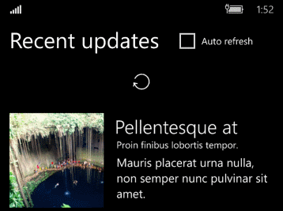

# <a name="pull-to-refresh"></a>Extraer para actualizar

<link rel="stylesheet" href="https://az835927.vo.msecnd.net/sites/uwp/Resources/css/custom.css"> 

El patrón extraer para actualizar permite al usuario desplegar una lista de datos con la entrada táctil para recuperar más datos. Extraer para actualizar se usa ampliamente en aplicaciones móviles, pero es útil en cualquier dispositivo con pantalla táctil. Puedes controlar los [eventos de manipulación](../input-and-devices/touch-interactions.md#manipulation-events) para implementar extraer para actualizar en tu aplicación.

La [muestra de extraer para actualizar](http://go.microsoft.com/fwlink/p/?LinkId=620635) muestra cómo extender un control [ListView](https://msdn.microsoft.com/library/windows/apps/windows.ui.xaml.controls.listview.aspx) para admitir este patrón. En este artículo, usamos esta muestra para explicar los puntos clave de la implementación de extraer para actualizar.



## <a name="is-this-the-right-pattern"></a>¿Es este el patrón adecuado?

Usa el patrón de extraer para actualizar cuando tengas una lista o cuadrícula de datos que sea posible que el usuario quiera actualizar con regularidad y una aplicación que se pueda ejecutar en dispositivos móviles y táctiles.

## <a name="implement-pull-to-refresh"></a>Implementar extraer para actualizar

Para implementar extraer para actualizar, necesitas controlar eventos de manipulación para detectar cuándo un usuario despliega la lista, proporciona información visual y actualiza los datos. Aquí, vamos a ver cómo hacerlo en la [muestra de extraer para actualizar](http://go.microsoft.com/fwlink/p/?LinkId=620635). No mostramos todo el código aquí, por lo que debes descargar la muestra o ver el código en GitHub.

La muestra de extraer para actualizar crea un control personalizado llamado `RefreshableListView` que extiende el control **ListView**. Este control agrega un indicador de actualización para proporcionar información visual y controla los eventos de manipulación en el visor de desplazamiento interno de la vista de lista. También agrega 2 eventos para notificarte cuándo se extiende la lista y cuándo se deben actualizar los datos. El control RefreshableListView solo proporciona la notificación de que se deben actualizar los datos. Necesitas controlar el evento en tu aplicación para actualizar los datos y ese código será diferente para cada aplicación.

El control RefreshableListView proporciona un modo de 'actualización automática' que determina cuándo se solicita la actualización y cómo sale de la vista el indicador de actualización. La actualización automática puede estar activada o desactivada.
- Desactivada: se solicita una actualización solo si se libera la lista mientras se supera el control `PullThreshold`. El indicador se anima y desaparece de la vista cuando el usuario suelta la barra de desplazamiento. El indicador de la barra de estado se muestra si está disponible (en el teléfono).
- Activada: se solicita una actualización en cuanto se supera el control `PullThreshold`, independientemente de si se liberó o no. El indicador permanece a la vista hasta que se recuperan los nuevos datos y luego se anima y desaparece de la vista. Se usa un método **Deferral** para notificar a la aplicación cuando se completa la captura de datos.

> **Nota**&nbsp;&nbsp;El código de la muestra también se aplica a una clase [**GridView**](https://msdn.microsoft.com/library/windows/apps/windows.ui.xaml.controls.gridview.aspx). Para modificar una clase GridView, deriva la clase personalizada de GridView en lugar de ListView y modifica la plantilla predeterminada de GridView.

## <a name="add-a-refresh-indicator"></a>Agregar un indicador de actualización

Es importante proporcionar información visual al usuario para que sepa que tu aplicación admite extraer para actualizar. El control RefreshableListView tiene una propiedad `RefreshIndicatorContent` que te permite establecer el indicador visual en XAML. También incluye un indicador de texto predeterminado que retrocede si no estableces el control `RefreshIndicatorContent`.

Aquí se recomiendan directrices para el indicador de actualización.


**Modificar la plantilla de la vista de lista**

En la muestra de extraer para actualizar, la plantilla del control `RefreshableListView` modifica la plantilla estándar **ListView** agregando un indicador de actualización. El indicador de actualización se ubica en un objeto [**Grid**](https://msdn.microsoft.com/library/windows/apps/windows.ui.xaml.controls.grid.aspx) sobre el objeto [**ItemsPresenter**](https://msdn.microsoft.com/library/windows/apps/windows.ui.xaml.controls.itemspresenter.aspx), que es la parte que muestra los elementos de lista.

> **Nota**&nbsp;&nbsp;El cuadro de texto `DefaultRefreshIndicatorContent` proporciona un indicador de reserva de texto que se muestra solo si la propiedad `RefreshIndicatorContent` no está establecida.

Esta es la parte de la plantilla del control que se modifica de la plantilla predeterminada ListView.

**XAML**
```xaml
<!-- Styles/Styles.xaml -->
<Grid x:Name="ScrollerContent" VerticalAlignment="Top">
    <Grid.RowDefinitions>
        <RowDefinition Height="Auto"/>
        <RowDefinition Height="*"/>
        <RowDefinition Height="Auto"/>
    </Grid.RowDefinitions>
    <Border x:Name="RefreshIndicator" VerticalAlignment="Top" Grid.Row="1">
        <Grid>
            <TextBlock x:Name="DefaultRefreshIndicatorContent" HorizontalAlignment="Center" 
                       Foreground="White" FontSize="20" Margin="20, 35, 20, 20"/>
            <ContentPresenter Content="{TemplateBinding RefreshIndicatorContent}"></ContentPresenter>
        </Grid>
    </Border>
    <ItemsPresenter FooterTransitions="{TemplateBinding FooterTransitions}" 
                    FooterTemplate="{TemplateBinding FooterTemplate}" 
                    Footer="{TemplateBinding Footer}" 
                    HeaderTemplate="{TemplateBinding HeaderTemplate}" 
                    Header="{TemplateBinding Header}" 
                    HeaderTransitions="{TemplateBinding HeaderTransitions}" 
                    Padding="{TemplateBinding Padding}"
                    Grid.Row="1"
                    x:Name="ItemsPresenter"/>
</Grid>
```

**Establecer el contenido en XAML**

Estableces el contenido del indicador de actualización en XAML para la vista de lista. La clase [ContentPresenter](https://msdn.microsoft.com/library/windows/apps/windows.ui.xaml.controls.contentpresenter.aspx) (`<ContentPresenter Content="{TemplateBinding RefreshIndicatorContent}">`) del indicador de actualización muestra el contenido XAML que estableciste. Si no estableces este contenido, se muestra el indicador de texto predeterminado en su lugar.

**XAML**
```xaml
<!-- MainPage.xaml -->
<c:RefreshableListView
    <!-- ... See sample for removed code. -->
    AutoRefresh="{x:Bind Path=UseAutoRefresh, Mode=OneWay}"
    ItemsSource="{x:Bind Items}"
    PullProgressChanged="listView_PullProgressChanged"
    RefreshRequested="listView_RefreshRequested">

    <c:RefreshableListView.RefreshIndicatorContent>
        <Grid Height="100" Background="Transparent">
            <FontIcon
                Margin="0,0,0,30"
                HorizontalAlignment="Center"
                VerticalAlignment="Bottom"
                FontFamily="Segoe MDL2 Assets"
                FontSize="20"
                Glyph="&#xE72C;"
                RenderTransformOrigin="0.5,0.5">
                <FontIcon.RenderTransform>
                    <RotateTransform x:Name="SpinnerTransform" Angle="0" />
                </FontIcon.RenderTransform>
            </FontIcon>
        </Grid>
    </c:RefreshableListView.RefreshIndicatorContent>
    
    <!-- ... See sample for removed code. -->

</c:RefreshableListView>
```

**Animar el control de giro**

Cuando se despliega la lista, se produce el evento `PullProgressChanged` del objeto RefreshableListView. Controlas este evento en la aplicación para controlar el indicador de actualización. En la muestra, se inicia este guión gráfico para animar la clase [**RotateTransform**](https://msdn.microsoft.com/library/windows/apps/windows.ui.xaml.media.rotatetransform.aspx) del indicador y girar el indicador de actualización. 

**XAML**
```xaml
<!-- MainPage.xaml -->
<Storyboard x:Name="SpinnerStoryboard">
    <DoubleAnimation
        Duration="00:00:00.5"
        FillBehavior="HoldEnd"
        From="0"
        RepeatBehavior="Forever"
        Storyboard.TargetName="SpinnerTransform"
        Storyboard.TargetProperty="Angle"
        To="360" />
</Storyboard>
```

## <a name="handle-scroll-viewer-manipulation-events"></a>Controlar eventos de manipulación del visor de desplazamiento

La plantilla de control de la vista de lista incluye una clase [**ScrollViewer**](https://msdn.microsoft.com/library/windows/apps/windows.ui.xaml.controls.scrollviewer.aspx) integrada que permite al usuario desplazarse por los elementos de la lista. Para implementar extraer para actualizar, tendrás que controlar los eventos de manipulación del visor de desplazamiento integrado, así como varios eventos relacionados. Para obtener más información sobre los eventos de manipulación, consulta [Interacciones táctiles](../input-and-devices/touch-interactions.md).

** OnApplyTemplate**

Para obtener acceso al visor de desplazamiento y a otras partes de la plantilla para poder agregar controladores de eventos y llamarlos más adelante en el código, es necesario reemplazar el método [**OnApplyTemplate**](https://msdn.microsoft.com/library/windows/apps/windows.ui.xaml.frameworkelement.onapplytemplate.aspx). En el método OnApplyTemplate, llamas al método [**GetTemplateChild**](https://msdn.microsoft.com/library/windows/apps/windows.ui.xaml.controls.control.gettemplatechild.aspx) para obtener una referencia a una parte con nombre de la plantilla de control, que puedes guardar y usar más adelante en el código.

En la muestra, las variables que se usan para almacenar las partes de la plantilla se declaran en la región Variables privadas. Después de que se recuperen en el método OnApplyTemplate, se agregan controladores de eventos para los eventos [**DirectManipulationStarted**](https://msdn.microsoft.com/library/windows/apps/windows.ui.xaml.controls.scrollviewer.directmanipulationstarted.aspx), [**DirectManipulationCompleted**](https://msdn.microsoft.com/library/windows/apps/windows.ui.xaml.controls.scrollviewer.directmanipulationcompleted.aspx), [**ViewChanged**](https://msdn.microsoft.com/library/windows/apps/windows.ui.xaml.controls.scrollviewer.viewchanged.aspx) y [**PointerPressed**](https://msdn.microsoft.com/library/windows/apps/windows.ui.xaml.uielement.pointerpressed.aspx).

**DirectManipulationStarted**

Para iniciar una acción de extraer para actualizar, se debe desplazar el contenido a la parte superior del visor de desplazamiento cuando el usuario comienza a desplegar. De lo contrario, se supone que el usuario extrae para moverse hacia arriba en la lista. El código del controlador determina si se inició la manipulación con el contenido en la parte superior del visor de desplazamiento y puede hacer que se actualice la lista. El estado 'refreshable' del control se establece según corresponda. 

Si se puede actualizar el control, también se agregarán controladores de eventos para las animaciones.

**DirectManipulationCompleted**

Cuando el usuario deja de desplegar la lista, el código del controlador comprueba si se activó una actualización durante la manipulación. Si se activó una actualización, se genera el evento `RefreshRequested` y se ejecuta el comando `RefreshCommand`.

También se quitarán los controladores de eventos para las animaciones.

En función del valor de la propiedad `AutoRefresh`, la lista puede animar la copia de seguridad inmediatamente o esperar hasta que la actualización esté completa y, a continuación, animar la copia de seguridad. Un objeto [**Deferral**](https://msdn.microsoft.com/library/windows/apps/windows.foundation.deferral.aspx) se usa para marcar la finalización de la actualización. En ese momento, se oculta la interfaz de usuario del indicador de actualización.

Esta parte del controlador de eventos DirectManipulationCompleted genera el evento `RefreshRequested` y obtiene el objeto Deferral si es necesario.

**C#**
```csharp
if (this.RefreshRequested != null)
{
    RefreshRequestedEventArgs refreshRequestedEventArgs = new RefreshRequestedEventArgs(
        this.AutoRefresh ? new DeferralCompletedHandler(RefreshCompleted) : null);
    this.RefreshRequested(this, refreshRequestedEventArgs);
    if (this.AutoRefresh)
    {
        m_scrollerContent.ManipulationMode = ManipulationModes.None;
        if (!refreshRequestedEventArgs.WasDeferralRetrieved)
        {
            // The Deferral object was not retrieved in the event handler.
            // Animate the content up right away.
            this.RefreshCompleted();
        }
    }
}
```

**ViewChanged**

Se controlan dos casos en el controlador de eventos ViewChanged.

En primer lugar, si se cambió la vista debido al acercamiento del visor de desplazamiento, se cancela el estado 'refreshable' del control.

En segundo lugar, si el contenido finalizó la animación al final de una actualización automática, se ocultan los rectángulos de espaciado, se vuelven a habilitar las interacciones táctiles con el visor de desplazamiento y la propiedad [VerticalOffset](https://msdn.microsoft.com/library/windows/apps/windows.ui.xaml.controls.scrollviewer.verticaloffset.aspx) se establece en 0.

**PointerPressed**

Extraer para actualizar ocurre solo cuando la lista se despliega por manipulación táctil. En el controlador de eventos PointerPressed, el código comprueba qué tipo de puntero causó el evento y establece una variable (`m_pointerPressed`) para indicar si fue un puntero táctil. Esta variable se usa en el controlador DirectManipulationStarted. Si el puntero no es un puntero táctil, el controlador DirectManipulationStarted no hace nada.

## <a name="add-pull-and-refresh-events"></a>Agregar eventos de extraer y actualizar

El método 'RefreshableListView' agrega 2 eventos que puedes controlar en tu aplicación para actualizar los datos y administrar el indicador de actualización.

Para más información acerca de los eventos, consulta el tema de [Introducción a los eventos y eventos enrutados](https://msdn.microsoft.com/windows/uwp/xaml-platform/events-and-routed-events-overview).

**RefreshRequested**

El evento 'RefreshRequested' notifica a la aplicación que el usuario ha extraído la lista para actualizarla. Controlas este evento para capturar datos nuevos y actualizar la lista.

Este es el controlador de eventos de la muestra. Es importante tener en cuenta que consulta la propiedad `AutoRefresh` de la vista de lista y obtiene un objeto Deferral si es **true**. Con un objeto Deferral, el indicador de actualización no se detiene ni se oculta hasta que se completa la actualización.

**C#**
```csharp
private async void listView_RefreshRequested(object sender, RefreshableListView.RefreshRequestedEventArgs e)
{
    using (Deferral deferral = listView.AutoRefresh ? e.GetDeferral() : null)
    {
        await FetchAndInsertItemsAsync(_rand.Next(1, 5));

        if (SpinnerStoryboard.GetCurrentState() != Windows.UI.Xaml.Media.Animation.ClockState.Stopped)
        {
            SpinnerStoryboard.Stop();
        }
    }
}
```

**PullProgressChanged**

En la muestra, la aplicación proporciona y controla el contenido del indicador de actualización. El evento 'PullProgressChanged' notifica a la aplicación cuando se extrae la lista para que puedas iniciar, detener y restablecer el indicador de actualización. 

## <a name="composition-animations"></a>Animaciones de composición

De manera predeterminada, el contenido de un visor de desplazamiento se detiene cuando la barra de desplazamiento alcanza la parte superior. Para permitir al usuario continuar desplegando la lista, debes tener acceso a la capa visual y animar el contenido de la lista. La muestra usa [animaciones de composición](https://msdn.microsoft.com/windows/uwp/graphics/composition-animation) para este fin; más específicamente, [animaciones de expresión](https://msdn.microsoft.com/windows/uwp/graphics/composition-animation#expression-animations).

En la muestra, el trabajo se realiza principalmente en el controlador de eventos `CompositionTarget_Rendering` y el método `UpdateCompositionAnimations`.

## <a name="related-articles"></a>Artículos relacionados

- [Controles de estilo](styling-controls.md)
- [Interacciones táctiles](../input-and-devices/touch-interactions.md)
- [Vista de lista y vista de cuadrícula](listview-and-gridview.md)
- [Plantillas de elemento de la vista de lista](listview-item-templates.md)
- [Animaciones de expresión](https://msdn.microsoft.com/windows/uwp/graphics/composition-animation#expression-animations)