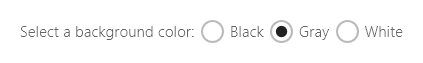

# <a name="radio-buttons"></a>Botones de radio

<link rel="stylesheet" href="https://az835927.vo.msecnd.net/sites/uwp/Resources/css/custom.css"> 

Los botones de radio permiten a los usuarios seleccionar una opción entre dos o más opciones. Cada opción aparece representada por un botón de radio; un usuario solo puede seleccionar un único botón de radio en un grupo de botones de radio.

(Si tienes curiosidad acerca del origen nombre, los botones de radio se llaman así por los botones de canales preestablecidos de una radio).


<div class="important-apis" >
<b>API importantes</b><br/>
<ul>
<li>[**Clase RadioButton**](https://msdn.microsoft.com/library/windows/apps/br227544)</li>
<li>[**Evento Checked**](https://msdn.microsoft.com/library/windows/apps/windows.ui.xaml.controls.primitives.togglebutton.checked.aspx)</li>
<li>[**Propiedad IsChecked**](https://msdn.microsoft.com/library/windows/apps/windows.ui.xaml.controls.primitives.togglebutton.ischecked.aspx)</li>
</ul>
</div>


## <a name="is-this-the-right-control"></a>¿Es este el control adecuado?

Usa botones de radio para presentar a los usuarios dos o más opciones mutuamente exclusivas, como aquí.



Los botones de radio proporcionan claridad y relevancia a opciones muy importantes de tu aplicación. Utiliza botones de radio cuando las opciones presentadas sean lo suficientemente importantes como para requerir más espacio en pantalla y donde la claridad de la opción requiera opciones muy explícitas.

Los botones de radio enfatizan todas las opciones por igual, lo que podría captar más atención de la necesaria sobre las opciones. Salvo que las opciones se merezcan una atención extra por parte del usuario, deberías considerar la posibilidad de utilizar otros controles. Por ejemplo, si la opción predeterminada se recomienda a la mayoría de los usuarios en la mayoría de las situaciones, usa en su lugar una [lista desplegable](lists.md).

Si únicamente hay dos opciones que se excluyen mutuamente, combínalas en una [casilla](checkbox.md) o [modificador para alternar](toggles.md). Por ejemplo, usa una casilla para "Acepto", en lugar de dos botones de radio para "Acepto" y "No acepto".


Si el usuario puede seleccionar varias opciones, utiliza en su lugar una [casilla](checkbox.md) o un [cuadro de lista](lists.md).


No uses botones de radio cuando las opciones sean números separados por intervalos fijos, como 10, 20, 30. En su lugar, usa un [control deslizante](slider.md).

Si hay más de ocho opciones, usa una [lista desplegable](lists.md), un [cuadro de lista](lists.md) de selección única o un [cuadro de lista](lists.md).

Si las opciones disponibles se basan en el contexto actual de la aplicación o pueden variar de forma dinámica, usa en su lugar un [cuadro de lista](lists.md) de selección única.

## <a name="example"></a>Ejemplo
Botones de radio en la configuración del navegador Microsoft Edge.


## <a name="create-a-radio-button"></a>Crear un botón de radio

Los botones de radio funcionan en grupos. Hay dos formas de agrupar los controles de botón de radio:
- Colocarlos dentro del mismo contenedor principal.
- Establece la propiedad [**GroupName**](https://msdn.microsoft.com/library/windows/apps/windows.ui.xaml.controls.radiobutton.groupname.aspx) en cada botón de radio en el mismo valor.

> **Nota**&nbsp;&nbsp;Un grupo de botones de radio se comporta como un control único cuando se accede a él con el teclado. Solo se puede acceder a la opción seleccionada mediante la tecla TAB, pero los usuarios pueden desplazarse por el grupo con las teclas de flecha.

En este ejemplo, el primer grupo de botones de radio se agrupará implícitamente al estar en el mismo panel de pila. El segundo grupo se divide entre dos paneles de pila, por lo que explícitamente están agrupados por GroupName.

```xaml
<StackPanel>
    <StackPanel>
        <TextBlock Text="Background" Style="{ThemeResource BaseTextBlockStyle}"/>
        <StackPanel Orientation="Horizontal">
            <RadioButton Content="Green" Tag="Green" Checked="BGRadioButton_Checked"/>
            <RadioButton Content="Yellow" Tag="Yellow" Checked="BGRadioButton_Checked"/>
            <RadioButton Content="Blue" Tag="Blue" Checked="BGRadioButton_Checked"/>
            <RadioButton Content="White" Tag="White" Checked="BGRadioButton_Checked" IsChecked="True"/>
        </StackPanel>
    </StackPanel>
    <StackPanel>
        <TextBlock Text="BorderBrush" Style="{ThemeResource BaseTextBlockStyle}"/>
        <StackPanel Orientation="Horizontal">
            <StackPanel>
                <RadioButton Content="Green" GroupName="BorderBrush" Tag="Green" Checked="BorderRadioButton_Checked"/>
                <RadioButton Content="Yellow" GroupName="BorderBrush" Tag="Yellow" Checked="BorderRadioButton_Checked" IsChecked="True"/>
            </StackPanel>
            <StackPanel>
                <RadioButton Content="Blue" GroupName="BorderBrush" Tag="Blue" Checked="BorderRadioButton_Checked"/>
                <RadioButton Content="White" GroupName="BorderBrush" Tag="White"  Checked="BorderRadioButton_Checked"/>
            </StackPanel>
        </StackPanel>
    </StackPanel>
    <Border x:Name="BorderExample1" BorderThickness="10" BorderBrush="#FFFFD700" Background="#FFFFFFFF" Height="50" Margin="0,10,0,10"/>
</StackPanel>
```

```csharp
private void BGRadioButton_Checked(object sender, RoutedEventArgs e)
{
    RadioButton rb = sender as RadioButton;

    if (rb != null && BorderExample1 != null)
    {
        string colorName = rb.Tag.ToString();
        switch (colorName)
        {
            case "Yellow":
                BorderExample1.Background = new SolidColorBrush(Colors.Yellow);
                break;
            case "Green":
                BorderExample1.Background = new SolidColorBrush(Colors.Green);
                break;
            case "Blue":
                BorderExample1.Background = new SolidColorBrush(Colors.Blue);
                break;
            case "White":
                BorderExample1.Background = new SolidColorBrush(Colors.White);
                break;
        }
    }
}

private void BorderRadioButton_Checked(object sender, RoutedEventArgs e)
{
    RadioButton rb = sender as RadioButton;

    if (rb != null && BorderExample1 != null)
    {
        string colorName = rb.Tag.ToString();
        switch (colorName)
        {
            case "Yellow":
                BorderExample1.BorderBrush = new SolidColorBrush(Colors.Gold);
                break;
            case "Green":
                BorderExample1.BorderBrush = new SolidColorBrush(Colors.DarkGreen);
                break;
            case "Blue":
                BorderExample1.BorderBrush = new SolidColorBrush(Colors.DarkBlue);
                break;
            case "White":
                BorderExample1.BorderBrush = new SolidColorBrush(Colors.White);
                break;
        }
    }
}
```

Los grupos de botones de radio tienen este aspecto.


Un botón de radio tiene dos estados: *seleccionado* o *borrado*. Cuando se selecciona un botón de radio, su propiedad [**IsChecked**](https://msdn.microsoft.com/library/windows/apps/windows.ui.xaml.controls.primitives.togglebutton.ischecked.aspx) es **true**. Cuando un botón de radio está desactivado, su propiedad **IsChecked** es **false**. Un botón de radio se puede desactivar haciendo clic en otro botón de radio del mismo grupo, pero no se puede borrar haciendo clic de nuevo en él. Sin embargo, puedes borrar un botón de radio mediante programación estableciendo su propiedad IsChecked en **false**.

## <a name="recommendations"></a>Recomendaciones

-   Asegúrate de que esté claro tanto el objetivo como el estado actual de un conjunto de botones de radio.
-   Proporciona siempre información visual al usuario cuando este pulse un botón de radio.
-   Proporciona información visual al usuario cuando este interactúe con los botones de radio. Entre los distintos estados que puede tener un botón de radio se encuentran los estados normal, presionado, marcado y deshabilitado. Un usuario pulsa un botón de radio para activar la opción pertinente. Si se pulsa una opción activada, no se desactiva. Sin embargo, si se pulsa otra opción, esta pasa a ser la opción activada.
-   Guarda las animaciones y los efectos visuales para proporcionar una respuesta a la interacción táctil y para el estado marcado. En el estado sin marcar, los controles de botón de radio deberían aparecer como inactivos o sin usar (pero no desactivado).
-   Limita el contenido textual del botón de radio a una única línea. Puedes personalizar los elementos visuales del botón de radio para que muestren una descripción de la opción en un tamaño inferior a la línea de texto principal.
-   Si el contenido es dinámico, piensa en cómo se reajustará el botón y qué sucederá con los elementos visuales que lo rodean.
-   Utiliza la fuente predeterminada salvo que se indique lo contrario en las directrices de tu marca.
-   Encierra el botón de radio en un elemento de etiqueta para que al pulsarla, se seleccione el botón de radio.
-   Coloca el texto de la etiqueta detrás del control de botón de radio, nunca antes ni encima de él.
-   Piensa en personalizar tus botones de radio. De forma predeterminada un botón de radio consta de dos círculos concéntricos (el interior rellenado, que se muestra cuando el botón de radio está seleccionado, y el exterior trazado) y de algo de texto. Pero te animamos a que seas creativo. Los usuarios se encuentran cómodos a la hora de interactuar directamente con el contenido de una aplicación. De modo que puedes decidir mostrar el contenido real en oferta, bien esté presentado mediante gráficos o como sutiles botones de alternancia con texto.
-   No coloques más de ocho opciones en un grupo de botones de radio. Si necesitas ofrecer más opciones, usa en su lugar una [lista desplegable](lists.md), un [cuadro de lista](lists.md)o una [vista de lista](lists.md).
-   No coloques juntos dos grupos de botones de radio. Cuando se colocan dos grupos de botones de radio juntos, es difícil determinar qué botones pertenecen a uno u otro grupo. Usa etiquetas de grupo para separar los grupos.

## <a name="additional-usage-guidance"></a>Instrucciones de uso adicionales

En esta ilustración, se muestra el modo correcto de colocar y espaciar botones de radio.


## <a name="related-topics"></a>Temas relacionados

**Para diseñadores**
- [Directrices sobre botones](buttons.md)
- [Directrices sobre modificadores para alternar](toggles.md)
- [Directrices sobre casillas](checkbox.md)
- [Directrices para listas desplegables](lists.md)
- [Directrices para controles de vista de lista y cuadrícula](lists.md)
- [Directrices sobre controles deslizantes](slider.md)
- [Directrices sobre el control de selección](lists.md)


**Para desarrolladores (XAML)**
- [**Clase RadioButton Windows.UI.Xaml.Controls**](https://msdn.microsoft.com/library/windows/apps/br227544)

