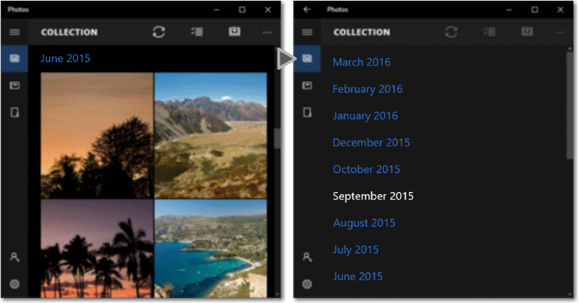

# Zoom semántico

El control de zoom semántico permite que el usuario haga zoom entre dos vistas distintas del mismo contenido para que se pueda navegar rápidamente a través de un gran conjunto de datos. La vista ampliada es la vista principal del contenido. En esta vista, muestras el conjunto de datos completo. La vista alejada es un nivel superior del mismo contenido. Por lo general, en esta vista se muestran los encabezados de grupo para un conjunto de datos agrupados. Por ejemplo, al visualizar una libreta de direcciones, el usuario puede acercar una letra y ver los nombres asociados a dicha letra. 

**API importantes**

-   [**Clase SemanticZoom**](https://msdn.microsoft.com/library/windows/apps/hh702601)

**Características**:

-   El tamaño de la vista alejada está restringido por los límites del control del zoom semántico.
-   Al pulsar en un encabezado de grupo, se alterna entre las vistas. Se puede habilitar el gesto de reducir como una forma de alternar entre las vistas.
-   Los encabezados activos cambian entre vistas.

## Ejemplos

Un zoom semántico en la aplicación Fotos.

Una libreta de direcciones es un ejemplo de un conjunto de datos por el que puede ser mucho más fácil navegar con un control de zoom semántico. En una vista, se trata de la información general completa y alfanumérica de las personas de la libreta de direcciones (imagen de la izquierda), mientras que en la vista ampliada se muestran los datos por orden y con mayor detalle (imagen de la derecha).

## Recomendaciones

-   Al usar el zoom semántico en la aplicación, asegúrate de que el diseño de los elementos y la dirección del movimiento panorámico no cambian en función del nivel de zoom. Las interacciones de movimiento panorámico y de diseño deben ser predecibles y coherentes en todos los niveles de zoom.
-   El zoom semántico permite al usuario saltar rápidamente al contenido, de forma que se limita el número de páginas y pantallas a tres en el modo alejado. Demasiado movimiento panorámico disminuye la utilidad del zoom semántico.
-   Evita usar el zoom semántico para cambiar el ámbito del contenido. Por ejemplo, un álbum de fotos no debería cambiar a una vista de carpeta en el Explorador de archivos.
-   Usa una estructura y una semántica que sean esenciales para la vista.
-   Usa los nombres de los grupos para elementos en una colección agrupada.
-   Usa criterios de ordenación de una colección que esté sin agrupar, pero ordenada, como orden cronológico de fechas u orden alfabético de una lista de nombres.

## Artículos relacionados

* [Directrices para las interacciones del usuario comunes](https://dev.windows.com/design/inputs-devices)

**Muestras (XAML)**
* [Entrada: muestra de eventos de entrada de usuario de XAML](http://go.microsoft.com/fwlink/p/?linkid=226855)
* [Muestra de desplazamiento, movimiento panorámico y zoom XAML](http://go.microsoft.com/fwlink/p/?linkid=251717)

**Muestras (DirectX)**
* [Muestra de entrada táctil de DirectX](http://go.microsoft.com/fwlink/p/?LinkID=231627)
* [Entrada: muestra de manipulaciones y gestos (C++)](http://go.microsoft.com/fwlink/p/?linkid=231605)
 

 

<!--HONumber=May16_HO2-->

