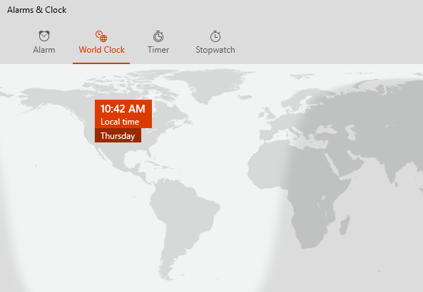
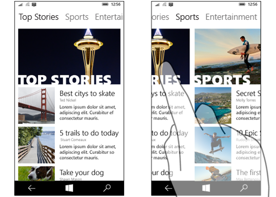

# Control dinámico y pestañas

Los controles dinámicos y el patrón de pestañas relacionado se usan para navegar por categorías de contenido distintas a las que se accede con frecuencia. Los elementos dinámicos permiten la navegación entre dos o más paneles de contenido y se basan en los encabezados de texto para articular las diferentes secciones de contenido.


Las pestañas son una variante visual de los elementos dinámicos que usan una combinación de iconos y texto o solo iconos para articular el contenido de las secciones. Las pestañas se crean mediante el control [**dinámico**](https://msdn.microsoft.com/library/windows/apps/xaml/windows.ui.xaml.controls.pivot.aspx). La [**muestra de control dinámico**](http://go.microsoft.com/fwlink/p/?LinkId=619903) indica cómo personalizar el control dinámico en el patrón de pestañas.


-   [**Clase Pivot**](https://msdn.microsoft.com/library/windows/apps/dn608241)

## Patrón de controles dinámicos

Al crear una aplicación con el patrón de controles dinámicos, hay algunas variables de diseño importantes a tener en cuenta.

- **Etiquetas de encabezado.**  Los encabezados pueden tener un icono con texto, solo texto o solo un icono.
- **Alineación de encabezados.**  Los encabezados pueden dejarse centrados o alineados a la izquierda.
- **Navegación de nivel inferior o de nivel superior.**  Los controles dinámicos se pueden usar para cualquier nivel de navegación. Opcionalmente, el [panel de navegación](nav-pane.md) puede servir como nivel principal con controles dinámicos que actúen como secundarios.
- **Compatibilidad con gestos táctiles.**  En los dispositivos que admiten los gestos táctiles, puedes usar uno de los dos conjuntos de interacción para navegar entre las categorías de contenido:
    1. Toca un encabezado de pestaña/control dinámico para navegar a esa categoría.
    2. Desplázate hacia la izquierda o la derecha en el área de contenido para navegar a la categoría adyacente.

## Ejemplos

Control dinámico en teléfono.


Patrón de pestañas en la aplicación Alarmas y reloj.



## Crear un control dinámico

El control [**Pivot**](https://msdn.microsoft.com/library/windows/apps/xaml/windows.ui.xaml.controls.pivot.aspx) incluye la funcionalidad básica que se describe en esta sección.

Este XAML crea un control dinámico básico con 3 secciones de contenido.

```xaml
<Pivot x:Name="rootPivot" Title="Pivot Title">
    <PivotItem Header="Pivot Item 1">
        <!--Pivot content goes here-->
        <TextBlock Text="Content of pivot item 1."/>
    </PivotItem>
    <PivotItem Header="Pivot Item 2">
        <!--Pivot content goes here-->
        <TextBlock Text="Content of pivot item 2."/>
    </PivotItem>
    <PivotItem Header="Pivot Item 3">
        <!--Pivot content goes here-->
        <TextBlock Text="Content of pivot item 3."/>
    </PivotItem>
</Pivot>
```

### Elementos de tabla dinámica

La tabla dinámica es un [**ItemsControl**](https://msdn.microsoft.com/library/windows/apps/xaml/windows.ui.xaml.controls.itemscontrol.aspx), de modo que puede contener una colección de elementos de cualquier tipo. Cualquier elemento que agregues a la tabla dinámica que no sea explícitamente un [**PivotItem**](https://msdn.microsoft.com/library/windows/apps/xaml/windows.ui.xaml.controls.pivotitem.aspx) se encapsula implícitamente en un PivotItem. Dado que una tabla dinámica a menudo se usa para navegar entre páginas de contenido, es común para rellenar la colección [**Elementos**](https://msdn.microsoft.com/library/windows/apps/xaml/windows.ui.xaml.controls.itemscontrol.items.aspx) directamente con los elementos de la interfaz de usuario de XAML. O puedes establecer la propiedad [**ItemsSource**](https://msdn.microsoft.com/library/windows/apps/xaml/windows.ui.xaml.controls.itemscontrol.itemssource.aspx) en un origen de datos. Los elementos enlazados en ItemsSource pueden ser de cualquier tipo, pero si no son explícitamente PivotItems, debes definir una [**ItemTemplate**](https://msdn.microsoft.com/library/windows/apps/xaml/windows.ui.xaml.controls.itemscontrol.itemtemplate.aspx) y [**HeaderTemplate**](https://msdn.microsoft.com/library/windows/apps/xaml/windows.ui.xaml.controls.pivot.headertemplate.aspx) para especificar cómo se muestran los elementos.

Puedes usar la propiedad [**SelectedItem**](https://msdn.microsoft.com/library/windows/apps/xaml/windows.ui.xaml.controls.pivot.selecteditem.aspx) para obtener o configurar el elemento activo de la tabla dinámica. Usa la propiedad [**SelectedIndex**](https://msdn.microsoft.com/library/windows/apps/xaml/windows.ui.xaml.controls.pivot.selectedindex.aspx) para obtener o configurar el índice del elemento activo.

### Encabezados dinámicos

Puedes usar las propiedades [**LeftHeader**](https://msdn.microsoft.com/library/windows/apps/xaml/windows.ui.xaml.controls.pivot.leftheader.aspx) y [**RightHeader**](https://msdn.microsoft.com/library/windows/apps/xaml/windows.ui.xaml.controls.pivot.rightheader.aspx) para agregar otros controles al encabezado dinámico.

### Interacción dinámica

El control ofrece estas interacciones de gestos táctiles:

-   Tocar un encabezado de elemento de control dinámico permite navegar al contenido de la sección de dicho encabezado.
-   Pasar el dedo a la izquierda o la derecha en un encabezado de elemento de control dinámico permite navegar a la sección adyacente.
-   Pasar el dedo a la izquierda o la derecha en el contenido de una sección permite navegar a la sección adyacente.


El control tiene dos modos:

**Inmóvil**

-   Los controles dinámicos están inmóviles cuando todos los encabezados de control dinámico caben en el espacio permitido.
-   Al tocar una etiqueta de tabla dinámica se navega a la página correspondiente, aunque no se moverá la propia tabla dinámica. La tabla dinámica activa se destacará.

{{> contenido que no sea interno = "
-   Especialmente, te recomendamos evitar elementos en una vista de carrusel en un entorno de 10 pies. Configura la nueva propiedad `IsHeaderItemsCarouselEnabled` en Falsa si la aplicación se ejecutará en Xbox.
"}}

**Carrusel**

-   Las tablas dinámicas giran cuando no caben todos los encabezados de tabla dinámica dentro del espacio permitido.
-   Al tocar una etiqueta de control dinámico se navega a la página correspondiente y, después, la etiqueta de control dinámico activa gira a la primera posición.
-   Gira elementos en un bucle de carrusel de la última a la primera sección de control dinámico.

{{> contenido que no sea interno = "
### Foco dinámico

De manera predeterminada, el foco del teclado en un encabezado dinámico se representa con un subrayado.


Las aplicaciones que tienen un control dinámico e incorporan el subrayado en elementos visuales de la selección de encabezado pueden usar la nueva propiedad `HeaderFocusVisualPlacement` para cambiar el valor predeterminado. Cuando `HeaderFocusVisualPlacement=\"ItemHeaders\"`, el foco se dibuja alrededor de todo el panel de encabezado.

 "}}

## Recomendaciones

-   Basa la alineación de los encabezados de pestaña/control dinámico en el tamaño de la pantalla. Para tamaños de pantalla inferiores a 720 epx, normalmente funciona mejor la alineación al centro, mientras que en la mayoría de casos se recomienda la alineación a la izquierda para anchos de pantalla superiores a 720 epx.
-   Evita usar más de 5 encabezados cuando uses el modo de carrusel (ida y vuelta), ya que un bucle de más de 5 puede resultar confuso.
-   Usa el patrón de pestañas solo si los elementos de control dinámico tienen iconos diferentes.
-   Incluye texto en los encabezados de elementos de control dinámico para ayudar a los usuarios a comprender el significado de cada sección de control dinámico. Los iconos no son necesariamente descriptivos para todos los usuarios.


## Temas relacionados

- [Conceptos básicos de diseño de la navegación](../layout/navigation-basics.md)

- [**Muestra de control dinámico**](http://go.microsoft.com/fwlink/p/?LinkId=619903)


<!--HONumber=Jun16_HO4-->


