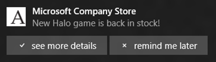
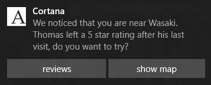
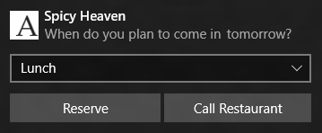

# Notificaciones del sistema interactivas y adaptables


Las notificaciones del sistema adaptables e interactivas permiten crear notificaciones emergentes flexibles con más contenido, imágenes en línea opcionales e interacción del usuario opcional.

El modelo de notificaciones del sistema adaptables e interactivas tiene estas actualizaciones sobre el catálogo de plantillas de notificación del sistema heredado:

-   La opción de incluir botones y entradas en las notificaciones.
-   Tres tipos de activación diferentes para la notificación del sistema principal y para cada acción.
-   La opción de crear una notificación para determinados escenarios, como las llamadas entrantes, avisos y alarmas.


            **Nota** Para ver las plantillas heredadas de Windows 8.1 y Windows Phone 8.1, consulta el [catálogo de plantillas de notificaciones del sistema heredado](https://msdn.microsoft.com/library/windows/apps/hh761494).

 

## <span id="toast_structure"></span><span id="TOAST_STRUCTURE"></span>Estructura de notificación del sistema


Las notificaciones del sistema se construyen mediante XML, que normalmente contendría los siguientes elementos clave:

-   &lt;visual&gt; cubre el contenido disponible para que los usuarios perciban de forma visual, como texto e imágenes;
-   &lt;actions&gt; contiene botones o entradas, que el desarrollador quiere agregar dentro de la notificación;
-   &lt;audio&gt; especifica el sonido que se reproduce al aparecer la notificación.

Aquí tienes un ejemplo de código:

```XML
<toast launch="app-defined-string">
  <visual>
    <binding template="ToastGeneric">
      <text>Sample</text>
      <text>This is a simple toast notification example</text>
      <image placement="AppLogoOverride" src="oneAlarm.png" />
    </binding>
  </visual>
  <actions>
    <action content="check" arguments="check" imageUri="check.png" />
    <action content="cancel" arguments="cancel" />
  </actions>
  <audio src="ms-winsoundevent:Notification.Reminder"/>
</toast>
```

Y una representación visual de la estructura:


### <span id="Visual"></span><span id="visual"></span><span id="VISUAL"></span>Elementos visuales

Dentro del elemento visual, debes tener exactamente un elemento de enlace que contenga el contenido visual de la notificación del sistema.

Las notificaciones de icono en las aplicaciones de la plataforma universal de Windows (UWP) admiten varias plantillas que se basan en distintos tamaños de icono. Las notificaciones del sistema, sin embargo, tienen solo un nombre de plantilla: **ToastGeneric**. Tener solo el nombre de una plantilla quiere decir:

-   Puede cambiar el contenido de la notificación del sistema, por ejemplo, agregando otra línea de texto, una imagen en línea o cambiando la imagen en miniatura que se muestra en el icono de la aplicación a otra cosa, y puede realizar cualquiera de estas cosas sin necesidad de preocuparse de cambiar la plantilla completa o de crear una carga no válida debido a un error de coincidencia entre el nombre de plantilla y el contenido.
-   Puedes usar el mismo código para construir la misma carga para la **notificación del sistema** que tiene como objetivo aplicarse a los diferentes tipos de dispositivos de MicrosoftWindows, como teléfonos, tabletas, equipos y Xbox One. Cada uno de estos dispositivos aceptará la notificación y la mostrará al usuario en sus directivas de interfaz de usuario con el modelo de interacción y prestaciones visuales adecuado.

Para todos los atributos que se admiten en la sección visual y sus elementos secundarios, consulta la sección Esquema a continuación. Para ver más ejemplos, consulta la sección Ejemplos de XML a continuación

### <span id="Actions"></span><span id="actions"></span><span id="ACTIONS"></span>Acciones

En las aplicaciones para UWP, puedes agregar botones y otros métodos de entrada para las notificaciones del sistema, lo que permite a los usuarios hacer más cosas fuera de la aplicación. Estas acciones se especifican en el elemento &lt;actions&gt;, del que hay dos tipos que se pueden especificar:

-   &lt;action&gt; Aparece como un botón en dispositivos móviles y de escritorio. Puedes especificar hasta cinco acciones personalizadas o del sistema dentro de una notificación del sistema.
-   &lt;input&gt; Esto permite a los usuarios proporcionar datos de entrada, como responder a un mensaje rápidamente o seleccionar una opción en un menú desplegable.

Ambos elementos &lt;action&gt; e &lt;input&gt; son adaptables dentro de la familia de dispositivos Windows. Por ejemplo, en los dispositivos móviles o de escritorio, &lt;action&gt; para un usuario es un botón que se pulsa o en el que se hace clic. El texto &lt;input&gt; es un cuadro en el que los usuarios pueden escribir texto mediante un teclado físico o un teclado en pantalla. Estos elementos también se adaptarán a futuros escenarios de interacción, como una acción anunciada por voz o una entrada de texto recogida mediante dictado.

Cuando el usuario realiza una acción, puedes realizar una de las siguientes operaciones especificando el atributo [**ActivationType**](https://msdn.microsoft.com/library/windows/desktop/dn408447) dentro del elemento &lt;action&gt;:

-   Activar la aplicación en primer plano con un argumento de acción específica que se puede usar para navegar a un página o un contexto específico.
-   Activar la tarea en segundo plano de la aplicación sin que ello afecte al usuario.
-   Activar otra aplicación a través del inicio de protocolo.
-   Especificar una acción del sistema para llevarla a cabo. Las acciones del sistema disponibles actualmente posponen y descartan alarmas y recordatorios programados; esto se explicará más detalladamente en la siguiente sección.

Para todos los atributos que se admiten en la sección visual y sus elementos secundarios, consulta la sección Esquema a continuación. Para ver más ejemplos, consulta la sección Ejemplos de XML a continuación

### <span id="Audio"></span><span id="audio"></span><span id="AUDIO"></span>Audio

Los sonidos personalizados no se admiten actualmente en las aplicaciones para UWP orientadas a la plataforma de escritorio; en su lugar, puedes elegirlos a partir de la lista de ms-winsoundevents para la aplicación en el escritorio. Las aplicaciones para UWP en las plataformas móviles admiten tanto ms-winsoundevents como sonidos personalizados en estos formatos:

-   ms-appx:///
-   ms-appdata:///

Consulta la [Página de esquema audio](https://msdn.microsoft.com/library/windows/apps/br230842) para obtener información sobre el audio de las notificaciones del sistema, que incluye una lista completa de ms-winsoundevents.

## <span id="Alarms__reminders__and_incoming_calls"></span><span id="alarms__reminders__and_incoming_calls"></span><span id="ALARMS__REMINDERS__AND_INCOMING_CALLS"></span>Alarmas, recordatorios y llamadas entrantes


Puedes usar las notificaciones del sistema para las alarmas, los recordatorios y las llamadas entrantes. Estas notificaciones del sistema especiales tienen un aspecto coherente con las notificaciones del sistema estándar, aunque las notificaciones del sistema especiales presentan algunas interfaces de usuario personalizadas, basadas en escenarios y patrones:

-   Permanecerá en pantalla una notificación del sistema de recordatorio hasta que el usuario la descarte o realice una acción. En Windows Mobile, las notificaciones del sistema de recordatorio también aparecerán previamente expandidas.
-   Además de compartir los comportamientos anteriores con las notificaciones de recordatorio, las notificaciones de alarma también reproducirán audio en bucle automáticamente.
-   Las notificaciones de llamadas entrantes se muestran en pantalla completa en los dispositivos Windows Mobile. Para hacerlo especifica el atributo de escenario dentro del elemento raíz de una notificación del sistema (&lt;toast&gt;: &lt;toast scenario=" { default | alarm | reminder | incomingCall } ") &gt;

## <span id="xml_examples"></span><span id="XML_EXAMPLES"></span>Ejemplos de XML


            **Nota** Las capturas de pantalla de notificación del sistema de estos ejemplos se tomaron desde una aplicación de escritorio. En los dispositivos móviles, es posible que las notificaciones del sistema aparezcan de forma contraída, con un capturador en la parte inferior de la notificación del sistema para expandirlas.

 

**Notificación con contenido visual enriquecido**

Este ejemplo muestra cómo puedes tener varias líneas de texto, una imagen pequeña opcional para reemplazar el logotipo de la aplicación y una miniatura de la imagen en línea opcional.

```XML
<toast launch="app-defined-string">
  <visual>
<binding template="ToastGeneric">
    <text>Photo Share</text>
      <text>Andrew sent you a picture</text>
      <text>See it in full size!</text>
      <image placement="appLogoOverride" src="A.png" />
    <image placement="inline" src="hiking.png" />
    </binding>
  </visual>
</toast>
```


 

**Notificación con acciones, ejemplo 1**

Este ejemplo muestra...

```XML
<toast launch="app-defined-string">
  <visual>
    <binding template="ToastGeneric">
      <text>Microsoft Company Store</text>
      <text>New Halo game is back in stock!</text>
      <image placement="appLogoOverride" src="A.png" />
    </binding>
  </visual>
  <actions>
    <action activationType="foreground" content="see more details" arguments="details" imageUri="check.png"/>
    <action activationType="background" content="remind me later" arguments="later" imageUri="cancel.png"/>
  </actions>
</toast>
```



 

**Notificación con acciones, ejemplo 2**

Este ejemplo muestra...

```XML
<toast launch="app-defined-string">
  <visual>
    <binding template="ToastGeneric">
      <text>Cortana</text>
      <text>We noticed that you are near Wasaki.</text>
      <text>Thomas left a 5 star rating after his last visit, do you want to try?</text>
      <image placement="appLogoOverride" src="A.png" />
    </binding>
  </visual>
  <actions>
    <action activationType="foreground" content="reviews" arguments="reviews" />
    <action activationType="protocol" content="show map" arguments="bingmaps:?q=sushi" />
  </actions>
</toast>
```



 

**Notificación con entrada de texto y acciones, ejemplo 1**

Este ejemplo muestra...

```XML
<toast launch="developer-defined-string">
  <visual>
    <binding template="ToastGeneric">
      <text>Andrew B.</text>
      <text>Shall we meet up at 8?</text>
      <image placement="appLogoOverride" src="A.png" />
    </binding>
  </visual>
  <actions>
    <input id="message" type="text" placeHolderContent="reply here" />
    <action activationType="background" content="reply" arguments="reply" />
    <action activationType="foreground" content="video call" arguments="video" />
  </actions>
</toast>
```


 

**Notificación con entrada de texto y acciones, ejemplo 2**

Este ejemplo muestra...

```XML
<toast launch="developer-defined-string">
  <visual>
    <binding template="ToastGeneric">
      <text>Andrew B.</text>
      <text>Shall we meet up at 8?</text>
      <image placement="appLogoOverride" src="A.png" />
    </binding>
  </visual>
  <actions>
    <input id="message" type="text" placeHolderContent="reply here" />
    <action activationType="background" content="reply" arguments="reply" imageUri="send.png" hint-inputId="message"/>
  </actions>
</toast>
```


 

**Notificación con entrada de selección y acciones**

Este ejemplo muestra...

```XML
<toast launch="developer-defined-string">
  <visual>
    <binding template="ToastGeneric">
      <text>Spicy Heaven</text>
      <text>When do you plan to come in tomorrow?</text>
      <image placement="appLogoOverride" src="A.png" />
    </binding>
  </visual>
  <actions>
    <input id="time" type="selection" defaultInput="2" >
  <selection id="1" content="Breakfast" />
  <selection id="2" content="Lunch" />
  <selection id="3" content="Dinner" />
    </input>
    <action activationType="background" content="Reserve" arguments="reserve" />
    <action activationType="background" content="Call Restaurant" arguments="call" />
  </actions>
</toast>
```



 

**Notificación de recordatorio**

Este ejemplo muestra...

```XML
<toast scenario="reminder" launch="developer-pre-defined-string">
  <visual>
    <binding template="ToastGeneric">
      <text>Adam&#39;s Hiking Camp</text>
      <text>You have an upcoming event for this Friday!</text>
      <text>RSVP before it"s too late.</text>
      <image placement="appLogoOverride" src="A.png" />
      <image placement="inline" src="hiking.png" />
    </binding>
  </visual>
  <actions>
    <action activationType="background" content="RSVP" arguments="rsvp" />
    <action activationType="background" content="Reminder me later" arguments="later" />
  </actions>
</toast>
```


 

## <span id="Activation_samples"></span><span id="activation_samples"></span><span id="ACTIVATION_SAMPLES"></span>Muestras de activación


Como se mencionó anteriormente, el cuerpo y las acciones en la notificación del sistema son capaces de activación de aplicaciones de diferentes formas. La muestra a continuación te enseñará cómo administrar diferentes tipos de activaciones desde el cuerpo de la notificación del sistema y/o las acciones de notificación del sistema.

**Primer plano**

En este escenario, una aplicación usa la activación en primer plano para responder a una acción dentro de una notificación del sistema que se puede accionar iniciando la aplicación y navegando hasta el contenido correcto.

Activación de notificaciones del sistema que se usa para invocar OnLaunched(). En Windows 10, la notificación del sistema tiene su propio tipo de activación e invocará OnActivated().

```
async protected override void OnActivated(IActivatedEventArgs args)
{
        //Initialize your app if it&#39;s not yet initialized;
    //Find out if this is activated from a toast;
    If (args.Kind == ActivationKind.ToastNotification)
    {
                //Get the pre-defined arguments and user inputs from the eventargs;
        var toastArgs = args as ToastNotificationActivatedEventArgs;
        var arguments = toastArgs.Arguments;
        var input = toastArgs.UserInput["1"]; 
}
     
    //...
}
```

**Segundo plano**

En este escenario, una aplicación usa una tarea en segundo plano para controlar una acción dentro de una notificación del sistema interactiva. El siguiente código muestra cómo declarar esta tarea en segundo plano para controlar las activaciones de notificación del sistema en el manifiesto de la aplicación, además de cómo obtener los argumentos a partir de la acción y de las entradas de usuario al hacer clic en los botones.

```
<!-- Manifest Declaration -->
<!-- A new task type toastNotification is added -->
<Extension Category = "windows.backgroundTasks" 
EntryPoint = "Tasks.BackgroundTaskClass" >
  <BackgroundTasks>
    <Task Type="systemEvent" />
  </BackgroundTasks>
</Extension>
```

```
namespace ToastNotificationTask
{
    public sealed class ToastNotificationBackgroundTask : IBackgroundTask
    {
        public void Run(IBackgroundTaskInstance taskInstance)
        {
        //Inside here developer can retrieve and consume the pre-defined 
        //arguments and user inputs;
        var details = taskInstance.TriggerDetails as ToastNotificationActionTriggerDetail;
        var arguments = details.Arguments;
        var input = details.Input.Lookup("1");

            // ...
        }        
    }
}
```

## <span id="Schemas___visual__and__audio_"></span><span id="schemas___visual__and__audio_"></span><span id="SCHEMAS___VISUAL__AND__AUDIO_"></span>Esquemas: &lt;visual&gt; y &lt;audio&gt;


En los siguientes esquemas, el sufijo "?" significa que el atributo es opcional.

```
<toast launch? duration? activationType? scenario? >
    <visual version? lang? baseUri? addImageQuery? >
        <binding template? lang? baseUri? addImageQuery? >
            <text lang? >content</text>
            <text />
            <image src placement? alt? addImageQuery? hint-crop? />
        </binding>
    </visual>
    <audio src? loop? silent? />
    <actions>
    </actions>
</toast>
```

**Atributos de &lt;toast&gt;**

launch?

-   launch? = string
-   Este atributo es opcional.
-   Una cadena que se pasa a la aplicación cuando la notificación del sistema la activa.
-   Según el valor de activationType, este valor puede recibirlo la aplicación en primer plano, dentro de la tarea en segundo plano, o bien otra aplicación que se inicie con protocolo desde la aplicación original.
-   El formato y el contenido de esta cadena los define la aplicación para su propio uso.
-   Cuando el usuario pulse o haga clic en la notificación del sistema para iniciar la aplicación asociada, la cadena de inicio proporciona el contexto de la aplicación que le permite mostrar al usuario una vista relevante para el contenido de la notificación del sistema, en lugar de iniciarse de forma predeterminada.
-   Si la activación se produjo porque el usuario hizo clic en una acción y no en el cuerpo de la notificación del sistema, el desarrollador recupera los "argumentos" predefinidos en esa etiqueta &lt;action&gt;, en lugar del "inicio" predefinido en la etiqueta &lt;toast&gt;.

duration?

-   duration? = "short|long"
-   Este atributo es opcional. El valor predeterminado es "short".
-   Esto está aquí solo para escenarios específicos y appCompat. Ya no necesitas esto para el escenario de alarma.
-   No recomendamos usar esta propiedad.

activationType?

-   activationType? = "foreground | background | protocol | system"
-   Este atributo es opcional.
-   El valor predeterminado es "foreground".

scenario?

-   scenario? = "default | alarm | reminder | incomingCall"
-   Este es un atributo opcional, el valor predeterminado es "default".
-   No es necesario a menos que en el escenario aparezca una alarma, un recordatorio o una llamada entrante.
-   No usar solo para mantener la notificación de forma persistente en la pantalla.

**Atributos de &lt;visual&gt;**

version?

-   version? = nonNegativeInteger
-   Este atributo no es necesario porque el control de versiones dejará de usarse en &lt;visual&gt;. Permanece atento a los nuevos modelos de control de versiones que especificarás desde una jerarquía superior, en caso necesario.

lang?

-   Consulta [este artículo de esquema de elemento](https://msdn.microsoft.com/library/windows/apps/br230847) para obtener detalles sobre este atributo opcional.

baseUri?

-   Consulta [este artículo de esquema de elemento](https://msdn.microsoft.com/library/windows/apps/br230847) para obtener detalles sobre este atributo opcional.

addImageQuery?

-   Consulta [este artículo de esquema de elemento](https://msdn.microsoft.com/library/windows/apps/br230847) para obtener detalles sobre este atributo opcional.

**Atributos de &lt;binding&gt;**

template?

-   \[Important\] template? = "ToastGeneric"
-   Si estás usando cualquiera de las nuevas características de notificaciones interactivas y adaptables, asegúrate de empezar a usar la plantilla "ToastGeneric" en lugar de la plantilla heredada.
-   Es posible que las plantillas heredadas funcionen con las nuevas acciones ahora, pero este no es su uso previsto y no podemos garantizar que sigan funcionando.

lang?

-   Consulta [este artículo de esquema de elemento](https://msdn.microsoft.com/library/windows/apps/br230847) para obtener detalles sobre este atributo opcional.

baseUri?

-   Consulta [este artículo de esquema de elemento](https://msdn.microsoft.com/library/windows/apps/br230847) para obtener detalles sobre este atributo opcional.

addImageQuery?

-   Consulta [este artículo de esquema de elemento](https://msdn.microsoft.com/library/windows/apps/br230847) para obtener detalles sobre este atributo opcional.

**Atributos de &lt;text&gt;**

lang?

-   Consulta [este artículo de esquema de elemento](https://msdn.microsoft.com/library/windows/apps/br230847) para obtener detalles sobre este atributo opcional.

**Atributos de &lt;image&gt;**

src

-   Consulta [este artículo de esquema de elemento](https://msdn.microsoft.com/library/windows/apps/br230844) para obtener detalles sobre este atributo obligatorio.

placement?

-   placement? = "inline" | "appLogoOverride"
-   Este atributo es opcional.
-   Especifica dónde se mostrará esta imagen.
-   "inline" significa dentro del cuerpo de la notificación del sistema, debajo el texto; "appLogoOverride" significa reemplazar el icono de la aplicación (que aparece en la esquina superior izquierda de la notificación del sistema).
-   Puedes tener hasta una imagen por cada valor de colocación.

alt?

-   Consulta [este artículo de esquema de elemento](https://msdn.microsoft.com/library/windows/apps/br230844) para obtener detalles sobre este atributo opcional.

addImageQuery?

-   Consulta [este artículo de esquema de elemento](https://msdn.microsoft.com/library/windows/apps/br230844) para obtener detalles sobre este atributo opcional.

hint-crop?

-   hint-crop? = "none" | "circle"
-   Este atributo es opcional.
-   "none" es el valor predeterminado, que significa no recortar.
-   "circle" recorta la imagen en una forma circular. Úsalo para las imágenes de perfil de los contactos, imágenes de personas, etc.

**Atributos de &lt;audio&gt;**

src?

-   Consulta [este artículo de esquema de elemento](https://msdn.microsoft.com/library/windows/apps/br230842) para obtener detalles sobre este atributo opcional.

loop?

-   Consulta [este artículo de esquema de elemento](https://msdn.microsoft.com/library/windows/apps/br230842) para obtener detalles sobre este atributo opcional.

silent?

-   Consulta [este artículo de esquema de elemento](https://msdn.microsoft.com/library/windows/apps/br230842) para obtener detalles sobre este atributo opcional.

## <span id="Schemas___action_"></span><span id="schemas___action_"></span><span id="SCHEMAS___ACTION_"></span>Esquemas: &lt;action&gt;


En los siguientes esquemas, el sufijo "?" significa que el atributo es opcional.

```
<toast>
    <visual>
    </visual>
    <audio />
    <actions>
        <input id type title? placeHolderContent? defaultInput? >
            <selection id content />
        </input>
        <action content arguments activationType? imageUri? hint-inputId />
    </actions>
</toast>
```

**Atributos de &lt;input&gt;**

id

-   id = string
-   Este atributo es obligatorio.
-   El atributo id es necesario y los desarrolladores lo usan para recuperar las entradas de usuario una vez activada la aplicación (en primer o en segundo plano).

type

-   type = "text | selection"
-   Este atributo es obligatorio.
-   Se usa para especificar una entrada de texto o una entrada de una lista de selecciones predefinidas.
-   En dispositivos móviles y de escritorio, sirve para especificar si quieres una entrada de cuadro de texto o una entrada de cuadro de lista.

title?

-   title? = string
-   El atributo title es opcional y es para que los desarrolladores especifiquen un título para la entrada que los shells representarán cuando haya prestación.
-   En dispositivos móviles y de escritorio, este título aparecerá encima de la entrada.

placeHolderContent?

-   placeHolderContent? = string
-   El atributo placeHolderContent es opcional y es el texto de sugerencia en gris para el tipo de entrada de texto. Este atributo se omite cuando el tipo de entrada no es "text".

defaultInput?

-   defaultInput? = string
-   El atributo defaultInput es opcional y se usa para proporcionar un valor de entrada predeterminado.
-   Si el tipo de entrada es "text", se tratará como una entrada de cadena.
-   Si el tipo de entrada es "selection", se espera que sea el identificador de una de las opciones disponibles dentro de los elementos de esta entrada.

**Atributos de &lt;selection&gt;**

id

-   Este atributo es obligatorio. Se usa para identificar las selecciones del usuario. El identificador se devuelve a la aplicación.

content

-   Este atributo es obligatorio. Proporciona la cadena que se mostrará en este elemento de la selección.

**Atributos de &lt;action&gt;**

content

-   content = string
-   El atributo content es obligatorio. Proporciona la cadena de texto que se muestra en el botón.

arguments

-   arguments = string
-   El atributo arguments es obligatorio. Describe los datos definidos por la aplicación que la aplicación puede recuperar más adelante cuando se active al realizar el usuario esta acción.

activationType?

-   activationType? = "foreground | background | protocol | system"
-   El atributo activationType es opcional y su valor predeterminado es "foreground".
-   Describe el tipo de activación que provocará esta acción: en primer plano, en segundo plano o el inicio de otra aplicación a través del inicio de protocolo, o bien la invocación de una acción del sistema.

imageUri?

-   imageUri? = string
-   imageUri es opcional y se usa para proporcionar un icono de imagen para que esta acción lo muestre en el botón, únicamente con el contenido del texto.

hint-inputId

-   hint-inputId = string
-   El atributo hint-inpudId es obligatorio. Se usa específicamente para el escenario de respuesta rápida.
-   El valor debe ser el identificador del elemento de entrada con el que se quiere asociar.
-   En dispositivos móviles y de escritorio, colocará el botón justo al lado del cuadro de entrada.

## <span id="Attributes_for_system-handled_actions"></span><span id="attributes_for_system-handled_actions"></span><span id="ATTRIBUTES_FOR_SYSTEM-HANDLED_ACTIONS"></span>Atributos para acciones controladas por el sistema


El sistema puede controlar las acciones para posponer y descartar notificaciones si no quieres que la aplicación controle el aplazamiento o la reprogramación de notificaciones como una tarea en segundo plano. Las acciones controladas por el sistema se pueden combinar (o especificarse individualmente), pero no se recomienda implementar una acción para posponer sin una acción para descartar.

Combinación de comandos del sistema: SnoozeAndDismiss

```
<toast>
    <visual>
    </visual>
    <audio />
    <actions hint-systemCommands? = "SnoozeAndDismiss" />
</toast>
```

Acciones individuales controladas por el sistema

```
<toast>
    <visual>
    </visual>
    <audio />
<actions>
<input id="snoozeTime" type="selection" defaultInput="10">
  <selection id="5" content="5 minutes" />
  <selection id="10" content="10 minutes" />
  <selection id="20" content="20 minutes" />
  <selection id="30" content="30 minutes" />
  <selection id="60" content="1 hour" />
</input>
<action activationType="system" arguments="snooze" hint-inputId="snoozeTime" content=""/>
<action activationType="system" arguments="dismiss" content=""/>
</actions>
</toast>
```

Para crear acciones individuales para posponer y descartar, haz lo siguiente:

-   Especifica el activationType = "system"
-   Especificar los argumentos = "snooze" | "dismiss"
-   Especifica el contenido:
    -   Si quieres que las cadenas localizadas de "snooze" y "dismiss" se muestren en las acciones, especifica el contenido para que sea una cadena vacía: &lt;action content = ""/&gt;
    -   Si quieres una cadena personalizada, proporciona solo su valor: &lt;action content="Remind me later" /&gt;
-   Especifica la entrada:
    -   Si no quieres que el usuario seleccione un intervalo de aplazamiento y, en su lugar, solo quieres que la notificación se posponga solo una vez en un intervalo de tiempo definido por el sistema (que es coherente en todo el sistema operativo), no crees ningún &lt;input&gt; en absoluto.
    -   Si quieres proporcionar las selecciones de intervalo de aplazamiento:
        -   Especifica hint-inputId en la acción de posponer
        -   Haz coincidir el identificador de la entrada con el hint-inputId de la acción de posponer: &lt;input id="snoozeTime"&gt;&lt;/input&gt;&lt;action hint-inputId="snoozeTime"/&gt;
        -   Especifica el identificador de selección para que sea un nonNegativeInteger que represente el intervalo de aplazamiento en minutos: &lt;selection id="240" /&gt; significa pospuesto 4 horas
        -   Asegúrate de que el valor de defaultInput en &lt;input&gt; coincida con uno de los identificadores de los elementos secundarios de &lt;selection&gt;.
        -   Proporciona hasta (pero no más de) 5 valores &lt;selection&gt;

 

 


<!--HONumber=Jun16_HO4-->


