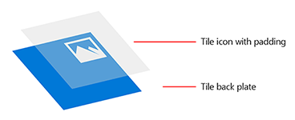
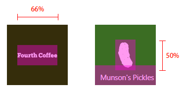
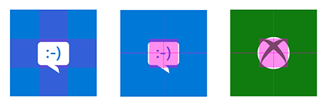
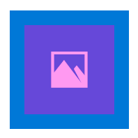
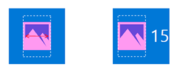
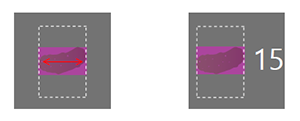

# Directrices sobre los activos de icono y de mosaicos


Los activos de icono de la aplicación, que aparecen en una amplia variedad de formas en todo el sistema operativo Windows 10, son las tarjetas de llamada de la aplicación para la Plataforma universal de Windows (UWP). Estas directrices detallan el lugar donde aparecen los recursos de icono de la aplicación en el sistema y proporcionan sugerencias de diseño detalladas sobre cómo crear los iconos más sofisticados.


## <span id="Adaptive_scaling"></span><span id="adaptive_scaling"></span><span id="ADAPTIVE_SCALING"></span>Ajuste de escala adaptable


En primer lugar, una breve introducción sobre el ajuste de escala adaptable para comprender mejor su funcionamiento con los recursos. Windows 10 presenta una evolución del modelo de ajuste de escala existente. Además del contenido del vector de escala, hay un conjunto unificado de factores de escala que proporciona un tamaño coherente para los elementos de interfaz de usuario en diversos tamaños y resoluciones de pantalla. Los factores de escala también son compatibles con los factores de escala de otros sistemas operativos como iOS y Android, lo que facilita el uso compartido de recursos entre estas plataformas.

La Tienda elige los recursos para descargar en parte según los valores de PPP del dispositivo. Solo se descargan los recursos que se ajusten mejor al dispositivo.

## <span id="Tile_elements"></span><span id="tile_elements"></span><span id="TILE_ELEMENTS"></span>Elementos de ventana


Los componentes básicos de una ventana de Inicio constan de una placa trasera, un icono, una barra de personalización de marca, márgenes y un título de la aplicación:


El nombre de la aplicación, el distintivo y el contador (si se usa) se encuentran en la barra de personalización de marca en la parte inferior de una ventana:


El alto de la barra de personalización de marca se basa en el factor de escala del dispositivo en el que se muestra:

| Factor de escala | Píxeles |
|--------------|--------|
| 100 %         | 32     |
| 125 %         | 40     |
| 150 %         | 48     |
| 200 %         | 64     |
| 400 %         | 128    |

 

El sistema establece los márgenes de ventana y no se pueden modificar. La mayoría del contenido aparece dentro de los márgenes, tal como se muestra en este ejemplo:


El ancho de los márgenes se basa en el factor de escala del dispositivo en el que se muestra:

| Factor de escala | Píxeles |
|--------------|--------|
| 100 %         | 8      |
| 125 %         | 10     |
| 150 %         | 12     |
| 200 %         | 16     |
| 400 %         | 32     |

 

## <span id="Tile_assets"></span><span id="tile_assets"></span><span id="TILE_ASSETS"></span>Recursos de ventana


Cada recurso de ventana es del mismo tamaño que la ventana en la que se coloca. Puedes personalizar la marca de los iconos de la aplicación con dos representaciones de un activo diferentes:

1. Un icono o logotipo centrado con espaciado. Esto permite que el color de la placa trasera se muestre a través de él:



2. Un icono de marca y sin bordes sin relleno:


Para que exista coherencia en todos los dispositivos, cada tamaño de mosaico (pequeño, mediano, ancho y grande) tiene su propia relación de tamaño. Para lograr una ubicación de icono coherente entre mosaicos, recomendamos algunas directrices básicas de espaciado para los siguientes tamaños de mosaico. El área de intersección entre las dos superposiciones púrpuras representa la superficie ideal para un icono. A pesar de que los iconos no siempre caben en la superficie, el volumen visual de un icono debería ser más o menos equivalente a los ejemplos proporcionados.

Tamaño de mosaico pequeño:


Tamaño de mosaico mediano:


Tamaño de mosaico ancho:


Tamaño de mosaico grande:


En este ejemplo, el icono es demasiado grande para el mosaico:


En este ejemplo, el icono es demasiado pequeño para el mosaico:


Las siguientes relaciones de espaciado interno son las óptimas para iconos orientados horizontal o verticalmente.

Para los mosaicos pequeños, limita el ancho y alto del icono al 66 % del tamaño de mosaico:


Para los mosaicos medianos, limita el ancho del icono al 66 % y el alto al 50 % del tamaño de mosaico. Esto impide la superposición de elementos de la barra de personalización de marca:



Para los mosaicos anchos, limita el ancho del icono al 66 % y el alto al 50 % del tamaño de mosaico. Esto impide la superposición de elementos de la barra de personalización de marca:


Para los mosaicos grandes, limita el ancho y alto del icono al 50 % del tamaño de mosaico:


Algunos iconos están diseñados para una orientación horizontal o vertical, mientras que otros tienen formas más complejas que impiden que se ajusten exactamente a las dimensiones de destino. Los iconos que parece que están centrados pueden medirse conforme a un lado. En este caso, las partes de un icono pueden quedar por fuera de la superficie recomendada, siempre que ocupen el mismo peso visual que un icono ajustado exactamente:



Con activos sin bordes, ten en cuenta los elementos que interactúan dentro de los márgenes y bordes de los iconos. Mantén los márgenes de, al menos, el 16 % del alto o ancho del icono. Este porcentaje representa el doble de ancho de los márgenes en los tamaños de mosaico más pequeños:


En este ejemplo los márgenes son demasiado estrechos:


## <span id="Tile_assets_in_list_views"></span><span id="tile_assets_in_list_views"></span><span id="TILE_ASSETS_IN_LIST_VIEWS"></span>Activos de icono en las vistas de lista


Los iconos también pueden aparecer en una vista de lista. Las directrices de tamaño de los activos de icono que se muestran listas de vistas difieren un poco de los activos de icono descritos anteriormente. Esta sección describe esas especificaciones de tamaño.


Limita el ancho y alto del icono al 75 % del tamaño de mosaico:


En los formatos de icono vertical y horizontal, limita el ancho y alto al 75 % del tamaño de mosaico:


Para ilustraciones sin bordes de elementos de marca importantes, mantén unos márgenes de al menos el 12,5 %:


En este ejemplo, el icono es demasiado grande dentro del mosaico:


En este ejemplo, el icono es demasiado pequeño dentro del mosaico:



## <span id="Target-based_assets"></span><span id="target-based_assets"></span><span id="TARGET-BASED_ASSETS"></span>Recursos basados en el destino


Los recursos basados en el destino se usan para los iconos y las ventanas que se muestran en la barra de tareas de Windows, la vista de tareas, ALT+TAB, el asistente para el espacio restante y la esquina inferior derecha de las ventanas de Inicio. No tienes que agregar espaciado interno a estos recursos porque Windows lo hará si es necesario. Estos recursos deberían contar con una superficie mínima de 16 píxeles. Te mostramos un ejemplo de dichos recursos tal como se muestran en los iconos de la barra de tareas de Windows:


Aunque estas interfaces de usuario usan de manera predeterminada un recurso basado en destino sobre una placa trasera de color, también puedes usar un recurso basado en destino sin placa. Los activos sin placa deben crearse con la posibilidad de que puedan aparecer sobre varios colores de fondo:


Estas son las recomendaciones de tamaño para los activos basados en el destino, a escala del 100 %:


**Recursos de la aplicación de plantilla icónica**

La plantilla icónica (también conocida como la plantilla "IconWithBadge") te permite mostrar una imagen pequeña en el centro de la ventana. Windows 10 admite la plantilla tanto en el teléfono como en la tableta o el equipo de escritorio. (Obtén información sobre la creación de ventanas de iconos en el [artículo sobre plantillas de ventanas especiales](tiles-and-notifications-special-tile-templates-catalog.md)).

Las aplicaciones que usan la plantilla icónica, como Mensajes, Teléfono y Tienda, tienen recursos basados en el destino que pueden ofrecer un distintivo (con el contador dinámico). Al igual que con otros activos basados en el destino, no es necesario el espaciado interno. Los activos icónicos no forman parte del manifiesto de la aplicación, pero forman parte de una carga de icono dinámico. Los activos se escalan para ajustarse y centrarse en un contenedor con una relación de 3:2:


En los activos cuadrados, se produce el centrado automático dentro del contenedor:



Para activos no cuadrados, se produce el centrado horizontal o vertical automático y el ajuste del ancho o alto del contenedor:




## <span id="Splash_screen_assets"></span><span id="splash_screen_assets"></span><span id="SPLASH_SCREEN_ASSETS"></span>Activos de pantalla de presentación


La imagen de pantalla de presentación puede proporcionarse como una ruta de acceso directa a un archivo de imagen o como un recurso. Si usas una referencia a recursos, puedes proporcionar imágenes de diferentes escalas para que Windows pueda elegir el tamaño óptimo según la resolución de pantalla y el dispositivo. También puedes proporcionar imágenes de contraste alto para accesibilidad e imágenes localizadas para que coincidan con diferentes idiomas de interfaz de usuario.

Si abres "Package.appxmanifest" en un editor de texto, se muestra el elemento [**SplashScreen**](https://msdn.microsoft.com/library/windows/apps/br211467) como secundario del elemento [**VisualElements**](https://msdn.microsoft.com/library/windows/apps/br211471). El marcado de la pantalla de presentación predeterminada del archivo de manifiesto tiene el siguiente aspecto en un editor de texto:

```XML
<uap:SplashScreen Image="Assets\SplashScreen.png" /></code></pre></td>
</tr>
</tbody>
</table>
```

El recurso de pantalla de presentación se centra sea cual sea el dispositivo en el que se muestra:


## <span id="High-contrast_assets"></span><span id="high-contrast_assets"></span><span id="HIGH-CONTRAST_ASSETS"></span>Activos de contraste alto


El modo de contraste alto usa conjuntos de activos independientes de blanco en contraste alto (fondo blanco con texto negro) y negro en contraste alto (fondo negro con texto blanco). Si no proporcionas activos de contraste alto para la aplicación, se usarán activos estándar.

Si los activos estándar de la aplicación proporcionan una experiencia de visualización aceptable cuando se representen en un fondo blanco y negro, entonces la aplicación debería tener, como mínimo, una apariencia satisfactoria en modo de contraste alto. Si los activos estándar no permiten una experiencia de visualización aceptable cuando se representen en un fondo blanco y negro, considera la posibilidad de incluir específicamente activos de contraste alto. Los ejemplos siguientes ilustran los dos tipos de activos de contraste alto:


Si decides proporcionar activos de contraste alto, debes incluir ambos conjuntos: blanco sobre negro y negro sobre blanco. Cuando incluyas estos activos en el paquete, podrías crear una carpeta de "contraste negro" para los activos de blanco sobre negro y una carpeta de "contraste blanco" para los activos de negro sobre blanco.

## <span id="Asset_size_tables"></span><span id="asset_size_tables"></span><span id="ASSET_SIZE_TABLES"></span>Tablas de tamaño del activo


Como mínimo, te recomendamos que proporciones activos para los factores de escala 100, 200 y 400. Proporcionar activos para todos los factores de escala ofrecerá una experiencia de usuario óptima.

**Activos basados en la escala**

| Categoría             | Nombre del elemento      | A una escala del 100 % | A una escala del 125 % | A una escala del 150 % | A una escala del 200 % | A una escala del 400 % |
|----------------------|-------------------|---------------|---------------|---------------|---------------|---------------|
| Pequeño                | Square71x71Logo   | 71x71         | 89x89         | 107x107       | 142x142       | 284x284       |
| Mediano               | Square150x150Logo | 150x150       | 188x188       | 225x225       | 300x300       | 600x600       |
| Ancho                 | Square310x150Logo | 310x150       | 388x188       | 465x225       | 620x300       | 1240x600      |
| Grande (solo escritorio) | Square310x310Logo | 310x310       | 388x388       | 465x465       | 620x620       | 1240x1240     |
| Lista de aplicaciones (icono)      | Square44x44Logo   | 44x44         | 55x55         | 66x66         | 88x88         | 176x176       |

 

**Ejemplos de nombre de archivo para los activos basados en la escala**

| Categoría             | Nombre del elemento      | A una escala del 100 %                  | A una escala del 125 %                  | A una escala del 150 %                  |
|----------------------|-------------------|--------------------------------|--------------------------------|--------------------------------|
| Pequeño                | Square71x71Logo   | AppNameSmallTile.scale-100.png | AppNameSmallTile.scale-125.png | AppNameSmallTile.scale-150.png |
| Medio               | Square150x150Logo | AppNameMedTile.scale-100.png   | AppNameMedTile.scale-125.png   | AppNameMedTile.scale-150.png   |
| Ancho                 | Square310x150Logo | AppNameWideTile.scale-100.png  | AppNameWideTile.scale-125.png  | AppNameWideTile.scale-150.png  |
| Grande (solo escritorio) | Square310x310Logo | AppNameLargeTile.scale-100.png | AppNameLargeTile.scale-125.png | AppNameLargeTile.scale-150.png |
| Lista de aplicaciones (icono)      | Square44x44Logo   | AppNameLargeTile.scale-100.png | AppNameLargeTile.scale-125.png | AppNameLargeTile.scale-150.png |

 

| Categoría             | Nombre del elemento      | A una escala del 200 %                  | A una escala del 400 %                  |
|----------------------|-------------------|--------------------------------|--------------------------------|
| Pequeño                | Square71x71Logo   | AppNameSmallTile.scale-200.png | AppNameSmallTile.scale-400.png |
| Medio               | Square150x150Logo | AppNameMedTile.scale-200.png   | AppNameMedTile.scale-400.png   |
| Ancho                 | Square310x150Logo | AppNameWideTile.scale-200.png  | AppNameWideTile.scale-400.png  |
| Grande (solo escritorio) | Square310x310Logo | AppNameLargeTile.scale-200.png | AppNameLargeTile.scale-400.png |
| Lista de aplicaciones (icono)      | Square44x44Logo   | AppNameLargeTile.scale-200.png | AppNameLargeTile.scale-400.png |

 

**Recursos basados en el destino**

Los activos basados en el destino se usan en varios factores de escala. El nombre de elemento para activos basados en el destino es **Square44x44Logo**. Te recomendamos que envíes los siguientes activos como mínimo:

16x16, 24x24, 32x32, 48x48, 256x256

La siguiente tabla enumera todos los tamaños de activos basados en el destino y sus correspondientes ejemplos de nombre de archivo:

| Tamaño del activo | Ejemplo de nombre de archivo                 |
|------------|-----------------------------------|
| 16x16\*    | AppNameAppList.targetsize-16.png  |
| 24x24\*    | AppNameAppList.targetsize-24.png  |
| 32x32\*    | AppNameAppList.targetsize-32.png  |
| 48x48\*    | AppNameAppList.targetsize-48.png  |
| 256x256\*  | AppNameAppList.targetsize-256.png |
| 20x20      | AppNameAppList.targetsize-20.png  |
| 30x30      | AppNameAppList.targetsize-30.png  |
| 36x36      | AppNameAppList.targetsize-36.png  |
| 40x40      | AppNameAppList.targetsize-40.png  |
| 60x60      | AppNameAppList.targetsize-60.png  |
| 64x64      | AppNameAppList.targetsize-64.png  |
| 72x72      | AppNameAppList.targetsize-72.png  |
| 80x80      | AppNameAppList.targetsize-80.png  |
| 96x96      | AppNameAppList.targetsize-96.png  |

 

\* Enviar estos tamaños de activos como línea base

## <span id="Asset_types"></span><span id="asset_types"></span><span id="ASSET_TYPES"></span>Tipos de activo


A continuación se enumeran todos los tipos de activos, sus usos y nombres de archivo recomendados.

**Recursos de ventana**

-   Por lo general, los activos centrados se usan en Inicio para que presenten la aplicación.
-   Formato de nombre de archivo: \*Tile.scale-\*.PNG
-   Aplicaciones afectadas: todas las aplicaciones para UWP
-   Usos:
    -   Iconos de Inicio predeterminados (móviles y de escritorio)
    -   Centro de actividades (móvil y de escritorio)
    -   Conmutador de tareas (móvil)
    -   Selector de uso compartido (móvil)
    -   Selector (móvil)
    -   Tienda

**Activos de lista escalable con placa**

-   Estos activos se usan en las superficies que solicitan factores de escala. Los activos pueden obtener la placa a través del sistema o venir con su propio color de fondo si la aplicación lo incluye.
-   Formato de nombre de archivo: \*AppList.scale-\*.PNG
-   Aplicaciones afectadas: todas las aplicaciones para UWP
-   Usos:
    -   Lista de todas las aplicaciones de Inicio (escritorio)
    -   Lista de aplicaciones usadas con mayor frecuencia en Inicio (escritorio)
    -   Administrador de tareas (escritorio)
    -   Resultados de búsqueda de Cortana
    -   Lista de todas las aplicaciones en Inicio (móvil)
    -   Configuración

**Activos con placa de la lista de tamaño de destino**

-   Estos son tamaños de activos fijos que no se escalan con niveles. Se usan principalmente para experiencias heredadas. El sistema comprueba los activos.
-   Formato de nombre de archivo: \*AppList.targetsize-\*.PNG
-   Aplicaciones afectadas: todas las aplicaciones para UWP
-   Usos:
    -   Lista de accesos directos de Inicio (escritorio)
    -   Inicio en esquina inferior del icono (escritorio)
    -   Accesos directos (escritorio)
    -   Panel de control (escritorio)

**Activos sin placa de la lista de tamaño de destino**

-   A estos activos el sistema no les asigna una placa ni los escala.
-   Formato de nombre de archivo: \*AppList.targetsize-\*\_altform-unplated.PNG
-   Aplicaciones afectadas: todas las aplicaciones para UWP
-   Usos:
    -   Barra de tareas y miniatura de la barra de tareas (escritorio)
    -   Accesos directos de la barra de tareas
    -   Vista de tareas
    -   ALT+TAB

**Recursos de extensión de archivo**

-   Estos activos son específicos de las extensiones de archivo. Aparecen junto a los iconos de asociación de archivos tipo Win32 en el Explorador de archivos y deben ser válidos para todos los temas. El tamaño es diferente en plataformas móviles y de escritorio.
-   Formato de nombre de archivo: \*LogoExtensions.targetsize-\*.PNG
-   Aplicaciones afectadas: Música, Vídeo, Fotos, Microsoft Edge, Microsoft Office
-   Usos:
    -   Explorador de archivos
    -   Cortana
    -   Distintas superficies de interfaz de usuario (escritorio)

**Pantalla de presentación**

-   El activo que aparece en la pantalla de presentación de la aplicación. Escala automáticamente tanto en las plataformas móviles como de escritorio.
-   Formato de nombre de archivo: \*SplashScreen.screen-100.PNG
-   Aplicaciones afectadas: todas las aplicaciones para UWP
-   Usos:
    -   Pantalla de presentación de la aplicación

**Activos de mosaicos icónicos**

-   Estos son activos para aplicaciones que usan la plantilla icónica.
-   Formato de nombre de archivo: no corresponde
-   Aplicaciones afectadas: Mensajes, Teléfono, Tienda, etc.
-   Usos:
    -   Mosaico icónico


## <span id="related_topics"></span>Temas relacionados


* [Plantillas de iconos especiales](tiles-and-notifications-special-tile-templates-catalog.md)
 

 


<!--HONumber=May16_HO2-->


