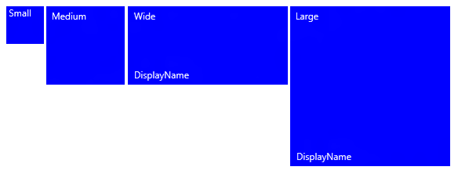
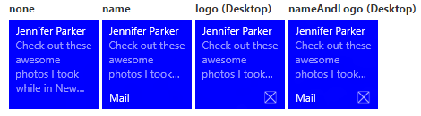
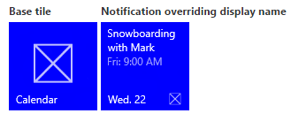
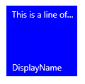
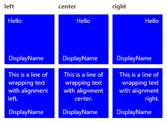
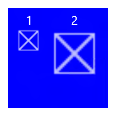
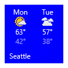

# Crear iconos adaptables


Las plantillas de iconos adaptables son una nueva característica de Windows 10, que te permite diseñar tu propio contenido de notificación de icono con un lenguaje de marcado sencillo y flexible que se adapta a diferentes densidades de pantalla. En este artículo se explica cómo crear iconos dinámicos adaptables para la aplicación Plataforma universal de Windows (UWP). Para obtener la lista completa de atributos y elementos adaptables, consulta el [Esquema de iconos adaptables](tiles-and-notifications-adaptive-tiles-schema.md).

(Si quieres, puedes seguir usando las plantillas preestablecidas del [catálogo de plantillas de iconos de Windows 8](https://msdn.microsoft.com/library/windows/apps/hh761491) al diseñar las notificaciones para Windows 10.)

## <span id="Getting_started"></span><span id="getting_started"></span><span id="GETTING_STARTED"></span>Introducción


**Instala NotificationsExtensions.** Si quieres usar C# en lugar de XML para generar notificaciones, instala el paquete de NuGet denominado [NotificationsExtensions](https://github.com/WindowsNotifications/NotificationsExtensions/wiki). Las muestras de C# que se proporcionan en este artículo usan NotificationsExtensions.

**Instala Notifications Visualizer** Al igual que la vista de editor o de diseño XAML de Visual Studio, esta aplicación para UWP gratuita te ayuda a diseñar iconos dinámicos adaptables proporcionando una vista previa visual instantánea del icono a medida que lo editas. Puedes leer [esta entrada de blog](http://blogs.msdn.com/b/tiles_and_toasts/archive/2015/09/22/introducing-notifications-visualizer-for-windows-10.aspx) para obtener más información y puedes descargar Notifications Visualizer [aquí](https://www.microsoft.com/store/apps/notifications-visualizer/9nblggh5xsl1).

## <span id="Usage_guidance"></span><span id="usage_guidance"></span><span id="USAGE_GUIDANCE"></span>Guía de uso


Las plantillas adaptables están diseñadas para funcionar en diferentes factores de forma y tipos de notificación. Los elementos, como el grupo y el subgrupo, vinculan entre sí el contenido y no implican un comportamiento visual determinado de forma indiscriminada. El aspecto final de una notificación debe basarse en el dispositivo específico en el que se va a mostrar, ya sea un teléfono, una tableta, un equipo de escritorio u otro dispositivo.

Las sugerencias son atributos opcionales que se pueden agregar a los elementos con el fin de lograr un comportamiento visual específico. Las sugerencias pueden ser específicas de un dispositivo o de una notificación.

## <span id="A_basic_example"></span><span id="a_basic_example"></span><span id="A_BASIC_EXAMPLE"></span>Un ejemplo básico


En este ejemplo se muestra lo que pueden generar las plantillas de iconos adaptables.

```XML
<tile>
  <visual>
  
    <binding template="TileMedium">
      ...
    </binding>
  
    <binding template="TileWide">
      <text hint-style="subtitle">Jennifer Parker</text>
      <text hint-style="captionSubtle">Photos from our trip</text>
      <text hint-style="captionSubtle">Check out these awesome photos I took while in New Zealand!</text>
    </binding>
  
    <binding template="TileLarge">
      ...
    </binding>
  
  </visual>
</tile>
```

```CSharp
TileContent content = new TileContent()
{
    Visual = new TileVisual()
    {
        TileMedium = ...
  
        TileWide = new TileBinding()
        {
            Content = new TileBindingContentAdaptive()
            {
                Children =
                {
                    new TileText()
                    {
                        Text = "Jennifer Parker",
                        Style = TileTextStyle.Subtitle
                    },
  
                    new TileText()
                    {
                        Text = "Photos from our trip",
                        Style = TileTextStyle.CaptionSubtle
                    },
  
                    new TileText()
                    {
                        Text = "Check out these awesome photos I took while in New Zealand!",
                        Style = TileTextStyle.CaptionSubtle
                    }
                }
            }
        },
  
        TileLarge = ...
    }
};
```

**Resultado:**


## <span id="Tile_sizes"></span><span id="tile_sizes"></span><span id="TILE_SIZES"></span>Tamaños de iconos


El contenido para cada tamaño de icono se especifica de forma individual en diferentes elementos [&lt;binding&gt;](tiles-and-notifications-adaptive-tiles-schema.md) dentro de la carga XML. Elige el tamaño de destino estableciendo el atributo de plantilla a uno de los siguientes valores:

-   TileSmall
-   TileMedium
-   TileWide
-   TileLarge (solo para equipos de escritorio)

Para una única carga XML de notificaciones de icono, proporciona elementos &lt;binding&gt; para cada tamaño de icono que quieras admitir, tal como se muestra en este ejemplo:

```XML
<tile>
  <visual>
  
    <binding template="TileSmall">
      <text>Small</text>
    </binding>
  
    <binding template="TileMedium">
      <text>Medium</text>
    </binding>
  
    <binding template="TileWide">
      <text>Wide</text>
    </binding>
  
    <binding template="TileLarge">
      <text>Large</text>
    </binding>
  
  </visual>
</tile>
```

```CSharp
TileContent content = new TileContent()
{
    Visual = new TileVisual()
    {
        TileSmall = new TileBinding()
        {
            Content = new TileBindingContentAdaptive()
            {
                Children =
                {
                    new TileText() { Text = "Small" }
                }
            }
        },
  
        TileMedium = new TileBinding()
        {
            Content = new TileBindingContentAdaptive()
            {
                Children =
                {
                    new TileText() { Text = "Medium" }
                }
            }
        },
  
        TileWide = new TileBinding()
        {
            Content = new TileBindingContentAdaptive()
            {
                Children =
                {
                    new TileText() { Text = "Wide" }
                }
            }
        },
  
        TileLarge = new TileBinding()
        {
            Content = new TileBindingContentAdaptive()
            {
                Children =
                {
                    new TileText() { Text = "Large" }
                }
            }
        }
    }
};
```

**Resultado:**



## <span id="Branding"></span><span id="branding"></span><span id="BRANDING"></span>Personalización de marca


Puedes controlar la personalización de marca en la parte inferior de un icono dinámico (el nombre para mostrar y el logotipo de esquina) mediante el atributo de personalización de marca de la carga de notificación. Puedes elegir mostrar "none", solo "name", solo "logo" o ambos con "nameAndLogo".

**Nota** Windows Phone no admite el logotipo de esquina, por lo que "logo" y "nameAndLogo" se definen de manera predeterminada en "name" en el teléfono.

 

```XML
<visual branding="logo">
  ...
</visual>
```

```CSharp
new TileVisual()
{
    Branding = TileBranding.Logo,
    ...
}

new TileVisual()
{
    Branding = TileBranding.Logo,
    ...
}
```

**Resultado:**



La personalización de marca se puede aplicar para determinados tamaños de iconos. Puedes hacerlo de dos formas:

1. Mediante la aplicación del atributo en el elemento [&lt;binding&gt;](tiles-and-notifications-adaptive-tiles-schema.md).
2. Mediante la aplicación del atributo en el elemento [&lt;visual&gt;](tiles-and-notifications-adaptive-tiles-schema.md), que afecta a toda la carga de notificaciones. Si no especificas la personalización de marca de un enlace, se usará la personalización de marca que se proporciona en el elemento visual.

```XML
<tile>
  <visual branding="nameAndLogo">
 
    <binding template="TileMedium" branding="logo">
      ...
    </binding>
 
    <!--Inherits branding from visual-->
    <binding template="TileWide">
      ...
    </binding>
 
  </visual>
</tile>
```

```CSharp
TileContent content = new TileContent()
{
    Visual = new TileVisual()
    {
        Branding = TileBranding.NameAndLogo,
 
        TileMedium = new TileBinding()
        {
            Branding = TileBranding.Logo,
            ...
        },
 
        // Inherits branding from Visual
        TileWide = new TileBinding()
        {
            ...
        }
    }
};
```

**Resultado predeterminado de la personalización de marca:**


Si no especificas la personalización de marca en la carga de notificaciones, las propiedades del icono base determinarán la personalización de marca. Si en el icono base se muestra el nombre para mostrar, a continuación, la personalización de marca se definirá de manera predeterminada en "name". De lo contrario, la personalización de marca se definirá de manera predeterminada en "none" si no se muestra el nombre para mostrar.

**Nota** Este es un cambio de Windows 8.x, en el que la personalización de marca predeterminada era "logo".

 

## <span id="Display_name"></span><span id="display_name"></span><span id="DISPLAY_NAME"></span>Nombre para mostrar


Puedes invalidar el nombre para mostrar de una notificación escribiendo la cadena de texto que quieras con el atributo **displayName**. Al igual que con la personalización de marca, puedes especificar esto en el elemento [&lt;visual&gt;](tiles-and-notifications-adaptive-tiles-schema.md), que afecta a toda la carga de notificaciones, o en el elemento [&lt;binding&gt;](tiles-and-notifications-adaptive-tiles-schema.md), que solo afecta a iconos individuales.

```XML
<tile>
  <visual branding="nameAndLogo" displayName="Wednesday 22">
 
    <binding template="TileMedium" displayName="Wed. 22">
      ...
    </binding>
 
    <!--Inherits displayName from visual-->
    <binding template="TileWide">
      ...
    </binding>
 
  </visual>
</tile>
```

```CSharp
TileContent content = new TileContent()
{
    Visual = new TileVisual()
    {
        Branding = TileBranding.NameAndLogo,
        DisplayName = "Wednesday 22",
 
        TileMedium = new TileBinding()
        {
            DisplayName = "Wed. 22",
            ...
        },
 
        // Inherits DisplayName from Visual
        TileWide = new TileBinding()
        {
            ...
        }
    }
};
```

**Resultado:**



## <span id="Text"></span><span id="text"></span><span id="TEXT"></span>Texto


El elemento [&lt;text&gt;](tiles-and-notifications-adaptive-tiles-schema.md) se usa para mostrar texto. Puedes usar sugerencias para modificar la apariencia del texto.

```XML
<text>This is a line of text</text></code></pre></td>
</tr>
</tbody>
</table>
```

<span codelanguage="CSharp"></span>
```CSharp
<colgroup>
<col width="100%" />
</colgroup>
<thead>
<tr class="header">
<th align="left">C#</th>
</tr>
</thead>
<tbody>
<tr class="odd">
new TileText()
{
    Text = "This is a line of text"
};
```

**Resultado:**



## <span id="Text_wrapping"></span><span id="text_wrapping"></span><span id="TEXT_WRAPPING"></span>Ajuste de texto


De manera predeterminada, el texto no se ajusta y continuará fuera del borde de la ventana. Usa el atributo **hint-wrap** para establecer el ajuste de texto en un elemento de texto. También puedes controlar el número mínimo y máximo de líneas mediante **hint-minLines** y **hint-maxLines**, que aceptan enteros positivos.

```XML
<text hint-wrap="true">This is a line of wrapping text</text></code></pre></td>
</tr>
</tbody>
</table>
```

<span codelanguage="CSharp"></span>
```CSharp
<colgroup>
<col width="100%" />
</colgroup>
<thead>
<tr class="header">
<th align="left">C#</th>
</tr>
</thead>
<tbody>
<tr class="odd">
new TileText()
{
    Text = "This is a line of wrapping text",
    Wrap = true
};
```

**Resultado:**


## <span id="Text_styles"></span><span id="text_styles"></span><span id="TEXT_STYLES"></span>Estilos de texto


Los estilos controlan el tamaño de fuente, el color y el espesor de los elementos de texto. Hay una serie de estilos disponibles, así como una variación "sutil" de cada estilo que establece la opacidad al 60 % y que, por lo general, hace que el color del texto tenga un tono gris claro.

```XML
<text hint-style="base">Header content</text>
<text hint-style="captionSubtle">Subheader content</text>
```

```CSharp
new TileText()
{
    Text = "Header content",
    Style = TileTextStyle.Base
},
 
new TileText()
{
    Text = "Subheader content",
    Style = TileTextStyle.CaptionSubtle
}
```

**Resultado:**


**Nota** El estilo se define de manera predeterminada en subtítulo si no se especifica ninguna sugerencia de estilo.

 

**Estilos de texto básicos**

|                                |                           |             |
|--------------------------------|---------------------------|-------------|
| &lt;text hint-style="\*" /&gt; | Alto de fuente               | Espesor de la fuente |
| subtítulo                        | 12 píxeles efectivos (epx) | Regular     |
| body                           | 15 epx                    | Regular     |
| base                           | 15 epx                    | Semibold    |
| subtitle                       | 20 epx                    | Regular     |
| title                          | 24 epx                    | Semilight   |
| subheader                      | 34 epx                    | Light       |
| header                         | 46 epx                    | Light       |

 

**Variaciones de estilo de texto numérico**

Estas variaciones reducen el alto de línea para que el contenido de la parte superior e inferior se aproxime más al texto.

|                  |
|------------------|
| titleNumeral     |
| subheaderNumeral |
| headerNumeral    |

 

**Variaciones de estilo de texto sutiles**

Cada estilo tiene una variación sutil que proporciona al texto una opacidad del 60 % que, por lo general, hace que el color del texto tenga un tono gris claro.

|                        |
|------------------------|
| captionSubtle          |
| bodySubtle             |
| baseSubtle             |
| subtitleSubtle         |
| titleSubtle            |
| titleNumeralSubtle     |
| subheaderSubtle        |
| subheaderNumeralSubtle |
| headerSubtle           |
| headerNumeralSubtle    |

 

## <span id="Text_alignment"></span><span id="text_alignment"></span><span id="TEXT_ALIGNMENT"></span>Alineación del texto


El texto se puede ser alinear de forma horizontal a la izquierda, al centro o a la derecha. En el caso de los idiomas que se escriben de izquierda a derecha, como el inglés, el texto se alinea de manera predeterminada a la izquierda. En el caso de los idiomas que se escriben de derecha a izquierda, como el árabe, el texto se alinea de manera predeterminada a la derecha. Puedes establecer la alineación manualmente mediante el atributo **hint-align** en los elementos.

```XML
<text hint-align="center">Hello</text></code></pre></td>
</tr>
</tbody>
</table>
```

<span codelanguage="CSharp"></span>
```CSharp
<colgroup>
<col width="100%" />
</colgroup>
<thead>
<tr class="header">
<th align="left">C#</th>
</tr>
</thead>
<tbody>
<tr class="odd">
new TileText()
{
    Text = "Hello",
    Align = TileTextAlign.Center
};
```

**Resultado:**



## <span id="Groups_and_subgroups"></span><span id="groups_and_subgroups"></span><span id="GROUPS_AND_SUBGROUPS"></span>Grupos y subgrupos


Los grupos permiten declarar semánticamente que el contenido dentro del grupo está relacionado y debe mostrarse en su totalidad para que el contenido tenga sentido. Por ejemplo, puede que tengas dos elementos de texto, un encabezado y un subencabezado, y no tendría sentido que solo se mostrara el encabezado. Al agrupar estos elementos dentro de un subgrupo, se mostrarán todos los elementos (si caben) o no se mostrará ninguno (si no caben).

Con el fin de obtener la mejor experiencia en los dispositivos y las pantallas, proporciona varios grupos. El hecho de tener varios grupos permite que el icono se adapte a las pantallas más grandes.

**Nota** El único elemento secundario válido de un grupo es un subgrupo.

 

```XML
...
<binding template="TileWide" branding="nameAndLogo">
  <group>
    <subgroup>
      <text hint-style="subtitle">Jennifer Parker</text>
      <text hint-style="captionSubtle">Photos from our trip</text>
      <text hint-style="captionSubtle">Check out these awesome photos I took while in New Zealand!</text>
    </subgroup>
  </group>
 
  <text />
 
  <group>
    <subgroup>
      <text hint-style="subtitle">Steve Bosniak</text>
      <text hint-style="captionSubtle">Build 2015 Dinner</text>
      <text hint-style="captionSubtle">Want to go out for dinner after Build tonight?</text>
    </subgroup>
  </group>
</binding>
...
```

```CSharp
...
 
TileWide = new TileBinding()
{
    Branding = TileBranding.NameAndLogo,
    Content = new TileBindingContentAdaptive()
    {
        Children =
        {
            CreateGroup(
                from: "Jennifer Parker",
                subject: "Photos from our trip",
                body: "Check out these awesome photos I took while in New Zealand!"),
 
            // For spacing
            new TileText(),
 
            CreateGroup(
                from: "Steve Bosniak",
                subject: "Build 2015 Dinner",
                body: "Want to go out for dinner after Build tonight?")
        }
    }
}
 
...
 
 
private static TileGroup CreateGroup(string from, string subject, string body)
{
    return new TileGroup()
    {
        Children =
        {
            new TileSubgroup()
            {
                Children =
                {
                    new TileText()
                    {
                        Text = from,
                        Style = TileTextStyle.Subtitle
                    },
 
                    new TileText()
                    {
                        Text = subject,
                        Style = TileTextStyle.CaptionSubtle
                    },
 
                    new TileText()
                    {
                        Text = body,
                        Style = TileTextStyle.CaptionSubtle
                    }
                }
            }
        }
    };
}
```

**Resultado:**


## <span id="Subgroups__columns_"></span><span id="subgroups__columns_"></span><span id="SUBGROUPS__COLUMNS_"></span>Subgrupos (columnas)


Los subgrupos también permiten dividir los datos en secciones semánticas dentro de un grupo. Para los iconos dinámicos, esto se traduce visualmente en columnas.

El atributo **hint-weight** te permite controlar el ancho de las columnas. El valor de **hint-weight** se expresa como una proporción ponderada del espacio disponible, que es idéntica al comportamiento de **GridUnitType.Star**. Las columnas que tienen el mismo ancho, asignan cada espesor en 1.

<table>
<colgroup>
<col width="50%" />
<col width="50%" />
</colgroup>
<tbody>
<tr class="odd">
<td align="left">Sugerencia de espesor</td>
<td align="left">Porcentaje de ancho</td>
</tr>
<tr class="even">
<td align="left">1</td>
<td align="left">25 %</td>
</tr>
<tr class="odd">
<td align="left">1</td>
<td align="left">25 %</td>
</tr>
<tr class="even">
<td align="left">1</td>
<td align="left">25 %</td>
</tr>
<tr class="odd">
<td align="left">1</td>
<td align="left">25 %</td>
</tr>
<tr class="even">
<td align="left">Espesor total: 4</td>
<td align="left"></td>
</tr>
</tbody>
</table>

 


Para hacer que una columna sea dos veces más grande que otra columna, asigna a la columna pequeña un espesor de 1 y a la columna mayor un espesor de 2.

<table>
<colgroup>
<col width="50%" />
<col width="50%" />
</colgroup>
<tbody>
<tr class="odd">
<td align="left">Sugerencia de espesor</td>
<td align="left">Porcentaje de ancho</td>
</tr>
<tr class="even">
<td align="left">1</td>
<td align="left">33,3 %</td>
</tr>
<tr class="odd">
<td align="left">2</td>
<td align="left">66,7 %</td>
</tr>
<tr class="even">
<td align="left">Espesor total: 3</td>
<td align="left"></td>
</tr>
</tbody>
</table>

 



Si quieres que la primera columna ocupe un 20 % del ancho total y que la segunda columna ocupe un 80 % del ancho total, asigna el espesor de la primera en 20 y el de la segunda en 80. Si los valores totales del espesor suman 100, actúan como porcentajes.

<table>
<colgroup>
<col width="50%" />
<col width="50%" />
</colgroup>
<tbody>
<tr class="odd">
<td align="left">Sugerencia de espesor</td>
<td align="left">Porcentaje de ancho</td>
</tr>
<tr class="even">
<td align="left">20</td>
<td align="left">20 %</td>
</tr>
<tr class="odd">
<td align="left">80</td>
<td align="left">80 %</td>
</tr>
<tr class="even">
<td align="left">Espesor total: 100</td>
<td align="left"></td>
</tr>
</tbody>
</table>

 


**Nota** Un margen de 8 píxeles se agrega automáticamente entre las columnas.

 

Cuando tengas más de dos subgrupos, debes especificar **hint-weight**, que solo acepta enteros positivos. Si no especificas ninguna sugerencia de espesor para el primer subgrupo, se le asignará un espesor de 50. Al siguiente subgrupo que no tenga ninguna sugerencia de espesor especificada se le asignará un espesor igual a 100 menos la suma de los espesores anteriores, o de 1 si el resultado es cero. En el caso de los subgrupos restantes que no tengan ninguna sugerencia de espesor especificada, se les asignará un grosor de 1.

Este es un código de ejemplo para un icono de información meteorológica que muestra cómo puedes lograr que un icono tenga cinco columnas con el mismo ancho:

```XML
...
<binding template="TileWide" displayName="Seattle" branding="name">
  <group>
    <subgroup hint-weight="1">
      <text hint-align="center">Mon</text>
      <image src="Assets\Weather\Mostly Cloudy.png" hint-removeMargin="true"/>
      <text hint-align="center">63°</text>
      <text hint-align="center" hint-style="captionsubtle">42°</text>
    </subgroup>
    <subgroup hint-weight="1">
      <text hint-align="center">Tue</text>
      <image src="Assets\Weather\Cloudy.png" hint-removeMargin="true"/>
      <text hint-align="center">57°</text>
      <text hint-align="center" hint-style="captionsubtle">38°</text>
    </subgroup>
    <subgroup hint-weight="1">
      <text hint-align="center">Wed</text>
      <image src="Assets\Weather\Sunny.png" hint-removeMargin="true"/>
      <text hint-align="center">59°</text>
      <text hint-align="center" hint-style="captionsubtle">43°</text>
    </subgroup>
    <subgroup hint-weight="1">
      <text hint-align="center">Thu</text>
      <image src="Assets\Weather\Sunny.png" hint-removeMargin="true"/>
      <text hint-align="center">62°</text>
      <text hint-align="center" hint-style="captionsubtle">42°</text>
    </subgroup>
    <subgroup hint-weight="1">
      <text hint-align="center">Fri</text>
      <image src="Assets\Weather\Sunny.png" hint-removeMargin="true"/>
      <text hint-align="center">71°</text>
      <text hint-align="center" hint-style="captionsubtle">66°</text>
    </subgroup>
  </group>
</binding>
...
```

```CSharp
...
TileWide = new TileBinding()
{
    DisplayName = "Seattle",
    Branding = TileBranding.Name,
    Content = new TileBindingContentAdaptive()
    {
        Children =
        {
            new TileGroup()
            {
                Children =
                {
                    CreateSubgroup("Mon", "Mostly Cloudy.png", "63°", "42°"),
 
                    CreateSubgroup("Tue", "Cloudy.png", "57°", "38°"),
 
                    CreateSubgroup("Wed", "Sunny.png", "59°", "43°"),
 
                    CreateSubgroup("Thu", "Sunny.png", "62°", "42°"),
 
                    CreateSubgroup("Fri", "Sunny.png", "71°", "66°")
                }
            }
        }
    }
}
...
 
 
private static TileSubgroup CreateSubgroup(string day, string image, string highTemp, string lowTemp)
{
    return new TileSubgroup()
    {
        Weight = 1,
 
        Children =
        {
            new TileText()
            {
                Text = day,
                Align = TileTextAlign.Center
            },
 
            new TileImage()
            {
                Source = new TileImageSource("Assets/Weather/" + image),
                RemoveMargin = true
            },
 
            new TileText()
            {
                Text = highTemp,
                Align = TileTextAlign.Center
            },
 
            new TileText()
            {
                Text = lowTemp,
                Align = TileTextAlign.Center,
                Style = TileTextStyle.CaptionSubtle
            }
        }
    };
}
```

**Resultado:**


## <span id="Images"></span><span id="images"></span><span id="IMAGES"></span>Imágenes


El elemento &lt;image&gt; se usa para mostrar imágenes en la notificación de icono. Las imágenes pueden colocarse alineadas dentro del contenido del icono (valor predeterminado), como una imagen de fondo detrás del contenido o como una animación de imagen que aparezca desde la parte superior de la notificación.

**Nota** Hay [restricciones en el tamaño del archivo y en las dimensiones de las imágenes](https://msdn.microsoft.com/library/windows/apps/hh781198).

 

Si no se especifica ningún comportamiento adicional, las imágenes se reducirán o expandirán uniformemente para rellenar el ancho disponible. En el siguiente ejemplo se muestra un icono con dos columnas e imágenes alineadas. Las imágenes alineadas se ajustan para rellenar el ancho de la columna.

```XML
...
<binding template="TileMedium" displayName="Seattle" branding="name">
  <group>
    <subgroup>
      <text hint-align="center">Mon</text>
      <image src="Assets\Apps\Weather\Mostly Cloudy.png" hint-removeMargin="true"/>
      <text hint-align="center">63°</text>
      <text hint-style="captionsubtle" hint-align="center">42°</text>
    </subgroup>
    <subgroup>
      <text hint-align="center">Tue</text>
      <image src="Assets\Apps\Weather\Cloudy.png" hint-removeMargin="true"/>
      <text hint-align="center">57°</text>
      <text hint-style="captionSubtle" hint-align="center">38°</text>
    </subgroup>
  </group>
</binding>
...
```

```CSharp
...
TileMedium = new TileBinding()
{
    DisplayName = "Seattle",
    Branding = TileBranding.Name,
    Content = new TileBindingContentAdaptive()
    {
        Children =
        {
            new TileGroup()
            {
                Children =
                {
                    CreateSubgroup("Mon", "Mostly Cloudy.png", "63°", "42°"),
 
                    CreateSubgroup("Tue", "Cloudy.png", "57°", "38°")
                }
            }
        }
    }
}
...
 
 
private static TileSubgroup CreateSubgroup(string day, string image, string highTemp, string lowTemp)
{
    return new TileSubgroup()
    {
        Children =
        {
            new TileText()
            {
                Text = day,
                Align = TileTextAlign.Center
            },
 
            new TileImage()
            {
                Source = new TileImageSource("Assets/Weather/" + image),
                RemoveMargin = true
            },
 
            new TileText()
            {
                Text = highTemp,
                Align = TileTextAlign.Center
            },
 
            new TileText()
            {
                Text = lowTemp,
                Align = TileTextAlign.Center,
                Style = TileTextStyle.CaptionSubtle
            }
        }
    };
}
```

**Resultado:**



Las imágenes colocadas en la raíz del elemento &lt;binding&gt;, o en el primer grupo, también se ampliarán para ajustarse al alto disponible.

### <span id="Image_alignment"></span><span id="image_alignment"></span><span id="IMAGE_ALIGNMENT"></span>Alineación de la imagen

Las imágenes se pueden configurar para que se alineen a la izquierda, al centro o a la derecha con el atributo **hint-align**. Esto también hará que las imágenes se muestren en su resolución nativa en lugar de ampliarse para rellenar el ancho.

```XML
...
<binding template="TileLarge">
  <image src="Assets/fable.jpg" hint-align="center"/>
</binding>
...
```

```CSharp
...
TileLarge = new TileBinding()
{
    Content = new TileBindingContentAdaptive()
    {
        Children =
        {
            new TileImage()
            {
                Source = new TileImageSource("Assets/fable.jpg"),
                Align = TileImageAlign.Center
            }
        }
    }
}
...
```

**Resultado:**


### <span id="Image_margins"></span><span id="image_margins"></span><span id="IMAGE_MARGINS"></span>Márgenes de la imagen

De forma predeterminada, las imágenes alineadas tienen un margen de 8 píxeles entre cualquier contenido de la parte superior e inferior de la imagen. Este margen puede quitarse mediante el atributo **hint-removeMargin** de la imagen. Sin embargo, las imágenes siempre mantienen el margen de 8 píxeles desde el borde del icono, y los subgrupos (columnas) siempre mantienen el espaciado interno de 8 píxeles entre las columnas.

```XML
...
<binding template="TileMedium" branding="none">
  <group>
    <subgroup>
      <text hint-align="center">Mon</text>
      <image src="Assets\Numbers\4.jpg" hint-removeMargin="true"/>
      <text hint-align="center">63°</text>
      <text hint-style="captionsubtle" hint-align="center">42°</text>
    </subgroup>
    <subgroup>
      <text hint-align="center">Tue</text>
      <image src="Assets\Numbers\3.jpg" hint-removeMargin="true"/>
      <text hint-align="center">57°</text>
      <text hint-style="captionsubtle" hint-align="center">38°</text>
    </subgroup>
  </group>
</binding>
...
```

```CSharp
...
 
TileMedium = new TileBinding()
{
    Branding = TileBranding.None,
    Content = new TileBindingContentAdaptive()
    {
        Children =
        {
            new TileGroup()
            {
                Children =
                {
                    CreateSubgroup("Mon", "4.jpg", "63°", "42°"),
 
                    CreateSubgroup("Tue", "3.jpg", "57°", "38°")
                }
            }
        }
    }
}
 
...
 
 
private static TileSubgroup CreateSubgroup(string day, string image, string highTemp, string lowTemp)
{
    return new TileSubgroup()
    {
        Weight = 1,
 
        Children =
        {
            new TileText()
            {
                Text = day,
                Align = TileTextAlign.Center
            },
 
            new TileImage()
            {
                Source = new TileImageSource("Assets/Numbers/" + image),
                RemoveMargin = true
            },
 
            new TileText()
            {
                Text = highTemp,
                Align = TileTextAlign.Center
            },
 
            new TileText()
            {
                Text = lowTemp,
                Align = TileTextAlign.Center,
                Style = TileTextStyle.CaptionSubtle
            }
        }
    };
}
```


### <span id="Image_cropping"></span><span id="image_cropping"></span><span id="IMAGE_CROPPING"></span>Recorte de imagen

Las imágenes se pueden recortar en forma de círculo mediante el atributo **hint-crop**, que actualmente solo admite valores "none" (valor predeterminado) o "circle".

```XML
...
<binding template="TileLarge" hint-textStacking="center">
  <group>
    <subgroup hint-weight="1"/>
    <subgroup hint-weight="2">
      <image src="Assets/Apps/Hipstame/hipster.jpg" hint-crop="circle"/>
    </subgroup>
    <subgroup hint-weight="1"/>
  </group>
 
  <text hint-style="title" hint-align="center">Hi,</text>
  <text hint-style="subtitleSubtle" hint-align="center">MasterHip</text>
</binding>
...
```

```CSharp
...
TileLarge = new TileBinding()
{
    Content = new TileBindingContentAdaptive()
    {
        TextStacking = TileTextStacking.Center,
 
        Children =
        {
            new TileGroup()
            {
                Children =
                {
                    new TileSubgroup() { Weight = 1 },
 
                    new TileSubgroup()
                    {
                        Weight = 2,
                        Children =
                        {
                            new TileImage()
                            {
                                Source = new TileImageSource("Assets/Apps/Hipstame/hipster.jpg"),
                                Crop = TileImageCrop.Circle
                            }
                        }
                    },
 
                    new TileSubgroup() { Weight = 1 }
                }
            },
 
 
            new TileText()
            {
                Text = "Hi,",
                Style = TileTextStyle.Title,
                Align = TileTextAlign.Center
            },
 
            new TileText()
            {
                Text = "MasterHip",
                Style = TileTextStyle.SubtitleSubtle,
                Align = TileTextAlign.Center
            }
        }
    }
}
...
```

**Resultado:**


### <span id="Background_image"></span><span id="background_image"></span><span id="BACKGROUND_IMAGE"></span>Imagen de fondo

Para establecer una imagen de fondo, coloca un elemento de imagen en la raíz del elemento &lt;binding&gt; y establece el atributo de ubicación en "background".

```XML
...
<binding template="TileWide">
  <image src="Assets\Mostly Cloudy-Background.jpg" placement="background"/>
  <group>
    <subgroup hint-weight="1">
      <text hint-align="center">Mon</text>
      <image src="Assets\Weather\Mostly Cloudy.png" hint-removeMargin="true"/>
      <text hint-align="center">63°</text>
      <text hint-align="center" hint-style="captionsubtle">42°</text>
    </subgroup>
    ...
  </group>
</binding>
...
```

```CSharp
...
TileWide = new TileBinding()
{
    Content = new TileBindingContentAdaptive()
    {
        BackgroundImage = new TileBackgroundImage()
        {
            Source = new TileImageSource("Assets/Mostly Cloudy-Background.jpg")
        },
 
        Children =
        {
            new TileGroup()
            {
                Children =
                {
                    CreateSubgroup("Mon", "Mostly Cloudy.png", "63°", "42°")
                    ...
                }
            }
        }
    }
}
...
 
 
private static TileSubgroup CreateSubgroup(string day, string image, string highTemp, string lowTemp)
{
    return new TileSubgroup()
    {
        Weight = 1,
 
        Children =
        {
            new TileText()
            {
                Text = day,
                Align = TileTextAlign.Center
            },
 
            new TileImage()
            {
                Source = new TileImageSource("Assets/Weather/" + image),
                RemoveMargin = true
            },
 
            new TileText()
            {
                Text = highTemp,
                Align = TileTextAlign.Center
            },
 
            new TileText()
            {
                Text = lowTemp,
                Align = TileTextAlign.Center,
                Style = TileTextStyle.CaptionSubtle
            }
        }
    };
}
```

**Resultado:**


Además, puedes establecer una superposición negra en la imagen de fondo con **hint-overlay**, que acepta valores enteros de 0 a 100, en los que 0 no supone ninguna superposición y 100 es una superposición completa de color negro. El valor predeterminado es 20.

```XML
...
<binding template="TileWide" hint-overlay="60">
  <image src="Assets\Mostly Cloudy-Background.jpg" placement="background"/>
  ...
</binding>
...
```

```CSharp
...
 
TileWide = new TileBinding()
{
    Content = new TileBindingContentAdaptive()
    {
        BackgroundImage = new TileBackgroundImage()
        {
            Source = new TileImageSource("Assets/Mostly Cloudy-Background.jpg"),
            Overlay = 60
        },
 
        ...
    }
}
 
...
```

**Resultado de la sugerencia de superposición:**


### <span id="Peek_image"></span><span id="peek_image"></span><span id="PEEK_IMAGE"></span>Imagen que aparece

Puedes especificar una imagen que "aparezca" desde la parte superior del icono. La imagen que aparece usa una animación para bajar y subir desde la parte superior del icono, detenerse para que se pueda leer y, a continuación, volver a deslizarse para desaparecer y así mostrar el contenido principal del icono. Para establecer una imagen que aparece, coloca un elemento de imagen en la raíz del elemento &lt;binding&gt; y establece el atributo de ubicación en "peek".

```XML
...
<binding template="TileMedium" branding="name">
  <image placement="peek" src="Assets/Apps/Hipstame/hipster.jpg"/>
  <text>New Message</text>
  <text hint-style="captionsubtle" hint-wrap="true">Hey, have you tried Windows 10 yet?</text>
</binding>
...
```

```CSharp
...
 
TileWide = new TileBinding()
{
    Branding = TileBranding.Name,
 
    Content = new TileBindingContentAdaptive()
    {
        PeekImage = new TilePeekImage()
        {
            Source = new TileImageSource("Assets/Apps/Hipstame/hipster.jpg")
        },
 
        Children =
        {
            new TileText()
            {
                Text = "New Message"
            },
 
            new TileText()
            {
                Text = "Hey, have you tried Windows 10 yet?",
                Style = TileTextStyle.CaptionSubtle,
                Wrap = true
            }
        }
    }
}
 
...
```


**Recorte por círculo para imágenes que aparecen e imágenes de fondo**

Usa el siguiente atributo en imágenes que aparecen e imágenes de fondo para hacer un recorte por círculo:

hint-crop="circle"

El resultado tendrá el siguiente aspecto:


**Usar una imagen que aparece y una imagen de fondo al mismo tiempo**

Para usar tanto una imagen que aparece como una imagen de fondo en una notificación de icono, especifica una imagen que aparece y una imagen de fondo en la carga de notificación.

El resultado tendrá el siguiente aspecto:


**Usar el atributo hint-overlay en una imagen que aparece**

Puedes usar **hint-overlay** en una imagen que aparece para agregar opacidad y hacer más legible el nombre para mostrar del icono. Si especificas **hint-overlay** en el elemento &lt;binding&gt;, la superposición se aplicará tanto en la imagen que aparece como en la imagen de fondo.

También puedes aplicar el atributo **hint-overlay** a un elemento &lt;image&gt; con el valor placement="peek" o placement="background" para establecer niveles de opacidad discretos para cada una de esas imágenes. Si no especificas una superposición, el valor predeterminado de la opacidad de la imagen de fondo será 20 % y el de la imagen que aparece será 0 %.

En este ejemplo se muestra una imagen de fondo con una opacidad del 20 % (izquierda) y una opacidad del 0 % (derecha):


## <span id="Vertical_alignment__text_stacking_"></span><span id="vertical_alignment__text_stacking_"></span><span id="VERTICAL_ALIGNMENT__TEXT_STACKING_"></span>Alineación vertical (apilamiento de texto)


Puedes controlar la alineación vertical del contenido del icono mediante el atributo **hint-textStacking** en el elemento [&lt;binding&gt;](tiles-and-notifications-adaptive-tiles-schema.md) y el elemento [&lt;subgroup&gt;](tiles-and-notifications-adaptive-tiles-schema.md). De manera predeterminada, todo el contenido se alinea de forma vertical en la parte superior, pero también puedes alinear contenido en la parte inferior o en el centro.

### <span id="Text_stacking_on_binding_element"></span><span id="text_stacking_on_binding_element"></span><span id="TEXT_STACKING_ON_BINDING_ELEMENT"></span>Apilamiento de texto en el elemento binding

Cuando se aplica al nivel [&lt;binding&gt;](tiles-and-notifications-adaptive-tiles-schema.md), el apilamiento de texto define la alineación vertical de todo el contenido de la notificación y se alinea en el espacio vertical disponible por encima del área de notificación o la personalización de marca.

```XML
...
<binding template="TileMedium" hint-textStacking="center" branding="logo">
  <text hint-style="base" hint-align="center">Hi,</text>
  <text hint-style="captionSubtle" hint-align="center">MasterHip</text>
</binding>
...
```

```CSharp
...
 
TileMedium = new TileBinding()
{
    Branding = TileBranding.Logo,
 
    Content = new TileBindingContentAdaptive()
    {
        TextStacking = TileTextStacking.Center,
 
        Children =
        {
            new TileText()
            {
                Text = "Hi,",
                Style = TileTextStyle.Base,
                Align = TileTextAlign.Center
            },
 
            new TileText()
            {
                Text = "MasterHip",
                Style = TileTextStyle.CaptionSubtle,
                Align = TileTextAlign.Center
            }
        }
    }
}
 
...
```


### <span id="Text_stacking_on_subgroup_element"></span><span id="text_stacking_on_subgroup_element"></span><span id="TEXT_STACKING_ON_SUBGROUP_ELEMENT"></span>Apilamiento de texto en el elemento subgroup

Cuando se aplica al nivel [&lt;subgroup&gt;](tiles-and-notifications-adaptive-tiles-schema.md), el apilamiento de texto define la alineación vertical del contenido del subgrupo (columna) y se alinea en el espacio vertical disponible en todo el grupo.

```XML
...
<binding template="TileWide" branding="nameAndLogo">
  <group>
    <subgroup hint-weight="33">
      <image src="Assets/Apps/Hipstame/hipster.jpg" hint-crop="circle"/>
    </subgroup>
    <subgroup hint-textStacking="center">
      <text hint-style="subtitle">Hi,</text>
      <text hint-style="bodySubtle">MasterHip</text>
    </subgroup>
  </group>
</binding>
...
```

```CSharp
...
 
TileWide = new TileBinding()
{
    Branding = TileBranding.NameAndLogo,
 
    Content = new TileBindingContentAdaptive()
    {
        Children =
        {
            new TileGroup()
            {
                Children =
                {
                    // Image column
                    new TileSubgroup()
                    {
                        Weight = 33,
                        Children =
                        {
                            new TileImage()
                            {
                                Source = new TileImageSource("Assets/Apps/Hipstame/hipster.jpg"),
                                Crop = TileImageCrop.Circle
                            }
                        }
                    },
 
                    // Text column
                    new TileSubgroup()
                    {
                        // Vertical align its contents
                        TextStacking = TileTextStacking.Center,
 
                        Children =
                        {
                            new TileText()
                            {
                                Text = "Hi,",
                                Style = TileTextStyle.Subtitle
                            },
 
                            new TileText()
                            {
                                Text = "MasterHip",
                                Style = TileTextStyle.BodySubtle
                            }
                        }
                    }
                }
            }
        }
    }
}
 
...
```

## <span id="related_topics"></span>Temas relacionados


* [Esquema de iconos adaptables](tiles-and-notifications-adaptive-tiles-schema.md)
* [NotificationsExtensions en GitHub](https://github.com/WindowsNotifications/NotificationsExtensions/wiki)
* [Catálogo de plantillas de iconos especiales](tiles-and-notifications-special-tile-templates-catalog.md)
 

 


<!--HONumber=May16_HO2-->


