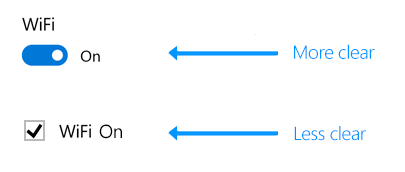
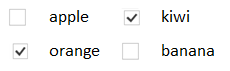

# Modificadores para alternar

El modificador para alternar representa un conmutador físico que permite a los usuarios activar o desactivar opciones. Usa los controles **ToggleSwitch** para presentar a los usuarios exactamente dos opciones que se excluyan mutuamente (como activar/desactivar). Cuando elijan una opción, se desencadenará una acción inmediata.

<span class="sidebar_heading" style="font-weight: bold;">API importantes</span>

-   [**Clase ToggleSwitch**](https://msdn.microsoft.com/library/windows/apps/windows.ui.xaml.controls.toggleswitch.aspx)
-   [**Propiedad IsOn**](https://msdn.microsoft.com/library/windows/apps/windows.ui.xaml.controls.toggleswitch.ison.aspx)
-   [**Evento Toggled**](https://msdn.microsoft.com/library/windows/apps/windows.ui.xaml.controls.toggleswitch.toggled.aspx)

## ¿Es este el control adecuado?

Usa un modificador para alternar operaciones binarias que surten efecto inmediatamente después de que el usuario gira el modificador para alternar. Por ejemplo, usa un modificador para alternar para activar o desactivar servicios o componentes de hardware como, por ejemplo, Wi-Fi.


Si un modificador físico funcionaría para la acción, un modificador para alternar es probablemente el mejor control para usar.

Apenas el usuario activa o desactiva el modificador, recomendamos que la acción correspondiente se realice de inmediato.

### Elegir entre un modificador para alternar y una casilla

Para algunas acciones, tanto un modificador para alternar como una casilla podrían ser adecuados. Para decidir qué control funcionará mejor, sigue estas sugerencias:

-   Usa un modificador para alternar con opciones binarias cuando los cambios surten efecto justo después de que el usuario las cambia.

    

    En el ejemplo anterior, queda claro en el caso del modificador para alternar que la conexión inalámbrica está establecida en "Activado". Pero en el caso de la casilla, el usuario tiene que pensar si la conexión inalámbrica está activada ahora o si es necesario marcar la casilla para activarla.

-   Usa una casilla cuando el usuario tiene que realizar algunos pasos más antes de que los cambios surtan efecto. Por ejemplo, si el usuario tiene que hacer clic en un botón "enviar" o "siguiente" para aplicar los cambios, usa una casilla.

    

-   Usa casillas o un [cuadro de lista](lists.md) cuando el usuario pueda seleccionar varios elementos:

    

## Ejemplos

Modificadores para alternar en la configuración general de la aplicación Noticias.


Modificadores para alternar en la configuración del menú Inicio de Windows.


## Crear un modificador para alternar

Aquí te mostramos cómo crear un modificador para alternar sencillo. Este código XAML crea el modificador para alternar Wi-Fi que se mostró anteriormente.

```xaml
<ToggleSwitch x:Name="wiFiToggle" Header="Wifi"/>
```
Aquí te mostramos cómo crear el mismo modificador para alternar en el código.

```csharp
ToggleSwitch wiFiToggle = new ToggleSwitch();
wiFiToggle.Header = "WiFi";

// Add the toggle switch to a parent container in the visual tree.
stackPanel1.Children.Add(wiFiToggle);
```

### IsOn

El modificador puede estar activado o desactivado. Usa la propiedad [**IsOn**](https://msdn.microsoft.com/library/windows/apps/windows.ui.xaml.controls.toggleswitch.ison.aspx) para determinar el estado del modificador. Cuando se usa el modificador para controlar el estado de otra propiedad binaria, puedes usar un enlace como se muestra aquí.

```
<StackPanel Orientation="Horizontal">
    <ToggleSwitch x:Name="ToggleSwitch1" IsOn="True"/>
    <ProgressRing IsActive="{x:Bind ToggleSwitch1.IsOn, Mode=OneWay}" Width="130"/>
</StackPanel>
```

### Toggled

En otros casos, puedes controlar el evento [**Toggled**](https://msdn.microsoft.com/library/windows/apps/windows.ui.xaml.controls.toggleswitch.toggled.aspx) para responder a cambios en el estado.

En este ejemplo se muestra cómo agregar un controlador de eventos Toggled en XAML y en el código. El evento Toggled se controla para activar o desactivar un anillo de progreso y cambiar su visibilidad.

```xaml
<ToggleSwitch x:Name="toggleSwitch1" IsOn="True" 
              Toggled="ToggleSwitch_Toggled"/>
```

Aquí te mostramos cómo crear el mismo modificador para alternar en el código.

```csharp
// Create a new toggle switch and add a Toggled event handler.
ToggleSwitch toggleSwitch1 = new ToggleSwitch();
toggleSwitch1.Toggled += ToggleSwitch_Toggled;

// Add the toggle switch to a parent container in the visual tree.
stackPanel1.Children.Add(toggleSwitch1);
```

Este es el controlador para el evento Toggled.

```csharp
private void ToggleSwitch_Toggled(object sender, RoutedEventArgs e)
{
    ToggleSwitch toggleSwitch = sender as ToggleSwitch;
    if (toggleSwitch != null)
    {
        if (toggleSwitch.IsOn == true)
        {
            progress1.IsActive = true;
            progress1.Visibility = Visibility.Visible;
        }
        else
        {
            progress1.IsActive = false;
            progress1.Visibility = Visibility.Collapsed;
        }
    }
}
```

### Etiquetas On y Off

De forma predeterminada, el modificador para alternar incluye las etiquetas literales On y Off, que se localizan automáticamente. Puedes reemplazar estas etiquetas si configuras las propiedades [**OnContent**](https://msdn.microsoft.com/library/windows/apps/windows.ui.xaml.controls.toggleswitch.oncontent.aspx) y [**OffContent**](https://msdn.microsoft.com/library/windows/apps/windows.ui.xaml.controls.toggleswitch.offcontent.aspx).

En este ejemplo, se reemplazan las etiquetas On/Off con etiquetas Show/Hide.  

```xaml
<ToggleSwitch x:Name="imageToggle" Header="Show images"
              OffContent="Show" OnContent="Hide" 
              Toggled="ToggleSwitch_Toggled"/>
```

También puedes usar contenido más complejo si configuras las propiedades [**OnContentTemplate**](https://msdn.microsoft.com/library/windows/apps/windows.ui.xaml.controls.toggleswitch.oncontenttemplate.aspx) y [**OffContentTemplate**](https://msdn.microsoft.com/library/windows/apps/windows.ui.xaml.controls.toggleswitch.offcontenttemplate.aspx).

## Recomendaciones

-   Sustituye las etiquetas On y Off cuando haya etiquetas más específicas para la opción. Si hay etiquetas cortas (3 o 4 caracteres) que representan opuestos binarios que son más adecuadas para una determinada opción, úsalas. Por ejemplo, podrías usar "Show/Hide" si la opción es "Mostrar imágenes". Usar etiquetas más específicas puede ayudar a localizarlas en la IU.
-   Evita reemplazar las etiquetas On y Off a menos que debas hacerlo; usa las etiquetas predeterminadas a menos que la situación requiera que las personalices.
-   Las etiquetas no deben tener más de 4 caracteres.

## Artículos relacionados

[**ToggleSwitch**](https://msdn.microsoft.com/library/windows/apps/hh701411)
- [Botones de radio](radio-button.md)
- [Modificadores para alternar](toggles.md)
- [Casillas](checkbox.md)

**Para desarrolladores (XAML)**
- [**Clase ToggleSwitch**](https://msdn.microsoft.com/library/windows/apps/br209712)


<!--HONumber=Mar16_HO1-->


