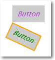
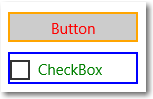

# Estilos XAML

<link rel="stylesheet" href="https://az835927.vo.msecnd.net/sites/uwp/Resources/css/custom.css"> 


El marco XAML te permite personalizar la apariencia de tus aplicaciones de varias maneras. Los estilos te permiten establecer propiedades de control y reusar esa configuración para mantener un aspecto uniforme en varios controles.

## Conceptos básicos de estilos

Los estilos te permiten extraer opciones de configuración de propiedades visuales en recursos reutilizables. Este es un ejemplo que muestra 3 botones con un estilo que establece las propiedades [**BorderBrush**](https://msdn.microsoft.com/library/windows/apps/br209397), [**BorderThickness**](https://msdn.microsoft.com/library/windows/apps/br209399) y [**Primer plano**](https://msdn.microsoft.com/library/windows/apps/br209414). Al aplicar un estilo, puedes hacer que todos los controles tengan el mismo aspecto no tener que establecer estas propiedades en cada control de manera independiente.


Puedes definir un estilo en línea en el lenguaje XAML para un control o como una fuente reutilizable. Define recursos en un archivo XAML de una página individual, en el archivo App.xaml o en un archivo XAML de diccionario de recursos independiente. Varias aplicaciones pueden compartir un mismo archivo XAML de diccionario de recursos y se pueden combinar varios diccionarios de recursos en una sola aplicación. El lugar donde se define el recurso determina el ámbito en el que puede usarse. Los recursos de nivel de página se encuentran disponibles solo en la página donde se definen. Si tanto en App.xaml como en la página se definen con la misma clave, el recurso de la página invalida al recurso de App.xaml. Si un recurso se define en un archivo de diccionario de recursos diferente, su ámbito se determina por el lugar donde se hace referencia al diccionario de recursos.

En la definición de [**Estilo**](https://msdn.microsoft.com/library/windows/apps/br208849), necesitas un atributo [**TargetType**](https://msdn.microsoft.com/library/windows/apps/br208857) y una colección de uno o más elementos [**Establecedores**](https://msdn.microsoft.com/library/windows/apps/br208817). El atributo **TargetType** es una cadena que especifica un tipo [**FrameworkElement**](https://msdn.microsoft.com/library/windows/apps/br208706) para aplicarle el estilo. El valor **TargetType** debe especificar un tipo derivado de **FrameworkElement** definido por Windows Runtime o un tipo personalizado que esté disponible en un ensamblado referido. Si intentas aplicar un estilo a un control y el tipo del control no coincide con el atributo **TargetType** de dicho estilo, se produce una excepción.

Cada elemento [**Establecedor**](https://msdn.microsoft.com/library/windows/apps/br208817) requiere una [**Propiedad**](https://msdn.microsoft.com/library/windows/apps/br208836) y un [**Valor**](https://msdn.microsoft.com/library/windows/apps/br208838). Esta configuración de las propiedades indica a qué propiedades del control se aplica la configuración, y el valor que se fija para esa propiedad. Puedes establecer **Setter.Value** con sintaxis de atributo o elemento de propiedad. El XAML muestra el estilo que se aplica a los botones que se mostraron anteriormente. En este XAML, los dos primeros elementos **Establecedor** usan sintaxis de atributo, pero el último **Establecedor**, para la propiedad [**BorderBrush**](https://msdn.microsoft.com/library/windows/apps/br209397), usa sintaxis de elemento de propiedad. En el ejemplo no se usa el atributo [x:Key](../xaml-platform/x-key-attribute.md), por lo que el estilo se aplica implícitamente a los botones. La aplicación de estilos de manera implícita o explícita se explica en la siguiente sección.

```XAML
<Page.Resources>
    <Style TargetType="Button">
        <Setter Property="BorderThickness" Value="5" />
        <Setter Property="Foreground" Value="Blue" />
        <Setter Property="BorderBrush" >
            <Setter.Value>
                <LinearGradientBrush StartPoint="0.5,0" EndPoint="0.5,1">
                    <GradientStop Color="Yellow" Offset="0.0" />
                    <GradientStop Color="Red" Offset="0.25" />
                    <GradientStop Color="Blue" Offset="0.75" />
                    <GradientStop Color="LimeGreen" Offset="1.0" />
                </LinearGradientBrush>
            </Setter.Value>
        </Setter>
    </Style>
</Page.Resources>

<StackPanel Orientation="Horizontal">
    <Button Content="Button"/>
    <Button Content="Button"/>
    <Button Content="Button"/>
</StackPanel>
```

## Aplicar un estilo implícito o explícito

Si defines un estilo como un recurso, puedes aplicarlo a los controles de dos maneras:

-   De manera implícita, especificando solo un [**TargetType**](https://msdn.microsoft.com/library/windows/apps/br208857) para el [**Estilo**](https://msdn.microsoft.com/library/windows/apps/br208849).
-   De manera explícita, especificando un [**TargetType**](https://msdn.microsoft.com/library/windows/apps/br208857) y un atributo [x:Key](../xaml-platform/x-key-attribute.md) para el [**Estilo**](https://msdn.microsoft.com/library/windows/apps/br208849) y después estableciendo la propiedad [**Estilo**](https://msdn.microsoft.com/library/windows/apps/br208743) del control de destino con una referencia [extensión de marcado {StaticResource}](https://msdn.microsoft.com/library/windows/apps/mt185588) que usa clave explícita.

Si un estilo contiene el atributo [x:Key](../xaml-platform/x-key-attribute.md), solo puedes aplicarlo a un control estableciendo la propiedad [**Estilo**](https://msdn.microsoft.com/library/windows/apps/br208743) del control en el estilo con clave. Por el contrario, un estilo sin un atributo x:Key se aplica automáticamente a cada control de su tipo de destino si el control no tiene una opción de estilo explícita.

Aquí hay dos botones que muestran los estilos implícitos y explícitos.



En este ejemplo, el primer estilo tiene un atributo [x:Key](../xaml-platform/x-key-attribute.md) y su tipo de destino es [**Botón**](https://msdn.microsoft.com/library/windows/apps/br209265). La propiedad [**Estilo**](https://msdn.microsoft.com/library/windows/apps/br208743) del primer botón se establece en su clave, por lo que este estilo se aplica de manera explícita. El segundo estilo se aplica de manera implícita al segundo botón porque su tipo de destino es **Botón** y el estilo no tiene un atributo x:Key.

```XAML
<Page.Resources>
    <Style x:Key="PurpleStyle" TargetType="Button">
        <Setter Property="FontFamily" Value="Lucida Sans Unicode"/>
        <Setter Property="FontStyle" Value="Italic"/>
        <Setter Property="FontSize" Value="14"/>
        <Setter Property="Foreground" Value="MediumOrchid"/>
    </Style>

    <Style TargetType="Button">
        <Setter Property="FontFamily" Value="Lucida Sans Unicode"/>
        <Setter Property="FontStyle" Value="Italic"/>
        <Setter Property="FontSize" Value="14"/>
        <Setter Property="RenderTransform">
            <Setter.Value>
                <RotateTransform Angle="25"/>
            </Setter.Value>
        </Setter>
        <Setter Property="BorderBrush" Value="Orange"/>
        <Setter Property="BorderThickness" Value="2"/>
        <Setter Property="Foreground" Value="Orange"/>
    </Style>
</Page.Resources>

<Grid x:Name="LayoutRoot">
    <Button Content="Button" Style="{StaticResource PurpleStyle}"/>
    <Button Content="Button" />
</Grid>
```

## Usar estilos heredados

Para crear estilos que sean más fáciles de mantener y optimizar la reutilización de estilos, puedes crear estilos que hereden de otros estilos. Usa la propiedad [**BasedOn**](https://msdn.microsoft.com/library/windows/apps/br208852) para crear estilos heredados. Los estilos que heredan de otros estilos deben apuntar al mismo tipo de control o a uno que derive del tipo al que apunta el estilo base. Por ejemplo, si un estilo base apunta a [**ContentControl**](https://msdn.microsoft.com/library/windows/apps/br209365), los estilos que estén basados en este estilo pueden apuntar a **ContentControl** o a tipos que deriven de **ContentControl**, como [**Botón**](https://msdn.microsoft.com/library/windows/apps/br209265) y [**ScrollViewer**](https://msdn.microsoft.com/library/windows/apps/br209527). Si no se establece un valor en el estilo heredado, se hereda del estilo base. Para cambiar un valor del estilo base, el estilo heredado invalida ese valor. En el siguiente ejemplo se muestra un **Botón** y una [**Casilla**](https://msdn.microsoft.com/library/windows/apps/br209316) con estilos heredados del mismo estilo base.



El estilo base apunta a [**ContentControl**](https://msdn.microsoft.com/library/windows/apps/br209365) y establece las propiedades [**Alto**](https://msdn.microsoft.com/library/windows/apps/br208718) y [**Ancho**](https://msdn.microsoft.com/library/windows/apps/br208751). Los estilos basados en este estilo apuntan a [**Casilla**](https://msdn.microsoft.com/library/windows/apps/br209316) y [**Botón**](https://msdn.microsoft.com/library/windows/apps/br209265), que derivan de **ContentControl**. Los estilos heredados establecen distintos colores para las propiedades [**BorderBrush**](https://msdn.microsoft.com/library/windows/apps/br209397) y [**Primer plano**](https://msdn.microsoft.com/library/windows/apps/br209414). (Normalmente no se coloca un borde alrededor de una **Casilla**. Lo hacemos aquí para mostrar los efectos del estilo.)

```XAML
<Page.Resources>
    <Style x:Key="BasicStyle" TargetType="ContentControl">
        <Setter Property="Width" Value="130" />
        <Setter Property="Height" Value="30" />
    </Style>

    <Style x:Key="ButtonStyle" TargetType="Button"
           BasedOn="{StaticResource BasicStyle}">
        <Setter Property="BorderBrush" Value="Orange" />
        <Setter Property="BorderThickness" Value="2" />
        <Setter Property="Foreground" Value="Red" />
    </Style>

    <Style x:Key="CheckBoxStyle" TargetType="CheckBox"
           BasedOn="{StaticResource BasicStyle}">
        <Setter Property="BorderBrush" Value="Blue" />
        <Setter Property="BorderThickness" Value="2" />
        <Setter Property="Foreground" Value="Green" />
    </Style>
</Page.Resources>

<StackPanel>
    <Button Content="Button" Style="{StaticResource ButtonStyle}" Margin="0,10"/>
    <CheckBox Content="CheckBox" Style="{StaticResource CheckBoxStyle}"/>
</StackPanel>
```

## Usar herramientas para trabajar con estilos fácilmente

Una manera rápida de aplicar estilos a los controles es hacer clic con el botón secundario en un control de la superficie de diseño XAML de Microsoft Visual Studio y seleccionar **Editar estilo** o **Editar plantilla** (según el control en el que estás haciendo clic con el botón secundario). Después, puedes aplicar un estilo existente si seleccionas **Aplicar recurso** o definir un estilo nuevo si seleccionas **Crear vacío**. Si creas un estilo vacío, tienes la opción de definirlo en la página, en el archivo App.xaml o en un diccionario de recursos independiente.

## Modificar los estilos predeterminados del sistema

Debes usar los estilos que vienen con los recursos XAML predeterminados de Windows Runtime cada vez que puedas. Cuando tengas que definir tus propios estilos, intenta basarte en los predeterminados siempre que sea posible (para ello, usa estilos heredados como se explicó antes o empieza a editar una copia del estilo predeterminado original).

## La propiedad Template

Se puede usar un establecedor de estilo para la propiedad [**Template**](https://msdn.microsoft.com/library/windows/apps/br209465) de [**Control**](https://msdn.microsoft.com/library/windows/apps/br209390) y, de hecho, esto conforma la mayor parte de un estilo XAML típico y los recursos XAML de una aplicación. Esto se explica con más detalle en el tema [Plantillas de control](control-templates.md).


<!--HONumber=Aug16_HO3-->


