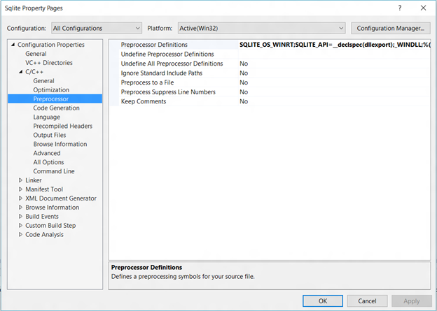

# Bases de datos SQLite

\[ Actualizado para aplicaciones para UWP en Windows 10. Para leer más artículos sobre Windows 8.x, consulta el [archivo](http://go.microsoft.com/fwlink/p/?linkid=619132) \]

SQLite es un motor de bases de datos incrustado sin servidor. En este artículo se explica cómo usar la biblioteca SQLite incluida en el SDK, empaquetar tu propia biblioteca SQLite en una aplicación universal de Windows o crearla desde la fuente.

## Qué es SQLite y cuándo se debe usar

SQLite es una base de datos de fuente abierta, incrustada y sin servidor. Con el paso de los años se ha convertido en la tecnología orientada a los dispositivos dominante para el almacenamiento de datos en muchas plataformas y dispositivos. La Plataforma universal de Windows (UWP) es compatible y recomienda SQLite para el almacenamiento local en todas las familias de dispositivos de Windows 10.

SQLite es ideal para aplicaciones de teléfono, aplicaciones incrustadas para Windows 10 IoT Core (IoT Core), y como memoria caché para datos del servidor de bases de datos de relaciones empresariales (RDBS). Satisfará la mayoría de necesidades de acceso a datos locales a menos que impliquen escrituras simultáneas intensas o escenarios de una gran escala de datos improbables para la mayoría de las aplicaciones.

En la reproducción multimedia y las aplicaciones de juegos, SQLite también puede usarse como formato de archivo para almacenar catálogos u otros activos, como los niveles de un juego, que se pueden descargar "como están" de un servidor web.

## Agregar SQLite a un proyecto de aplicación para UWP

Hay tres maneras de agregar SQLite a un proyecto UWP.

1.  [Usar el SDK SQLite](#using-the-sdk-sqlite)
2.  [Incluir SQLite en el paquete de la aplicación](#including-sqlite-in-the-app-package)
3.  [Compilar SQLite a partir de la fuente en Visual Studio](#building-sqlite-from-source-in-visual-studio)

### Usar el SDK SQLite

Es posible que desees usar la biblioteca SQLite incluida en el SDK de UWP para reducir el tamaño del paquete de tu aplicación y te bases en la plataforma para actualizar periódicamente la biblioteca. Usar el SDK de SQLite también puede ofrecer ventajas de rendimiento, como tiempos de inicio más rápidos, puesto que la biblioteca SQLite es muy probable que ya esté cargada en la memoria para su uso por parte de los componentes del sistema.

Para hacer referencia al SDK SQLite, incluye el siguiente encabezado en tu proyecto. El encabezado también contiene la versión de SQLite compatible con la plataforma.

`#include <winsqlite/winsqlite3.h>`

Configurar el proyecto para vincular a winsqlite3.lib. En el **Explorador de soluciones**, haz clic con el botón derecho en el proyecto y selecciona **Propiedades**&gt;**Enlazador**&gt;**Entrada** y, a continuación, agrega winsqlite3.lib a **Dependencias adicionales**.

### 2. Incluir SQLite en el paquete de la aplicación

En ocasiones, puede que desees empaquetar tu propia biblioteca en lugar de usar la versión del SDK, por ejemplo, puede que quieras usar una versión en particular de la misma en tus clientes multiplataforma que sea diferente de la versión de SQLite incluida en el SDK.

Instala la biblioteca de SQLite en la extensión de Visual Studio de la Plataforma universal de Windows disponible desde SQLite.org, o a través de la herramienta de extensiones y actualizaciones.

Una vez instalada la extensión, haz referencia al siguiente archivo de encabezado en tu código.

`#include <sqlite3.h>`

### 3. Compilar SQLite a partir de la fuente en Visual Studio

A veces, puede que quieras compilar tu propio SQLite binario para usar [distintas opciones del compilador](http://www.sqlite.org/compile.html) para reducir el tamaño del archivo, ajustar el rendimiento de la biblioteca o personalizar el conjunto de características en tu aplicación. SQLite proporciona opciones para la configuración de la plataforma, la configuración de los valores de los parámetros predeterminados, la configuración de los límites de tamaño, el control de las características operativas, la habilitación de características normalmente desactivadas, la deshabilitación de características normalmente activadas, la omisión de características,la  habilitación de análisis y depuración y la administración del comportamiento de asignación de memoria en Windows.

*Agregar una fuente a un proyecto de Visual Studio*

El código fuente de SQLite está disponible para su descarga en la [página de descarga de SQLite.org](https://www.sqlite.org/download.html). Agregar este archivo al proyecto de Visual Studio de la aplicación en la que deseas usar SQLite.

*Configurar preprocesadores*

Usar siempre SQLITE\_OS\_WINRT y SQLITE\_API=\_\_declspec(dllexport) además de cualquier otra [opción de tiempo de compilación](http://www.sqlite.org/compile.html).

## Administrar una base de datos de SQLite

Pueden crearse, actualizarse y eliminarse bases de datos de SQLite con las APIs C de SQLite. Los detalles de la API C de SQLite pueden encontrarse en la página SQLite.org, en la página [Introducción a la interfaz de C/C++ de SQLite](http://www.sqlite.org/cintro.html).

Para adquirir un conocimiento óptimo del funcionamiento de SQLite, trabaja en orden inverso desde la tarea principal de la base de datos de SQL que evaluará las declaraciones de SQL. Hay dos objetos que hay que tener en cuenta:

-   [Controlador de conexión de la base de datos](https://www.sqlite.org/c3ref/sqlite3.html)
-   [Objeto de instrucción preparada](https://www.sqlite.org/c3ref/stmt.html)

Hay seis interfaces para realizar operaciones de bases de datos en estos objetos:

-   [sqlite3\_open()](https://web.archive.org/web/20141228070025/http:/www.sqlite.org/c3ref/open.html)
-   [sqlite3\_prepare()](https://web.archive.org/web/20141228070025/http:/www.sqlite.org/c3ref/prepare.html)
-   [sqlite3\_step()](https://web.archive.org/web/20141228070025/http:/www.sqlite.org/c3ref/step.html)
-   [sqlite3\_column()](https://web.archive.org/web/20141228070025/http:/www.sqlite.org/c3ref/column_blob.html)
-   [sqlite3\_finalize()](https://web.archive.org/web/20141228070025/http:/www.sqlite.org/c3ref/finalize.html)
-   [sqlite3\_close()](https://web.archive.org/web/20141228070025/http:/www.sqlite.org/c3ref/close.html)

 

 

<!--HONumber=Jun16_HO4-->

