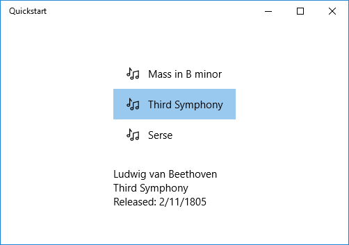

<a name="data-binding-overview"></a>Introducción al enlace de datos
=====================

\[ Actualizado para aplicaciones para UWP en Windows 10. Para leer artículos sobre Windows 8.x, consulta el [archivo](http://go.microsoft.com/fwlink/p/?linkid=619132) \]


En este tema se muestra cómo enlazar un control (o cualquier otro elemento de interfaz de usuario) a un solo elemento o enlazar un control de elementos a una colección de elementos en una aplicación para la Plataforma universal de Windows (UWP). Además, te mostramos cómo controlar la representación de los elementos, implementar una vista de detalles basada en una selección y convertir datos para mostrarlos. Para obtener información más detallada, consulta [Enlace de datos a profundidad](data-binding-in-depth.md).

<a name="prerequisites"></a>Requisitos previos
-------------------------------------------------------------------------------------------------------------

En este tema suponemos que sabes cómo crear una aplicación básica para UWP. Para obtener instrucciones sobre cómo crear tu primera aplicación para UWP, consulta [Introducción a las aplicaciones de Windows](https://developer.microsoft.com/windows/getstarted).

<a name="create-the-project"></a>Crear el proyecto
---------------------------------------------------------------------------------------------------------------------------------

Crea un nuevo proyecto de **Aplicación vacía (Windows Universal)**. Llámale "Quickstart".

<a name="binding-to-a-single-item"></a>Enlace a un solo elemento
---------------------------------------------------------------------------------------------------------------------------------------------------------

Cada enlace consta de un destino de enlace y de un origen de enlace. Normalmente, el destino es una propiedad de un control u otro elemento de interfaz de usuario y el origen es una propiedad de una instancia de clase (un modelo de datos o un modelo de vista). Este ejemplo muestra cómo enlazar un control a un solo elemento. El destino es la propiedad **Text** de un **TextBlock**. El origen es una instancia de una clase simple denominada **Recording** que representa una grabación de audio. Veamos primero la clase.

Agrega una nueva clase al proyecto, asígnale el nombre de Recording.cs (si usas C#, también los fragmentos de código de C++) y agrégale este código.

> [!div class="tabbedCodeSnippets"]
```csharp
namespace Quickstart
{
    public class Recording
    {
        public string ArtistName { get; set; }
        public string CompositionName { get; set; }
        public DateTime ReleaseDateTime { get; set; }
        public Recording()
        {
            this.ArtistName = "Wolfgang Amadeus Mozart";
            this.CompositionName = "Andante in C for Piano";
            this.ReleaseDateTime = new DateTime(1761, 1, 1);
        }
        public string OneLineSummary
        {
            get
            {
                return $"{this.CompositionName} by {this.ArtistName}, released: "
                    + this.ReleaseDateTime.ToString("d");
            }
        }
    }
    public class RecordingViewModel
    {
        private Recording defaultRecording = new Recording();
        public Recording DefaultRecording { get { return this.defaultRecording; } }
    }
}
```
```cpp
    #include <sstream>
    namespace Quickstart
    {
        public ref class Recording sealed
        {
        private:
            Platform::String^ artistName;
            Platform::String^ compositionName;
            Windows::Globalization::Calendar^ releaseDateTime;
        public:
            Recording(Platform::String^ artistName, Platform::String^ compositionName,
                Windows::Globalization::Calendar^ releaseDateTime) :
                artistName{ artistName },
                compositionName{ compositionName },
                releaseDateTime{ releaseDateTime } {}
            property Platform::String^ ArtistName
            {
                Platform::String^ get() { return this->artistName; }
            }
            property Platform::String^ CompositionName
            {
                Platform::String^ get() { return this->compositionName; }
            }
            property Windows::Globalization::Calendar^ ReleaseDateTime
            {
                Windows::Globalization::Calendar^ get() { return this->releaseDateTime; }
            }
            property Platform::String^ OneLineSummary
            {
                Platform::String^ get()
                {
                    std::wstringstream wstringstream;
                    wstringstream << this->CompositionName->Data();
                    wstringstream << L" by " << this->ArtistName->Data();
                    wstringstream << L", released: " << this->ReleaseDateTime->MonthAsNumericString()->Data();
                    wstringstream << L"/" << this->ReleaseDateTime->DayAsString()->Data();
                    wstringstream << L"/" << this->ReleaseDateTime->YearAsString()->Data();
                    return ref new Platform::String(wstringstream.str().c-str());
                }
            }
        };
        public ref class RecordingViewModel sealed
        {
        private:
            Recording^ defaultRecording;
        public:
            RecordingViewModel()
            {
                Windows::Globalization::Calendar^ releaseDateTime = ref new Windows::Globalization::Calendar();
                releaseDateTime->Month = 1;
                releaseDateTime->Day = 1;
                releaseDateTime->Year = 1761;
                this->defaultRecording = ref new Recording{ L"Wolfgang Amadeus Mozart", L"Andante in C for Piano", releaseDateTime };
            }
            property Recording^ DefaultRecording
            {
                Recording^ get() { return this->defaultRecording; };
            }
        };
    }
```

Después, expón la clase de origen de enlace desde la clase que representa la página de marcado. Eso lo haremos agregando una propiedad de tipo **RecordingViewModel** a **MainPage**.

> [!div class="tabbedCodeSnippets"]
```csharp
    namespace Quickstart
    {
        public sealed partial class MainPage : Page
        {
            public MainPage()
            {
                this.InitializeComponent();
                this.ViewModel = new RecordingViewModel();
            }
            public RecordingViewModel ViewModel { get; set; }
        }
    }
```
```cpp
    namespace Quickstart
    {
        public ref class MainPage sealed
        {
        private:
            RecordingViewModel^ viewModel;
        public:
            MainPage()
            {
                InitializeComponent();
                this->viewModel = ref new RecordingViewModel();
            }
            property RecordingViewModel^ ViewModel
            {
                RecordingViewModel^ get() { return this->viewModel; };
            }
        };
    }
```

La última parte es enlazar un **TextBlock** a la propiedad **ViewModel.DefaultRecording.OneLiner**.

```xml
    <Page x:Class="Quickstart.MainPage" ... >
        <Grid Background="{ThemeResource ApplicationPageBackgroundThemeBrush}">
            <TextBlock Text="{x:Bind ViewModel.DefaultRecording.OneLineSummary}"
            HorizontalAlignment="Center"
            VerticalAlignment="Center"/>
        </Grid>
    </Page>
```

Este es el resultado.


<a name="binding-to-a-collection-of-items"></a>Enlazar a una colección de elementos.
------------------------------------------------------------------------------------------------------------------

Un escenario común es enlazar a una colección de objetos profesionales. En C# y Visual Basic, la clase [**ObservableCollection&lt;T&gt;**](https://msdn.microsoft.com/library/windows/apps/xaml/ms668604.aspx) genérica es una buena elección de colección para el enlace de datos porque implementa las interfaces [**INotifyPropertyChanged**](https://msdn.microsoft.com/library/windows/apps/xaml/system.componentmodel.inotifypropertychanged.aspx) y [**INotifyCollectionChanged**](https://msdn.microsoft.com/library/windows/apps/xaml/system.collections.specialized.inotifycollectionchanged.aspx). Estas interfaces proporcionan notificación de cambios a los enlaces cuando los elementos se añaden o se eliminan o cuando cambia una propiedad de la lista en sí. Si quieres que los controles enlazados se actualicen con los cambios en las propiedades de objetos de la colección, el objeto profesional también debe implementar **INotifyPropertyChanged**. Para obtener más información, consulta el tema [Enlace de datos en profundidad](data-binding-in-depth.md).

El siguiente ejemplo enlaza una [**ListView**](https://msdn.microsoft.com/library/windows/apps/BR242878) a una colección de objetos `Recording`. Empecemos agregando la colección a nuestro modelo de vista. Solo tienes que agregar estos miembros nuevos a la clase **RecordingViewModel**.

> [!div class="tabbedCodeSnippets"]
```csharp
    public class RecordingViewModel
    {
        ...
        private ObservableCollection<Recording> recordings = new ObservableCollection<Recording>();
        public ObservableCollection<Recording> Recordings { get { return this.recordings; } }
        public RecordingViewModel()
        {
            this.recordings.Add(new Recording() { ArtistName = "Johann Sebastian Bach",
            CompositionName = "Mass in B minor", ReleaseDateTime = new DateTime(1748, 7, 8) });
            this.recordings.Add(new Recording() { ArtistName = "Ludwig van Beethoven",
            CompositionName = "Third Symphony", ReleaseDateTime = new DateTime(1805, 2, 11) });
            this.recordings.Add(new Recording() { ArtistName = "George Frideric Handel",
            CompositionName = "Serse", ReleaseDateTime = new DateTime(1737, 12, 3) });
        }
    }
```
```cpp
    public ref class RecordingViewModel sealed
    {
    private:
        ...
        Windows::Foundation::Collections::IVector<Recording^>^ recordings;
    public:
        RecordingViewModel()
        {
            ...
            releaseDateTime = ref new Windows::Globalization::Calendar();
            releaseDateTime->Month = 7;
            releaseDateTime->Day = 8;
            releaseDateTime->Year = 1748;
            Recording^ recording = ref new Recording{ L"Johann Sebastian Bach", L"Mass in B minor", releaseDateTime };
            this->Recordings->Append(recording);
            releaseDateTime = ref new Windows::Globalization::Calendar();
            releaseDateTime->Month = 2;
            releaseDateTime->Day = 11;
            releaseDateTime->Year = 1805;
            recording = ref new Recording{ L"Ludwig van Beethoven", L"Third Symphony", releaseDateTime };
            this->Recordings->Append(recording);
            releaseDateTime = ref new Windows::Globalization::Calendar();
            releaseDateTime->Month = 12;
            releaseDateTime->Day = 3;
            releaseDateTime->Year = 1737;
            recording = ref new Recording{ L"George Frideric Handel", L"Serse", releaseDateTime };
            this->Recordings->Append(recording);
        }
        ...
        property Windows::Foundation::Collections::IVector<Recording^>^ Recordings
        {
            Windows::Foundation::Collections::IVector<Recording^>^ get()
            {
                if (this->recordings == nullptr)
                {
                    this->recordings = ref new Platform::Collections::Vector<Recording^>();
                }
                return this->recordings;
            };
        }
    };
```

Después, enlaza un control [**ListView**](https://msdn.microsoft.com/library/windows/apps/BR242878) a la propiedad **ViewModel.Recordings**.

```xml
<Page x:Class="Quickstart.MainPage" ... >
    <Grid Background="{ThemeResource ApplicationPageBackgroundThemeBrush}">
        <ListView ItemsSource="{x:Bind ViewModel.Recordings}"
        HorizontalAlignment="Center" VerticalAlignment="Center"/>
    </Grid>
</Page>
```

Aún no hemos proporcionado una plantilla de datos para la clase **Recording**, por lo que lo mejor que puede hacer el marco de trabajo de la interfaz de usuario es llamar a [**ToString**](https://msdn.microsoft.com/library/windows/apps/system.object.tostring.aspx) para cada elemento del control [**ListView**](https://msdn.microsoft.com/library/windows/apps/BR242878). La implementación predeterminada de **ToString** es devolver el nombre del tipo.


Para solucionar este problema, podemos tanto invalidar [**ToString**](https://msdn.microsoft.com/library/windows/apps/system.object.tostring.aspx) para devolver el valor de **OneLineSummary**, o podemos proporcionar una plantilla de datos. La opción de plantilla de datos es más común y posiblemente más flexible. Estableces una plantilla de datos mediante la propiedad [**ContentTemplate**](https://msdn.microsoft.com/library/windows/apps/BR209369) de un control de contenido o la propiedad [**ItemTemplate**](https://msdn.microsoft.com/library/windows/apps/BR242830) de un control de elementos. Hay dos formas en las que podríamos diseñar una plantilla de datos para **Recording** junto con una ilustración del resultado.

```xml
    <ListView ItemsSource="{x:Bind ViewModel.Recordings}"
        HorizontalAlignment="Center" VerticalAlignment="Center">
        <ListView.ItemTemplate>
            <DataTemplate x:DataType="local:Recording">
                <TextBlock Text="{x:Bind OneLineSummary}"/>
            </DataTemplate>
        </ListView.ItemTemplate>
    </ListView>
```


```xml
    <ListView ItemsSource="{x:Bind ViewModel.Recordings}"
    HorizontalAlignment="Center" VerticalAlignment="Center">
        <ListView.ItemTemplate>
            <DataTemplate x:DataType="local:Recording">
                <StackPanel Orientation="Horizontal" Margin="6">
                    <SymbolIcon Symbol="Audio" Margin="0,0,12,0"/>
                    <StackPanel>
                        <TextBlock Text="{x:Bind ArtistName}" FontWeight="Bold"/>
                        <TextBlock Text="{x:Bind CompositionName}"/>
                    </StackPanel>
                </StackPanel>
            </DataTemplate>
        </ListView.ItemTemplate>
    </ListView>
```


Para más información sobre la sintaxis XAML, consulta el tema [Crear una interfaz de usuario con XAML](https://msdn.microsoft.com/library/windows/apps/Mt228349). Para obtener más información acerca del diseño de controles, consulta [Definir diseños con XAML](https://msdn.microsoft.com/library/windows/apps/Mt228350).

<a name="adding-a-details-view"></a>Agregar una vista de detalles
-----------------------------------------------------------------------------------------------------

Puedes elegir mostrar todos los detalles de objetos **Recording** en los elementos de [**ListView**](https://msdn.microsoft.com/library/windows/apps/BR242878). Pero eso ocupa una gran cantidad de espacio. En su lugar, puedes mostrar solo los datos suficientes en el elemento para identificarlo y luego, cuando el usuario realiza una selección, se pueden mostrar todos los detalles del elemento seleccionado en una parte independiente de la interfaz de usuario conocida como la vista de detalles. Este tipo de organización es también conocido como una vista maestra/detallada o una vista de lista/detalles.

Esto se puede llevar a cabo de dos maneras. Puedes enlazar la vista de detalles a la propiedad [**SelectedItem**](https://msdn.microsoft.com/library/windows/apps/BR209770) de la [**ListView**](https://msdn.microsoft.com/library/windows/apps/BR242878). O puedes usar un [**CollectionViewSource**](https://msdn.microsoft.com/library/windows/apps/BR209833): enlaza tanto la **ListView** como la vista de detalles al **CollectionViewSource** (que se encargará en tu lugar del elemento actualmente seleccionado). A continuación se muestran ambas técnicas y proporcionan los mismos resultados que se muestra en la ilustración.

> [!NOTE]
> Hasta ahora en este tema solo hemos usado la [Extensión de marcado {x:Bind}](https://msdn.microsoft.com/library/windows/apps/Mt204783), pero ambas técnicas que te mostramos a continuación requieren la extensión más flexible (pero menos eficaz) [Extensión de marcado {Binding}](https://msdn.microsoft.com/library/windows/apps/Mt204782).

Primero, esta es la técnica [**SelectedItem**](https://msdn.microsoft.com/library/windows/apps/BR209770). Si usas las extensiones de componentes de Visual C++ (C++/CX), ya que usaremos [{Binding}](https://msdn.microsoft.com/library/windows/apps/Mt204782), tendrás que agregar el atributo [**BindableAttribute**](https://msdn.microsoft.com/library/windows/apps/Hh701872) a la clase **Recording**.

```cpp
    [Windows::UI::Xaml::Data::Bindable]
    public ref class Recording sealed
    {
        ...
    };
```

El único cambio adicional necesario es al marcado.

```xml
<Page x:Class="Quickstart.MainPage" ... >
    <Grid Background="{ThemeResource ApplicationPageBackgroundThemeBrush}">
        <StackPanel HorizontalAlignment="Center" VerticalAlignment="Center">
            <ListView x:Name="recordingsListView" ItemsSource="{x:Bind ViewModel.Recordings}">
                <ListView.ItemTemplate>
                    <DataTemplate x:DataType="local:Recording">
                        <StackPanel Orientation="Horizontal" Margin="6">
                            <SymbolIcon Symbol="Audio" Margin="0,0,12,0"/>
                            <StackPanel>
                                <TextBlock Text="{x:Bind CompositionName}"/>
                            </StackPanel>
                        </StackPanel>
                    </DataTemplate>
                </ListView.ItemTemplate>
            </ListView>
            <StackPanel DataContext="{Binding SelectedItem, ElementName=recordingsListView}"
            Margin="0,24,0,0">
                <TextBlock Text="{Binding ArtistName}"/>
                <TextBlock Text="{Binding CompositionName}"/>
                <TextBlock Text="{Binding ReleaseDateTime}"/>
            </StackPanel>
        </StackPanel>
    </Grid>
</Page>
```

Para la técnica [**CollectionViewSource**](https://msdn.microsoft.com/library/windows/apps/BR209833), primero agrega un **CollectionViewSource** como recurso de página.

```xml
    <Page.Resources>
        <CollectionViewSource x:Name="RecordingsCollection" Source="{x:Bind ViewModel.Recordings}"/>
    </Page.Resources>
```

Y luego ajusta los enlaces en la [**ListView**](https://msdn.microsoft.com/library/windows/apps/BR242878) (a la que ya no necesitas llamar) y en la vista de detalles usa el [**CollectionViewSource**](https://msdn.microsoft.com/library/windows/apps/BR209833). Ten en cuenta al enlazar la lista de detalles directamente al **CollectionViewSource**, estás dando por sentado que quieres enlazar el elemento actual a los enlaces donde la ruta de acceso no se encuentra en la propia colección. No es necesario especificar la propiedad **CurrentItem** como la ruta de acceso para el enlace, aunque sí puedes hacerlo si encuentras alguna ambigüedad.

```xml
    ...

    <ListView ItemsSource="{Binding Source={StaticResource RecordingsCollection}}">

    ...

    <StackPanel DataContext="{Binding Source={StaticResource RecordingsCollection}}" ...>
    ...
```

Y este es el resultado idéntico en cada caso.


<a name="formatting-or-converting-data-values-for-display"></a>Formato o conversión de valores de datos para mostrar
--------------------------------------------------------------------------------------------------------------------------------------------

Hay un pequeño problema con la representación anterior. La propiedad **ReleaseDateTime** no es simplemente una fecha, es un [**DateTime**](https://msdn.microsoft.com/library/windows/apps/xaml/system.datetime.aspx), de modo que se muestra con más precisión de la que necesitamos. Una solución es agregar una propiedad de cadena para la clase **Recording** que devuelve `this.ReleaseDateTime.ToString("d")`. Darle a esa propiedad el nombre **ReleaseDate** indicaría que devuelve una fecha, no una fecha y hora. Darle el nombre **ReleaseDateAsString** indicaría, además, que devuelve una cadena.

Una solución más flexible es usar algo conocido como un convertidor de valores. Este es un ejemplo de cómo crear tu propio convertidor de valores. Agrega este código al archivo de código fuente Recording.cs.

```csharp
public class StringFormatter : Windows.UI.Xaml.Data.IValueConverter
{
    // This converts the value object to the string to display.
    // This will work with most simple types.
    public object Convert(object value, Type targetType,
        object parameter, string language)
    {
        // Retrieve the format string and use it to format the value.
        string formatString = parameter as string;
        if (!string.IsNullOrEmpty(formatString))
        {
            return string.Format(formatString, value);
        }

        // If the format string is null or empty, simply
        // call ToString() on the value.
        return value.ToString();
    }

    // No need to implement converting back on a one-way binding
    public object ConvertBack(object value, Type targetType,
        object parameter, string language)
    {
        throw new NotImplementedException();
    }
}
```

Ahora podemos agregar una instancia de **StringFormatter** como un recurso de página y usarla en nuestro enlace. Pasamos la cadena de formato en el convertidor de marcado de flexibilidad de formato.

```xml
    <Page.Resources>
        <local:StringFormatter x:Key="StringFormatterValueConverter"/>
    </Page.Resources>
    ...

    <TextBlock Text="{Binding ReleaseDateTime,
        Converter={StaticResource StringFormatterValueConverter},
        ConverterParameter=Released: \{0:d\}}"/>

    ...
```

Este es el resultado.



> [!NOTE]
> A partir de Windows 10, versión 1607, el marco XAML proporciona un valor booleano integrado para el convertidor de visibilidad. El convertidor asigna **true** al valor de la enumeración **Visible** y **false** a **Collapsed**, para que puedas enlazar una propiedad Visibility a un valor booleano sin necesidad de crear un convertidor. Para usar el convertidor integrado, la versión mínima del SDK de destino de la aplicación debe ser 14393 o posterior. No puedes usarlo si la aplicación está destinada a versiones anteriores de Windows 10. Para obtener más información sobre las versiones de destino, consulta [Código adaptativo para versiones](https://msdn.microsoft.com/windows/uwp/debug-test-perf/version-adaptive-code).

## <a name="see-also"></a>Consulta también
- [Enlace de datos](index.md)
