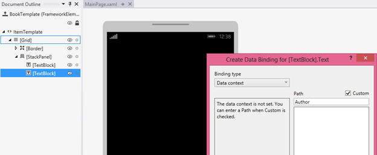

Datos de muestra sobre la superficie de diseño y para la creación de prototipos
=============================================================================================

\[ Actualizado para aplicaciones para UWP en Windows 10. Para leer más artículos sobre Windows 8.x, consulta el [archivo](http://go.microsoft.com/fwlink/p/?linkid=619132) \]


**Nota** La cantidad de datos de muestra que necesites (y que te serán de ayuda) depende de si tus enlaces usan la [extensión de marcado {Binding}](https://msdn.microsoft.com/library/windows/apps/Mt204782) o la [extensión de marcado {x:Bind}](https://msdn.microsoft.com/library/windows/apps/Mt204783). Las técnicas que se describen en este tema se basan en el uso de la propiedad [**DataContext**](https://msdn.microsoft.com/library/windows/apps/BR208713), por lo que solo son apropiadas para la extensión **{Binding}**. Sin embargo, si usas **{x:Bind}** tus enlaces mostrarán, como mínimo, valores de marcador de posición sobre la superficie de diseño (incluso para controles de elementos); así no necesitarás recopilar tantos datos de muestra.

Quizás sea imposible o no desees (puede que por motivos de privacidad o rendimiento) que la aplicación muestre datos dinámicos sobre la superficie de diseño en Microsoft Visual Studio o Blend para Visual Studio. Para hacer que los controles se rellenen con datos (de modo que puedas trabajar en el diseño de la aplicación, las plantillas y otras propiedades visuales), puedes usar los datos de ejemplo en tiempo de diseño de distintas maneras. Los datos de ejemplo también pueden ser muy útiles y ahorrarte tiempo si creas una aplicación de diseño de bocetos (o prototipos). Puedes usar los datos de ejemplo del boceto o el prototipo en tiempo de ejecución para ilustrar tus ideas sin tener que conectarte a los datos dinámicos reales.

Configuración de DataContext en el marcado
-----------------------------

Es una práctica bastante común entre los desarrolladores usar código imperativo (en el código subyacente) para establecer la propiedad [**DataContext**](https://msdn.microsoft.com/library/windows/apps/BR208713) de un control de usuario o página, en una instancia del modelo de vista.

``` csharp
public MainPage()
{
    InitializeComponent();
    this.DataContext = new BookstoreViewModel();
}
```

Al hacerlo, la página no presenta tantas posibilidades de diseño. El motivo es que al abrir la página XAML en Visual Studio o Blend para Visual Studio, el código imperativo que asigna el valor de **DataContext** nunca se ejecuta (de hecho, no se ejecuta ningún código subyacente). Las herramientas XAML analizan el marcado y crean instancias de los objetos declarados en este, pero no crean una instancia del tipo de la página en sí. Como resultado, no verá ningún dato en los controles ni en el cuadro de diálogo **Crear enlace de datos**, y será más difícil diseñar y definir el estilo de la página.



La primera solución es intentar evitar que se ejecute la asignación de **DataContext** y, en su lugar, establecer la propiedad **DataContext** en el marcado de página. De este modo, los datos dinámicos aparecen tanto en tiempo de diseño como en tiempo de ejecución. Para hacerlo, abre primero la página XAML. A continuación, en la ventana **Esquema del documento**, haz clic en el elemento raíz que se puede diseñar (normalmente tiene la etiqueta **\[Page]\**) para seleccionarlo. En la ventana **Propiedades**, busca la propiedad **DataContext** (dentro de la categoría Common) y, a continuación, haz clic en **Nueva**. Haz clic en el tipo de modelo de vista del cuadro de diálogo **Seleccionar objeto** y, después, en **Aceptar**.


Este es el aspecto del marcado resultante.

``` xml
<Page ... >
    <Page.DataContext>
        <local:BookstoreViewModel/>
    </Page.DataContext>
```

Y este es el aspecto de la superficie de diseño ahora que los enlaces tienen capacidad para resolver. Verás que el selector de **rutas de acceso** del cuadro de diálogo **Crear enlace de datos** aparece ahora rellenado, según el tipo de **DataContext** y las propiedades a las que puedes establecer un enlace.


El cuadro de diálogo **Crear enlace de datos** solo necesita un tipo desde el cual trabajar, pero los enlaces requieren que las propiedades se inicialicen con valores. Si no quieres acceder al servicio de nube en tiempo de diseño (por motivos de rendimiento, pago por transferencia de datos, problemas de privacidad y ese tipo de cosas), el código de inicialización puede comprobar si la aplicación se ejecuta en una herramienta de diseño (como Visual Studio o Blend para Visual Studio) y, en ese caso, cargar datos de ejemplo para usarlos solo en tiempo de diseño.

``` csharp
if (Windows.ApplicationModel.DesignMode.DesignModeEnabled)
{
    // Load design-time books.
}
else
{
    // Load books from a cloud service.
}
```

Puedes usar un localizador de modelo de vista si necesitas pasar parámetros al código de inicialización. Un localizador de modelo de vista es una clase que se puede colocar en los recursos de la aplicación. Tiene una propiedad que expone el modelo de vista y los enlaces **DataContext** de la página a esa propiedad. Otro patrón que el localizador o el modelo de vista pueden usar es la inserción de dependencias, la cual puede crear un proveedor de datos en tiempo de diseño o tiempo de ejecución (cada uno de los cuales implementará una interfaz común), según corresponda.

"Datos de ejemplo desde clase" y atributos en tiempo de diseño
---------------------------------------------------------------------------------------

Si, por cualquier motivo, ninguna de las opciones de la sección anterior funciona, sigues teniendo muchas opciones de datos en tiempo de diseño disponibles a través de los atributos en tiempo de diseño y las características de las herramientas XAML. Una buena opción es la característica **Crear datos de ejemplo desde clase** de Blend para Visual Studio. Este comando se puede encontrar en uno de los botones de la parte superior del panel **Datos**.

Todo lo que debes hacer es especificar una clase para el comando que deseas usar. Posteriormente, el comando realiza dos tareas importantes para ti. En primer lugar, genera un archivo XAML que contiene datos de ejemplo apropiados para hidratar una instancia de la clase elegida y todos sus miembros de forma recursiva (de hecho, las herramientas funciona igualmente bien con archivos XAML o JSON). En segundo lugar, rellena el panel **Datos** con el esquema de la clase que elegiste. Igualmente, puedes arrastrar los miembros del panel **Datos** a la superficie de diseño para realizar diferentes tareas. Dependiendo de lo que arrastres y dónde lo coloques, podrás agregar enlaces a controles ya existentes (mediante **{Binding}**), o crear nuevos controles y enlazarlos al mismo tiempo. En cualquier caso, la operación también establece un contexto de datos en tiempo de diseño (**d:DataContext**) que tienes disponible (si resulta que no existe ninguno establecido) en la raíz de diseño de la página. Ese contexto de datos en tiempo de diseño usa el atributo **d:DesignData** para obtener datos de muestra del archivo XAML generado (el cual, por cierto, puedes buscar en el proyecto y editarlo para que contenga los datos de muestra que quieras).

``` xml
<Page ...
    xmlns:d="http://schemas.microsoft.com/expression/blend/2008"
    xmlns:mc="http://schemas.openxmlformats.org/markup-compatibility/2006"
    mc:Ignorable="d">
    <Grid ... d:DataContext="{d:DesignData /SampleData/RecordingViewModelSampleData.xaml}"/>
        <ListView ItemsSource="{Binding Recordings}" ... />
        ...
    </Grid>
</Page>
```

Las distintas declaraciones xmlns que aparecen indican que los atributos con el prefijo **d:** se interpretan solo en tiempo de diseño y se omiten en tiempo de ejecución. Por tanto, el atributo **d:DataContext** solo afecta al valor de la propiedad [**DataContext**](https://msdn.microsoft.com/library/windows/apps/BR208713) en tiempo de diseño; no tiene ningún efecto en tiempo de ejecución. Puedes establecer tanto **d:DataContext** como **DataContext** en el marcado, si quieres. **d:DataContext** realizará el reemplazo en tiempo de diseño y **DataContext** lo realizará en tiempo de ejecución. Estas mismas reglas de reemplazo se aplican a todos los atributos en tiempo de diseño y tiempo de ejecución.

El atributo **d:DataContext** y todos los demás atributos en tiempo de diseño, se documentan en el tema [Atributos en tiempo de diseño](http://go.microsoft.com/fwlink/p/?LinkId=272504), que sigue siendo válido para las aplicaciones para la Plataforma universal de Windows (UWP).

[**CollectionViewSource**](https://msdn.microsoft.com/library/windows/apps/BR209833) no tiene una propiedad **DataContext** pero sí una propiedad **Source**. En consecuencia, existe una propiedad **d:Source** que puedes usar para establecer datos de muestra solo en tiempo de diseño en una clase **CollectionViewSource**.

``` xml
    <Page.Resources>
        <CollectionViewSource x:Name="RecordingsCollection" Source="{Binding Recordings}"
            d:Source="{d:DesignData /SampleData/RecordingsSampleData.xaml}"/>
    </Page.Resources>

    ...

        <ListView ItemsSource="{Binding Source={StaticResource RecordingsCollection}}" ... />
    ...
```

Para que esta opción funcione, deberías tener una clase denominada `Recordings : ObservableCollection<Recording>` y editar el archivo XAML de datos de muestra para que solo contenga un objeto **Recordings** (que a su vez contenga objetos **Recording**), tal y como se muestra aquí.

``` xml
<Quickstart:Recordings xmlns:Quickstart="using:Quickstart">
    <Quickstart:Recording ArtistName="Mollis massa" CompositionName="Cubilia metus"
        OneLineSummary="Morbi adipiscing sed" ReleaseDateTime="01/01/1800 15:53:17"/>
    <Quickstart:Recording ArtistName="Vulputate nunc" CompositionName="Parturient vestibulum"
        OneLineSummary="Dapibus praesent netus amet vestibulum" ReleaseDateTime="01/01/1800 15:53:17"/>
    <Quickstart:Recording ArtistName="Phasellus accumsan" CompositionName="Sit bibendum"
        OneLineSummary="Vestibulum egestas montes dictumst" ReleaseDateTime="01/01/1800 15:53:17"/>
</Quickstart:Recordings>
```

Si usas un archivo de datos de muestra JSON en lugar de XAML, debes establecer la propiedad **Type**.

``` xml
    d:Source="{d:DesignData /SampleData/RecordingsSampleData.json, Type=local:Recordings}"
```

Hasta ahora, hemos usado **d:DesignData** para cargar datos de muestra en tiempo de diseño de un archivo XAML o JSON. Una alternativa a ello es la extensión de marcado **d:DesignInstance**, que indica que el origen en tiempo de diseño se basa en la clase especificada por la propiedad **Type**. A continuación te mostramos un ejemplo.

``` xml
    <CollectionViewSource x:Name="RecordingsCollection" Source="{Binding Recordings}"
        d:Source="{d:DesignInstance Type=local:Recordings, IsDesignTimeCreatable=True}"/>
        ```

The **IsDesignTimeCreatable** property indicates that the design tool should actually create an instance of the class, which implies that the class has a public default constructor, and that it populates itself with data (either real or sample). If you don't set **IsDesignTimeCreatable** (or if you set it to **False**) then you won't get sample data displayed on the design surface. All the design tool does in that case is to parse the class for its bindable properties and display these in the the **Data** panel and in the **Create Data Binding** dialog.

Sample data for prototyping
--------------------------------------------------------

For prototyping, you want sample data at both design-time and at run-time. For that use case, Blend for Visual Studio has the **New Sample Data** feature. You can find that command on one of the buttons at the top of the **Data** panel.

Instead of specifying a class, you can actually design the schema of your sample data source right in the **Data** panel. You can also edit sample data values in the **Data** panel: there's no need to open and edit a file (although, you can still do that if you prefer).

The **New Sample Data** feature uses [**DataContext**](https://msdn.microsoft.com/library/windows/apps/BR208713), and not **d:DataContext**, so that the sample data is available when you run your sketch or prototype as well as while you're designing it. And the **Data** panel really speeds up your designing and binding tasks. For example, simply dragging a collection property from the **Data** panel onto the design surface generates a data-bound items control and the necessary templates, all ready to build and run.


 

 


<!--HONumber=Mar16_HO1-->


