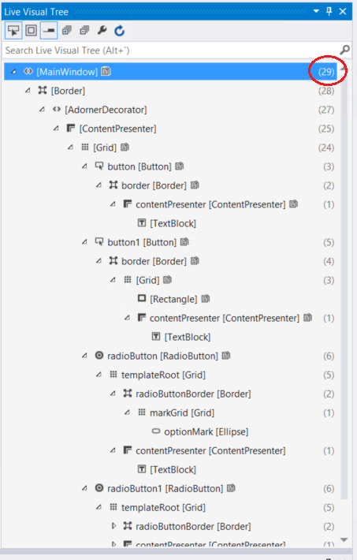

# <a name="best-practices-for-your-apps-startup-performance"></a>Procedimientos recomendados para mejorar el rendimiento del inicio de la aplicación


Mejora el control del inicio y la activación de la aplicación para crear aplicaciones para la Plataforma universal de Windows (UWP) con tiempo de inicio optimizado.

## <a name="best-practices-for-your-apps-startup-performance"></a>Procedimientos recomendados para mejorar el rendimiento del inicio de la aplicación

En parte, los usuarios notan si una aplicación es rápida o lenta según el tiempo que tarda en iniciarse. En el contexto de este tema, el tiempo de inicio de una aplicación comienza cuando el usuario inicia la aplicación y finaliza cuando puede interactuar con la aplicación de modo significativo. En esta sección se proporcionan sugerencias sobre cómo mejorar el rendimiento de la aplicación cuando se inicia.

### <a name="measuring-your-apps-startup-time"></a>Medir el tiempo de inicio de la aplicación

Asegúrate de iniciar la aplicación algunas veces antes de medir el tiempo de inicio. Esto proporciona un punto de partida para la medición y garantiza que estás midiendo el tiempo de inicio más razonablemente corto que sea posible.

Para cuando la aplicación para UWP llega a los PC de tus clientes, la aplicación se habrá compilado con la cadena de herramientas de .NET Native. .NET Native es una tecnología de compilación anticipada que convierte MSIL en código de máquina ejecutable de forma nativa. Las aplicaciones de .NET Native se inician más rápido, usan menos memoria y usan menos batería que sus equivalentes MSIL. Las aplicaciones compiladas con .NET Native se vinculan estáticamente en un tiempo de ejecución personalizado y el nuevo núcleo .NET convergente que se puede ejecutar en todos los dispositivos, por lo que no dependen de la implementación de .NET en el equipo. En el equipo de desarrollo, de forma predeterminada la aplicación usa .NET Native si vas a crearla en el modo "Versión" y usa CoreCLR si la creas en modo de "Depuración". Puedes configurar esto en Visual Studio desde la página de compilación en "Propiedades" (C#) o Compilación -> Opciones avanzadas "Mi proyecto" (VB). Busca una casilla que dice "Compilar con cadena de herramientas nativa de .NET".

Evidentemente, debes realizar mediciones representativas de la experiencia que tendrá el usuario final. Por lo tanto, si no estás seguro de si compilarás la aplicación en código nativo en tu equipo de desarrollo, puedes ejecutar la herramienta Generador de imágenes nativo (Ngen.exe) para precompilar la aplicación antes de medir el tiempo de inicio.

En el siguiente procedimiento se describe cómo ejecutar Ngen.exe para precompilar la aplicación.

**Instrucciones para ejecutar Ngen.exe**

1.  Ejecuta la aplicación una vez, como mínimo, para asegurarte de que Ngen.exe la detecte.
2.  Realiza una de las siguientes acciones para abrir el **Programador de tareas**:
    -   Busca “Programador de tareas” en la pantalla Inicio.
    -   Ejecuta "taskschd.msc".
3.  En el panel izquierdo del **Programador de tareas**, expande **Biblioteca del Programador de tareas**.
4.  Expande **Microsoft.**
5.  Expande **Windows.**
6.  Selecciona **.NET Framework**.
7.  Selecciona **.NET Framework NGEN 4.x** en la lista de tareas.

    Si usas un equipo de 64 bits, también hay un **.NET Framework NGEN v4.x 64**. Si compilas una aplicación de 64 bits, selecciona .**NET Framework NGEN v4.x 64**.

8.  En el menú **Acción**, haz clic en **Ejecutar**.

Ngen.exe precompila todas las aplicaciones del equipo que se usaron y que no contienen imágenes nativas. Si hay muchas aplicaciones que deben precompilarse, esto puede tardar mucho tiempo, pero las ejecuciones siguientes serán más rápidas.

Cuando vuelvas a compilar la aplicación, ya no se usará la imagen nativa. En su lugar, la aplicación se compila Just-In-Time, o sea, que se compila a medida que se ejecuta la aplicación. Debes volver a ejecutar Ngen.exe para obtener una nueva imagen nativa.

### <a name="defer-work-as-long-as-possible"></a>Aplaza el trabajo lo más que puedas

Para mejorar el tiempo de inicio de la aplicación, realiza solo el trabajo que sea absolutamente necesario para permitir que el usuario empiece a interaccionar con la aplicación. Esto puede ser especialmente beneficioso si puedes retrasar la carga de ensamblados adicionales. Common Language Runtime carga un ensamblado la primera vez que se usa. Si puedes reducir al mínimo la cantidad de ensamblados que se cargan, es posible que mejores el tiempo de inicio de la aplicación y la memoria que consume.

### <a name="do-long-running-work-independently"></a>Realizar trabajos de ejecución prolongados de forma independiente

La aplicación puede ser interactiva aunque algunas de sus partes no sean totalmente funcionales. Por ejemplo, si la aplicación muestra datos que tardan un poco recuperarse, puedes hacer que ese código se ejecute de forma independiente del código de inicio de la aplicación. Para hacerlo, recupera los datos de forma asincrónica. Cuando los datos estén disponibles, úsalos para rellenar la interfaz de usuario de la aplicación.

Muchas de las API de la Plataforma universal de Windows (UWP) que recuperan datos son asincrónicas, por eso, es probable que recuperes datos de forma asincrónica de todos modos. Para más información sobre las API de programación asincrónica, consulta [Llamar a API asincrónicas en C# o Visual Basic](https://msdn.microsoft.com/library/windows/apps/Mt187337). Si el trabajo que realizas no emplea API asincrónicas, puedes usar la clase Task para realizar trabajos de larga ejecución sin impedir que el usuario interactúe con la aplicación. De este modo, tu aplicación seguirá respondiendo al usuario mientras se cargan los datos.

Si la aplicación tarda demasiado en cargar parte de su interfaz de usuario, contempla la posibilidad de agregarle una cadena en esa área con la indicación "Obteniendo los datos más recientes" o algo similar. De este modo, los usuarios sabrán que la aplicación sigue procesando.

## <a name="minimize-startup-time"></a>Minimizar el tiempo de inicio

Todas las aplicaciones, excepto las más simples, tardan un tiempo perceptible en cargar los recursos, analizar el XAML, configurar las estructuras de datos y ejecutar la lógica durante la activación. En este artículo, dividimos el proceso de activación en tres fases y lo analizamos. También proporcionamos sugerencias para reducir la duración de cada fase y técnicas para lograr que cada fase del inicio de la aplicación sea más aceptable para el usuario.

El período de activación es el tiempo que transcurre entre el momento en que el usuario inicia la aplicación y el instante en que esta pasa a ser funcional. Este tiempo es fundamental, ya que es la primera impresión que tienen los usuarios de tu aplicación. Ellos esperan una respuesta instantánea y continua del sistema y las aplicaciones. Cuando las aplicaciones no se inician rápidamente, el diseño del sistema y la aplicación se percibe como discontinuo o deficiente. Lo que es aún peor, si el proceso de activación de una aplicación tarda demasiado, la Administración del ciclo de vida de los procesos (PLM) podría cancelarla o el usuario podría desinstalarla.

### <a name="introduction-to-the-stages-of-startup"></a>Introducción a las fases de inicio

El inicio implica un número de fragmentos en movimiento y todos ellos deben coordinarse correctamente para lograr la mejor experiencia del usuario. Los siguientes pasos se producen entre el momento en que el usuario hace clic en el icono de la aplicación y el momento en que se muestra el contenido de la aplicación.

-   El shell de Windows inicia el proceso y se llama al método Main.
-   Se crea el objeto Application.
    -   (Plantilla de proyecto) El constructor llama a InitializeComponent, lo que provoca el análisis de App.xaml y la creación de objetos.
-   Se genera el evento Application.OnLaunched.
    -   (ProjectTemplate) El código de la aplicación crea un objeto Frame y navega al objeto MainPage.
    -   (Plantilla de proyecto) El constructor Mainpage llama a InitializeComponent, lo que provoca el análisis de MainPage y la creación de objetos.
    -   (Plantilla de proyecto) Se llama a Window.Current.Activate().
-   La plataforma de XAML ejecuta la fase Layout, con los objetos Measure y Arrange.
    -   ApplyTemplate provocará la creación de contenido de la plantilla de control para cada control, que suele ser la mayor parte del tiempo del objeto Layout para el inicio.
-   Se llama al objeto Render para crear los elementos visuales de todo el contenido de la ventana.
-   El objeto Frame se presenta al Administrador de ventanas de escritorio (DWM).

### <a name="do-less-in-your-startup-path"></a>Haz menos en la ruta de acceso de inicio

Mantén tu ruta de acceso de al código de inicio libre de todo lo que no se necesite para el primer marco.

-   Si tienes archivos DLL de usuario que contienen controles que no se necesitan durante el primer marco, considera la posibilidad de retrasar su carga.
-   Si tienes una parte de la interfaz de usuario que depende de los datos de la nube, divide esa interfaz de usuario. En primer lugar, abre la interfaz de usuario que no depende de los datos en la nube y abre asincrónicamente la interfaz de usuario dependiente de la nube. También deberías considerar almacenar los datos en la memoria caché local para que la aplicación funcione sin conexión o no se vea afectada por una conectividad de red lenta.
-   Muestra el progreso de la interfaz de usuario si esta está a la espera de datos.
-   Ten cuidado con los diseños de aplicación que implican una gran cantidad de análisis de los archivos de configuración o una interfaz de usuario que se genera dinámicamente mediante código.

### <a name="reduce-element-count"></a>Reducir el número de elementos

El rendimiento de inicio de una aplicación XAML está relacionada directamente con el número de elementos que creas durante el inicio. Cuantos menos elementos crees, menos tiempo tardará la aplicación en iniciarse. Como referencia aproximada, considera la posibilidad de que la creación de cada elemento tarde 1ms.

-   Las plantillas que se usan en los controles de elementos pueden tener el mayor impacto, ya que se repiten varias veces. Consulta [Optimización de interfaz de usuario de ListView y GridView](optimize-gridview-and-listview.md).
-   Los objetos UserControl y las plantillas de controles se ampliarán, por lo que también deberían tenerse en cuenta.
-   Si creas código XAML que no aparece en la pantalla, deberías justificar si dichos fragmentos del código XAML deben crearse durante el inicio.

En la ventana [Visual Studio Live Visual Tree](http://blogs.msdn.com/b/visualstudio/archive/2015/02/24/introducing-the-ui-debugging-tools-for-xaml.aspx) (Árbol visual activo de Visual Studio) se muestra el número de elementos secundarios para cada nodo del árbol.



**Usar fraccionamiento**. La contracción de un elemento o el establecimiento de su opacidad en 0, no impedirá su creación. Con x:Load o x:DeferLoadStrategy, puedes retrasar la carga de un fragmento de la interfaz de usuario y cargarlo cuando se necesite. Esta es una buena manera de retrasar el procesamiento de la interfaz de usuario que no es visible en la pantalla de inicio, de modo que puedes cargarla cuando sea necesario o como parte de un conjunto de lógica retrasada. Para activar la carga, solo necesitas llamar a FindName para el elemento. Para más información y un ejemplo, consulta [x:Load attribute](../xaml-platform/x-load-attribute.md) y [x:DeferLoadStrategy attribute](https://msdn.microsoft.com/library/windows/apps/Mt204785).

**Virtualización**. Si tienes una lista o contenido repetido en la interfaz de usuario, se recomienda encarecidamente usar la virtualización de la interfaz de usuario. Si la interfaz de usuario de la lista no se virtualiza, vas a pagar el coste de la creación de todos los elementos iniciales, lo que puede ralentizar el inicio. Consulta [Optimización de interfaz de usuario de ListView y GridView](optimize-gridview-and-listview.md).

El rendimiento de la aplicación no solo se basa en el rendimiento sin procesar, sino también en la percepción. Si cambias el orden de las operaciones para que los aspectos visuales se produzcan primero, el usuario tendrá la sensación de que la aplicación es más rápida. Los usuarios considerarán que la aplicación se ha cargado cuando el contenido aparece en la pantalla. Normalmente, las aplicaciones tienen que hacer varias cosas como parte del inicio y no todas ellas son necesarios para que aparezca la interfaz de usuario. Por tanto, ellas se pueden retrasar o recibir una menor prioridad que la interfaz de usuario.

En este tema se describe el "primer marco" que proviene de una animación y programa de televisión, y es una medida del tiempo transcurrido antes de que el usuario final vea el contenido.

### <a name="improve-startup-perception"></a>Mejorar la percepción del inicio

Usemos el ejemplo de un juego en línea simple para identificar cada fase del inicio y diferentes técnicas para interactuar con el usuario durante el proceso. En este ejemplo, la primera fase de activación es el tiempo entre el momento en que el usuario pulsa el icono del juego y el instante en que el juego comienza a ejecutar el código. Durante este lapso, el sistema no tiene ningún contenido que mostrar al usuario para incluso indicar que se ha iniciado el juego correspondiente. Sin embargo, el uso de una pantalla de presentación proporciona este contenido al sistema. Luego, el juego notifica al usuario que se ha completado la primera fase de la activación reemplazando la pantalla de presentación estática con su propia interfaz de usuario cuando comienza a ejecutar el código.

La segunda fase de activación comprende la creación e inicialización de las estructuras fundamentales del juego. Si una aplicación puede crear rápidamente su interfaz de usuario inicial con los datos disponibles tras la primera fase de activación, la segunda fase es trivial y puedes mostrar la interfaz de usuario de inmediato. De lo contrario, te recomendamos que la aplicación muestre una página de carga mientras se inicializa.

El aspecto de la página de carga depende de ti y puede ser tan simple como una barra o anillo de progreso. En este momento, la acción principal de la aplicación es indicar que está realizando tareas antes de poder responder. En el caso del juego, para poder mostrar la interfaz de usuario de la pantalla inicial, es necesario cargar en la memoria algunas imágenes y sonidos desde el disco. Estas tareas tardan unos segundos, por lo que la aplicación mantiene al usuario informado reemplazando la pantalla de presentación con una página de carga, que muestra una animación simple relacionada con el tema del juego.

La tercera fase comienza una vez que el juego tiene un conjunto mínimo de información para crear una interfaz de usuario interactiva que reemplaza la página de carga. En este punto, la única información disponible para el juego en línea es el contenido que la aplicación cargó desde el disco. El juego se puede proporcionar con suficiente contenido para crear una interfaz de usuario interactiva, pero como se trata de un juego en línea, no será funcional hasta que se conecte a Internet y descargue cierta información adicional. Hasta que esté disponible toda la información necesaria, el usuario puede interactuar con la interfaz de usuario, pero las características que necesitan datos adicionales de la Web deberían ofrecer un indicio de que aún se está cargando el contenido. El tiempo que tarda una aplicación hasta estar totalmente funcional puede prolongarse, por lo que es importante que la funcionalidad esté disponible tan pronto como sea posible.

Ahora que ya hemos identificado las tres fases de activación del juego en línea, las asociaremos con el código real.

### <a name="phase-1"></a>Fase 1

Antes de iniciarse, la aplicación tiene que indicar al sistema lo que quiere mostrar como pantalla de presentación. Para ello, proporciona una imagen y color de fondo al elemento SplashScreen en el manifiesto de la aplicación, como se muestra en el ejemplo. Windows muestra esto una vez que comienza la activación de la aplicación.

```xml
<Package ...>
  ...
  <Applications>
    <Application ...>
      <VisualElements ...>
        ...
        <SplashScreen Image="Images\splashscreen.png" BackgroundColor="#000000" />
        ...
      </VisualElements>
    </Application>
  </Applications>
</Package>
```

Para más información, consulta el tema [Agregar una pantalla de presentación](https://msdn.microsoft.com/library/windows/apps/Mt187306).

Usa el constructor de la aplicación solamente para inicializar las estructuras de datos que son fundamentales para la aplicación. El constructor solo se llama la primera vez que se ejecuta la aplicación y no necesariamente cada vez que se activa. Por ejemplo, el constructor no se llama para una aplicación que se ha ejecutado, colocado en segundo plano y después activado a través del contrato de Buscar.

### <a name="phase-2"></a>Fase 2

Existen varias razones por las cuales se activa una aplicación, cada una de las cuales debe tratarse de manera diferente. Puedes invalidar los métodos [**OnActivated**](https://msdn.microsoft.com/library/windows/apps/BR242330), [**OnCachedFileUpdaterActivated**](https://msdn.microsoft.com/library/windows/apps/Hh701797), [**OnFileActivated**](https://msdn.microsoft.com/library/windows/apps/BR242331), [**OnFileOpenPickerActivated**](https://msdn.microsoft.com/library/windows/apps/Hh701799), [**OnFileSavePickerActivated**](https://msdn.microsoft.com/library/windows/apps/Hh701801), [**OnLaunched**](https://msdn.microsoft.com/library/windows/apps/BR242335), [**OnSearchActivated**](https://msdn.microsoft.com/library/windows/apps/BR242336) y [**OnShareTargetActivated**](https://msdn.microsoft.com/library/windows/apps/Hh701806) para controlar cada motivo de activación. Una de las cosas que debe hacer una aplicación en estos métodos es crear una interfaz de usuario, asignarla a [**Window.Content**](https://msdn.microsoft.com/library/windows/apps/BR209051) y después llamar a [**Window.Activate**](https://msdn.microsoft.com/library/windows/apps/BR209046). En este momento, la pantalla de presentación se reemplaza por la interfaz de usuario que creó la aplicación. Este elemento visual puede ser la pantalla de carga o la interfaz de usuario real de la aplicación si hay disponible suficiente información en la activación para crearla.

> [!div class="tabbedCodeSnippets"]
> ```csharp
> public partial class App : Application
> {
>     // A handler for regular activation.
>     async protected override void OnLaunched(LaunchActivatedEventArgs args)
>     {
>         base.OnLaunched(args);
> 
>         // Asynchronously restore state based on generic launch.
> 
>         // Create the ExtendedSplash screen which serves as a loading page while the
>         // reader downloads the section information.
>         ExtendedSplash eSplash = new ExtendedSplash();
> 
>         // Set the content of the window to the extended splash screen.
>         Window.Current.Content = eSplash;
> 
>         // Notify the Window that the process of activation is completed
>         Window.Current.Activate();
>     }
> 
>     // a different handler for activation via the search contract
>     async protected override void OnSearchActivated(SearchActivatedEventArgs args)
>     {
>         base.OnSearchActivated(args);
> 
>         // Do an asynchronous restore based on Search activation
> 
>         // the rest of the code is the same as the OnLaunched method
>     }
> }
> 
> partial class ExtendedSplash : Page
> {
>     // This is the UIELement that's the game's home page.
>     private GameHomePage homePage;
> 
>     public ExtendedSplash()
>     {
>         InitializeComponent();
>         homePage = new GameHomePage();
>     }
> 
>     // Shown for demonstration purposes only.
>     // This is typically autogenerated by Visual Studio.
>     private void InitializeComponent()
>     {
>     }
> }
> ```
> ```vb
>     Partial Public Class App
>     Inherits Application
> 
>     ' A handler for regular activation.
>     Protected Overrides Async Sub OnLaunched(ByVal args As LaunchActivatedEventArgs)
>         MyBase.OnLaunched(args)
> 
>         ' Asynchronously restore state based on generic launch.
> 
>         ' Create the ExtendedSplash screen which serves as a loading page while the
>         ' reader downloads the section information.
>         Dim eSplash As New ExtendedSplash()
> 
>         ' Set the content of the window to the extended splash screen.
>         Window.Current.Content = eSplash
> 
>         ' Notify the Window that the process of activation is completed
>         Window.Current.Activate()
>     End Sub
> 
>     ' a different handler for activation via the search contract
>     Protected Overrides Async Sub OnSearchActivated(ByVal args As SearchActivatedEventArgs)
>         MyBase.OnSearchActivated(args)
> 
>         ' Do an asynchronous restore based on Search activation
> 
>         ' the rest of the code is the same as the OnLaunched method
>     End Sub
> End Class
> 
> Partial Friend Class ExtendedSplash
>     Inherits Page
> 
>     Public Sub New()
>         InitializeComponent()
> 
>         ' Downloading the data necessary for 
>         ' initial UI on a background thread.
>         Task.Run(Sub() DownloadData())
>     End Sub
> 
>     Private Sub DownloadData()
>         ' Download data to populate the initial UI.
> 
>         ' Create the first page. 
>         Dim firstPage As New MainPage()
> 
>         ' Add the data just downloaded to the first page
> 
>         ' Replace the loading page, which is currently 
>         ' set as the window's content, with the initial UI for the app
>         Window.Current.Content = firstPage
>     End Sub
> 
>     ' Shown for demonstration purposes only.
>     ' This is typically autogenerated by Visual Studio.
>     Private Sub InitializeComponent()
>     End Sub
> End Class 
> ```

Las aplicaciones que muestran una página de carga en el controlador de activación comienzan la tarea de creación de la interfaz de usuario en segundo plano. Una vez creado ese elemento, se produce su evento [**FrameworkElement.Loaded**](https://msdn.microsoft.com/library/windows/apps/BR208723). En el controlador de eventos, se reemplaza el contenido de la ventana (que actualmente es la pantalla de carga) con la página principal recién creada.

Es fundamental que una aplicación con un período de inicialización extendido muestre una página de carga. Aparte de proporcionar los comentarios de los usuarios sobre el proceso de activación, el proceso finalizará si no se llama a [**Window.Activate**](https://msdn.microsoft.com/library/windows/apps/BR209046) durante los 15segundos posteriores al inicio del proceso de activación.

> [!div class="tabbedCodeSnippets"]
> ```csharp
> partial class GameHomePage : Page
> {
>     public GameHomePage()
>     {
>         InitializeComponent();
> 
>         // add a handler to be called when the home page has been loaded
>         this.Loaded += ReaderHomePageLoaded;
> 
>         // load the minimal amount of image and sound data from disk necessary to create the home page.        
>     }
>     
>     void ReaderHomePageLoaded(object sender, RoutedEventArgs e)
>     {
>         // set the content of the window to the home page now that it's ready to be displayed.
>         Window.Current.Content = this;
>     }
> 
>     // Shown for demonstration purposes only.
>     // This is typically autogenerated by Visual Studio.
>     private void InitializeComponent()
>     {
>     }
> }
> ```
> ```vb
>     Partial Friend Class GameHomePage
>     Inherits Page
> 
>     Public Sub New()
>         InitializeComponent()
> 
>         ' add a handler to be called when the home page has been loaded
>         AddHandler Me.Loaded, AddressOf ReaderHomePageLoaded
> 
>         ' load the minimal amount of image and sound data from disk necessary to create the home page.        
>     End Sub
> 
>     Private Sub ReaderHomePageLoaded(ByVal sender As Object, ByVal e As RoutedEventArgs)
>         ' set the content of the window to the home page now that it's ready to be displayed.
>         Window.Current.Content = Me
>     End Sub
> 
>     ' Shown for demonstration purposes only.
>     ' This is typically autogenerated by Visual Studio.
>     Private Sub InitializeComponent()
>     End Sub
> End Class
> ```

Para ver un ejemplo del uso de pantallas de presentación extendidas, consulta el tema sobre la [muestra de pantalla de presentación](http://go.microsoft.com/fwlink/p/?linkid=234889).

### <a name="phase-3"></a>Fase 3

El simple hecho de que la aplicación haya mostrado la interfaz de usuario no significa que esté totalmente lista para usarse. En el caso de nuestro juego, la interfaz de usuario se muestra con marcadores de posición para las características que necesitan datos de Internet. En este punto, el juego descarga los datos adicionales necesarios para que la aplicación pase a estar totalmente funcional y habilita las características de manera progresiva a medida que se obtienen los datos.

Algunas veces, la mayor parte del contenido necesario para la activación se puede empaquetar con la aplicación. Tal es el caso de un juego simple. Esto simplifica bastante el proceso de activación. No obstante, muchos programas (por ejemplo, lectores de noticias y visores de fotos) deben extraer información de la Web para ser funcionales. Estos datos pueden ser de gran tamaño y tardar una gran cantidad de tiempo en descargarse. El modo en que la aplicación obtiene estos datos durante el proceso de activación puede tener un enrome impacto en el rendimiento percibido de una aplicación.

Tendrías que mostrar una página de carga o, lo que es peor, una pantalla de presentación durante varios minutos si una aplicación tratara de descargar en la primera o segunda fase de activación todo el conjunto de datos que necesita para ser funcional. Como resultado, la aplicación parecería suspendida o el sistema la finalizaría. Te recomendamos que la aplicación descargue la cantidad mínima de datos para mostrar una interfaz de usuario interactiva con elementos marcadores de posición en la segunda fase y después cargar los datos de manera progresiva para reemplazar los elementos marcadores de posición en la tercera fase. Para más información sobre cómo usar los datos, consulta [Optimizar ListView y GridView](optimize-gridview-and-listview.md).

El modo exacto en que una aplicación responde a cada fase del inicio depende de ti, pero el usuario la percibirá como una aplicación rápida, al igual que el sistema en su totalidad, si proporcionas la mayor cantidad de interacción posible (pantalla de presentación, pantalla de carga, interfaz de usuario mientras se cargan los datos).

### <a name="minimize-managed-assemblies-in-the-startup-path"></a>Minimizar los ensamblados administrados en la ruta de acceso de inicio

El código reutilizable por lo general consiste en incluir módulos (DLL) en un proyecto. Para cargar estos módulos, es necesario tener acceso al disco y, como puedes imaginar, esto puede consumir una gran cantidad de recursos. Esto provoca un mayor impacto en el inicio en frío, pero también puede tenerlo en el inicio en caliente. En el caso de C# y Visual Basic, CLR trata de retrasar este alto consumo la mayor cantidad de tiempo posible mediante la carga de ensamblados a petición. Es decir, CLR no carga un módulo hasta que un método ejecutado hace referencia a él. Por este motivo, solo debes hacer referencia a los ensamblados que sean necesarios para el arranque de tu aplicación en el código de inicio, para que CLR no cargue módulos innecesarios. Si en tu ruta de acceso de inicio hay rutas de código sin usar que tienen referencias innecesarias, puedes moverlas a otros métodos para evitar las cargas innecesarias.

Otro modo de reducir las cargas de módulos consiste en combinar los módulos de las aplicaciones. Por lo general, lleva menos tiempo cargar un ensamblado grande que dos pequeños. No siempre es posible hacerlo y solo debes combinar los módulos si esto no supone una diferencia material para la productividad del desarrollador o la reusabilidad del código. Puedes usar herramientas, como [PerfView](http://go.microsoft.com/fwlink/p/?linkid=251609) o el [Windows Performance Analyzer (WPA)](https://msdn.microsoft.com/library/windows/apps/xaml/ff191077.aspx) para averiguar qué módulos se cargan en el inicio.

### <a name="make-smart-web-requests"></a>Realizar solicitudes web inteligentes

Puedes mejorar considerablemente el tiempo de carga de una aplicación al empaquetar localmente su contenido, incluyendo XAML, imágenes y otros archivos importantes para la aplicación. Las operaciones de disco son más rápidas que las operaciones de red. Si una aplicación necesita un archivo en particular durante la inicialización, puedes reducir el tiempo de inicio total si lo cargas desde el disco en lugar de recuperarlo desde un servidor remoto.

## <a name="journal-and-cache-pages-efficiently"></a>Eficiencia de diarios y páginas en caché

El control Frame proporciona funciones de navegación. Ofrece la navegación a una página (método Navigate), el registro en diario de navegación (propiedades BackStack/ForwardStack, método GoForward/GoBack), almacenamiento en caché de las páginas (Page.NavigationCacheMode) y compatibilidad con la serialización (método GetNavigationState).

El rendimiento que se debe tener en cuenta con el objeto Frame implica principalmente el registro en diario y el almacenamiento de páginas en caché.

**Registro en diario de marcos**. Cuando navegas a una página con Frame.Navigate(), se agrega un objeto PageStackEntry para la página actual a la colección Frame.BackStack. El objeto PageStackEntry es relativamente pequeño, pero no existe ningún límite integrado para el tamaño de la colección BackStack. Posiblemente, un usuario puede navegar en un bucle y aumentar esta colección indefinidamente.

En el objeto PageStackEntry también se incluye el parámetro que se pasó al método Frame.Navigate(). Se recomienda que dicho parámetro sea un tipo primitivo serializable (tal como un entero o cadena) para permitir que funcione el método Frame.GetNavigationState(). Sin embargo, ese parámetro podría hacer referencia a un objeto que represente cantidades más grandes de conjuntos de trabajo u otros recursos, lo que haría que cada entrada del objeto BackStack sea más costesa. Por ejemplo, podrías usar potencialmente un objeto StorageFile como parámetro y, en consecuencia, el objeto BackStack mantiene abierto un número indeterminado de archivos.

Por lo tanto, se recomienda que los parámetros de navegación tengan un tamaño pequeño y que se limite el tamaño del objeto BackStack. El objeto BackStack es un vector estándar (IList en C#, Platform::Vector en C++/CX), por lo que se puede recortar mediante la eliminación de entradas.

**Almacenamiento en caché de páginas**. De manera predeterminada, cuando navegas a una página con el método Frame.Navigate, se crea una nueva instancia de la página. Del mismo modo, si luego vuelves a navegar a la página anterior con el método Frame.GoBack, se asigna una nueva instancia de la página anterior.

Sin embargo, el objeto Frame ofrece una memoria caché de página opcional que puede evitar esta creación de instancias. Para que una página se almacene en la memoria caché, usa la propiedad Page.NavigationCacheMode. Si se establece ese modo en Required, se forzará el almacenamiento en caché de la página. Si lo estableces en Enabled, se permitirá su almacenamiento en caché. De manera predeterminada, el tamaño de caché es de 10 páginas, pero esto se puede reemplazar con la propiedad Frame.CacheSize. Todas las páginas con el modo Required se almacenarán en caché y si hay menos de páginas con el modo Required que las que se indican en la propiedad CacheSize, también se pueden almacenar en caché las páginas con el modo Enabled.

El almacenamiento en caché de las páginas puede mejorar el rendimiento, ya que evita la creación de instancias y, por tanto, mejora el rendimiento de navegación. El almacenamiento en caché de las páginas puede afectar negativamente al rendimiento debido al exceso de almacenamiento en caché, lo que afectará al conjunto de trabajo.

Por lo tanto, es recomendable usar el almacenamiento en caché de páginas según sea adecuado para tu aplicación. Por ejemplo, supongamos que tienes una aplicación que muestra una lista de elementos en un objeto Frame y, al pulsar un elemento, el marco navega a una página de detalles de ese elemento. Es recomendable que esta página de lista se establezca de modo que se almacene en la memoria caché. Si la página de detalles es la misma para todos los elementos, también es recomendable que se almacene en caché. Sin embargo, si la página de detalles está más heterogénea, quizá sea mejor desactivar el almacenamiento en caché.
