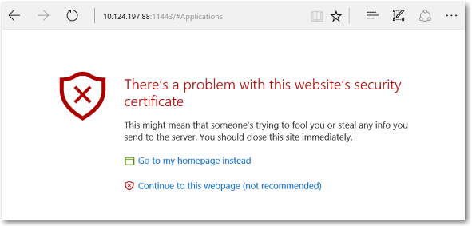

# Device Portal para Xbox

## Configurar Device Portal en Xbox

### Habilitar Device Portal

**Para habilitar Device Portal**

1. Selecciona el icono Página principal para desarrolladores de la pantalla principal (consulta la imagen)  

2. En Dev Home, navega a la herramienta **Administración remota** 
3. Selecciona **Administrar Windows Device Portal** y presiona **A**
4. Selecciona la opción **Habilitar Windows Device Portal**
5. Escribe el nombre de usuario y la contraseña que usarás para autenticar el acceso a tu kit de desarrollo desde un explorador, y guárdalos.
6. Cierra la página de configuración y ten en cuenta la dirección URL que se muestra en la herramienta Administración remota para conectarte.
7. Escribe la dirección URL en el explorador y, a continuación, inicia sesión con las credenciales que has configurado.
8. Recibirás una advertencia acerca del certificado proporcionado, similar a la que se muestra a continuación. Debes hacer clic en **Continuar en este sitio web** para acceder a Windows Device Portal en la versión preliminar.

## Páginas de Device Portal

Device Portal en Xbox proporciona un conjunto de páginas estándar. Para obtener descripciones detalladas, consulta [Windows Device Portal overview (Introducción a Windows Device Portal)](device-portal.md).

- Aplicaciones
- Rendimiento
- Redes

<!--HONumber=Jun16_HO4-->

