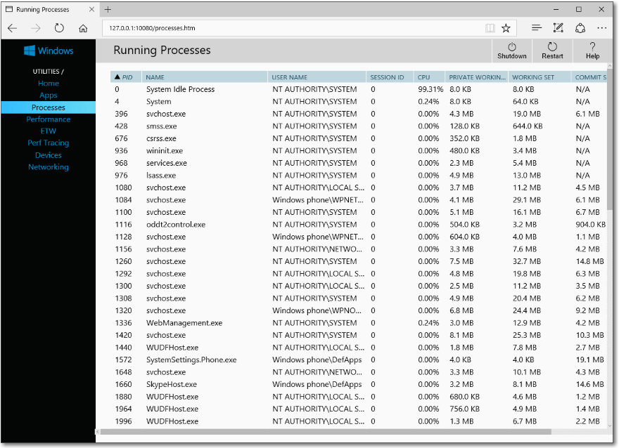
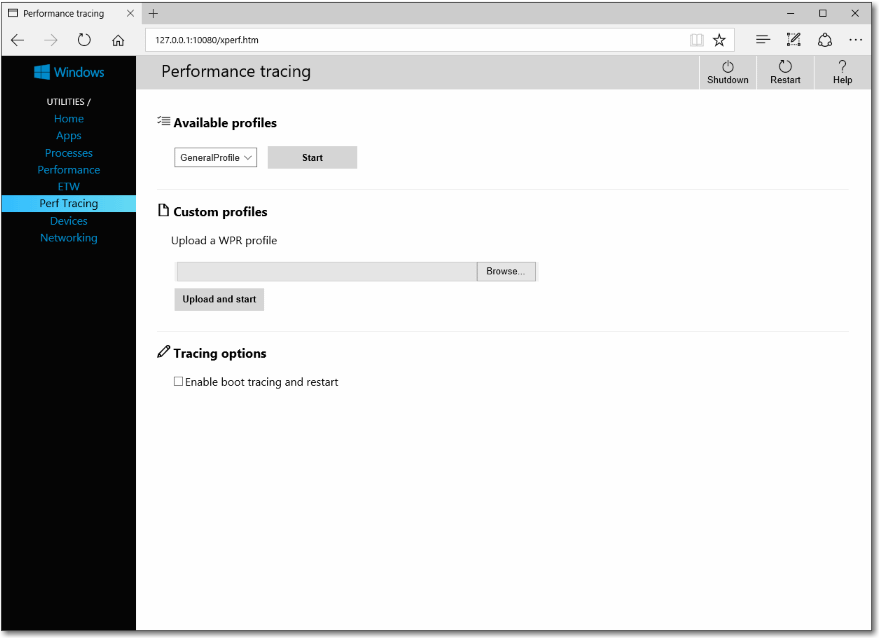
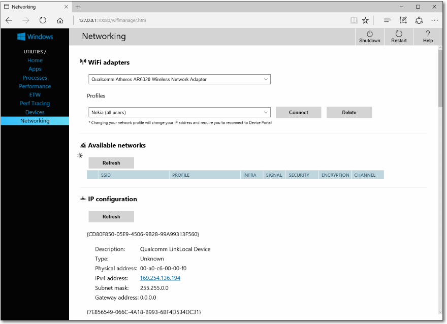

# <a name="windows-device-portal-overview"></a>Introducción a Windows Device Portal

Windows Device Portal te permite configurar y administrar de forma remota el dispositivo mediante una red o una conexión USB. También proporciona herramientas de diagnóstico para ayudarle a solucionar problemas y ver el rendimiento en tiempo real de su dispositivo de Windows.

Portal de dispositivo de Windows es un servidor web en su dispositivo que pueden conectarse a desde un explorador web en un PC. Si su dispositivo no tiene un explorador web, también puede conectar localmente con el explorador en ese dispositivo.

Portal de dispositivo de Windows está disponible en la familia de cada dispositivo, pero las características y el programa de instalación varían en función de los requisitos de cada dispositivo. En este artículo se proporciona una descripción general de Device Portal y vínculos a artículos con información más específica para cada familia de dispositivos.

La funcionalidad del Portal del dispositivo de Windows se implementa con [Las API de REST](device-portal-api-core.md) que puede usar directamente para obtener acceso a datos y controlar el dispositivo mediante programación.

## <a name="setup"></a>Programa de instalación

Cada dispositivo tiene instrucciones específicas para la conexión a Device Portal, pero todos requieren estos pasos generales:
1. Habilitar modo de programador y Portal de dispositivo en su dispositivo (configurado en la aplicación de configuración).
2. Conecte el dispositivo y su PC a través de una red local o con USB.
3. Navega a la página Device Portal en tu explorador. Esta tabla muestran los puertos y protocolos utilizados por cada familia de dispositivo.

Familia de dispositivos | ¿De forma predeterminada? | HTTP | HTTPS | USB
--------------|----------------|------|-------|----
HoloLens | Sí, en el modo de desarrollador | 80 (predeterminado) | 443 (predeterminado) | http://127.0.0.1:10080
IoT | Sí, en el modo de desarrollador | 8080 | Habilitar a través de la clave del Registro | N/D
Xbox | Habilitar dentro del modo de desarrollador | Deshabilitado | 11443 | N/D
Escritorio| Habilitar dentro del modo de desarrollador | 50080\* | 50043\* | N/D
Phone | Habilitar dentro del modo de desarrollador | 80| 443 | http://127.0.0.1:10080

\ * No siempre es el caso, ya que Device Portal para escritorio reclama puertos del rango efímero (> 50000) para evitar conflictos con reclamaciones de puertos existentes en el dispositivo. Para obtener más información, consulta la sección de [Configuración de puertos](device-portal-desktop.md#registry-based-configuration-for-device-portal) referente a los equipos de escritorio.  

Para obtener instrucciones específicas sobre la configuración del dispositivo, consulta:
- [Device Portal para HoloLens](https://docs.microsoft.com/windows/uwp/debug-test-perf/device-portal-hololens)
- [Device Portal para IoT](https://go.microsoft.com/fwlink/?LinkID=616499)
- [Device Portal para dispositivos móviles](device-portal-mobile.md)
- [Device Portal para Xbox](device-portal-xbox.md)
- [Device Portal para escritorio](device-portal-desktop.md#set-up-device-portal-on-windows-desktop)

## <a name="features"></a>Funciones

### <a name="toolbar-and-navigation"></a>Barra de herramientas y navegación

La barra de herramientas en la parte superior de la página proporciona acceso a las características de usados con más frecuencia.
- **Alimentación**: obtener acceso a opciones de energía.
  - **Apagar**: apaga el dispositivo.
  - **Reiniciar**: vuelve a iniciar el dispositivo.
- **Ayuda**: abre la página de ayuda.

Usa los vínculos del panel de navegación en el lado izquierdo de la página para navegar a las herramientas de administración y supervisión disponibles del dispositivo.

Aquí se describen las herramientas que son comunes entre las familias de dispositivo. Puede que haya otras opciones disponibles en función del dispositivo. Para obtener más información, vea la página correspondiente a su tipo de dispositivo específica.

### <a name="apps-manager"></a>Administrador de aplicaciones

El Administrador de aplicaciones proporciona instalar o desinstalar y funcionalidad de administración para la aplicación se empaqueta y se reúne en el dispositivo de host.


- **Aplicaciones instaladas**: usar el menú desplegable para quitar o iniciar aplicaciones que están instaladas en el dispositivo. Instalar una aplicación nueva haciendo clic en **Agregar**. Esto inicia la instalación de experiencia de usuario para implementar aplicaciones de empaquetado de local, red o web hospeda y registrar archivos sueltos desde recursos compartidos de red.
- **Ejecutar aplicaciones**: obtener información acerca de las aplicaciones que se están ejecutando actualmente y cerrarlos según sea necesario.

#### <a name="install-an-app"></a>Instalar una aplicación

1.  Cuando hayas creado un paquete de la aplicación, podrás instalarlo remotamente en el dispositivo. Después de compilarlo en Visual Studio, se genera una carpeta de salida.
  
2.  En la sección de administrador de aplicaciones del Portal de dispositivo, haga clic en **Agregar** y seleccione **instalar el paquete de la aplicación desde el almacenamiento local**.
3.  Haga clic en **Examinar** y busque el paquete de la aplicación.
3.  Haga clic en **Examinar** y busque el archivo de certificado (_.cer_) (no es necesario en todos los dispositivos.)
4.  Casillas de verificación la respectivos si desea instalar opcional o paquetes de framework junto con la instalación de la aplicación. Si tienes más de una, agrega cada una de ellas individualmente.     
5.  Haga clic en **siguiente** para mover a la siguiente paso e **instalar** iniciar la instalación. 

#### <a name="uninstall-an-app"></a>Desinstalar una aplicación
1.  Asegúrate de que la aplicación no se esté ejecutando. 
2.  Si es así, vaya a la **ejecución de aplicaciones** y ciérrelo. Si se intenta desinstalar mientras se ejecuta la aplicación, provocará problemas cuando intenta reinstalar la aplicación. 
3.  Seleccione la aplicación en la lista desplegable y haga clic en **Quitar**.

### <a name="running-processes"></a>Procesos en ejecución

Esta página muestra detalles acerca de los procesos que se están ejecutando actualmente en el dispositivo de host. Esto incluye aplicaciones y procesos del sistema. En algunas plataformas (escritorio, IoT y HoloLens), puede terminar procesos.



### <a name="file-explorer"></a>Explorador de archivos

Esta página le permite ver y manipular los archivos almacenados por cualquier aplicaciones sideloaded. Consulte el blog [utilizando el Explorador de archivos de la aplicación](https://blogs.windows.com/buildingapps/2016/06/08/using-the-app-file-explorer-to-see-your-app-data/) para obtener más información sobre el Explorador de archivos y cómo usarlo. 


### <a name="performance"></a>Rendimiento

Gráficos en tiempo real de información de diagnóstico del sistema como el uso de la energía, velocidad de fotogramas, muestra la página de rendimiento y de carga de CPU.

Estas son las métricas disponibles:
- **CPU**: porcentaje de uso de CPU total disponible
- **Memoria**: Total, en uso, disponible, confirmado, paginada y no paginada
- **E/S**: las cantidades de datos de lectura y escritura
- **Red**: recibido y enviado datos
- **GPU**: utilización del motor por ciento del total GPU disponible


### <a name="event-tracing-for-windows-etw-logging"></a>Registro de seguimiento para Windows (ETW) (evento)

La página de registro de ETW administra la información de seguimiento de eventos para Windows (ETW) en tiempo real en el dispositivo.


Activa **Ocultar proveedores** para mostrar solamente la lista de eventos.
- **Registered proveedores**: seleccione el proveedor de eventos y el nivel de seguimiento. El nivel de seguimiento es uno de estos valores:
  1. Terminación o salida anómala
  2. Errores graves
  3. Advertencias
  4. Advertencias sin errores
  5. Seguimiento detallado

  Haz clic o pulsa en **Activar** para iniciar el seguimiento. El proveedor se agrega a la lista desplegable de **Proveedores habilitados**.
- **Proveedores personalizados**: selecciona un proveedor ETW personalizado y el nivel de seguimiento. Identifica el proveedor por su GUID. No incluya los corchetes en el GUID.
- **Proveedores de habilitada**: muestra una lista de los proveedores de habilitado. Selecciona un proveedor de la lista desplegable y haz clic o pulsa en **Desactivar** para detener el seguimiento. Haz clic o pulsa en **Detener todo** para suspender todos los seguimientos.
- **Historial de proveedores**: muestra los proveedores de ETW que se han habilitado durante la sesión actual. Haz clic o pulsa en **Activar** para activar un proveedor deshabilitado. Haz clic o pulsa en **Borrar** para borrar el historial.
- **Filtros / eventos**: la sección de **eventos** enumera los eventos ETW de los proveedores seleccionados en formato de tabla. En la tabla se actualiza en tiempo real. Use el menú **filtros** para configurar filtros personalizados para la que se mostrarán los eventos. Haga clic en el botón **Borrar** para eliminar todos los eventos ETW de la tabla. Esta acción no deshabilita ningún proveedor. Puede hacer clic en **Guardar en archivo** para exportar los eventos ETW actualmente recopilados en un archivo CSV local.

Para obtener más detalles sobre el uso de registro de ETW, consulte el [Uso del Portal de dispositivo para ver los registros de depuración de](https://blogs.windows.com/buildingapps/2016/06/10/using-device-portal-to-view-debug-logs-for-uwp/) blog. 

### <a name="performance-tracing"></a>Seguimiento de rendimiento

La página de seguimiento de rendimiento permite ver los seguimientos de [Grabadora de rendimiento de Windows (ELTO)](https://msdn.microsoft.com/library/hh448205.aspx) desde el dispositivo de host.



- **Available profiles**: selecciona el perfil de WPR en la lista desplegable y pulsa o haz clic en **Inicio** para iniciar el seguimiento.
- **Custom profiles**: haz clic o pulsa en **Examinar** para elegir un perfil de WPR desde tu equipo. Haz clic o pulsa en **Cargar e iniciar** para iniciar el seguimiento.

Para detener el seguimiento, haz clic en **Detener**. Permanecer en esta página hasta que el archivo de seguimiento (. ETL) ha terminado de descargar.

Capturados. Archivos ETL se pueden abrir para su análisis en el [Analizador de rendimiento de Windows](https://msdn.microsoft.com/library/windows/desktop/hh448170.aspx).

### <a name="device-manager"></a>Administrador de dispositivos

La página del Administrador de dispositivos enumera todos los periféricos conectados al dispositivo. Puede hacer clic en los iconos de configuración para ver las propiedades de cada uno.


### <a name="networking"></a>Redes

La página red administra las conexiones de red en el dispositivo. A menos que están conectados al dispositivo Portal a través de USB, modificación de esta configuración es probable que le desconectará de Portal de dispositivo.
- **Redes disponibles**: muestra las redes WiFi disponibles para el dispositivo. Al pulsar o hacer clic en una red, podrás conectarte a ella y proporcionar una clave de paso si es necesario. Portal de dispositivo aún no admite la autenticación de empresa. También puede usar la lista desplegable de **perfiles** para intentar conectarse a cualquiera de los perfiles de WiFi conocidos para el dispositivo.
- **Configuración de IP**: muestra información acerca de cada uno de los host de la dirección de los puertos de red del dispositivo.



## <a name="service-features-and-notes"></a>Notas y las características del servicio

### <a name="dns-sd"></a>DNS-SD

Device Portal anuncia su presencia en la red local mediante DNS-SD. Todas las instancias de Device Portal, independientemente del tipo de dispositivo, se anuncian en "WDP._wdp._tcp.local". Los registros TXT de la instancia del servicio proporcionan lo siguiente:

Tecla | Tipo | Descripción 
----|------|-------------
S | entero | Puerto seguro para Device Portal. Si es 0 (cero), Device Portal no escucha las conexiones HTTPS. 
D | cadena | Tipo de dispositivo. Tendrá el formato "Windows.*"; por ejemplo, Windows.Xbox o Windows.Desktop.
A | cadena | Arquitectura del dispositivo. Será ARM, x86 o AMD64.  
T | lista de cadenas delineada con carácter nulo | Etiquetas aplicadas por el usuario para el dispositivo. Consulta como usarlas en la API de REST de etiquetas. La lista finaliza con carácter nulo doble.  

Se sugiere la conexión en el puerto HTTPS, ya que no todos los dispositivos escuchan en el puerto HTTP anunciado por el registro de DNS-SD. 

### <a name="csrf-protection-and-scripting"></a>Protección CSRF y scripting

A fin de ofrecer protección frente a [ataques CSRF](https://wikipedia.org/wiki/Cross-site_request_forgery), se requiere un token único en todas las solicitudes no GET. Este token, el encabezado de la solicitud X-CSRF-Token, se deriva de una cookie de sesión, CSRF-Token. En la interfaz de usuario web de Device Portal, la cookie CSRF-Token se copia en el encabezado X-CSRF-Token en cada solicitud.

> [!IMPORTANT]
> Esta protección impide que los usos de las API de REST desde un cliente independiente (por ejemplo, las utilidades de línea de comandos). Esto puede resolverse de 3 maneras: 
> - Use un nombre de usuario "auto-". Los clientes que antepongan "auto-" a su nombre de usuario omitirán la protección CSRF. Es importante que este nombre de usuario no se use para iniciar sesión en Device Portal a través del explorador, ya que abrirá el servicio a los ataques CSRF. Ejemplo: Si el nombre de usuario de Device Portal es "admin", debe usarse ```curl -u auto-admin:password <args>``` para omitir la protección CSRF. 
> - Implementa el esquema de cookie a encabezado en el cliente. Se requiere una solicitud GET para establecer la cookie de sesión y, después, la inclusión del encabezado y la cookie en todas las solicitudes posteriores. 
> - Deshabilita la autenticación y usa HTTP. La protección CSRF solo se aplica a los extremos HTTPS, para que las conexiones en extremos HTTP no tengan que realizar las acciones anteriores. 

#### <a name="cross-site-websocket-hijacking-cswsh-protection"></a>Protección contra Cross-Site WebSocket Hijacking (CSWSH)

Para protegerse de los [ataques de CSWSH](https://www.christian-schneider.net/CrossSiteWebSocketHijacking.html), todos los clientes que abran una conexión WebSocket al Device Portal también deben proporcionar un encabezado Origin que coincida con el encabezado Host. Esto demuestra a Device Portal que la solicitud proviene de la interfaz de usuario de Device Portal o de una aplicación cliente válida. Sin el encabezado Origin, la solicitud se rechazará. 
