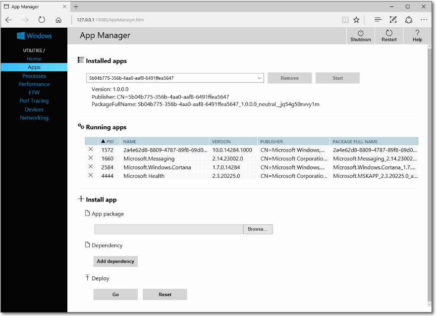

# <a name="windows-device-portal-overview"></a>Introducción a Windows Device Portal

Windows Device Portal te permite configurar y administrar de forma remota el dispositivo mediante una red o una conexión USB. También proporciona herramientas de diagnóstico para ayudarte a solucionar problemas y ver el rendimiento en tiempo real de tu dispositivo Windows.

Device Portal es un servidor web del dispositivo al que te puedes conectar desde un explorador web en el equipo. Si el dispositivo tiene un explorador web, también puedes conectarte localmente con el explorador en el dispositivo.

Windows Device Portal está disponible en cada familia de dispositivos, pero las características y la configuración varían en función de los requisitos del dispositivo. En este artículo se proporciona una descripción general de Device Portal y vínculos a artículos con información más específica para cada familia de dispositivos.

Todo lo que contiene Windows Device Portal se basa en las [API de REST](device-portal-api-core.md) que puedes usar para acceder a los datos y controlar el dispositivo mediante programación.

## <a name="setup"></a>Programa de instalación

Cada dispositivo tiene instrucciones específicas para la conexión a Device Portal, pero todos requieren estos pasos generales:
1. Habilita el modo de desarrollador y Device Portal en el dispositivo.
2. Conecta el dispositivo y el equipo a través de la red local o USB.
3. Navega a la página Device Portal en tu explorador. En esta tabla se muestran los puertos y los protocolos que usa cada familia de dispositivos.

Familia de dispositivos | ¿De forma predeterminada? | HTTP | HTTPS | USB
--------------|----------------|------|-------|----
HoloLens | Sí, en el modo de desarrollador | 80 (predeterminado) | 443 (predeterminado) | http://127.0.0.1:10080
IoT | Sí, en el modo de desarrollador | 8080 | Habilitar a través de la clave del Registro | N/D
Xbox | Habilitar dentro del modo de desarrollador | Deshabilitado | 11443 | N/D
Escritorio| Habilitar dentro del modo de desarrollador | 50080\* | 50043\* | N/D
Phone | Habilitar dentro del modo de desarrollador | 80| 443 | http://127.0.0.1:10080

\ * No siempre es el caso, ya que Device Portal para escritorio reclama puertos del rango efímero (> 50000) para evitar conflictos con reclamaciones de puertos existentes en el dispositivo.  Para obtener más información, consulta la sección de [Configuración de puertos](device-portal-desktop.md#setting-port-numbers) referente a los equipos de escritorio.  

Para obtener instrucciones específicas sobre la configuración del dispositivo, consulta:
- [Device Portal para HoloLens](https://docs.microsoft.com/en-us/windows/uwp/debug-test-perf/device-portal-hololens)
- [Device Portal para IoT](https://go.microsoft.com/fwlink/?LinkID=616499)
- [Device Portal para dispositivos móviles](device-portal-mobile.md)
- [Device Portal para Xbox](device-portal-xbox.md)
- [Device Portal para escritorio](device-portal-desktop.md#set-up-device-portal-on-windows-desktop)

## <a name="features"></a>Funciones

### <a name="toolbar-and-navigation"></a>Barra de herramientas y navegación

La barra de herramientas de la parte superior de la página proporciona acceso al estado usado frecuentemente y a las características.
- **Apagar**: apaga el dispositivo.
- **Reiniciar**: vuelve a iniciar el dispositivo.
- **Ayuda**: abre la página de ayuda.

Usa los vínculos del panel de navegación en el lado izquierdo de la página para navegar a las herramientas de administración y supervisión disponibles del dispositivo.

Aquí se describen las herramientas que son comunes en todos los dispositivos. Puede que haya otras opciones disponibles en función del dispositivo. Para obtener más información, consulta la página específica del dispositivo.

### <a name="home"></a>Página principal

La sesión de Device Portal se inicia en la página principal. La página principal generalmente tiene información acerca del dispositivo, como el nombre y la versión del sistema operativo y las preferencias que puedes establecer para el dispositivo.

### <a name="apps"></a>Aplicaciones

Proporciona la funcionalidad de administración y de instalación o desinstalación de paquetes AppX y agrupaciones de trabajos del dispositivo.



- **Aplicaciones instaladas**: quita e inicia aplicaciones.
- **Aplicaciones en ejecución**: se enumeran las aplicaciones en ejecución y se proporciona la opción para cerrarlas.
- **Instalar aplicación**: selecciona paquetes de la aplicación para la instalación desde una carpeta en el equipo o red.
- **Dependencia**: agrega las dependencias de la aplicación que se va a instalar.
- **Implementar**: implementa la aplicación seleccionada y las dependencias en el dispositivo.

**Para instalar una aplicación**

1.  Cuando hayas [creado un paquete de la aplicación](https://msdn.microsoft.com/library/windows/apps/xaml/hh454036(v=vs.140).aspx), podrás instalarlo remotamente en el dispositivo. Después de compilarlo en Visual Studio, se genera una carpeta de salida.

    
2.  Haz clic en Examinar y busca el paquete de la aplicación (.appx).
3.  Haz clic en Examinar y busca el archivo de certificado (.cer). (No es necesario en todos los dispositivos).
4.  Agrega dependencias. Si tienes más de una, agrega cada una de ellas individualmente.     
5.  En **Implementar**, haz clic en **Ir**. 
6.  Para instalar otra aplicación, haz clic en el botón **Restablecer** para borrar los campos.


**Para desinstalar una aplicación**

1.  Asegúrate de que la aplicación no se esté ejecutando. 
2.  Si es así, ve a "aplicaciones en ejecución" y ciérrala. Si intentas desinstalar la aplicación mientras se ejecuta, tendrás problemas cuando la vuelvas a instalar. 
3.  Cuando estés listo, haz clic en **Desinstalar**.

### <a name="processes"></a>Procesos

Muestra detalles acerca de los procesos que se ejecutan actualmente. Esto incluye aplicaciones y procesos del sistema.

De forma muy parecida al Administrador de tareas del equipo, esta página te permite ver los procesos que se están ejecutando actualmente, así como su uso de memoria.  En algunas plataformas (escritorio, IoT y HoloLens), puedes finalizar los procesos.


### <a name="performance"></a>Rendimiento

Muestra gráficos en tiempo real de la información de diagnóstico del sistema, como el uso de energía, la velocidad de fotogramas y la carga de la CPU.

Estas son las métricas disponibles:
- **CPU**: porcentaje del total disponible
- **Memoria**: total, en uso, disponible, confirmada, paginada y no paginada
- **GPU**: uso del motor de la GPU, porcentaje del total disponible
- **E/S**: lecturas y escrituras
- **Red**: envíos y recepciones


### <a name="event-tracing-for-windows-etw"></a>Seguimiento de eventos para Windows (ETW)

Administra el seguimiento de eventos para Windows (ETW) en tiempo real en el dispositivo.


Activa **Ocultar proveedores** para mostrar solamente la lista de eventos.
- **Registered providers**: selecciona el proveedor ETW y el nivel de seguimiento. El nivel de seguimiento es uno de estos valores:
    1. Terminación o salida anómala
    2. Errores graves
    3. Advertencias
    4. Advertencias sin errores
    5. Seguimiento detallado (*)

Haz clic o pulsa en **Activar** para iniciar el seguimiento. El proveedor se agrega a la lista desplegable de **Proveedores habilitados**.
- **Proveedores personalizados**: selecciona un proveedor ETW personalizado y el nivel de seguimiento. Identifica el proveedor por su GUID. No incluyas corchetes en el GUID.
- **Proveedores habilitados**: enumera los proveedores habilitados. Selecciona un proveedor de la lista desplegable y haz clic o pulsa en **Desactivar** para detener el seguimiento. Haz clic o pulsa en **Detener todo** para suspender todos los seguimientos.
- **Providers history**: muestra los proveedores ETW que estaban habilitados durante la sesión actual. Haz clic o pulsa en **Activar** para activar un proveedor deshabilitado. Haz clic o pulsa en **Borrar** para borrar el historial.
- **Eventos**: enumera los eventos ETW de los proveedores seleccionados en formato de tabla. Esta tabla se actualiza en tiempo real. Debajo de la tabla, haz clic en el botón **Borrar** para eliminar todos los eventos ETW de la tabla. Esta acción no deshabilita ningún proveedor. Puedes hacer clic en **Guardar en archivo** para exportar los eventos ETW recopilados actualmente en un archivo CSV de forma local.

Para obtener más información sobre el uso del seguimiento de ETW, consulta la [entrada de blog](https://blogs.windows.com/buildingapps/2016/06/10/using-device-portal-to-view-debug-logs-for-uwp/) sobre cómo usarlo para recopilar registros en tiempo real de la aplicación. 

### <a name="performance-tracing"></a>Seguimiento del rendimiento

Captura los seguimientos de [Windows Performance Recorder](https://msdn.microsoft.com/library/windows/hardware/hh448205.aspx) (WPR) del dispositivo.


- **Available profiles**: selecciona el perfil de WPR en la lista desplegable y pulsa o haz clic en **Inicio** para iniciar el seguimiento.
- **Custom profiles**: haz clic o pulsa en **Examinar** para elegir un perfil de WPR desde tu equipo. Haz clic o pulsa en **Cargar e iniciar** para iniciar el seguimiento.

Para detener el seguimiento, haz clic en **Detener**. Permanece en esta página hasta que el archivo de seguimiento (. ETL) se haya terminado de descargar.

Los archivos ETL se pueden abrir para realizar análisis en [Windows Performance Analyzer](https://msdn.microsoft.com/library/windows/hardware/hh448170.aspx).

### <a name="devices"></a>Dispositivos

Enumera todos los periféricos conectados al dispositivo.


### <a name="networking"></a>Redes

Administra las conexiones de red en el dispositivo.  A menos que estés conectado a Device Portal a través de USB, al cambiar esta configuración, es probable que te desconectes de Device Portal.
- **Perfiles**: selecciona un perfil de Wi-Fi diferente para usar.  
- **Redes disponibles**: redes Wi-Fi disponibles para el dispositivo. Al pulsar o hacer clic en una red, podrás conectarte a ella y proporcionar una clave de paso si es necesario. Nota: Device Portal aún no admite la autenticación empresarial. 


### <a name="app-file-explorer"></a>Explorador de archivos de la aplicación

Te permite ver y manipular los archivos almacenados por las aplicaciones transferidas localmente.  Esta es una nueva versión multiplataforma de la [Isolated Storage Explorer](https://msdn.microsoft.com/library/windows/apps/hh286408(v=vs.105).aspx) desde Windows Phone 8.1. Consulta [esta entrada de blog](https://blogs.windows.com/buildingapps/2016/06/08/using-the-app-file-explorer-to-see-your-app-data/) para obtener más información sobre el Explorador de archivos de la aplicación y cómo usarla. 


## <a name="service-features-and-notes"></a>Notas y características del servicio

### <a name="dns-sd"></a>DNS-SD

Device Portal anuncia su presencia en la red local mediante DNS-SD.  Todas las instancias de Device Portal, independientemente del tipo de dispositivo, se anuncian en "WDP._wdp._tcp.local". Los registros TXT de la instancia del servicio proporcionan lo siguiente:

Tecla | Tipo | Descripción 
----|------|-------------
S | entero | Puerto seguro para Device Portal.  Si es 0 (cero), Device Portal no escucha las conexiones HTTPS. 
D | cadena | Tipo de dispositivo.  Tendrá el formato "Windows.*"; por ejemplo, Windows.Xbox o Windows.Desktop.
A | cadena | Arquitectura del dispositivo.  Será ARM, x86 o AMD64.  
T | lista de cadenas delineada con carácter nulo | Etiquetas aplicadas por el usuario para el dispositivo. Consulta como usarlas en la API de REST de etiquetas. La lista finaliza con carácter nulo doble.  

Se sugiere la conexión en el puerto HTTPS, ya que no todos los dispositivos escuchan en el puerto HTTP anunciado por el registro de DNS-SD. 

### <a name="csrf-protection-and-scripting"></a>Protección CSRF y scripting

A fin de ofrecer protección frente a [ataques CSRF](https://wikipedia.org/wiki/Cross-site_request_forgery), se requiere un token único en todas las solicitudes no GET. Este token, el encabezado de la solicitud X-CSRF-Token, se deriva de una cookie de sesión, CSRF-Token. En la interfaz de usuario web de Device Portal, la cookie CSRF-Token se copia en el encabezado X-CSRF-Token en cada solicitud.

**Importante** Esta protección impide usar las API de REST desde un cliente independiente (por ejemplo, las utilidades de línea de comandos). Esto puede resolverse de 3 maneras: 

1. Uso del nombre de usuario "auto-". Los clientes que antepongan "auto-" a su nombre de usuario omitirán la protección CSRF. Es importante que este nombre de usuario no se use para iniciar sesión en Device Portal a través del explorador, ya que abrirá el servicio a los ataques CSRF. Ejemplo: Si el nombre de usuario de Device Portal es "admin", debe usarse ```curl -u auto-admin:password <args>``` para omitir la protección CSRF. 

2. Implementa el esquema de cookie a encabezado en el cliente. Se requiere una solicitud GET para establecer la cookie de sesión y, después, la inclusión del encabezado y la cookie en todas las solicitudes posteriores. 
 
3. Deshabilita la autenticación y usa HTTP. La protección CSRF solo se aplica a los extremos HTTPS, para que las conexiones en extremos HTTP no tengan que realizar las acciones anteriores. 

**Nota**: Un nombre de usuario que comience por "auto-" no podrá iniciar sesión en Device Portal a través del explorador.  

#### <a name="cross-site-websocket-hijacking-cswsh-protection"></a>Protección contra Cross-Site WebSocket Hijacking (CSWSH)

Para protegerse de los [ataques de CSWSH](https://www.christian-schneider.net/CrossSiteWebSocketHijacking.html), todos los clientes que abran una conexión WebSocket al Device Portal también deben proporcionar un encabezado Origin que coincida con el encabezado Host.  Esto demuestra a Device Portal que la solicitud proviene de la interfaz de usuario de Device Portal o de una aplicación cliente válida.  Sin el encabezado Origin, la solicitud se rechazará. 
