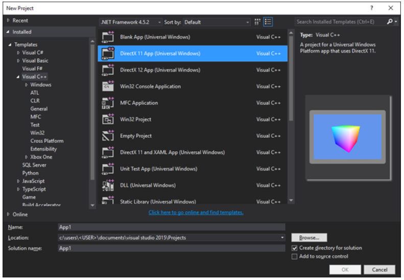
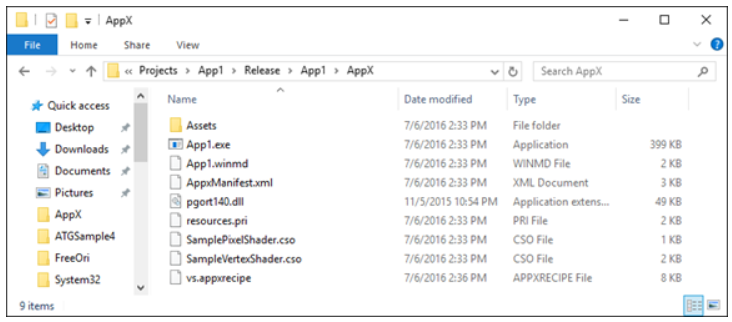
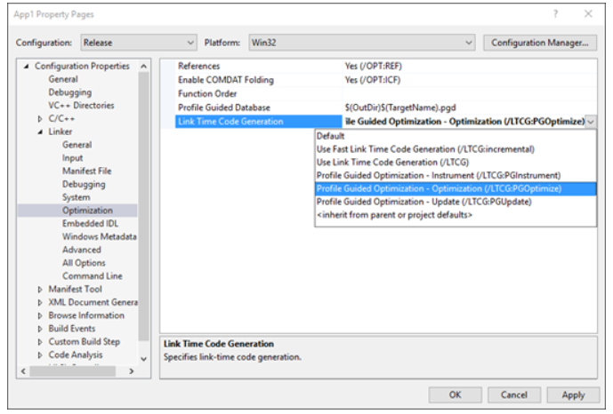

# <a name="running-profile-guided-optimization-on-universal-windows-platform-apps"></a>Ejecutar la Optimización guiada por perfiles en aplicaciones para Plataforma universal de Windows 
 
Este tema se ofrece una guía paso a paso para aplicar la Optimización de guiada de perfil (PGO) a las aplicaciones para Plataforma universal de Windows (UWP). Dado que no todos los pasos disponibles para las aplicaciones clásicas de win32 están disponibles para las aplicaciones para UWP, nuestro objetivo es explicar el proceso necesario para incorporar PGO para que la optimización les resulte más sencilla y más accesible a los desarrolladores de UWP.

El siguiente es un tutorial básico sobre cómo aplicar PGO a la plantilla de aplicación DirectX 11 (UWP) predeterminada mediante el uso de VisualStudio2015Update3.
 
Las capturas de pantalla en este tutorial se basan en el siguiente nuevo proyecto: 

Para aplicar PGO a la plantilla de aplicación DirectX 11:

1. Establece la configuración de solución en **Liberar** o elige una configuración de solución en la que vas a generar código optimizado para liberar. Aunque teóricamente pudieras ejecutar PGO en una versión de depuración, no sería eficaz usar PGO para optimizar una compilación que de otro modo no se optimizaría. 
 
 
 
2. Comprueba en las propiedades del proyecto (**Propiedades** > **C/C++** > **Optimización**) que estás compilando con la marca /GL para **Optimización de todo el programa** (es posible que tu configuración ya haya establecido esto).

 

3. Ve a las propiedades del enlazador (**Propiedades** > **Enlazador** > **Optimización**) y establece el valor de **Generación de código en tiempo de vínculo** en **Optimización guiada por perfiles - Instrumento (LTCG:PGInstrument)**.
 
 

4. Selecciona **Compilar solución** y luego **Implementar solución**. 

 
 
 Puedes comprobar que todo haya funcionado correctamente si observas la ubicación de resultado de la compilación y verificas que se ha generado un archivo .pgd. En este caso de ejemplo, esto significa que se generó el siguiente archivo junto con el resultado de la compilación:
 
 `C:\Users\<USER>\Documents\Visual Studio 2015\Projects\App1\Release\App1\App1.pgd`

 De manera predeterminada, el archivo .pgd tendrá el mismo nombre que el archivo ejecutable. También puedes cambiar el nombre del archivo .pgd que se genera modificando la opción de enlazador **Base de datos guiada por perfiles**. 
 
5. Navega al directorio de archivos binarios de VC de Visual Studio (de forma predeterminada, es similar a `C:\Program Files (x86)\Microsoft Visual Studio 14.0\VC\bin`). Para los archivos ejecutables x86, copia `pgort140.dll`; para los archivos ejecutables x64, copia la versión de x64 desde `amd64\pgort140.dll`. Pega la versión apropiada de `pgort140.dll` en la raíz del paquete implementado. Para este ejemplo, la ruta de acceso es la siguiente:

 `C:\Users\<USER>\Documents\Visual Studio 2015\Projects\App1\Release\App1\AppX\`

 Este paso es necesario porque las aplicaciones para UWP solo pueden cargar bibliotecas que existen dentro de su paquete.

 
 
6. Ejecuta la aplicación desde el menú Inicio o desde Visual Studio (menú **Depurar** con la opción **Iniciar sin depurar**). 

 
 
7. La compilación que ahora está en ejecución se instrumenta y genera datos de PGO. En este punto, debes ejecutar la aplicación en algunos de los escenarios más habituales que quieras optimizar. Una vez ejecutado el programa en los escenarios previstos, busca la herramienta pgosweep.exe ubicada en la misma carpeta en la que encontraste la versión adecuada de `pgort140.dll`. Como alternativa, un símbolo del sistema de las herramientas nativas de Visual Studio (x86/x64) ya tendrá la versión correcta en su ruta de acceso. Para recopilar los datos de PGO, ejecuta el siguiente comando mientras la aplicación aún está en ejecución para generar un archivo .pgc que contendrá los datos de generación de perfiles:
 
  `pgosweep.exe <executable name> <output file>` 
 
  También puedes buscar en la ayuda de pgosweep.exe (`pgosweep.exe /help`) para consultar otros argumentos opcionales que se usan para controlar la forma en que se recopilan los datos de PGO.
 
  Es conveniente generar la salida de los archivos .pgc en la ubicación de compilación donde se encuentra el archivo .pgd y, además, designar los archivos `<PGDName>!<RunIdentifier>.pgc`. Para este ejemplo, esto suponía:
 
  ```
  pgosweep.exe App1.exe “C:\Users\<USER>\Documents\Visual Studio 2015\Projects\App1\Release\App1\App1!1.pgc”
  ```
 
  Una recopilación adicional también podría ser `App1!CoreScenario.pgc`, `App1!UseCase5.pgc`, etc. Si los archivos .pgc se denominan de este modo y están en la ubicación de resultado de la compilación junto con el archivo .pgd, se combinarán automáticamente durante la vinculación descrita en el paso9.
 
8. OPCIONAL: De manera predeterminada, todos los archivos .pgc denominados según se describe en el paso7 y que se hayan colocado junto al archivo .pgd se combinarán cuando se realice la vinculación y se ponderarán de forma equitativa, pero también puedes tener mayor control sobre cómo se ponderan determinadas ejecuciones. Para ello, tienes que usar la herramienta **pgomgr.exe** que también se encuentra en la misma carpeta donde encontraste la copia de `pgort140.dll` por primera vez. Por ejemplo, para combinar la ejecución `CoreScenario` con tres veces la prioridad de las otras ejecuciones, podemos usar el siguiente comando:
 
 ```
 pgomgr.exe -merge:3 “C:\Users\<USER>\Documents\Visual Studio 2015\Projects\App1\Release\App1\App1!CoreScenario.pgc” “C:\Users\<USER>\Documents\Visual Studio 2015\Projects\App1\Release\App1\App1.pgd”
 ```
 
9. Después de generar uno o varios archivos .pgc y colocarlos junto con el archivo .pgd o combinarlos manualmente (paso 8), podemos usar el enlazador para crear la compilación final optimizada. Regresa a las propiedades del enlazador (**Propiedades** > **Enlazador** > **Optimización**) y establece el valor de **Generación de código en tiempo de vínculo** en **Optimización guiada por perfiles - Instrumento (LTCG:PGInstrument)** y comprueba que **Base de datos guiada por perfiles** apunte al archivo .pgd que intentas usar (si no has cambiado esto, todo debería estar en orden).

 
 
10. De este modo, cuando se compile el proyecto, el enlazador llamará a pgomgr.exe para combinar cualquier archivo `<PGDName>!*.pgc` con el archivo .pgd con el peso predeterminado de 1 y la aplicación resultante se optimizará según los datos de la generación de perfiles.

## <a name="see-also"></a>Consulta también
- [Rendimiento](performance-and-xaml-ui.md)

 

