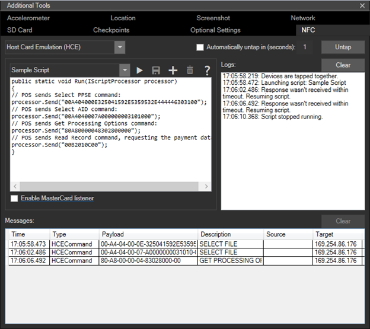
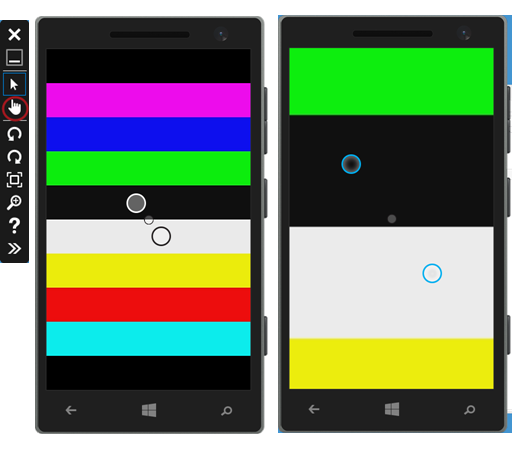
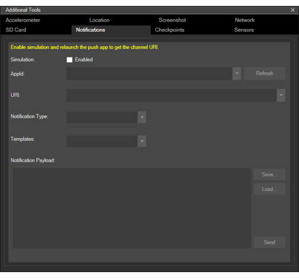

# <a name="test-with-the-microsoft-emulator-for-windows-10-mobile"></a>Pruebas con en el Emulador de Microsoft para Windows10 Mobile

Simula la interacción en el mundo real con un dispositivo y prueba las funciones de tu aplicación con las herramientas que se incluyen en el Emulador de Microsoft para Windows10 Mobile. El emulador es una aplicación de escritorio que simula un dispositivo móvil que ejecuta Windows10. Proporciona un entorno virtualizado en el que puedes depurar y probar aplicaciones de Windows sin un dispositivo físico. También proporciona un entorno aislado para prototipos de la aplicación.

El emulador ha sido diseñado para proporcionar unas prestaciones comparables a las de un dispositivo real. No obstante, antes de publicar tu aplicación en la Microsoft Store, te recomendamos que la pruebes en un dispositivo físico.

Puedes probar tu aplicación universal con una imagen de emulador de Windows 10 Mobile para diversas resoluciones de pantalla y configuraciones de tamaño de pantalla. Puedes simular la interacción en el mundo real con un dispositivo y probar varias funciones de tu aplicación con las herramientas que se incluyen en el Emulador de Microsoft.

## <a name="system-requirements"></a>Requisitos del sistema

El equipo debe cumplir los siguientes requisitos:

CPU (estas opciones de configuración, si está disponible, pueden estar habilitados en el BIOS)

-   Virtualización asistida por hardware ([comprobar la compatibilidad](https://www.microsoft.com/download/details.aspx?id=592)).
-   Traducción de direcciones de segundo nivel (SLAT).
-   Prevención de ejecución de datos basada en hardware (DEP).

RAM

-   4 GB o más.

Sistema operativo

-   Windows 8 o posterior (se recomienda encarecidamente el uso de Windows 10)
-   64 bits
-   Edición Pro o superior

Para comprobar los requisitos de BIOS, consulta [Cómo habilitar Hyper-V para el emulador de Windows Phone 8](https://msdn.microsoft.com/library/windows/apps/xaml/jj863509.aspx).

Para comprobar los requisitos de RAM y del sistema operativo, en el Panel de control, selecciona **Sistema y seguridad**y, a continuación, selecciona **Sistema**.

Microsoft Emulator para Windows 10 Mobile requiere Visual Studio 2015 o posterior; no es compatible con versiones anteriores de Visual Studio.

Emulador de Microsoft para Windows 10 Mobile no puede cargar las aplicaciones orientadas a versiones del Windows Phone OS anteriores a Windows Phone OS 7.1.

## <a name="installing-uninstalling-and-running-the-emulator"></a>Instalación, desinstalación y ejecutar el emulador

### <a name="installing"></a>Instalar
El Emulador de Microsoft para Windows 10 Mobile se incluye como parte del SDK de Windows 10. El SDK de Windows 10 y el emulador se pueden instalar como parte de la instalación de Visual Studio. Consulta la [página de descarga de Visual Studio](https://go.microsoft.com/fwlink/p/?LinkId=534785).

También puedes instalar el Emulador de Microsoft para Windows 10 Mobile con el [programa de configuración del Emulador de Microsoft](https://go.microsoft.com/fwlink/p/?LinkID=615095).

### <a name="uninstalling"></a>Desinstalación

Puedes desinstalar el Emulador de Microsoft para Windows 10 Mobile con el programa de configuración/reparación de Visual Studio. O puedes usar **Programas y características** de **Panel de control** para quitar el emulador.

Al desinstalar el Emulador de Microsoft para Windows 10 Mobile, el adaptador virtual de Ethernet para Hyper-V que se creó para que lo use el emulador no se elimina automáticamente. Puedes quitar manualmente este adaptador virtual desde **Conexiones de red** en **Panel de control**.

### <a name="running"></a>Running

Para ejecutar una aplicación en el emulador, simplemente selecciona un dispositivo emulado desde el menú desplegable **Ejecutar** en Visual Studio.


## <a name="whats-new-in-microsoft-emulator-for-windows-10-mobile"></a>Novedades del Emulador de Microsoft para Windows 10 Mobile

Además de proporcionar soporte para la Plataforma universal de Windows (UWP), el emulador ha agregado la funcionalidad siguiente:

-   Compatibilidad con el modo de entrada de mouse para diferenciar entre el mouse y la entrada táctil única.
-   Compatibilidad con NFC. El emulador permite simular NFC y hace que sea posible probar y desarrollar aplicaciones universales compatibles con NFC/proximidad.
-   La aceleración de hardware nativo mejora el rendimiento de los elementos gráficos en el emulador mediante el uso de la tarjeta gráfica local. Para poder usar la aceleración, debes tener instalada una tarjeta gráfica compatible y habilitar la aceleración en la pestaña **Sensores** de la configuración **Herramientas adicionales** de la interfaz de usuario del emulador.

## <a name="features-that-you-can-test-in-the-emulator"></a>Funciones que se pueden probar en el emulador

Además de las nuevas funciones que se mencionan en la sección anterior, puedes probar las siguientes funciones que se usan de forma común en el Emulador de Microsoft para Windows10 Mobile.

-   **Resolución de pantalla, tamaño de pantalla y memoria**. Haz que tu aplicación tenga un mercado potencial amplio probándola en varias imágenes de emulador para simular diversas resoluciones de pantalla, tamaños físicos y restricciones de memoria.


-   **Configuración de la pantalla**. Cambia el emulador del modo vertical al modo horizontal. Cambia la configuración del zoom para ajustar el emulador a tu pantalla de escritorio.

-   **Redes**. Windows Phone Emulator incorpora compatibilidad para funciones de red. Las funciones de red están habilitadas de forma predeterminada. No es necesario instalar controladores de red para Windows Phone Emulator ni configurar las opciones de red manualmente en la mayoría de los entornos.

    El emulador usa la conexión de red del equipo host. No aparece como dispositivo independiente en la red. Esto elimina algunos de los problemas de configuración que los usuarios se encontraban con el emulador del SDK de Windows Phone 8.0.

-   **Configuración de idioma y región**. Prepara tu aplicación para un mercado internacional cambiando la configuración de idioma y región para mostrar en Windows Phone Emulator.

    En el emulador en ejecución, ve a la aplicación **Configuración** , selecciona las opciones del **sistema** y después, selecciona **idioma** o **región**. Cambia la configuración que quieras probar. Si se te solicita, haz clic en **reiniciar teléfono** para aplicar la configuración nueva y reinicia el emulador.

-   **Marcación de estado y ciclo de vida de la aplicación**. Prueba el comportamiento de tu aplicación cuando esté desactivada o marcada para exclusión cambiando el valor de la opción **Marcador de exclusión tras la desactivación durante la depuración** en la página **Depurar** de las propiedades del proyecto.

-   **Almacenamiento de la carpeta local (anteriormente conocido como almacenamiento aislado)**. Los datos en el almacenamiento aislado persisten mientras el emulador se ejecuta, pero se pierden cuando el emulador se cierra.

-   **Micrófono**. Requiere y usa el micrófono en el equipo host.

-   **Teclado del teléfono**. El emulador admite la asignación del teclado de hardware del equipo de desarrollo al teclado de un Windows Phone. El comportamiento de las teclas es el mismo que en un dispositivo Windows Phone.

-   **Pantalla de bloqueo**. Con el emulador abierto, presiona dos veces F12 en el teclado del equipo. La tecla F12 emula el botón de inicio/apagado en el teléfono. Al presionar la tecla por primera vez, se apaga la pantalla. Al presionar la tecla por segunda vez, la pantalla se enciende de nuevo, con la pantalla de bloqueo activada. Desbloquea la pantalla usando el mouse para deslizar la pantalla de bloqueo hacia arriba.

## <a name="features-that-you-cant-test-in-the-emulator"></a>Características que no se pueden probar en el emulador

Prueba las características siguientes únicamente en un dispositivo físico.

-   Brújula
-   Giroscopio
-   Controlador de vibración
-   Brillo. El nivel de brillo del emulador siempre es Alto.
-   Vídeo de alta resolución. Los vídeos con una resolución superior a la resolución VGA (640x480) no se reproducen de forma confiable, sobre todo en imágenes de emulador con solo 512MB de memoria.

## <a name="mouse-input"></a>Entrada de mouse

Simula la entrada mediante mouse usando el mouse físico o el panel táctil en tu PC con Windows y el botón de la entrada del mouse en la barra de herramientas del emulador. Esta función es útil si tu aplicación proporciona al usuario la posibilidad de usar un mouse emparejado con su dispositivo de Windows 10 para proporcionar datos de entrada.

Toca el botón de entrada del mouse de la barra de herramientas del emulador para habilitar la entrada del mouse. Los eventos de clic dentro del cromo del emulador ahora se enviarán al sistema operativo Windows 10 Mobile que se está ejecutando dentro de la máquina virtual del emulador como eventos del mouse.


La pantalla del emulador con la entrada del mouse habilitada.


El botón de la entrada del mouse en la barra de herramientas del emulador.

## <a name="keyboard-input"></a>Entrada de teclado

El emulador admite la asignación del teclado de hardware del equipo de desarrollo al teclado de un Windows Phone. El comportamiento de las teclas es el mismo que en un dispositivo Windows Phone. 

De manera predeterminada, el teclado de hardware no está habilitado. Esta implementación es equivalente a un teclado deslizante que debe implementarse para poder usarlo. Antes de habilitar el teclado de hardware, el emulador acepta entrada de teclado solo desde las teclas de control.

El emulador no admite los caracteres especiales del teclado de una versión localizada de un equipo de desarrollo de Windows. Para escribir caracteres especiales que están presentes en un teclado localizado, usa el panel de entrada de software (SIP). 

Para usar el teclado del equipo en el emulador, presiona F4.

Para dejar de usar el teclado del equipo en el emulador, presiona F4.

En la tabla siguiente se enumeran las teclas de un teclado de hardware que puedes usar para emular los botones y otros controles en un Windows Phone.

Ten en cuenta que en la compilación 10.0.14332 del emulador, la asignación de teclas de hardware del equipo ha cambiado. Los valores de la segunda columna de la tabla siguiente representan estas nuevas teclas. 

Teclas de hardware del equipo (compilación 10.0.14295 del emulador y versiones anteriores) | Teclas de hardware del equipo (compilación 10.0.14332 del emulador y versiones más recientes) | Botón de hardware del Windows Phone | Notas
--------------------- | ------------------------- | ----------------------------- | -----
F1 | WIN + ESC | ATRÁS | Las pulsaciones prolongadas funcionan según lo previsto.
F2 | WIN + F2 | INICIO | Las pulsaciones prolongadas funcionan según lo previsto.
F3 | WIN + F3 | BUSCAR |  
F4 | F4 (sin cambios) | Alterna entre usar el teclado del equipo local y no usarlo. | 
F6 | WIN + F6 | CÁMARA HASTA LA MITAD | Botón de cámara dedicado que se presiona hasta la mitad.
F7 | WIN + F7 | CÁMARA COMPLETO | Botón de cámara dedicado.
F9 | WIN + F9 | SUBIR VOLUMEN | 
F10 | WIN + F10 | BAJAR VOLUMEN | 
F12 | WIN + F12 | INICIO/APAGADO | Presiona la tecla F12 dos veces para activar la pantalla de bloqueo. Las pulsaciones prolongadas funcionan según lo previsto.
ESC | WIN + ESC | ATRÁS | Las pulsaciones prolongadas funcionan según lo previsto.
 


## <a name="near-field-communications-nfc"></a>Near Field Communications (NFC)

Crea y prueba aplicaciones que usen funciones compatibles con Near Field Communication (NFC) en Windows 10 Mobile mediante la pestaña **NFC** del menú **Herramientas adicionales** del emulador. NFC es útil para diversas situaciones, desde los escenarios de proximidad (por ejemplo, tocar para compartir) hasta la emulación de tarjetas (por ejemplo, tocar para pagar).

Puedes probar tu aplicación mediante la simulación de un par de teléfonos que se tocan usando un par de emuladores, o puedes probar tu aplicación simulando que tocas una etiqueta. Asimismo, en Windows 10, los dispositivos móviles son compatibles con la función HCE (Emulación de tarjeta basada en host) y mediante el uso del emulador del teléfono puedes simular que tocas el dispositivo en un terminal de pago para tráfico de respuesta de comandos APDU.

La pestaña NFC admite tres modos:

-   Modo de proximidad
-   Modo HCE (Emulación de tarjeta basada en host)
-   Modo de lector de tarjeta inteligente

En todos los modos, la ventana del emulador tiene tres áreas de interés.

-   La sección superior izquierda es específica del modo seleccionado. Las características de esta sección dependen del modo y se detallan en las siguientes secciones específicas de modo.
-   En la sección superior derecha se enumeran los registros. Al tocar un par de dispositivos entre sí (o al tocar el terminal POS) se registra el evento de toque y cuando los dispositivos dejan de tocarse, dicho evento queda registrado. En esta sección también se registra si la aplicación respondió antes de que la conexión se interrumpiese o cualquier otra acción que hayas realizado en la interfaz de usuario del emulador mediante marcas de tiempo. Los registros son persistentes entre los cambios de modo y puedes borrar los registros en cualquier momento presionando el botón **Borrar** situado encima de la pantalla **Registros**.
-   La parte inferior de la pantalla es el registro de mensajes y muestra la transcripción de todos los mensajes enviados o recibidos a través de la conexión seleccionada actualmente, según el modo seleccionado.

> **Importante**cuando se inicie por primera vez la herramienta tapper, obtendrás un Firewall de Windows símbolo del sistema. DEBES seleccionar las 3 casillas y permitir que la herramienta atraviese el firewall o que deje de funcionar de forma silenciosa.

Después de iniciar el instalador de inicio rápido, asegúrate de seguir las instrucciones anteriores para seleccionar las 3 casillas del aviso del firewall. Asimismo, la herramienta tapper debe estar instalada y usarse en el mismo equipo host físico que el emulador de Microsoft.

### <a name="proximity-mode"></a>Modo de proximidad

Para simular un par de teléfonos tocándose entre sí, deberás iniciar un par de emuladores de Windows Phone 8. Dado que Visual Studio no admite la ejecución de dos emuladores idénticos al mismo tiempo, tendrás que seleccionar diferentes resoluciones de cada uno de los emuladores para solucionar el problema.


Al marcar la casilla **Habilitar la detección de dispositivos del mismo nivel** , el cuadro desplegable **Dispositivo del mismo nivel** muestra emuladores de Microsoft (que se ejecutan en el mismo equipo host físico o en la red local) y los equipos de Microsoft que están ejecutando el controlador del simulador (que se ejecuta en el mismo equipo o en la red local).

En cuanto se ejecuten ambos emuladores:

-   Selecciona el emulador que deseas que sea tu destino en la lista **Dispositivo del mismo nivel**.
-   Selecciona el botón de opción **Enviar a dispositivo del mismo nivel**.
-   Haz clic en el botón **Tocar**. Esto simulará el contacto entre los dos dispositivos y se deberá escuchar el sonido de notificación de toque de NFC
-   Para desconectar los 2 dispositivos, simplemente presiona el botón **Anulación del toque**.

Como alternativa, puedes habilitar la casilla **Anular toque automáticamente en (segundos)** donde puedes especificar el número de segundos durante los que deseas que se tengan que tocar los dispositivos y este toque se anulará una vez transcurrido el número de segundos especificado (simulando lo que se esperaría de un usuario en la vida real, que solo mantuviesen los teléfonos en contacto durante un período de tiempo reducido). No obstante, ten en cuenta que actualmente el registro de mensajes no está disponible una vez anulada la conexión.

Para simular la lectura de mensajes desde una etiqueta o la recepción de mensajes desde otro dispositivo:

-   Selecciona el botón de opción **Enviarse a sí mismo** para probar los escenarios de prueba que requieren solamente un dispositivo compatible con NFC.
-   Haz clic en el botón **Tocar**. Esto simulará el contacto entre un dispositivo y una etiqueta y se deberá escuchar el sonido de notificación de toque de NFC
-   Para desconectar, simplemente presiona el botón **Anular toque**.

Mediante el modo de proximidad, puedes inyectar mensajes como si proviniesen de una etiqueta u otro dispositivo del mismo nivel. La herramienta te permite enviar mensajes de los siguientes tipos.

-   WindowsURI
-   WindowsMime
-   WritableTag
-   Emparejamiento: Bluetooth
-   NDEF
-   NDEF:MIME
-   NDEF:URI
-   NDEF:wkt.U

Puedes crear estos mensajes editando las ventanas **Carga** o proporcionarlas en un archivo. Para más información sobre estos tipos y cómo usarlos, consulta la sección de Observaciones de la página de referencia[**ProximityDevice.PublishBinaryMessage**](https://msdn.microsoft.com/library/windows/apps/Hh701129).

El Kit de controladores de Windows 8 (WDK) incluye una muestra de controlador que expone el mismo protocolo que el emulador de Windows Phone 8. Deberás descargar el DDK, compilar ese controlador de muestra, instalarlo en un dispositivo de Windows 8 y, a continuación, agregar la dirección IP del dispositivo de Windows 8 o nombre de host a la lista de dispositivos y tocarlo con otro dispositivo de Windows 8 o con un emulador de Windows Phone 8.

### <a name="host-card-emulation-hce-mode"></a>Modo HCE (Emulación de tarjeta basada en host)

En el modo de Emulación de tarjeta basada en host (HCE) puedes probar la aplicación de emulación de tarjeta basada en HCE escribiendo tus propios scripts para simular un terminal de lector de tarjetas inteligentes, como una terminal de punto de venta (POS). Esta herramienta supone que estás familiarizado con los pares de respuesta de comandos (compatibles con ISO-7816-4) que se envían entre un terminal lector (como un punto de venta, un lector de distintivos o un lector de tarjetas de tránsito) y la tarjeta inteligente (que estás emulando en la aplicación).



-   Crea un nuevo script haciendo clic en el botón **Agregar** de la sección del editor de scripts. Puedes proporcionar un nombre para el script y después de finalizar la edición, puedes guardar el script usando el botón **Guardar**.
-   Los scripts guardados estarán disponibles la próxima vez que inicies el emulador.
-   Ejecuta los scripts presionando el botón **Reproducir** en la ventana del editor de scripts. Esta acción provoca la simulación de tocar con el teléfono el terminal y enviar comandos escritos en el script. Asimismo, puedes presionar el botón **Tocar** y, a continuación, el botón **Reproducir**, hasta que presiones **Reproducir**, no se ejecutará el script.
-   Presiona el botón **Detener** para dejar de enviar comandos, lo cual detiene el envío de los comandos a tu aplicación, pero el dispositivos permanece en contacto hasta que presionas el botón **Cancelar toque**.
-   Elimina los scripts seleccionando el script en el menú desplegable y presionando el botón **Eliminar**.
-   La herramienta del emulador no comprueba la sintaxis de los scripts hasta que se ejecuta el script usando el botón **Reproducir**. Los mensajes enviados por el script dependen de la implementación de la aplicación de emulación de la tarjeta.

También puedes usar la herramienta del simulador del terminal de MasterCard ([https://www.terminalsimulator.com/](https://www.terminalsimulator.com/ )) para las pruebas de la aplicación de pagos.

-   Marca la casilla del agente de escucha **Habilitar MasterCard** debajo de las ventanas del editor de scripts e inicia el simulador desde MasterCard.
-   Mediante la herramienta, puedes generar comandos que se transmiten a la aplicación que se está ejecutando en el emulador a través de la herramienta de NFC.

Para más información sobre el soporte técnico de HCE y sobre cómo desarrollar aplicaciones HCE en Windows 10 Mobile, consulta el [Blog del equipo de Microsoft NFC](http://go.microsoft.com/fwlink/?LinkId=534749).

### <a name="how-to-create-scripts-for-hce-testing"></a>Cómo crear scripts para las pruebas de HCE

Los scripts se escriben como código de C# y se llama al método de ejecución del script al hacer clic en el botón **Reproducir**, este método toma una interfaz IScriptProcessor que se usa para emitir comandos APDU de emisión, para emitir a la ventana de registro y controlar el tiempo de espera para esperar una respuesta APDU del teléfono.

A continuación te mostramos una referencia acerca de qué funcionalidad está disponible:

```csharp     
        public interface IScriptProcessor
        {
            // Sends an APDU command given as a hex-encoded string, and returns the APDU response
            string Send(string s);

            // Sends an APDU command given as a byte array, and returns the APDU response
            byte[] Send(byte[] s);

            // Logs a string to the log window
            void Log(string s);

            // Logs a byte array to the log window
            void Log(byte[] s);

            // Sets the amount of time the Send functions will wait for an APDU response, after which
            // the function will fail
            void SetResponseTimeout(double seconds);
        }
```

### <a name="smart-card-reader-mode"></a>Modo de lector de tarjeta inteligente

El emulador se puede conectar a un dispositivo lector de tarjetas inteligentes del equipo host. De este modo, las tarjetas inteligentes insertadas o tocadas se mostrarán en tu aplicación para móvil y podrás establecer comunicación con ellas mediante APDU con la clase [**Windows.Devices.SmartCards.SmartCardConnection**](https://msdn.microsoft.com/library/windows/apps/Dn608002). Para que esto funcione, necesitarás conectar un dispositivo lector de tarjetas inteligentes compatible al equipo. Para ello hay disponibles lectores de tarjetas inteligentes USB (NFC/sin contactos e insertar/contacto). Para permitir al emulador funcionar con un lector de tarjeta inteligente conectado, primero elige el modo de **Lector de tarjetas** que debe mostrar un cuadro desplegable con todos los lectores de tarjetas inteligentes compatibles conectados al sistema host y, a continuación, elegir el dispositivo lector de tarjetas inteligentes al que deseas estar conectado en la lista desplegable.

Ten en cuenta que no todos los lectores de tarjetas inteligentes compatibles con NFC admiten algunos tipos de tarjetas NFC, y algunos no son compatibles con los comandos APDU de tarjeta de almacenamiento PC/SC estándar.

## <a name="multi-point-input"></a>Entrada multipunto

Simula una entrada multitáctil para reducir y aumentar, girar y realizar un movimiento panorámico de los objetos con el botón **Multi-touch Input** de la barra de herramientas del emulador. Esta característica es útil si tu aplicación muestra fotos, mapas u otros elementos visuales que los usuarios pueden reducir o aumentar, girar o aplicarles movimientos panorámicos.

1.  Presiona el botón **Multi-touch Input** de la barra de herramientas del emulador para habilitar la entrada multipunto. Aparecen dos puntos táctiles en la pantalla del emulador, alrededor de un punto central.
2.  Haz clic con el botón secundario y arrastra uno de los puntos táctiles para colocarlos sin tocar la pantalla.
3.  Haz clic con el botón primario y arrastra uno de los puntos táctiles para simular la reducción o ampliación, el giro o el movimiento panorámico.
4.  Presiona el botón **Single Point Input** de la barra de herramientas del emulador para restaurar la entrada normal.

La captura de pantalla siguiente muestra la entrada multitáctil.

1.  La imagen pequeña a la izquierda muestra el botón **Multi-touch Input** de la barra de herramientas del emulador.
2.  La imagen del medio muestra la pantalla del emulador tras presionar el botón **Multi-touch Input** para mostrar los puntos táctiles.
3.  La imagen de la derecha muestra la pantalla del emulador tras arrastrar los puntos táctiles para aumentar o reducir la imagen.



## <a name="accelerometer"></a>Acelerómetro

Prueba aplicaciones que sigan el movimiento del teléfono con la pestaña **Accelerometer** de las **herramientas adicionales** del emulador.

Puedes probar el sensor del acelerómetro con la entrada en vivo o con la entrada grabada previamente. El único tipo de datos grabados disponible simula la vibración del teléfono. No puedes grabar o guardar tus propias simulaciones para el acelerómetro.

1.  Selecciona la orientación inicial deseada en la lista desplegable **Orientation**.

2.  -   Selecciona el tipo de entrada.

        **Para ejecutar la simulación con entrada en vivo**

        En medio del simulador del acelerómetro, arrastra el punto de color para simular el movimiento del dispositivo en un plano en 3D.

        Al mover el punto en el acceso horizontal, el simulador gira de lado a lado. Al mover el punto en el acceso vertical, el simulador retrocede y avanza, girando alrededor del eje X. A medida que arrastras el punto, las coordenadas X, Y y Z se actualizan según los cálculos de rotación. No puedes mover el punto fuera del círculo de selección del área del teclado táctil.

        Opcionalmente, haz clic en **Reset** para restaurar la orientación inicial.

    -   **Para ejecutar la simulación con entrada grabada**

        En la sección **Recorded Data**, haz clic en el botón **Play** para iniciar la reproducción de los datos simulados. La única opción disponible en la lista **Recorded Data** es la vibración. El simulador no se mueve en la pantalla cuando reproduce los datos.


## <a name="location-and-driving"></a>Ubicación y conducción

Prueba aplicaciones que usen navegación o geovallas con la pestaña **Location** de las **herramientas adicionales** del emulador. Esta característica es útil para simular conducir, ir en bicicleta o caminar en condiciones parecidas a las del mundo real.

Puedes probar tu aplicación mientras simulas el movimiento de una ubicación a otra a velocidades distintas y con perfiles de precisión diferentes. El simulador de ubicación puede ayudarte a identificar cambios de uso de las API de ubicación que mejoran la experiencia del usuario. Por ejemplo, la herramienta puede ayudarte a identificar que debes ajustar los parámetros de geovalla, como el tamaño o el tiempo de permanencia, para detectar las geovallas de forma satisfactoria en escenarios distintos.

La pestaña **Location** admite tres modos. En todos los modos, cuando el emulador recibe una posición nueva, esta posición está disponible para desencadenar el evento [**PositionChanged**](https://msdn.microsoft.com/library/windows/apps/BR225540) o para responder a una llamada [**GetGeopositionAsync**](https://msdn.microsoft.com/library/windows/apps/Hh973536) en tu aplicación compatible con la detección de ubicaciones.

-   En modo **Pin** , colocas marcadores en el mapa. Al hacer clic en **Play all points**, el simulador de ubicación envía la ubicación de cada marcador al emulador, uno tras otro, con el intervalo en segundos especificado en el cuadro de texto **Seconds per pin**.

-   En el modo **Live**, colocas marcadores en el mapa. El simulador de ubicación envía la ubicación de cada marcador al emulador inmediatamente después de colocarlos en el mapa.

-   En el modo **Route**, colocas marcadores en el mapa para indicar los puntos del trayecto y el simulador de ubicación calcula automáticamente una ruta. La ruta incluye marcadores invisibles a intervalos de un segundo a lo largo de la ruta. Por ejemplo, si has seleccionado el perfil de velocidad **Walking**, que supone una velocidad de 5 kilómetros por hora, se generan marcadores invisibles a intervalos de 1,39 metros. Al hacer clic en **Play all points**, el simulador de ubicación envía la ubicación de cada marcador al emulador, uno tras otro, con el intervalo determinado por el perfil de velocidad seleccionado en la lista desplegable.

En todos los modos del simulador de ubicación puedes llevar a cabo las acciones siguientes.

-   Puedes buscar una ubicación con el cuadro **Search**.

-   Puedes acercar (**Zoom in**) y alejar (**Zoom out**) la posición en el mapa.

-   Puedes guardar el conjunto actual de puntos de datos en un archivo XML y volver a cargar el archivo posteriormente, para volver a usar los mismos puntos de datos.

-   Usa **Toggle pushpin mode on or off** para activar o desactivar el modo de marcadores y **Clear all points** para borrar todos los puntos.

En los modos Pin y Route, puedes llevar a cabo también las acciones siguientes.

-   Guardar una ruta que hayas creado, para su uso posterior.

-   Cargar una ruta creada anteriormente. Incluso puedes cargar archivos de ruta creados en versiones anteriores de la herramienta.

-   Modificar una ruta eliminando marcadores (en modo Pin) o puntos de trayecto (en modo Route).

**Perfiles de precisión**

En todos los modos del simulador de ubicación, puedes seleccionar uno de los perfiles de precisión siguientes en la lista desplegable **Accuracy profile**.

| Perfil  | Descripción                                        |
|----------|----------------------------------------------------|
| Pinpoint | Supone unas lecturas de ubicación con una precisión perfecta. Esta configuración no es realista, pero resulta útil para probar la lógica de tu aplicación.  |
| Urban    | Supone que los edificios restringen el número de satélites con cobertura, pero a menudo existe una elevada densidad de torres de telefonía móvil y puntos de acceso Wi-Fi que pueden usarse para el posicionamiento. |
| Suburban | Supone que el posicionamiento del satélite es relativamente bueno y que existe una buena densidad de torres de telefonía móvil, pero la densidad de puntos de acceso Wi-Fi no es elevada.  |
| Rural    | Supone que el posicionamiento del satélite es bueno pero que existe una baja densidad de torres de telefonía móvil y prácticamente ningún punto de acceso Wi-Fi que pueda usarse para el posicionamiento. |

**Perfiles de velocidad**

En modo **Route**, puedes seleccionar uno de los perfiles de velocidad siguientes en la lista desplegable.

| Perfil | Velocidad por hora               | Velocidad por segundo | Descripción | 
|---------|------------------------------|------------------|-------------|
| Speed Limit | Límite de velocidad de la ruta | No aplicable   | Atraviesa la ruta con el límite de velocidad publicado. |
| Walking     | 5 km/h                   | 1,39 m           | Atraviesa la ruta a un ritmo normal a pie de 5 km/h. |
| Biking      | 25 km/h                  | 6,94 m           | Atraviesa la ruta a un ritmo normal en bicicleta de 25 km/h. |
| Fast        |                          |                  |Atraviesa la ruta más rápidamente que el límite de velocidad publicado. | 

**Modo Route**

El modo Route tiene las características y limitaciones siguientes.

-   El modo Route requiere una conexión a Internet.

-   Cuando se ha seleccionado el perfil de precisión Urban, Suburban o Rural, el simulador de ubicación calcula una posición basada en satélite simulada, una posición Wi-Fi simulada y una posición de telefonía móvil simulada para cada marcador. Tu aplicación recibe solamente una de estas posiciones. Los tres conjuntos de coordenadas para la ubicación actual se muestran en colores distintos en el mapa y en la lista **Current location**.

-   La precisión de los marcadores no es uniforme a lo largo de la ruta. Algunos de los marcadores usan la precisión del satélite, otros la precisión Wi-Fi y otros la precisión de la telefonía móvil.

-   No puedes seleccionar más de 20 puntos de trayecto para la ruta.

-   Las posiciones para los marcadores visibles e invisibles en el mapa se generan únicamente después de seleccionar un perfil de precisión nuevo. Cuando se reproduce la ruta más de una vez con el mismo perfil de precisión durante la misma sesión de emulador, vuelven a usarse las posiciones generadas anteriormente.

La captura de pantalla siguiente muestra el modo Route. La línea naranja indica la ruta. El punto azul indica la ubicación precisa del coche, determinada por el posicionamiento basado en satélite. Los puntos de color rojo y verde indican ubicaciones menos precisas calculadas usando el posicionamiento basado en Wi-Fi y en telefonía móvil, así como el perfil de precisión Suburban. Las tres ubicaciones calculadas también se muestran en la lista **Current location**.


**Más información acerca del simulador de ubicación**

-   Puedes solicitar una posición con la precisión establecida en Default. Se ha solucionado una limitación presente en la versión del simulador de ubicación para Windows Phone 8, que obligaba al usuario a solicitar una posición con la precisión establecida en el valor High.

-   Al probar las geovallas en el emulador, crea una simulación que deja al motor de geovallas un periodo de “calentamiento” para aprender y ajustar los patrones de movimiento.

-   Las únicas propiedades de posición que se simulan son la latitud, la longitud, la precisión y el origen de la posición. El simulador de ubicación no simula otras propiedades como la velocidad, el rumbo, etc.

## <a name="network"></a>Red

Prueba tu aplicación con distintas velocidades de red y distintas intensidades de señal con la pestaña **Network** de las **herramientas adicionales** del emulador. Esta característica es útil si tu aplicación llama a servicios web o transfiere datos.

La característica de simulación de red te ayuda a garantizar que tu aplicación se ejecute bien en el mundo real. Windows Phone Emulator se ejecuta en un equipo que normalmente tiene una conexión Wi-Fi o Ethernet rápida. Tu aplicación, no obstante, se ejecuta en teléfonos que normalmente se conectan a través de una conexión de telefonía móvil más lenta.

1.  Activa **Enable network simulation** para probar tu aplicación a velocidades de red distintas y con intensidades de señal diferentes.
2.  En la lista desplegable **Network speed**, selecciona una de las opciones siguientes:
    -   No network
    -   2G
    -   3G
    -   4G

3.  En la lista desplegable **Signal strength**, selecciona una de las opciones siguientes:
    -   Good
    -   Average
    -   Poor

4.  Desactiva **Enable network simulation** para restaurar el comportamiento predeterminado, que usa la configuración de red de tu equipo de desarrollo.

También puedes revisar la configuración de red actual en la pestaña **Network**.


## <a name="sd-card"></a>Tarjeta SD

Prueba tu aplicación con una tarjeta SD extraíble simulada, con la pestaña **SD card** de **Additional Tools** del emulador. Esta característica es útil si tu aplicación lee o escribe archivos.


La pestaña **SD Card** usa una carpeta en el equipo de desarrollo para simular una tarjeta extraíble en el teléfono.

1.  **Selecciona una carpeta**.

    Haz clic en **Browse** para seleccionar una carpeta del equipo de desarrollo en la cual alojar el contenido de la tarjeta SD simulada.

2.  **Inserta la tarjeta SD**.

    Tras seleccionar una carpeta, haz clic en **Insert SD card**. Al insertar la tarjeta SD, se produce lo siguiente:

    -   Si no has especificado una carpeta, o si la carpeta no es válida, se produce un error.
    -   Los archivos de la carpeta especificada en el equipo de desarrollo se copian a la carpeta raíz de la tarjeta SD simulada en el emulador. Una barra de progreso indica el curso de la operación de sincronización.
    -   El botón **Insert the SD card** cambia a **Eject SD card**.
    -   Si haces clic en **Eject SD card** mientras la operación de sincronización está en curso, se cancelará la operación.

3.  Opcionalmente, activa o desactiva **Sync updated files back to the local folder when I eject the SD card**.

    Esta opción está habilitada de forma predeterminada. Cuando esta opción está habilitada, los archivos se sincronizan desde el emulador de nuevo a la carpeta del equipo de desarrollo al expulsar la tarjeta SD.

4.  **Expulsa la tarjeta SD**.

    Haz clic en **Eject SD card**. Al expulsar la tarjeta SD, se produce lo siguiente:

    -   si has seleccionado **Sync updated files back to the local folder when I eject the SD card**, se produce lo siguiente:
        -   Los archivos de la tarjeta SD simulada en el emulador se copian a la carpeta especificada del equipo de desarrollo. Una barra de progreso indica el curso de la operación de sincronización.
        -   El botón **Eject SD card** cambia a **Cancel sync**.
        -   Al hacer clic en **Cancel sync** mientras la operación de sincronización está en curso, la tarjeta se expulsa y los resultados de la operación de sincronización quedan incompletos.
    -   El botón **Eject SD card** cambia de nuevo a **Insert SD card**.

> **Nota**tarjeta SD desde que se usa en el teléfono está formateada con el sistema de archivos FAT32, el tamaño máximo es de 32GB.

La velocidad de lectura y escritura en relación con la tarjeta SD simulada está limitada, para imitar las velocidades del mundo real. La obtención de acceso una tarjeta SD es más lenta que la obtención de acceso a la unidad de disco duro del equipo.

## <a name="notifications"></a>Notificaciones

Envía notificaciones de inserción a tu aplicación con la pestaña **Notificaciones** de las **herramientas adicionales** del emulador. Esta característica es útil si tu aplicación recibe notificaciones de inserción.

Puedes probar fácilmente las notificaciones de inserción sin crear el servicio en la nube de trabajo que se requiere tras la publicación de tu aplicación.

1.  **Habilita la simulación.**

    Tras seleccionar **Enabled**, todas las aplicaciones implementadas en el emulador usarán el motor de simulación en lugar del servicio WNS o MPN, hasta que deshabilites la simulación.

2.  **Selecciona una aplicación para recibir notificaciones.**

    La lista **AppId** se rellena automáticamente con todas las aplicaciones implementadas en el emulador que están habilitadas para las notificaciones de inserción. Selecciona una aplicación en la lista desplegable.

    Si implementas otra aplicación habilitada para la inserción tras habilitar la simulación, haz clic en **Refresh** para agregar la aplicación a la lista.

3.  **Selecciona un canal de notificación.**

    Tras seleccionar una aplicación en la lista **AppId**, la lista **URI** se rellena automáticamente con todos los canales de notificación registrados para la aplicación seleccionada. Selecciona un canal de notificación en la lista desplegable.

4.  **Selecciona un tipo de notificación.**

    Tras seleccionar un canal de notificación en la lista **URI**, la lista **Notification Type** se rellena automáticamente con todos los tipos disponibles para el servicio de notificación. Selecciona un tipo de notificación en la lista desplegable.

    El simulador usa el formato de Uri del canal de notificación para determinar si la aplicación usa notificaciones de inserción WNS o MPN.

    La simulación admite todos los tipos de notificación. El tipo predeterminado es notificación de icono (**Tile**).

    -   Se admiten los siguientes tipos de notificación WNS.

        -   Notificación sin procesar
        -   Notificación del sistema

            Cuando tu aplicación usa notificaciones WNS y seleccionas el tipo de notificación del sistema **Toast**, la pestaña de simulación muestra los campos **Tag** y **Group**. Puedes seleccionar estas opciones y entrar los valores **Tag** y **Group** para administrar las notificaciones del sistema en el centro de notificaciones.

        -   Notificación de icono
        -   Notificación de rótulo informativo

    -   Se admiten los siguientes tipos de notificación MPN.

        -   Notificación sin procesar
        -   Notificación del sistema
        -   Notificación de icono

5.  **Selecciona una plantilla de notificación.**

    Tras seleccionar un tipo de notificación en la lista **Notification Type**, la lista **Templates** se rellena automáticamente con todas las plantillas disponibles para el tipo de notificación. Selecciona una plantilla en la lista desplegable.

    La simulación admite todos los tipos de plantilla.

6.  **Opcionalmente, cambia la carga de notificaciones.**

    Tras seleccionar una plantilla en la lista **Templates**, el cuadro de texto **Notification Payload** se rellena automáticamente con una carga de muestra para la plantilla. Revisa la carga de muestra en el cuadro de texto **Notification Payload**.

    -   Puedes enviar la carga de muestra sin cambiarla.

    -   Puedes editar la carga de muestra en el cuadro de texto.

    -   Puedes hacer clic en **Load** para cargar una carga desde un archivo de texto o XML.

    -   Puedes hacer clic en **Save** para guardar el texto XML de la carga para usarlo posteriormente.

    El simulador no valida el texto XML de la carga.

7.  **Envía la notificación de inserción.**

    Haz clic en **Send** para suministrar la notificación de inserción a la aplicación seleccionada.

    La pantalla muestra un mensaje para indicar el éxito o el error de la operación.



## <a name="sensors"></a>Sensores

Prueba el funcionamiento de tu aplicación en teléfonos de bajo costo que no tengan todas las características de cámara o sensores opcionales, con la pestaña **Sensors** de las **herramientas adicionales** del emulador. Esta característica es útil si tu aplicación usa la cámara o alguno de los sensores del teléfono y quieres que tu aplicación llegue a un mercado lo más amplio posible.

-   De forma predeterminada, todos los sensores están habilitados en la lista **Optional sensors**. Activa o desactiva las casillas de los sensores de forma individual para habilitarlos o deshabilitarlos.
-   Tras cambiar tus selecciones, haz clic en **Apply**. Posteriormente tendrás que reiniciar el emulador.
-   Si haces modificaciones y posteriormente cambias de pestaña o cierras la ventana **Additional Tools** sin hacer clic en **Apply**, tus cambios se descartarán.
-   Tu configuración permanece vigente entre las sesiones de emulador hasta que la cambies o la restablezcas. Si capturas un punto de control, la configuración se guarda con el punto de control. La configuración únicamente permanece vigente para el emulador específico que estés usando, por ejemplo **Emulator 8.1 WVGA 4" 512MB**.


**Opciones del sensor**

Puedes habilitar o deshabilitar los sensores de hardware opcionales siguientes:

-   Sensor de luz ambiental
-   Cámara frontal
-   Giroscopio
-   Brújula (magnetómetro)
-   NFC
-   Botones de software (solamente en algunas imágenes de emulador de alta resolución)

**Opciones de cámara**

Para habilitar o deshabilitar la cámara frontal opcional, activa o desactiva la casilla de la lista **Optional sensors**.

También puedes seleccionar uno de los perfiles de cámara siguientes de la lista desplegable **Camera**

-   Cámara de Windows Phone 8.0.
-   Cámara de Windows Phone 8.1.

Aquí te presentamos la lista de las características de cámara compatibles con cada uno de los perfiles.

| Función            | Cámara de Windows Phone 8.0 | Cámara de Windows Phone 8.1  |
|--------------------|--------------------------|---------------------------|
| Resolución         | 640 x 480 (VGA)          | 640 x 480 (VGA) o superior |
| Autofoco          | Sí                      | Sí                       |
| Flash              | No                       | Sí                       |
| Zoom               | 2x (digital u óptico)  | 2x (digital u óptico)   |
| Resolución de vídeo   | 640 x 480 (VGA)          | 640 x 480 (VGA) o superior |
| Resolución de la vista previa | 640 x 480 (VGA)          | 640 x 480 (VGA)           |

## <a name="frame-rate-counters"></a>Contadores de velocidad de fotogramas

Usa el contador de velocidad de fotogramas en Windows Phone Emulator para supervisar las prestaciones de tu aplicación en ejecución.


**Descripciones de los contadores de velocidad de fotogramas**

La tabla siguiente describe los distintos contadores de velocidad de fotogramas.

| Contador de velocidad de fotogramas                           | Descripción        |
|----------------------------------------------|--------------------|
| Velocidad de fotogramas de subproceso (FPS) de composición (representación) | La velocidad a la cual se actualiza la pantalla.  |
| Velocidad de fotogramas de subproceso (FPS) de interfaz de usuario       | La velocidad a la cual se ejecuta el subproceso de interfaz de usuario.    |
| Uso de memoria de textura                         | Las copias de la memoria de vídeo y la memoria del sistema de las texturas que se están usando en la aplicación.    |
| Contador de Surface                              | El número de superficies explícitas que se pasan a la GPU para su procesamiento.     |
| Contador de Surface intermedio                 | El número de superficies implícitas generadas como resultado de las superficies en caché.    |
| Contador de velocidad de relleno de pantalla                     | El número de píxeles que se pintan por fotograma, en términos de pantallas. Un valor de 1 representa el número de píxeles en la resolución de pantalla actual; por ejemplo; 480 x 800 píxeles. |

**Habilitar y deshabilitar los contadores de velocidad de fotogramas**

Puedes habilitar o deshabilitar la visualización de los contadores de velocidad de fotogramas en tu código. Al crear un proyecto de aplicación de Windows Phone en Visual Studio, se agrega de forma predeterminada el código siguiente al archivo App.xaml.cs, para habilitar los contadores de velocidad de fotogramas. Para deshabilitar los contadores de velocidad de fotogramas, establece **EnableFrameRateCounter** en **false** o comenta la línea de código.

> [!div class="tabbedCodeSnippets"]
>```csharp
>// Show graphics profiling information while debugging.
>if (System.Diagnostics.Debugger.IsAttached)
>{
>    // Display the current frame rate counters.
>    Application.Current.Host.Settings.EnableFrameRateCounter = true;
>    
>    // other code…
>}
>```
>```vb
>' Show graphics profiling information while debugging.
>If System.Diagnostics.Debugger.IsAttached Then
>
>    ' Display the current frame rate counters.
>    Application.Current.Host.Settings.EnableFrameRateCounter = True
>
>    ' other code...
>End If
>```

## <a name="known-issues"></a>Problemas conocidos

A continuación se indican los problemas conocidos con el emulador, con sugerencias para solucionarlos en el caso de que surjan.

### <a name="error-message-failed-while-removing-virtual-ethernet-switch"></a>Mensaje de error: "Error al quitar el conmutador Ethernet virtual"

En algunos casos, incluso después de actualizar a un nuevo paquete piloto de Windows 10, un conmutador de red virtual asociado con el emulador puede entrar en un estado donde no se puede eliminar a través de la interfaz de usuario.

Para recuperar de esta situación, ejecuta "netcfg -d" desde un símbolo del sistema de administrador: `C:\Program Files (x86)\Microsoft XDE\<version>\XdeCleanup.exe`. Cuando finalice la ejecución del comando, reinicia tu PC para completar el proceso de recuperación.

**Nota**este comando eliminará todos los dispositivos de redes, no solo los asociados con el emulador. Cuando se vuelva a inicia tu PC, se detectarán automáticamente todos los dispositivos de red de hardware.
 
### <a name="unable-to-launch-the-emulators"></a>No se pueden iniciar los emuladores

El emulador de Microsoft incluye XDECleanup.exe, una herramienta que elimina todas las máquinas virtuales, discos de diferenciación y conmutadores de red específicos del emulador, y se entrega con los archivos binarios de emulador (XDE) preparados. Debes usar esta herramienta para limpiar las máquinas virtuales del emulador si entran en un estado incorrecto. Ejecuta la herramienta un símbolo del sistema con privilegios de administrador:`C:\Program Files (x86)\Microsoft XDE\<version>\XdeCleanup.exe`

> **Nota**XDECleanup.exe elimina todos los emulador específico de máquinas virtuales de Hyper-V y también elimina los puntos de control de la máquina virtual o estados guardados.

### <a name="uninstall-windows-10-for-mobile-image"></a>Desinstalar la imagen de Windows 10 Mobile

Cuando instalas el emulador, se instala una imagen VHD de Windows 10 Mobile, que obtiene su propia entrada la lista **Programas y características** del Panel de control. Si quieres desinstalar la imagen, busca **Imagen de 10 Windows 10 Mobile - <version>** en la lista de programas instalados, haz clic en él y elige **Desinstalar**.

En la versión actual, tendrás que eliminar manualmente el archivo VHD para el emulador. Si el emulador se ha instalado en la ruta predeterminada, el archivo VHD se encuentra en C:\\Archivos de programa (x86)\\Windows Kits\\10\\Emulation\\Mobile\\<version>\\flash.vhd.

### <a name="how-to-disable-hardware-accelerated-graphics"></a>Cómo deshabilitar los gráficos acelerados por hardware

De forma predeterminada, el emulador de Windows 10 Mobile usa gráficos acelerados de hardware. Si tienes problemas para iniciar el emulador con la aceleración de hardware habilitada, puedes desactivar estableciendo un valor del Registro.

Para deshabilitar la aceleración de hardware:

1. Inicia el Editor del registro.
2. Crea la siguiente subclave del Registro si no existe: HKEY_LOCAL_MACHINE\SOFTWARE\Wow6432Node\Microsoft\Xde\10.0
3. Haz clic con el botón secundario en la carpeta 10.0, apunta a **Nuevo** y luego haz clic en **Valor DWORD**.
4. Escribe **DisableRemoteFx** y luego presiona Entrar.
5. Haz doble clic en **DisableRemoteFx**, escribe 1 en el cuadro de datos **Valor**, selecciona la opción **Decimal** y luego haz clic en **Aceptar**.
6. Cierra el Editor del Registro.

**Nota:** Después de establecer este valor del Registro, debes eliminar la máquina virtual en el administrador de Hyper-V para la configuración que iniciaste en Visual Studio y después volver a iniciar el emulador con gráficos representados por software.

## <a name="support-resources"></a>Recursos de soporte técnico

Para encontrar respuestas y solucionar problemas al empezar a trabajar con las herramientas de Windows10, visita el [Foro de herramientas de Windows10](http://go.microsoft.com/fwlink/?LinkId=534765). Para ver todos los foros de desarrollo de Windows10, visita [este vínculo](http://go.microsoft.com/fwlink/?LinkId=535000).

## <a name="related-topics"></a>Temas relacionados

* [Ejecutar aplicaciones de Windows Phone en el emulador](https://msdn.microsoft.com/library/windows/apps/xaml/dn632391.aspx)
* [Archivo del SDK de Windows y Windows Phone](https://dev.windows.com/downloads/sdk-archive)
 

