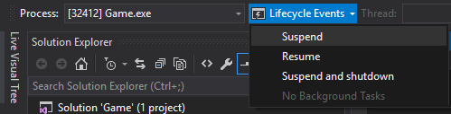

# Herramientas de pruebas y depuración de Administración del ciclo de vida de los procesos (PLM)

Una de las diferencias clave entre las aplicaciones para UWP y las aplicaciones de escritorio tradicionales es que los títulos UWP residen en un contenedor de aplicación sujeto a Administración de ciclo de vida de los procesos (PLM). Las aplicaciones para UWP pueden suspenderse, reanudarse o finalizarse en todas las plataformas con el servicio Agente de tiempo de ejecución. También hay herramientas dedicadas que puedes usar para forzar dichas transiciones al depurar o probar el código que las controla.

## Características de Visual Studio 2015

El depurador integrado de Visual Studio 2015 puede ayudarte a investigar posibles problemas al usar características exclusivas de UWP. Puedes forzar la aplicación en diferentes estados PLM mediante la barra de herramientas **Eventos de ciclo de vida**, que se vuelve visible cuando se ejecuta y depura el título.



## La herramienta PLMDebug

PLMDebug.exe es una herramienta de línea de comandos que te permite controlar el estado PLM de un paquete de aplicación y se incluye como parte de Windows SDK. Después de instalarlo, la herramienta reside en *C:\Program archivos (x86) \Windows Kits\10\Debuggers\x64* de manera predeterminada. 

PLMDebug también te permite deshabilitar PLM de cualquier paquete de la aplicación instalado, lo cual es necesario para algunos depuradores. La desactivación de PLM impide que el servicio Agente de tiempo de ejecución finalice la aplicación antes de poder depurar. Para deshabilitar PLM, usa el conmutador **/enableDebug**, seguido por el *nombre completo del paquete* de la aplicación para UWP (el nombre corto, el nombre de familia de paquete o el AUMID de un paquete no funcionará):

```
plmdebug /enableDebug [PackageFullName]
```

Después de implementar la aplicación para UWP desde Visual Studio, se muestra el nombre completo del paquete en la ventana de salida. O bien, también puedes recuperar el nombre completo del paquete mediante la ejecución de **Get-AppxPackage** en una consola de PowerShell.


Opcionalmente, puedes especificar una ruta de acceso absoluta a un depurador que se iniciará automáticamente cuando se active el paquete de la aplicación. Si quieres hacer esto con Visual Studio, debes especificar VSJITDebugger.exe como el depurador. Sin embargo, VSJITDebugger.exe requiere que especifiques el conmutador "-p", junto con el identificador de proceso (PID) de la aplicación para UWP. Dado que no es posible saber de antemano el PID de la aplicación para UWP, este escenario no es posible fuera del cuadro.

Puedes evitar esta limitación si escribes un script o con una herramienta que identifique el proceso del juego y después el shell ejecuta VSJITDebugger.exe, pasando el PID de la aplicación para UWP. El siguiente ejemplo de código C# muestra un enfoque sencillo para lograr esto.

```
using System.Diagnostics;

namespace VSJITLauncher
{
    class Program
    {
        static void Main(string[] args)
        {
            // Name of UWP process, which can be retrieved via Task Manager.
            Process[] processes = Process.GetProcessesByName(args[0]);

            // Get PID of most recent instance
            // Note the highest PID is arbitrary. Windows may recycle or wrap the PID at any time.
            int highestId = 0;
            foreach (Process detectedProcess in processes)
            {
                if (detectedProcess.Id > highestId)
                    highestId = detectedProcess.Id;
            }

            // Launch VSJITDebugger.exe, which resides in C:\Windows\System32
            ProcessStartInfo startInfo = new ProcessStartInfo("vsjitdebugger.exe", "-p " + highestId);
            startInfo.UseShellExecute = true;

            Process process = new Process();
            process.StartInfo = startInfo;
            process.Start();
        }
    }
}
```

Ejemplo de uso de esto en conjunto con PLMDebug:

```
plmdebug /enableDebug 279f7062-ce35-40e8-a69f-cc22c08e0bb8_1.0.0.0_x86__c6sq6kwgxxfcg "\"C:\VSJITLauncher.exe\" Game"
```
donde `Game` es el nombre de proceso y `279f7062-ce35-40e8-a69f-cc22c08e0bb8_1.0.0.0_x86__c6sq6kwgxxfcg` es el nombre de paquete completo del paquete de la aplicación para UWP de ejemplo.

Ten en cuenta que cada llamada a **/enableDebug** debe ser posterior a otra llamada PLMDebug con el conmutador **/disableDebug**. Además, la ruta de acceso a un depurador debe ser absoluta (no se admiten las rutas de acceso relativas).

## Temas relacionados
- [Implementación y depuración de aplicaciones para UWP](deploying-and-debugging-uwp-apps.md)
- [Depuración, pruebas y rendimiento](index.md)


<!--HONumber=Aug16_HO3-->


