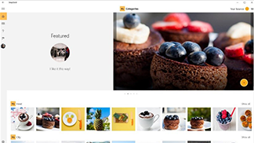

# Descargas de diseño para aplicaciones para UWP
<link rel="stylesheet" href="https://az835927.vo.msecnd.net/sites/uwp/Resources/css/custom.css"> 

Esta sección contiene descargas relacionadas con el diseño y la interfaz de usuario para aplicaciones para UWP. Si necesitas más herramientas como, por ejemplo, Visual Studio, consulta [nuestra página de descargas principales](https://developer.microsoft.com/downloads). 

## Plantillas de diseño

  

    
<b>PowerPoint</b> 
Este paquete tiene todo lo necesario para crear rápidamente estructuras reticulares de aplicaciones para UWP, incluidos los controles y diseños. [Descargar las plantillas de diseño para PowerPoint](https://go.microsoft.com/fwlink/p/?LinkId=534632)

  

  

  

  

            
<b>Adobe Illustrator</b> 
Estas plantillas de Adobe Illustrator proporcionan controles y diseños para diseñar aplicaciones para UWP. [Descargar las plantillas de diseño de Adobe Illustrator](https://go.microsoft.com/fwlink/p/?LinkId=534634)
    
  

  

  

  

            
<b>Adobe Photoshop</b> 
Controles y diseños para diseñar aplicaciones para UWP en Adobe Photoshop. [Descargar las plantillas de diseño de Adobe Photoshop](http://go.microsoft.com/fwlink/p/?LinkId=626453)
    
  

  

  

## Herramientas

  

            
<b>Generador de ventanas e iconos de Adobe Photoshop</b> 
Este conjunto de acciones para Adobe Photoshop genera los 68 activos de ventanas e iconos recomendados de solo 7 archivos.  [Descargar el generador de ventanas e iconos](http://go.microsoft.com/fwlink/p/?LinkId=760394)
    
  

  

  

## Muestras

  

            
<b>Aplicación de uso compartido de fotos</b>  
Esta aplicación de muestra hace una demostración del uso compartido de fotos en redes sociales del mundo real. Muestra el diseño adaptativo, la compra desde la aplicación, los servicios de Azure, las notificaciones de inserción y mucho más.  [Descargar la aplicación de muestra del uso compartido de fotos](http://go.microsoft.com/fwlink/p/?LinkId=760402) [Más información sobre la aplicación de uso compartido de fotos](http://go.microsoft.com/fwlink/p/?LinkId=760401)
    
  

  

  

  

            
<b>Hue Lights </b> 
En este ejemplo se integran las características de Windows con la automatización de dispositivos del hogar inteligente. Concretamente, muestra cómo puedes usar Cortana y Bluetooth de bajo consumo (Bluetooth LE) para crear una experiencia interactiva con Phillips Hue Lights (un sistema de iluminación vía Wi-Fi).  [Descargar la muestra de Hue Lights](https://github.com/Microsoft/Windows-appsample-huelightcontroller/archive/master.zip) [Leer más acerca de la muestra de Hue Lights](https://github.com/Microsoft/Windows-appsample-huelightcontroller)
    
  

  

  

<b>¿Quieres ver más código?</b> Consulta la página de ejemplo de Windows para obtener una lista completa de todas las aplicaciones de muestra para UWP. [Ir al portal de muestras](https://developer.microsoft.com/samples)
