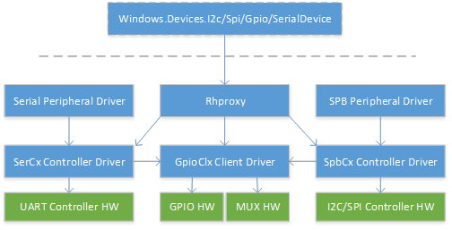

# Habilitar el acceso de modo de usuario en Windows 10 IoT Core

\[ Actualizado para aplicaciones para UWP en Windows 10. Para leer más artículos sobre Windows 8.x, consulta el [archivo](http://go.microsoft.com/fwlink/p/?linkid=619132) \]


Windows 10 IoT Core contiene nuevas API para acceder a GPIO, I2C, SPI y UART directamente desde el modo de usuario. Los paneles de desarrollo como Raspberry Pi 2 exponen un subconjunto de estas conexiones que permiten a los usuarios ampliar un módulo de cálculo base con circuitos personalizados para dirigirte a una aplicación particular. Normalmente, estos buses de bajo nivel se comparten con otras funciones incorporadas críticas, con solo un subconjunto de las patillas y buses de GPIO expuestos en los encabezados. Para preservar la estabilidad del sistema, es necesario especificar qué patillas y buses son seguros para modificar las aplicaciones de modo de usuario. 

Este documento describe cómo especificar esta configuración en ACPI y proporciona herramientas para comprobar que la configuración se especificó correctamente. 

> [!IMPORTANT]
> Los destinatarios de este documento son los desarrolladores de UEFI y ACPI. Se da por hecho que existe cierta familiarización con ACPI, creación de ASL y SpbCx/GpioClx.

El acceso de modo de usuario a buses de nivel bajo en Windows se asocia a través de los marcos `GpioClx` y `SpbCx` existentes. Un nuevo controlador llamado *RhProxy*, solo disponible en Windows 10 IoT Core, expone los recursos `GpioClx` y `SpbCx` en modo de usuario. Para habilitar las API, se debe declarar un nodo de dispositivo para rhproxy en las tablas ACPI con cada uno de los recursos GPIO y SPB que se deben exponer en modo de usuario. Este documento es una guía de la creación y comprobación de ASL. 


## ASL como ejemplo

Vamos a examinar la declaración de nodo de dispositivo rhproxy en Raspberry Pi 2. Primero, crea la declaración de dispositivo ACPI en el ámbito \\_SB.  

```cpp
Device(RHPX) 
{ 
    Name(_HID, "MSFT8000") 
    Name(_CID, "MSFT8000") 
    Name(_UID, 1) 
    
```

* _HID – Id. de hardware Se debe establecer en un id. de hardware específico del proveedor. 
* _CID – Id. compatible Debe ser “MSFT8000”.  
* _UID: id. único Establecer en 1.  

Después, declaramos cada uno de los recursos GPIO y SPB que se deben exponer en modo de usuario. El orden en que se declaran los recursos es importante porque los índices de recursos se usan para asociar las propiedades con los recursos. Si hay varios buses de I2C o SPI expuestos, el primero declarado se considera el bus 'predeterminado' para ese tipo de bus y será la instancia devuelta por los métodos `GetDefaultAsync()` de [Windows.Devices.I2c.I2cController](https://msdn.microsoft.com/library/windows/apps/windows.devices.i2c.i2ccontroller.aspx) y [Windows.Devices.Spi.SpiController](https://msdn.microsoft.com/library/windows/apps/windows.devices.spi.spicontroller.aspx). 

### SPI 

Raspberry Pi tiene dos buses SPI expuestos. SPI0 tiene dos líneas de selección de chip de hardware y SPI1 tiene una sola línea de selección de chip de hardware. Es necesaria una declaración de recurso SPISerialBus() para cada línea de selección de chip para cada bus. Las siguientes declaraciones de dos recursos SPISerialBus se usan para las líneas de selección de dos chip en SPI0. El campo DeviceSelection contiene un valor único que el controlador interpreta como un identificador de línea de selección de chip de hardware. El valor exacto que se coloca en el campo DeviceSelection depende de cómo el controlador interpreta este campo del descriptor de conexión de ACPI.  

```cpp
// Index 0 
SPISerialBus(              // SCKL - GPIO 11 - Pin 23 
                           // MOSI - GPIO 10 - Pin 19 
                           // MISO - GPIO 9  - Pin 21 
                           // CE0  - GPIO 8  - Pin 24 
    0,                     // Device selection (CE0) 
    PolarityLow,           // Device selection polarity 
    FourWireMode,          // wiremode 
    0,                     // databit len: placeholder 
    ControllerInitiated,   // slave mode 
    0,                     // connection speed: placeholder 
    ClockPolarityLow,      // clock polarity: placeholder 
    ClockPhaseFirst,       // clock phase: placeholder 
    "\\_SB.SPI0",          // ResourceSource: SPI bus controller name 
    0,                     // ResourceSourceIndex 
                           // Resource usage 
    )                      // Vendor Data 

// Index 1 
SPISerialBus(              // SCKL - GPIO 11 - Pin 23 
                           // MOSI - GPIO 10 - Pin 19 
                           // MISO - GPIO 9  - Pin 21 
                           // CE1  - GPIO 7  - Pin 26 
    1,                     // Device selection (CE1) 
    PolarityLow,           // Device selection polarity 
    FourWireMode,          // wiremode 
    0,                     // databit len: placeholder 
    ControllerInitiated,   // slave mode 
    0,                     // connection speed: placeholder 
    ClockPolarityLow,      // clock polarity: placeholder 
    ClockPhaseFirst,       // clock phase: placeholder 
    "\\_SB.SPI0",          // ResourceSource: SPI bus controller name 
    0,                     // ResourceSourceIndex 
                           // Resource usage 
    )                      // Vendor Data 

```

¿Cómo sabe el software que se deben asociar estos dos recursos con el mismo bus? La asignación entre el nombre descriptivo del bus y el índice de recursos se especifica en el DSD:  

```cpp
Package(2) { "bus-SPI-SPI0", Package() { 0, 1 }}, 
```

Esto crea un bus denominado "SPI0" con dos líneas de selección de chip: índices de recurso 0 y 1. Se deben declarar varias propiedades más para declarar las funcionalidades del bus de SPI.  

```cpp
Package(2) { "SPI0-MinClockInHz", 7629 }, 
Package(2) { "SPI0-MaxClockInHz", 125000000 },
```

Las propiedades **MinClockInHz** y **MaxClockInHz** especifican las velocidades de reloj mínimas y máximas que son compatibles con el controlador. La API evitará que los usuarios especifiquen valores fuera de este intervalo. La velocidad de reloj se pasa al controlador de SPB en el campo _SPE del descriptor de conexión (sección de ACPI 6.4.3.8.2.2).  

```cpp
Package(2) { "SPI0-SupportedDataBitLengths", Package() { 8 }}, 
```

La propiedad **SupportedDataBitLengths** enumera las longitudes de bits de datos admitidas por el controlador. Pueden especificarse varios valores en una lista separada por comas. La API evitará que los usuarios especifiquen valores fuera de esta lista. La longitud de bits de datos se pasa al controlador de SPB en el campo _LEN del descriptor de conexión (sección de ACPI 6.4.3.8.2.2).  

Estas declaraciones de recursos se puede considerar como "plantillas". Algunos de los campos son fijos al arrancar el sistema, mientras que otros se especifican dinámicamente en tiempo de ejecución. Los siguientes campos del descriptor SPISerialBus son fijos: 

* DeviceSelection 
* DeviceSelectionPolarity 
* WireMode 
* SlaveMode 
* ResourceSource 

Los siguientes campos son marcadores de posición para los valores especificados por el usuario en tiempo de ejecución: 

* DataBitLength 
* ConnectionSpeed 
* ClockPolarity 
* ClockPhase 

Dado que SPI1 contiene solamente una única línea selecccionada de chip, se declara un único recurso `SPISerialBus()`: 

```cpp
// Index 2 

SPISerialBus(              // SCKL - GPIO 21 - Pin 40 
                           // MOSI - GPIO 20 - Pin 38 
                           // MISO - GPIO 19 - Pin 35 
                           // CE1  - GPIO 17 - Pin 11 
    1,                     // Device selection (CE1) 
    PolarityLow,           // Device selection polarity 
    FourWireMode,          // wiremode 
    0,                     // databit len: placeholder 
    ControllerInitiated,   // slave mode 
    0,                     // connection speed: placeholder 
    ClockPolarityLow,      // clock polarity: placeholder 
    ClockPhaseFirst,       // clock phase: placeholder 
    "\\_SB.SPI1",          // ResourceSource: SPI bus controller name 
    0,                     // ResourceSourceIndex 
                           // Resource usage 
    )                      // Vendor Data 

```

La correspondiente declaración de nombre descriptivo, que es necesaria, se especifica en el DSD y hace referencia al índice de esta declaración de recursos. 

```cpp
Package(2) { "bus-SPI-SPI1", Package() { 2 }}, 
```

De este modo se crea un bus denominado "SPI1" y se asocia al índice 2 del recurso.  

#### Requisitos de los controladores SPI 

* Debes usar `SpbCx` o admitir SpbCx 
* Debes haber pasado las [Pruebas MITT SPI](https://msdn.microsoft.com/library/windows/hardware/dn919873.aspx)
* Debes admitir la velocidad de reloj de 4Mhz 
* Debe ser compatible con la longitud de datos de 8 bits 
* Debe ser compatible con todos los modos de SPI: 0, 1, 2, 3 

### I2C 

A continuación, declaramos los recursos I2C. Raspberry Pi expone un bus I2C único en las patillas 3 y 5. 

```cpp
// Index 3 
I2CSerialBus(              // Pin 3 (GPIO2, SDA1), 5 (GPIO3, SCL1) 
    0xFFFF,                // SlaveAddress: placeholder 
    ,                      // SlaveMode: default to ControllerInitiated 
    0,                     // ConnectionSpeed: placeholder 
    ,                      // Addressing Mode: placeholder 
    "\\_SB.I2C1",          // ResourceSource: I2C bus controller name 
    , 
    , 
    )                      // VendorData 

```

La declaración de nombre descriptivo correspondiente, que es necesaria, se especifica en el DSD: 

```cpp
Package(2) { "bus-I2C-I2C1", Package() { 3 }}, 
```

Esto declara un bus I2C con nombre descriptivo "I2C1" que se refiere al índice de recursos 3, que es el índice del recurso I2CSerialBus() que declaramos anteriormente. 

Los siguientes campos del descriptor I2CSerialBus() son fijos: 

* SlaveMode 
* ResourceSource 

Los siguientes campos son marcadores de posición para los valores especificados por el usuario en tiempo de ejecución. 

* SlaveAddress 
* ConnectionSpeed 
* AddressingMode 

#### Requisitos de los controladores I2C 

* Debes usar SpbCx o ser compatible con SpbCx 
* Debes haber pasado las [Pruebas MITT I2C](https://msdn.microsoft.com/library/windows/hardware/dn919852.aspx) 
* Debes admitir el direccionamiento de 7 bits 
* Debes admitir la velocidad de reloj de 100kHz 
* Debes admitir la velocidad de reloj de 400kHz 

### GPIO 

A continuación, declaramos todas las patillas de GPIO que se exponen en modo de usuario. Ofrecemos las siguientes directrices para decidir qué patillas exponer: 

* Declarar todas las patillas en los encabezados expuestos. 
* Declarar las patillas que estén conectadas a funciones incorporadas útiles como botones y LED. 
* No declarar las patillas reservadas para funciones del sistema o que no estén conectadas a nada. 

El siguiente bloque de ASL declara dos patillas: GPIO4 y GPIO5. Las otras patillas no se muestran aquí por razones de brevedad. El Apéndice C contiene un script de Powershell de muestra que se puede usar para generar los recursos GPIO. 

```cpp
// Index 4 – GPIO 4 
GpioIO(Shared, PullUp, , , , “\\_SB.GPI0”, , , , ) { 4 } 
GpioInt(Edge, ActiveBoth, Shared, PullUp, 0, “\\_SB.GPI0”,) { 4 } 

// Index 6 – GPIO 5 
GpioIO(Shared, PullUp, , , , “\\_SB.GPI0”, , , , ) { 5 } 
GpioInt(Edge, ActiveBoth, Shared, PullUp, 0, “\\_SB.GPI0”,) { 5 } 
```

Al declarar las patillas GPIO, se deben tener en cuenta los siguientes requisitos: 

* Solo se admiten los controladores de GPIO asignados en la memoria. No se admiten controladores de GPIO de interfaz sobre I2C y SPI. El controlador de controladora es un controlador asignado en la memoria si establece la marca [MemoryMappedController](https://msdn.microsoft.com/library/windows/hardware/hh439449.aspx) en la estructura [CLIENT_CONTROLLER_BASIC_INFORMATION](https://msdn.microsoft.com/library/windows/hardware/hh439358.aspx) en respuesta a la devolución de llamada de [CLIENT_QueryControllerBasicInformation](https://msdn.microsoft.com/library/windows/hardware/hh439399.aspx) . 
* Cada patilla requiere un GpioIO y un recurso GpioInt. El recurso GpioInt debe seguir inmediatamente al recurso GpioIO y debe hacer referencia al mismo número de patilla. 
* Los recursos GPIO se deben ordenar aumentando el número de patilla. 
* Cada recurso GpioIO y GpioInt debe contener exactamente un número de patilla en la lista de patillas. 
* El campo ShareType de ambos descriptores se debe compartir. 
* El campo EdgeLevel del descriptor GpioInt debe ser Edge 
* El campo ActiveLevel del descriptor GpioInt debe ser ActiveBoth 
* El campo PinConfig 
  * Debe ser el mismo en los descriptores GpioIO y GpioInt 
  * Debe ser uno de PullUp, PullDown o PullNone. No puede ser PullDefault.
  * La configuración de extracción debe coincidir con el estado de energía de la patilla. Poner la patilla en el modo de extracción especificado del estado de energía no debe cambiar el estado de la patilla. Por ejemplo, si la hoja de datos especifica que la patilla aparece con una extracción, especifica PinConfig como PullUp.  

Firmware, UEFI y el código de inicialización del controlador no deben cambiar el estado de una patilla desde su estado de energía durante el arranque. Solo el usuario sabe lo que está adjunto a una patilla y, por tanto, las transiciones de estado son seguras. El estado de energía de cada patilla debe estar documentado para que los usuarios puedan diseñar hardware que interactúe correctamente con una patilla. Una patilla no debe cambiar de estado de forma inesperada durante el arranque. 

Si una patilla expuesta tiene varias funciones alternativas, es responsabilidad del firmware inicializar la patilla en la configuración correcta de multiplexación para su uso posterior por parte del sistema operativo. Cambiar dinámicamente la función de una patilla ("multiplexación") no se admite actualmente en Windows. 

#### Modos de unidad admitidos 

Si el controlador GPIO admite las resistencias pull-up y pull-down integradas, además de la entrada de alta impedancia y salida de CMOS, debes especificar esto con la propiedad SupportedDriveModes opcional. 

```cpp
Package (2) { “GPIO-SupportedDriveModes”, 0xf }, 
```

La propiedad SupportedDriveModes indica qué modos de unidad son compatibles con la controladora GPIO. En el ejemplo anterior, se admiten todos los modos de unidad siguientes. La propiedad es una máscara de bits con los siguientes valores: 

| Valor de marca | Modo de controlador | Descripción |
|------------|------------|-------------|
| 0x1        | InputHighImpedance | La patilla es compatible con la entrada de alta impedancia, que corresponde al valor "PullNone" de ACPI. |
| 0x2        | InputPullUp | La patilla admite una resistencia pull-up integrada, que corresponde al valor "PullUp" de ACPI. |
| 0x4        | InputPullDown | La patilla admite una resistencia pull-down integrada, que corresponde al valor "PullDown" de ACPI. |
| 0x8        | OutputCmos | La patilla admite la generación de tanto de puntos fuertes como de puntos débiles acentuados (a diferencia del tubo abierto). |

InputHighImpedance y OutputCmos son compatibles con casi todos los controladores de GPIO. Si no se especifica la propiedad SupportedDriveModes, este es el valor predeterminado. 

Si una señal GPIO pasa por un desfasador de nivel antes de alcanzar un encabezado expuesto, declara los modos de unidad admitidos por el SOC, incluso si el modo de unidad no fuera observable en el encabezado externo. Por ejemplo, si una patilla atraviesa un desfasador de nivel bidireccional que haga que una patilla aparezca como un tubo abierto con un pull-up resistivo, nounca observarás un estado de alta impedancia en el encabezado expuesto, incluso si la patilla se configuró como una entrada de alta impedancia. Aún debes declarar que la patilla es compatible con la entrada de alta impedancia. 

#### Numeración de patillas 

Windows admite dos esquemas de numeración de patillas: 

* Numeración de patillas secuencial: los usuarios ven números como 0, 1, 2... hasta el número de patillas expuestas. 0 es el primer recurso GpioIo declarado en ASL, 1 es el segundo recurso GpioIo declarado en ASL, y así sucesivamente. 
* Numeración de patillas nativa: los usuarios verán los números de patilla especificados en los descriptores GpioIo, por ejemplo, 4, 5, 12, 13… .  

```cpp
Package (2) { “GPIO-UseDescriptorPinNumbers”, 1 }, 
```

La propiedad **UseDescriptorPinNumbers** indica a Windows que debe usar una numeración de patillas nativa en lugar de una numeración de patillas secuencial. Si no se especifica la propiedad UseDescriptorPinNumbers o su valor es cero, Windows usará de forma predeterminada la numeración de patillas secuencial. 

Si se usa la numeración de patillas nativa, también debes especificar la propiedad **PinCount**. 

```cpp
Package (2) { “GPIO-PinCount”, 54 }, 
```

La propiedad **PinCount** debe coincidir con el valor devuelto a través de la propiedad **TotalPins** en la devolución de llamada [CLIENT_QueryControllerBasicInformation](https://msdn.microsoft.com/library/windows/hardware/hh439399.aspx) del controlador `GpioClx`. 

Elige el esquema de numeración que sea más compatible con la documentación publicada existente del panel. Por ejemplo, Raspberry Pi usa una numeración de patillas nativa porque muchos diagramas de patillaje existentes usan los números de patilla BCM2835. MinnowBoardMax usa una numeración de patillas secuencial porque hay pocos diagramas de patillaje existentes, y la numeración de patillas secuencial simplifica la experiencia del desarrollador porque solo se exponen 10 patillas de más de 200 patillas. La decisión de usar numeración de patillas secuencial o nativa debe apuntar a reducir la confusión del desarrollador. 

#### Requisitos de los controladores GPIO 

* Debes usar `GpioClx`
* Debe asignarse memoria en SOC 
* Debes usar el controlador de interrupciones emulado ActiveBoth 

### UART 

UART no se admite en Raspberry Pi en el momento de escribir, por lo que la siguiente declaración UART es desde MinnowBoardMax. 

```cpp
// Index 2 
UARTSerialBus(           // Pin 17, 19 of JP1, for SIO_UART2 
    115200,                // InitialBaudRate: in bits ber second 
    ,                      // BitsPerByte: default to 8 bits 
    ,                      // StopBits: Defaults to one bit 
    0xfc,                  // LinesInUse: 8 1-bit flags to declare line enabled 
    ,                      // IsBigEndian: default to LittleEndian 
    ,                      // Parity: Defaults to no parity 
    ,                      // FlowControl: Defaults to no flow control 
    32,                    // ReceiveBufferSize 
    32,                    // TransmitBufferSize 
    "\\_SB.URT2",          // ResourceSource: UART bus controller name 
    , 
    , 
    , 
    )
```

Solo el campo ResourceSource es fijo, mientras que el resto de campos son marcadores de posición para los valores especificados en tiempo de ejecución por el usuario. 

La declaración de nombre descriptivo correspondiente es: 

```cpp
Package(2) { "bus-UART-UART2", Package() { 2 }}, 
```

De este modo se asigna el nombre descriptivo "UART2" al controlador, que es el identificador que los usuarios usarán para tener acceso al bus desde el modo de usuario.  

## Multiplexación de patillas en tiempo de ejecución 

La multiplexación de patillas es la capacidad de usar la misma patilla física para diferentes funciones. Varios periféricos en chip diferentes, como un controlador I2C, un controlador SPI o un controlador GPIO, podrían enrutarse a la misma patilla física en un SOC. La multiplexación bloquea los controles cuya función está activa en la patilla en cualquier momento. Tradicionalmente, el firmware es responsable de establecer las asignaciones de función en el arranque, y esta asignación permanece estática a lo largo de la sesión de inicio. La multiplexación de patillas en tiempo de ejecución agrega la capacidad para volver a configurar las asignaciones de función de patilla en tiempo de ejecución. Al permitir a los usuarios elegir la función de una patilla en tiempo de ejecución, se acelera el desarrollo al permitir que los usuarios vuelvan a configurar rápidamente las patillas del panel, y permite que el hardware admita una gama más amplia de aplicaciones que si la configuración fuera estática. 

Los usuarios consumen compatibilidad con multiplexación para GPIO, I2C, SPI y UART sin necesidad de escribir ningún código adicional. Cuando un usuario abre un GPIO o un bus mediante [OpenPin()](https://msdn.microsoft.com/library/dn960157.aspx) o [FromIdAsync()](https://msdn.microsoft.com/windows.devices.i2c.i2cdevice.fromidasync), las patillas físicas subyacentes se multiplexan automáticamente en la función solicitada. Si las patillas ya están en uso por parte de una función diferente, se producirá un error en la llamada OpenPin() o FromIdAsync(). Cuando el usuario cierra el dispositivo al eliminar el objeto [GpioPin](https://msdn.microsoft.com/library/windows/apps/windows.devices.gpio.gpiopin.aspx), [I2cDevice](https://msdn.microsoft.com/library/windows/apps/windows.devices.i2c.i2cdevice.aspx), [SpiDevice](https://msdn.microsoft.com/library/windows/apps/windows.devices.spi.spidevice.aspx) o [SerialDevice](https://msdn.microsoft.com/library/windows/apps/windows.devices.serialcommunication.serialdevice.aspx), se liberan las patillas, lo que les permite que se abran más tarde para una función diferente. 

Windows contiene compatibilidad integrada para la multiplexación de patillas en los marcos [GpioClx](https://msdn.microsoft.com/library/windows/hardware/hh439515.aspx), [SpbCx](https://msdn.microsoft.com/library/windows/hardware/hh406203.aspx) y [SerCx](https://msdn.microsoft.com/library/windows/hardware/dn265349.aspx). Estos marcos funcionan juntos para cambiar automáticamente una patilla para la función correcta cuando se accede a una patilla o bus de GPIO. El acceso a las patillas se arbitra para evitar conflictos entre los distintos clientes. Además de esta compatibilidad integrada, las interfaces y los protocolos para el multiplexación de patillas son un propósito general y se pueden extender a escenarios y dispositivos adicionales. 

Este documento describe primero las interfaces y los protocolos subyacentes implicados en la multiplexación de patillas y, a continuación, describe cómo agregar compatibilidad para la multiplexación de patillas en los controladores GpioClx, SpbCx y SerCx. 

### Arquitectura de multiplexación de patillas 

Esta sección describe las interfaces y los protocolos subyacentes implicados en la multiplexación de patillas. No es necesario tener conocimiento sobre los protocolos subyacentes para admitir la multiplexación de patillas con controladores SpbCx/GpioClx/SerCx. Para obtener información detallada sobre cómo admitir multiplexación de patillas con controladores SpbCx/GpioCls/SerCx, consulta [implementación de compatibilidad de multiplexación de patillas con controladores de cliente GpioClx](#supporting-muxing-support-in-GpioClx-client-drivers) y [consumo de compatibilidad de multiplexación de patillas en controladores de controladora SpbCx y SerCx](#supporting-muxing-in-SpbCx-and-SerCx-controller-drivers). 

La multiplexación de patillas se logra mediante la cooperación de varios componentes. 

* Servidores de multiplexación de patillas: estos son los controladores que controlan el bloque de control de multiplexación de patillas. Los servidores de multiplexación de patillas reciben solicitudes de multiplexación de patillas para reservar solicitudes de recursos de multiplexación (a través de *IRP_MJ_CREATE*) y solicitudes para cambiar la función de una patilla (a través de solicitudes de *IOCTL_GPIO_COMMIT_FUNCTION_CONFIG_PINS*). El servidor de multiplexación de patillas suele ser el controlador GPIO, dado que el bloque de multiplexación a veces es parte del bloque GPIO. Incluso si el bloque de multiplexación es un periférico independiente, el controlador GPIO es un lugar lógico para poner la funcionalidad de multiplexación. 
* Clientes de multiplexación de patillas: son controladores que consumen multiplexación de patillas. Los clientes de multiplexación de patillas reciben recursos de multiplexación de patillas desde el firmware ACPI. Los recursos de multiplexación de patillas son un tipo de recurso de conexión que administra el concentrador de recursos. Los clientes de multiplexación de patillas reservan recursos de multiplexación de patillas abriendo un identificador del recurso. Para realizar un cambio de hardware, los clientes deben confirmar la configuración con el envío de una solicitud *IOCTL_GPIO_COMMIT_FUNCTION_CONFIG_PINS*. Los clientes liberan recursos de multiplexación de patillas cerrando el identificador y, en ese punto, la configuración de multiplexación se revierte a su estado predeterminado. 
* Firmware ACPI: Especifica la configuración de multiplexación con recursos `MsftFunctionConfig()`. Los recursos MsftFunctionConfig expresan qué patillas, y con qué configuración de multiplexación, requiere un cliente. Los recursos MsftFunctionConfig contienen el número de función, la configuración de extracción y una lista de números de patilla. Los recursos MsftFunctionConfig se proporcionan a los clientes de multiplexación de patillas como recursos de hardware, que los controladores reciben en su devolución de llamada a PrepareHardware, de forma similar a los recursos de conexión GPIO y SPB. Los clientes reciben un id. de concentrador de recursos que se puede usar para abrir un controlador para el recurso. 

> Es necesario pasar el modificador de la línea de comandos `/MsftInternal` para `asl.exe` con el fin de compilar los archivos ASL que contengan descriptores `MsftFunctionConfig()`, dado que estos descriptores están siendo revisados actualmente por el comité de trabajo de ACPI. Por ejemplo: `asl.exe /MsftInternal dsdt.asl`

A continuación se muestra la secuencia de operaciones que participan en la multiplexación de patillas. 


1.  El cliente recibe recursos MsftFunctionConfig del firmware ACPI en su devolución de llamada a [EvtDevicePrepareHardware()](https://msdn.microsoft.com/library/windows/hardware/ff540880.aspx).
2.  El cliente usa la función auxiliar del concentrador de recursos `RESOURCE_HUB_CREATE_PATH_FROM_ID()` para crear una ruta de acceso desde el identificador de recurso y, a continuación, abre un identificador para la ruta de acceso (con [ZwCreateFile()](https://msdn.microsoft.com/library/windows/hardware/ff566424.aspx), [IoGetDeviceObjectPointer()](https://msdn.microsoft.com/library/windows/hardware/ff549198.aspx) o [WdfIoTargetOpen()](https://msdn.microsoft.com/library/windows/hardware/ff548634.aspx)).
3.  El servidor extrae el identificador de concentrador de recursos de la ruta del archivo que usa funciones auxiliares de concentrador de recursos `RESOURCE_HUB_ID_FROM_FILE_NAME()`, a continuación, consulta el concentrador de recursos para obtener el descriptor del recurso.
4.  El servidor realiza el arbitraje de uso compartido de cada patilla en el descriptor y completa la solicitud IRP_MJ_CREATE.
5.  El cliente emite una solicitud *IOCTL_GPIO_COMMIT_FUNCTION_CONFIG_PINS* en el identificador recibido.
6.  En respuesta a *IOCTL_GPIO_COMMIT_FUNCTION_CONFIG_PINS*, el servidor realiza la operación de multiplexación de hardware haciendo que la función especificada se active en cada patilla.
7.  El cliente continúa con operaciones que dependen de la configuración de multiplexación de patillas solicitada.
8.  Cuando el cliente ya no requiere la multiplexación de patillas, cierra el identificador.
9.  En respuesta al cierre del identificador, el servidor revierte las patillas a su estado inicial.

### Descripción del protocolo para clientes de multiplexación de patillas

Esta sección describe cómo un cliente consume la funcionalidad de multiplexación de patillas. Esto no se aplica a los controladores de controladora `SerCx` y `SpbCx`, ya que los marcos implementan este protocolo en nombre de los controladores.

####    Análisis de recursos

Un controlador de WDF recibe recursos `MsftFunctionConfig()` en su rutina [EvtDevicePrepareHardware()](https://msdn.microsoft.com/library/windows/hardware/ff540880.aspx). Los recursos MsftFunctionConfig se pueden identificar mediante los campos siguientes:

```cpp
CM_PARTIAL_RESOURCE_DESCRIPTOR::Type = CmResourceTypeConnection
CM_PARTIAL_RESOURCE_DESCRIPTOR::u.Connection.Class = CM_RESOURCE_CONNECTION_CLASS_FUNCTION_CONFIG
CM_PARTIAL_RESOURCE_DESCRIPTOR::u.Connection.Type = CM_RESOURCE_CONNECTION_TYPE_FUNCTION_CONFIG
```

Una rutina `EvtDevicePrepareHardware()` puede extraer recursos MsftFunctionConfig del siguiente modo:

```cpp
EVT_WDF_DEVICE_PREPARE_HARDWARE evtDevicePrepareHardware;

_Use_decl_annotations_
NTSTATUS
evtDevicePrepareHardware (
    WDFDEVICE WdfDevice,
    WDFCMRESLIST ResourcesTranslated
    )
{
    PAGED_CODE();

    LARGE_INTEGER connectionId;
    ULONG functionConfigCount = 0;

    const ULONG resourceCount = WdfCmResourceListGetCount(ResourcesTranslated);
    for (ULONG index = 0; index < resourceCount; ++index) {
        const CM_PARTIAL_RESOURCE_DESCRIPTOR* resDescPtr =
            WdfCmResourceListGetDescriptor(ResourcesTranslated, index);

        switch (resDescPtr->Type) {
        case CmResourceTypeConnection:
            switch (resDescPtr->u.Connection.Class) {
            case CM_RESOURCE_CONNECTION_CLASS_FUNCTION_CONFIG:
                switch (resDescPtr->u.Connection.Type) {
                case CM_RESOURCE_CONNECTION_TYPE_FUNCTION_CONFIG:                    
                    switch (functionConfigCount) {
                    case 0:
                        // save the connection ID
                        connectionId.LowPart = resDescPtr->u.Connection.IdLowPart;
                        connectionId.HighPart = resDescPtr->u.Connection.IdHighPart;
                        break;
                    } // switch (functionConfigCount)
                    ++functionConfigCount;
                    break; // CM_RESOURCE_CONNECTION_TYPE_FUNCTION_CONFIG

                } // switch (resDescPtr->u.Connection.Type)
                break; // CM_RESOURCE_CONNECTION_CLASS_FUNCTION_CONFIG
            } // switch (resDescPtr->u.Connection.Class)
            break;
        } // switch
    } // for (resource list)

    if (functionConfigCount < 1) {
        return STATUS_INVALID_DEVICE_CONFIGURATION;
    }
    // TODO: save connectionId in the device context for later use

    return STATUS_SUCCESS;
}
```

####    Reservar y confirmar recursos

Cuando un cliente quiere multiplexar patillas, reserva y confirma el recurso MsftFunctionConfig. El siguiente ejemplo muestra de qué forma un cliente puede reservar y confirmar recursos MsftFunctionConfig .

```cpp
_IRQL_requires_max_(PASSIVE_LEVEL)
NTSTATUS AcquireFunctionConfigResource (
    WDFDEVICE WdfDevice,
    LARGE_INTEGER ConnectionId,
    _Out_ WDFIOTARGET* ResourceHandlePtr
    )
{
    PAGED_CODE();

    //
    // Form the resource path from the connection ID
    //
    DECLARE_UNICODE_STRING_SIZE(resourcePath, RESOURCE_HUB_PATH_CHARS);
    NTSTATUS status = RESOURCE_HUB_CREATE_PATH_FROM_ID(
            &resourcePath,
            ConnectionId.LowPart,
            ConnectionId.HighPart);
    if (!NT_SUCCESS(status)) {
        return status;
    }
    
    //
    // Create a WDFIOTARGET
    //
    WDFIOTARGET resourceHandle;
    status = WdfIoTargetCreate(WdfDevice, WDF_NO_ATTRIBUTES, &resourceHandle);
    if (!NT_SUCCESS(status)) {
        return status;
    }

    //
    // Reserve the resource by opening a WDFIOTARGET to the resource
    //
    WDF_IO_TARGET_OPEN_PARAMS openParams;
    WDF_IO_TARGET_OPEN_PARAMS_INIT_OPEN_BY_NAME(
        &openParams,
        &resourcePath,
        FILE_GENERIC_READ | FILE_GENERIC_WRITE);

    status = WdfIoTargetOpen(resourceHandle, &openParams);
    if (!NT_SUCCESS(status)) {
        return status;
    }
    //
    // Commit the resource
    //
    status = WdfIoTargetSendIoctlSynchronously(
            resourceHandle,
            WDF_NO_HANDLE,      // WdfRequest
            IOCTL_GPIO_COMMIT_FUNCTION_CONFIG_PINS,
            nullptr,            // InputBuffer
            nullptr,            // OutputBuffer
            nullptr,            // RequestOptions
            nullptr);           // BytesReturned
    
    if (!NT_SUCCESS(status)) {
        WdfIoTargetClose(resourceHandle);
        return status;
    }

    //
    // Pins were successfully muxed, return the handle to the caller
    //
    *ResourceHandlePtr = resourceHandle;
    return STATUS_SUCCESS;
}
```

El controlador debe almacenar el WDFIOTARGET en una de sus áreas de contexto para que se pueda cerrar más adelante. Cuando el controlador está listo para liberar la configuración de multiplexación, se debe cerrar el identificador de recursos mediante una llamada a [WdfObjectDelete()](https://msdn.microsoft.com/library/windows/hardware/ff548734.aspx) o [WdfIoTargetClose()](https://msdn.microsoft.com/library/windows/hardware/ff548586.aspx) si tienes intención de reutilizar WDFIOTARGET.

```cpp
    WdfObjectDelete(resourceHandle);
```

Cuando el cliente cierra su identificador de recurso, las patillas se vuelven a multiplexar en su estado inicial y ahora puede adquirirlas un cliente diferente.

### Descripción del protocolo para servidores de multiplexación de patillas

Esta sección describe cómo un servidor de multiplexación de patillas expone su funcionalidad a los clientes. Esto no se aplica a controladores de minipuerto `GpioClx`, ya que el marco de trabajo implementa este protocolo en nombre de los controladores de cliente. Para obtener información detallada sobre cómo admitir multiplexación de patillas en controladores de cliente `GpioClx`, consulta [implementación de compatibilidad de multiplexación de patillas con controladores de cliente GpioClx](#supporting-muxing-support-in-GpioClx-client-drivers).

####    Controlar solicitudes de IRP_MJ_CREATE

Los clientes abren un identificador para un recurso cuando quieren reservar un recurso de multiplexación de patillas. Un servidor de multiplexación de patillas recibe solicitudes *IRP_MJ_CREATE* por medio de una operación de análisis del concentrador de recursos. El componente de ruta de acceso final de la solicitud *IRP_MJ_CREATE* contiene el identificador de concentrador de recursos, que es un entero de 64 bits en formato hexadecimal. El servidor debe extraer el identificador de concentrador de recursos del nombre de archivo mediante `RESOURCE_HUB_ID_FROM_FILE_NAME()` desde reshub.h y enviar *IOCTL_RH_QUERY_CONNECTION_PROPERTIES* al concentrador de recursos para obtener el descriptor `MsftFunctionConfig()`.

El servidor debe validar el descriptor y extraer el modo de uso compartido y la lista de patillas del descriptor. A continuación, deberá realizar un arbitraje de uso compartido de las patillas y, si se realiza correctamente, marcar las patillas como reservadas antes de completar la solicitud.

El arbitraje de uso compartido se realiza correctamente de forma general si el arbitraje de uso compartido se realiza de forma correcta en cada patilla de la lista de patillas. Cada patilla se debe arbitrar de la siguiente manera:

*   Si ya no está reservada la patilla, el arbitraje de uso compartido se realiza correctamente.
*   Si la patilla ya está reservada como exclusiva, se produce un error en el arbitraje de uso compartido.
*   Si la patilla ya está reservada como compartida
  * y se comparte la solicitud entrante, el arbitraje de uso compartido se realiza correctamente.
  * y si la solicitud entrante es exclusiva, se produce un error en el arbitraje de uso compartido.

Si se produce un error en el arbitraje de uso compartido, la solicitud debería completarse con *STATUS_GPIO_INCOMPATIBLE_CONNECT_MODE*. Si el arbitraje de uso compartido se realiza correctamente, se debe completar la solicitud con *STATUS_SUCCESS*.

Ten en cuenta que el modo de uso compartido de la solicitud entrante debe obtenerse del descriptor de MsftFunctionConfig, no de [IrpSp -> Parameters.Create.ShareAccess](https://msdn.microsoft.com/library/windows/hardware/ff548630.aspx).

####    Controlar solicitudes de IOCTL_GPIO_COMMIT_FUNCTION_CONFIG_PINS

Después de que el cliente haya reservado correctamente un recurso MsftFunctionConfig abriendo un controlador, puede enviar *IOCTL_GPIO_COMMIT_FUNCTION_CONFIG_PINS* para solicitar al servidor que realice la operación de multiplexación de hardware real. Cuando el servidor recibe *IOCTL_GPIO_COMMIT_FUNCTION_CONFIG_PINS* para cada patilla de la lista de patillas debe 

*   Establecer el modo de extracción especificado en el miembro PinConfiguration de la estructura PNP_FUNCTION_CONFIG_DESCRIPTOR en el hardware.
*   Multiplexar la patilla para la función especificada por el miembro FunctionNumber de la estructura PNP_FUNCTION_CONFIG_DESCRIPTOR.

El servidor, a continuación, debe completar la solicitud con *STATUS_SUCCESS*.

El significado de FunctionNumber lo define el servidor, y se entiende que el descriptor MsftFunctionConfig se creó con conocimiento de la forma en la que el servidor interpreta este campo.

Recuerda que cuando se cierra el identificador, el servidor tendrá que revertir las patillas a la configuración en la que estaban cuando se recibió IOCTL_GPIO_COMMIT_FUNCTION_CONFIG_PINS, por lo que es posible que el servidor tenga que guardar el estado de las patillas antes de modificarlas.

####    Controlar solicitudes de IRP_MJ_CLOSE

Cuando un cliente ya no necesita un recurso de multiplexación, cierra su identificador. Cuando un servidor recibe una solicitud *IRP_MJ_CLOSE*, debe revertir las patillas al estado en el que estaban cuando se recibió *IOCTL_GPIO_COMMIT_FUNCTION_CONFIG_PINS*. Si el cliente nunca envía *IOCTL_GPIO_COMMIT_FUNCTION_CONFIG_PINS*, no es necesario realizar ninguna acción. El servidor debe marcar las patillas como disponible en función del arbitraje de uso compartido y completar la solicitud con *STATUS_SUCCESS*. Asegúrate de sincronizar correctamente el control de *IRP_MJ_CLOSE* con el control de *IRP_MJ_CREATE*.

### Directrices para crear tablas ACPI

Esta sección describe cómo proporcionar recursos de multiplexación a los controladores de cliente. Ten en cuenta que necesitarás la versión de compilación de Microsoft ASL 14327 o posterior para compilar tablas que contengan recursos `MsftFunctionConfig()`. `MsftFunctionConfig()` los recursos se proporcionan a los clientes de multiplexación de patillas como recursos de hardware. `MsftFunctionConfig()` los recursos se deben proporcionar a los controladores que requieren cambios de multiplexación de patillas, que generalmente son SPB y controladores de controladora de serie, pero no se deben suministrar SPB y controladores periféricos de serie, ya que el controlador de controladora controla la configuración de multiplexación.
La macro ACPI `MsftFunctionConfig()` se define del siguiente modo:

```cpp
  MsftFunctionConfig(Shared/Exclusive
                PinPullConfig,
                FunctionNumber,
                ResourceSource,
                ResourceSourceIndex,
                ResourceConsumer/ResourceProducer,
                VendorData) { Pin List }

```

* Compartida/exclusiva: si es exclusiva, esta patilla puede adquirirla un solo cliente a la vez. Si es compartida, varios clientes compartidos pueden adquirir el recurso. Se debe establecer siempre como exclusiva, ya que al permitir que varios clientes descoordinados accedan a un recurso mutable se pueden provocar carreras de datos y, por tanto, resultados impredecibles. 
* PinPullConfig: uno de 
  * PullDefault: usar la configuración de extracción determinada de encendido definida por SOC 
  * PullUp: habilitar resistencia pull-up 
  * PullDown: habilitar resistencia pull-down 
  * PullNone – deshabilitar todas las resistencias de extracción 
* FunctionNumber: el número de función para programar en la multiplexación. 
* ResourceSource: la ruta de acceso del espacio de nombres ACPI del servidor de multiplexación de patillas 
* ResourceSourceIndex: establecer esto en 0 
* ResourceConsumer/ResourceProducer: se debe establecer en ResourceConsumer 
* VendorData – datos binarios opcionales cuyo significado se define mediante el servidor de multiplexación de patillas. Esto suele dejarse en blanco
* Lista de patillas: una lista de números de patilla separados por comas a los que se aplica la configuración. Cuando el servidor de multiplexación de patillas es un controlador de GpioClx, estos son los números de patilla de GPIO y tienen el mismo significado que los números de patilla de un descriptor GpioIo. 

El siguiente ejemplo muestra cómo se podría proporcionar un recurso de MsftFunctionConfig() a un controlador de controladora I2C. 

```cpp
Device(I2C1) 
{ 
    Name(_HID, "BCM2841") 
    Name(_CID, "BCMI2C") 
    Name(_UID, 0x1) 
    Method(_STA) 
    { 
        Return(0xf) 
    } 
    Method(_CRS, 0x0, NotSerialized) 
    { 
        Name(RBUF, ResourceTemplate() 
        { 
            Memory32Fixed(ReadWrite, 0x3F804000, 0x20) 
            Interrupt(ResourceConsumer, Level, ActiveHigh, Shared) { 0x55 } 
            MsftFunctionConfig(Exclusive, PullUp, 4, "\\_SB.GPI0", 0, ResourceConsumer, ) { 2, 3 } 
        }) 
        Return(RBUF) 
    } 
} 
```

Además de los recursos de memoria e interrupción que suelen requerir los controladores de controladora, también se especifica un recurso `MsftFunctionConfig()`. Este recurso permite que el controlador de controladora I2C ponga patillas 2 y 3 (administrados por el nodo del dispositivo en \\_SB.GPIO0) en la función 4 con la resistencia pull-up habilitada. 

### Compatibilidad de soporte de multiplexación en los controladores de cliente GpioClx 

`GpioClx` tiene compatibilidad integrada para multiplexación de patillas. Controladores de minipuerto GpioClx (también denominados "Controladores de cliente GpioClx"), hardware del controlador GPIO. A partir de Windows 10 compilación 14327, los controladores de minipuerto GpioClx pueden agregar compatibilidad para multiplexación de patillas implementando dos DDI nuevas: 

* CLIENT_ConnectFunctionConfigPins: `GpioClx` lo llama para requerir que el controlador de minipuerto aplique la configuración de multiplexación especificada. 
* CLIENT_DisconnectFunctionConfigPins: `GpioClx` lo llama para requerir que el controlador de minipuerto revierta la configuración de multiplexación. 

Consulta [funciones de devolución de llamada de eventos de GpioClx](https://msdn.microsoft.com/library/windows/hardware/hh439464.aspx) para obtener una descripción de estas rutinas.

Además de estas dos nuevas DDI, deben auditarse DDI existentes para la compatibilidad de multiplexación de patillas: 

* GpioClx llama a CLIENT_ConnectIoPins/CLIENT_ConnectInterrupt – CLIENT_ConnectIoPins para requerir que el controlador de minipuerto configure un conjunto de patillas para la entrada o la salida de GPIO. GPIO se excluye mutuamente con MsftFunctionConfig, lo que significa que una patilla nunca se conectará para GPIO y MsftFunctionConfig al mismo tiempo. Como la función predeterminada de una patilla no tiene por qué ser GPIO, no es obligatorio multiplexar una patilla cuando se llame a ConnectIoPins. ConnectIoPins es necesario para realizar todas las operaciones que hagan falta para preparar la patilla para E/S de GPIO, incluidas las operaciones de multiplexación. 
              *CLIENT_ConnectInterrupt* debería comportarse de forma similar, dado que las interrupciones se pueden considerar como un caso especial de entrada de GPIO. 
* CLIENT_DisconnectIoPins/CLIENT_DisconnectInterrupt: estas rutinas deben devolver patillas en el estado en el que estaban cuando se llamó a CLIENT_ConnectIoPins/CLIENT_ConnectInterrupt, a menos que se especifique la marca PreserveConfiguration. Además de revertir la dirección de las patillas a su estado predeterminado, el minipuerto también debería revertir el estado de multiplexación de cada patilla al estado que tenía cuando se llamó a la rutina _Connect. 

Por ejemplo, supongamos que la configuración predeterminada de una patilla sea UART y la patilla también se puede usar como GPIO. Cuando se llama a CLIENT_ConnectIoPins para conectar la patilla para GPIO, debería multiplexar la patilla para el GPIO y, en CLIENT_DisconnectIoPins, debería volver a multiplexar la patilla para UART. En general, las rutinas _Disconnect deben deshacer las operaciones realizadas por las rutinas _Connect. 

### Compatibilidad con multiplexación en los controladores de controladora SpbCx y SerCx 

A partir de Windows 10 compilación 14327, los marcos `SpbCx` y `SerCx` contienen compatibilidad integrada para multiplexación de patillas, lo que permite que los controladores de controladora `SpbCx` y `SerCx` sean clientes de multiplexación de patillas sin ningún cambio de código en los propios controladores de controladora. Por extensión, cualquier controlador periférico SpbCx/SerCx que se conecte a un controlador de controladora SpbCx/SerCx habilitado para multiplexación desencadenará actividad de multiplexación de patillas. 

El siguiente diagrama muestra las dependencias entre cada uno de estos componentes. Como puedes ver, la multiplexación de patillas introduce una dependencia desde los controladores de controladora SerCx y SpbCx al controlador GPIO, que normalmente es responsable de la multiplexación. 



En el tiempo de inicialización del dispositivo, los marcos `SpbCx` y `SerCx` analizan todos los recursos `MsftFunctionConfig()` suministrados como recursos de hardware para el dispositivo. A continuación, SpbCx/SerCx adquieren y liberan los recursos de multiplexación de patillas bajo petición.

`SpbCx` se aplica la configuración de multiplexación de patillas en su controlador *IRP_MJ_CREATE*, justo antes de la devolución de llamada a [EvtSpbTargetConnect()](https://msdn.microsoft.com/library/windows/hardware/hh450818.aspx) del controlador del cliente. Si no se pudo aplicar la configuración de la multiplexación, no se realizará la devolución de llamada a `EvtSpbTargetConnect()` del controlador de controladora. Por lo tanto, un controlador SPB puede suponer que las patillas se multiplexan en la función SPB en el momento en que se llama a `EvtSpbTargetConnect()`.

`SpbCx` revierte la configuración de multiplexación de patillas en su controlador *IRP_MJ_CLOSE*, justo después de invocar la devolución de llamada a [EvtSpbTargetDisconnect()](https://msdn.microsoft.com/library/windows/hardware/hh450820.aspx) del controlador de controladora. El resultado es que las patillas se multiplexan en la función SPB siempre que un controlador periférico abra un identificador para el controlador de controladora SPB, y se multiplexan inmediatamente cuando el controlador periférico cierra su identificador.

`SerCx` se comporta de forma similar. `SerCx` adquiere todos los recursos `MsftFunctionConfig()` en su controlador *IRP_MJ_CREATE* justo antes de invocar la devolución de llamada a [EvtSerCx2FileOpen()](https://msdn.microsoft.com/library/windows/hardware/dn265209.aspx) del controlador de controladora y libera todos los recursos en su controlador IRP_MJ_CLOSE, justo después de invocar la devolución de llamada a [EvtSerCx2FileClose](https://msdn.microsoft.com/library/windows/hardware/dn265208.aspx) del controlador de controladora.

La implicación de la multiplexación dinámica de patillas para los controladores de controladora `SerCx` y `SpbCx` consiste en que deben ser capaces de tolerar las patillas que se multiplexan desde la función SPB/UART a horas determinadas. Los controladores de controladora deben asumir que las patillas no se multiplexarán hasta que se llame a `EvtSpbTargetConnect()` o `EvtSerCx2FileOpen()`. No es necesaria la multiplexación de las patillas en la función SPB/UART durante las siguientes devoluciones de llamada. La siguiente no es una lista completa, pero representa las rutinas de PNP más comunes implementadas por los controladores de controladora.

* DriverEntry 
* EvtDriverDeviceAdd 
* EvtDevicePrepareHardware/EvtDeviceReleaseHardware 
* EvtDeviceD0Entry/EvtDeviceD0Exit 

## Comprobación 

Cuando hayas terminado de crear tu ASL, debes ejecutar las pruebas de [Hardware Lab Kit (HLK)](https://msdn.microsoft.com/library/windows/hardware/dn930814.aspx) para comprobar que todos los recursos se exponen correctamente y que los buses subyacentes cumplen el contrato funcional de la API. Las siguientes secciones describen cómo cargar el nodo de dispositivo de rhproxy de prueba sin necesidad de recompilar el firmware y cómo ejecutar las pruebas de HLK. 

### Compilar y cargar ASL con ACPITABL.dat 

El primer paso es compilar y cargar el archivo ASL en el sistema que se está probando. Te recomendamos que uses ACPITABL.dat durante el desarrollo y la validación cuando no se requiera una reconstrucción completa de UEFI para probar los cambios de ASL. 

1. Crea un archivo denominado yourboard.asl y coloca el nodo de dispositivo RHPX dentro de un DefinitionBlock: 
```
DefinitionBlock ("ACPITABL.dat", "SSDT", 1, "MSFT", "RHPROXY", 1)
{
    Scope (\_SB)
    {
        Device(RHPX)
        {
        ...
        }
    }
}
```
2.  Descarga el WDK y obtén asl.exe
3.  Ejecuta el siguiente comando para generar ACPITABL.dat:
```
asl.exe yourboard.asl
```
4.  Copia el archivo ACPITABL.dat resultante en c:\windows\system32 en el sistema que se está probando.
5.  Activa testsigning en el sistema que se está probando:
```
bcdedit /set testsigning on
```
6.  Reiniciar el sistema como prueba. El sistema agregará las tablas ACPI definidas en ACPITABL.dat a las tablas de firmware del sistema. 
7.  Comprueba que el nodo de dispositivo RHPX se agregó al sistema:
```
devcon status *msft8000
```
La salida de devcon debería indicar que el dispositivo está presente, aunque es posible que se haya producido un error en la iniciación del controlador si hay errores en el ASL en el que se necesita trabajar.

### Ejecuta las pruebas de HLK

Cuando selecciones el nodo de dispositivo rhproxy en el administrador de HLK, se seleccionarán automáticamente las pruebas aplicables.

En el administrador de HLK, selecciona "Dispositivo Proxy de concentrador de recursos":


A continuación, haz clic en la pestaña Pruebas y selecciona las pruebas I2C WinRT, Gpio WinRT y Spi WinRT.


Haz clic en Ejecutar seleccionados. Hay documentación adicional disponible en cada prueba haciendo clic en la prueba y, luego, en "Descripción de la prueba".

### Más recursos de prueba

Hay herramientas de línea de comandos simples para Gpio, I2c, Spi y serie disponibles en el repositorio de muestras de ms-iot github (https://github.com/ms-iot/samples). Estas herramientas pueden ser útiles para la depuración manual.

| Herramienta | Vínculo |
|------|------|
| GpioTestTool | https://developer.microsoft.com/windows/iot/win10/samples/GPIOTestTool |
| I2cTestTool   | https://developer.microsoft.com/windows/iot/win10/samples/I2cTestTool | 
| SpiTestTool | https://developer.microsoft.com/windows/iot/win10/samples/spitesttool |
| MinComm (serie) |    https://github.com/ms-iot/samples/tree/develop/MinComm |

## Recursos

| Destination (Destino) | Link |
|-------------|------|
| Especificación de ACPI 5.0 | http://acpi.info/spec.htm |
| Asl.exe (Microsoft ASL Compiler) | https://msdn.microsoft.com/library/windows/hardware/dn551195.aspx |
| Windows.Devices.Gpio  | https://msdn.microsoft.com/library/windows/apps/windows.devices.gpio.aspx | 
| Windows.Devices.I2c | https://msdn.microsoft.com/library/windows/apps/windows.devices.i2c.aspx |
| Windows.Devices.Spi | https://msdn.microsoft.com/library/windows/apps/windows.devices.spi.aspx |
| Windows.Devices.SerialCommunication | https://msdn.microsoft.com/library/windows/apps/windows.devices.serialcommunication.aspx |
| Marco de creación y ejecución de pruebas (TAEF) | https://msdn.microsoft.com/library/windows/hardware/hh439725.aspx |
| SpbCx | https://msdn.microsoft.com/library/windows/hardware/hh450906.aspx |
| GpioClx   | https://msdn.microsoft.com/library/windows/hardware/hh439508.aspx |
| SerCx | https://msdn.microsoft.com/library/windows/hardware/ff546939.aspx |
| Pruebas MITT I2C | https://msdn.microsoft.com/library/windows/hardware/dn919852.aspx |
| GpioTestTool | https://developer.microsoft.com/windows/iot/win10/samples/GPIOTestTool |
| I2cTestTool   | https://developer.microsoft.com/windows/iot/win10/samples/I2cTestTool | 
| SpiTestTool | https://developer.microsoft.com/windows/iot/win10/samples/spitesttool |
| MinComm (serie) |    https://github.com/ms-iot/samples/tree/develop/MinComm |
| Hardware Lab Kit (HLK) | https://msdn.microsoft.com/library/windows/hardware/dn930814.aspx |

## Apéndice

### Apéndice A: Lista de ASL de Raspberry Pi

Patillaje de encabezado: https://developer.microsoft.com/windows/iot/win10/samples/PinMappingsRPi2

```
DefinitionBlock ("ACPITABL.dat", "SSDT", 1, "MSFT", "RHPROXY", 1)
{

    Scope (\_SB)
    {
        //
        // RHProxy Device Node to enable WinRT API
        //
        Device(RHPX)
        {
            Name(_HID, "MSFT8000")
            Name(_CID, "MSFT8000")
            Name(_UID, 1)

            Name(_CRS, ResourceTemplate()
            {
                // Index 0
                SPISerialBus(              // SCKL - GPIO 11 - Pin 23
                                           // MOSI - GPIO 10 - Pin 19
                                           // MISO - GPIO 9  - Pin 21
                                           // CE0  - GPIO 8  - Pin 24
                    0,                     // Device selection (CE0)
                    PolarityLow,           // Device selection polarity
                    FourWireMode,          // wiremode
                    0,                     // databit len: placeholder
                    ControllerInitiated,   // slave mode
                    0,                     // connection speed: placeholder
                    ClockPolarityLow,      // clock polarity: placeholder
                    ClockPhaseFirst,       // clock phase: placeholder
                    "\\_SB.SPI0",          // ResourceSource: SPI bus controller name
                    0,                     // ResourceSourceIndex
                                           // Resource usage
                    )                      // Vendor Data

                // Index 1
                SPISerialBus(              // SCKL - GPIO 11 - Pin 23
                                           // MOSI - GPIO 10 - Pin 19
                                           // MISO - GPIO 9  - Pin 21
                                           // CE1  - GPIO 7  - Pin 26
                    1,                     // Device selection (CE1)
                    PolarityLow,           // Device selection polarity
                    FourWireMode,          // wiremode
                    0,                     // databit len: placeholder
                    ControllerInitiated,   // slave mode
                    0,                     // connection speed: placeholder
                    ClockPolarityLow,      // clock polarity: placeholder
                    ClockPhaseFirst,       // clock phase: placeholder
                    "\\_SB.SPI0",          // ResourceSource: SPI bus controller name
                    0,                     // ResourceSourceIndex
                                           // Resource usage
                    )                      // Vendor Data

                // Index 2
                SPISerialBus(              // SCKL - GPIO 21 - Pin 40
                                           // MOSI - GPIO 20 - Pin 38
                                           // MISO - GPIO 19 - Pin 35
                                           // CE1  - GPIO 17 - Pin 11
                    1,                     // Device selection (CE1)
                    PolarityLow,           // Device selection polarity
                    FourWireMode,          // wiremode
                    0,                     // databit len: placeholder
                    ControllerInitiated,   // slave mode
                    0,                     // connection speed: placeholder
                    ClockPolarityLow,      // clock polarity: placeholder
                    ClockPhaseFirst,       // clock phase: placeholder
                    "\\_SB.SPI1",          // ResourceSource: SPI bus controller name
                    0,                     // ResourceSourceIndex
                                           // Resource usage
                    )                      // Vendor Data
                // Index 3
                I2CSerialBus(              // Pin 3 (GPIO2, SDA1), 5 (GPIO3, SCL1)
                    0xFFFF,                // SlaveAddress: placeholder
                    ,                      // SlaveMode: default to ControllerInitiated
                    0,                     // ConnectionSpeed: placeholder
                    ,                      // Addressing Mode: placeholder
                    "\\_SB.I2C1",          // ResourceSource: I2C bus controller name
                    ,
                    ,
                    )                      // VendorData

                // Index 4 - GPIO 4 -
                GpioIO(Shared, PullUp, , , , "\\_SB.GPI0", , , , ) { 4 }
                GpioInt(Edge, ActiveBoth, Shared, PullUp, 0, "\\_SB.GPI0",) { 4 }
                // Index 6 - GPIO 5 -
                GpioIO(Shared, PullUp, , , , "\\_SB.GPI0", , , , ) { 5 }
                GpioInt(Edge, ActiveBoth, Shared, PullUp, 0, "\\_SB.GPI0",) { 5 }
                // Index 8 - GPIO 6 -
                GpioIO(Shared, PullUp, , , , "\\_SB.GPI0", , , , ) { 6 }
                GpioInt(Edge, ActiveBoth, Shared, PullUp, 0, "\\_SB.GPI0",) { 6 }
                // Index 10 - GPIO 12 -
                GpioIO(Shared, PullDown, , , , "\\_SB.GPI0", , , , ) { 12 }
                GpioInt(Edge, ActiveBoth, Shared, PullDown, 0, "\\_SB.GPI0",) { 12 }
                // Index 12 - GPIO 13 -
                GpioIO(Shared, PullDown, , , , "\\_SB.GPI0", , , , ) { 13 }
                GpioInt(Edge, ActiveBoth, Shared, PullDown, 0, "\\_SB.GPI0",) { 13 }
                // Index 14 - GPIO 16 -
                GpioIO(Shared, PullDown, , , , "\\_SB.GPI0", , , , ) { 16 }
                GpioInt(Edge, ActiveBoth, Shared, PullDown, 0, "\\_SB.GPI0",) { 16 }
                // Index 16 - GPIO 18 -
                GpioIO(Shared, PullDown, , , , "\\_SB.GPI0", , , , ) { 18 }
                GpioInt(Edge, ActiveBoth, Shared, PullDown, 0, "\\_SB.GPI0",) { 18 }
                // Index 18 - GPIO 22 -
                GpioIO(Shared, PullDown, , , , "\\_SB.GPI0", , , , ) { 22 }
                GpioInt(Edge, ActiveBoth, Shared, PullDown, 0, "\\_SB.GPI0",) { 22 }
                // Index 20 - GPIO 23 -
                GpioIO(Shared, PullDown, , , , "\\_SB.GPI0", , , , ) { 23 }
                GpioInt(Edge, ActiveBoth, Shared, PullDown, 0, "\\_SB.GPI0",) { 23 }
                // Index 22 - GPIO 24 -
                GpioIO(Shared, PullDown, , , , "\\_SB.GPI0", , , , ) { 24 }
                GpioInt(Edge, ActiveBoth, Shared, PullDown, 0, "\\_SB.GPI0",) { 24 }
                // Index 24 - GPIO 25 -
                GpioIO(Shared, PullDown, , , , "\\_SB.GPI0", , , , ) { 25 }
                GpioInt(Edge, ActiveBoth, Shared, PullDown, 0, "\\_SB.GPI0",) { 25 }
                // Index 26 - GPIO 26 -
                GpioIO(Shared, PullDown, , , , "\\_SB.GPI0", , , , ) { 26 }
                GpioInt(Edge, ActiveBoth, Shared, PullDown, 0, "\\_SB.GPI0",) { 26 }
                // Index 28 - GPIO 27 -
                GpioIO(Shared, PullDown, , , , "\\_SB.GPI0", , , , ) { 27 }
                GpioInt(Edge, ActiveBoth, Shared, PullDown, 0, "\\_SB.GPI0",) { 27 }
                // Index 30 - GPIO 35 -
                GpioIO(Shared, PullUp, , , , "\\_SB.GPI0", , , , ) { 35 }
                GpioInt(Edge, ActiveBoth, Shared, PullUp, 0, "\\_SB.GPI0",) { 35 }
                // Index 32 - GPIO 47 -
                GpioIO(Shared, PullUp, , , , "\\_SB.GPI0", , , , ) { 47 }
                GpioInt(Edge, ActiveBoth, Shared, PullUp, 0, "\\_SB.GPI0",) { 47 }
            })

            Name(_DSD, Package()
            {
                ToUUID("daffd814-6eba-4d8c-8a91-bc9bbf4aa301"),
                Package()
                {
                    // Reference http://www.raspberrypi.org/documentation/hardware/raspberrypi/spi/README.md
                    // SPI 0
                    Package(2) { "bus-SPI-SPI0", Package() { 0, 1 }},                       // Index 0 & 1
                    Package(2) { "SPI0-MinClockInHz", 7629 },                               // 7629 Hz
                    Package(2) { "SPI0-MaxClockInHz", 125000000 },                          // 125 MHz
                    Package(2) { "SPI0-SupportedDataBitLengths", Package() { 8 }},          // Data Bit Length
                    // SPI 1
                    Package(2) { "bus-SPI-SPI1", Package() { 2 }},                          // Index 2
                    Package(2) { "SPI1-MinClockInHz", 30518 },                              // 30518 Hz
                    Package(2) { "SPI1-MaxClockInHz", 125000000 },                          // 125 MHz
                    Package(2) { "SPI1-SupportedDataBitLengths", Package() { 8 }},          // Data Bit Length
                    // I2C1
                    Package(2) { "bus-I2C-I2C1", Package() { 3 }},
                    // GPIO Pin Count and supported drive modes
                    Package (2) { "GPIO-PinCount", 54 },
                    Package (2) { "GPIO-UseDescriptorPinNumbers", 1 },
                    Package (2) { "GPIO-SupportedDriveModes", 0xf },                        // InputHighImpedance, InputPullUp, InputPullDown, OutputCmos
                }
            })
        }
    }
}

```

### Apéndice B: Lista de ASL de MinnowBoardMax

Patillaje de encabezado: https://developer.microsoft.com/windows/iot/win10/samples/PinMappingsMBM

```
DefinitionBlock ("ACPITABL.dat", "SSDT", 1, "MSFT", "RHPROXY", 1)
{
    Scope (\_SB)
    {
        Device(RHPX)
        {
            Name(_HID, "MSFT8000")
            Name(_CID, "MSFT8000")
            Name(_UID, 1)

            Name(_CRS, ResourceTemplate() 
            {  
                // Index 0 
                SPISerialBus(            // Pin 5, 7, 9 , 11 of JP1 for SIO_SPI
                    1,                     // Device selection
                    PolarityLow,           // Device selection polarity
                    FourWireMode,          // wiremode
                    8,                     // databit len
                    ControllerInitiated,   // slave mode
                    8000000,               // Connection speed
                    ClockPolarityLow,      // Clock polarity
                    ClockPhaseSecond,      // clock phase
                    "\\_SB.SPI1",          // ResourceSource: SPI bus controller name
                    0,                     // ResourceSourceIndex
                    ResourceConsumer,      // Resource usage
                    JSPI,                  // DescriptorName: creates name for offset of resource descriptor
                    )                      // Vendor Data  
    
                // Index 1     
                I2CSerialBus(            // Pin 13, 15 of JP1, for SIO_I2C5 (signal)
                    0xFF,                  // SlaveAddress: bus address (TBD)
                    ,                      // SlaveMode: default to ControllerInitiated
                    400000,                // ConnectionSpeed: in Hz
                    ,                      // Addressing Mode: default to 7 bit
                    "\\_SB.I2C6",          // ResourceSource: I2C bus controller name (For MinnowBoard Max, hardware I2C5(0-based) is reported as ACPI I2C6(1-based))
                    ,
                    ,
                    JI2C,                  // Descriptor Name: creates name for offset of resource descriptor
                    )                      // VendorData
    
                // Index 2
                UARTSerialBus(           // Pin 17, 19 of JP1, for SIO_UART2
                    115200,                // InitialBaudRate: in bits ber second
                    ,                      // BitsPerByte: default to 8 bits
                    ,                      // StopBits: Defaults to one bit
                    0xfc,                  // LinesInUse: 8 1-bit flags to declare line enabled
                    ,                      // IsBigEndian: default to LittleEndian
                    ,                      // Parity: Defaults to no parity
                    ,                      // FlowControl: Defaults to no flow control
                    32,                    // ReceiveBufferSize
                    32,                    // TransmitBufferSize
                    "\\_SB.URT2",          // ResourceSource: UART bus controller name
                    ,
                    ,
                    UAR2,                  // DescriptorName: creates name for offset of resource descriptor
                    )                      
    
                // Index 3
                GpioIo (Shared, PullNone, 0, 0, IoRestrictionNone, "\\_SB.GPO2",) {0}  // Pin 21 of JP1 (GPIO_S5[00])
                // Index 4
                GpioInt(Edge, ActiveBoth, SharedAndWake, PullNone, 0,"\\_SB.GPO2",) {0} 
    
                // Index 5
                GpioIo (Shared, PullNone, 0, 0, IoRestrictionNone, "\\_SB.GPO2",) {1}  // Pin 23 of JP1 (GPIO_S5[01])
                // Index 6
                GpioInt(Edge, ActiveBoth, SharedAndWake, PullNone, 0,"\\_SB.GPO2",) {1}
    
                // Index 7
                GpioIo (Shared, PullNone, 0, 0, IoRestrictionNone, "\\_SB.GPO2",) {2}  // Pin 25 of JP1 (GPIO_S5[02])
                // Index 8
                GpioInt(Edge, ActiveBoth, SharedAndWake, PullNone, 0,"\\_SB.GPO2",) {2} 
    
                // Index 9
                UARTSerialBus(           // Pin 6, 8, 10, 12 of JP1, for SIO_UART1
                    115200,                // InitialBaudRate: in bits ber second
                    ,                      // BitsPerByte: default to 8 bits
                    ,                      // StopBits: Defaults to one bit
                    0xfc,                  // LinesInUse: 8 1-bit flags to declare line enabled
                    ,                      // IsBigEndian: default to LittleEndian
                    ,                      // Parity: Defaults to no parity
                    FlowControlHardware,   // FlowControl: Defaults to no flow control
                    32,                    // ReceiveBufferSize
                    32,                    // TransmitBufferSize
                    "\\_SB.URT1",          // ResourceSource: UART bus controller name
                    ,
                    ,
                    UAR1,              // DescriptorName: creates name for offset of resource descriptor
                    )  
    
                // Index 10
                GpioIo (Shared, PullNone, 0, 0, IoRestrictionNone, "\\_SB.GPO0",) {62}  // Pin 14 of JP1 (GPIO_SC[62])
                // Index 11
                GpioInt(Edge, ActiveBoth, SharedAndWake, PullNone, 0,"\\_SB.GPO0",) {62} 

                // Index 12
                GpioIo (Shared, PullNone, 0, 0, IoRestrictionNone, "\\_SB.GPO0",) {63}  // Pin 16 of JP1 (GPIO_SC[63])
                // Index 13
                GpioInt(Edge, ActiveBoth, SharedAndWake, PullNone, 0,"\\_SB.GPO0",) {63} 
    
                // Index 14
                GpioIo (Shared, PullNone, 0, 0, IoRestrictionNone, "\\_SB.GPO0",) {65}  // Pin 18 of JP1 (GPIO_SC[65])
                // Index 15
                GpioInt(Edge, ActiveBoth, SharedAndWake, PullNone, 0,"\\_SB.GPO0",) {65} 
    
                // Index 16
                GpioIo (Shared, PullNone, 0, 0, IoRestrictionNone, "\\_SB.GPO0",) {64}  // Pin 20 of JP1 (GPIO_SC[64])
                // Index 17
                GpioInt(Edge, ActiveBoth, SharedAndWake, PullNone, 0,"\\_SB.GPO0",) {64} 
    
                // Index 18
                GpioIo (Shared, PullNone, 0, 0, IoRestrictionNone, "\\_SB.GPO0",) {94}  // Pin 22 of JP1 (GPIO_SC[94])
                // Index 19
                GpioInt(Edge, ActiveBoth, SharedAndWake, PullNone, 0,"\\_SB.GPO0",) {94} 
    
                // Index 20
                GpioIo (Shared, PullNone, 0, 0, IoRestrictionNone, "\\_SB.GPO0",) {95}  // Pin 24 of JP1 (GPIO_SC[95])
                // Index 21
                GpioInt(Edge, ActiveBoth, SharedAndWake, PullNone, 0,"\\_SB.GPO0",) {95} 
    
                // Index 22
                GpioIo (Shared, PullNone, 0, 0, IoRestrictionNone, "\\_SB.GPO0",) {54}  // Pin 26 of JP1 (GPIO_SC[54])
                // Index 23
                GpioInt(Edge, ActiveBoth, SharedAndWake, PullNone, 0,"\\_SB.GPO0",) {54}
            })
    
            Name(_DSD, Package() 
            {
                ToUUID("daffd814-6eba-4d8c-8a91-bc9bbf4aa301"),
                Package() 
                {
                    // SPI Mapping
                    Package(2) { "bus-SPI-SPI0", Package() { 0 }},

                    Package(2) { "SPI0-MinClockInHz", 100000 },
                    Package(2) { "SPI0-MaxClockInHz", 15000000 },
                    // SupportedDataBitLengths takes a list of support data bit length
                    // Example : Package(2) { "SPI0-SupportedDataBitLengths", Package() { 8, 7, 16 }},
                    Package(2) { "SPI0-SupportedDataBitLengths", Package() { 4, 5, 6, 7, 8, 9, 10, 11, 12, 13, 14, 15, 16, 17, 18, 19, 20, 21, 22, 23, 24, 25, 26, 27, 28, 29, 30, 31, 32 }},
                     // I2C Mapping
                    Package(2) { "bus-I2C-I2C5", Package() { 1 }},
                    // UART Mapping
                    Package(2) { "bus-UART-UART2", Package() { 2 }},
                    Package(2) { "bus-UART-UART1", Package() { 9 }},
                }
            })
        }
    }
}
```

### Apéndice C: Script de Powershell de muestra para generar recursos GPIO

El siguiente script se puede usar para generar las declaraciones de recursos GPIO para Raspberry Pi:

```
$pins = @(
    @{PinNumber=4;PullConfig='PullUp'},
    @{PinNumber=5;PullConfig='PullUp'},
    @{PinNumber=6;PullConfig='PullUp'},
    @{PinNumber=12;PullConfig='PullDown'},
    @{PinNumber=13;PullConfig='PullDown'},
    @{PinNumber=16;PullConfig='PullDown'},
    @{PinNumber=18;PullConfig='PullDown'},
    @{PinNumber=22;PullConfig='PullDown'},
    @{PinNumber=23;PullConfig='PullDown'},
    @{PinNumber=24;PullConfig='PullDown'},
    @{PinNumber=25;PullConfig='PullDown'},
    @{PinNumber=26;PullConfig='PullDown'},
    @{PinNumber=27;PullConfig='PullDown'},
    @{PinNumber=35;PullConfig='PullUp'},
    @{PinNumber=47;PullConfig='PullUp'})
    
# generate the resources
$FIRST_RESOURCE_INDEX = 4
$resourceIndex = $FIRST_RESOURCE_INDEX
$pins | % {
    $a = @"
// Index $resourceIndex - GPIO $($_.PinNumber) - $($_.Name)
GpioIO(Shared, $($_.PullConfig), , , , "\\_SB.GPI0", , , , ) { $($_.PinNumber) }
GpioInt(Edge, ActiveBoth, Shared, $($_.PullConfig), 0, "\\_SB.GPI0",) { $($_.PinNumber) }
"@    
    Write-Host $a
    $resourceIndex += 2;
}
```


<!--HONumber=Jul16_HO2-->


