# Orientación del sensor

\[ Actualizado para aplicaciones para UWP en Windows 10. Para leer artículos sobre Windows 8.x, consulta el [archivo](http://go.microsoft.com/fwlink/p/?linkid=619132) \]

** API importantes **

-   [**Windows.Devices.Sensors**](https://msdn.microsoft.com/library/windows/apps/BR206408)
-   [**Windows.Devices.Sensors.Custom**](https://msdn.microsoft.com/library/windows/apps/Dn895032)

Los datos de sensor procedentes de las clases [**Accelerometer**](https://msdn.microsoft.com/library/windows/apps/BR225687), [**Gyrometer**](https://msdn.microsoft.com/library/windows/apps/BR225718), [**Compass**](https://msdn.microsoft.com/library/windows/apps/BR225705), [**Inclinometer**](https://msdn.microsoft.com/library/windows/apps/BR225766) y [**OrientationSensor**](https://msdn.microsoft.com/library/windows/apps/BR206371) se definen por medio de sus ejes de referencia. Estos ejes se definen a su vez mediante la orientación horizontal del dispositivo y, por tanto, giran con el dispositivo cuando el usuario lo voltea. Si tu aplicación admite el giro automático y cambia su orientación para amoldarse al dispositivo cuando el usuario lo gire, deberás ajustar los datos de sensor para el giro antes de usarlos.

## Orientación de la pantalla y orientación del dispositivo

Para poder comprender los ejes de referencia de los sensores, debes distinguir entre la orientación de la pantalla y la orientación del dispositivo. La orientación de la pantalla es la dirección en la que se muestran las imágenes y el texto en la pantalla, mientras que la orientación del dispositivo es el posicionamiento físico del dispositivo. En la imagen siguiente, tanto la orientación de la pantalla como la del dispositivo es **Landscape**.

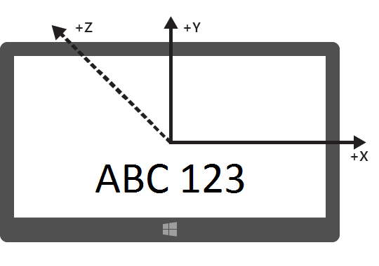

En la siguiente imagen se muestran ambas orientaciones, de la pantalla y del dispositivo, en **LandscapeFlipped**.

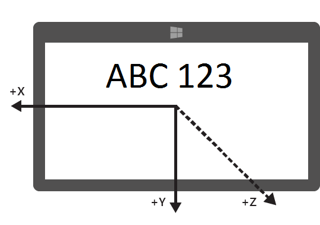

En la siguiente imagen se muestra la orientación de pantalla en Landscape y la orientación del dispositivo en LandscapeFlipped.

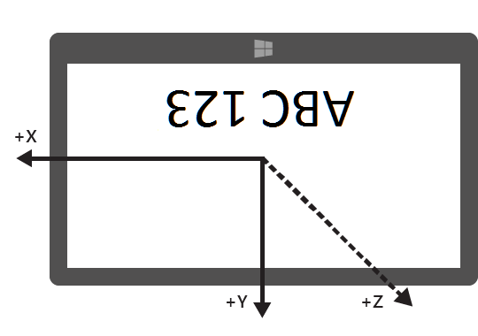

Los valores de orientación se consultan a través de la clase [**DisplayInformation**](https://msdn.microsoft.com/library/windows/apps/Dn264258), usando para ello el método [**GetForCurrentView**](https://msdn.microsoft.com/library/windows/apps/windows.graphics.display.displayinformation.getforcurrentview.aspx) con la propiedad [**CurrentOrientation**](https://msdn.microsoft.com/library/windows/apps/windows.graphics.display.displayinformation.currentorientation.aspx). Luego, se puede crear lógica contrastándolos con la enumeración [**DisplayOrientations**](https://msdn.microsoft.com/library/windows/apps/BR226142). No olvides que, por cada orientación que admitas, deberás admitir también una conversión de los ejes de referencia a dicha orientación.

## Dispositivos con orientación horizontal predeterminada y dispositivos con orientación vertical predeterminada

Los fabricantes producen dispositivos tanto con orientación horizontal predeterminada como con orientación vertical predeterminada Cuando integran los componentes en los dispositivos, lo hacen de una forma unificada y coherente para que todos los dispositivos funcionen dentro del mismo marco de referencia. En la siguiente tabla se muestran los ejes de sensor para ambos dispositivos, con orientación horizontal predeterminada y con orientación vertical predeterminada.

| Orientación | Con orientación horizontal predeterminada | Con orientación vertical predeterminada |
|-------------|-----------------|----------------|
| **Landscape** | 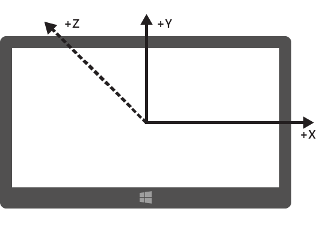 | 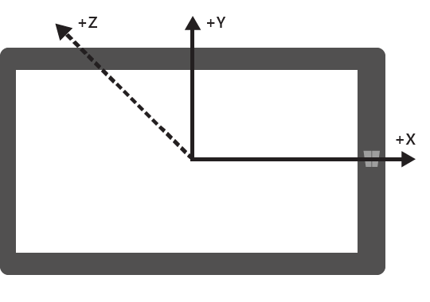 |
| **Portrait** | 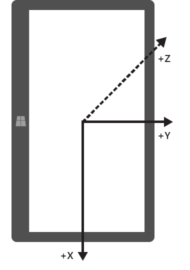 | 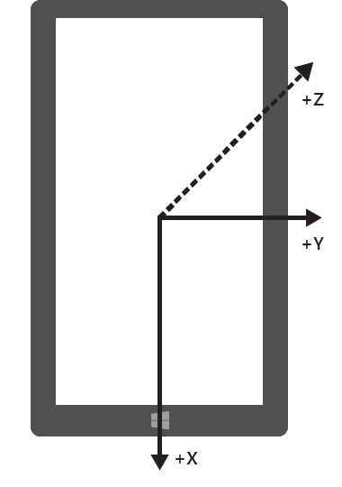 |
| **LandscapeFlipped ** | 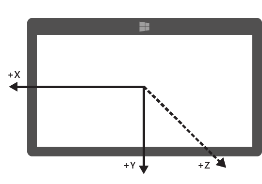 | 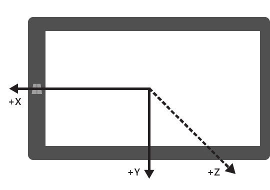 | 
| **PortraitFlipped** | 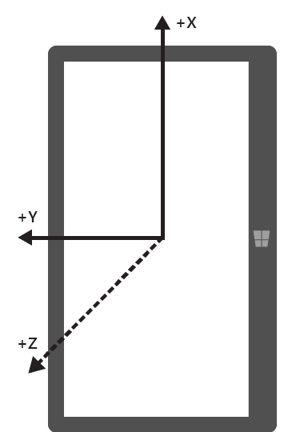| 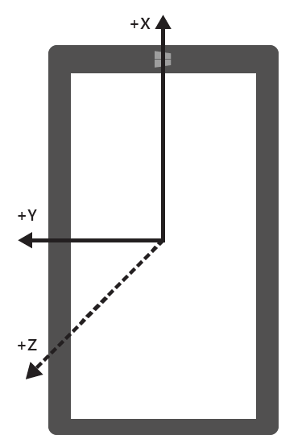 |

## Difusión de presentaciones con dispositivos y dispositivos sin periféricos

Algunos dispositivos tienen la capacidad de difundir la presentación a otro dispositivo. Por ejemplo, podrías tener una tableta y difundir la presentación a un proyector que estará orientado horizontalmente. En este escenario es importante tener en cuenta que la orientación del dispositivo se basa en el dispositivo original, no en el que presenta la pantalla. Por lo tanto, un acelerómetro notificará los datos de la tableta.

Además, algunos dispositivos no disponen de una pantalla. Con estos dispositivos, la orientación predeterminada de los mismos es vertical.

## Orientación de la pantalla y encabezado de brújula


El encabezado de brújula depende de los ejes de referencia, de modo que cuando la orientación del dispositivo lo hace. La compensación se efectúa siguiendo esta tabla (suponiendo que el usuario mira al norte).

| Orientación de la pantalla | Eje de referencia y encabezado de brújula | Encabezado de brújula de API al mirar al norte | Compensación del encabezado de brújula | 
|---------------------|------------------------------------|---------------------------------------|------------------------------|
| Landscape           | -Z | 0   | Encabezado               |
| Portrait            |  Y | 90  | (Encabezado+270) % 360 | 
| LandscapeFlipped    |  Z | 180 | (Encabezado+180) % 360 |
| PortraitFlipped     |  Y | 270 | (Encabezado+90) % 360  |

Modifica el encabezado de brújula como se indica en la tabla para que dicho encabezado se muestre correctamente. En el siguiente fragmento de código, se muestra cómo hacerlo.

```csharp
private void ReadingChanged(object sender, CompassReadingChangedEventArgs e)
{
    double heading = e.Reading.HeadingMagneticNorth;        
    double displayOffset;
    
    // Calculate the compass heading offset based on
    // the current display orientation.
    DisplayInformation displayInfo = DisplayInformation.GetForCurrentView();
    
    switch (displayInfo.CurrentOrientation) 
    { 
        case DisplayOrientations.Landscape: 
            displayOffset = 0; 
            break;
        case DisplayOrientations.Portrait: 
            displayOffset = 270; 
            break; 
        case DisplayOrientations.LandscapeFlipped: 
            displayOffset = 180; 
            break; 
        case DisplayOrientations.PortraitFlipped: 
            displayOffset = 90; 
            break; 
     } 
    

    double displayCompensatedHeading = (heading + displayOffset) % 360;
    
    // Update the UI...
}
```

## Orientación de la pantalla con acelerómetro y girómetro

Esta tabla convierte los datos de acelerómetro y girómetro para los datos de la pantalla.

| Ejes de referencia        |  X |  Y | Z |
|-----------------------|----|----|---|
| **Landscape**         |  X |  Y | Z |
| **Portrait**          |  Y | -X | Z |
| **LandscapeFlipped**  | -X | -Y | Z |
| **PortraitFlipped**   | -Y |  X | Z |

El siguiente ejemplo de código aplica estas conversiones al girómetro.

```csharp
private void ReadingChanged(object sender, GyrometerReadingChangedEventArgs e)
{
    double x_Axis;
    double y_Axis;
    double z_Axis;

    GyrometerReading reading = e.Reading;  
    
    // Calculate the gyrometer axes based on
    // the current display orientation.
    DisplayInformation displayInfo = DisplayInformation.GetForCurrentView();
    switch (displayInfo.CurrentOrientation) 
    { 
        case DisplayOrientations.Landscape: 
            x_Axis = reading.AngularVelocityX;
            y_Axis = reading.AngularVelocityY;
            z_Axis = reading.AngularVelocityZ;
            break;
        case DisplayOrientations.Portrait: 
            x_Axis = reading.AngularVelocityY;
            y_Axis = -1 * reading.AngularVelocityX;
            z_Axis = reading.AngularVelocityZ;
            break; 
        case DisplayOrientations.LandscapeFlipped: 
            x_Axis = -1 * reading.AngularVelocityX;
            y_Axis = -1 * reading.AngularVelocityY;
            z_Axis = reading.AngularVelocityZ;
            break; 
        case DisplayOrientations.PortraitFlipped: 
            x_Axis = -1 * reading.AngularVelocityY;
            y_Axis = reading.AngularVelocityX;
            z_Axis = reading.AngularVelocityZ;
            break; 
     } 
    
    
    // Update the UI...
}
```

## Orientación de la pantalla y orientación del dispositivo

Los datos de [**OrientationSensor**](https://msdn.microsoft.com/library/windows/apps/BR206371) se cambian de otra forma. Pensemos en estas distintas orientaciones al girar en el sentido contrario al de las agujas del reloj hacia el eje Z, deberemos revertir el giro para regresar a la orientación del usuario. En el caso de los datos de cuaternión, podemos emplear la fórmula de Euler para definir un giro con un cuaternión de referencia. También podemos usar una matriz de giro de referencia.

 Para obtener la orientación relativa que quieres, multiplica el objeto de referencia por el objeto absoluto. Este cálculo no es commutativo.

 En la expresión anterior, los datos del sensor devuelven el objeto absoluto.

| Orientación de la pantalla  | Giro en el sentido contrario a las agujas del reloj en torno a Z | Cuaternión de referencia (giro inverso) | Matriz de giro de referencia (giro inverso) | 
|----------------------|------------------------------------|-----------------------------------------|----------------------------------------------|
| **Landscape**        | 0                                  | 1 + 0i + 0j + 0k                        | \[1 0 0<br/> 0 1 0<br/> 0 0 1\]               |
| **Portrait**         | 90                                 | cos(-45⁰) + (i + j + k)*sin(-45⁰)       | \[0 1 0<br/>-1 0 0<br/>0 0 1]              |
| **LandscapeFlipped** | 180                                | 0 - i - j - k                           | \[1 0 0<br/> 0 1 0<br/> 0 0 1]               |
| **PortraitFlipped**  | 270                                | cos(-135⁰) + (i + j + k)*sin(-135⁰)     | \[0 -1 0<br/> 1  0 0<br/> 0  0 1]             |


<!--HONumber=Jul16_HO2-->


