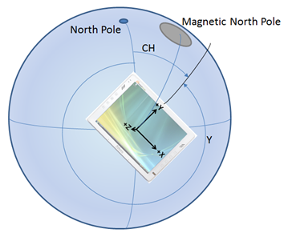

# Sensores

Los sensores permiten que las aplicaciones conozcan cuál es la relación entre un dispositivo y el entorno físico. Pueden indicar a la aplicación la dirección, la orientación y el movimiento del dispositivo. Pueden ayudarte a crear un juego, una aplicación de realidad aumentada o aplicación de utilidad de forma más útil e interactiva proporcionando una forma exclusiva de entrada, como el uso del movimiento del dispositivo para ordenar los caracteres en la pantalla o para simular que te encuentras en una cabina y el dispositivo es el volante.

Como regla general, decide desde el comienzo si la aplicación dependerá exclusivamente de sensores o si estos solamente ofrecerán un mecanismo de control adicional. Por ejemplo, un juego de conducción que usa un dispositivo como volante virtual puede controlarse también a través de una GUI en pantalla. De este modo, la aplicación funciona sin importar cuáles son los sensores disponibles en el sistema. Por otro lado, un laberinto de canicas puede codificarse para que funcione solamente en los sistemas que tienen los sensores apropiados. Debes tomar la decisión estratégica de si confías por completo en los sensores. Ten en cuenta que el esquema de control táctil o por mouse resigna la inmersión en pos de un mayor control.

| Tema                                                       | Descripción  |
|-------------------------------------------------------------|--------------|
| [Calibrar los sensores](calibrate-sensors.md)                   | Es probable que sea necesario calibrar los sensores basados en el magnetómetro de un dispositivo, es decir, la brújula, el inclinómetro y el sensor de orientación, debido a factores ambientales. La enumeración [<strong>MagnetometerAccuracy</strong>](https://msdn.microsoft.com/library/windows/apps/Dn297552) puede ayudar a determinar un curso de acción cuando el dispositivo necesite calibración. |
| [Orientación del sensor](sensor-orientation.md)                 | Los datos de sensor procedentes de las clases [<strong>OrientationSensor</strong>](https://msdn.microsoft.com/library/windows/apps/BR206371) se definen por medio de sus ejes de referencia. Estos ejes se definen a su vez mediante la orientación horizontal del dispositivo y, por tanto, giran con el dispositivo cuando el usuario lo voltea. |
| [Usar el acelerómetro](use-the-accelerometer.md)           | Aprende a usar el acelerómetro para responder al movimiento del usuario. |
| [Usar la brújula](use-the-compass.md)                       | Aprende a usar la brújula para determinar el rumbo actual. |
| [Usar el girómetro](use-the-gyrometer.md)                   | Aprende a usar el girómetro para detectar los cambios en el movimiento del usuario. | 
| [Usar el inclinómetro](use-the-inclinometer.md)             | Aprende a usar el inclinómetro para determinar la rotación alrededor del eje X (pitch), la rotación alrededor del eje Y (roll) y la rotación alrededor del eje Z (yaw). |
| [Usar el sensor de luz](use-the-light-sensor.md)             | Aprende a usar el sensor de luz ambiental para detectar cambios de iluminación. |
| [Usar el sensor de orientación](use-the-orientation-sensor.md) | Aprende a usar los sensores de orientación para determinar la orientación del dispositivo.|

## Procesamiento por lotes de sensores

Algunos sensores admiten el concepto de procesamiento por lotes. Esto varía según el sensor individual disponible. Cuando un sensor implementa procesamiento por lotes, recopila varios puntos de datos en un intervalo de tiempo especificado y, después, transfiere todos esos datos a la vez. Esto es distinto del comportamiento normal, por el que un sensor informa de sus hallazgos en cuanto se realiza una lectura. Considera el siguiente diagrama en el que se muestra cómo se recopilan los datos y, después, se entregan, primero con entrega normal y a continuación, con la entrega por lotes.

La principal ventaja del procesamiento por lotes de los sensores es una mayor duración de la batería. Cuando los datos no se envían de inmediato, se ahorra en consumo del procesador y se evita que los datos se deban procesar de inmediato. Las partes del sistema se pueden suspender hasta que se necesitan, lo que genera un importante ahorro energético.

Puedes influir en la frecuencia con que el sensor envía lotes, ajustando la latencia. Por ejemplo, el sensor [**Accelerometer**](https://msdn.microsoft.com/library/windows/apps/BR225687) tiene la propiedad [**ReportLatency**](https://msdn.microsoft.com/library/windows/apps/windows.devices.sensors.accelerometer.reportlatency). Cuando se establece esta propiedad para una aplicación, el sensor enviará datos después del período de tiempo especificado. Puedes controlar la cantidad de datos que se acumulen para una latencia determinada, estableciendo la propiedad [**ReportInterval**](https://msdn.microsoft.com/library/windows/apps/windows.devices.sensors.accelerometer.reportinterval).

Hay un par de advertencias que se deben tener en cuenta con respecto a la configuración de la latencia. La primera advertencia es que cada sensor tiene un valor [**MaxBatchSize**](https://msdn.microsoft.com/library/windows/apps/windows.devices.sensors.accelerometer.maxbatchsize.aspx) que puede admitir basado en el propio sensor. Este es el número de eventos que el sensor puede almacenar en memoria caché antes de que se obligue a enviarlos. Si se multiplica **MaxBatchSize** por [**ReportInterval**](https://msdn.microsoft.com/library/windows/apps/windows.devices.sensors.accelerometer.reportinterval), se determina el valor de [**ReportLatency**](https://msdn.microsoft.com/library/windows/apps/windows.devices.sensors.accelerometer.reportlatency) máximo. Si especificas un valor mayor que este, se usará la latencia máxima para que no se pierdan datos. Además, varias aplicaciones pueden establecer la latencia que cada una desea. Para satisfacer las necesidades de todas las aplicaciones, se usará el período de latencia más corto. Por estos motivos, la latencia que se establezca en la aplicación puede no coincidir con la latencia observada.

Si un sensor usa informe por lotes, una llamada a [**GetCurrentReading**](https://msdn.microsoft.com/library/windows/apps/windows.devices.sensors.accelerometer.getcurrentreading) borrará el lote de datos actual y se iniciará un nuevo período de latencia.

## Acelerómetro

El sensor [**Accelerometer**](https://msdn.microsoft.com/library/windows/apps/BR225687) mide los valores de la fuerza G en los ejes X, Y y Z del dispositivo y es excelente para sencillas aplicaciones basadas en movimiento. Ten en cuenta que los valores de fuerza G incluyen aceleración por gravedad. Si el dispositivo tiene [**SimpleOrientation**](https://msdn.microsoft.com/library/windows/apps/BR206399) de **FaceUp** sobre una mesa, el acelerómetro leerá -1 G en el eje Z. Es por ello que los acelerómetros no necesariamente miden solo la aceleración de coordenadas, la tasa de cambio de la velocidad. Cuando uses un acelerómetro, asegúrate de diferenciar el vector gravitacional de la gravedad y el vector de aceleración lineal del movimiento. Ten en cuenta que el vector gravitacional debe normalizarse en 1 para un dispositivo estático.

En los siguientes diagramas se ilustra lo siguiente:

-   V1 = Vector 1 = Fuerza por gravedad
-   V2 = Vector 2 = Eje -Z del chasis del dispositivo (puntos fuera de la parte posterior de la pantalla)
-   Θi = ángulo de inclinación = ángulo entre el eje –Z del chasis del dispositivo y el vector de gravedad

Las aplicaciones que pueden usar un sensor de acelerómetro son, entre otras, los juegos en los que una canica debe girar hacia la dirección a la que se inclina el dispositivo (vector de gravedad). Este tipo de funcionalidad se asemeja mucho al del [**Inclinometer**](https://msdn.microsoft.com/library/windows/apps/BR225766) y podría hacerse también con ese sensor mediante una combinación de rotación alrededor del eje x y rotación alrededor del eje y. El uso del vector de gravedad del acelerómetro simplifica esto en cierta medida proporcionando un vector que se manipula fácilmente de forma matemática para la inclinación del dispositivo. Otro ejemplo sería una aplicación que hace el sonido de chasquido de un látigo cuando el usuario realiza un movimiento rápido por el aire con el dispositivo (vector de aceleración lineal).

Para obtener un ejemplo de implementación, consulta la [muestra de acelerómetro](https://github.com/Microsoft/Windows-universal-samples/tree/master/Samples/Accelerometer).

## Sensor de actividad

El sensor [**Activity**](https://msdn.microsoft.com/library/windows/apps/Dn785096) determina el estado actual del dispositivo conectado al sensor. Este sensor se usa con frecuencia en las aplicaciones de forma física para realizar un seguimiento del momento en que un usuario con un dispositivo está corriendo o andando. Consulta [**ActivityType**](https://msdn.microsoft.com/library/windows/apps/Dn785128) para obtener una lista de posibles actividades que se pueden detectar con la API de este sensor.

Para obtener un ejemplo de implementación, consulta la [muestra de sensor de actividad](https://github.com/Microsoft/Windows-universal-samples/tree/master/Samples/ActivitySensor).

## Altímetro

El sensor [**Altimeter**](https://msdn.microsoft.com/library/windows/apps/Dn858893) devuelve un valor que indica la altitud del sensor. Esto te permite realizar un seguimiento de los cambios de altitud en metros sobre el nivel del mar. Un ejemplo de una aplicación que puede usar esta opción sería una aplicación de carrera que realiza un seguimiento de los cambios de elevación durante la carrera para calcular las calorías quemadas. En este caso, estos datos del sensor pueden combinarse con el sensor [**Activity**](https://msdn.microsoft.com/library/windows/apps/Dn785096) para proporcionar información de seguimiento más precisa.

Para obtener un ejemplo de implementación, consulta la [muestra de altímetro](https://github.com/Microsoft/Windows-universal-samples/tree/master/Samples/Altimeter).

## Barómetro

El sensor [**Barometer**](https://msdn.microsoft.com/library/windows/apps/Dn872405) permite a una aplicación obtener lecturas barométricas. Una aplicación meteorológica podría usar esta información para proporcionar información sobre la presión atmosférica actual. Esto puede usarse para proporcionar información más detallada y predecir posibles cambios en el tiempo.

Para obtener un ejemplo de implementación, consulta la [muestra de barómetro](https://github.com/Microsoft/Windows-universal-samples/tree/master/Samples/Barometer).

## Brújula

El sensor [**Compass**](https://msdn.microsoft.com/library/windows/apps/BR225705) devuelve una dirección 2D con respecto al norte magnético sobre la base del plano horizontal de la tierra. Este sensor no debe usarse al determinar la orientación específica del dispositivo ni para representar nada en un espacio 3D. Las características gráficas pueden causar una declinación natural en la dirección. Por ello algunos sistemas admiten tanto [**HeadingMagneticNorth**](https://msdn.microsoft.com/library/windows/apps/windows.devices.sensors.compassreading.headingmagneticnorth.aspx) como [**HeadingTrueNorth**](https://msdn.microsoft.com/library/windows/apps/windows.devices.sensors.compassreading.headingtruenorth.aspx). Piensa en cuál es mejor para tu aplicación, pero recuerda que no todos los sistemas informarán un valor de norte verdadero. Los sensores de girómetro y magnetómetro (un dispositivo que mide la magnitud de fuerza magnética) combinan sus datos para dar origen a la orientación de la brújula, lo que tiene el efecto neto de estabilizar los datos (la fuerza de campo magnético es muy inestable debido a los componentes del sistema eléctrico).

Las aplicaciones que quieren mostrar una rosa de los vientos o navegar por un mapa, generalmente usan el sensor de brújula.

Para obtener un ejemplo de implementación, consulta la [muestra de compás](https://github.com/Microsoft/Windows-universal-samples/tree/master/Samples/Compass).

## Girómetro

El sensor [**Gyrometer**](https://msdn.microsoft.com/library/windows/apps/BR225718) mide las velocidades angulares en los ejes X, Y y Z. Estas son muy útiles en sencillas aplicaciones basadas en movimiento que no prestan atención a la orientación del dispositivo sino que se preocupan por que el dispositivo gire a distintas velocidades. Los girómetros pueden sufrir de ruido en los datos o una desviación de constantes a lo largo de uno o más ejes. Debes consultar el acelerómetro para comprobar si el dispositivo se está movimiento con el fin de determinar si el girómetro presenta alguna desviación y, después, compensarla en tu aplicación.

Un ejemplo de una aplicación que puede usar el sensor de girómetro es un juego que hace girar la rueda de una ruleta mediante la realización de un movimiento rotativo rápido del dispositivo.

Para obtener un ejemplo de implementación, consulta la [muestra de girómetro](https://github.com/Microsoft/Windows-universal-samples/tree/master/Samples/Gyrometer).

## Inclinómetro

El sensor [**Inclinometer**](https://msdn.microsoft.com/library/windows/apps/BR225766) especifica los valores de rotación alrededor del eje x, rotación alrededor del eje y rotación alrededor del eje z de un dispositivo y funciona mejor con aplicaciones que deben saber cómo el dispositivo está situado en el espacio. La rotación alrededor del eje x y la rotación alrededor del eje se obtienen tomando el vector de gravedad del acelerómetro e integrando los datos del girómetro. El cabeceo se establece con datos del magnetómetro y del girómetro (de forma similar que la dirección de la brújula). Los inclinómetros ofrecen datos de orientación avanzados de una forma fácil de comprender. Úsalos cuando necesites la orientación del dispositivo pero no tengas que manipular los datos del sensor.

Las aplicaciones que cambian la vista para coincidir con la orientación del dispositivo pueden usar el sensor de inclinómetro. También, las aplicaciones que muestran un avión que coincide con la rotación alrededor del eje x, la rotación alrededor del eje y la rotación alrededor del eje z del dispositivo podrían usar las lecturas del inclinómetro.

Para un ejemplo de implementación, consulta la muestra de inclinómetro [https://github.com/Microsoft/Windows-universal-samples/tree/master/Samples/Inclinometer](https://github.com/Microsoft/Windows-universal-samples/tree/master/Samples/Inclinometer).

## Sensor de luz

El sensor [**Light**](https://msdn.microsoft.com/library/windows/apps/BR225790) es capaz de determinar la luz ambiente que rodea al sensor. Esto permite que una aplicación determine cuándo ha cambiado la configuración de luz alrededor de un dispositivo. Por ejemplo, un usuario con un dispositivo de tableta puede pasar de una ubicación de interior a otra de exterior en un día soleado. Una aplicación inteligente puede usar este valor para aumentar el contraste entre el fondo y la fuente representada. Esto hará que el contenido sea legible incluso en la configuración exterior con más brillo.

Para obtener un ejemplo de implementación, consulta la [muestra de sensor de luz](https://github.com/Microsoft/Windows-universal-samples/tree/master/Samples/LightSensor).

## Sensor de orientación

La orientación del dispositivo se expresa mediante una matriz de rotación y cuaternión. El [**OrientationSensor**](https://msdn.microsoft.com/library/windows/apps/BR206371) ofrece un alto grado de precisión al determinar cómo se sitúa el dispositivo en el espacio con respecto a la dirección absoluta. Los datos de **OrientationSensor** se derivan del acelerómetro, el girómetro y el magnetómetro. Como tales, tanto el sensor de brújula como de inclinómetro pueden derivarse de los valores de cuaternión. Las matrices de rotación y los cuaterniones pueden usarse en manipulación matemática avanzada y, a menudo, se usan en programación gráfica. Las aplicaciones que usan manipulación compleja deben privilegiar el sensor de orientación dado que muchas transformaciones se basan en las matrices de rotación y los cuaterniones.

El sensor de orientación a menudo se usa en aplicaciones de realidad aumentada avanzadas que pintan una cubierta sobre el entorno en función de la dirección a la que apunta la parte posterior del dispositivo.

Para obtener un ejemplo de implementación, consulta la [muestra de sensor de orientación](https://github.com/Microsoft/Windows-universal-samples/tree/master/Samples/OrientationSensor).

## Podómetro

El sensor [**Pedometer**](https://msdn.microsoft.com/library/windows/apps/Dn878203) realiza un seguimiento de la cantidad de pasos que da el usuario con el dispositivo conectado. El sensor está configurado para mantener el seguimiento del número de pasos durante un período de tiempo determinado. Varias aplicaciones de forma física llevan un seguimiento del número de pasos para ayudar al usuario establecer y alcanzar distintos objetivos. Esta información puede recopilarse y almacenarse para mostrar el progreso con el tiempo.

Para obtener un ejemplo de implementación, consulta la [muestra de podómetro](https://github.com/Microsoft/Windows-universal-samples/tree/master/Samples/Pedometer).

## Sensor de proximidad

El sensor [**Proximity**](https://msdn.microsoft.com/library/windows/apps/Dn872427) puede usarse para indicar si el sensor detecta los objetos. Además de determinar si un objeto está dentro del alcance del dispositivo, el sensor de proximidad también puede determinar la distancia al objeto detectado. Un ejemplo de uso de este sensor es con una aplicación que necesita desactivar el estado de suspensión cuando un usuario se aproxima a una distancia especificada. El dispositivo puede permanecer en estado de suspensión de bajo consumo hasta que el sensor de proximidad detecta un objeto y, a continuación, entra en un estado más activo.

Para obtener un ejemplo de implementación, consulta la [muestra de sensor de proximidad](https://github.com/Microsoft/Windows-universal-samples/tree/master/Samples/ProximitySensor).

## Orientación sencilla

El [**SimpleOrientationSensor**](https://msdn.microsoft.com/library/windows/apps/windows.devices.sensors.simpleorientationsensor.aspx) detecta la orientación de cuadrante actual del dispositivo especificado o si se encuentra cara arriba o abajo. Tiene seis estados [**SimpleOrientation**](https://msdn.microsoft.com/library/windows/apps/BR206399) posibles (**NotRotated**, **Rotated90**, **Rotated180**, **Rotated270**, **FaceUp**, **FaceDown**).

Una aplicación de lector que cambia su pantalla sobre la base de si el dispositivo se encuentra paralelo o perpendicular al suelo puede usar estos valores del objeto SimpleOrientationSensor para determinar cómo se está sosteniendo el dispositivo.

Para obtener un ejemplo de implementación, consulta la [muestra de sensor de orientación simple](https://github.com/Microsoft/Windows-universal-samples/tree/master/Samples/SimpleOrientationSensor).
