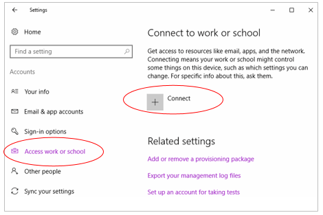
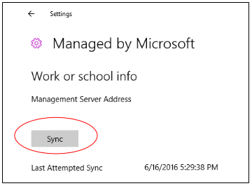

# Crear una aplicación habilitada que consume datos de empresa y personales

__Nota__ La directiva de Windows Information Protection (WIP) se puede aplicar a Windows 10, versión 1607.

Una aplicación *habilitada* diferencia los datos corporativos y personales y sabe cuáles tiene que proteger en función de las directivas de Windows Information Protection (WIP) definidas por el administrador.

En esta guía te mostraremos cómo crear una. Una vez finalizada, los administradores de las directivas confiarán en tu aplicación para que pueda consumir datos de su organización. Y los empleados estarán encantados de que sus datos personales se mantengan intactos en sus dispositivos, incluso si dejan de formar parte de la administración de dispositivos móviles (MDM) de la organización o si ellos mismos la abandonan.

Puedes leer más sobre WIP y las aplicaciones habilitadas aquí: [Windows Information Protection (WIP)](wip-hub.md).

Encontrarás una muestra completa [aquí](https://github.com/Microsoft/Windows-universal-samples/tree/master/Samples/EnterpriseDataProtection).

Si estás listo para realizar cada una de las tareas, empecemos.

## En primer lugar, recopila aquello que necesites.

Necesitarás lo siguiente:

* Acceso a una cuenta de Microsoft Intune.

* Un equipo de desarrollo que ejecute Windows 10, versión 1607.

* Un dispositivo de pruebas que ejecute Windows 10, versión 1607. Vas a depurar la aplicación usando este dispositivo de prueba.

  Para la depuración, no podrás usar el mismo dispositivo que esté inscrito en MDM. Por eso necesitarás un dispositivo de prueba independiente.

  Para hacerlo más sencillo, vamos a suponer que el dispositivo de prueba es un equipo o máquina virtual.

## Configuración de tu entorno de desarrollo

Para ello deberás hacer lo siguiente:

* Inscribe el equipo de prueba.

* Crea una directiva de protección.

* Descarga la directiva en el equipo de prueba.

* Configura un proyecto de Visual Studio.

* Configura la depuración remota.

* Agregar espacios de nombres a los archivos de código

**Inscribir el equipo de prueba**

 Para inscribir tu equipo de prueba, agrega tu cuenta de Intune en la página **Configuración**->**Acceder a la red del trabajo o colegio** del equipo del prueba.

 

 El nombre del equipo aparecerá en la consola de administración de Intune.

**Crear una directiva de protección**

Crea una directiva e impleméntala en el equipo de prueba. Consulta [Crear una directiva de Windows Information Protection (WIP) con Microsoft Intune](https://technet.microsoft.com/itpro/windows/keep-secure/create-edp-policy-using-intune).

**Descargar la directiva en tu dispositivo**

En el equipo de prueba, ve a la página **Configuración** y, a continuación, selecciona **Acceder a la red del trabajo o colegio**-> **Información**->**Sincronización**.



**Configuración de un proyecto de Visual Studio**

1. Abre el proyecto en tu equipo de desarrollo.

2. Agrega una referencia a las extensiones móviles y de escritorio para la Plataforma universal de Windows (UWP).

    

3. Agrega estas funcionalidades al archivo de manifiesto del paquete:

    ```xml
       <Capability Name="privateNetworkClientServer" />
       <rescap:Capability Name="enterpriseDataPolicy"/>
    ```
   >*Lectura opcional*: El prefijo "rescap" significa *Funcionalidad restringida*. Consulta [Funcionalidades especiales y restringidas](https://msdn.microsoft.com/windows/uwp/packaging/app-capability-declarations).

4. Agrega este espacio de nombres al archivo de manifiesto del paquete:

    ```xml
      xmlns:rescap="http://schemas.microsoft.com/appx/manifest/foundation/windows10/restrictedcapabilities"
    ```
5. Agrega el prefijo de espacio de nombres al elemento ``<ignorableNamespaces>`` de tu archivo de manifiesto del paquete.

    ```xml
        <IgnorableNamespaces="uap mp rescap">
    ```

    De esta forma, si la aplicación se ejecuta en una versión del sistema operativo Windows que no sea compatible con las funcionalidades restringidas, Windows ignorará la funcionalidad ``enterpriseDataPolicy``.

**Configurar la depuración remota**

Instala las Herramientas remotas para Visual Studio en el equipo de prueba. A continuación, inicia el depurador remoto en el equipo de desarrollo y comprueba si tu aplicación se ejecuta en el equipo de destino.

Consulta [Instrucciones del equipo remoto](https://msdn.microsoft.com/windows/uwp/debug-test-perf/deploying-and-debugging-uwp-apps#remote-pc-instructions).

**Agregar estos espacios de nombres a los archivos de código**

Agrégalos usando estas instrucciones en la parte superior de los archivos de código (los fragmentos de código utilizados en esta guía):

```csharp
using System.Threading.Tasks;
using Windows.Security.EnterpriseData;
using Windows.ApplicationModel.DataTransfer;
using Windows.Web.Http;
using Windows.Storage.Streams;
using Windows.Web.Http.Filters;
using Windows.Storage;
using Windows.Foundation.Metadata;
using Windows.UI.Xaml.Controls;
using Windows.Data.Xml.Dom;
```

## Determinar si el sistema operativo que ejecuta la aplicación admite WIP.

Para ello, usa la función [**IsApiContractPresent**](https://msdn.microsoft.com/en-us/library/windows/apps/windows.foundation.metadata.apiinformation.isapicontractpresent.aspx).

```csharp
bool wipSupported = ApiInformation.IsApiContractPresent("Windows.Security.EnterpriseData.EnterpriseDataContract", 3);

if (wipSupported)
{
    // WIP is supported on the platform
}
else
{
    // WIP is not supported on the platform
}
```

Windows Information Protection es compatible con Windows 10, versión 1607.

## Leer datos de empresa

Todos los archivos, los puntos de conexión de red, los datos del Portapapeles y los datos que aceptas de un contrato para contenido compartido tienen un identificador de empresa.

Para leer datos desde cualquiera de estas fuentes, tu aplicación deberá comprobar que tu identificador de empresa está administrado por una directiva.

Empecemos con los archivos.

### Leer datos desde un archivo

**Paso 1: Obtener el identificador de archivo**

```csharp
    Windows.Storage.StorageFolder storageFolder =
        Windows.Storage.ApplicationData.Current.LocalFolder;

    Windows.Storage.StorageFile file =
        await storageFolder.GetFileAsync(fileName);
```

**Paso 2: Determinar si la aplicación puede abrir el archivo**

Determinar si el archivo está protegido. Si es así, la aplicación podrá abrirlo si se cumplen estos dos requisitos:

* La identidad del archivo es administrada por la directiva.
* Tu aplicación está en la lista de aplicaciones permitidas por esa directiva.

Si una de estas condiciones no se cumple, [**ProtectionPolicyManager.IsIdentityManaged**](https://msdn.microsoft.com/library/windows/apps/windows.security.enterprisedata.protectionpolicymanager.isidentitymanaged.aspx) devuelve **false** y no será posible abrir el archivo.

```csharp
FileProtectionInfo protectionInfo = await FileProtectionManager.GetProtectionInfoAsync(file);

if (protectionInfo.Status == FileProtectionStatus.Protected)
{
    if (!ProtectionPolicyManager.IsIdentityManaged(protectionInfo.Identity))
    {
        return false;
    }
}
else if (protectionInfo.Status == FileProtectionStatus.Revoked)
{
    // Code goes here to handle this situation. Perhaps, show UI
    // saying that the user's data has been revoked.
}
```
> **API** <br>
[FileProtectionManager.GetProtectionInfoAsync](https://msdn.microsoft.com/library/windows/apps/windows.security.enterprisedata.fileprotectionmanager.getprotectioninfoasync.aspx)<br>
[FileProtectionInfo](https://msdn.microsoft.com/library/windows/apps/windows.security.enterprisedata.fileprotectioninfo.aspx)<br>
[FileProtectionStatus](https://msdn.microsoft.com/library/windows/apps/windows.security.enterprisedata.fileprotectionstatus.aspx)<br>
[ProtectionPolicyManager.IsIdentityManaged](https://msdn.microsoft.com/library/windows/apps/windows.security.enterprisedata.protectionpolicymanager.isidentitymanaged.aspx)

**Paso 3: Leer el archivo en una secuencia o búfer**

*Leer el archivo en una secuencia*

```csharp
var stream = await file.OpenAsync(Windows.Storage.FileAccessMode.ReadWrite);
```

*Leer el archivo en un búfer*

```csharp
var buffer = await Windows.Storage.FileIO.ReadBufferAsync(file);
```

### Leer los datos desde el punto de conexión de red

Crea un contexto de subproceso protegido para leer desde un punto de conexión de empresa.

**Paso 1: Obtener la identidad del punto de conexión de red**

```csharp
Uri resourceURI = new Uri("http://contoso.com/stockData.xml");

Windows.Networking.HostName hostName =
    new Windows.Networking.HostName(resourceURI.Host);

string identity = await ProtectionPolicyManager.
    GetPrimaryManagedIdentityForNetworkEndpointAsync(hostName);
```

Si el punto de conexión no está administrado por la directiva, obtendrás una cadena vacía.

> **API** <br>
[ProtectionPolicyManager.GetPrimaryManagedIdentityForNetworkEndpointAsync](https://msdn.microsoft.com/library/windows/apps/windows.security.enterprisedata.protectionpolicymanager.getprimarymanagedidentityfornetworkendpointasync.aspx)


**Paso 2: Crear un contexto de subproceso protegido**

Si el punto de conexión está administrado por una directiva, crea un contexto de subproceso protegido. Esto etiqueta todas las conexiones de red que se realizan en el mismo subproceso a dicha identidad.

También proporciona acceso a los recursos de red de empresa que administra esa directiva.

```csharp
HttpClient client = null;

if (!string.IsNullOrEmpty(identity))
{
    using (ThreadNetworkContext threadNetworkContext =
            ProtectionPolicyManager.CreateCurrentThreadNetworkContext(identity))
    {
        client = new HttpClient();

        // Add code here to get data from the endpoint.
    }
}
```
Este ejemplo incluye llamadas de socket en un bloque ``using``. Si no haces esto, asegúrate de cerrar el contexto de subproceso tras haber recuperado los recursos. Consulta [ThreadNetworkContext.Close](https://msdn.microsoft.com/library/windows/apps/windows.security.enterprisedata.threadnetworkcontext.close.aspx).

No crees ningún archivo personal en ese subproceso protegido porque los archivos se cifrarán automáticamente.

El método [**ProtectionPolicyManager.CreateCurrentThreadNetworkContext**](https://msdn.microsoft.com/library/windows/apps/windows.security.enterprisedata.protectionpolicymanager.createcurrentthreadnetworkcontext.aspx) devuelve un objeto [**ThreadNetworkContext**](https://msdn.microsoft.com/library/windows/apps/windows.security.enterprisedata.threadnetworkcontext.aspx) independientemente de si el punto de conexión está administrado por una directiva. Si la aplicación controla recursos personales y de empresa, llama a [**ProtectionPolicyManager.CreateCurrentThreadNetworkContext**](https://msdn.microsoft.com/library/windows/apps/windows.security.enterprisedata.protectionpolicymanager.createcurrentthreadnetworkcontext.aspx) para todas las identidades.  Una vez obtenido el recurso, eliminar el ThreadNetworkContext para borrar cualquier etiqueta de identidad del subproceso actual.

> **API** <br>
[ProtectionPolicyManager.GetForCurrentView](https://msdn.microsoft.com/library/windows/apps/windows.security.enterprisedata.protectionpolicymanager.getforcurrentview.aspx)<br>
[ProtectionPolicyManager.Identity](https://msdn.microsoft.com/library/windows/apps/windows.security.enterprisedata.protectionpolicymanager.aspx)<br>
[ProtectionPolicyManager.CreateCurrentThreadNetworkContext](https://msdn.microsoft.com/library/windows/apps/windows.security.enterprisedata.protectionpolicymanager.createcurrentthreadnetworkcontext.aspx)

**Paso 3: Leer el recurso en un búfer**

```csharp
IBuffer data = await client.GetBufferAsync(resourceURI);
```


**Controlar las redirecciones de página**

En ocasiones, un servidor web redirigirá el tráfico hacia una versión más actual de un recurso.

Para controlar esto, realiza solicitudes hasta que el estado de la respuesta de la solicitud tiene el valor **Aceptar**.

A continuación, usa el URI de la respuesta para obtener la identidad del punto de conexión. Esta es una forma de hacerlo:

```csharp
public static async Task<IBuffer> getDataFromNetworkResource(Uri resourceURI)
{
    bool finalURL = false;

    HttpResponseMessage response = null;

    while (!finalURL)
    {

        Windows.Networking.HostName hostName =
            new Windows.Networking.HostName(resourceURI.Host);

        string identity = await ProtectionPolicyManager.
            GetPrimaryManagedIdentityForNetworkEndpointAsync(hostName);

        HttpClient client = null;

        HttpBaseProtocolFilter filter = new HttpBaseProtocolFilter();
        filter.AllowAutoRedirect = false;

        if (!string.IsNullOrEmpty(m_EnterpriseId))
        {
            using (ThreadNetworkContext threadNetworkContext =
                    ProtectionPolicyManager.CreateCurrentThreadNetworkContext(identity))
            {
                client = new HttpClient(filter);
            }
        }
        else
        {
            client = new HttpClient(filter);
        }
        HttpRequestMessage message = new HttpRequestMessage(HttpMethod.Get, resourceURI);
        response = await client.SendRequestAsync(message);

        if (response.StatusCode == HttpStatusCode.MultipleChoices &&
            response.StatusCode == HttpStatusCode.MovedPermanently &&
            response.StatusCode == HttpStatusCode.Found &&
            response.StatusCode == HttpStatusCode.SeeOther &&
            response.StatusCode == HttpStatusCode.NotModified &&
            response.StatusCode == HttpStatusCode.UseProxy &&
            response.StatusCode == HttpStatusCode.TemporaryRedirect &&
            response.StatusCode == HttpStatusCode.PermanentRedirect)
        {
            resourceURI = message.RequestUri;
        }
        else
        {
            finalURL = true;
        }
    }

    IBuffer data = await response.Content.ReadAsBufferAsync();

    return data;

}
```

> **API** <br>
[ProtectionPolicyManager.GetPrimaryManagedIdentityForNetworkEndpointAsync](https://msdn.microsoft.com/library/windows/apps/windows.security.enterprisedata.protectionpolicymanager.getprimarymanagedidentityfornetworkendpointasync.aspx)<br>
[ProtectionPolicyManager.CreateCurrentThreadNetworkContext](https://msdn.microsoft.com/library/windows/apps/windows.security.enterprisedata.protectionpolicymanager.createcurrentthreadnetworkcontext.aspx)<br>
[ProtectionPolicyManager.GetForCurrentView](https://msdn.microsoft.com/library/windows/apps/windows.security.enterprisedata.protectionpolicymanager.getforcurrentview.aspx)<br>
[ProtectionPolicyManager.Identity](https://msdn.microsoft.com/library/windows/apps/windows.security.enterprisedata.protectionpolicymanager.aspx)

### Leer datos desde el Portapapeles

**Obtener permiso para usar los datos del Portapapeles**

Para obtener datos del Portapapeles, tendrás que pedir permiso a Windows. Usa [**DataPackageView.RequestAccessAsync**](https://msdn.microsoft.com/library/windows/apps/dn706645.aspx) para ello.

```csharp
public static async Task PasteText(TextBox textBox)
{
    DataPackageView dataPackageView = Clipboard.GetContent();

    if (dataPackageView.Contains(StandardDataFormats.Text))
    {
        ProtectionPolicyEvaluationResult result = await dataPackageView.RequestAccessAsync();

        if (result == ProtectionPolicyEvaluationResult..Allowed)
        {
            string contentsOfClipboard = await dataPackageView.GetTextAsync();
            textBox.Text = contentsOfClipboard;
        }
    }
}
```

> **API** <br>
[DataPackageView.RequestAccessAsync](https://msdn.microsoft.com/library/windows/apps/dn706645.aspx)

**Ocultar o deshabilitar las características que usan datos del Portapapeles**

Determinar si la vista actual tiene permiso para obtener los datos que están en el Portapapeles.

Si no es así, puedes deshabilitar u ocultar los controles que permiten a los usuarios pegar información desde el Portapapeles u obtener una vista previa de su contenido.

```csharp
private bool IsClipboardAllowedAsync()
{
    ProtectionPolicyEvaluationResult protectionPolicyEvaluationResult = ProtectionPolicyEvaluationResult.Blocked;

    DataPackageView dataPackageView = Clipboard.GetContent();

    if (dataPackageView.Contains(StandardDataFormats.Text))

        protectionPolicyEvaluationResult =
            ProtectionPolicyManager.CheckAccess(dataPackageView.Properties.EnterpriseId,
                ProtectionPolicyManager.GetForCurrentView().Identity);

    return (protectionPolicyEvaluationResult == ProtectionPolicyEvaluationResult.Allowed |
        protectionPolicyEvaluationResult == ProtectionPolicyEvaluationResult.ConsentRequired);
}
```

> **API** <br>
[ProtectionPolicyEvaluationResult](https://msdn.microsoft.com/library/windows/apps/windows.security.enterprisedata.protectionpolicyevaluationresult.aspx)<br>
[ProtectionPolicyManager.GetForCurrentView](https://msdn.microsoft.com/library/windows/apps/windows.security.enterprisedata.protectionpolicymanager.getforcurrentview.aspx)<br>
[ProtectionPolicyManager.Identity](https://msdn.microsoft.com/library/windows/apps/windows.security.enterprisedata.protectionpolicymanager.aspx)

**Impedir a los usuarios que les aparezca un cuadro de diálogo de consentimiento**

Un documento nuevo no es *personal* o *de empresa*. Es simplemente nuevo. Si un usuario pega los datos de empresa en él, Windows aplicará la directiva y se le mostrará al usuario un cuadro de diálogo de consentimiento. Este código impide que eso ocurra. En esta tarea no se trata de proteger los datos. Es más sobre cómo hacer que los usuarios reciban el cuadro de diálogo de consentimiento en los casos donde la aplicación crea un elemento nuevo.

```csharp
private async void PasteText(bool isNewEmptyDocument)
{
    DataPackageView dataPackageView = Clipboard.GetContent();

    if (dataPackageView.Contains(StandardDataFormats.Text))
    {
        if (!string.IsNullOrEmpty(dataPackageView.Properties.EnterpriseId))
        {
            if (isNewEmptyDocument)
            {
                ProtectionPolicyManager.TryApplyProcessUIPolicy(dataPackageView.Properties.EnterpriseId);
                string contentsOfClipboard = contentsOfClipboard = await dataPackageView.GetTextAsync();
                // add this string to the new item or document here.          

            }
            else
            {
                ProtectionPolicyEvaluationResult result = await dataPackageView.RequestAccessAsync();

                if (result == ProtectionPolicyEvaluationResult.Allowed)
                {
                    string contentsOfClipboard = contentsOfClipboard = await dataPackageView.GetTextAsync();
                    // add this string to the new item or document here.
                }
            }
        }
    }
}
```

> **API** <br>
[DataPackageView.RequestAccessAsync](https://msdn.microsoft.com/library/windows/apps/dn706645.aspx)<br>
[ProtectionPolicyEvaluationResult](https://msdn.microsoft.com/library/windows/apps/windows.security.enterprisedata.protectionpolicyevaluationresult.aspx)<br>
[ProtectionPolicyManager.TryApplyProcessUIPolicy](https://msdn.microsoft.com/library/windows/apps/windows.security.enterprisedata.protectionpolicymanager.tryapplyprocessuipolicy.aspx)


### Leer datos desde un contrato para contenido compartido

Cuando los empleados elijan tu aplicación para compartir su información, tu aplicación abrirá un nuevo elemento con ese contenido.

Como ya hemos mencionado, un elemento nuevo no es ni *personal* ni *de empresa*. Es simplemente nuevo. Si tu código agrega contenido de empresa a dicho elemento, Windows aplicará la directiva y se le mostrará al usuario un cuadro de diálogo de consentimiento. Este código impide que eso ocurra.

```csharp
protected override async void OnShareTargetActivated(ShareTargetActivatedEventArgs args)
{
    bool isNewEmptyDocument = true;
    string identity = "corp.microsoft.com";

    ShareOperation shareOperation = args.ShareOperation;
    if (shareOperation.Data.Contains(StandardDataFormats.Text))
    {
        if (!string.IsNullOrEmpty(shareOperation.Data.Properties.EnterpriseId))
        {
            if (isNewEmptyDocument)
                // If this is a new and empty document, and we're allowed to access
                // the data, then we can avoid popping the consent dialog
                ProtectionPolicyManager.TryApplyProcessUIPolicy(shareOperation.Data.Properties.EnterpriseId);
            else
            {
                // In this case, we can't optimize the workflow, so we just
                // request consent from the user in this case.

                ProtectionPolicyEvaluationResult protectionPolicyEvaluationResult = await shareOperation.Data.RequestAccessAsync();

                if (protectionPolicyEvaluationResult == ProtectionPolicyEvaluationResult.Allowed)
                {
                    string text = await shareOperation.Data.GetTextAsync();

                    // Do something with that text.
                }
            }
        }
        else
        {
            // If the data has no enterprise identity, then we already have access.
            string text = await shareOperation.Data.GetTextAsync();

            // Do something with that text.
        }

    }

}
```

> **API** <br>
[ProtectionPolicyManager.RequestAccessAsync](https://msdn.microsoft.com/library/windows/apps/dn705789.aspx)<br>
[ProtectionPolicyEvaluationResult](https://msdn.microsoft.com/library/windows/apps/windows.security.enterprisedata.protectionpolicyevaluationresult.aspx)<br>
[ProtectionPolicyManager.TryApplyProcessUIPolicy](https://msdn.microsoft.com/library/windows/apps/windows.security.enterprisedata.protectionpolicymanager.tryapplyprocessuipolicy.aspx)

## Protección de datos de empresa

Protege los datos de empresa que se usan fuera de la aplicación. Los datos se usan fuera de la aplicación cuando se muestran en una página, se guardan en un archivo o punto de conexión de red o a través de un contrato para contenido compartido.

### <a id="display-data"></a>Proteger los datos que aparecen en las páginas

Al mostrar datos en una página, tendrás que informar a Windows de qué tipo de datos se tratan (personal o de empresa). Para ello, *etiqueta* la vista actual de la aplicación o todo su proceso.

Al etiquetar la vista o el proceso, Windows aplica la directiva. Esto evita que se produzcan fugas de datos como resultado de las acciones que la aplicación no controla. Por ejemplo, en un equipo, un usuario podría usar CTRL+V para copiar la información de empresa desde una vista y, a continuación, pegar esa información en otra aplicación. Windows evita que esto pase. Windows también ayuda a aplicar los contratos para contenido compartido.

**Etiquetar la vista actual de la aplicación**

Realiza esta acción si tu aplicación tiene varias vistas y algunas usarán datos de empresa y otra datos personales.

```csharp

// tag as enterprise data. "identity" the string that contains the enterprise ID.
// You'd get that from a file, network endpoint, or clipboard data package.
ProtectionPolicyManager.GetForCurrentView().Identity = identity;

// tag as personal data.
ProtectionPolicyManager.GetForCurrentView().Identity = String.Empty();
```

> **API** <br>
[ProtectionPolicyManager.GetForCurrentView](https://msdn.microsoft.com/library/windows/apps/windows.security.enterprisedata.protectionpolicymanager.getforcurrentview.aspx)<br>
[ProtectionPolicyManager.Identity](https://msdn.microsoft.com/library/windows/apps/windows.security.enterprisedata.protectionpolicymanager.aspx)

**Etiquetar el proceso**

Realiza esta acción si todas las vistas de tu aplicación usan solo un tipo de datos (personales o de empresa).

Esto evitará tener que administrar las vistas etiquetadas de forma independiente.

```csharp


// tag as enterprise data. "identity" the string that contains the enterprise ID.
// You'd get that from a file, network endpoint, or clipboard data package.
bool result =
            ProtectionPolicyManager.TryApplyProcessUIPolicy(identity);

// tag as personal data.
bool result =
            ProtectionPolicyManager.TryApplyProcessUIPolicy(String.Empty());
```

> **API** <br>
[ProtectionPolicyManager.TryApplyProcessUIPolicy](https://msdn.microsoft.com/library/windows/apps/windows.security.enterprisedata.protectionpolicymanager.tryapplyprocessuipolicy.aspx)

### Proteger datos en un archivo

Crea un archivo protegido y escribe en él.

**Paso 1: Determinar si tu aplicación puede crear un archivo de empresa**

Tu aplicación puede crear un archivo de empresa si la cadena de identidad está administrada por la directiva y tu aplicación está en la lista de aplicaciones permitidas por esta.

```csharp
  if (!ProtectionPolicyManager.IsIdentityManaged(identity)) return false;
```

> **API** <br>
[ProtectionPolicyManager.IsIdentityManaged](https://msdn.microsoft.com/library/windows/apps/windows.security.enterprisedata.protectionpolicymanager.isidentitymanaged.aspx)


**Paso 2: Crear un archivo y protegerlo a la identidad**

```csharp
StorageFolder storageFolder = ApplicationData.Current.LocalFolder;
StorageFile storageFile = await storageFolder.CreateFileAsync("sample.txt",
    CreationCollisionOption.ReplaceExisting);

FileProtectionInfo fileProtectionInfo =
    await FileProtectionManager.ProtectAsync(storageFile, identity);
```

> **API** <br>
[FileProtectionManager.ProtectAsync](https://msdn.microsoft.com/library/windows/apps/windows.security.enterprisedata.fileprotectionmanager.protectasync.aspx)

**Step 3: Escribir esa secuencia o búfer en el archivo**

*Escribir una secuencia*

```csharp
    if (fileProtectionInfo.Identity == identity &&
        fileProtectionInfo.Status == FileProtectionStatus.Protected)
    {
        var stream = await storageFile.OpenAsync(FileAccessMode.ReadWrite);

        using (var outputStream = stream.GetOutputStreamAt(0))
        {
            using (var dataWriter = new DataWriter(outputStream))
            {
                dataWriter.WriteString(enterpriseData);
            }
        }

    }
```

*Escribir un búfer*

```csharp
     if (fileProtectionInfo.Identity == identity &&
         fileProtectionInfo.Status == FileProtectionStatus.Protected)
     {
         var buffer = Windows.Security.Cryptography.CryptographicBuffer.ConvertStringToBinary(
             enterpriseData, Windows.Security.Cryptography.BinaryStringEncoding.Utf8);

         await FileIO.WriteBufferAsync(storageFile, buffer);

      }
```

> **API** <br>
[FileProtectionInfo](https://msdn.microsoft.com/library/windows/apps/windows.security.enterprisedata.fileprotectioninfo.aspx)<br>
[FileProtectionStatus](https://msdn.microsoft.com/library/windows/apps/windows.security.enterprisedata.fileprotectionstatus.aspx)<br>


### Proteger datos en un archivo como un proceso en segundo plano

Este código puede ejecutarse mientras la pantalla del dispositivo está bloqueada. Si el administrador ha configurado una directiva de "protección de datos con la pantalla bloqueada (DPL)", Windows eliminará las claves de cifrado necesarias para acceder a los recursos protegido desde la memoria del dispositivo. Esto impide la pérdida de datos en caso de pérdida del dispositivo. La misma función también quita las claves asociadas con los archivos protegidos cuando se cierran sus identificadores.

Al crear un archivo, tendrás que usar un enfoque que mantiene el identificador de archivo abierto.  

**Paso 1: Determinar si puedes crear un archivo de empresa**

Puedes crear un archivo de empresa si la cadena de identidad que estás usando está administrada por la directiva y tu aplicación está en la lista de aplicaciones permitidas por esta.

```csharp
if (!ProtectionPolicyManager.IsIdentityManaged(identity)) return false;
```

> **API** <br>
[ProtectionPolicyManager.IsIdentityManaged](https://msdn.microsoft.com/library/windows/apps/windows.security.enterprisedata.protectionpolicymanager.isidentitymanaged.aspx)

**Paso 2: Crear un archivo y protegerlo a la identidad**

El método [**FileProtectionManager.CreateProtectedAndOpenAsync**](https://msdn.microsoft.com/library/windows/apps/windows.security.enterprisedata.fileprotectionmanager.createprotectedandopenasync.aspx) crea un archivo protegido y mantiene el identificador de archivo abierto mientras escribes en él.

```csharp
StorageFolder storageFolder = ApplicationData.Current.LocalFolder;

ProtectedFileCreateResult protectedFileCreateResult =
    await FileProtectionManager.CreateProtectedAndOpenAsync(storageFolder,
        "sample.txt", identity, CreationCollisionOption.ReplaceExisting);
```

> **API** <br>
[FileProtectionManager.CreateProtectedAndOpenAsync](https://msdn.microsoft.com/library/windows/apps/windows.security.enterprisedata.fileprotectionmanager.createprotectedandopenasync.aspx)

**Step 3: Escribir esa secuencia o búfer en el archivo**

En este ejemplo se escribe una secuencia en un archivo.

```csharp
if (protectedFileCreateResult.ProtectionInfo.Identity == identity &&
    protectedFileCreateResult.ProtectionInfo.Status == FileProtectionStatus.Protected)
{
    IOutputStream outputStream =
        protectedFileCreateResult.Stream.GetOutputStreamAt(0);

    using (DataWriter writer = new DataWriter(outputStream))
    {
        writer.WriteString(enterpriseData);
        await writer.StoreAsync();
        await writer.FlushAsync();
    }

    outputStream.Dispose();
}
else if (protectedFileCreateResult.ProtectionInfo.Status == FileProtectionStatus.AccessSuspended)
{
    // Perform any special processing for the access suspended case.
}

```

> **API** <br>
[ProtectedFileCreateResult.ProtectionInfo](https://msdn.microsoft.com/library/windows/apps/windows.security.enterprisedata.protectedfilecreateresult.protectioninfo.aspx)<br>
[FileProtectionStatus](https://msdn.microsoft.com/library/windows/apps/windows.security.enterprisedata.fileprotectionstatus.aspx)<br>
[ProtectedFileCreateResult.Stream](https://msdn.microsoft.com/library/windows/apps/windows.security.enterprisedata.protectedfilecreateresult.stream.aspx)<br>

### Proteger parte de un archivo

En la mayoría de los casos, es más limpio almacenar los datos personales y de empresa por separado, pero puedes almacenarlos en el mismo archivo si lo deseas. Por ejemplo, Microsoft Outlook puede almacenar correos electrónicos de la empresa junto a correos electrónicos personales en un archivo de almacenamiento único.

Cifrar los datos de empresa pero no el archivo completo. De este modo, los usuarios pueden seguir usando ese archivo incluso si se cancela la inscripción a MDM o se revocan sus derechos de acceso a los datos de empresa. Además, la aplicación deberá llevar un seguimiento de los datos que cifra para que sepa qué datos tiene que proteger cuando el archivo se lee de nuevo en la memoria.

**Paso 1: Agregar los datos de empresa a una secuencia cifrada o búfer**

```csharp
string enterpriseDataString = "<employees><employee><name>Bill</name><social>xxx-xxx-xxxx</social></employee></employees>";

var enterpriseData= Windows.Security.Cryptography.CryptographicBuffer.ConvertStringToBinary(
        enterpriseDataString, Windows.Security.Cryptography.BinaryStringEncoding.Utf8);

BufferProtectUnprotectResult result =
   await DataProtectionManager.ProtectAsync(enterpriseData, identity);

enterpriseData= result.Buffer;
```

> **API** <br>
[DataProtectionManager.ProtectAsync](https://msdn.microsoft.com/library/windows/apps/windows.security.enterprisedata.dataprotectionmanager.protectasync.aspx)<br>
[BufferProtectUnprotectResult.buffer](https://msdn.microsoft.com/library/windows/apps/windows.security.enterprisedata.bufferprotectunprotectresult.buffer.aspx)


**Paso 2: Agregar datos personales a una secuencia o búfer sin cifrar**

```csharp
string personalDataString = "<recipies><recipe><name>BillsCupCakes</name><cooktime>30</cooktime></recipe></recipies>";

var personalData = Windows.Security.Cryptography.CryptographicBuffer.ConvertStringToBinary(
    personalDataString, Windows.Security.Cryptography.BinaryStringEncoding.Utf8);
```

**Paso 3: Escribir secuencias o búferes en un archivo**

```csharp
StorageFolder storageFolder = ApplicationData.Current.LocalFolder;

StorageFile storageFile = await storageFolder.CreateFileAsync("data.xml",
    CreationCollisionOption.ReplaceExisting);

 // Write both buffers to the file and save the file.

var stream = await storageFile.OpenAsync(FileAccessMode.ReadWrite);

using (var outputStream = stream.GetOutputStreamAt(0))
{
    using (var dataWriter = new DataWriter(outputStream))
    {
        dataWriter.WriteBuffer(enterpriseData);
        dataWriter.WriteBuffer(personalData);

        await dataWriter.StoreAsync();
        await outputStream.FlushAsync();
    }
}
```

**Paso 4: Realizar un seguimiento de la ubicación de los datos de empresa en un archivo**

Es responsabilidad de la aplicación llevar un seguimiento de los datos del archivo que pertenecen a la empresa.

Puedes almacenar dicha información en una propiedad asociada al archivo, en una base de datos o en el texto del encabezado del archivo.

Este ejemplo, guarda esta información en un archivo XML independiente.

```csharp
StorageFile metaDataFile = await storageFolder.CreateFileAsync("metadata.xml",
   CreationCollisionOption.ReplaceExisting);

await Windows.Storage.FileIO.WriteTextAsync
    (metaDataFile, "<EnterpriseDataMarker start='0' end='" + enterpriseData.Length.ToString() +
    "'></EnterpriseDataMarker>");
```

### Leer la parte protegida de un archivo

Aquí te mostramos cómo podrías leer los datos de empresa de ese archivo.

**Paso 1: Obtener la posición de los datos de empresa en el archivo**

```csharp
Windows.Storage.StorageFolder storageFolder =
    Windows.Storage.ApplicationData.Current.LocalFolder;

 Windows.Storage.StorageFile metaDataFile =
   await storageFolder.GetFileAsync("metadata.xml");

string metaData = await Windows.Storage.FileIO.ReadTextAsync(metaDataFile);

XmlDocument doc = new XmlDocument();

doc.LoadXml(metaData);

uint startPosition =
    Convert.ToUInt16((doc.FirstChild.Attributes.GetNamedItem("start")).InnerText);

uint endPosition =
    Convert.ToUInt16((doc.FirstChild.Attributes.GetNamedItem("end")).InnerText);
```

**Paso 2: Abre el archivo de datos y asegúrate de que no está protegido**

```csharp
Windows.Storage.StorageFile dataFile =
    await storageFolder.GetFileAsync("data.xml");

FileProtectionInfo protectionInfo =
    await FileProtectionManager.GetProtectionInfoAsync(dataFile);

if (protectionInfo.Status == FileProtectionStatus.Protected)
    return false;
```

> **API** <br>
[FileProtectionManager.GetProtectionInfoAsync](https://msdn.microsoft.com/library/windows/apps/windows.security.enterprisedata.fileprotectionmanager.getprotectioninfoasync.aspx)<br>
[FileProtectionInfo](https://msdn.microsoft.com/library/windows/apps/windows.security.enterprisedata.fileprotectioninfo.aspx)<br>
[FileProtectionStatus](https://msdn.microsoft.com/library/windows/apps/windows.security.enterprisedata.fileprotectionstatus.aspx)<br>

**Paso 3: Leer los datos de empresa desde el archivo**

```csharp
var stream = await dataFile.OpenAsync(Windows.Storage.FileAccessMode.ReadWrite);

stream.Seek(startPosition);

Windows.Storage.Streams.Buffer tempBuffer = new Windows.Storage.Streams.Buffer(50000);

IBuffer enterpriseData = await stream.ReadAsync(tempBuffer, endPosition, InputStreamOptions.None);
```

**Paso 4: Descifrar el búfer que contiene los datos de empresa**

```csharp
DataProtectionInfo dataProtectionInfo =
   await DataProtectionManager.GetProtectionInfoAsync(enterpriseData);

if (dataProtectionInfo.Status == DataProtectionStatus.Protected)
{
    BufferProtectUnprotectResult result = await DataProtectionManager.UnprotectAsync(enterpriseData);
    enterpriseData = result.Buffer;
}
else if (dataProtectionInfo.Status == DataProtectionStatus.Revoked)
{
    // Code goes here to handle this situation. Perhaps, show UI
    // saying that the user's data has been revoked.
}

```

> **API** <br>
[DataProtectionInfo](https://msdn.microsoft.com/library/windows/apps/windows.security.enterprisedata.dataprotectioninfo.aspx)<br>
[DataProtectionManager.GetProtectionInfoAsync](https://msdn.microsoft.com/library/windows/apps/windows.security.enterprisedata.dataprotectionmanager.getstreamprotectioninfoasync.aspx)<br>


### Proteger datos en una carpeta

Puedes crear una carpeta y protegerla. De esta forma cualquier elemento que añadas a la carpeta estará automáticamente protegido.

```csharp
private async Task<bool> CreateANewFolderAndProtectItAsync(string folderName, string identity)
{
    if (!ProtectionPolicyManager.IsIdentityManaged(identity)) return false;

    StorageFolder storageFolder = ApplicationData.Current.LocalFolder;
    StorageFolder newStorageFolder =
        await storageFolder.CreateFolderAsync(folderName);

    FileProtectionInfo fileProtectionInfo =
        await FileProtectionManager.ProtectAsync(newStorageFolder, identity);

    if (fileProtectionInfo.Identity != identity ||
        fileProtectionInfo.Status != FileProtectionStatus.Protected)
    {
        // Protection failed.
        return false;
    }
    return true;
}
```

Asegúrate de que la carpeta esté vacía antes de protegerla. No puedes proteger una carpeta que ya contiene elementos.

> **API** <br>
[ProtectionPolicyManager.IsIdentityManaged](https://msdn.microsoft.com/library/windows/apps/windows.security.enterprisedata.protectionpolicymanager.isidentitymanaged.aspx)<br>
[FileProtectionManager.ProtectAsync](https://msdn.microsoft.com/library/windows/apps/windows.security.enterprisedata.fileprotectionmanager.protectasync.aspx)<br>
[FileProtectionInfo.Identity](https://msdn.microsoft.com/library/windows/apps/windows.security.enterprisedata.fileprotectioninfo.identity.aspx)<br>
[FileProtectionInfo.Status](https://msdn.microsoft.com/library/windows/apps/windows.security.enterprisedata.fileprotectioninfo.status.aspx)


### Proteger los datos en un punto de conexión de red

Crea un contexto de subproceso protegido para enviar datos a un punto de conexión de empresa.  

**Paso 1: Obtener la identidad del punto de conexión de red**

```csharp
Windows.Networking.HostName hostName =
    new Windows.Networking.HostName(resourceURI.Host);

string identity = await ProtectionPolicyManager.
    GetPrimaryManagedIdentityForNetworkEndpointAsync(hostName);
```

> **API** <br>
[ProtectionPolicyManager.GetPrimaryManagedIdentityForNetworkEndpointAsync](https://msdn.microsoft.com/library/windows/apps/windows.security.enterprisedata.protectionpolicymanager.getprimarymanagedidentityfornetworkendpointasync.aspx)

**Paso 2: Crear un contexto de subproceso protegido y enviar datos al punto de conexión de red**

```csharp
HttpClient client = null;

if (!string.IsNullOrEmpty(m_EnterpriseId))
{
    ProtectionPolicyManager.GetForCurrentView().Identity = identity;

    using (ThreadNetworkContext threadNetworkContext =
            ProtectionPolicyManager.CreateCurrentThreadNetworkContext(identity))
    {
        client = new HttpClient();
        HttpRequestMessage message = new HttpRequestMessage(HttpMethod.Put, resourceURI);
        message.Content = new HttpStreamContent(dataToWrite);

        HttpResponseMessage response = await client.SendRequestAsync(message);

        if (response.StatusCode == HttpStatusCode.Ok)
            return true;
        else
            return false;
    }
}
else
{
    return false;
}
```

> **API** <br>
[ProtectionPolicyManager.GetForCurrentView](https://msdn.microsoft.com/library/windows/apps/windows.security.enterprisedata.protectionpolicymanager.getforcurrentview.aspx)<br>
[ProtectionPolicyManager.Identity](https://msdn.microsoft.com/library/windows/apps/windows.security.enterprisedata.protectionpolicymanager.aspx)<br>
[ProtectionPolicyManager.CreateCurrentThreadNetworkContext](https://msdn.microsoft.com/library/windows/apps/windows.security.enterprisedata.protectionpolicymanager.createcurrentthreadnetworkcontext.aspx)

### Proteger los datos que tu aplicación comparte a través de un contrato para contenido compartido

Si quieres que los usuarios compartan contenido desde tu aplicación, tendrás que implementar un contrato para contenido compartido y controlar el evento [**DataTransferManager.DataRequested**](https://msdn.microsoft.com/library/windows/apps/windows.applicationmodel.datatransfer.datatransfermanager.datarequested).

En el controlador de eventos, establece el contexto de identidad de la empresa en el paquete de datos.

```csharp
private void OnShareSourceOperation(object sender, RoutedEventArgs e)
{
    // Register the current page as a share source (or you could do this earlier in your app).
    DataTransferManager.GetForCurrentView().DataRequested += OnDataRequested;
    DataTransferManager.ShowShareUI();
}

private void OnDataRequested(DataTransferManager sender, DataRequestedEventArgs args)
{
    if (!string.IsNullOrEmpty(this.shareSourceContent))
    {
        var protectionPolicyManager = ProtectionPolicyManager.GetForCurrentView();
        DataPackage requestData = args.Request.Data;
        requestData.Properties.Title = this.shareSourceTitle;
        requestData.Properties.EnterpriseId = protectionPolicyManager.Identity;
        requestData.SetText(this.shareSourceContent);
    }
}
```

> **API** <br>
[ProtectionPolicyManager.GetForCurrentView](https://msdn.microsoft.com/library/windows/apps/windows.security.enterprisedata.protectionpolicymanager.getforcurrentview.aspx)<br>
[ProtectionPolicyManager.Identity](https://msdn.microsoft.com/library/windows/apps/windows.security.enterprisedata.protectionpolicymanager.aspx)


### Proteger los archivos que copies en otra ubicación

```csharp
private async void CopyProtectionFromOneFileToAnother
    (StorageFile sourceStorageFile, StorageFile targetStorageFile)
{
    bool copyResult = await
        FileProtectionManager.CopyProtectionAsync(sourceStorageFile, targetStorageFile);

    if (!copyResult)
    {
        // Copying failed. To diagnose, you could check the file's status.
        // (call FileProtectionManager.GetProtectionInfoAsync and
        // check FileProtectionInfo.Status).
    }
}
```

> **API** <br>
[FileProtectionManager.CopyProtectionAsync](https://msdn.microsoft.com/library/windows/apps/windows.security.enterprisedata.fileprotectionmanager.copyprotectionasync.aspx)<br>


### Proteger los datos de empresa cuando la pantalla del dispositivo esté bloqueada

Elimina todos los datos confidenciales de la memoria si el dispositivo está bloqueado. Una vez que el usuario desbloquee el dispositivo, la aplicación podrá volver a agregar esos datos de forma segura.

Controla el evento [**ProtectionPolicyManager.ProtectedAccessSuspending**](https://msdn.microsoft.com/library/windows/apps/windows.security.enterprisedata.protectionpolicymanager.protectedaccesssuspending.aspx) para que tu aplicación sepa cuando la pantalla está bloqueada. Este evento se genera solo si el administrador configura una directiva de protección de datos con la pantalla bloqueada. Windows elimina temporalmente las claves de protección de datos que se han aprovisionado en el dispositivo. Windows elimina estas claves para garantizar que no hay ningún acceso no autorizado a los datos cifrados mientras el dispositivo esté bloqueado y posiblemente no esté con su propietario.  

Controla el evento [**ProtectionPolicyManager.ProtectedAccessResumed**](https://msdn.microsoft.com/library/windows/apps/windows.security.enterprisedata.protectionpolicymanager.protectedaccessresumed.aspx) para que tu aplicación sepa cuando la pantalla está desbloqueada. Este evento se genera independientemente de si el administrador configura una directiva de protección de datos con la pantalla bloqueada.

#### Eliminar datos confidenciales de la memoria cuando la pantalla esté bloqueada

Protege la información confidencial y cierra cualquier flujo de archivo que tu aplicación haya abierto en los archivos protegidos para garantizar que el sistema no almacene en caché ningún dato confidencial de la memoria.

Este ejemplo guarda el contenido de un bloque de texto en un búfer cifrado y elimina el contenido de dicho bloque de texto.

```csharp
private async void ProtectionPolicyManager_ProtectedAccessSuspending(object sender, ProtectedAccessSuspendingEventArgs e)
{
    Deferral deferral = e.GetDeferral();

    if (ProtectionPolicyManager.GetForCurrentView().Identity != String.Empty)
    {
        IBuffer documentBodyBuffer = CryptographicBuffer.ConvertStringToBinary
           (documentTextBlock.Text, BinaryStringEncoding.Utf8);

        BufferProtectUnprotectResult result = await DataProtectionManager.ProtectAsync
            (documentBodyBuffer, ProtectionPolicyManager.GetForCurrentView().Identity);

        if (result.ProtectionInfo.Status == DataProtectionStatus.Protected)
        {
            this.protectedDocumentBuffer = result.Buffer;
            documentTextBlock.Text = null;
        }
    }

    // Close any open streams that you are actively working with
    // to make sure that we have no unprotected content in memory.

    // Optionally, code goes here to use e.Deadline to determine whether we have more
    // than 15 seconds left before the suspension deadline. If we do then process any
    // messages queued up for sending while we are still able to access them.

    deferral.Complete();
}
```

> **API** <br>
[ProtectionPolicyManager.ProtectedAccessSuspending](https://msdn.microsoft.com/library/windows/apps/windows.security.enterprisedata.protectionpolicymanager.protectedaccesssuspending.aspx)<br>
[ProtectionPolicyManager.GetForCurrentView](https://msdn.microsoft.com/library/windows/apps/windows.security.enterprisedata.protectionpolicymanager.getforcurrentview.aspx)<br>
[ProtectionPolicyManager.Identity](https://msdn.microsoft.com/library/windows/apps/windows.security.enterprisedata.protectionpolicymanager.aspx)</br>
[DataProtectionManager.ProtectAsync](https://msdn.microsoft.com/library/windows/apps/windows.security.enterprisedata.dataprotectionmanager.protectasync.aspx)<br>
[BufferProtectUnprotectResult.buffer](https://msdn.microsoft.com/library/windows/apps/windows.security.enterprisedata.bufferprotectunprotectresult.buffer.aspx)<br>
[ProtectedAccessSuspendingEventArgs.GetDeferral](https://msdn.microsoft.com/library/windows/apps/windows.security.enterprisedata.protectedaccesssuspendingeventargs.getdeferral.aspx)<br>
[Deferral.Complete](https://msdn.microsoft.com/library/windows/apps/windows.foundation.deferral.complete.aspx)<br>

#### Agregar de nuevo datos confidenciales cuando el dispositivo está desbloqueado

[**ProtectionPolicyManager.ProtectedAccessResumed**](https://msdn.microsoft.com/library/windows/apps/windows.security.enterprisedata.protectionpolicymanager.protectedaccessresumed.aspx) se genera una vez que las claves vuelven a estar disponibles en el momento del desbloqueo del dispositivo.

[**ProtectedAccessResumedEventArgs.Identities**](https://msdn.microsoft.com/library/windows/apps/windows.security.enterprisedata.protectedaccessresumedeventargs.identities.aspx) es una colección vacía si el administrador no ha configurado una directiva de protección de datos con la pantalla bloqueada.

En este ejemplo se hace lo contrario que en el ejemplo anterior. Descifra el búfer, agrega de nuevo información de ese búfer al cuadro de texto y, a continuación, elimina el búfer.

```csharp
private async void ProtectionPolicyManager_ProtectedAccessResumed(object sender, ProtectedAccessResumedEventArgs e)
{
    if (ProtectionPolicyManager.GetForCurrentView().Identity != String.Empty)
    {
        BufferProtectUnprotectResult result = await DataProtectionManager.UnprotectAsync
            (this.protectedDocumentBuffer);

        if (result.ProtectionInfo.Status == DataProtectionStatus.Unprotected)
        {
            // Restore the unprotected version.
            documentTextBlock.Text = CryptographicBuffer.ConvertBinaryToString
                (BinaryStringEncoding.Utf8, result.Buffer);
            this.protectedDocumentBuffer = null;
        }
    }

}
```

> **API** <br>
[ProtectionPolicyManager.ProtectedAccessResumed](https://msdn.microsoft.com/library/windows/apps/windows.security.enterprisedata.protectionpolicymanager.protectedaccessresumed.aspx)<br>
[ProtectionPolicyManager.GetForCurrentView](https://msdn.microsoft.com/library/windows/apps/windows.security.enterprisedata.protectionpolicymanager.getforcurrentview.aspx)<br>
[ProtectionPolicyManager.Identity](https://msdn.microsoft.com/library/windows/apps/windows.security.enterprisedata.protectionpolicymanager.aspx)</br>
[DataProtectionManager.UnprotectAsync](https://msdn.microsoft.com/library/windows/apps/windows.security.enterprisedata.dataprotectionmanager.unprotectasync.aspx)<br>
[BufferProtectUnprotectResult.Status](https://msdn.microsoft.com/library/windows/apps/windows.security.enterprisedata.bufferprotectunprotectresult.aspx)<br>

## Administrar datos de empresa cuando se revoca el contenido protegido

Si quieres que la aplicación reciba notificaciones cuando se haya anulado la inscripción de MDM del dispositivo o cuando el administrador de directivas revoque de manera explícita el acceso a los datos de empresa, controla el evento [**ProtectionPolicyManager_ProtectedContentRevoked**](https://msdn.microsoft.com/library/windows/apps/windows.security.enterprisedata.protectionpolicymanager.protectedcontentrevoked.aspx).

Este ejemplo determina si se han revocado los datos en el buzón de la empresa para una aplicación de correo electrónico.

```csharp
private string mailIdentity = "contoso.com";

void MailAppSetup()
{
    ProtectionPolicyManager.ProtectedContentRevoked += ProtectionPolicyManager_ProtectedContentRevoked;
    // Code goes here to set up mailbox for 'mailIdentity'.
}

private void ProtectionPolicyManager_ProtectedContentRevoked(object sender, ProtectedContentRevokedEventArgs e)
{
    if (!new System.Collections.Generic.List<string>(e.Identities).Contains
        (this.mailIdentity))
    {
        // This event is not for our identity.
        return;
    }

    // Code goes here to delete any metadata associated with 'mailIdentity'.
}
```

> **API** <br>
[ProtectionPolicyManager_ProtectedContentRevoked](https://msdn.microsoft.com/library/windows/apps/windows.security.enterprisedata.protectionpolicymanager.protectedcontentrevoked.aspx)<br>

## Temas relacionados

[Muestra de Windows Information Protection (WIP)](http://go.microsoft.com/fwlink/p/?LinkId=620031&clcid=0x409)
 

 


<!--HONumber=Aug16_HO3-->


