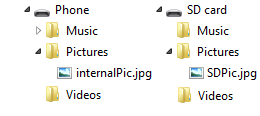

# <a name="files-and-folders-in-the-music-pictures-and-videos-libraries"></a>Archivos y carpetas de las bibliotecas de música, imágenes y vídeos

Agrega carpetas existentes de música, imágenes o vídeos a las bibliotecas correspondientes. También puedes quitar carpetas de bibliotecas y obtener la lista de carpetas de una biblioteca para detectar archivos de vídeos, música y fotos almacenados.

Una biblioteca es una colección virtual de carpetas que incluye una carpeta conocida de manera predeterminada, además de otras carpetas que el usuario ha agregado a la biblioteca mediante el uso de la aplicación o de una de las aplicaciones integradas. Por ejemplo, la biblioteca de imágenes incluye la carpeta Imágenes de forma predeterminada. El usuario puede agregar o quitar carpetas de la biblioteca de imágenes mediante el uso de la aplicación o de la aplicación de fotos integrada.

## <a name="prerequisites"></a>Requisitos previos


-   **Comprender la programación asincrónica de las aplicaciones de la Plataforma universal de Windows (UWP)**

    Puedes aprender a escribir aplicaciones asincrónicas en C# o Visual Basic. Consulta [Llamar a API asincrónicas en C# o Visual Basic](https://msdn.microsoft.com/library/windows/apps/mt187337). Para aprender a escribir aplicaciones asincrónicas en C++, consulta [Programación asincrónica en C++](https://msdn.microsoft.com/library/windows/apps/mt187334).

-   **Permisos de acceso a la ubicación**

    En Visual Studio, abre el archivo de manifiesto de la aplicación en el Diseñador de manifiestos. En la página **Capacidades**, selecciona las bibliotecas que la aplicación administra.

    -   **Biblioteca de música**
    -   **Biblioteca de imágenes**
    -   **Biblioteca de vídeos**

    Para más información, consulta [Permisos de acceso de archivos](file-access-permissions.md).

## <a name="get-a-reference-to-a-library"></a>Obtener una referencia a una biblioteca

> [!NOTE]
> Recuerda que debes declarar la funcionalidad apropiada. Para más información, consulta [Declaraciones de funcionalidad de las aplicaciones](https://docs.microsoft.com/windows/uwp/packaging/app-capability-declarations).
 

Para obtener una referencia a la biblioteca de música, imágenes o vídeos del usuario, llama al método [**StorageLibrary.GetLibraryAsync**](https://msdn.microsoft.com/library/windows/apps/dn251725). Proporciona el valor correspondiente de la enumeración [**KnownLibraryId**](https://msdn.microsoft.com/library/windows/apps/dn298399).

-   [**KnownLibraryId.Music**](https://msdn.microsoft.com/library/windows/apps/br227155)
-   [**KnownLibraryId.Pictures**](https://msdn.microsoft.com/library/windows/apps/br227156)
-   [**KnownLibraryId.Videos**](https://msdn.microsoft.com/library/windows/apps/br227159)

```cs
var myPictures = await Windows.Storage.StorageLibrary.GetLibraryAsync(Windows.Storage.KnownLibraryId.Pictures);
```

## <a name="get-the-list-of-folders-in-a-library"></a>Obtener la lista de carpetas de una biblioteca


Para obtener la lista de carpetas de una biblioteca, obtén el valor de la propiedad [**StorageLibrary.Folders**](https://msdn.microsoft.com/library/windows/apps/dn251724).

```cs
using Windows.Foundation.Collections;
IObservableVector<Windows.Storage.StorageFolder> myPictureFolders = myPictures.Folders;
```

## <a name="get-the-folder-in-a-library-where-new-files-are-saved-by-default"></a>Obtener la carpeta de una biblioteca donde se guardan los nuevos archivos de forma predeterminada


Para obtener la carpeta de una biblioteca donde se guardan los nuevos archivos de forma predeterminada, obtén el valor de la propiedad [**StorageLibrary.SaveFolder**](https://msdn.microsoft.com/library/windows/apps/dn251728).

```cs
Windows.Storage.StorageFolder savePicturesFolder = myPictures.SaveFolder;
```

## <a name="add-an-existing-folder-to-a-library"></a>Agregar una carpeta existente a una biblioteca

Para agregar una carpeta a una biblioteca, llama al método [**StorageLibrary.RequestAddFolderAsync**](https://msdn.microsoft.com/library/windows/apps/dn251726). Si tomamos como ejemplo la biblioteca de imágenes, la llamada a este método hace que se muestre un selector de carpetas al usuario con un botón **Agregar esta carpeta a Imágenes**. Si el usuario elige una carpeta, la carpeta permanece en su ubicación original en el disco y se convierte en un elemento de la propiedad [**StorageLibrary.Folders**](https://msdn.microsoft.com/library/windows/apps/dn251724) (y en la aplicación Fotos integrada), aunque la carpeta no aparece como elemento secundario de la carpeta Imágenes en el Explorador de archivos.


```cs
Windows.Storage.StorageFolder newFolder = await myPictures.RequestAddFolderAsync();
```

## <a name="remove-a-folder-from-a-library"></a>Quitar una carpeta de una biblioteca

Para quitar una carpeta de una biblioteca, llama al método [**StorageLibrary.RequestRemoveFolderAsync**](https://msdn.microsoft.com/library/windows/apps/dn251727) y especifica la carpeta que quieres quitar. Puedes usar [**StorageLibrary.Folders**](https://msdn.microsoft.com/library/windows/apps/dn251724) y un control [**ListView**](https://msdn.microsoft.com/library/windows/apps/br242878) (o similar) para que el usuario seleccione una carpeta para quitar.

Cuando se llama a [**StorageLibrary.RequestRemoveFolderAsync**](https://msdn.microsoft.com/library/windows/apps/dn251727), el usuario verá un cuadro de diálogo de confirmación que indica que la carpeta "ya no aparecerá en Imágenes, pero no se eliminará". Esto significa que la carpeta permanece en su ubicación original en el disco, se quitará de la propiedad [**StorageLibrary.Folders**](https://msdn.microsoft.com/library/windows/apps/dn251724) y ya no se incluirá en la aplicación Fotos integrada.

El siguiente ejemplo se da por hecho que el usuario ha seleccionado la carpeta que quiere quitar en un control [**ListView**](https://msdn.microsoft.com/library/windows/apps/br242878) denominado **lvPictureFolders**.


```cs
bool result = await myPictures.RequestRemoveFolderAsync(folder);
```

## <a name="get-notified-of-changes-to-the-list-of-folders-in-a-library"></a>Recibir una notificación de cambios en la lista de carpetas de una biblioteca


Para obtener notificaciones sobre los cambios en la lista de carpetas de una biblioteca, registra un controlador para el evento [**StorageLibrary.DefinitionChanged**](https://msdn.microsoft.com/library/windows/apps/dn251723) de la biblioteca.


```cs
myPictures.DefinitionChanged += MyPictures_DefinitionChanged;

void HandleDefinitionChanged(Windows.Storage.StorageLibrary sender, object args)
{
    // ...
}
```

## <a name="media-library-folders"></a>Carpetas de la biblioteca multimedia


El dispositivo proporciona cinco ubicaciones predefinidas para que los usuarios y las aplicaciones almacenen archivos multimedia. Las aplicaciones integradas almacenan en estas ubicaciones los elementos multimedia que los usuarios descargan y crean.

Las ubicaciones son las siguientes:

-   Carpeta **Imágenes**. Contiene imágenes.

    -   Carpeta **Álbum de cámara**. Contiene fotos y vídeo de la cámara integrada.

    -   Carpeta **Imágenes guardadas**. Contiene imágenes que el usuario ha guardado de otras aplicaciones.

-   Carpeta **Música**. Contiene canciones, podcasts y audiolibros.

-   Carpeta **Vídeo**. Contiene vídeos.

Además, los usuarios y las aplicaciones pueden almacenar archivos multimedia en la tarjeta SD, fuera de las carpetas de la bibliotecas multimedia. Para buscar de forma segura un archivo multimedia en la tarjeta SD, examina el contenido de la tarjeta SD o pide al usuario que localice el archivo con un selector de archivos. Para obtener más información, consulta [Acceder a la tarjeta SD](access-the-sd-card.md).

## <a name="querying-the-media-libraries"></a>Consultar las bibliotecas multimedia

Para obtener una colección de archivos, especifica la biblioteca y el tipo de archivos que quieras.

```cs
using Windows.Storage;
using Windows.Storage.Search;

private async void getSongs()
{
    QueryOptions queryOption = new QueryOptions
        (CommonFileQuery.OrderByTitle, new string[] { ".mp3", ".mp4", ".wma" });

    queryOption.FolderDepth = FolderDepth.Deep;

    Queue<IStorageFolder> folders = new Queue<IStorageFolder>();

    var files = await KnownFolders.MusicLibrary.CreateFileQueryWithOptions
      (queryOption).GetFilesAsync();

    foreach (var file in files)
    {
        // do something with the music files
    }
}
```

### <a name="query-results-include-both-internal-and-removable-storage"></a>Los resultados de la consulta incluyen el almacenamiento interno y el extraíble

Los usuarios pueden elegir almacenar los archivos, de forma predeterminada, en la tarjeta SD opcional. Sin embargo, las aplicaciones pueden optar por no permitir que los archivos se almacenen en la tarjeta SD. Por esta razón, las bibliotecas multimedia pueden dividirse entre el almacenamiento interno del dispositivo y la tarjeta SD.

No tienes que escribir código adicional para administrar esta posibilidad. Los métodos del espacio de nombres de [**Windows.Storage**](https://msdn.microsoft.com/library/windows/apps/br227346) que consultan las carpetas conocidas combinan con transparencia los resultados de la consulta de ambas ubicaciones. Para obtener estos resultados combinados, no necesitas especificar la función **removableStorage** en el archivo de manifiesto de la aplicación.

Ten en cuenta el estado del almacenamiento del dispositivo mostrado en la imagen siguiente:



Si consultas el contenido de la biblioteca de imágenes llamando a `await KnownFolders.PicturesLibrary.GetFilesAsync()`, los resultados incluirán internalPic.jpg y SDPic.jpg.


## <a name="working-with-photos"></a>Trabajar con fotos

En dispositivos en los que la cámara guarda dos imágenes por cada foto, una en baja resolución y otra en alta resolución, las consultas profundas solo devuelven las imágenes de baja resolución.

El Álbum de cámara y la carpeta Imágenes guardadas no admiten consultas profundas.

**Abrir una foto en la aplicación que la capturó**

Si quieres que el usuario pueda volver a abrir una foto en la aplicación que la capturó, puedes guardar el **CreatorAppId** con los metadatos de la foto; usa para ello un código similar al del ejemplo siguiente. En este ejemplo, **testPhoto** es un objeto [**StorageFile**](https://msdn.microsoft.com/library/windows/apps/br227171).

```cs
IDictionary<string, object> propertiesToSave = new Dictionary<string, object>();

propertiesToSave.Add("System.CreatorOpenWithUIOptions", 1);
propertiesToSave.Add("System.CreatorAppId", appId);

testPhoto.Properties.SavePropertiesAsync(propertiesToSave).AsyncWait();   
```

## <a name="using-stream-methods-to-add-a-file-to-a-media-library"></a>Usar métodos de secuencias para agregar un archivo a una biblioteca multimedia

Si accedes a una biblioteca a través de una carpeta conocida —por ejemplo, **KnownFolders.PictureLibrary**— y usas métodos de secuencias para agregar un archivo a la biblioteca, tienes que asegurarte de que cierras todas las secuencias que abre el código. De lo contrario, estos métodos no podrán agregar el archivo a la biblioteca multimedia, ya que habrá al menos una secuencia que controla el archivo.

Por ejemplo, si ejecutas el código siguiente, el archivo no se agrega a la biblioteca multimedia. En la línea de código, `using (var destinationStream = (await destinationFile.OpenAsync(FileAccessMode.ReadWrite)).GetOutputStreamAt(0))`, tanto el método **OpenAsync** como el método **GetOutputStreamAt** abren una secuencia. No obstante, tan solo se desecha la secuencia que abre el método **GetOutputStreamAt** como resultado de la instrucción **using**. La otra secuencia permanece abierta y evita que se guarde el archivo.

```cs
StorageFolder testFolder = await StorageFolder.GetFolderFromPathAsync(@"C:\test");
StorageFile sourceFile = await testFolder.GetFileAsync("TestImage.jpg");
StorageFile destinationFile = await KnownFolders.CameraRoll.CreateFileAsync("MyTestImage.jpg");
using (var sourceStream = (await sourceFile.OpenReadAsync()).GetInputStreamAt(0))
{
    using (var destinationStream = (await destinationFile.OpenAsync(FileAccessMode.ReadWrite)).GetOutputStreamAt(0))
    {
        await RandomAccessStream.CopyAndCloseAsync(sourceStream, destinationStream);
    }
}
```

Para agregar correctamente un archivo a la biblioteca de contenido multimedia con métodos de secuencias, asegúrate de cerrar todas las secuencias que abre el código, tal como se muestra en el ejemplo siguiente.

```cs
StorageFolder testFolder = await StorageFolder.GetFolderFromPathAsync(@"C:\test");
StorageFile sourceFile = await testFolder.GetFileAsync("TestImage.jpg");
StorageFile destinationFile = await KnownFolders.CameraRoll.CreateFileAsync("MyTestImage.jpg");

using (var sourceStream = await sourceFile.OpenReadAsync())
{
    using (var sourceInputStream = sourceStream.GetInputStreamAt(0))
    {
        using (var destinationStream = await destinationFile.OpenAsync(FileAccessMode.ReadWrite))
        {
            using (var destinationOutputStream = destinationStream.GetOutputStreamAt(0))
            {
                await RandomAccessStream.CopyAndCloseAsync(sourceInputStream, destinationStream);
            }
        }
    }
}
```
