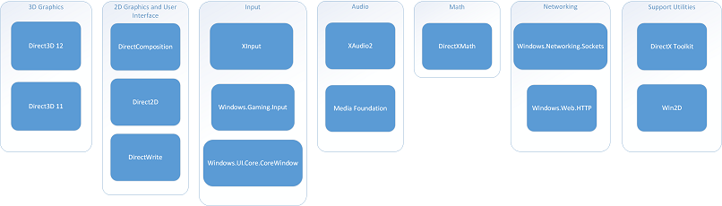

# Tecnologías de juego de aplicaciones para la UWP

En esta guía, encontrarás información sobre las tecnologías disponibles para desarrollar juegos para la Plataforma universal de Windows (UWP).

##  Ventajas de Windows 10 para el desarrollo de juegos

Con la introducción de UWP en Windows 10, tus títulos de Windows 10 podrán llegar a todas las plataformas de Microsoft. Con la migración gratuita de versiones anteriores de Windows, hay un constante aumento en el número de clientes de Windows 10. La combinación de estas dos cosas significa que tus títulos de Windows 10 podrán llegar a un elevado número de clientes a través de Microsoft Store.

Además, Windows 10 ofrece muchas características nuevas que son particularmente beneficiosas para juegos:

-   Menor paginación de memoria y menor tamaño del sistema de memoria global
-   Mejoras en la administración de memoria de elementos gráficos que asigna y protege activamente más memoria para el juego en primer plano

## Juegos de UWP con C++ y DirectX

Los juegos en tiempo real que requieren un alto rendimiento deben usar las API de DirectX. DirectX es una colección de API nativas para crear juegos y aplicaciones multimedia que requieren un alto rendimiento, como los juegos 3D.

## Entorno de desarrollo

Para crear juegos para UWP, tendrás que configurar el entorno de desarrollo instalando Visual Studio 2015 o posterior. Te recomendamos que instalar la versión más reciente de Visual Studio, lo que da acceso a las últimas actualizaciones de seguridad y desarrollo. Visual Studio te permite crear aplicaciones para UWP y proporciona herramientas de desarrollo de juegos:

-   Herramientas de Visual Studio para programación de juegos DX: Visual Studio proporciona herramientas para crear, editar, obtener una vista previa y exportar una imagen, modelo y recursos de sombreador. También puedes usar herramientas para convertir recursos durante la compilación y depurar el código de elementos gráficos de DirectX. Para obtener más información, consulta [Herramientas de Visual Studio para programación de juegos](set-up-visual-studio-for-game-development.md).
-   Características de diagnóstico de elementos gráficos de Visual Studio: las herramientas de diagnóstico de elementos gráficos ya están disponibles en Windows como una característica opcional. Las herramientas de diagnóstico te permiten depurar elementos gráficos, analizar fotogramas de elementos gráficos y supervisar el uso de la GPU en tiempo real. Para obtener más información, consulta [Usar DirectX en tiempo de ejecución y las características de diagnóstico de elementos gráficos de Visual Studio](use-the-directx-runtime-and-visual-studio-graphics-diagnostic-features.md).

Para obtener más información, consulta Preparar la Plataforma universal de Windows y [Programación en DirectX](directx-programming.md).

## Tareas iniciales con las plantillas de proyectos de juegos de DirectX

Tras configurar tu entorno de desarrollo, puedes usar una de las plantillas de proyectos de DirectX para crear tu juego DirectX de UWP. Visual Studio 2015 incluye tres plantillas para que puedas crear nuevos proyectos DirectX para UWP: la **Aplicación DirectX 11 (universal de Windows)**, la **Aplicación DirectX 12 (universal de Windows)** y la **Aplicación XAML y DirectX 11 (universal de Windows)**. Para obtener más información, consulta [Crear un proyecto de juego de Plataforma universal de Windows y DirectX a partir de una plantilla](user-interface.md).

## API de Windows10

Windows10 proporciona una amplia colección de API que son útiles para el desarrollo de juegos. Hay API para prácticamente todos los aspectos de un juego, incluidos los elementos gráficos 3D, elementos gráficos 2D, audio, entrada, recursos de texto, interfaz de usuario y funciones de red.

Hay muchas API relacionadas con el desarrollo de juegos, pero no todos los juegos tienen que usar todas estas API. Por ejemplo, algunos juegos mostrarán únicamente elementos gráficos 3D y solo usarán Direct3D, otros juegos mostrarán únicamente elementos gráficos 2D y solo usarán Direct2D y, además, existen otros juegos pueden usar ambos. El siguiente diagrama muestra las API relacionadas con el desarrollo de juegos agrupadas por tipo de funcionalidad.

-   Elementos gráficos 3D: Windows 10 admite dos conjuntos de API de elementos gráficos 3D, Direct3D 11 y [Direct3D 12](https://msdn.microsoft.com/library/windows/desktop/dn899121). Ambas API ofrecen la capacidad de crear elementos gráficos 2D y 3D. Direct3D 11 y Direct3D 12 no se usan de manera conjunta, pero pueden usarse con cualquiera de las API de los elementos gráficos 2D y el grupo de interfaz de usuario. Para obtener más información sobre cómo usar las API de gráficos en tu juego, consulta [Gráficos 3D básicos para juegos DirectX](an-introduction-to-3d-graphics-with-directx.md).

    <table>
    <colgroup>
    <col width="50%" />
    <col width="50%" />
    </colgroup>
    <thead>
    <tr class="header">
    <th align="left">API</th>
    <th align="left">Descripción</th>
    </tr>
    </thead>
    <tbody>
    <tr class="odd">
    <td align="left">Direct3D 12</td>
    <td align="left">
Direct3D 12 presenta la siguiente versión de Direct3D, la API de elementos gráficos 3D en el corazón de DirectX. Esta versión de Direct3D se ha diseñado para ser más rápida y eficiente que las versiones anteriores de Direct3D. La mayor velocidad de Direct3D 12 se ha conseguido gracias a que es de menor nivel y requiere que tú mismo administres los recursos de elementos gráficos, por lo que deberás tener una mayor experiencia en la programación de elementos gráficos para aprovechar esta velocidad.

    
<strong>Cuándo usarla</strong>

    
Usa Direct3D12 cuando necesites maximizar el rendimiento de tu juego y el juego esté limitado por la CPU.

    
<strong>Para más información</strong>

    
Consulta la documentación de <a href="https://msdn.microsoft.com/library/windows/desktop/dn899121">Direct3d 12</a>.
</td>
    </tr>
    <tr class="even">
    <td align="left">Direct3D 11</td>
    <td align="left">
Direct3D 11 es la versión anterior de Direct3D y te permite crear elementos gráficos 3D mediante un mayor nivel de abstracción de hardware que D3D 12.

    
<strong>Cuándo usarla</strong>

    
Usa Direct3D11 si ya tienes código de Direct3D11 existente, tu juego no está limitado por la CPU o quieres disfrutar de las ventajas de que recursos se administren automáticamente.

    
<strong>Para más información</strong>

    
Consulta la documentación de <a href="https://msdn.microsoft.com/library/windows/desktop/ff476080">Direct3D 11</a>.
</td>
    </tr>
    </tbody>
    </table>

     

-   Elementos gráficos 2D e interfaz de usuario: API de elementos gráficos 2D como texto e interfaces de usuario. Todas las API de elementos gráficos 2D e interfaces de usuario son opcionales.

    <table>
    <colgroup>
    <col width="50%" />
    <col width="50%" />
    </colgroup>
    <thead>
    <tr class="header">
    <th align="left">API</th>
    <th align="left">Descripción</th>
    </tr>
    </thead>
    <tbody>
    <tr class="odd">
    <td align="left">Direct2D</td>
    <td align="left">
Direct2D es una API de elementos gráficos 2D con aceleración por hardware y modo inmediato que ofrece alto rendimiento y representación de alta calidad de geometría 2D, mapas de bits y texto. La API de Direct2D se integra en Direct3D y se ha diseñado para interactuar correctamente con GDI, GDI+ y Direct3D.

    
<strong>Cuándo usarla</strong>

    
Puedes usar Direct2D en lugar de Direct3D para ofrecer elementos gráficos para juegos que sean estrictamente en 2D, como los juegos de desplazamiento lateral o juegos de mesa; además, puedes usarlo con Direct3D para simplificar la creación de elementos gráficos 2D en un juego 3D, como una interfaz de usuario o una pantalla de visualización frontal.

    
<strong>Para más información</strong>

    
Consulta la documentación de <a href="https://msdn.microsoft.com/library/windows/desktop/dd370990">Direct2D</a>.
</td>
    </tr>
    <tr class="even">
    <td align="left">DirectWrite</td>
    <td align="left">
DirectWrite ofrece funciones adicionales para trabajar con texto, y se puede usar con Direct3D o Direct2D para proporcionar salida de texto en interfaces de usuario o en otras áreas donde se requiere texto. DirectWrite admite medición, dibujos y pruebas de aciertos de texto multiformato. DirectWrite controla el texto en todos los idiomas admitidos para las aplicaciones localizadas y globales. DirectWrite también ofrece una API de representación de glifos de bajo nivel para los desarrolladores que quieren realizar su propio diseño y procesamiento de Unicode a glifo.

    
<strong>Cuándo usarla</strong>

    

    
<strong>Para más información</strong>

    
Consulta la documentación de <a href="https://msdn.microsoft.com/library/windows/desktop/dd368038">DirectWrite</a>.
</td>
    </tr>
    <tr class="odd">
    <td align="left">DirectComposition</td>
    <td align="left">
DirectComposition es un componente de Windows que habilita la composición de mapa de bits de alto rendimiento con transformaciones, efectos y animaciones. Los desarrolladores de aplicaciones pueden usar la API DirectComposition para crear interfaces de usuario visualmente atractivas y que ofrezcan transiciones animadas fluidas y enriquecidas, de un objeto visual a otro.

    
<strong>Cuándo usarla</strong>

    
DirectComposition está diseñada para simplificar el proceso de crear objetos visuales y transiciones animadas. Si tu juego requiere interfaces de usuario complejas, puedes usar DirectComposition para simplificar la creación y administración de la interfaz de usuario.

    
<strong>Para más información</strong>

    
Consulta la documentación de <a href="https://msdn.microsoft.com/library/windows/desktop/hh437371">DirectComposition</a>.
</td>
    </tr>
    </tbody>
    </table>

     

-   Audio: API relativas a la reproducción de audio y la aplicación de efectos de audio. Para obtener información sobre cómo usar las API de audio en tu juego, consulta [Audio para juegos](working-with-audio-in-your-directx-game.md).

    <table>
    <colgroup>
    <col width="50%" />
    <col width="50%" />
    </colgroup>
    <thead>
    <tr class="header">
    <th align="left">API</th>
    <th align="left">Descripción</th>
    </tr>
    </thead>
    <tbody>
    <tr class="odd">
    <td align="left">XAudio2</td>
    <td align="left">
XAudio2 es una API de audio de bajo nivel que ofrece funciones básicas de procesamiento de señal y mezcla. XAudio se ha diseñado para ofrecer una excelente capacidad de respuesta a los motores de audio de juegos, a la vez que se mantienen las funciones necesarias para crear efectos de audio personalizados y cadenas complejas de filtros y efectos de audio.

    
<strong>Cuándo usarla</strong>

    
Usa XAudio2 cuando tu juego necesite reproducir sonidos con una mínima sobrecarga y retardo.

    
<strong>Para más información</strong>

    
Consulta la documentación de <a href="https://msdn.microsoft.com/library/windows/desktop/hh405049">XAudio2</a>.
</td>
    </tr>
    <tr class="even">
    <td align="left">Media Foundation</td>
    <td align="left">
Microsoft Media Foundation se ha diseñado para la reproducción de archivos multimedia y de secuencias tanto de audio como de vídeo, pero también se puede usar en juegos cuando se requiere una funcionalidad de nivel superior a la de XAudio2 y, además, es aceptable tener una sobrecarga adicional.

    
<strong>Cuándo usarla</strong>

    
Media Foundation es especialmente útil para escenas cinematográficas o componentes no interactivos de tu juego. Media Foundation también es útil para la descodificación de archivos de audio para su reproducción con XAudio2.

    
<strong>Para más información</strong>

    
Consulta la introducción a <a href="https://msdn.microsoft.com/library/windows/desktop/ms694197">Microsoft Media Foundation</a>.
</td>
    </tr>
    </tbody>
    </table>

     

-   Entrada: API relativas a la entrada desde el teclado, mouse, mando de juegos y otras fuentes de entrada del usuario.

    <table>
    <colgroup>
    <col width="50%" />
    <col width="50%" />
    </colgroup>
    <thead>
    <tr class="header">
    <th align="left">API</th>
    <th align="left">Descripción</th>
    </tr>
    </thead>
    <tbody>
    <tr class="odd">
    <td align="left">XInput</td>
    <td align="left">
La API de controlador de juego XInput permite que las aplicaciones reciban entradas de dispositivos de juegos.

    
<strong>Cuándo usarla</strong>

    
Si tu juego debe admitir la entrada de controladores de juegos y ya tienes código XInput, puedes seguir usando XInput. Se ha reemplazado XInput por Windows.Gaming.Input para UWP, y si estás escribiendo el nuevo código de entrada, debes usar Windows.Gaming.Input en lugar de XInput.

    
<strong>Para más información</strong>

    
Consulta la documentación de <a href="https://msdn.microsoft.com/library/windows/desktop/hh405053">XInput</a>.
</td>
    </tr>
    <tr class="even">
    <td align="left">Windows.Gaming.Input</td>
    <td align="left">
La API Windows.Gaming.Input reemplaza a XInput y ofrece la misma funcionalidad con las siguientes ventajas que XInput no ofrece:

    <ul>
    <li>Menor uso de recursos</li>
    <li>Menor latencia de llamada a la API para recuperar la entrada</li>
    <li>La posibilidad de trabajar con más de 4 controladores para juegos a la vez</li>
    <li>La posibilidad de obtener acceso a las funciones adicionales del controlador para juegos de Xbox One, como desencadenar los motores de vibración</li>
    <li>Posibilidad de recibir notificaciones cuando se conecten o desconecten dispositivos mediante eventos en lugar de sondeo</li>
    <li>Posibilidad de atribuir la entrada a un determinado usuario (Windows.System.User)</li>
    </ul>
    
<strong>Cuándo usarla</strong>

    
Si el juego debe ser compatible con mandos de juegos y no usa el código existente de XInput, o si necesitas usar alguna de las ventajas enumeradas anteriormente, debes usar Windows.Gaming.Input.

    
<strong>Para más información</strong>

    
Consulta la documentación <a href="https://msdn.microsoft.com/library/windows/apps/dn707817">Windows.Gaming.Input</a>.
</td>
    </tr>
    <tr class="odd">
    <td align="left">Windows.UI.Core.CoreWindow</td>
    <td align="left">
La clase Windows.UI.Core.CoreWindow te ofrece eventos para realizar el seguimiento de las pulsaciones de puntero y el movimiento, así como de cuándo se pulsa y se suelta una tecla.

    
<strong>Cuándo usarla</strong>

    
Usa los eventos de Windows.UI.Core.CoreWindows cuando necesites realizar un seguimiento del mouse o las pulsaciones de las teclas en el juego.

    
<strong>Para más información</strong>

    
Consulta <a href="https://docs.microsoft.com/windows/uwp/gaming/tutorial--adding-move-look-controls-to-your-directx-game">Controles de movimiento y vista para juegos</a> para obtener más información sobre cómo usar el mouse o el teclado en tu juego.
</td>
    </tr>
    </tbody>
    </table>

     

-   Matemáticas: API que ayudan a simplificar operaciones matemáticas frecuentemente usadas.

    <table>
    <colgroup>
    <col width="50%" />
    <col width="50%" />
    </colgroup>
    <thead>
    <tr class="header">
    <th align="left">API</th>
    <th align="left">Descripción</th>
    </tr>
    </thead>
    <tbody>
    <tr class="odd">
    <td align="left">DirectXMath</td>
    <td align="left">
La API de DirectXMath ofrece tipos y funciones de C++ compatibles con SIMD para operaciones matemáticas comunes de elementos gráficos y álgebra lineal que son frecuentes en los juegos.

    
<strong>Cuándo usarla</strong>

    
El uso de DirectXMath es opcional y simplifica las operaciones matemáticas comunes.

    
<strong>Para más información</strong>

    
Consulta la documentación de <a href="https://msdn.microsoft.com/library/windows/desktop/hh437833">DirectXMath</a>.
</td>
    </tr>
    </tbody>
    </table>

     

-   Funciones de red: API relativas a la comunicación con otros equipos y dispositivos a través de Internet o redes privadas.

    <table>
    <colgroup>
    <col width="50%" />
    <col width="50%" />
    </colgroup>
    <thead>
    <tr class="header">
    <th align="left">API</th>
    <th align="left">Descripción</th>
    </tr>
    </thead>
    <tbody>
    <tr class="odd">
    <td align="left">Windows.Networking.Sockets</td>
    <td align="left">
El espacio de nombres Windows.Networking.Sockets ofrece sockets TCP y UDP que permiten la comunicación de red confiable o no.

    
<strong>Cuándo usarla</strong>

    
Usa Windows.Networking.Sockets si tu juego necesita comunicarse con otros equipos o dispositivos a través de la red.

    
<strong>Para más información</strong>

    
Consulta <a href="https://docs.microsoft.com/windows/uwp/gaming/work-with-networking-in-your-directx-game">Trabajar con funciones de red en tu juego</a>.
</td>
    </tr>
    <tr class="even">
    <td align="left">Windows.Web.HTTP</td>
    <td align="left">
El espacio de nombres Windows.Web.HTTP ofrece una conexión confiable con los servidores HTTP que se pueden usar para obtener acceso a un sitio web.

    
<strong>Cuándo usarla</strong>

    
Usa Windows.Web.HTTP cuando tu juego necesite obtener acceso a un sitio web para recuperar o almacenar información.

    
<strong>Para más información</strong>

    
Consulta <a href="https://docs.microsoft.com/windows/uwp/gaming/work-with-networking-in-your-directx-game">Trabajar con funciones de red en tu juego</a>.
</td>
    </tr>
    </tbody>
    </table>

     

-   Utilidades auxiliares: bibliotecas que se basan en las API de Windows10.

    <table>
    <colgroup>
    <col width="50%" />
    <col width="50%" />
    </colgroup>
    <thead>
    <tr class="header">
    <th align="left">Biblioteca</th>
    <th align="left">Descripción</th>
    </tr>
    </thead>
    <tbody>
    <tr class="odd">
    <td align="left">Kit de herramientas de DirectX</td>
    <td align="left">
El kit de herramientas de DirectX (DirectXTK) es una colección de clases auxiliares para escribir código de DirectX11.x en C++.

    
<strong>Cuándo usarla</strong>

    
Usa el kit de herramientas de DirectX si eres un desarrollador de C++ que busca un sustituto moderno del código de utilidades de D3DX heredado o eres un desarrollador de XNA Game Studio que quiere migrar al C++ nativo.

    
<strong>Para más información</strong>

    
Consulta la página de proyecto del Kit de herramientas de DirectX, <a href="https://github.com/Microsoft/DirectXTK">https://github.com/Microsoft/DirectXTK</a>.
</td>
    </tr>
    <tr class="even">
    <td align="left">Win2D</td>
    <td align="left">
Win2D es una API de Windows Runtime de fácil uso para la representación inmediata de elementos gráficos 2D.

    
<strong>Cuándo usarla</strong>

    
Usa Win2D si eres un desarrollador de C++ y quieres un contenedor de WinRT más fácil de usar para Direct2D y DirectWrite, o si eres un desarrollador de C# y quieres usar Direct2D y DirectWrite.

    
<strong>Para más información</strong>

    
Consulta la página de proyecto Win2D, <a href="https://github.com/Microsoft/Win2D">https://github.com/Microsoft/Win2D</a>.
</td>
    </tr>
    </tbody>
    </table>

     

## Servicios de Xbox Live

El [Programa de creadores de Xbox Live](https://developer.microsoft.com/games/xbox/xboxlive/creator) permite a cualquier desarrollador integrar Xbox Live en su juego de UWP y publicarlo en Xbox One y Windows 10. Integra experiencias de redes sociales de Xbox Live, como el inicio de sesión, la presencia, los marcadores y mucho más en tu juego, con un tiempo de desarrollo mínimo. Las funciones de redes sociales de Xbox Live están diseñadas para hacer crecer tu audiencia de forma orgánica, difundiendo el conocimiento a más de 55 millones de jugadores activos.

Si quieres obtener acceso a todavía más funcionalidades de Xbox Live, marketing dedicado y soporte técnico de desarrollo, así como la posibilidad de aparecer destacado en la Tienda principal de Xbox One, presenta la solicitud para el programa [ID@Xbox](http://www.xbox.com/developers/id). Para ver qué funciones están disponibles para el Programa de creadores de Xbox Live y el programa ID@Xbox, consulta la [Tabla de funciones](../xbox-live/developer-program-overview.md#feature-table).

Para obtener más información, consulta [Agregar Xbox Live a tu juego](e2e.md#adding-xbox-live-to-your-game).

##  Alternativas a escribir juegos con DirectX y UWP

### Juegos para UWP sin DirectX

Es posible escribir juegos más sencillos con requisitos mínimos de rendimiento, como juegos de cartas o juegos de mesa, sin DirectX y no es necesario escribirlos en C++. Este tipo de juegos puede usar cualquiera de los idiomas admitidos por UWP, como C#, Visual Basic, C++ y HTML/JavaScript. Si el rendimiento y los elementos gráficos intensos no son un requisito de tu juego, consulta [JavaScript and HTML5 touch game sample (Muestra de juego táctil de JavaScript y HTML5)](http://code.msdn.microsoft.com/windowsapps/JavaScript-and-HTML5-touch-d96f6031) como ejemplo.

### Motores de juegos

Como alternativa a escribir tu propio motor de juego mediante las API de desarrollo de juegos de Windows, tienes disponibles muchos otros motores de juego de alta calidad que se basan en las API de desarrollo de juegos de Windows, para que puedas desarrollar juegos en plataformas de Windows. Al considerar a un motor de juego o una biblioteca, tienes varias opciones:

-   Motor de juego completo: un motor de juego completo encapsula la mayoría o todas las API de Windows10 que necesitarías para escribir un motor de juego desde cero, como los elementos gráficos, audio, entrada y redes. Los motores de juegos completos también pueden incluir funciones de la lógica de juego, como la inteligencia artificial y búsqueda de rutas.
-   Motor de elementos gráficos: los motores gráficos encapsulan las API de gráficos de Windows10, administran los recursos gráficos y admiten diversos formatos de modelos y mundo.
-   Motor de audio: los motores de audio encapsulan las API de audio de Windows10, administran los recursos de audio y ofrecen procesamiento de audio avanzado y efectos.
-   Motor de red: los motores de red encapsulan las API para redes de Windows10 para agregar funciones de multijugador basadas en servidor o entre pares a tu juego, y pueden incluir las funciones de red avanzadas para incorporar a un elevado número de jugadores.
-   Inteligencia artificial y motor de búsqueda de rutas: los motores de inteligencia artificial y búsqueda de rutas ofrece un marco de trabajo para controlar el comportamiento de los agentes de tu juego
-   Motores de propósito especial: hay diversos motores adicionales para controlar casi cualquier tarea relacionada con el desarrollo de juegos que pueda surgir, como la creación de árboles de diálogo y los sistemas de inventario.

## Envío de un juego a la tienda

Cuando estés listo para publicar tu juego, tendrás que crear una cuenta de desarrollador y enviar tu juego a Microsoft Store.

Para obtener información sobre el envío de tu juego a Microsoft Store, consulta [Enviar y publicar juegos](e2e.md#submitting-and-publishing-your-game).

 

 

