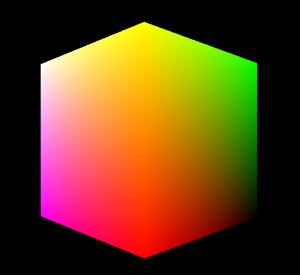

# <a name="port-a-simple-opengl-es-20-renderer-to-direct3d-11"></a>Portar un representador simple de OpenGL ES 2.0 a Direct3D 11


Para este ejercicio de migración, empezaremos con algo básico: llevar un representador simple de un cubo giratorio con vértices sombreados de OpenGL ES 2.0 a Direct3D, de modo que coincida con la plantilla Aplicación DirectX 11 (Windows universal) de Visual Studio 2015. A medida que avancemos en este proceso de migración, aprenderás a hacer lo siguiente:

-   Migrar un conjunto simple de búferes de vértices a búferes de entrada de Direct3D
-   Migrar uniformes y atributos a búferes de constantes
-   Configurar objetos de sombreador de Direct3D
-   Usar la semántica básica de HLSL en el desarrollo de sombreador de Direct3D
-   Portar GLSL simple a HLSL

Este tema empieza tras la creación de un nuevo proyecto en DirectX 11. Para aprender a crear un nuevo proyecto en DirectX 11, lee [Create a new DirectX 11 project for Universal Windows Platform (UWP) (Crear un nuevo proyecto de DirectX 11 para la Plataforma universal de Windows [UWP])](user-interface.md).

El proyecto creado a partir de alguno de estos vínculos tiene todo el código preparado para la infraestructura de [Direct3D](https://msdn.microsoft.com/library/windows/desktop/ff476345). Puedes empezar a portar el representador de Open GL ES 2.0 a Direct3D 11 inmediatamente.

En este tema se analizan dos rutas de código que realizan las mismas tareas gráficas básicas: mostrar un cubo de vértice sombreado giratorio en una ventana. En ambos casos, el código cubre el siguiente proceso:

1.  Crear una malla del cubo a partir de datos codificados de forma rígida. Esta malla se representa como una lista de vértices, cada uno de ellos con una posición, un vector normal y un color de vector. La malla se coloca en un búfer de vértices para que la canalización de sombreado la procese.
2.  Crear objetos de sombreador para procesar la malla del cubo. Hay dos sombreadores: uno de vértices que procesa los vértices para la rasterización y otro de fragmentos (píxeles) que da color a los píxeles individuales del cubo tras la rasterización. Estos píxeles se graban en un destino de representación para que se puedan mostrar en pantalla.
3.  Formar el lenguaje de sombreado que se usa para el procesamiento de píxeles y vértices en los respectivos sombreadores.
4.  Mostrar el cubo representado en pantalla.



Cuando termines de leer este tutorial, sabrás las diferencias básicas que existen entre Open GL ES 2.0 y Direct3D 11:

-   La representación de los búferes de vértices y datos de vértice.
-   El proceso de crear y configurar sombreadores.
-   Los lenguajes de sombreado, y las entradas y salidas en objetos de sombreador.
-   Los comportamientos de dibujos en pantalla.

En este tutorial hacemos referencia a una estructura simple y genérica del representador de OpenGL, que se define de esta forma:

``` syntax
typedef struct 
{
    GLfloat pos[3];        
    GLfloat rgba[4];
} Vertex;

typedef struct
{
  // Integer handle to the shader program object.
  GLuint programObject;

  // The vertex and index buffers
  GLuint vertexBuffer;
  GLuint indexBuffer;

  // Handle to the location of model-view-projection matrix uniform
  GLint  mvpLoc; 
   
  // Vertex and index data
  Vertex  *vertices;
  GLuint   *vertexIndices;
  int       numIndices;

  // Rotation angle used for animation
  GLfloat   angle;

  GLfloat  mvpMatrix[4][4]; // the model-view-projection matrix itself
} Renderer;
```

Esta estructura tiene una sola instancia y contiene todos los componentes necesarios para representar una malla muy simple de vértices sombreados.

> **Tenga en cuenta**  OpenGL ES 2.0 cualquier código de este tema se basa en la implementación de la API de Windows proporcionada por el grupo Khronos y usa la sintaxis de programación de C de Windows.

 

## <a name="what-you-need-to-know"></a>Lo que debes saber


### <a name="technologies"></a>Tecnologías

-   [Microsoft Visual C++](https://msdn.microsoft.com/library/vstudio/60k1461a.aspx)
-   OpenGL ES 2.0

### <a name="prerequisites"></a>Requisitos previos

-   Opcional. Revisa [Port EGL code to DXGI and Direct3D (Portar código EGL a DXGI y Direct3D)](moving-from-egl-to-dxgi.md). Lee este tema para comprender mejor la interfaz de elementos gráficos proporcionada por DirectX.

## <a name="span-idkeylinksstepsheadingspansteps"></a><span id="keylinks_steps_heading"></span>Pasos


<table>
<colgroup>
<col width="50%" />
<col width="50%" />
</colgroup>
<thead>
<tr class="header">
<th align="left">Tema</th>
<th align="left">Descripción</th>
</tr>
</thead>
<tbody>
<tr class="odd">
<td align="left"><p><a href="port-the-shader-config.md">Migrar objetos de sombreador</a></p></td>
<td align="left"><p>Cuando portes el representador simple de OpenGL ES 2.0, el primer paso es configurar los objetos equivalentes del sombreador de fragmentos y vértices en Direct3D 11, y asegurarte de que el programa principal pueda comunicarse con los objetos del sombreador después de su compilación.</p></td>
</tr>
<tr class="even">
<td align="left"><p><a href="port-the-vertex-buffers-and-data-config.md">Migrar datos y búferes de vértices</a></p></td>
<td align="left"><p>En este paso, definirás los búferes de vértices que contendrán las mallas, y los búferes de índices que permitirán a los sombreadores recorrer los vértices en un orden especificado.</p></td>
</tr>
<tr class="odd">
<td align="left"><p><a href="port-the-glsl.md">Migrar GLSL</a></p></td>
<td align="left"><p>Una vez que traslades el código que crea y configura los búferes y objetos de sombreador, tienes que portar el código a esos sombreadores: del lenguaje GL Shader Language (GLSL) de OpenGL ES 2.0 al lenguaje High-level Shader Language (HLSL) de Direct3D 11.</p></td>
</tr>
<tr class="even">
<td align="left"><p><a href="draw-to-the-screen.md">Dibujar en la pantalla</a></p></td>
<td align="left"><p>Por fin hemos portado el código que dibuja un cubo giratorio en la pantalla.</p></td>
</tr>
</tbody>
</table>

 

## <a name="span-idadditionalresourcesspanadditional-resources"></a><span id="additional_resources"></span>Recursos adicionales


-   [Preparar el entorno de desarrollo para el desarrollo de juegos de DirectX de UWP](prepare-your-dev-environment-for-windows-store-directx-game-development.md)
-   [Cree un nuevo proyecto de DirectX 11 para UWP](user-interface.md)
-   [Asignar la infraestructura y los conceptos de OpenGL ES 2.0 a Direct3D 11](map-concepts-and-infrastructure.md)

 

 


