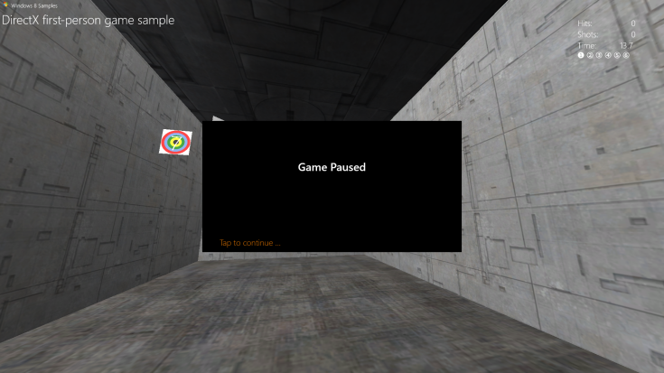
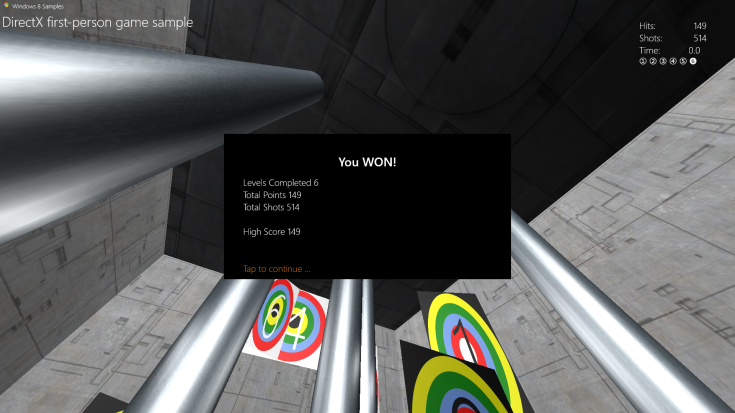

# Agregar una interfaz de usuario


\[ Actualizado para aplicaciones para UWP en Windows 10. Para leer más artículos sobre Windows 8.x, consulta el [archivo](http://go.microsoft.com/fwlink/p/?linkid=619132) \]

Has visto cómo el juego de muestra implementa el objeto principal del juego, así como el marco de representación básico. Ahora, veamos cómo el juego de muestra ofrece comentarios sobre el estado de la partida al jugador. Aquí aprenderás a agregar sencillas opciones de menú y componentes de pantalla de visualización frontal encima de la salida de la canalización de gráficos 3-D.

## Objetivo


-   Agregar gráficos y comportamientos básicos de interfaz de usuario a un juego DirectX de la Plataforma universal de Windows (UWP).

## La superposición de la interfaz de usuario


Si bien existen muchas formas de mostrar elementos de texto y de interfaz de usuario en un juego DirectX, vamos a centrarnos en una: [Direct2D](https://msdn.microsoft.com/library/windows/apps/dd370990.aspx) (con [DirectWrite](https://msdn.microsoft.com/library/windows/desktop/dd368038) para los elementos de texto).

Lo primero es dejar claro qué no es Direct2D. No está diseñado específicamente para interfaces de usuario o diseños, como HTML o XAML. No proporciona componentes de interfaz de usuario, como botones o cuadros de lista, ni tampoco componentes de diseño como etiquetas div, tablas o cuadrículas.

Direct2D es un conjunto de API de dibujo en 2-D que sirve para dibujar primitivos y efectos basados en píxeles. Las primeras veces que uses Direct2D, lo mejor es no complicarse. Los diseños y los comportamientos de interfaz complejos requieren tiempo y planificación. Si tu juego requiere una interfaz de usuario compleja para jugar, como las de los juegos de estrategia o las simulaciones, piensa en usar XAML en su lugar.

(Para obtener información sobre el desarrollo de una interfaz de usuario con XAML en un juego DirectX de UWP, consulta el tema sobre cómo [extender la muestra de juego](tutorial-resources.md).)

En esta muestra de juego tenemos dos componentes de UI principales: la pantalla de visualización frontal para los controles en el juego y de puntuación y una superposición que sirve para mostrar texto sobre el estado del juego y diversas opciones (como la información de pausa o el inicio de nivel).

### Usar Direct2D para una pantalla de visualización frontal

Se trata de la pantalla de visualización frontal en el juego para la muestra de juego sin los elementos visuales. Es sencilla y despejada, lo que permite al jugador centrarse en navegar por el mundo en 3-D y disparar a los objetivos. Una buena interfaz o pantalla de visualización frontal nunca debe limitar la capacidad de un jugador de procesar y reaccionar a los eventos del juego.


Como puedes comprobar, la superposición consiste en primitivos básicos: dos segmentos lineares que se cruzan para formar el punto de mira y dos rectángulos para el [controlador de movimiento y vista](tutorial--adding-controls.md). En la esquina superior derecha, el texto de DirectWrite informa al jugador del número actual de impactos correctos, el número de disparos realizados, el tiempo restante en el nivel y el número del nivel actual. El estado de la pantalla de visualización frontal del juego se dibuja en el método **Render** de la clase **GameHud**, y está codificado de la siguiente manera:

```cpp
void GameHud::Render(
    _In_ Simple3DGame^ game,
    _In_ ID2D1DeviceContext* d2dContext,
    _In_ Windows::Foundation::Rect windowBounds
    )
{
    if (m_showTitle)
    {
        d2dContext->DrawBitmap(
            m_logoBitmap.Get(),
            D2D1::RectF(
                GameConstants::Margin,
                GameConstants::Margin,
                m_logoSize.width + GameConstants::Margin,
                m_logoSize.height + GameConstants::Margin
                )
            );
        d2dContext->DrawTextLayout(
            Point2F(m_logoSize.width + 2.0f * GameConstants::Margin, GameConstants::Margin),
            m_titleHeaderLayout.Get(),
            m_textBrush.Get()
            );
        d2dContext->DrawTextLayout(
            Point2F(GameConstants::Margin, m_titleBodyVerticalOffset),
            m_titleBodyLayout.Get(),
            m_textBrush.Get()
            );
    }

    if (game != nullptr)
    {
        // This section is only used after the game state has been initialized.
        static const int bufferLength = 256;
        static char16 wsbuffer[bufferLength];
        int length = swprintf_s(
            wsbuffer,
            bufferLength,
            L"Hits:\t%10d\nShots:\t%10d\nTime:\t%8.1f",
            game->TotalHits(),
            game->TotalShots(),
            game->TimeRemaining()
            );

        d2dContext->DrawText(
            wsbuffer,
            length,
            m_textFormatBody.Get(),
            D2D1::RectF(
                windowBounds.Width - GameConstants::HudRightOffset,
                GameConstants::HudTopOffset,
                windowBounds.Width,
                GameConstants::HudTopOffset + (GameConstants::HudBodyPointSize + GameConstants::Margin) * 3
                ),
            m_textBrush.Get()
            );

        // Using the unicode characters starting at 0x2780 ( ➀ ) for the consecutive levels of the game.
        // For completed levels, start with 0x278A ( ➊ ) (This is 0x2780 + 10).
        uint32 levelCharacter[6];
        for (uint32 i = 0; i < 6; i++)
        {
            levelCharacter[i] = 0x2780 + i + ((static_cast<uint32>(game->LevelCompleted()) == i) ? 10 : 0);
        }
        length = swprintf_s(
            wsbuffer,
            bufferLength,
            L"%lc %lc %lc %lc %lc %lc",
            levelCharacter[0],
            levelCharacter[1],
            levelCharacter[2],
            levelCharacter[3],
            levelCharacter[4],
            levelCharacter[5]
            );
        d2dContext->DrawText(
            wsbuffer,
            length,
            m_textFormatBodySymbol.Get(),
            D2D1::RectF(
                windowBounds.Width - GameConstants::HudRightOffset,
                GameConstants::HudTopOffset + (GameConstants::HudBodyPointSize + GameConstants::Margin) * 3 + GameConstants::Margin,
                windowBounds.Width,
                GameConstants::HudTopOffset + (GameConstants::HudBodyPointSize+ GameConstants::Margin) * 4
                ),
            m_textBrush.Get()
            );

        if (game->IsActivePlay())
        {
            // Draw a rectangle for the touch input for the move control.
            d2dContext->DrawRectangle(
                D2D1::RectF(
                    0.0f,
                    windowBounds.Height - GameConstants::TouchRectangleSize,
                    GameConstants::TouchRectangleSize,
                    windowBounds.Height
                    ),
                m_textBrush.Get()
                );
            // Draw a rectangle for the touch input for the fire control.
            d2dContext->DrawRectangle(
                D2D1::RectF(
                    windowBounds.Width - GameConstants::TouchRectangleSize,
                    windowBounds.Height - GameConstants::TouchRectangleSize,
                    windowBounds.Width,
                    windowBounds.Height
                    ),
                m_textBrush.Get()
                );

            // Draw the cross hairs.
            d2dContext->DrawLine(
                D2D1::Point2F(windowBounds.Width / 2.0f - GameConstants::CrossHairHalfSize, windowBounds.Height / 2.0f),
                D2D1::Point2F(windowBounds.Width / 2.0f + GameConstants::CrossHairHalfSize, windowBounds.Height / 2.0f),
                m_textBrush.Get(),
                3.0f
                );
            d2dContext->DrawLine(
                D2D1::Point2F(windowBounds.Width / 2.0f, windowBounds.Height / 2.0f - GameConstants::CrossHairHalfSize),
                D2D1::Point2F(windowBounds.Width / 2.0f, windowBounds.Height / 2.0f + GameConstants::CrossHairHalfSize),
                m_textBrush.Get(),
                3.0f
                );
        }
    }
}
```

En este código, el destino de representación de Direct2D establecido para la superposición se actualiza para reflejar los cambios en el número de impactos, el tiempo restante y el número de nivel. Los rectángulos se dibujan con llamadas a [**DrawRect**](https://msdn.microsoft.com/library/windows/desktop/dd371902) y el punto de mira, con un par de llamadas a [**DrawLine**](https://msdn.microsoft.com/library/windows/desktop/dd371895).

> **Nota**   Probablemente has observado que la llamada a **GameHud::Render** toma un parámetro [**Windows::Foundation::Rect**](https://msdn.microsoft.com/library/windows/apps/br225994) que contiene el tamaño del rectángulo de la ventana principal. Esto demuestra una parte esencial de la programación de UI: obtener el tamaño de ventana en una medición llamada DIPs (píxeles independientes del dispositivo), donde un DIP se define como un 1/96 de una pulgada. Direct2D escala las unidades de dibujo en píxeles reales cuando se produce el dibujo, y lo hace usando la configuración de puntos por pulgada (DPI) de Windows. Del mismo modo, cuando dibujas texto usando DirectWrite, especificas DIP en lugar de puntos para el tamaño de la fuente. Los DIP se expresan como números de punto flotante.

 

### Mostrar la información sobre el estado del juego con una superposición

Además de la pantalla de visualización frontal, la muestra de juego tiene una superposición que representa cinco estados del juego, todos ellos con un gran primitivo rectangular de color negro con texto para que el jugador lo lea. (Observa que los rectángulos de controlador de movimiento y vista no se dibujan, porque no están activos en estos estados). Estos estados de superposición son:

-   La superposición de inicio del juego. Lo mostramos cuando el jugador inicia el juego. Contiene la mejor puntuación en las diferentes sesiones de juego.

    

-   El estado de pausa.

    

-   El estado de inicio de nivel. Lo mostramos cuando el jugador inicia un nuevo nivel.

    

-   El estado de fin de juego. Lo mostramos cuando el jugador no supera un nivel.

    

-   El estado de pantalla de estadísticas del juego. Lo mostramos cuando el jugador gana. Contiene la puntuación final que el jugador ha logrado.

    

Echemos un vistazo a cómo inicializamos y dibujamos la superposición para estos cinco estados.

### Inicialización y dibujo de la superposición

Los cinco estados explícitos tienen algunas cosas en común: una, todos usan un rectángulo negro en el centro de la pantalla como fondo; dos, el texto mostrado es texto de título o de cuerpo; y tres, el texto usa la fuente Segoe UI y se dibuja encima del rectángulo negro. Como consecuencia, los recursos que necesitan y los métodos que implementan son muy parecidos.

La muestra de juego tiene cuatro métodos (**GameInfoOverlay::Initialize**, **GameInfoOverlay::SetDpi**, **GameInfoOverlay::RecreateDirectXResources** y **GameInfoOverlay::RecreateDpiDependentResources**) que usa, respectivamente, para inicializarse, establecer los puntos por pulgada, recrear los recursos de DirectWrite (los elementos de texto) y construir esta superposición para la pantalla. Este es el código para estos cuatro métodos:

```cpp
void GameInfoOverlay::Initialize(
    _In_ ID2D1Device*         d2dDevice,
    _In_ ID2D1DeviceContext*  d2dContext,
    _In_ IDWriteFactory*      dwriteFactory,
    _In_ float                dpi)
{
    m_initialized = true;

    m_dwriteFactory = dwriteFactory;
    m_dpi = dpi;
    m_d2dDevice = d2dDevice;
    m_d2dContext = d2dContext;

    ComPtr<ID2D1Factory> factory;
    d2dDevice->GetFactory(&factory);

    DX::ThrowIfFailed(
        factory.As(&m_d2dFactory)
        );

    RecreateDirectXResources();
}
```

```cpp
void GameInfoOverlay::SetDpi(float dpi)
{
    if (m_initialized)
    {
        if (dpi != m_dpi)
        {
            m_dpi = dpi;
            RecreateDpiDependentResources();
        }
    }
}
```

```cpp
void GameInfoOverlay::RecreateDirectXResources()
{
    if (!m_initialized)
    {
        return;
    }

    // Create D2D Resources.
    DX::ThrowIfFailed(
        m_dwriteFactory->CreateTextFormat(
            L"Segoe UI",
            nullptr,
            DWRITE_FONT_WEIGHT_MEDIUM,
            DWRITE_FONT_STYLE_NORMAL,
            DWRITE_FONT_STRETCH_NORMAL,
            32,         // font size
            L"en-us",   // locale
            &m_textFormatTitle
            )
        );

    DX::ThrowIfFailed(
        m_dwriteFactory->CreateTextFormat(
            L"Segoe UI",
            nullptr,
            DWRITE_FONT_WEIGHT_LIGHT,
            DWRITE_FONT_STYLE_NORMAL,
            DWRITE_FONT_STRETCH_NORMAL,
            24,         // font size
            L"en-us",   // locale
            &m_textFormatBody
            )
        );

    DX::ThrowIfFailed(
        m_textFormatTitle->SetTextAlignment(DWRITE_TEXT_ALIGNMENT_CENTER)
        );
    DX::ThrowIfFailed(
        m_textFormatTitle->SetParagraphAlignment(DWRITE_PARAGRAPH_ALIGNMENT_NEAR)
        );
    DX::ThrowIfFailed(
        m_textFormatBody->SetTextAlignment(DWRITE_TEXT_ALIGNMENT_LEADING)
        );
    DX::ThrowIfFailed(
        m_textFormatBody->SetParagraphAlignment(DWRITE_PARAGRAPH_ALIGNMENT_NEAR)
        );

    DX::ThrowIfFailed(
        m_d2dContext->CreateSolidColorBrush(
            D2D1::ColorF(D2D1::ColorF::White),
            &m_textBrush
            )
        );
    DX::ThrowIfFailed(
        m_d2dContext->CreateSolidColorBrush(
            D2D1::ColorF(D2D1::ColorF::Black),
            &m_backgroundBrush
            )
        );
     DX::ThrowIfFailed(
        m_d2dContext->CreateSolidColorBrush(
            D2D1::ColorF(0xdb7100, 1.0f),
            &m_actionBrush
            )
        );

     RecreateDpiDependentResources();
}
```

```cpp
void GameInfoOverlay::RecreateDpiDependentResources()
{
    m_levelBitmap = nullptr;

    // Create a D2D bitmap to be used for Game Info Overlay when waiting to
    // start a level or to display game statistics.
    D2D1_BITMAP_PROPERTIES1 properties;
    properties.pixelFormat.format = DXGI_FORMAT_B8G8R8A8_UNORM;
    properties.pixelFormat.alphaMode = D2D1_ALPHA_MODE_PREMULTIPLIED;
    properties.dpiX = m_dpi;
    properties.dpiY = m_dpi;
    properties.bitmapOptions = D2D1_BITMAP_OPTIONS_TARGET;
    properties.colorContext = nullptr;
    DX::ThrowIfFailed(
        m_d2dContext->CreateBitmap(
            D2D1::SizeU(
                static_cast<UINT32>(GameInfoOverlayConstant::Width * m_dpi / 96.0f),
                static_cast<UINT32>(GameInfoOverlayConstant::Height * m_dpi / 96.0f)
                ),
            nullptr,
            0,
            &properties,
            &m_levelBitmap
            )
        );
    m_d2dContext->SetTarget(m_levelBitmap.Get());
    m_d2dContext->BeginDraw();
    m_d2dContext->SetTransform(D2D1::Matrix3x2F::Identity());
    m_d2dContext->Clear(D2D1::ColorF(D2D1::ColorF::Black));
    HRESULT hr = m_d2dContext->EndDraw();
    if (hr != D2DERR_RECREATE_TARGET)
    {
        // The D2DERR_RECREATE_TARGET indicates there has been a problem with the underlying
        // D3D device.  All subsequent rendering will be ignored until the device is recreated.
        // This error will be propagated and the appropriate D3D error will be returned from the
        // swapchain->Present(...) call.   At that point, the sample will recreate the device
        // and all associated resources.  As a result, the D2DERR_RECREATE_TARGET doesn't
        // need to be handled here.
        DX::ThrowIfFailed(hr);
    }
}

```

El método **Initialize** obtiene una fábrica del objeto [**ID2D1Device**](https://msdn.microsoft.com/library/windows/desktop/hh404478) que se le pasa, que usa para crear un [**ID2D1DeviceContext**](https://msdn.microsoft.com/library/windows/desktop/hh404479) que el propio objeto de superposición puede dibujar, y establece el campo **m\_dWriteFactory** para la referencia [**IDWriteFactory**](https://msdn.microsoft.com/library/windows/desktop/dd368183) proporcionada. También establece el DPI para el contexto. A continuación, llama a **RecreateDeviceResources** para ensamblar y dibujar la representación.

**RecreateDeviceResources** usa el objeto de fábrica DirectWrite para crear formateadores (pinceles) para cadenas de texto del título y del cuerpo que se mostrarán en la superposición. Crea un pincel blanco para dibujar el texto, otro negro para dibujar el fondo y otro naranja para dibujar los mensajes de acción. A continuación, llama a **RecreateDpiDependentResources** para preparar un mapa de bits para dibujar el texto llamando a [**ID2D1DeviceContext::CreateBitmap**](https://msdn.microsoft.com/library/windows/desktop/hh404480). Por último, **RecreateDpiDependentResources** establece el destino de representación para el contexto del dispositivo Direct2D al mapa de bits y lo borra, lo que a su vez establece cada píxel en el mapa como color negro.

Ahora, todo lo que la superposición necesita es algo de texto para mostrar.

### Representación del estado del juego en la superposición

Cada uno de los cinco estados de la superposición en la muestra de juego tiene un método correspondiente en el objeto **GameInfoOverlay**. Estos métodos dibujan una variación de la superposición para comunicar información explícita al jugador acerca del propio juego. Esta comunicación, por supuesto, se representa como dos cadenas: una cadena de título y una cadena de cuerpo. Debido a que la muestra ya configuró los recursos y el diseño para esta información en el método **RecreateDeviceResources**, sólo necesita proporcionar las cadenas específicas del estado de superposición.

Ahora, en la definición de la clase **GameInfoOverlay**, la muestra declaró tres áreas rectangulares que corresponden a regiones específicas de la superposición, como se aprecia aquí:

```cpp
static const D2D1_RECT_F titleRectangle = D2D1::RectF(50.0f, 50.0f, GameInfoOverlayConstant::Width - 50.0f, 100.0f);
static const D2D1_RECT_F bodyRectangle = D2D1::RectF(50.0f, 110.0f, GameInfoOverlayConstant::Width - 50.0f, GameInfoOverlayConstant::Height - 50.0f);
static const D2D1_RECT_F actionRectangle = D2D1::RectF(50.0f, GameInfoOverlayConstant::Height - 45.0f, GameInfoOverlayConstant::Width - 50.0f, GameInfoOverlayConstant::Height - 5.0f);
```

Cada una de estas áreas tiene un objetivo específico:

-   **titleRectangle** es donde se dibuja el texto del título.
-   **bodyRectangle** es donde se dibuja el texto del cuerpo.
-   **actionRectangle** es donde se dibuja el texto que informa al jugador que debe realizar una acción específica. (Está en el borde inferior izquierdo del mapa de bits de superposición).

Teniendo en cuenta estas áreas, veamos uno de los métodos específicos de estado, **GameInfoOverlay::SetGameStats**, y cómo se dibuja la superposición.

```cpp
void GameInfoOverlay::SetGameStats(int maxLevel, int hitCount, int shotCount)
{
    int length;
    Platform::String^ string;

    m_d2dContext->SetTarget(m_levelBitmap.Get());
    m_d2dContext->BeginDraw();
    m_d2dContext->SetTransform(D2D1::Matrix3x2F::Identity());
    m_d2dContext->FillRectangle(&titleRectangle, m_backgroundBrush.Get());
    m_d2dContext->FillRectangle(&bodyRectangle, m_backgroundBrush.Get());
    string = "High Score";

    m_d2dContext->DrawText(
        string->Data(),
        string->Length(),
        m_textFormatTitle.Get(),
        titleRectangle,
        m_textBrush.Get()
        );
    length = swprintf_s(
        wsbuffer,
        bufferLength,
        L"Levels Completed %d\nTotal Points %d\nTotal Shots %d",
        maxLevel,
        hitCount,
        shotCount
        );
    string = ref new Platform::String(wsbuffer, length);
    m_d2dContext->DrawText(
        string->Data(),
        string->Length(),
        m_textFormatBody.Get(),
        bodyRectangle,
        m_textBrush.Get()
        );
    HRESULT hr = m_d2dContext->EndDraw();
    if (hr != D2DERR_RECREATE_TARGET)
    {
        // The D2DERR_RECREATE_TARGET indicates there has been a problem with the underlying
        // D3D device.  All subsequent rendering will be ignored until the device is recreated.
        // This error will be propagated and the appropriate D3D error will be returned from the
        // swapchain->Present(...) call.   At that point, the sample will recreate the device
        // and all associated resources.  As a result, the D2DERR_RECREATE_TARGET doesn't
        // need to be handled here.
        DX::ThrowIfFailed(hr);
    }
}
```

Usando el contexto de dispositivo Direct2D que inicializó y configuró el objeto **GameInfoOverlay** con **Initialize** y **RecreateDirectXResources**, este método rellena los rectángulos de título y cuerpo de negro usando el pincel de fondo. Dibuja el texto para la cadena "Máxima puntuación" en el rectángulo de título y una cadena que contiene la información de estado del juego actualizada en el rectángulo de cuerpo usando el pincel de texto blanco.

El rectángulo de acción se actualiza con una llamada posterior a **GameInfoOverlay::SetAction** desde un método en el objeto **DirectXApp**, que proporciona la información de estado del juego que necesita **SetAction** para determinar el mensaje adecuado para el jugador (como, por ejemplo, "Toca para continuar").

La superposición para cualquier estado dado se elige en el método **SetGameInfoOverlay** en **DirectXApp**, de esta forma:

```cpp
void DirectXApp::SetGameInfoOverlay(GameInfoOverlayState state)
{
    m_gameInfoOverlayState = state;
    switch (state)
    {
    case GameInfoOverlayState::Loading:
        m_renderer->InfoOverlay()->SetGameLoading(m_loadingCount);
        break;

    case GameInfoOverlayState::GameStats:
        m_renderer->InfoOverlay()->SetGameStats(
            m_game->HighScore().levelCompleted + 1,
            m_game->HighScore().totalHits,
            m_game->HighScore().totalShots
            );
        break;

    case GameInfoOverlayState::LevelStart:
        m_renderer->InfoOverlay()->SetLevelStart(
            m_game->LevelCompleted() + 1,
            m_game->CurrentLevel()->Objective(),
            m_game->CurrentLevel()->TimeLimit(),
            m_game->BonusTime()
            );
        break;

    case GameInfoOverlayState::GameOverCompleted:
        m_renderer->InfoOverlay()->SetGameOver(
            true,
            m_game->LevelCompleted() + 1,
            m_game->TotalHits(),
            m_game->TotalShots(),
            m_game->HighScore().totalHits
            );
        break;

    case GameInfoOverlayState::GameOverExpired:
        m_renderer->InfoOverlay()->SetGameOver(
            false,
            m_game->LevelCompleted(),
            m_game->TotalHits(),
            m_game->TotalShots(),
            m_game->HighScore().totalHits
            );
        break;

    case GameInfoOverlayState::Pause:
        m_renderer->InfoOverlay()->SetPause();
        break;
    }
}
```

Y ahora la muestra de juego tiene una forma de comunicar información de texto al jugador basándose en el estado del juego.

### Pasos siguientes

En el siguiente tema, [Agregar controles](tutorial--adding-controls.md), vemos cómo el jugador interactúa con la muestra de juego y cómo la entrada cambia el estado del juego.

### Código de muestra completo para esta sección

GameHud.h

```cpp
//// THIS CODE AND INFORMATION IS PROVIDED "AS IS" WITHOUT WARRANTY OF
//// ANY KIND, EITHER EXPRESSED OR IMPLIED, INCLUDING BUT NOT LIMITED TO
//// THE IMPLIED WARRANTIES OF MERCHANTABILITY AND/OR FITNESS FOR A
//// PARTICULAR PURPOSE.
////
//// Copyright (c) Microsoft Corporation. All rights reserved

#pragma once

#include "Simple3DGame.h"
#include "DirectXSample.h"

ref class Simple3DGame;

ref class GameHud
{
internal:
    GameHud(
        _In_ Platform::String^ titleHeader,
        _In_ Platform::String^ titleBody
        );

    void CreateDeviceIndependentResources(
        _In_ IDWriteFactory* dwriteFactory,
        _In_ IWICImagingFactory* wicFactory
        );

    void CreateDeviceResources(_In_ ID2D1DeviceContext* d2dContext);
    void UpdateForWindowSizeChange(_In_ Windows::Foundation::Rect windowBounds);
    void Render(
        _In_ Simple3DGame^ game,
        _In_ ID2D1DeviceContext* d2dContext,
        _In_ Windows::Foundation::Rect windowBounds
        );

private:
    Microsoft::WRL::ComPtr<IDWriteFactory>              m_dwriteFactory;
    Microsoft::WRL::ComPtr<IWICImagingFactory>          m_wicFactory;

    Microsoft::WRL::ComPtr<ID2D1SolidColorBrush>        m_textBrush;
    Microsoft::WRL::ComPtr<IDWriteTextFormat>           m_textFormatBody;
    Microsoft::WRL::ComPtr<IDWriteTextFormat>           m_textFormatBodySymbol;

    Microsoft::WRL::ComPtr<IDWriteTextFormat>           m_textFormatTitleHeader;
    Microsoft::WRL::ComPtr<IDWriteTextFormat>           m_textFormatTitleBody;
    Microsoft::WRL::ComPtr<ID2D1Bitmap>                 m_logoBitmap;
    Microsoft::WRL::ComPtr<IDWriteTextLayout>           m_titleHeaderLayout;
    Microsoft::WRL::ComPtr<IDWriteTextLayout>           m_titleBodyLayout;

    bool                                                m_showTitle;
    Platform::String^                                   m_titleHeader;
    Platform::String^                                   m_titleBody;

    float                                               m_titleBodyVerticalOffset;
    D2D1_SIZE_F                                         m_logoSize;
    D2D1_SIZE_F                                         m_maxTitleSize;
};
```

GameHud.cpp

```cpp
//// THIS CODE AND INFORMATION IS PROVIDED "AS IS" WITHOUT WARRANTY OF
//// ANY KIND, EITHER EXPRESSED OR IMPLIED, INCLUDING BUT NOT LIMITED TO
//// THE IMPLIED WARRANTIES OF MERCHANTABILITY AND/OR FITNESS FOR A
//// PARTICULAR PURPOSE.
////
//// Copyright (c) Microsoft Corporation. All rights reserved

#include "pch.h"
#include "GameHud.h"
#include "GameConstants.h"

using namespace Microsoft::WRL;
using namespace Windows::UI::Core;
using namespace Windows::ApplicationModel;
using namespace Windows::Foundation;
using namespace Windows::Storage;
using namespace Windows::UI::ViewManagement;
using namespace Windows::Graphics::Display;
using namespace D2D1;

//----------------------------------------------------------------------

GameHud::GameHud(
    _In_ Platform::String^ titleHeader,
    _In_ Platform::String^ titleBody
    )
{
    m_titleHeader = titleHeader;
    m_titleBody = titleBody;

    m_showTitle = true;
    m_titleBodyVerticalOffset = GameConstants::Margin;
    m_logoSize = D2D1::SizeF(0.0f, 0.0f);
}

//----------------------------------------------------------------------

void GameHud::CreateDeviceIndependentResources(
    _In_ IDWriteFactory* dwriteFactory,
    _In_ IWICImagingFactory* wicFactory
    )
{
    m_dwriteFactory = dwriteFactory;
    m_wicFactory = wicFactory;

    DX::ThrowIfFailed(
        m_dwriteFactory->CreateTextFormat(
            L"Segoe UI",
            nullptr,
            DWRITE_FONT_WEIGHT_LIGHT,
            DWRITE_FONT_STYLE_NORMAL,
            DWRITE_FONT_STRETCH_NORMAL,
            GameConstants::HudBodyPointSize,
            L"en-us",
            &m_textFormatBody
            )
        );
    DX::ThrowIfFailed(
        m_dwriteFactory->CreateTextFormat(
            L"Segoe UI Symbol",
            nullptr,
            DWRITE_FONT_WEIGHT_LIGHT,
            DWRITE_FONT_STYLE_NORMAL,
            DWRITE_FONT_STRETCH_NORMAL,
            GameConstants::HudBodyPointSize,
            L"en-us",
            &m_textFormatBodySymbol
            )
        );
    DX::ThrowIfFailed(
        m_dwriteFactory->CreateTextFormat(
            L"Segoe UI Light",
            nullptr,
            DWRITE_FONT_WEIGHT_LIGHT,
            DWRITE_FONT_STYLE_NORMAL,
            DWRITE_FONT_STRETCH_NORMAL,
            GameConstants::HudTitleHeaderPointSize,
            L"en-us",
            &m_textFormatTitleHeader
            )
        );
    DX::ThrowIfFailed(
        m_dwriteFactory->CreateTextFormat(
            L"Segoe UI Light",
            nullptr,
            DWRITE_FONT_WEIGHT_LIGHT,
            DWRITE_FONT_STYLE_NORMAL,
            DWRITE_FONT_STRETCH_NORMAL,
            GameConstants::HudTitleBodyPointSize,
            L"en-us",
            &m_textFormatTitleBody
            )
        );

    DX::ThrowIfFailed(m_textFormatBody->SetTextAlignment(DWRITE_TEXT_ALIGNMENT_LEADING));
    DX::ThrowIfFailed(m_textFormatBody->SetParagraphAlignment(DWRITE_PARAGRAPH_ALIGNMENT_NEAR));
    DX::ThrowIfFailed(m_textFormatBodySymbol->SetTextAlignment(DWRITE_TEXT_ALIGNMENT_LEADING));
    DX::ThrowIfFailed(m_textFormatBodySymbol->SetParagraphAlignment(DWRITE_PARAGRAPH_ALIGNMENT_NEAR));
    DX::ThrowIfFailed(m_textFormatTitleHeader->SetTextAlignment(DWRITE_TEXT_ALIGNMENT_LEADING));
    DX::ThrowIfFailed(m_textFormatTitleHeader->SetParagraphAlignment(DWRITE_PARAGRAPH_ALIGNMENT_NEAR));
    DX::ThrowIfFailed(m_textFormatTitleBody->SetTextAlignment(DWRITE_TEXT_ALIGNMENT_LEADING));
    DX::ThrowIfFailed(m_textFormatTitleBody->SetParagraphAlignment(DWRITE_PARAGRAPH_ALIGNMENT_NEAR));
}

//----------------------------------------------------------------------

void GameHud::CreateDeviceResources(_In_ ID2D1DeviceContext* d2dContext)
{
    auto location = Package::Current->InstalledLocation;
    Platform::String^ path = Platform::String::Concat(location->Path, "\\");
    path = Platform::String::Concat(path, "windows-sdk.png");

    ComPtr<IWICBitmapDecoder> wicBitmapDecoder;
    DX::ThrowIfFailed(
        m_wicFactory->CreateDecoderFromFilename(
            path->Data(),
            nullptr,
            GENERIC_READ,
            WICDecodeMetadataCacheOnDemand,
            &wicBitmapDecoder
            )
        );

    ComPtr<IWICBitmapFrameDecode> wicBitmapFrame;
    DX::ThrowIfFailed(
        wicBitmapDecoder->GetFrame(0, &wicBitmapFrame)
        );

    ComPtr<IWICFormatConverter> wicFormatConverter;
    DX::ThrowIfFailed(
        m_wicFactory->CreateFormatConverter(&wicFormatConverter)
        );

    DX::ThrowIfFailed(
        wicFormatConverter->Initialize(
            wicBitmapFrame.Get(),
            GUID_WICPixelFormat32bppPBGRA,
            WICBitmapDitherTypeNone,
            nullptr,
            0.0,
            WICBitmapPaletteTypeCustom  // The BGRA format has no palette, so this value is ignored.
            )
        );

    double dpiX = 96.0f;
    double dpiY = 96.0f;
    DX::ThrowIfFailed(
        wicFormatConverter->GetResolution(&dpiX, &dpiY)
        );

    // Create D2D Resources.
    DX::ThrowIfFailed(
        d2dContext->CreateBitmapFromWicBitmap(
            wicFormatConverter.Get(),
            BitmapProperties(
                PixelFormat(DXGI_FORMAT_B8G8R8A8_UNORM, D2D1_ALPHA_MODE_PREMULTIPLIED),
                static_cast<float>(dpiX),
                static_cast<float>(dpiY)
                ),
            &m_logoBitmap
            )
        );

    m_logoSize = m_logoBitmap->GetSize();

    DX::ThrowIfFailed(
        d2dContext->CreateSolidColorBrush(
            D2D1::ColorF(D2D1::ColorF::White),
            &m_textBrush
            )
        );
}

//----------------------------------------------------------------------

void GameHud::UpdateForWindowSizeChange(_In_ Windows::Foundation::Rect windowBounds)
{
    m_maxTitleSize.width = windowBounds.Width - GameConstants::HudSafeWidth;
    m_maxTitleSize.height = windowBounds.Height;

    float headerWidth = m_maxTitleSize.width - (m_logoSize.width + 2 * GameConstants::Margin);

    if (headerWidth > 0)
    {
        // Only resize the text layout for the Title area when there is enough space.
        m_showTitle = true;

        DX::ThrowIfFailed(
            m_dwriteFactory->CreateTextLayout(
                m_titleHeader->Data(),
                m_titleHeader->Length(),
                m_textFormatTitleHeader.Get(),
                headerWidth,
                m_maxTitleSize.height,
                &m_titleHeaderLayout
                )
            );

        DWRITE_TEXT_METRICS metrics = {0};
        DX::ThrowIfFailed(
            m_titleHeaderLayout->GetMetrics(&metrics)
            );

        // Compute the vertical size of the laid out header and logo.  This could change
        // based on the window size and the layout of the text.  In some cases, the text
        // may wrap.
        m_titleBodyVerticalOffset = max(m_logoSize.height + GameConstants::Margin * 2, metrics.height + 2 * GameConstants::Margin);

        DX::ThrowIfFailed(
            m_dwriteFactory->CreateTextLayout(
                m_titleBody->Data(),
                m_titleBody->Length(),
                m_textFormatTitleBody.Get(),
                m_maxTitleSize.width,
                m_maxTitleSize.height - m_titleBodyVerticalOffset,
                &m_titleBodyLayout
                )
            );
    }
    else
    {
        // Not enough horizontal space for the titles, so just turn it off.
        m_showTitle = false;
    }
}

//----------------------------------------------------------------------

void GameHud::Render(
    _In_ Simple3DGame^ game,
    _In_ ID2D1DeviceContext* d2dContext,
    _In_ Windows::Foundation::Rect windowBounds
    )
{
    if (m_showTitle)
    {
        d2dContext->DrawBitmap(
            m_logoBitmap.Get(),
            D2D1::RectF(
                GameConstants::Margin,
                GameConstants::Margin,
                m_logoSize.width + GameConstants::Margin,
                m_logoSize.height + GameConstants::Margin
                )
            );
        d2dContext->DrawTextLayout(
            Point2F(m_logoSize.width + 2.0f * GameConstants::Margin, GameConstants::Margin),
            m_titleHeaderLayout.Get(),
            m_textBrush.Get()
            );
        d2dContext->DrawTextLayout(
            Point2F(GameConstants::Margin, m_titleBodyVerticalOffset),
            m_titleBodyLayout.Get(),
            m_textBrush.Get()
            );
    }

    if (game != nullptr)
    {
        // This section is only used after the game state has been initialized.
        static const int bufferLength = 256;
        static char16 wsbuffer[bufferLength];
        int length = swprintf_s(
            wsbuffer,
            bufferLength,
            L"Hits:\t%10d\nShots:\t%10d\nTime:\t%8.1f",
            game->TotalHits(),
            game->TotalShots(),
            game->TimeRemaining()
            );

        d2dContext->DrawText(
            wsbuffer,
            length,
            m_textFormatBody.Get(),
            D2D1::RectF(
                windowBounds.Width - GameConstants::HudRightOffset,
                GameConstants::HudTopOffset,
                windowBounds.Width,
                GameConstants::HudTopOffset + (GameConstants::HudBodyPointSize + GameConstants::Margin) * 3
                ),
            m_textBrush.Get()
            );

        // Using the unicode characters starting at 0x2780 ( ➀ ) for the consecutive levels of the game.
        // For completed levels start with 0x278A ( ➊ ) (This is 0x2780 + 10).
        uint32 levelCharacter[6];
        for (uint32 i = 0; i < 6; i++)
        {
            levelCharacter[i] = 0x2780 + i + ((static_cast<uint32>(game->LevelCompleted()) == i) ? 10 : 0);
        }
        length = swprintf_s(
            wsbuffer,
            bufferLength,
            L"%lc %lc %lc %lc %lc %lc",
            levelCharacter[0],
            levelCharacter[1],
            levelCharacter[2],
            levelCharacter[3],
            levelCharacter[4],
            levelCharacter[5]
            );
        d2dContext->DrawText(
            wsbuffer,
            length,
            m_textFormatBodySymbol.Get(),
            D2D1::RectF(
                windowBounds.Width - GameConstants::HudRightOffset,
                GameConstants::HudTopOffset + (GameConstants::HudBodyPointSize + GameConstants::Margin) * 3 + GameConstants::Margin,
                windowBounds.Width,
                GameConstants::HudTopOffset + (GameConstants::HudBodyPointSize+ GameConstants::Margin) * 4
                ),
            m_textBrush.Get()
            );

        if (game->IsActivePlay())
        {
            // Draw a rectangle for the touch input for the move control.
            d2dContext->DrawRectangle(
                D2D1::RectF(
                    0.0f,
                    windowBounds.Height - GameConstants::TouchRectangleSize,
                    GameConstants::TouchRectangleSize,
                    windowBounds.Height
                    ),
                m_textBrush.Get()
                );
            // Draw a rectangle for the touch input for the fire control.
            d2dContext->DrawRectangle(
                D2D1::RectF(
                    windowBounds.Width - GameConstants::TouchRectangleSize,
                    windowBounds.Height - GameConstants::TouchRectangleSize,
                    windowBounds.Width,
                    windowBounds.Height
                    ),
                m_textBrush.Get()
                );

            // Draw the cross hairs.
            d2dContext->DrawLine(
                D2D1::Point2F(windowBounds.Width / 2.0f - GameConstants::CrossHairHalfSize, windowBounds.Height / 2.0f),
                D2D1::Point2F(windowBounds.Width / 2.0f + GameConstants::CrossHairHalfSize, windowBounds.Height / 2.0f),
                m_textBrush.Get(),
                3.0f
                );
            d2dContext->DrawLine(
                D2D1::Point2F(windowBounds.Width / 2.0f, windowBounds.Height / 2.0f - GameConstants::CrossHairHalfSize),
                D2D1::Point2F(windowBounds.Width / 2.0f, windowBounds.Height / 2.0f + GameConstants::CrossHairHalfSize),
                m_textBrush.Get(),
                3.0f
                );
        }
    }
}
```

GameInfoOverlay.h

```cpp
//// THIS CODE AND INFORMATION IS PROVIDED "AS IS" WITHOUT WARRANTY OF
//// ANY KIND, EITHER EXPRESSED OR IMPLIED, INCLUDING BUT NOT LIMITED TO
//// THE IMPLIED WARRANTIES OF MERCHANTABILITY AND/OR FITNESS FOR A
//// PARTICULAR PURPOSE.
////
//// Copyright (c) Microsoft Corporation. All rights reserved

#pragma once

namespace GameInfoOverlayConstant
{
    static const float Width    = 750.0f;
    static const float Height   = 380.0f;
};

enum class GameInfoOverlayCommand
{
    None,
    TapToContinue,
    PleaseWait,
    PlayAgain,
};

ref class GameInfoOverlay
{
internal:
    GameInfoOverlay();

    void Initialize(
        _In_ ID2D1Device*         d2dDevice,
        _In_ ID2D1DeviceContext*  d2dContext,
        _In_ IDWriteFactory*      dwriteFactory,
        _In_ float                dpi
        );

    void RecreateDirectXResources();
    void SetDpi(float dpi);

    void SetGameLoading(uint32 dots);
    void SetGameStats(int maxLevel, int hitCount, int shotCount);
    void SetGameOver(bool win, int maxLevel, int hitCount, int shotCount, int highScore);
    void SetLevelStart(int level, Platform::String^ objective, float timeLimit, float bonusTime);
    void SetPause();
    void SetAction(GameInfoOverlayCommand action);
    void HideGameInfoOverlay() { m_visible = false; };
    void ShowGameInfoOverlay() { m_visible = true; };
    bool Visible() { return m_visible; };
    ID2D1Bitmap1* Bitmap() { return m_levelBitmap.Get(); }

private:
    void RecreateDpiDependentResources();

    bool                                            m_initialized;
    float                                           m_dpi;
    bool                                            m_visible;

    Microsoft::WRL::ComPtr<ID2D1Factory1>           m_d2dFactory;
    Microsoft::WRL::ComPtr<ID2D1Device>             m_d2dDevice;
    Microsoft::WRL::ComPtr<ID2D1DeviceContext>      m_d2dContext;
    Microsoft::WRL::ComPtr<IDWriteFactory>          m_dwriteFactory;

    Microsoft::WRL::ComPtr<ID2D1Bitmap1>            m_levelBitmap;
    Microsoft::WRL::ComPtr<IDWriteTextFormat>       m_textFormatTitle;
    Microsoft::WRL::ComPtr<IDWriteTextFormat>       m_textFormatBody;
    Microsoft::WRL::ComPtr<ID2D1SolidColorBrush>    m_textBrush;
    Microsoft::WRL::ComPtr<ID2D1SolidColorBrush>    m_backgroundBrush;
    Microsoft::WRL::ComPtr<ID2D1SolidColorBrush>    m_actionBrush;
};
```

GameInfoOverlay.cpp

```cpp
//// THIS CODE AND INFORMATION IS PROVIDED "AS IS" WITHOUT WARRANTY OF
//// ANY KIND, EITHER EXPRESSED OR IMPLIED, INCLUDING BUT NOT LIMITED TO
//// THE IMPLIED WARRANTIES OF MERCHANTABILITY AND/OR FITNESS FOR A
//// PARTICULAR PURPOSE.
////
//// Copyright (c) Microsoft Corporation. All rights reserved

#include "pch.h"
#include "GameInfoOverlay.h"
#include "DirectXSample.h"

using namespace Windows::UI::Core;
using namespace Windows::Foundation;
using namespace Microsoft::WRL;
using namespace Windows::UI::ViewManagement;
using namespace Windows::Graphics::Display;
using namespace D2D1;

static const D2D1_RECT_F titleRectangle = D2D1::RectF(50.0f, 50.0f, GameInfoOverlayConstant::Width - 50.0f, 100.0f);
static const D2D1_RECT_F bodyRectangle = D2D1::RectF(50.0f, 110.0f, GameInfoOverlayConstant::Width - 50.0f, GameInfoOverlayConstant::Height - 50.0f);
static const D2D1_RECT_F actionRectangle = D2D1::RectF(50.0f, GameInfoOverlayConstant::Height - 45.0f, GameInfoOverlayConstant::Width - 50.0f, GameInfoOverlayConstant::Height - 5.0f);
static const int bufferLength = 1000;
static char16 wsbuffer[bufferLength];

GameInfoOverlay::GameInfoOverlay():
    m_initialized(false),
    m_visible(false)
{
}
//----------------------------------------------------------------------
void GameInfoOverlay::Initialize(
    _In_ ID2D1Device*         d2dDevice,
    _In_ ID2D1DeviceContext*  d2dContext,
    _In_ IDWriteFactory*      dwriteFactory,
    _In_ float                dpi)
{
    m_initialized = true;

    m_dwriteFactory = dwriteFactory;
    m_dpi = dpi;
    m_d2dDevice = d2dDevice;
    m_d2dContext = d2dContext;

    ComPtr<ID2D1Factory> factory;
    d2dDevice->GetFactory(&factory);

    DX::ThrowIfFailed(
        factory.As(&m_d2dFactory)
        );

    RecreateDirectXResources();
}
//----------------------------------------------------------------------
void GameInfoOverlay::SetDpi(float dpi)
{
    if (m_initialized)
    {
        if (dpi != m_dpi)
        {
            m_dpi = dpi;
            RecreateDpiDependentResources();
        }
    }
}
//----------------------------------------------------------------------
void GameInfoOverlay::RecreateDirectXResources()
{
    if (!m_initialized)
    {
        return;
    }

    // Create D2D resources.
    DX::ThrowIfFailed(
        m_dwriteFactory->CreateTextFormat(
            L"Segoe UI",
            nullptr,
            DWRITE_FONT_WEIGHT_MEDIUM,
            DWRITE_FONT_STYLE_NORMAL,
            DWRITE_FONT_STRETCH_NORMAL,
            32,         // font size
            L"en-us",   // locale
            &m_textFormatTitle
            )
        );

    DX::ThrowIfFailed(
        m_dwriteFactory->CreateTextFormat(
            L"Segoe UI",
            nullptr,
            DWRITE_FONT_WEIGHT_LIGHT,
            DWRITE_FONT_STYLE_NORMAL,
            DWRITE_FONT_STRETCH_NORMAL,
            24,         // font size
            L"en-us",   // locale
            &m_textFormatBody
            )
        );

    DX::ThrowIfFailed(
        m_textFormatTitle->SetTextAlignment(DWRITE_TEXT_ALIGNMENT_CENTER)
        );
    DX::ThrowIfFailed(
        m_textFormatTitle->SetParagraphAlignment(DWRITE_PARAGRAPH_ALIGNMENT_NEAR)
        );
    DX::ThrowIfFailed(
        m_textFormatBody->SetTextAlignment(DWRITE_TEXT_ALIGNMENT_LEADING)
        );
    DX::ThrowIfFailed(
        m_textFormatBody->SetParagraphAlignment(DWRITE_PARAGRAPH_ALIGNMENT_NEAR)
        );

    DX::ThrowIfFailed(
        m_d2dContext->CreateSolidColorBrush(
            D2D1::ColorF(D2D1::ColorF::White),
            &m_textBrush
            )
        );
    DX::ThrowIfFailed(
        m_d2dContext->CreateSolidColorBrush(
            D2D1::ColorF(D2D1::ColorF::Black),
            &m_backgroundBrush
            )
        );
     DX::ThrowIfFailed(
        m_d2dContext->CreateSolidColorBrush(
            D2D1::ColorF(0xdb7100, 1.0f),
            &m_actionBrush
            )
        );

     RecreateDpiDependentResources();
}
//----------------------------------------------------------------------
void GameInfoOverlay::RecreateDpiDependentResources()
{
    m_levelBitmap = nullptr;

    // Create a D2D bitmap to be used for Game Info Overlay when waiting to
    // start a level or when displaying game statistics.
    D2D1_BITMAP_PROPERTIES1 properties;
    properties.pixelFormat.format = DXGI_FORMAT_B8G8R8A8_UNORM;
    properties.pixelFormat.alphaMode = D2D1_ALPHA_MODE_PREMULTIPLIED;
    properties.dpiX = m_dpi;
    properties.dpiY = m_dpi;
    properties.bitmapOptions = D2D1_BITMAP_OPTIONS_TARGET;
    properties.colorContext = nullptr;
    DX::ThrowIfFailed(
        m_d2dContext->CreateBitmap(
            D2D1::SizeU(
                static_cast<UINT32>(GameInfoOverlayConstant::Width * m_dpi / 96.0f),
                static_cast<UINT32>(GameInfoOverlayConstant::Height * m_dpi / 96.0f)
                ),
            nullptr,
            0,
            &properties,
            &m_levelBitmap
            )
        );
    m_d2dContext->SetTarget(m_levelBitmap.Get());
    m_d2dContext->BeginDraw();
    m_d2dContext->SetTransform(D2D1::Matrix3x2F::Identity());
    m_d2dContext->Clear(D2D1::ColorF(D2D1::ColorF::Black));
    HRESULT hr = m_d2dContext->EndDraw();
    if (hr != D2DERR_RECREATE_TARGET)
    {
        // The D2DERR_RECREATE_TARGET indicates there has been a problem with the underlying
        // D3D device.  All subsequent rendering will be ignored until the device is recreated.
        // This error will be propagated and the appropriate D3D error will be returned from the
        // swapchain->Present(...) call.   At that point, the sample will recreate the device
        // and all associated resources.  As a result, the D2DERR_RECREATE_TARGET doesn't
        // need to be handled here.
        DX::ThrowIfFailed(hr);
    }
}
//----------------------------------------------------------------------
void GameInfoOverlay::SetGameLoading(uint32 dots)
{
    int length;
    Platform::String^ string = "Loading Resources";

    m_d2dContext->SetTarget(m_levelBitmap.Get());
    m_d2dContext->BeginDraw();
    m_d2dContext->SetTransform(D2D1::Matrix3x2F::Identity());
    m_d2dContext->FillRectangle(&titleRectangle, m_backgroundBrush.Get());
    m_d2dContext->FillRectangle(&bodyRectangle, m_backgroundBrush.Get());
    m_d2dContext->FillRectangle(&actionRectangle, m_backgroundBrush.Get());

    m_d2dContext->DrawText(
        string->Data(),
        string->Length(),
        m_textFormatTitle.Get(),
        titleRectangle,
        m_textBrush.Get()
        );

    dots = dots % 10;
    for (length = 0; length < 25; length++)
    {
        wsbuffer[length] = L' ';
    }
    for (uint32 i = 0; i < dots; i++)
    {
        wsbuffer[length++] = 0x25CF;   // This is a Dot character in the font.
        wsbuffer[length++] = L' ';
        wsbuffer[length++] = L' ';
        wsbuffer[length++] = L' ';
    }

    m_d2dContext->DrawText(
        wsbuffer,
        length,
        m_textFormatBody.Get(),
        bodyRectangle,
        m_actionBrush.Get()
        );

    HRESULT hr = m_d2dContext->EndDraw();
    if (hr != D2DERR_RECREATE_TARGET)
    {
        // The D2DERR_RECREATE_TARGET indicates there has been a problem with the underlying
        // D3D device.  All subsequent rendering will be ignored until the device is recreated.
        // This error will be propagated and the appropriate D3D error will be returned from the
        // swapchain->Present(...) call.   At that point, the sample will recreate the device
        // and all associated resources.  As a result, the D2DERR_RECREATE_TARGET doesn't
        // need to be handled here.
        DX::ThrowIfFailed(hr);
    }
}
//----------------------------------------------------------------------
void GameInfoOverlay::SetGameStats(int maxLevel, int hitCount, int shotCount)
{
    int length;
    Platform::String^ string;

    m_d2dContext->SetTarget(m_levelBitmap.Get());
    m_d2dContext->BeginDraw();
    m_d2dContext->SetTransform(D2D1::Matrix3x2F::Identity());
    m_d2dContext->FillRectangle(&titleRectangle, m_backgroundBrush.Get());
    m_d2dContext->FillRectangle(&bodyRectangle, m_backgroundBrush.Get());
    string = "High Score";

    m_d2dContext->DrawText(
        string->Data(),
        string->Length(),
        m_textFormatTitle.Get(),
        titleRectangle,
        m_textBrush.Get()
        );
    length = swprintf_s(
        wsbuffer,
        bufferLength,
        L"Levels Completed %d\nTotal Points %d\nTotal Shots %d",
        maxLevel,
        hitCount,
        shotCount
        );
    string = ref new Platform::String(wsbuffer, length);
    m_d2dContext->DrawText(
        string->Data(),
        string->Length(),
        m_textFormatBody.Get(),
        bodyRectangle,
        m_textBrush.Get()
        );
    HRESULT hr = m_d2dContext->EndDraw();
    if (hr != D2DERR_RECREATE_TARGET)
    {
        // The D2DERR_RECREATE_TARGET indicates there has been a problem with the underlying
        // D3D device.  All subsequent rendering will be ignored until the device is recreated.
        // This error will be propagated and the appropriate D3D error will be returned from the
        // swapchain->Present(...) call.   At that point, the sample will recreate the device
        // and all associated resources.  As a result, the D2DERR_RECREATE_TARGET doesn't
        // need to be handled here.
        DX::ThrowIfFailed(hr);
    }
}
//----------------------------------------------------------------------
void GameInfoOverlay::SetGameOver(bool win, int maxLevel, int hitCount, int shotCount, int highScore)
{
    int length;
    Platform::String^ string;


    m_d2dContext->SetTarget(m_levelBitmap.Get());
    m_d2dContext->BeginDraw();
    m_d2dContext->SetTransform(D2D1::Matrix3x2F::Identity());
    m_d2dContext->FillRectangle(&titleRectangle, m_backgroundBrush.Get());
    m_d2dContext->FillRectangle(&bodyRectangle, m_backgroundBrush.Get());
    if (win)
    {
        string = "You WON!";
    }
    else
    {
        string = "Game Over";
    }
    m_d2dContext->DrawText(
        string->Data(),
        string->Length(),
        m_textFormatTitle.Get(),
        titleRectangle,
        m_textBrush.Get()
        );
    length = swprintf_s(
        wsbuffer,
        bufferLength,
        L"Levels Completed %d\nTotal Points %d\nTotal Shots %d\n\nHigh Score %d\n",
        maxLevel,
        hitCount,
        shotCount,
        highScore
        );
    m_d2dContext->DrawText(
        wsbuffer,
        length,
        m_textFormatBody.Get(),
        bodyRectangle,
        m_textBrush.Get()
        );
    HRESULT hr = m_d2dContext->EndDraw();
    if (hr != D2DERR_RECREATE_TARGET)
    {
        // The D2DERR_RECREATE_TARGET indicates there has been a problem with the underlying
        // D3D device.  All subsequent rendering will be ignored until the device is recreated.
        // This error will be propagated and the appropriate D3D error will be returned from the
        // swapchain->Present(...) call.   At that point, the sample will recreate the device
        // and all associated resources.  As a result, the D2DERR_RECREATE_TARGET doesn't
        // need to be handled here.
        DX::ThrowIfFailed(hr);
    }
}
//----------------------------------------------------------------------
void GameInfoOverlay::SetLevelStart(int level, Platform::String^ objective, float timeLimit, float bonusTime)
{
    int length;
    Platform::String^ string;

    m_d2dContext->SetTarget(m_levelBitmap.Get());
    m_d2dContext->BeginDraw();
    m_d2dContext->SetTransform(D2D1::Matrix3x2F::Identity());
    m_d2dContext->FillRectangle(&titleRectangle, m_backgroundBrush.Get());
    m_d2dContext->FillRectangle(&bodyRectangle, m_backgroundBrush.Get());
    length = swprintf_s(wsbuffer, bufferLength, L"Level %d", level);
    m_d2dContext->DrawText(
        wsbuffer,
        length,
        m_textFormatTitle.Get(),
        titleRectangle,
        m_textBrush.Get()
        );

    if (bonusTime > 0.0f)
    {
        length = swprintf_s(
            wsbuffer,
            bufferLength,
            L"Objective: %s\nTime  Limit: %6.1f sec\nBonus Time: %6.1f sec\n",
            objective->Data(),
            timeLimit,
            bonusTime
            );
    }
    else
    {
        length = swprintf_s(
            wsbuffer,
            bufferLength,
            L"Objective: %s\nTime  Limit: %6.1f sec\n",
            objective->Data(),
            timeLimit
            );
    }
    string = ref new Platform::String(wsbuffer, length);
    m_d2dContext->DrawText(
        string->Data(),
        string->Length(),
        m_textFormatBody.Get(),
        bodyRectangle,
        m_textBrush.Get()
        );
    HRESULT hr = m_d2dContext->EndDraw();
    if (hr != D2DERR_RECREATE_TARGET)
    {
        // The D2DERR_RECREATE_TARGET indicates there has been a problem with the underlying
        // D3D device.  All subsequent rendering will be ignored until the device is recreated.
        // This error will be propagated and the appropriate D3D error will be returned from the
        // swapchain->Present(...) call.   At that point, the sample will recreate the device
        // and all associated resources.  As a result, the D2DERR_RECREATE_TARGET doesn't
        // need to be handled here.
        DX::ThrowIfFailed(hr);
    }
}
//----------------------------------------------------------------------
void GameInfoOverlay::SetPause()
{
    Platform::String^ string;

    m_d2dContext->SetTarget(m_levelBitmap.Get());
    m_d2dContext->BeginDraw();
    m_d2dContext->SetTransform(D2D1::Matrix3x2F::Identity());
    m_d2dContext->FillRectangle(&titleRectangle, m_backgroundBrush.Get());
    m_d2dContext->FillRectangle(&bodyRectangle, m_backgroundBrush.Get());
    string = "Game Paused";

    m_d2dContext->DrawText(
        string->Data(),
        string->Length(),
        m_textFormatTitle.Get(),
        bodyRectangle,
        m_textBrush.Get()
        );
    HRESULT hr = m_d2dContext->EndDraw();
    if (hr != D2DERR_RECREATE_TARGET)
    {
        // The D2DERR_RECREATE_TARGET indicates there has been a problem with the underlying
        // D3D device.  All subsequent rendering will be ignored until the device is recreated.
        // This error will be propagated and the appropriate D3D error will be returned from the
        // swapchain->Present(...) call.   At that point, the sample will recreate the device
        // and all associated resources.  As a result, the D2DERR_RECREATE_TARGET doesn't
        // need to be handled here.
        DX::ThrowIfFailed(hr);
    }
}
//----------------------------------------------------------------------
void GameInfoOverlay::SetAction(GameInfoOverlayCommand action)
{
    Platform::String^ string;

    m_d2dContext->SetTarget(m_levelBitmap.Get());
    m_d2dContext->BeginDraw();
    m_d2dContext->SetTransform(D2D1::Matrix3x2F::Identity());
    m_d2dContext->FillRectangle(&actionRectangle, m_backgroundBrush.Get());

    switch (action)
    {
    case GameInfoOverlayCommand::PlayAgain:
        string = "Tap to play again ...";
        break;
    case GameInfoOverlayCommand::PleaseWait:
        string = "Level loading, please wait ...";
        break;
    case GameInfoOverlayCommand::TapToContinue:
        string = "Tap to continue ...";
        break;
    default:
        string = "";
        break;
    }
    if (action != GameInfoOverlayCommand::None)
    {
        m_d2dContext->DrawText(
            string->Data(),
            string->Length(),
            m_textFormatBody.Get(),
            actionRectangle,
            m_actionBrush.Get()
            );
    }
    HRESULT hr = m_d2dContext->EndDraw();
    if (hr != D2DERR_RECREATE_TARGET)
    {
        // The D2DERR_RECREATE_TARGET indicates there has been a problem with the underlying
        // D3D device.  All subsequent rendering will be ignored until the device is recreated.
        // This error will be propagated and the appropriate D3D error will be returned from the
        // swapchain->Present(...) call.   At that point, the sample will recreate the device
        // and all associated resources.  As a result, the D2DERR_RECREATE_TARGET doesn't
        // need to be handled here.
        DX::ThrowIfFailed(hr);
    }
}
```

## Temas relacionados


[Crear un juego para UWP sencillo con DirectX](tutorial--create-your-first-metro-style-directx-game.md)

 

 


<!--HONumber=Mar16_HO1-->


