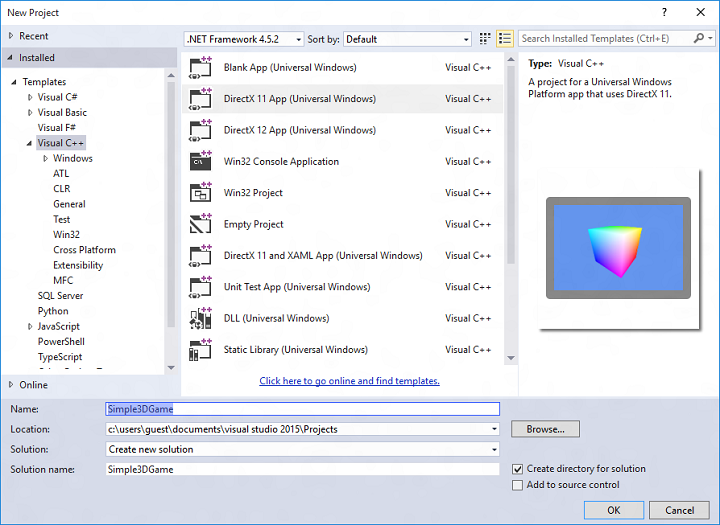

# Configurar el proyecto de juego


\[ Actualizado para aplicaciones para UWP en Windows 10. Para leer más artículos sobre Windows 8.x, consulta el [archivo](http://go.microsoft.com/fwlink/p/?linkid=619132) \]

El primer paso para ensamblar el juego es configurar un proyecto en Microsoft Visual Studio de tal forma que se reduzca al mínimo la cantidad de trabajo necesaria en la infraestructura de código. Puedes ahorrarte mucho tiempo y complicaciones si usas la plantilla adecuada y configuras el proyecto específicamente para desarrollar un juego. Vamos a guiarte por los pasos de configuración de un proyecto de juego sencillo.

## Objetivo


-   Aprender a configurar un proyecto de juego Direct3D en Visual Studio.

## Configuración del proyecto de juego


Puedes escribir un juego desde cero, solo con un sencillo editor de texto, unas pocas muestras y una gran capacidad mental. Probablemente no sea la forma más eficaz de emplear tu tiempo. Si estás dando tus primeros pasos en el desarrollo para la Plataforma universal de Windows (UWP), ¿por qué no dejar que Visual Studio soporte parte de la carga? Esto es lo que debes hacer para que tu proyecto empiece con buen pie.

## 1. Elige la plantilla adecuada


Una plantilla de Visual Studio es una colección de configuraciones y archivos de código para un tipo específico de aplicación basándose en el lenguaje y la tecnología elegidos. En Microsoft Visual Studio 2015, encontrarás varias plantillas que pueden facilitar enormemente el desarrollo de juegos y aplicaciones gráficas. Si no usas una plantilla, debes desarrollar tú mismo casi todo el marco básico de generación de gráficos, lo que puede suponer una ardua tarea para un desarrollador de juegos novel.

La plantilla adecuada para este tutorial es la titulada DirectX 11 App (Universal Windows). En Visual Studio2015, haz clic en **Archivo...**&gt;**Nuevo proyecto** y posteriormente:

1.  Desde **Plantillas**, selecciona **Visual C++**, **Windows**, **Universal**.
2.  En el panel central, selecciona **DirectX 11 App (Universal Windows)**.
3.  Da a tu proyecto un nombre y haz clic en **Aceptar**.



Esta plantilla te proporciona el marco básico para una aplicación para UWP usando DirectX con C++. Vamos, ¡compila y ejecútalo con F5! Fíjate en esa pantalla azul polvo. Párate un segundo y revisa el código que la plantilla proporciona. La plantilla crea varios archivos de código que contienen la funcionalidad básica de una aplicación para UWP con DirectX y C++. Hablamos más de otros archivos de código en el [paso 3](#3-review-the-included-libraries-and-headers). Ahora, examinemos rápidamente **App.h**.

```cpp
    ref class App sealed : public Windows::ApplicationModel::Core::IFrameworkView
    {
    public:
        App();

        // IFrameworkView Methods.
        virtual void Initialize(Windows::ApplicationModel::Core::CoreApplicationView^ applicationView);
        virtual void SetWindow(Windows::UI::Core::CoreWindow^ window);
        virtual void Load(Platform::String^ entryPoint);
        virtual void Run();
        virtual void Uninitialize();

    protected:
        // Application lifecycle event handlers.
        void OnActivated(Windows::ApplicationModel::Core::CoreApplicationView^ applicationView, Windows::ApplicationModel::Activation::IActivatedEventArgs^ args);
        void OnSuspending(Platform::Object^ sender, Windows::ApplicationModel::SuspendingEventArgs^ args);
        void OnResuming(Platform::Object^ sender, Platform::Object^ args);

        // Window event handlers.
        void OnWindowSizeChanged(Windows::UI::Core::CoreWindow^ sender, Windows::UI::Core::WindowSizeChangedEventArgs^ args);
        void OnVisibilityChanged(Windows::UI::Core::CoreWindow^ sender, Windows::UI::Core::VisibilityChangedEventArgs^ args);
        void OnWindowClosed(Windows::UI::Core::CoreWindow^ sender, Windows::UI::Core::CoreWindowEventArgs^ args);

        // DisplayInformation event handlers.
        void OnDpiChanged(Windows::Graphics::Display::DisplayInformation^ sender, Platform::Object^ args);
        void OnOrientationChanged(Windows::Graphics::Display::DisplayInformation^ sender, Platform::Object^ args);
        void OnDisplayContentsInvalidated(Windows::Graphics::Display::DisplayInformation^ sender, Platform::Object^ args);

    private:
        std::shared_ptr<DX::DeviceResources> m_deviceResources;
        std::unique_ptr<MyAwesomeGameMain> m_main;
        bool m_windowClosed;
        bool m_windowVisible;
    };
```

Creas estos cinco métodos ([**Initialize**](https://msdn.microsoft.com/library/windows/apps/hh700495), [**SetWindow**](https://msdn.microsoft.com/library/windows/apps/hh700509), [**Load**](https://msdn.microsoft.com/library/windows/apps/hh700501), [**Run**](https://msdn.microsoft.com/library/windows/apps/hh700505) y [**Uninitialize**](https://msdn.microsoft.com/library/windows/apps/hh700523)) al implementar la interfaz [**IFrameworkView**](https://msdn.microsoft.com/library/windows/apps/hh700469) que define un proveedor de vista. Estos métodos los ejecuta el singleton de la aplicación que se crea al lanzar el juego, y carga todos los recursos de la aplicación, además de conectar los controladores de eventos apropiados.

Tu método **main** está en el archivo fuente **App.cpp**. Tiene esta apariencia:

```cpp
[Platform::MTAThread]
int main(Platform::Array<Platform::String^>^)
{
    auto direct3DApplicationSource = ref new Direct3DApplicationSource();
    CoreApplication::Run(direct3DApplicationSource);
    return 0;
}
```

Ahora mismo, crea una instancia del proveedor de vista Direct3D a partir de la fábrica del proveedor de vista (**Direct3DApplicationSource**, definido en **App.h**) y la pasa al singleton de la aplicación para ejecutarse ([**CoreApplication::Run**](https://msdn.microsoft.com/library/windows/apps/hh700469)). Esto significa que el punto de partida de tu juego propiamente dicho vivirá en el cuerpo de la implementación del método [**IFrameworkView::Run**](https://msdn.microsoft.com/library/windows/apps/hh700505), en este caso, **App::Run**. Aquí te mostramos el código:

```cpp
void App::Run()
{
    while (!m_windowClosed)
    {
        if (m_windowVisible)
        {
            CoreWindow::GetForCurrentThread()->Dispatcher->ProcessEvents(CoreProcessEventsOption::ProcessAllIfPresent);

            m_main->Update();

            if (m_main->Render())
            {
                m_deviceResources->Present();
            }
        }
        else
        {
            CoreWindow::GetForCurrentThread()->Dispatcher->ProcessEvents(CoreProcessEventsOption::ProcessOneAndAllPending);
        }
    }
}
```

Si la ventana de tu juego no está cerrada, se distribuirán todos los eventos, se actualizará el temporizador y se representarán los resultados de tu canalización de gráficos. Hablamos más detalladamente de esto en los temas sobre cómo [definir el marco de UWP del juego](tutorial--building-the-games-metro-style-app-framework.md) y [ensamblar la canalización de representación](tutorial--assembling-the-rendering-pipeline.md). Llegados a este punto, deberías tener una idea de la estructura de código básica de un juego DirectX de UWP.

## 2. Revisa y actualiza el archivo package.appxmanifest


La plantilla no solo consiste en archivos de código. El archivo **package.appxmanifest** contiene metadatos de tu proyecto que sirven para empaquetar y lanzar el juego, así como para enviarlo a la TiendaWindows. También contiene información importante que el sistema del jugador usa para proporcionar acceso a los recursos del sistema que el programa necesita para ejecutarse.

Ejecuta el **Diseñador de manifiestos** haciendo doble clic en el archivo **package.appxmanifest** en el **Explorador de soluciones**. Verás esta vista:


Para más información sobre el archivo **package.appxmanifest** y el empaquetado, consulta el [Diseñador de manifiestos](https://msdn.microsoft.com/library/windows/apps/br230259.aspx). Por ahora, echa un vistazo a la pestaña **Capacidades** y mira las opciones proporcionadas.


Si no seleccionas las funcionalidades que usa tu juego, como el acceso a **Internet** para los juegos locales guardados, o Internet para ver las puntuaciones más altas globales, no podrás tener acceso a los recursos o características correspondientes. Cuando crees un nuevo juego, asegúrate de que seleccionas las funcionalidades que necesitará el juego para ejecutarse.

Ahora, veamos el resto de archivos que vienen con la plantilla **DirectX11 App (Universal Windows)**.

## 3. Revisa las bibliotecas y los encabezados incluidos


Hay varios archivos que aún no hemos visto. Estos archivos proporcionan herramientas y soporte adicionales comunes a escenarios de desarrollo de juegos Direct3D.

| Archivo de código fuente de plantilla         | Descripción                                                                                                                                                                                                            |
|------------------------------|------------------------------------------------------------------------------------------------------------------------------------------------------------------------------------------------------------------------|
| StepTimer.h                  | Define un temporizador de alta resolución útil para aplicaciones de representación de juego o interactivas.                                                                                                                                       |
| Sample3DSceneRenderer.h/.cpp | Define una implementación de representador básica que conecta una cadena de intercambio de Direct3D y un adaptador gráfico a tu aplicación para UWP con DirectX.                                                                                            |
| DirectXHelper.h              | Implementa un único método, **DX::ThrowIfFailed**, que convierte los valores de errores HRESULT devueltos por las API de DirectX en excepciones de Windows Runtime. Usa este método para colocar un punto de interrupción para depurar errores de DirectX. |
| pch.h/.cpp                   | Contiene todos los archivos de inclusión del sistema Windows para las API usadas por una aplicación Direct3D, incluidas las API de DirectX11.                                                                                                           |
| SamplePixelShader.hlsl       | Contiene el código de lenguaje de sombreado de alto nivel (HLSL) para un sombreador de píxeles muy básico.                                                                                                                                     |
| SampleVertexShader.hlsl      | Contiene el código de lenguaje de sombreado de alto nivel (HLSL) para un sombreador de vértices muy básico.                                                                                                                                    |

 

### Pasos siguientes

En este punto, puedes crear un proyecto de juego de UWP con DirectX e identificar los componentes y archivos proporcionados por la plantilla DirectX11 App (Universal Windows).

En el próximo tutorial, [Definir el marco de UWP del juego](tutorial--building-the-games-metro-style-app-framework.md), trabajaremos con un juego completo y examinaremos cómo se usan y amplían en él muchos de los conceptos y componentes proporcionados por la plantilla.

 

 


<!--HONumber=Jun16_HO4-->


