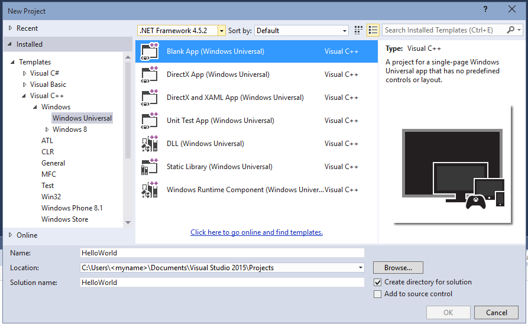

# Crear una aplicación "hello world" en C++ (Windows 10)

Con Microsoft Visual Studio 2015, puedes usar C++ para desarrollar una aplicación que se ejecute en Windows 10, incluidos los teléfonos con Windows 10. Estas aplicaciones tienen una interfaz de usuario que se define en lenguaje XAML.

Para desarrollar una aplicación que se ejecute en Windows 8.1 y Windows Phone 8.1, usa Microsoft Visual Studio 2013 Update 3 o una versión posterior y sigue los pasos que se detallan [aquí](https://msdn.microsoft.com/library/windows/apps/Dn263168). La diferencia más importante es que para Windows 8.1 y Windows Phone 8.1, se usa una solución con tres proyectos, uno para el escritorio (o el dispositivo de tableta), uno para el teléfono y otro para el código compartido. Para el desarrollo en Windows 10, todo el código comparte el mismo proyecto.

Para acceder a tutoriales en otros lenguajes de programación, consulta:

-   [Crear la primera aplicación de la Tienda Windows con JavaScript](https://msdn.microsoft.com/library/windows/apps/BR211385)

-   [Crear la primera aplicación de la Tienda Windows con C# o Visual Basic](https://msdn.microsoft.com/library/windows/apps/Hh974581)

## Antes de comenzar...

-   Para completar este tutorial, debes usar Visual Studio 2015 Community o una versión posterior, o una de las versiones de Visual Studio 2015 que no sea Community, en un equipo que ejecute Windows 10 o Windows 8.1. Para descargarlo, consulta [Obtener las herramientas](http://go.microsoft.com/fwlink/p/?LinkId=532666).
-   Instala el [SDK](http://go.microsoft.com/fwlink/?LinkId=533049) adecuado para el desarrollo de la Plataforma universal de Windows.
-   También debes tener una licencia de desarrollador. Para obtener instrucciones, consulta [Obtener una licencia de desarrollador](https://msdn.microsoft.com/library/windows/apps/Hh974578).
-   Damos por hecho que tienes conocimientos básicos de C++ y XAML estándar, y estás familiarizado con los conceptos de [Introducción a XAML](https://msdn.microsoft.com/library/windows/apps/Mt185595).
-   Se supone que estás usando el diseño de ventana predeterminado en Visual Studio. Para restablecer el diseño predeterminado, en la barra de menús, elige **Ventana** > **Restablecer diseño de la ventana**.
-   Ten en cuenta que hay un problema conocido con Visual Studio 2015 que puede ocasionar una NullReferenceException al cargar el diseñador XAML. Este problema bloquea algunos de los pasos de este tutorial, a menos que apliques la solución alternativa. Para obtener más información acerca de este problema y la solución, consulta [esta publicación del foro de MSDN](http://go.microsoft.com/fwlink/p/?LinkId=624036).

## Comparación de aplicaciones de escritorio C++ con aplicaciones de Windows

Si has trabajado en un entorno de programación de escritorio de Windows en C++, posiblemente encontrarás que algunos aspectos de la programación de aplicaciones de la Tienda Windows y de Windows Phone te resultan familiares, pero otros aspectos requieren algo de estudio por tu parte.

### ¿Qué es igual?

-   Puedes usar la STL, la CRT (salvo algunas excepciones), y cualquier otra biblioteca de C++ siempre que el código no intente llamar a funciones de Windows a las que no se puede acceder desde el entorno de Windows en tiempo de ejecución.

-   Si estás acostumbrado a los diseñadores visuales, puedes seguir usando el diseñador integrado en Microsoft Visual Studio o puedes usar Blend for Visual Studio, que es una herramienta más completa. Si estás acostumbrado a codificar la interfaz de usuario a mano, puedes codificar a mano tu XAML.

-   Sigues creando aplicaciones que usan tipos de sistemas operativos Windows y tus propios tipos personalizados.

-   Continúas usando el depurador, generador de perfiles y otras herramientas de desarrollo de Visual Studio.

-   Sigues creando aplicaciones que se compilan en el código máquina nativo mediante el compilador de Visual C++. Las aplicaciones de la Tienda Windows en C++ no se ejecutan en un entorno de tiempo de ejecución administrado.

### Novedades

-   Los principios de diseño para las aplicaciones de la Tienda Windows y las aplicaciones universales de Windows son muy distintos de los principios para las aplicaciones de escritorio. Se quita énfasis a los bordes, etiquetas, cuadros de diálogo, etc. de las ventanas. El contenido es lo más importante. Las grandes aplicaciones universales de Windows incorporan estos principios desde el comienzo de la etapa de planeación.

-   Toda la interfaz de usuario se define con XAML. La separación entre la interfaz de usuario y la lógica de programa principal es mucho más clara en una aplicación universal para Windows que en una aplicación de MFC o Win32. Puede haber otras personas trabajando en la apariencia de la interfaz de usuario en el archivo XAML mientras tú trabajas en el comportamiento en el archivo de código.

-   Estás programando principalmente con una API nueva, fácil de navegar y orientada a objetos, Windows en tiempo de ejecución, aunque Win32 sigue estando disponible en los dispositivos de Windows para realizar algunas funciones.

-   Usas C++/CX para consumir y crear objetos de Windows en tiempo de ejecución. C++/CX permite controlar excepciones de C++, admite delegados y eventos, y permite realizar recuentos automáticos de referencias de objetos creados en forma dinámica. Cuando usas C++/CX, los detalles del COM subyacente y de la arquitectura de Windows están ocultos en el código de aplicación. Para más información, consulta la [referencia de lenguaje de C++/CX](https://msdn.microsoft.com/en-us/library/windows/apps/hh699871.aspx).

-   La aplicación se compila en un paquete que también contiene metadatos sobre los tipos que incluye la aplicación, los recursos que usa y las funcionalidades que necesita (acceso a los archivos, acceso a Internet, acceso a la cámara, etc.).

-   En la Tienda Windows y la Tienda de Windows Phone, se comprueba que la aplicación sea segura mediante un proceso de certificación y se hace que millones de clientes potenciales puedan detectarla.

## Aplicación Hello World de la Tienda en C++

Nuestra primera aplicación es una presentación para el mundo ("Hello World") que demuestra algunas características básicas de interactividad, diseño y estilos. Vamos a crear una aplicación desde la plantilla de proyecto de aplicación universal de Windows. Si has desarrollado aplicaciones para Windows 8.1 y Windows Phone 8.1 antes, probablemente recuerdes que debes tener tres proyectos en Visual Studio, uno para la aplicación de Windows, otro para la aplicación de teléfono y otro con código compartido. La Plataforma universal de Windows (UWP) de Windows 10 hace posible tener solo un proyecto que se ejecute en todos los dispositivos, incluidos los equipos de escritorio y portátiles que ejecuten Windows 10, los dispositivos como tabletas, teléfonos móviles, etc.

Empezaremos por los conceptos básicos:

-   Cómo crear un proyecto universal de Windows en Visual Studio 2015 o posterior.

-   Cómo comprender los proyectos y los archivos que se crean.

-   Cómo comprender las extensiones de componentes de Visual C++ (C++/CX) y cuándo usarlas.

**Lo primero: crear una solución en Visual Studio**

1.  En la barra de menús de Visual Studio, elige **Archivo** > **Nuevo** > **Proyecto**.

2.  En el cuadro de diálogo **Nuevo Proyecto**, en el panel izquierdo, expande **Instalado** > **Visual C++** > **Windows** > **Universal**.

3.  En el panel central, selecciona **Aplicación vacía (Windows Universal)**.

4.  Escribe un nombre para el proyecto. Lo llamaremos HelloWorld.

 

5.  Elige el botón **Aceptar**.

   Si este es el primer proyecto de UWP que has creado y no has habilitado el modo de desarrollador en tu ordenador, aparecerá el cuadro de diálogo Habilitar modo de desarrollador. Haz clic en el vínculo para que aparezca la página de configuración que te permite establecer el modo de desarrollador. El modo de desarrollador te permite implementar y ejecutar localmente las aplicaciones.

   Se crean los archivos del proyecto.

Antes de continuar, veamos qué hay en la solución.


### Sobre los archivos de proyecto

Cada archivo .xaml de una carpeta de proyecto tiene asociados un archivo .xaml.h y otro archivo .xaml.cpp en la misma carpeta, y un archivo .g y otro archivo .g.hpp en la carpeta Archivos generados, que está en el disco pero no forma parte del proyecto. Modifica los archivos XAML para crear elementos de la interfaz de usuario y conéctalos a orígenes de datos (DataBinding). Modifica los archivos .h y .cpp files para agregar lógica personalizada para controladores de eventos. Los archivos autogenerados representan la transformación del marcado XAML en C++. No modifiques estos archivos, pero puedes estudiarlos para comprender mejor cómo funciona el código que se esconde tras ellos. Básicamente, el archivo generado contiene una definición de clase parcial para un elemento raíz de XAML; esta clase es la misma clase que modificas en los archivos \*.xaml.h y .cpp. Los archivos generados declaran los elementos secundarios de la interfaz de usuario de XAML como miembros de clase para que puedas hacer referencia a ellos en el código que escribas. Durante la compilación, el código generado y tu código se combinan en una definición de clase completa y, después, se compilan.

Veamos primero los archivos del proyecto.

-   **App.xaml, App.xaml.h, App.xaml.cpp:** representan el objeto Application, que es un punto de entrada de la aplicación. App.xaml no contiene marcado de interfaz de usuario de la página, pero puedes agregar estilos de interfaz de usuario y otros elementos a los que desees que se pueda acceder desde cualquier página. Los archivos de código subyacente contienen controladores para los eventos **OnLaunched** y **OnSuspending**. Por lo general, aquí tienes que agregar código personalizado para que inicialice tu aplicación cuando se inicie y realice la limpieza cuando se suspenda o finalice.
-   **MainPage.xaml, MainPage.xaml.h, MainPage.xaml.cpp:**contienen el marcado XAML y el código subyacente para la página de "inicio" predeterminada de una aplicación. No dispone de compatibilidad de navegación ni de controles integrados.
-   **pch.h, pch.cpp:** un archivo de encabezado precompilado y el archivo que lo incluye en tu proyecto. En pch.h, puedes incluir cualquier encabezado que no cambie a menudo y que se incluyan en otros archivos de la solución.
-   **Package.appxmanifest:** un archivo XML que describe las capacidades del dispositivo que requiere tu aplicación, así como la información de versión de la aplicación y otros metadatos. Para abrir este archivo en el **Diseñador de manifiestos**, solo tienes que hacer doble clic en él.
-   **HelloWorld\_TemporaryKey.pfx:**una clave que permite la implementación de la aplicación en este equipo desde Visual Studio.

## Un primer vistazo al código

Si examinas el código de App.xaml.h, App.xaml.cpp en el proyecto compartido, verás que prácticamente todo es código C++ bastante familiar. Sin embargo, algunos elementos de sintaxis pueden no resultar tan familiares si estás comenzando con las aplicaciones de Windows en tiempo de ejecución o has trabajado con C++ o CLI. A continuación, te mostramos los elementos de sintaxis no estándares más comunes que verás en C++/CX:

-   **Clases de referencia**

Prácticamente todas las clases de Windows Runtime, en las que se incluyen todos los tipos de la API de Windows (XAML de Windows, las páginas de tu aplicación, la propia clase App, todos los objetos de red y dispositivo, todos los tipos de contenedor), se declaran como **clase ref**. (Algunos tipos de Windows son **clase de valor** o **estructura de valor**). Una clase de referencia se puede consumir desde cualquier lenguaje. En C++, la duración de estos tipos está regulada por recuentos automáticos de referencia (no la recolección de elementos no usados), para que nunca tengas que eliminar estos objetos de forma explícita. También puedes crear tus propias clases de referencia.

```cpp
    namespace HelloWorld
    {
        /// <summary>
        /// An empty page that can be used on its own or navigated to within a Frame.
        /// </summary>
        public ref class MainPage sealed
        {
        public:
            MainPage();

        };
    }
```    

Todos los tipos de Windows Runtime deben declararse en un espacio de nombres y, al contrario que en ISO C++, los propios tipos tienen un modificador de accesibilidad. El modificador **public** hace que los componentes de Windows Runtime puedan ver la clase fuera del espacio de nombres. La palabra clave **sealed** (sellada) significa que la clase no puede servir como una clase base. Prácticamente todas las clases de referencia están selladas; la herencia de clases no se usa mucho porque JavaScript no la comprende.

-   **ref new** y **^ (circunflejos)**

 Declaras una variable de una clase de referencia mediante el operador ^ (circunflejo) y creas una instancia del objeto con la nueva palabra clave de la referencia. Después accedes a los métodos de instancia del objeto mediante el operador ->, como un puntero de C++. Para acceder a los métodos estáticos, es necesario usar el operador ::, como en ISO C++.

 En este código de abajo, usamos el nombre completo para crear una instancia del objeto y usamos el operador -> para llamar a un método de instancia.

 ```cpp
    Windows::UI::Xaml::Media::Imaging::BitmapImage^ bitmapImage =
        ref new Windows::UI::Xaml::Media::Imaging::BitmapImage();
      
    bitmapImage->SetSource(fileStream);
    ```

   Por lo general, en un archivo .cpp file agregaríamos una directiva `using namespace  Windows::UI::Xaml::Media::Imaging` y la palabra clave auto, para que el mismo código tuviese este aspecto:

```cpp
    auto bitmapImage = ref new BitmapImage();
    bitmapImage->SetSource(fileStream);
```

-   **Propiedades**

   Una clase de referencia puede tener propiedades que, al igual que en los lenguajes administrados, son funciones de miembros especiales que aparecen como campos del código que se consume.

```cpp
    public ref class SaveStateEventArgs sealed
            {
            public:

                // Declare the property
                property Windows::Foundation::Collections::IMap<Platform::String^, Platform::Object^>^ PageState
                {
                    Windows::Foundation::Collections::IMap<Platform::String^, Platform::Object^>^ get();
                }
    ...
    };

    ...
    // consume the property like a public field
    void PhotoPage::SaveState(Object^ sender, Common::SaveStateEventArgs^ e)
    {    
        if (mruToken != nullptr && !mruToken->IsEmpty())
        {
            e->PageState->Insert("mruToken", mruToken);
        }
    }
```

-   **Delegados**

   Al igual que en los lenguajes administrados, un delegado es un tipo de referencia que encapsula una función con una firma específica. Se usan principalmente con eventos y controladores de eventos

```cpp
    // Delegate declaration (within namespace scope)
    public delegate void LoadStateEventHandler(Platform::Object^ sender, LoadStateEventArgs^ e);

    // Event declaration (class scope)
    public ref class NavigationHelper sealed
    {
      public:
        event LoadStateEventHandler^ LoadState;
    };

    // Create the event handler in consuming class
    MainPage::MainPage()
    {
        auto navigationHelper = ref new Common::NavigationHelper(this);
        navigationHelper->LoadState += ref new Common::LoadStateEventHandler(this, &MainPage::LoadState);
    }
```

## Agregar contenido a la aplicación

Vamos a agregar algo de contenido a la aplicación.

**Paso 1: Modificar tu página de inicio**

1.  En el **Explorador de soluciones**, abre MainPage.xaml.
2.  Crea controles para la interfaz de usuario agregando el siguiente código XAML a la raíz [**Grid**](https://msdn.microsoft.com/library/windows/apps/BR242704), justo antes de su etiqueta de cierre. Contiene un [**StackPanel**](https://msdn.microsoft.com/library/windows/apps/BR209635) con un [**TextBlock**](https://msdn.microsoft.com/library/windows/apps/BR209652) que pregunta el nombre del usuario, un elemento [**TextBox**](https://msdn.microsoft.com/library/windows/apps/BR209683) que acepta el nombre del usuario, un [**Button**](https://msdn.microsoft.com/library/windows/apps/BR209265) y otro elemento **TextBlock**.

```xml
    <StackPanel x:Name="contentPanel" Margin="120,30,0,0">
        <TextBlock HorizontalAlignment="Left" Text="Hello World" FontSize="36"/>
        <TextBlock Text="What's your name?"/>
        <StackPanel x:Name="inputPanel" Orientation="Horizontal" Margin="0,20,0,20">
            <TextBox x:Name="nameInput" Width="300" HorizontalAlignment="Left"/>
            <Button x:Name="inputButton" Content="Say \"Hello\""/>
        </StackPanel>
        <TextBlock x:Name="greetingOutput"/>
    </StackPanel>
```

Hay más información disponible sobre el diseño XAML en el artículo sobre la [navegación, diseño y vistas](https://msdn.microsoft.com/library/windows/apps/Dn263172).

3.  En este punto, has creado una aplicación universal de Windows muy básica. Para ver la apariencia de la aplicación para UWP, presiona F5 para compilar, implementar y ejecutar la aplicación en modo de depuración.

Primero aparece la pantalla de presentación predeterminada. Muestra una imagen (Assets\\SplashScreen.scale-100.png) y un color de fondo que se especifican en el archivo de manifiesto de la aplicación. Para aprender a personalizar la pantalla de presentación, consulta [Agregar una pantalla de presentación](https://msdn.microsoft.com/library/windows/apps/Hh465332).

Cuando desaparezca la pantalla de presentación, aparecerá tu aplicación. Muestra la página principal de la aplicación.

Presiona la tecla Windows o haz clic en el botón Inicio para ir al menú Inicio y observa que al implementar la aplicación, se agrega a la lista de las aplicaciones instaladas del menú Inicio. También aparece cuando se hace clic en el nuevo vínculo junto al botón Todas las aplicaciones. Para volver a ejecutar la aplicación, simplemente pulsa o haz clic en su icono y presiona F5 o Ctrl+F5 en Visual Studio como de costumbre.

 

   Aunque todavía no hace muchas cosas, te felicitamos por haber compilado tu primera aplicación de la Plataforma universal de Windows.

   Para detener la depuración y cerrar la aplicación, vuelve a Visual Studio y presiona Mayús+F5.

   Para más información, consulta [Ejecutar aplicaciones de la Tienda desde Visual Studio](http://go.microsoft.com/fwlink/p/?LinkId=619619).

   En la aplicación puedes escribir en el [**TextBox**](https://msdn.microsoft.com/library/windows/apps/BR209683), pero si haces clic en el [**Button**](https://msdn.microsoft.com/library/windows/apps/BR209265), no se realiza ninguna acción. En los pasos posteriores, crearás un controlador de eventos para el evento [**Click**](https://msdn.microsoft.com/library/windows/apps/BR227737) del botón que muestra un saludo personalizado.

## Iniciar la aplicación en un emulador de dispositivos móviles


La aplicación se ejecuta en cualquier dispositivo de Windows 10, así que vamos a ver su aspecto en un Windows Phone. Para esta sección necesitas un Windows Phone con Windows 10 o el acceso a un emulador de Windows Phone. También es necesario que Visual Studio se ejecute en un equipo físico (no una máquina virtual) que admita y tenga habilitado HyperV.

Además de las opciones para realizar la depuración en un dispositivo de escritorio, Visual Studio ofrece opciones para implementar y depurar la aplicación en un dispositivo móvil físico conectado al equipo o en un emulador de dispositivos móviles. Puedes elegir entre varios emuladores para dispositivos con diferentes configuraciones de memoria y pantalla.

-   **Dispositivo**
-   **Emulador 10.0.0.0 WVGA de 4 pulgadas y 512 MB**
-   Varios emuladores en otras configuraciones

Se recomienda probar la aplicación en un dispositivo con una pantalla pequeña y de memoria limitada, por lo tanto, usa la opción **Emulador 10.0.0.0 WVGA de 4 pulgadas y 512 MB**.
**Sugerencia**  Para obtener más información sobre el uso del emulador de teléfono, consulta [Ejecutar aplicaciones de Windows Phone en el simulador](http://go.microsoft.com/fwlink/p/?LinkId=394233).

 

Para depurar tu aplicación en un dispositivo físico, debes contar con uno que esté registrado para desarrollo. Para más información, consulta [Registrar el Windows Phone](https://msdn.microsoft.com/library/windows/apps/Dn614128).

**Para iniciar la depuración en un emulador de dispositivo móvil**

1.  En el menú del dispositivo de destino () en la barra de herramientas **Estándar**, elige **Emulador 10.0.0.0 WVGA de 4 pulgadas y 512 MB**.
2.  Haz clic en el botón **Iniciar depuración** () en la barra de herramientas.

   O bien

   En el menú **Depurar**, haz clic en **Iniciar depuración**.

   O bien

   Presiona F5.

En el emulador de dispositivos móviles, la aplicación tiene este aspecto.


Visual Studio inicia el emulador seleccionado y, a continuación, implementa e inicia la aplicación. Lo primero que observarás es que el margen izquierdo de 120 píxeles que se muestra correctamente en el equipo local desplaza el contenido de la pantalla más pequeña de un dispositivo móvil. Más adelante en este tutorial, aprenderás a adaptar la interfaz de usuario a diferentes tamaños de pantalla para que la aplicación siempre se vea bien.

## Paso 2: Crear un controlador de eventos

1.  En MainPage.xaml, en la vista de diseño o XAML, selecciona el [**Button**](https://msdn.microsoft.com/library/windows/apps/BR209265) "Saluda" del [**StackPanel**](https://msdn.microsoft.com/library/windows/apps/BR209635) que agregaste anteriormente.
2.  Abre la ventana **Propiedades** presionando Alt+Entrar y después elige el botón Eventos (. En su cuadro de texto, escribe el nombre de la función que controla el evento **Click**. Para este ejemplo, escribe "Button\_Click".


4.  Presiona Entrar. El método de controlador de eventos se crea en MainPage.xaml.cpp y se abre de forma que puedas agregar el código que se ejecutará cuando se produzca el evento.

   Al mismo tiempo, en MainPage.xaml, el XAML para [**Button**](https://msdn.microsoft.com/library/windows/apps/BR209265) se actualiza para declarar el controlador de eventos de [**Click**](https://msdn.microsoft.com/library/windows/apps/BR227737), de esta manera:

```xml
    <Button Content="Say \"Hello\"" Click="Button_Click"/>
```

Podrías haber agregado esto simplemente al código xaml de forma manual, lo cual puede resultar útil si no se carga el diseñador. Si escribes esto manualmente, escribe "Click" y deja que IntelliSense haga aparecer la opción para agregar un nuevo controlador de eventos. De este modo, Visual Studio creará la declaración del método y el código auxiliar necesarios.

El diseñador no se puede cargar si se produce una excepción no controlada durante la representación. La representación en el diseñador implica ejecutar una versión en tiempo de diseño de la página. Puede ser útil deshabilitar la ejecución de código de usuario. Puedes hacerlo cambiando la configuración en el cuadro de diálogo **Herramientas, Opciones**. En **Diseñador XAML**, desactiva la casilla **Ejecutar código del proyecto en el diseñador XAML (si se admite)**.

5.  En MainPage.xaml.cpp, agrega el siguiente código al controlador de eventos **Button\_Click** que acabas de crear. Este código recupera el nombre de usuario del control `nameInput` [**TextBox**](https://msdn.microsoft.com/library/windows/apps/BR209683) y lo usa para crear un saludo. El `greetingOutput` [**TextBlock**](https://msdn.microsoft.com/library/windows/apps/BR209652) muestra el resultado.

```cpp
    void HelloWorld::MainPage::Button_Click(Platform::Object^ sender, Windows::UI::Xaml::RoutedEventArgs^ e)
    {
        greetingOutput->Text = "Hello, " + nameInput->Text + "!";
    }
```

6.  Establece el proyecto como el proyecto de inicio y presiona F5 para compilar y ejecutar la aplicación. Cuando escribes un nombre en el cuadro de texto y haces clic en el botón, la aplicación muestra un saludo personalizado.


## Paso 3: Otorgar estilo a la página de inicio

### Elección de un tema

Es fácil personalizar la apariencia de tu aplicación. De manera predeterminada, tu aplicación usa recursos con un estilo claro. Los recursos del sistema también incluyen un tema claro. Vamos a probarlo y ver cómo es.

**Para cambiar al tema oscuro**

1.  Abre App.xaml.
2.  En la etiqueta de apertura [**Aplicación**](https://msdn.microsoft.com/library/windows/apps/BR242324), edita la propiedad [**RequestedTheme**](https://msdn.microsoft.com/library/windows/apps/windows.ui.xaml.application.requestedtheme) y establece su valor en **Oscuro**:

```xml
   RequestedTheme="Light"
```

Esta es la etiqueta [**Aplicación**](https://msdn.microsoft.com/library/windows/apps/BR242324) completa con el tema oscuro:

```xml 
        <Application
        x:Class="HelloWorld.App"
        xmlns="http://schemas.microsoft.com/winfx/2006/xaml/presentation"
        xmlns:x="http://schemas.microsoft.com/winfx/2006/xaml"
        xmlns:local="using:HelloWorld" 
        RequestedTheme="Dark">
```

3.  Presiona F5 para compilarla y ejecutarla. Observa que usa el tema oscuro.


¿Qué tema deberías usar? El que más te guste. Esta es nuestra perspectiva: te recomendamos que uses el tema oscuro para las aplicaciones que muestren principalmente imágenes o vídeo y el tema claro para las aplicaciones que contengan mucho texto. Si vas a usar un esquema de colores personalizado, usa el tema que mejor se ajuste a la apariencia de la aplicación. En el resto de este tutorial, usaremos el tema claro en las capturas de pantalla.

**Nota**  El tema se aplica cuando se inicia la aplicación y no se puede cambiar mientras la aplicación se está ejecutando.

### Usar estilos del sistema

Ahora mismo, en la aplicación de Windows el texto es muy pequeño y difícil de leer. Vamos a solucionarlo aplicando un estilo del sistema.

**Para cambiar el estilo de un elemento**

1.  En el proyecto de Windows, abre MainPage.xaml.
2.  En la vista de diseño o en XAML, selecciona el [**TextBlock**](https://msdn.microsoft.com/library/windows/apps/BR209652) "¿Cómo te llamas?" que agregaste anteriormente.
3.  En la ventana **Propiedades** (**F4**), elige el botón Propiedades () en la parte superior derecha.
4.  Expande el grupo **Texto** y establece el tamaño de fuente en 18 px.
5.  Expande el grupo **Varios** y busca la propiedad **Style**.
6.  Haz clic en el marcador de propiedad (el cuadro verde situado a la derecha de la propiedad **Style**) y después, en el menú, elige **Recurso del sistema** > **BaseTextBlockStyle**.

 **BaseTextBlockStyle** es un recurso definido en [**ResourceDictionary**](https://msdn.microsoft.com/library/windows/apps/BR208794) en <root>\\Archivos de programa\\Windows Kits\\10\\Include\\winrt\\xaml\\design\\generic.xaml.


 En la superficie de diseño XAML, la apariencia del texto cambia. En el editor XAML, se actualiza el XAML para [**TextBlock**](https://msdn.microsoft.com/library/windows/apps/BR209652):

```xml
   <TextBlock Text="What's your name?" Style="{StaticResource BasicTextStyle}"/><
```

7.  Repite el proceso para establecer el tamaño de fuente y asignar **BaseTextBlockStyle** al elemento `greetingOutput`[**TextBlock**](https://msdn.microsoft.com/library/windows/apps/BR209652).

  **Sugerencia**  Aunque no haya texto en este [**TextBlock**](https://msdn.microsoft.com/library/windows/apps/BR209652), cuando mueves el puntero sobre la superficie de diseño XAML, un contorno azul muestra dónde está para que puedas seleccionarlo.  

  Tu XAML ahora tiene esta apariencia:

```xml
    <StackPanel x:Name="contentPanel" Margin="120,30,0,0">
        <TextBlock Style="{ThemeResource BaseTextBlockStyle}" FontSize="16" Text="What's your name?"/>
        <StackPanel x:Name="inputPanel" Orientation="Horizontal" Margin="0,20,0,20">
            <TextBox x:Name="nameInput" Width="300" HorizontalAlignment="Left"/>
            <Button x:Name="inputButton" Content="Say \"Hello\"" Click="Button_Click"/>
        </StackPanel>
        <TextBlock Style="{ThemeResource BaseTextBlockStyle}" FontSize="16" x:Name="greetingOutput"/>
    </StackPanel>
```

8.  Presiona F5 para compilar y ejecutar la aplicación. Ahora tiene esta apariencia:

 

### Paso 4: adaptar la interfaz de usuario a diferentes tamaños de ventana

Ahora haremos que la interfaz de usuario se adapte a diferentes tamaños de pantalla para que se vea correctamente en los dispositivos móviles. Para ello, agrega [**VisualStateManager**](https://msdn.microsoft.com/library/windows/apps/BR209021) y establece las propiedades que se aplican a diferentes estados visuales.

**Para ajustar el diseño de interfaz de usuario**

1.  En el editor XAML, agrega este bloque de XAML después de la etiqueta de apertura del elemento raíz [**Grid**](https://msdn.microsoft.com/library/windows/apps/BR242704).

```xml
    <VisualStateManager.VisualStateGroups>
        <VisualStateGroup>
            <VisualState x:Name="wideState">
                <VisualState.StateTriggers>
                    <AdaptiveTrigger MinWindowWidth="641" />
                </VisualState.StateTriggers>
            </VisualState>
            <VisualState x:Name="narrowState">
                <VisualState.StateTriggers>
                    <AdaptiveTrigger MinWindowWidth="0" />
                </VisualState.StateTriggers>
                <VisualState.Setters>
                    <Setter Target="contentPanel.Margin" Value="20,30,0,0"/>
                    <Setter Target="inputPanel.Orientation" Value="Vertical"/>
                    <Setter Target="inputButton.Margin" Value="0,4,0,0"/>
                </VisualState.Setters>
            </VisualState>
        </VisualStateGroup>
    </VisualStateManager.VisualStateGroups>
```

2.  Depura la aplicación en el equipo local. Verás que la interfaz de usuario es igual que antes, a menos que la ventana tenga un ancho inferior a 641 píxeles independientes del dispositivo (DIP).
3.  Depura la aplicación en el emulador de dispositivos móviles. Observa que la interfaz de usuario use las propiedades definidas en `narrowState` y aparezca correctamente en la pantalla pequeña.


Si has usado [**VisualStateManager**](https://msdn.microsoft.com/library/windows/apps/BR209021) en versiones anteriores de XAML, puedes observar que aquí el XAML usa una sintaxis simplificada.

El [**VisualState**](https://msdn.microsoft.com/library/windows/apps/BR209007) llamado `wideState` tiene un [**AdaptiveTrigger**](https://msdn.microsoft.com/library/windows/apps/Dn890382) con su propiedad [**MinWindowWidth**](https://msdn.microsoft.com/en-us/library/windows/apps/windows.ui.xaml.adaptivetrigger.minwindowwidth) establecida en 641. Esto significa que el estado se aplicará únicamente cuando el ancho de la ventana no sea inferior al mínimo de 641 DIP. Para este estado no definas ningún objeto [**Setter**](https://msdn.microsoft.com/library/windows/apps/BR208817) a fin de que se usen las propiedades de diseño definidas en el XAML para el contenido de la página.

El segundo [**VisualState**](https://msdn.microsoft.com/library/windows/apps/BR209007), `narrowState`, tiene un [**AdaptiveTrigger**](https://msdn.microsoft.com/library/windows/apps/Dn890382) con su propiedad [**MinWindowWidth**](https://msdn.microsoft.com/en-us/library/windows/apps/windows.ui.xaml.adaptivetrigger.minwindowwidth) establecida en 0. Este estado se aplica cuando el ancho de la ventana es mayor que 0, pero inferior a 641 DIP. (En 641 DIP, se aplica `wideState`). En este estado, defines algunos objetos [**Setter**](https://msdn.microsoft.com/library/windows/apps/BR208817) para cambiar las propiedades de diseño de los controles de la interfaz de usuario:

-   Reduce el margen izquierdo del elemento `contentPanel` de 120 a 20.
-   Cambias [**Orientation**](https://msdn.microsoft.com/library/windows/apps/windows.ui.xaml.controls.stackpanel.orientation) del elemento `inputPanel` desde **Horizontal** a **Vertical**.
-   Agregas un margen superior de 4 DIP al elemento `inputButton`.

### Resumen

Felicidades, has completado el primer tutorial. En él aprendiste cómo se agrega contenido a una aplicación universal de Windows, cómo se le agrega interactividad y cómo se cambia su apariencia.

## Pasos siguientes

Si tienes un proyecto de aplicación universal de Windows destinado a Windows 8.1 o Windows Phone 8.1, puedes portarlo a Windows 10. No hay ningún proceso automático para ello, pero puedes hacerlo manualmente con un esfuerzo mínimo. Empieza con un nuevo proyecto de Windows Universal para obtener la estructura del sistema de proyecto más reciente y los archivos de manifiesto, copia los archivos de código en la estructura de directorios del proyecto, agrega los elementos al proyecto y reescribe el XAML con [**VisualStateManager**](https://msdn.microsoft.com/library/windows/apps/BR209021), como se indica en este tema. Para más información, consulta [Migración de un proyecto de Windows Runtime 8.x a un proyecto de UWP](https://msdn.microsoft.com/library/windows/apps/Mt188203) y [Migrar a la Plataforma universal de Windows (C++)](http://go.microsoft.com/fwlink/p/?LinkId=619525).

Si tienes código C++ que desees integrar en una aplicación para UWP, por ejemplo, para crear una nueva interfaz de usuario de UWP para una aplicación existente, consulta [Cómo: usar código C++ existente en una aplicación universal de la plataforma Windows](http://go.microsoft.com/fwlink/p/?LinkId=619623).


<!--HONumber=May16_HO2-->


