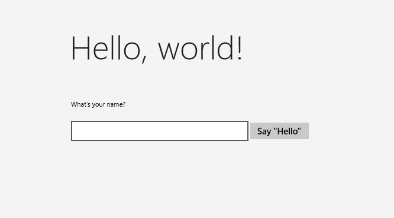
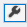
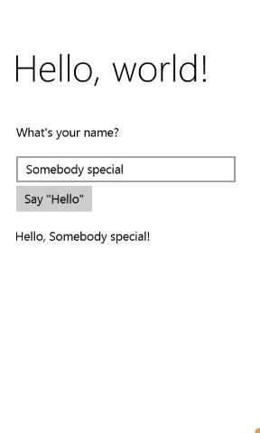

# <a name="create-a-hello-world-app-in-ccx"></a>Crear una aplicación "Hello world" en C++/CX

> [!IMPORTANT]
> Este tutorial usa C++/CX. Microsoft ha lanzado C ++ / WinRT: una proyección de lenguaje C ++ 17 moderna completamente estándar para las API de Windows Runtime (WinRT). Para obtener más información sobre este lenguaje, consulte [ C++/WinRT](https://docs.microsoft.com/windows/uwp/cpp-and-winrt-apis/).

Con Microsoft Visual Studio, puede usar C ++ / CX para desarrollar una aplicación que se ejecute en Windows 10 con una interfaz de usuario definida en Extensible Application Markup Language (XAML).

> [!NOTE]
> En este tutorial se usa Visual Studio Community 2019. Si usa otra versión de Visual Studio, es posible que tenga una apariencia un poco diferente.

## <a name="before-you-start"></a>Antes de empezar

-   Para completar este tutorial, debe usar Visual Studio Community, o una de las versiones que no son de la comunidad de Visual Studio, en un ordenador que ejecute Windows 10. Para su descarga, consulta [Obtener las herramientas](https://visualstudio.microsoft.com/downloads/)
-   Damos por hecho que tiene conocimientos básico de C ++ / CX, XAML y que esta familiarizado con los conceptos de la[introducción a XAML ](https://docs.microsoft.com/windows/uwp/xaml-platform/xaml-overview).
-   Se supone que estás usando el diseño de ventana predeterminado en Visual Studio. Para restablecer el diseño predeterminado, en la barra de menús, elige **Ventana** > **Restablecer diseño de la ventana**.

## <a name="comparing-c-desktop-apps-to-windows-apps"></a>Comparación de aplicaciones de escritorio C++ con aplicaciones de Windows

Si viene de un segundo plano en la programación de escritorio de Windows en C ++, probablemente encontrará que algunos aspectos de la escritura de aplicaciones para el UWP son familiares, pero otros aspectos requieren cierto aprendizaje.

### <a name="whats-the-same"></a>¿Qué es igual?

-   Puede usar el STL, el CRT (con algunas excepciones) y cualquier otra biblioteca de C++ siempre y cuando el código solo llame a las funciones de Windows a las que se puede acceder desde el ambiente de tiempo de ejecución de Windows.

-   Si estás acostumbrado a los diseñadores visuales, puedes seguir usando el diseñador integrado en Microsoft Visual Studio o puedes usar Blend for Visual Studio, que es una herramienta más completa. Si estás acostumbrado a codificar la interfaz de usuario a mano, puedes codificar a mano tu XAML.

-   Sigues creando aplicaciones que usan tipos de sistemas operativos Windows y tus propios tipos personalizados.

-   Continúas usando el depurador, generador de perfiles y otras herramientas de desarrollo de Visual Studio.

-   Sigues creando aplicaciones que se compilan en el código máquina nativo mediante el compilador de Visual C++. Las aplicaciones para UWP en C ++ / CX no se ejecutan en un ambiente de tiempo de ejecución administrado.

### <a name="whats-new"></a>Novedades

-   Los principios de diseño para las aplicaciones para UWP y las aplicaciones Windows universal son muy distintos de los principios para las aplicaciones de escritorio. Se quita énfasis a los bordes, etiquetas, cuadros de diálogo, etc. de las ventanas. El contenido es lo más importante. Las grandes aplicaciones universales de Windows incorporan estos principios desde el comienzo de la etapa de planeación.

-   Toda la interfaz de usuario se define con XAML. La separación entre la interfaz de usuario y la lógica de programa principal es mucho más clara en una aplicación universal para Windows que en una aplicación de MFC o Win32. Puede haber otras personas trabajando en la apariencia de la interfaz de usuario en el archivo XAML mientras tú trabajas en el comportamiento en el archivo de código.

-   Estás programando principalmente con una API nueva, fácil de navegar y orientada a objetos, Windows en tiempo de ejecución, aunque Win32 sigue estando disponible en los dispositivos de Windows para realizar algunas funciones.

-   Usas C++/CX para consumir y crear objetos de Windows en tiempo de ejecución. C++/CX permite controlar excepciones de C++, admite delegados y eventos, y permite realizar recuentos automáticos de referencias de objetos creados en forma dinámica. Cuando usas C++/CX, los detalles del COM subyacente y de la arquitectura de Windows están ocultos en el código de aplicación. Para obtener más información, consulta la [referencia de lenguaje de C++/CX](https://docs.microsoft.com/cpp/cppcx/visual-c-language-reference-c-cx).

-   La aplicación se compila en un paquete que también contiene metadatos sobre los tipos que incluye la aplicación, los recursos que usa y las funcionalidades que necesita (acceso a los archivos, acceso a Internet, acceso a la cámara, etc.).

-   En Microsoft Store y la Store de Windows Phone, su aplicación se verifica como segura mediante un proceso de certificación y se pueda ser reconocible a millones de clientes potenciales.

## <a name="hello-world-store-app-in-ccx"></a>La aplicación Hello World Store en C ++ / CX

Nuestra primera aplicación es una presentación para el mundo ("Hello World") que demuestra algunas características básicas de interactividad, diseño y estilos. Vamos a crear una aplicación desde la plantilla de proyecto de aplicación universal de Windows. Si ha desarrollado aplicaciones para Windows 8.1 y Windows Phone 8.1 antes, probablemente recuerde que debe tener tres proyectos en Visual Studio, uno para la aplicación de Windows, otro para la aplicación de teléfono y otro con código compartido. La Plataforma universal de Windows (UWP) de Windows 10 hace posible tener solo un proyecto que se ejecute en todos los dispositivos, incluidos los equipos de escritorio y portátiles que ejecutan Windows 10, dispositivos como tabletas, teléfonos móviles, dispositivos de VR, etc.

Empezaremos por los conceptos básicos:

-   Cómo crear un proyecto universal de Windows en Visual Studio.

-   Cómo comprender los proyectos y los archivos que se crean.

-   Cómo entender las extensiones en las extensiones de componentes de Visual C ++ (C ++ / CX), y cuándo usarlas.

**Lo primero: crear una solución en Visual Studio**

1.  En la barra de menús de Visual Studio, elige **Archivo** > **Nuevo** > **Proyecto...** .

2.  En el cuadro de diálogo **Crear un nuevo proyecto**, selecciona **Aplicación en blanco (Universal Windows - C++/CX)** .  (Si no ves estas opciones, asegúrese de tener instaladas las herramientas de desarrollo de las aplicaciones universales de Windows. Consulta [Configurar](get-set-up.md) para obtener más información.


3.  Elige **Siguiente** y escriba un nombre para el proyecto. Lo llamaremos HelloWorld.

4.  Elige el botón **Crear**.

> [!NOTE]
> Si es la primera vez que usa Visual Studio, es posible que se le solicite habilitar el **Modo desarrollador** en el diálogo de configuración. El modo de desarrollador es una opción de configuración especial que habilita determinadas funciones, como permiso para ejecutar aplicaciones directamente, en lugar de solo desde la Store. Para obtener más información, lea [Habilitar el dispositivo para el desarrollo](enable-your-device-for-development.md). Para continuar con esta guía, selecciona **Modo de desarrollador**, haz clic en **Sí** y cierra el cuadro de diálogo.

   Se crean los archivos del proyecto.

Antes de continuar, veamos qué hay en la solución.


### <a name="about-the-project-files"></a>Sobre los archivos de proyecto

Cada archivo .xaml de una carpeta de proyecto tiene asociados un archivo .xaml.h y otro archivo .xaml.cpp en la misma carpeta, y un archivo .g y otro archivo .g.hpp en la carpeta Archivos generados, que está en el disco pero no forma parte del proyecto. Modifica los archivos XAML para crear elementos de la interfaz de usuario y conéctalos a orígenes de datos (DataBinding). Modifica los archivos .h y .cpp files para agregar lógica personalizada para controladores de eventos. Los archivos generados automáticamente representan la transformación del marcado XAML en C ++ / CX. No modifiques estos archivos, pero puedes estudiarlos para comprender mejor cómo funciona el código que se esconde tras ellos. Básicamente, el archivo generado contiene una definición de clase parcial para un elemento raíz de XAML; esta clase es la misma clase que modificas en los archivos \* \*.xaml.h y .cpp. Los archivos generados declaran los elementos secundarios de la interfaz de usuario de XAML como miembros de clase para que puedas hacer referencia a ellos en el código que escribas. Durante la compilación, el código generado y tu código se combinan en una definición de clase completa y, después, se compilan.

Veamos primero los archivos del proyecto.

-   **App.xaml, App.xaml.h, App.xaml.cpp:** Representan el objeto Application, que es un punto de entrada de la aplicación. App.xaml no contiene marcado de interfaz de usuario de la página, pero puedes agregar estilos de interfaz de usuario y otros elementos a los que desees que se pueda acceder desde cualquier página. Los archivos de código subyacente contienen controladores para los eventos **OnLaunched** y **OnSuspending**. Por lo general, aquí tienes que agregar código personalizado para que inicialice tu aplicación cuando se inicie y realice la limpieza cuando se suspenda o finalice.
-   **MainPage.xaml, MainPage.xaml.h, MainPage.xaml.cpp:** contienen el marcado XAML y el código subyacente para la página de "inicio" predeterminada de una aplicación. No dispone de compatibilidad de navegación ni de controles integrados.
-   **pch.h, pch.cpp:** Un archivo de encabezado precompilado y el archivo que lo incluye en su proyecto. En pch.h, puedes incluir cualquier encabezado que no cambie a menudo y que se incluyan en otros archivos de la solución.
-   **Package.appxmanifest:** Un archivo XML que describe las funcionalidades del dispositivo que necesita su aplicación, así como la información de versión de su aplicación y otros metadatos. Para abrir este archivo en el **Diseñador de manifiestos**, solo tienes que hacer doble clic en él.
-   **HelloWorld\_TemporaryKey.pfx:** una clave que permite la implementación de la aplicación en este equipo desde Visual Studio.

## <a name="a-first-look-at-the-code"></a>Un primer vistazo al código

Si examinas el código de App.xaml.h, App.xaml.cpp en el proyecto compartido, verás que prácticamente todo es código C++ bastante familiar. Sin embargo, algunos elementos de sintaxis pueden no resultar tan familiares si estás comenzando con las aplicaciones de Windows en tiempo de ejecución o has trabajado con C++ o CLI. A continuación, te mostramos los elementos de sintaxis no estándares más comunes que verás en C++/CX:

**Clases de referencia**

Prácticamente todas las clases de Windows Runtime, en las que se incluyen todos los tipos de la API de Windows (XAML de Windows, las páginas de tu aplicación, la propia clase App, todos los objetos de red y dispositivo, todos los tipos de contenedor), se declaran como **clase ref**. (Algunos tipos de Windows son **clase de valor** o **estructura de valor**). Una clase de referencia se puede consumir desde cualquier lenguaje. En C ++/CX, la duración de estos tipos se rige por el recuento automático de referencias (no la recolección de basura) para que nunca elimine explícitamente estos objetos. También puedes crear tus propias clases de referencia.

```cpp
namespace HelloWorld
{
   /// <summary>
   /// An empty page that can be used on its own or navigated to within a Frame.
   /// </summary>
   public ref class MainPage sealed
   {
      public:
      MainPage();
   };
}
```    

Todos los tipos de Windows Runtime deben declararse en un espacio de nombres y, al contrario que en ISO C++, los propios tipos tienen un modificador de accesibilidad. El modificador **public** hace que los componentes de Windows Runtime puedan ver la clase fuera del espacio de nombres. La palabra clave **sealed** (sellada) significa que la clase no puede servir como una clase base. Prácticamente todas las clases de referencia están selladas; la herencia de clases no se usa mucho porque JavaScript no la comprende.

**ref new** y **^ (circunflejos)**

Declaras una variable de una clase de referencia mediante el operador ^ (circunflejo) y creas una instancia del objeto con la nueva palabra clave de la referencia. Después accedes a los métodos de instancia del objeto mediante el operador ->, como un puntero de C++. Para acceder a los métodos estáticos, es necesario usar el operador ::, como en ISO C++.

En este código de abajo, usamos el nombre completo para crear una instancia del objeto y usamos el operador -> para llamar a un método de instancia.

```cpp
Windows::UI::Xaml::Media::Imaging::BitmapImage^ bitmapImage =
     ref new Windows::UI::Xaml::Media::Imaging::BitmapImage();

bitmapImage->SetSource(fileStream);
```

Por lo general, en un archivo .cpp file agregaríamos una directiva `using namespace  Windows::UI::Xaml::Media::Imaging` y la palabra clave auto, para que el mismo código tuviese este aspecto:

```cpp
auto bitmapImage = ref new BitmapImage();
bitmapImage->SetSource(fileStream);
```

**Propiedades**

Una clase de referencia puede tener propiedades que, al igual que en los lenguajes administrados, son funciones de miembros especiales que aparecen como campos del código que se consume.

```cpp
public ref class SaveStateEventArgs sealed
{
   public:
   // Declare the property
   property Windows::Foundation::Collections::IMap<Platform::String^, Platform::Object^>^ PageState
   {
      Windows::Foundation::Collections::IMap<Platform::String^, Platform::Object^>^ get();
   }
   ...
};

   ...
   // consume the property like a public field
   void PhotoPage::SaveState(Object^ sender, Common::SaveStateEventArgs^ e)
   {    
      if (mruToken != nullptr && !mruToken->IsEmpty())
   {
      e->PageState->Insert("mruToken", mruToken);
   }
}
```

**Delegados**

Al igual que en los lenguajes administrados, un delegado es un tipo de referencia que encapsula una función con una firma específica. Se usan principalmente con eventos y controladores de eventos

```cpp
// Delegate declaration (within namespace scope)
public delegate void LoadStateEventHandler(Platform::Object^ sender, LoadStateEventArgs^ e);

// Event declaration (class scope)
public ref class NavigationHelper sealed
{
   public:
   event LoadStateEventHandler^ LoadState;
};

// Create the event handler in consuming class
MainPage::MainPage()
{
   auto navigationHelper = ref new Common::NavigationHelper(this);
   navigationHelper->LoadState += ref new Common::LoadStateEventHandler(this, &MainPage::LoadState);
}
```

## <a name="adding-content-to-the-app"></a>Agregar contenido a la aplicación

Vamos a agregar algo de contenido a la aplicación.

**Paso 1: Modificar su página de inicio**

1.  En el **Explorador de soluciones**, abre MainPage.xaml.
2.  Crea controles para la interfaz de usuario agregando el siguiente código XAML a la raíz [**Grid**](https://docs.microsoft.com/uwp/api/Windows.UI.Xaml.Controls.Grid), justo antes de su etiqueta de cierre. Contiene [**StackPanel**](https://docs.microsoft.com/uwp/api/Windows.UI.Xaml.Controls.StackPanel) con [**TextBlock**](https://docs.microsoft.com/uwp/api/Windows.UI.Xaml.Controls.TextBlock) que pregunta el nombre del usuario, un elemento [**TextBox**](https://docs.microsoft.com/uwp/api/Windows.UI.Xaml.Controls.TextBox) que acepta el nombre del usuario, un elemento [**Button**](https://docs.microsoft.com/uwp/api/Windows.UI.Xaml.Controls.Button) y otro elemento **TextBlock**.

    ```xaml
    <StackPanel x:Name="contentPanel" Margin="120,30,0,0">
        <TextBlock HorizontalAlignment="Left" Text="Hello World" FontSize="36"/>
        <TextBlock Text="What's your name?"/>
        <StackPanel x:Name="inputPanel" Orientation="Horizontal" Margin="0,20,0,20">
            <TextBox x:Name="nameInput" Width="300" HorizontalAlignment="Left"/>
            <Button x:Name="inputButton" Content="Say &quot;Hello&quot;"/>
        </StackPanel>
        <TextBlock x:Name="greetingOutput"/>
    </StackPanel>
    ```

3.  En este punto, has creado una aplicación universal de Windows muy básica. Para ver la apariencia de la aplicación para UWP, presiona F5 para compilar, implementar y ejecutar la aplicación en modo de depuración.

Primero aparece la pantalla de presentación predeterminada. Muestra una imagen (Activos \\ SplashScreen.scale-100.png) y un color de fondo que se especifican en el archivo de manifiesto de la aplicación. Para aprender a personalizar la pantalla de presentación, consulta [Agregar una pantalla de presentación](https://docs.microsoft.com/previous-versions/windows/apps/hh465332(v=win.10)).

Cuando desaparezca la pantalla de presentación, aparecerá tu aplicación. Muestra la página principal de la aplicación.


Aunque todavía no hace muchas cosas, te felicitamos por haber compilado tu primera aplicación para la Plataforma universal de Windows.

Para detener la depuración y cerrar la aplicación, vuelve a Visual Studio y presiona Mayús+F5.

Si quieres más información, consulta el tema sobre cómo [ejecutar una aplicación de la Tienda en Visual Studio](https://msdn.microsoft.com/library/windows/apps/xaml/Hh441477(v=VS.140).aspx).

En la aplicación puedes escribir en el [**TextBox**](https://docs.microsoft.com/uwp/api/Windows.UI.Xaml.Controls.TextBox), pero si haces clic en el [**Button**](https://docs.microsoft.com/uwp/api/Windows.UI.Xaml.Controls.Button), no se realiza ninguna acción. En los pasos posteriores, crearás un controlador de eventos para el evento [**Click**](https://docs.microsoft.com/uwp/api/windows.ui.xaml.controls.primitives.buttonbase.click) del botón que muestra un saludo personalizado.

## <a name="step-2-create-an-event-handler"></a>Paso 2: Crear un controlador de eventos

1.  En MainPage.xaml, en la vista de diseño o XAML, selecciona el [**Button**](https://docs.microsoft.com/uwp/api/Windows.UI.Xaml.Controls.Button) "Saluda" del [**StackPanel**](https://docs.microsoft.com/uwp/api/Windows.UI.Xaml.Controls.StackPanel) que agregaste anteriormente.
2.  Abra la **Ventana de propiedades** presionando F4 y después elija el botón Eventos ().
3.  Encuentra el evento [**Click**](https://docs.microsoft.com/uwp/api/windows.ui.xaml.controls.primitives.buttonbase.click). En su cuadro de texto, escribe el nombre de la función que controla el evento **Click**. Para este ejemplo, escriba "Button\_Click".

    

4.  Presiona Entrar. El método de controlador de eventos se crea en MainPage.xaml.cpp y se abre de forma que puedas agregar el código que se ejecutará cuando se produzca el evento.

   Al mismo tiempo, en MainPage.xaml, el XAML para [**Button**](https://docs.microsoft.com/uwp/api/Windows.UI.Xaml.Controls.Button) se actualiza para declarar el controlador de eventos de [**Click**](https://docs.microsoft.com/uwp/api/windows.ui.xaml.controls.primitives.buttonbase.click), de esta manera:

    ```xaml
    <Button Content="Say &quot;Hello&quot;" Click="Button_Click"/>
    ```

   Podrías haber agregado esto simplemente al código xaml de forma manual, lo cual puede resultar útil si no se carga el diseñador. Si escribes esto manualmente, escribe "Click" y deja que IntelliSense haga aparecer la opción para agregar un nuevo controlador de eventos. De este modo, Visual Studio creará la declaración del método y el código auxiliar necesarios.

   El diseñador no se puede cargar si se produce una excepción no controlada durante la representación. La representación en el diseñador implica ejecutar una versión en tiempo de diseño de la página. Puede ser útil deshabilitar la ejecución de código de usuario. Puedes hacerlo cambiando la configuración en el cuadro de diálogo **Herramientas, Opciones**. En **Diseñador XAML**, desactiva la casilla **Ejecutar código del proyecto en el diseñador XAML (si se admite)** .

5.  En MainPage.xaml.cpp, agregue el siguiente código al **botón \_Haga clic** en el controlador de eventos que acaba de crear. Este código recupera el nombre de usuario del control de la clase [**TextBox**](https://docs.microsoft.com/uwp/api/Windows.UI.Xaml.Controls.TextBox) `nameInput` y lo usa para crear un saludo. La clase [**TextBlock**](https://docs.microsoft.com/uwp/api/Windows.UI.Xaml.Controls.TextBlock) `greetingOutput` muestra el resultado.

    ```cpp
    void HelloWorld::MainPage::Button_Click(Platform::Object^ sender, Windows::UI::Xaml::RoutedEventArgs^ e)
    {
        greetingOutput->Text = "Hello, " + nameInput->Text + "!";
    }
    ```

6.  Establece el proyecto como el proyecto de inicio y presiona F5 para compilar y ejecutar la aplicación. Cuando escribes un nombre en el cuadro de texto y haces clic en el botón, la aplicación muestra un saludo personalizado.



## <a name="step-3-style-the-start-page"></a>Paso 3: Estilo de la página de inicio

### <a name="choosing-a-theme"></a>Elección de un tema

Es fácil personalizar la apariencia de tu aplicación. De manera predeterminada, tu aplicación usa recursos con un estilo claro. Los recursos del sistema también incluyen un tema claro. Vamos a probarlo y ver cómo es.

**Para cambiar al tema oscuro**

1.  Abre App.xaml.
2.  En la etiqueta de apertura [**Aplicación**](https://docs.microsoft.com/uwp/api/Windows.UI.Xaml.Application), edita la propiedad [**RequestedTheme**](https://docs.microsoft.com/uwp/api/windows.ui.xaml.application.requestedtheme) y establece su valor en **Oscuro**:

    ```xaml
    RequestedTheme="Dark"
    ```

    Esta es la etiqueta [**Aplicación**](https://docs.microsoft.com/uwp/api/Windows.UI.Xaml.Application) completa con el tema oscuro:

    ```xaml
        <Application
        x:Class="HelloWorld.App"
        xmlns="http://schemas.microsoft.com/winfx/2006/xaml/presentation"
        xmlns:x="http://schemas.microsoft.com/winfx/2006/xaml"
        xmlns:local="using:HelloWorld"
        RequestedTheme="Dark">
    ```

3.  Presiona F5 para compilarla y ejecutarla. Observa que usa el tema oscuro.


¿Qué tema deberías usar? El que más te guste. Esta es nuestra perspectiva: te recomendamos que uses el tema oscuro para las aplicaciones que muestren principalmente imágenes o vídeo y el tema claro para las aplicaciones que contengan mucho texto. Si vas a usar un esquema de colores personalizado, usa el tema que mejor se ajuste a la apariencia de la aplicación. En el resto de este tutorial, usaremos el tema claro en las capturas de pantalla.

**Nota**  El tema se aplica cuando se inicia la aplicación y no se puede cambiar mientras la aplicación este en ejecución.

### <a name="using-system-styles"></a>Usar estilos del sistema

Ahora mismo, en la aplicación de Windows el texto es muy pequeño y difícil de leer. Vamos a solucionarlo aplicando un estilo del sistema.

**Para cambiar el estilo de un elemento**

1.  En el proyecto de Windows, abre MainPage.xaml.
2.  En la vista de diseño o en XAML, selecciona el [**TextBlock**](https://docs.microsoft.com/uwp/api/Windows.UI.Xaml.Controls.TextBlock) "¿Cómo te llamas?" que agregaste anteriormente.
3.  En la ventana **Propiedades** (**F4**), elige el botón Propiedades () en la parte superior derecha.
4.  Expande el grupo **Texto** y establece el tamaño de fuente en 18 px.
5.  Expande el grupo **Varios** y busca la propiedad **Style**.
6.  Haz clic en el marcador de propiedad (el cuadro verde situado a la derecha de la propiedad **Style**) y después, en el menú, elige **Recurso del sistema** > **BaseTextBlockStyle**.

      **BaseTextBlockStyle** es un recurso que se define en el [**ResourceDictionary**](https://docs.microsoft.com/uwp/api/Windows.UI.Xaml.ResourceDictionary) en <root>\\ Archivos de aplicación \\ Kits de Windows \\ 10 \\ Incluidos \\ winrt \\ xaml \\ diseño \\ generic.xaml.

    

     En la superficie de diseño XAML, la apariencia del texto cambia. En el editor XAML, se actualiza el XAML para [**TextBlock**](https://docs.microsoft.com/uwp/api/Windows.UI.Xaml.Controls.TextBlock):

    ```xaml
    <TextBlock Text="What's your name?" Style="{ThemeResource BaseTextBlockStyle}"/>
    ```

7.  Repite el proceso para establecer el tamaño de fuente y asignar **BaseTextBlockStyle** al elemento `greetingOutput`[**TextBlock**](https://docs.microsoft.com/uwp/api/Windows.UI.Xaml.Controls.TextBlock).

    **Sugerencia**  Aunque no haya texto en este [**TextBlock**](https://docs.microsoft.com/uwp/api/Windows.UI.Xaml.Controls.TextBlock), cuando mueve el puntero sobre la superficie de diseño XAML, un contorno azul muestra dónde está para que pueda seleccionarlo.  

    Tu XAML ahora tiene esta apariencia:

    ```xaml
    <StackPanel x:Name="contentPanel" Margin="120,30,0,0">
        <TextBlock Style="{ThemeResource BaseTextBlockStyle}" FontSize="18" Text="What's your name?"/>
        <StackPanel x:Name="inputPanel" Orientation="Horizontal" Margin="0,20,0,20">
            <TextBox x:Name="nameInput" Width="300" HorizontalAlignment="Left"/>
            <Button x:Name="inputButton" Content="Say &quot;Hello&quot;" Click="Button_Click"/>
        </StackPanel>
        <TextBlock Style="{ThemeResource BaseTextBlockStyle}" FontSize="18" x:Name="greetingOutput"/>
    </StackPanel>
    ```

8.  Presiona F5 para compilar y ejecutar la aplicación. Ahora tiene esta apariencia:


### <a name="step-4-adapt-the-ui-to-different-window-sizes"></a>Paso 4: Adaptar la interfaz de usuario a diferentes tamaños de ventana

Ahora haremos que la interfaz de usuario se adapte a diferentes tamaños de pantalla para que se vea correctamente en los dispositivos móviles. Para ello, agrega [**VisualStateManager**](https://docs.microsoft.com/uwp/api/Windows.UI.Xaml.VisualStateManager) y establece las propiedades que se aplican a diferentes estados visuales.

**Para ajustar el diseño de interfaz de usuario**

1.  En el editor XAML, agrega este bloque de XAML después de la etiqueta de apertura del elemento raíz [**Grid**](https://docs.microsoft.com/uwp/api/Windows.UI.Xaml.Controls.Grid).

    ```xaml
    <VisualStateManager.VisualStateGroups>
        <VisualStateGroup>
            <VisualState x:Name="wideState">
                <VisualState.StateTriggers>
                    <AdaptiveTrigger MinWindowWidth="641" />
                </VisualState.StateTriggers>
            </VisualState>
            <VisualState x:Name="narrowState">
                <VisualState.StateTriggers>
                    <AdaptiveTrigger MinWindowWidth="0" />
                </VisualState.StateTriggers>
                <VisualState.Setters>
                    <Setter Target="contentPanel.Margin" Value="20,30,0,0"/>
                    <Setter Target="inputPanel.Orientation" Value="Vertical"/>
                    <Setter Target="inputButton.Margin" Value="0,4,0,0"/>
                </VisualState.Setters>
            </VisualState>
        </VisualStateGroup>
    </VisualStateManager.VisualStateGroups>
    ```

2.  Depura la aplicación en el equipo local. Verás que la interfaz de usuario es igual que antes, a menos que la ventana tenga un ancho inferior a 641 píxeles independientes del dispositivo (DIP).
3.  Depura la aplicación en el emulador de dispositivos móviles. Observa que la interfaz de usuario use las propiedades definidas en `narrowState` y aparezca correctamente en la pantalla pequeña.



Si has usado [**VisualStateManager**](https://docs.microsoft.com/uwp/api/Windows.UI.Xaml.VisualStateManager) en versiones anteriores de XAML, puedes observar que aquí el XAML usa una sintaxis simplificada.

El [**VisualState**](https://docs.microsoft.com/uwp/api/Windows.UI.Xaml.VisualState) llamado `wideState` tiene un [**AdaptiveTrigger**](https://docs.microsoft.com/uwp/api/Windows.UI.Xaml.AdaptiveTrigger) con su propiedad [**MinWindowWidth**](https://docs.microsoft.com/uwp/api/windows.ui.xaml.adaptivetrigger.minwindowwidth) establecida en 641. Esto significa que el estado se aplicará únicamente cuando el ancho de la ventana no sea inferior al mínimo de 641 DIP. Para este estado no definas ningún objeto [**Setter**](https://docs.microsoft.com/uwp/api/Windows.UI.Xaml.Setter) a fin de que se usen las propiedades de diseño definidas en el XAML para el contenido de la página.

El segundo [**VisualState**](https://docs.microsoft.com/uwp/api/Windows.UI.Xaml.VisualState), `narrowState`, tiene un [**AdaptiveTrigger**](https://docs.microsoft.com/uwp/api/Windows.UI.Xaml.AdaptiveTrigger) con su propiedad [**MinWindowWidth**](https://docs.microsoft.com/uwp/api/windows.ui.xaml.adaptivetrigger.minwindowwidth) establecida en 0. Este estado se aplica cuando el ancho de la ventana es mayor que 0, pero inferior a 641 DIP. (En 641 DIP, se aplica el `wideState`.) En este estado, sí define algunos objetos [**Setter** ](https://docs.microsoft.com/uwp/api/Windows.UI.Xaml.Setter) para cambiar las propiedades de diseño de los controles en la interfaz de usuario:

-   Reduce el margen izquierdo del elemento `contentPanel` de 120 a 20.
-   Cambias [**Orientation**](https://docs.microsoft.com/uwp/api/windows.ui.xaml.controls.stackpanel.orientation) del elemento `inputPanel` desde **Horizontal** a **Vertical**.
-   Agregas un margen superior de 4 DIP al elemento `inputButton`.

### <a name="summary"></a>Resumen

Felicidades, has completado el primer tutorial. En él aprendiste cómo se agrega contenido a una aplicación universal de Windows, cómo se le agrega interactividad y cómo se cambia su apariencia.

## <a name="next-steps"></a>Pasos siguientes

Si tiene un proyecto de aplicación universal de Windows que apunta a Windows 8.1 y/o Windows Phone 8.1, puede transferirlo a Windows 10. No hay ningún proceso automático para ello, pero puede hacerlo manualmente. Empieza con un nuevo proyecto de Windows Universal para obtener la estructura del sistema de proyecto más reciente y los archivos de manifiesto, copia los archivos de código en la estructura de directorios del proyecto, agrega los elementos al proyecto y reescribe el XAML con [**VisualStateManager**](https://docs.microsoft.com/uwp/api/Windows.UI.Xaml.VisualStateManager), como se indica en este tema. Para obtener más información, consulta [Migración de un proyecto de Windows Runtime 8 a un proyecto de la Plataforma universal de Windows (UWP)](https://docs.microsoft.com/windows/uwp/porting/w8x-to-uwp-porting-to-a-uwp-project) y [Migrar a la Plataforma universal de Windows (C++)](https://msdn.microsoft.com/library/mt186164.aspx).

Si tienes código C++ que desees integrar en una aplicación para UWP, por ejemplo, para crear una nueva interfaz de usuario de UWP para una aplicación existente, consulta [Cómo: Usar existente C++ código en un proyecto de Windows Universal](https://msdn.microsoft.com/library/mt186162.aspx).
